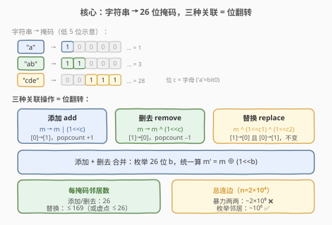
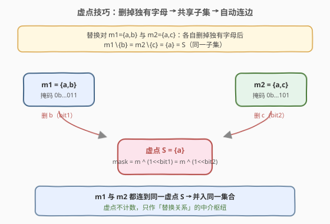
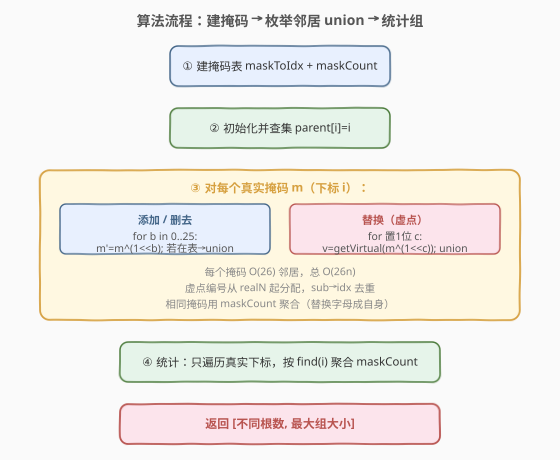
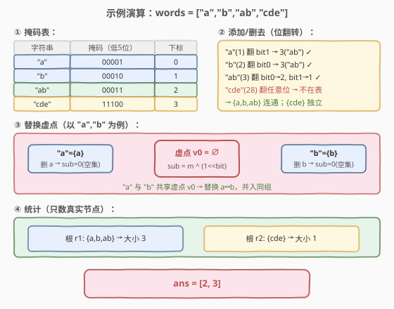

# LeetCode 字符串分组 题解

## 1. 题目概述

- **标题 / 题号**：字符串分组（#2157，hard）
- **链接**：https://leetcode.cn/problems/groups-of-strings/
- **难度**：困难
- **标签**：并查集、位运算、哈希表、字符串

**题意**：给定下标从 0 开始的字符串数组 `words`，每个字符串只含小写字母，且**每个字母至多出现一次**。如果通过下列三种操作之一能从 `s1` 的字母集合得到 `s2` 的字母集合，则称 `s1` 与 `s2` **关联**：

1. **添加**一个字母到 `s1` 的字母集合；
2. **删去** `s1` 字母集合中的一个字母；
3. **替换**：把 `s1` 中的一个字母换成任意另一个字母（**也可以换成它本身**）。

把 `words` 划分为若干无交集的**组**：关联的字符串必须同组，且分好后任一组内的字符串都不与其他组的字符串关联（可以证明此条件下分组方案唯一）。返回 `ans = [总组数, 最大组的大小]`。

**示例 1**：

```text
输入：words = ["a","b","ab","cde"]
输出：[2,3]
解释：
- "a" 与 "b" 关联（'a' 换成 'b'），与 "ab" 关联（添加 'b'）
- "b" 与 "ab" 关联（添加 'a'）
- "cde" 与其他字符串都不关联
所以分两组：["a","b","ab"] 和 ["cde"]，最大组大小 3。
```

**示例 2**：

```text
输入：words = ["a","ab","abc"]
输出：[1,3]
解释：三者互相关联，全在同一组，最大组大小 3。
```

**约束**：

- $1 \le$ `words.length` $\le 2 \times 10^4$
- $1 \le$ `words[i].length` $\le 26$
- `words[i]` 只含小写字母，且每个字母最多出现一次

> 💡 本题的难点不在「关联」的定义，而在**关联对数太多**：$n = 2\times 10^4$ 时两两配对约 $2\times 10^8$ 对，直接建图会超时。突破口是「每个字母至多出现一次」——这让我们能用 **26 位掩码**表示每个字符串，于是三种关联操作全部退化为**位翻转**，每个掩码只需枚举 $O(26)$ 个邻居即可连边，再配合一个巧妙的**虚点技巧**把「替换」也降到 $O(26)$。

## 2. 解题思路

### 2.1 暴力思路：两两判断关联

最直接的做法：把每个字符串转成字母集合，对任意 $i < j$ 判断 `words[i]` 与 `words[j]` 是否关联（看两种集合的大小差与差集）：

```text
for i in range(n):
    for j in range(i+1, n):
        if associated(set(words[i]), set(words[j])):
            union(i, j)
```

时间 $O(n^2 \cdot L)$，$n = 2\times 10^4$ 时约 $2\times 10^8$ 对，每对还要算集合运算，**超时**。

> ⚠️ 暴力的浪费在于：它**按位置**枚举配对，却忽略了「关联」本质是**按掩码邻接**的——一个掩码只与「翻转少数几位」得到的掩码关联，邻居极少（至多 $26 + 169$ 个），而非 $n$ 个。把「枚举所有配对」换成「枚举每个掩码的所有位翻转邻居」即可把 $O(n^2)$ 降到 $O(n \cdot 26)$。

### 2.2 核心观察：26 位掩码 + 位翻转邻居



**第一步：字符串压成 26 位掩码。** 由于每个字母至多出现一次，第 $c$ 位为 1 当且仅当字母 $c$ 出现。例：`"ab"` → `...0011`（bit0、bit1 为 1），`"cde"` → `...11100`（bit2、bit3、bit4 为 1）。掩码天然就是字母集合的紧凑表示。

**第二步：三种关联操作 = 位翻转。**

| 操作 | 掩码变化 | popcount 变化 | 邻居枚举 |
|------|----------|--------------|----------|
| 添加一个字母 `c` | `m → m \| (1<<c)`（0→1） | $+1$ | 枚举 26 个位翻转 |
| 删去一个字母 `c` | `m → m ^ (1<<c)`（1→0） | $-1$ | 同上（翻转已置位） |
| 替换 `c1 → c2` | `m → m ^ (1<<c1) ^ (1<<c2)` | 不变 | 枚举「置1位 × 清0位」 |

> 💡 **添加 / 删去可以合并**：两者都是「翻转某一位」。对掩码 $m$，枚举 26 个位 $b$，计算 $m' = m \oplus (1\ll b)$：若 $b$ 原本为 0 则是添加，若原本为 1 则是删去。只要 $m'$ 在 `words` 中出现，就 `union(m, m')`。这一趟枚举覆盖所有「添加 / 删去」关联，每掩码 $O(26)$。

> ⚠️ **替换不能合并进单次翻转**：替换要同时翻转两位（一清一置），是「双翻转」。若直接枚举，需对每个置 1 位 $c_1$ 与每个清 0 位 $c_2$ 组合，共 $\text{popcount}(m)\times(26-\text{popcount}(m))$ 个，最坏 $13\times13=169$ 个邻居。虽然 $169n \approx 3.4\times10^6$ 也能过，但下面有个更优雅的 $O(26)$ 做法。

### 2.3 关键优化：虚点技巧把「替换」降到 O(26)



观察替换的本质：若 $m_1$ 与 $m_2$ 互为替换（$m_1$ 有 $c_1$、$m_2$ 有 $c_2$，其余字母相同），则**各自删掉那个独有字母后，剩下的子集完全相同**：

$$m_1 \setminus \{c_1\} \;=\; m_2 \setminus \{c_2\} \;=\; S$$

也就是说 $m_1 = S \cup \{c_1\}$，$m_2 = S \cup \{c_2\}$。于是我们可以引入一个**虚拟节点**代表子集 $S$：对每个掩码 $m$ 的每个置 1 位 $c$，算出 `sub = m ^ (1<<c)`（即 $m \setminus \{c\}$），把 $m$ 与「`sub` 对应的虚点」连边。

这样一来，所有形如 $S \cup \{\text{一个字母}\}$ 的掩码都会连到同一个虚点 $S$ 上，从而被并入同一集合——而它们两两之间恰是替换关系！

> 💡 **为什么不会误连？** 与同一虚点 $S$ 相连的掩码都是 $S\cup\{c\}$ 的形式，任意两个 $S\cup\{c_1\}$ 与 $S\cup\{c_2\}$：若 $c_1=c_2$ 则是同一掩码（替换字母成自身，本就关联）；若 $c_1\neq c_2$ 则是合法替换对。**绝不产生非关联的边**，且并查集的传递闭包与「替换关系的连通」完全一致。

> ⚠️ 虚点**只参与连边、不参与计数**：统计组数与组大小时只看真实掩码节点。虚点的编号从 `realN` 起分配，用哈希表 `sub → 虚点下标` 去重（同一个 `sub` 复用同一虚点）。

**复杂度对比**：

| 做法 | 每掩码邻居数 | 总连边数（$n=2\times10^4$） |
|------|-------------|---------------------------|
| 暴力两两配对 | $n$ | $\sim 2\times10^8$ |
| 直接枚举替换 | $26 + 169$ | $\sim 3.4\times10^6$ |
| **虚点技巧** | $26 + 26$ | $\sim 1\times10^6$ |

### 2.4 算法流程图



**完整步骤**：

1. **建掩码表**：遍历 `words`，把每个字符串转成 26 位掩码 `m`；用哈希表 `maskToIdx` 给每个不同掩码分配一个真实下标，并用 `maskCount[i]` 记录该掩码出现的次数（相同字母集合的字符串互相关联，同属一组）。
2. **初始化并查集**：大小 `realN + realN*26 + 5`（真实节点 + 虚点余量），`parent[i] = i`。
3. **枚举邻居连边**：对每个真实掩码 $m$（下标 $i$）：
   - **添加 / 删去**：对 $b \in [0,26)$，令 $m' = m \oplus (1\ll b)$；若 $m'$ 在 `maskToIdx` 中，`union(i, maskToIdx[m'])`。
   - **替换（虚点）**：对每个置 1 位 $c$，令 `sub = m ^ (1<<c)`；取/建虚点 `v = getVirtual(sub)`，`union(i, v)`。
4. **统计答案**：对每个真实下标 $i$，找根 `find(i)`，把 `maskCount[i]` 累加到该根的组大小上；**组数** = 不同根的个数，**最大组** = 组大小最大值。

### 2.5 示例演算

以 `words = ["a","b","ab","cde"]` 为例：



**第一步：建掩码表**

| 字符串 | 掩码 `m`（二进制） | `maskCount` | 真实下标 |
|--------|-------------------|------------|---------|
| "a" | `000...0001` | 1 | 0 |
| "b" | `000...0010` | 1 | 1 |
| "ab" | `000...0011` | 1 | 2 |
| "cde" | `000...11100` | 1 | 3 |

**第二步：枚举位翻转邻居（添加/删去）**

| 掩码 $m$ | 翻转位 $b$ | $m' = m\oplus(1\ll b)$ | 在表中? | 动作 |
|----------|-----------|----------------------|--------|------|
| 1（"a"） | bit1 | 3（"ab"） | ✅ | `union(0,2)` |
| 2（"b"） | bit0 | 3（"ab"） | ✅ | `union(1,2)` |
| 3（"ab"） | bit0 | 2（"b"） | ✅ | `union(2,1)` |
| 3（"ab"） | bit1 | 1（"a"） | ✅ | `union(2,0)` |
| 28（"cde"） | 任意 | — | ❌ | 无 |

此时 `{a,b,ab}` 已连成一团，`{cde}` 独立。

**第三步：替换虚点**（以 "a"、"b" 为例）

| 掩码 $m$ | 删位 $c$ | `sub = m ^ (1<<c)` | 虚点 |
|----------|---------|-------------------|------|
| 1（"a"={a}） | bit0（a） | 0（空集 $S=\emptyset$） | v0 |
| 2（"b"={b}） | bit1（b） | 0（空集 $S=\emptyset$） | v0 |

"a" 与 "b" 都连到虚点 `v0`（代表空集），即替换 a↔b，并入同组——与第二步结果一致。`"cde"` 的各 `sub` 不与任何其他掩码共享虚点，保持独立。

**第四步：统计**

| 根 | 真实成员 | 组大小 | 组数贡献 |
|----|---------|--------|---------|
| r1 | {a,b,ab} | 3 | 1 |
| r2 | {cde} | 1 | 1 |

返回 `[2, 3]`，与示例一致。

> 💡 注意 `"a"` 与 `"b"` 的掩码 popcount 相同（都是 1）、汉明距离为 2，是**替换**关系——单靠「添加/删去」的位翻转连不上它们（翻转一位得 0 或 3，都不在表中），必须靠替换虚点或直接枚举双翻转。本例中它们通过 `"ab"` 间接连通，但若 `words = ["a","b"]`（没有 `"ab"`），就只能靠替换虚点把两者连起来了。

## 3. 参考代码

### C++

```cpp
// 字符串分组.cpp —— 26 位掩码 + 并查集 + 虚点处理替换
// 编译: g++ -O2 -std=c++17 字符串分组.cpp -o groups
#include <vector>
#include <string>
#include <unordered_map>
using namespace std;

class Solution {
  public:
    vector<int> groupStrings(vector<string>& words) {
        unordered_map<int,int> maskToIdx;   // 掩码 -> 真实下标
        vector<int> masks;                  // 真实下标 -> 掩码
        vector<int> maskCount;              // 真实下标 -> 该掩码的词数

        for (auto& w : words) {
            int m = 0;
            for (char c : w) m |= 1 << (c - 'a');
            auto it = maskToIdx.find(m);
            if (it != maskToIdx.end()) {
                maskCount[it->second]++;
            } else {
                maskToIdx[m] = masks.size();
                masks.push_back(m);
                maskCount.push_back(1);
            }
        }
        int realN = masks.size();

        // 并查集：真实节点 [0, realN) + 虚点 [realN, realN + realN*26)
        int total = realN + realN * 26 + 5;
        vector<int> parent(total);
        for (int i = 0; i < total; i++) parent[i] = i;

        auto find = [&](int x) {
            while (parent[x] != x) {
                parent[x] = parent[parent[x]];   // 路径压缩（隔代压缩）
                x = parent[x];
            }
            return x;
        };
        auto unite = [&](int x, int y) {
            int rx = find(x), ry = find(y);
            if (rx != ry) parent[rx] = ry;
        };

        unordered_map<int,int> virtualIdx;   // sub 掩码 -> 虚点下标
        int nextVirtual = realN;
        auto getVirtual = [&](int sub) -> int {
            auto it = virtualIdx.find(sub);
            if (it != virtualIdx.end()) return it->second;
            int idx = nextVirtual++;
            virtualIdx[sub] = idx;
            return idx;
        };

        for (int i = 0; i < realN; i++) {
            int m = masks[i];
            // 添加 / 删去：翻转每一位
            for (int b = 0; b < 26; b++) {
                int m2 = m ^ (1 << b);
                auto it = maskToIdx.find(m2);
                if (it != maskToIdx.end()) unite(i, it->second);
            }
            // 替换：删掉每个置 1 位得到 sub，连虚点
            for (int b = 0; b < 26; b++) {
                if (m & (1 << b)) {
                    int v = getVirtual(m ^ (1 << b));
                    unite(i, v);
                }
            }
        }

        // 统计：只看真实节点，虚点不计数
        unordered_map<int,int> groupSize;
        for (int i = 0; i < realN; i++) {
            groupSize[find(i)] += maskCount[i];
        }
        int groups = groupSize.size();
        int maxSize = 0;
        for (auto& [r, sz] : groupSize) maxSize = max(maxSize, sz);
        return {groups, maxSize};
    }
};
```

### Python

```python
class Solution:
    def groupStrings(self, words: List[str]) -> List[int]:
        from collections import Counter

        # 1. 建掩码表
        cnt = Counter()
        for w in words:
            m = 0
            for c in w:
                m |= 1 << (ord(c) - 97)
            cnt[m] += 1
        masks = list(cnt.keys())
        realN = len(masks)
        maskToIdx = {m: i for i, m in enumerate(masks)}

        # 2. 并查集（含虚点余量）
        total = realN + realN * 26 + 5
        parent = list(range(total))

        def find(x):
            while parent[x] != x:
                parent[x] = parent[parent[x]]   # 隔代压缩
                x = parent[x]
            return x

        def unite(x, y):
            rx, ry = find(x), find(y)
            if rx != ry:
                parent[rx] = ry

        virtualIdx = {}
        next_virtual = realN

        def get_virtual(sub):
            nonlocal next_virtual
            if sub in virtualIdx:
                return virtualIdx[sub]
            idx = next_virtual
            next_virtual += 1
            virtualIdx[sub] = idx
            return idx

        # 3. 枚举邻居连边
        for i, m in enumerate(masks):
            # 添加 / 删去
            for b in range(26):
                j = maskToIdx.get(m ^ (1 << b))
                if j is not None:
                    unite(i, j)
            # 替换（虚点）
            for b in range(26):
                if m & (1 << b):
                    unite(i, get_virtual(m ^ (1 << b)))

        # 4. 统计：只数真实节点
        group_size = Counter()
        for i, m in enumerate(masks):
            group_size[find(i)] += cnt[m]
        return [len(group_size), max(group_size.values())]
```

> 💡 **实现细节**：① 同一掩码可能出现多次（如 `["a","a"]`），它们互相关联（替换字母成自身），用 `maskCount` 聚合，真实下标只建一个，统计时把词数加到根上。② 虚点编号从 `realN` 起，用哈希表 `sub → idx` 去重——同一个子集 $S$ 复用同一虚点，这正是「替换对」能被连起来的关键。③ 并查集只做 `parent[rx]=ry`（随便挂）即可，本题不卡常数；如需更稳可加按秩合并。④ 统计时**只遍历真实下标**，虚点自然被忽略。

## 4. 复杂度分析

| 维度 | 复杂度 | 说明 |
|------|--------|------|
| **时间复杂度** | $O(n \cdot 26 \cdot \alpha)$ | 每个真实掩码枚举 26 个位翻转（添加/删去）+ 26 个删位虚点（替换），共 $O(26n)$ 次 `union/find`，每次均摊 $O(\alpha)$；统计 $O(n)$。$\alpha \le 5$ 视为常数 |
| **空间复杂度** | $O(n \cdot 26)$ | 并查集 `parent` 预分配 `realN + realN*26`；`maskToIdx`、`virtualIdx` 各 $O(n)$。`realN ≤ n` |

> ⚠️ 真实掩码数 `realN ≤ n = 2×10^4`，`parent` 数组至多约 $5.4\times10^5$ 个 `int`（C++ 约 2MB，Python 列表约 4MB），可接受。若想更省，可把虚点改用动态哈希映射的下标而不预分配——但预分配实现更简单且足够。

## 5. 扩展：直接枚举双翻转替换

虚点技巧虽优雅，但「直接枚举替换对」更直白、无需引入虚拟节点，$169n$ 也完全能过。把替换那段换成：

```cpp
// 替换：枚举「置1位 c1」×「清0位 c2」
for (int c1 = 0; c1 < 26; c1++) {
    if (!(m & (1 << c1))) continue;
    for (int c2 = 0; c2 < 26; c2++) {
        if (m & (1 << c2)) continue;        // c2 必须未置位
        int m2 = (m ^ (1 << c1)) | (1 << c2);   // 删 c1、加 c2
        auto it = maskToIdx.find(m2);
        if (it != maskToIdx.end()) unite(i, it->second);
    }
}
```

此时并查集只需 `realN` 大小，无需虚点。每掩码最坏 169 次查询，总 $\sim 3.4\times10^6$，仍远低于时限。

**两种替换处理对比**：

| 做法 | 每掩码替换邻居 | 需虚点 | 总连边 | 优点 |
|------|---------------|--------|--------|------|
| 直接枚举双翻转 | $\le 169$ | 否 | $\sim 3.4\times10^6$ | 直白易懂 |
| **虚点技巧** | $= \text{popcount} \le 26$ | 是 | $\sim 5.2\times10^5$ | 更快、思路巧妙 |

> 💡 虚点技巧的本质是「**把二元关系降解为一元中介**」：替换是两位同时变，直接枚举要两重循环；引入「删一位后的子集」作中介，两位变化各对应一次「删一位」，于是二元关系变成两个一元关系共享同一中介。这种「以中间状态为枢纽」的思路在图论建模中很常见（如 952 用公因数作枢纽连数对）。

## 6. 面试要点

1. **为什么能把字符串压成 26 位掩码？**

   - 题目保证「每个字母至多出现一次」，即字母集合无重复元素，26 个小写字母正好对应 26 个位。掩码既唯一编码字母集合，又让「添加/删去」退化为单次位翻转、「替换」退化为两次位翻转，把字符级操作转为高效的位运算。

2. **添加和删去为什么能合并成一次枚举？**

   - 二者都翻转某一位：清 0 位变 1 是添加，置 1 位变 0 是删去。对掩码 $m$ 枚举 26 个位 $b$，统一计算 $m' = m\oplus(1\ll b)$，只要 $m'$ 在表中就 `union`。一趟枚举同时覆盖两类操作，每掩码 $O(26)$。

3. **虚点技巧为什么不会把不关联的字符串误连？**

   - 与同一虚点 $S$ 相连的掩码都是 $S\cup\{c\}$ 形式。任取两个 $S\cup\{c_1\}$、$S\cup\{c_2\}$：若 $c_1=c_2$ 是同一掩码（替换字母成自身，本就关联）；若 $c_1\neq c_2$ 则是合法替换对。因此**绝不产生非关联的边**，并查集的连通恰好等于「替换关系的传递闭包」。

4. **统计组数和组大小时为什么只看真实节点？**

   - 虚点只是连边的「中介」，不对应任何真实字符串。若把虚点也算作组，会把多个本应合并的真实组错误地各自计上虚点。因此 `find` 只对真实下标 $i \in [0, \text{realN})$ 调用，组大小按 `maskCount[i]` 累加，组数 = 真实节点不同根的个数。

5. **相同掩码的多个字符串怎么处理？**

   - 题目允许「替换字母成自身」，所以相同字母集合的字符串互相关联，必同组。用 `maskCount` 聚合同掩码的词数，真实下标只建一个，统计时把词数加到所在根——既避免重复连边，又正确计入组大小。

> 💡 **一句话总结**：2157 是「**位掩码 + 并查集 + 枚举邻居**」的招牌困难题——把字符串压成 26 位掩码后，关联退化为位翻转，每掩码只枚举 $O(26)$ 个邻居即可连边；替换关系用「删一位后的子集作虚点」巧妙降解为 $O(26)$。核心思想是「**别按位置两两配对，按值域枚举邻居**」，与 952（按公因数连数对）同属「枚举邻居代替全配对」范式。

## 同类练习题

| # | 题目 | 与本题的关联 |
|---|------|-------------|
| 547 | [省份数量](https://leetcode.cn/problems/number-of-provinces/)（[题解](../0501-0600/547_省份数量.md)） | 并查集模板入门，本题的并查集基础 |
| 684 | [冗余连接](https://leetcode.cn/problems/redundant-connection/)（[题解](../0601-0700/684_冗余连接.md)） | 并查集判环，加边时两端已同根即冗余，巩固 union/find |
| 952 | [按公因数计算连通分量大小](https://leetcode.cn/problems/largest-component-size-by-common-factor/) | 同样「枚举邻居（因数）代替全配对」+ 并查集，本题的姐妹题，用公因数作枢纽连数对 |
| 721 | [账户合并](https://leetcode.cn/problems/accounts-merge/) | 并查集合并同名账户下邮箱，字符串→节点映射思路相通 |
| 990 | [等式方程的可满足性](https://leetcode.cn/problems/satisfiability-of-equality-equations/) | 先 union 等式再查不等式，并查集连通性判定 |
