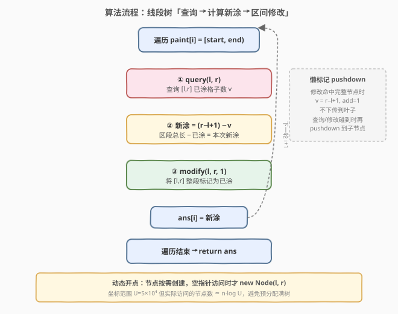
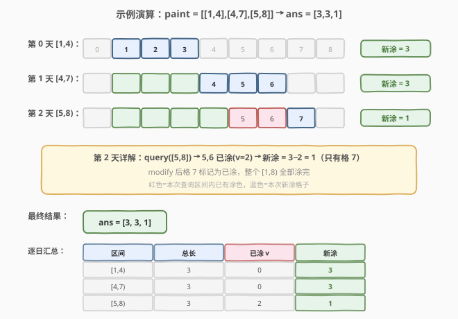

# 每天绘制新区域的数量

- **题目名称**：每天绘制新区域的数量
- **链接**：[2158. 每天绘制新区域的数量](https://leetcode.cn/problems/amount-of-new-area-painted-each-day/)
- **难度**：困难
- **标签**：线段树、区间更新、懒标记、有序集合

## 1. 题目概述

有一幅细长的画，可以用数轴表示。给定长度为 $n$、下标从 $0$ 开始的二维整数数组 `paint`，其中 `paint[i] = [start_i, end_i]` 表示在第 $i$ 天绘制 `start_i` 到 `end_i` 之间的区域。多次绘制同一区域会导致不均匀，因此每个区域**最多只能绘制一次**。返回长度为 $n$ 的整数数组 `worklog`，其中 `worklog[i]` 是第 $i$ 天绘制的**新**区域数量。

**示例 1**：

```text
输入：paint = [[1,4],[4,7],[5,8]]
输出：[3,3,1]
解释：
- 第 0 天画 [1,4)，新涂 = 4−1 = 3
- 第 1 天画 [4,7)，新涂 = 7−4 = 3
- 第 2 天画 [5,8)，其中 [5,7) 已在第 1 天涂过，新涂 = 8−7 = 1
```

**示例 2**：

```text
输入：paint = [[1,4],[5,8],[4,7]]
输出：[3,3,1]
解释：
- 第 0 天画 [1,4)，新涂 = 3
- 第 1 天画 [5,8)，新涂 = 3
- 第 2 天画 [4,7)，其中 [5,7) 已在第 1 天涂过，新涂 = 7−5... 实为 5−4 = 1
```

**示例 3**：

```text
输入：paint = [[1,5],[2,4]]
输出：[4,0]
解释：
- 第 0 天画 [1,5)，新涂 = 4
- 第 1 天画 [2,4)，全部已涂，新涂 = 0
```

**约束条件**：

- $1 \le$ `paint.length` $\le 10^5$
- `paint[i].length == 2`
- $0 \le$ `start_i` $<$ `end_i` $\le 5 \times 10^4$

> 💡 本题是经典的「**区间涂色 + 区间查询已涂量**」问题。坐标范围 $U \le 5 \times 10^4$，每天需要快速回答「`[start, end)` 中有多少格子已涂」，再将整段标记为已涂——这正是**线段树 + 懒标记**的招牌场景：区间查询 $O(\log U)$、区间修改 $O(\log U)$，总计 $O(n \log U)$。

---

## 2. 解题思路

### 2.1 暴力思路：逐格标记

最直观的做法：用一个布尔数组 `painted[0..U]` 标记每个单位格是否已涂。对每天的 `[start, end)`，逐格扫描统计未涂数量，再把整段置为已涂。

```text
painted = [False] * (U+1)
for each [start, end) in paint:
    new = 0
    for x in range(start, end):
        if not painted[x]:
            new += 1
            painted[x] = True
    ans.append(new)
```

时间 $O(n \cdot L)$，其中 $L$ 为平均区间长度。最坏情况 $n = 10^5$、$L = 5 \times 10^4$，约 $5 \times 10^9$ 次操作，**超时**。

> ⚠️ 暴力的瓶颈：逐格遍历无法跳过**已涂的连续段**。突破口是引入能「整段标记、整段查询」的数据结构——线段树把区间操作从 $O(L)$ 压到 $O(\log U)$。

### 2.2 核心观察：线段树 + 懒标记


关键直觉：将数轴上每个整数点 $x$ 视为一个单位格 $[x, x+1)$。`paint[i] = [start, end)` 意味着涂 `start` 到 `end−1` 共 `end − start` 个格子。线段树节点维护两个信息：

| 字段 | 含义 |
|------|------|
| `v` | 该节点代表的区间内**已涂格子数** |
| `add` | 懒标记：非零表示该区间已被整段标记为已涂，尚未下传到子节点 |

每天的操作分三步：

1. **查询** `query(l, r)`：返回 $[l, r]$ 内已涂格子数 $v$。
2. **计算**：新涂 $= (r - l + 1) - v$（区段总长减去已涂）。
3. **修改** `modify(l, r, 1)`：将 $[l, r]$ 整段标记为已涂。

> 💡 **懒标记的威力**：`modify` 命中某个完整节点时，直接设 `v = r−l+1`（整段已涂）、`add = 1`（标记待下传），**不递归到叶子**。后续 `query` 或 `modify` 碰到该节点时才 `pushdown`——将标记下传给左右子节点。这保证每次操作只访问 $O(\log U)$ 个节点。

> ⚠️ **坐标偏移**：`start_i` 可为 $0$，为避免 $0$ 号节点歧义，实现时令 $l = \text{start}+1$、$r = \text{end}$，线段树范围 $[1, 5 \times 10^4]$。此时 $r - l + 1 = \text{end} - \text{start}$，恰好等于区间长度。

### 2.3 算法流程图



**完整步骤**：

1. **初始化**线段树，根节点代表区间 $[1, 10^5+10]$（留余量），所有 `v = 0`、`add = 0`。
2. **遍历** `paint` 数组，对每个 `[start, end)`：
   - 令 $l = \text{start}+1$，$r = \text{end}$。
   - $v = \text{query}(l, r)$：查询已涂格子数。
   - $\text{ans}[i] = (r - l + 1) - v$。
   - $\text{modify}(l, r, 1)$：标记整段已涂。
3. 返回 `ans`。

> 💡 **动态开点**：坐标范围虽达 $5 \times 10^4$，但实际操作的区间数 $n \le 10^5$。采用**动态开点**线段树——节点按需创建（`pushdown` 时若子节点为空才 `new Node`），避免预分配 $4U$ 个节点的空间浪费。实际创建的节点数 $\approx O(n \log U)$。

### 2.4 示例演算

以 `paint = [[1,4],[4,7],[5,8]]` 为例：



| 天 | 区间 | $l, r$ | 总长 $r-l+1$ | 已涂 $v$ | 新涂 |
|----|------|--------|-------------|---------|------|
| 0 | $[1,4)$ | $l=2, r=4$ | 3 | 0 | 3 |
| 1 | $[4,7)$ | $l=5, r=7$ | 3 | 0 | 3 |
| 2 | $[5,8)$ | $l=6, r=8$ | 3 | 2 | 1 |

**第 0 天**：$[2,4]$ 全未涂，$v=0$，新涂 $= 3−0 = 3$，标记 $[2,4]$ 已涂。

**第 1 天**：$[5,7]$ 全未涂，$v=0$，新涂 $= 3−0 = 3$，标记 $[5,7]$ 已涂。

**第 2 天**：查询 $[6,8]$，其中 $6,7$ 已涂（第 1 天标记），$v=2$，新涂 $= 3−2 = 1$（只有格 $8$）。标记 $[6,8]$ 已涂，至此 $[1,8)$ 全部涂完。

> 💡 注意示例 2 中区间顺序变为 `[[1,4],[5,8],[4,7]]`——第 2 天的 $[4,7)$ 与第 1 天的 $[5,8)$ 部分重叠，结果仍为 $[3,3,1]$。这说明**涂色顺序不影响线段树的正确性**：每次查询如实返回当前已涂状态。

---

## 3. 参考代码

### C++

```cpp
// 2158. 每天绘制新区域的数量.cpp —— 线段树 + 懒标记（动态开点）
// 编译: g++ -O2 -std=c++17 2158.cpp -o painted
#include <vector>
using namespace std;

class Node {
  public:
    Node* left;
    Node* right;
    int l, r, mid;
    int v;    // 区间内已涂格子数
    int add;  // 懒标记

    Node(int l, int r) : l(l), r(r), mid((l + r) >> 1) {
        left = right = nullptr;
        v = add = 0;
    }
};

class SegmentTree {
    Node* root;

  public:
    SegmentTree() {
        root = new Node(1, 100010);  // 坐标范围 [1, 5e4+余量]
    }

    void modify(int l, int r, int v) {
        modify(l, r, v, root);
    }

    int query(int l, int r) {
        return query(l, r, root);
    }

  private:
    void modify(int l, int r, int v, Node* node) {
        if (l > r) return;
        if (node->l >= l && node->r <= r) {
            node->v = node->r - node->l + 1;  // 整段已涂
            node->add = v;
            return;
        }
        pushdown(node);
        if (l <= node->mid) modify(l, r, v, node->left);
        if (r > node->mid)  modify(l, r, v, node->right);
        pushup(node);
    }

    int query(int l, int r, Node* node) {
        if (l > r) return 0;
        if (node->l >= l && node->r <= r) return node->v;
        pushdown(node);
        int v = 0;
        if (l <= node->mid) v += query(l, r, node->left);
        if (r > node->mid)  v += query(l, r, node->right);
        return v;
    }

    void pushup(Node* node) {
        node->v = node->left->v + node->right->v;
    }

    void pushdown(Node* node) {
        if (!node->left)  node->left = new Node(node->l, node->mid);
        if (!node->right) node->right = new Node(node->mid + 1, node->r);
        if (node->add) {
            node->left->v = node->left->r - node->left->l + 1;
            node->right->v = node->right->r - node->right->l + 1;
            node->left->add = node->add;
            node->right->add = node->add;
            node->add = 0;
        }
    }
};

class Solution {
  public:
    vector<int> amountPainted(vector<vector<int>>& paint) {
        SegmentTree tree;
        int n = paint.size();
        vector<int> ans(n);
        for (int i = 0; i < n; ++i) {
            int l = paint[i][0] + 1;  // 1-indexed
            int r = paint[i][1];
            int v = tree.query(l, r);
            ans[i] = (r - l + 1) - v;
            tree.modify(l, r, 1);
        }
        return ans;
    }
};
```

### Python

```python
class Node:
    def __init__(self, l, r):
        self.left = None
        self.right = None
        self.l = l
        self.r = r
        self.mid = (l + r) >> 1
        self.v = 0       # 区间内已涂格子数
        self.add = 0     # 懒标记


class SegmentTree:
    def __init__(self):
        self.root = Node(1, 10**5 + 10)

    def modify(self, l, r, v, node=None):
        if l > r:
            return
        if node is None:
            node = self.root
        if node.l >= l and node.r <= r:
            node.v = node.r - node.l + 1   # 整段已涂
            node.add = v
            return
        self.pushdown(node)
        if l <= node.mid:
            self.modify(l, r, v, node.left)
        if r > node.mid:
            self.modify(l, r, v, node.right)
        self.pushup(node)

    def query(self, l, r, node=None):
        if l > r:
            return 0
        if node is None:
            node = self.root
        if node.l >= l and node.r <= r:
            return node.v
        self.pushdown(node)
        v = 0
        if l <= node.mid:
            v += self.query(l, r, node.left)
        if r > node.mid:
            v += self.query(l, r, node.right)
        return v

    def pushup(self, node):
        node.v = node.left.v + node.right.v

    def pushdown(self, node):
        if node.left is None:
            node.left = Node(node.l, node.mid)
        if node.right is None:
            node.right = Node(node.mid + 1, node.r)
        if node.add:
            left, right = node.left, node.right
            left.v = left.r - left.l + 1
            right.v = right.r - right.l + 1
            left.add = node.add
            right.add = node.add
            node.add = 0


class Solution:
    def amountPainted(self, paint: List[List[int]]) -> List[int]:
        tree = SegmentTree()
        ans = []
        for start, end in paint:
            l, r = start + 1, end        # 1-indexed
            v = tree.query(l, r)
            ans.append(r - l + 1 - v)
            tree.modify(l, r, 1)
        return ans
```

> 💡 **实现细节**：① **动态开点**：`pushdown` 中若 `left`/`right` 为 `None` 才创建子节点，避免预分配满树。② **懒标记语义**：`add` 非零表示该节点已整段涂色但未下传；`pushdown` 时将 `v` 设为子节点区间长度（整段已涂），并将 `add` 传递给子节点。③ **坐标偏移**：`l = start + 1` 避免 $0$ 号节点歧义，`r = end` 保证 $r - l + 1 = \text{end} - \text{start}$。

---

## 4. 复杂度分析

| 维度 | 复杂度 | 说明 |
|------|--------|------|
| **时间复杂度** | $O(n \log U)$ | 每天 1 次 `query` + 1 次 `modify`，各 $O(\log U)$；$U = 5 \times 10^4$，$\log U \approx 16$ |
| **空间复杂度** | $O(n \log U)$ | 动态开点线段树，实际创建节点数 $\approx O(n \log U)$；每个节点 $O(1)$ |

> ⚠️ 若用预分配数组实现线段树（`tree[4*U]`），空间为 $O(U) = O(5 \times 10^4)$，常数更小但不够灵活。本题 $U$ 不大，两种实现均可。

---

## 5. 扩展：并查集跳过已涂格子

线段树虽标准，但本题还有更巧妙的**并查集**解法——利用「每个格子最多被涂一次」的性质，用并查集「跳过」已涂的连续段。

**核心思想**：定义 `find(x)` 返回 $\geq x$ 的**第一个未涂格子**。涂色 `[start, end)` 时，从 `pos = find(start)` 开始，若 `pos < end` 则标记 `pos` 为已涂、`union(pos, pos+1)`（即令 `parent[pos] = find(pos+1)`），跳到下一个未涂格子。每个格子只被涂一次，总跳格次数 $\leq U$。

```cpp
class Solution {
  public:
    vector<int> amountPainted(vector<vector<int>>& paint) {
        int U = 50001;
        vector<int> parent(U + 2);
        for (int i = 0; i <= U + 1; ++i) parent[i] = i;

        function<int(int)> find = [&](int x) -> int {
            if (parent[x] != x) parent[x] = find(parent[x]);
            return parent[x];
        };

        vector<int> ans;
        for (auto& p : paint) {
            int start = p[0], end = p[1];
            int cnt = 0;
            int pos = find(start);
            while (pos < end) {
                cnt++;
                parent[pos] = find(pos + 1);  // 跳到下一个未涂格
                pos = find(pos);               // 等价于 find(pos+1)
            }
            ans.push_back(cnt);
        }
        return ans;
    }
};
```

| 实现 | 时间 | 空间 | 特点 |
|------|------|------|------|
| 线段树 + 懒标记 | $O(n \log U)$ | $O(n \log U)$ | 通用区间操作，支持任意区间查询/修改 |
| 并查集 | $O(n + U\alpha(U))$ | $O(U)$ | 利用「每格只涂一次」特性，常数极小，但不支持撤销 |

> 💡 并查集的时间复杂度分析：每次涂色跳到的格子必是首次涂色（已涂格子被 `union` 跳过），故总跳格次数 $\leq U$。加上路径压缩，总时间 $O(n + U\alpha(U))$，近似 $O(n + U)$。本题 $U = 5 \times 10^4$，远小于 $n \log U$，是更优的选择。

---

## 6. 面试要点

1. **为什么用线段树而不是前缀和？**

   - 前缀和适用于**静态**数组（不支持修改）。本题每天都会修改数轴状态（标记新涂格子），是**动态**区间查询问题。线段树支持 $O(\log U)$ 的区间查询 + 区间修改，前缀和每次修改需 $O(U)$ 重建，总计 $O(nU)$ 超时。

2. **懒标记的作用是什么？如果没有会怎样？**

   - 懒标记让 `modify` 命中完整节点时**不必递归到叶子**——直接设 `v = r−l+1`（整段已涂）并打上 `add` 标记，后续操作碰到时才 `pushdown`。若无懒标记，每次 `modify` 需更新区间内每个叶子，退化为 $O(L)$，与暴力相同。懒标记将单次修改从 $O(U)$ 压到 $O(\log U)$。

3. **动态开点 vs 预分配数组，如何选择？**

   - 动态开点：按需创建节点，空间 $O(n \log U)$，适合坐标范围大但实际操作少的场景。预分配数组：空间 $O(4U)$，适合 $U$ 已知且不大（如本题 $U = 5 \times 10^4$）。面试中预分配更简洁，动态开点更通用——先说预分配方案，再提动态开点作为大值域优化。

4. **并查集解法为什么也成立？它和线段树各有什么优劣？**

   - 并查集利用「每格只涂一次」的特性：涂色后 `union(pos, pos+1)` 让 `find` 自动跳过已涂段。每个格子只被处理一次，总时间 $O(n + U\alpha(U))$。优势：常数极小、实现简单；劣势：**不支持撤销**（涂色不可逆），且只适用于「每个位置只修改一次」的场景。线段树更通用，支持任意区间操作。

5. **如果坐标范围扩大到 $10^9$ 怎么办？**

   - 线段树需改为**离散化 + 动态开点**：先将所有 `start_i`、`end_i` 排序去离散化为 $2n$ 个端点，线段树在离散化后的 $O(n)$ 个区间上操作。并查集则不适用（`parent` 数组过大）。另一种思路是用**有序集合**（C++ 的 `std::set` / Python 的 `sortedcontainers`）维护未涂区间的并集，每次用 `lower_bound` 找重叠区间并分裂。

> 💡 **一句话总结**：2158 是「区间涂色 + 区间查询」的招牌题——线段树 + 懒标记是通用解法，并查集是利用特殊性质的巧解。核心都是把「逐格扫描」升级为「整段操作」，将 $O(L)$ 压缩到 $O(\log U)$ 或 $O(\alpha)$。

---

## 7. 同类练习题

- [715. Range 模块](https://leetcode.cn/problems/range-module/)：线段树 / 有序集合维护半开区间集合，支持 add/rangeQuery/remove，同属「区间涂色」家族，本题的进阶版（支持删除）
- [699. 掉落的方块](https://leetcode.cn/problems/falling-squares/)：线段树区间更新 + 查询最大值，懒标记的变体应用（更新为 max 而非覆盖）
- [732. 我的日程安排表 III](https://leetcode.cn/problems/my-calendar-iii/)：线段树区间加 + 查询区间最大值，懒标记 add 的累加语义（对比本题的覆盖语义）
- [1854. 人口最多的年份](https://leetcode.cn/problems/maximum-population-year/)：差分数组求前缀和最大值，区间更新的退化版（无查询，只求全局最大），对比线段树的适用边界
- [1109. 航班预订统计](https://leetcode.cn/problems/corporate-flight-bookings/)：差分数组批量区间加 + 前缀和还原，差分是线段树的「静态版」替代方案
