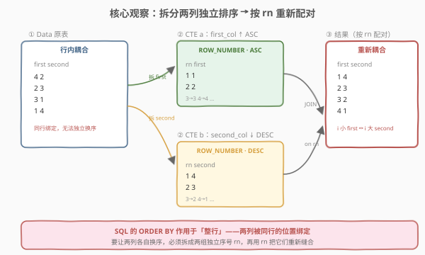
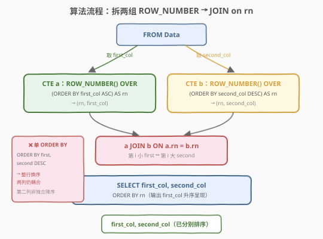
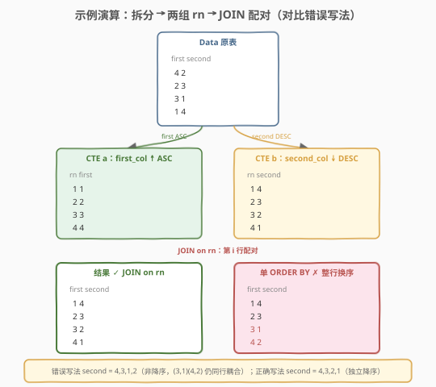

# 分别排序两列

- **题目名称**：分别排序两列
- **链接**：[2159. 分别排序两列 🔒](https://leetcode.cn/problems/order-two-columns-independently/)
- **难度**：中等
- **标签**：数据库、SQL、窗口函数、`ROW_NUMBER`、`JOIN`、独立排序、CTE、LeetCode 锁题

## 1. 题目概述

给定一张 `Data` 表，表中有两列 `first_col` 与 `second_col`。编写 SQL 查询，使得输出结果中：

- `first_col` **升序**排列；
- `second_col` **降序**排列；

且两列的排序**相互独立**——即第 `i` 小的 `first_col` 与第 `i` 大的 `second_col` 配在同一行。

**表结构**：

```text
Table: Data
+-------------+------+
| Column Name | Type |
+-------------+------+
| first_col   | int  |
| second_col  | int  |
+-------------+------+
该表无主键，可能包含重复值。
```

**示例 1**：

```text
输入：
Data 表:
+-----------+------------+
| first_col | second_col |
+-----------+------------+
| 4         | 2          |
| 2         | 3          |
| 3         | 1          |
| 1         | 4          |
+-----------+------------+

输出:
+-----------+------------+
| first_col | second_col |
+-----------+------------+
| 1         | 4          |
| 2         | 3          |
| 3         | 2          |
| 4         | 1          |
+-----------+------------+
```

**解释**：

- `first_col` 升序排列为 `1, 2, 3, 4`；
- `second_col` 降序排列为 `4, 3, 2, 1`；
- 按位置配对，得到 `(1,4), (2,3), (3,2), (4,1)`。

> 💡 本题的考点不在「排序」本身，而在「**两列各自独立换序**」。SQL 的 `ORDER BY` 作用于**整行**——它会让同一行的 `first_col` 与 `second_col` 始终绑定移动。要让两列**各自**重排后再重新缝合，必须把每列拆成独立的序号，再用序号把两列「重新配对」。

---

## 2. 解题思路

### 2.1 朴素误区：一句 `ORDER BY` 搞不定

最直觉的尝试是：

```sql
SELECT first_col, second_col
FROM Data
ORDER BY first_col ASC, second_col DESC;
```

但这**错误**。`ORDER BY` 是对**整行**排序：每行的 `(first_col, second_col)` 作为一个整体被搬运，两列之间**不会**拆开重组。以上面的示例为例，它产出：

```text
first_col | second_col
    1     |    4
    2     |    3
    3     |    1     ← 这行的 second_col 还是原来的 1
    4     |    2     ← 这行的 second_col 还是原来的 2
```

`second_col` 序列是 `4, 3, 1, 2`——并非题目要求的降序 `4, 3, 2, 1`。原因正是 `(3,1)` 与 `(4,2)` 这两行**被整行搬运**，`second_col` 没有脱离原行独立换序。

> ⚠️ **核心障碍**：关系是「无序集合」，`ORDER BY` 只控制**输出呈现**的整行顺序，无法让同一行内的两列分别按各自的序重排。突破口是——把两列**拆开**，各自排序并打上**行号**，再用行号把两列**缝合**回同一行。

### 2.2 核心观察：拆两组 `ROW_NUMBER` → `JOIN on rn`



把问题拆成三步：

1. **拆出 `first_col` 并升序打号**：对 `Data` 的 `first_col` 列做 `ROW_NUMBER() OVER (ORDER BY first_col ASC)`，得到序号 `rn` 与 `first_col` 的二元组 `(rn, first_col)`。`rn = i` 表示这是**第 `i` 小**的 `first_col`。

2. **拆出 `second_col` 并降序打号**：对 `second_col` 列做 `ROW_NUMBER() OVER (ORDER BY second_col DESC)`，得到 `(rn, second_col)`。`rn = i` 表示这是**第 `i` 大**的 `second_col`。

3. **按 `rn` 缝合**：把两组结果按 `rn` 做 `INNER JOIN`——`a.rn = b.rn` 把第 `i` 小的 `first_col` 与第 `i` 大的 `second_col` 配到同一行。

> 💡 **为什么 `ROW_NUMBER` 而非 `RANK`/`DENSE_RANK`？** 本题要的是「**按位置一一配对**」，两列行数相同，每个位置恰好一个值——需要的是**唯一、连续**的序号 `1..n`。`ROW_NUMBER` 强制每行一个不重复的 `rn`，正好满足；`RANK`/`DENSE_RANK` 在有并列值时会让多个行共享同一个 `rn`，`JOIN` 后会产生**笛卡尔积**配对，反而错误（详见第 5 节）。

### 2.3 算法流程图



**逻辑执行步骤**：

| 步骤 | 子句 | 作用 |
|------|------|------|
| ① | `FROM Data` | 读入原表，两列耦合在同一行 |
| ② | CTE `a`：`ROW_NUMBER() OVER (ORDER BY first_col ASC) AS rn` | 对 `first_col` 升序打唯一序号 `rn` |
| ② | CTE `b`：`ROW_NUMBER() OVER (ORDER BY second_col DESC) AS rn` | 对 `second_col` 降序打唯一序号 `rn` |
| ③ | `a JOIN b ON a.rn = b.rn` | 按位置把两列重新缝合 |
| ④ | `SELECT first_col, second_col ORDER BY rn` | 输出，按 `rn` 呈现（即 `first_col` 升序） |

> 💡 **SQL 子句执行顺序**：`FROM` → `WHERE` → `GROUP BY` → `HAVING` → `SELECT`（含窗口函数）→ `ORDER BY` → `LIMIT`。窗口函数在 `SELECT` 阶段计算，故 `rn` 必须先在 CTE 里算好，外层再 `JOIN` 引用——不能在 `WHERE`/`JOIN ON` 中直接引用同层的窗口函数结果。

### 2.4 示例演算

以示例 1 的 `Data = [(4,2), (2,3), (3,1), (1,4)]` 为例，观察「拆分 → 打号 → 缝合」全过程，并对比错误写法：



**CTE a（`first_col` 升序打号）**：

| rn | first_col | 说明 |
|----|-----------|------|
| 1 | 1 | 最小 |
| 2 | 2 | 次小 |
| 3 | 3 | — |
| 4 | 4 | 最大 |

**CTE b（`second_col` 降序打号）**：

| rn | second_col | 说明 |
|----|------------|------|
| 1 | 4 | 最大 |
| 2 | 3 | 次大 |
| 3 | 2 | — |
| 4 | 1 | 最小 |

**JOIN on rn**（`a.rn = b.rn`）：

| rn | first_col | second_col |
|----|-----------|------------|
| 1 | 1 | 4 |
| 2 | 2 | 3 |
| 3 | 3 | 2 |
| 4 | 4 | 1 |

最终输出 `[(1,4), (2,3), (3,2), (4,1)]`，`second_col` 序列 `4,3,2,1` 恰为降序，与示例一致。

> ⚠️ **对比错误写法**：若用 `ORDER BY first_col ASC, second_col DESC`，得到 `[(1,4),(2,3),(3,1),(4,2)]`，`second_col` 为 `4,3,1,2`——`(3,1)` 与 `(4,2)` 仍带着原行耦合，第二列并未独立降序。这是本题最易踩的坑。

---

## 3. 参考代码

### SQL（解法 A：两组 `ROW_NUMBER` + `JOIN`，推荐）

```sql
WITH a AS (
    SELECT first_col,
           ROW_NUMBER() OVER (ORDER BY first_col ASC) AS rn
    FROM Data
),
b AS (
    SELECT second_col,
           ROW_NUMBER() OVER (ORDER BY second_col DESC) AS rn
    FROM Data
)
SELECT a.first_col  AS first_col,
       b.second_col AS second_col
FROM a
JOIN b ON a.rn = b.rn
ORDER BY a.rn;
```

> 💡 **写法要点**：
> - **两个 CTE 各自只读 `Data` 的一列**：`a` 只取 `first_col`，`b` 只取 `second_col`，从源头**解耦**两列。两 CTE 行数相同（都等于 `Data` 行数），保证 `JOIN` 后每行都有配对。
> - **`ROW_NUMBER` 而非 `RANK`/`DENSE_RANK`**：要的是「按位置一一配对」的唯一连续序号，`ROW_NUMBER` 强制 `1..n` 不重复；`RANK`/`DENSE_RANK` 在并列值时共享序号会引发 `JOIN` 笛卡尔积。
> - **`JOIN ON a.rn = b.rn`**：把「第 `i` 小 `first_col`」与「第 `i` 大 `second_col`」缝到同一行——这是「独立排序」的落点。
> - **`ORDER BY a.rn`**：让输出按 `rn` 呈现，等价于 `first_col` 升序呈现，与示例一致。
> - ✓ **最推荐**：语义清晰、通用，MySQL 8.0+/PostgreSQL/Spark SQL 均支持。

### SQL（解法 B：单 CTE 同时打两号 + 自连接）

```sql
WITH t AS (
    SELECT first_col,
           second_col,
           ROW_NUMBER() OVER (ORDER BY first_col ASC)  AS rn1,
           ROW_NUMBER() OVER (ORDER BY second_col DESC) AS rn2
    FROM Data
)
SELECT t1.first_col  AS first_col,
       t2.second_col AS second_col
FROM t t1
JOIN t t2 ON t1.rn1 = t2.rn2
ORDER BY t1.rn1;
```

> 💡 **解法 B 的思路**：在**同一个 CTE** 里一次性算出两个序号 `rn1`（`first_col` 升序）与 `rn2`（`second_col` 降序），再让 CTE **自连接**：`t1` 提供「按 `rn1` 排序的 `first_col`」，`t2` 提供「按 `rn2` 排序的 `second_col`」，用 `t1.rn1 = t2.rn2` 配对。
>
> **与解法 A 的区别**：A 把两列拆进两个独立 CTE，B 把两列留在同一行后自连接。逻辑等价，B 只扫描 `Data` 一次（两个窗口函数并行计算），但需要自连接；A 两个 CTE 各扫一次但 `JOIN` 的是「列已剥离」的小结果。多数优化器对两者生成相近计划，**面试首选 A**（更直观地体现「拆分 → 缝合」的思想）。

### Python（pandas）

```python
import pandas as pd

def order_two_columns_independently(data: pd.DataFrame) -> pd.DataFrame:
    a = data[['first_col']].sort_values('first_col', ascending=True).reset_index(drop=True)
    b = data[['second_col']].sort_values('second_col', ascending=False).reset_index(drop=True)
    result = pd.concat([a, b], axis=1)
    return result
```

> 💡 **pandas 对照**：
> - `.sort_values('first_col', ascending=True).reset_index(drop=True)` 对应 `ROW_NUMBER() OVER (ORDER BY first_col ASC)`——排序后 `reset_index(drop=True)` 让新索引 `0,1,2,…` 充当 `rn`。
> - 两列各自排序后 `pd.concat([a, b], axis=1)` 按位置（索引 `0..n-1`）横向拼接，对应 `JOIN ON a.rn = b.rn`。
> - 若想严格对照 SQL 的 `ROW_NUMBER`（含并列值时的任意破结），pandas 的 `sort_values` 对并列值用稳定排序（`kind='mergesort'` 默认稳定），不影响最终两列各自有序的结论——并列值内部顺序任意都正确。

---

## 4. 复杂度分析

| 维度 | 解法 A（两 CTE + `JOIN`） | 解法 B（单 CTE 自连接） | pandas |
|------|--------------------------|------------------------|--------|
| **时间** | $O(n \log n)$ | $O(n \log n)$ | $O(n \log n)$ |
| **空间** | $O(n)$ | $O(n)$ | $O(n)$ |
| **扫描次数** | 2 次（各一列） | 1 次（两窗口并行） | 2 次（各一列） |
| **是否依赖窗口函数** | 是（MySQL 8.0+） | 是（MySQL 8.0+） | 否 |
| **推荐度** | ✓ **首选** | ✓ 等价写法 | ✓ 验证用 |

> - $n$ = `Data` 表行数
> - **时间**：两次排序各 $O(n \log n)$，`JOIN` on 等值 $O(n)$（哈希连接），总体 $O(n \log n)$，排序是主项。解法 B 两个窗口函数可并行计算，但仍需两次排序 + 一次自连接，渐近相同。
> - **空间**：CTE/排序中间结果 $O(n)$。
> - **索引优化**：若 `Data(first_col)` 与 `Data(second_col)` 上分别有索引，部分数据库可走索引有序扫描省去显式排序，降到 $O(n)$；但通常 `Data` 是临时结果集，索引收益有限。

---

## 5. 扩展：为什么禁用 `RANK`/`DENSE_RANK`？含重复值怎么办？

本题最易错的两个延伸问题：① 误用 `RANK`/`DENSE_RANK` 导致配对错乱；② 表含重复值时 `ROW_NUMBER` 是否仍正确。逐一辨析。

### 5.1 误用 `RANK` 会产生笛卡尔积

设 `first_col = [1, 1, 2]`（两个并列最小值）。三种函数的 `rn` 分配：

| first_col | `ROW_NUMBER` | `RANK` | `DENSE_RANK` |
|-----------|--------------|--------|--------------|
| 1 | 1 | 1 | 1 |
| 1 | 2 | 1 | 1 |
| 2 | 3 | 3 | 2 |

若误用 `RANK`，`first_col` 侧两个值都得 `rn = 1`；若 `second_col` 侧也有 `rn = 1` 的行，`JOIN ON rn` 会把**两侧所有 `rn = 1` 的行两两配对**——3 行输入膨胀成多于 3 行输出，且配对关系错乱。`ROW_NUMBER` 强制 `rn` 唯一（1,2,3），每个位置恰好一行，`JOIN` 后行数不变、一一配对，故**本题只能用 `ROW_NUMBER`**。

### 5.2 重复值下 `ROW_NUMBER` 依然正确

题面说「可能包含重复值」。设：

```text
Data:
first_col | second_col
   1      |    1
   1      |    1
   2      |    2
```

`ROW_NUMBER` 给 `first_col` 升序打号 `1, 2, 3`（两个 `1` 的相对顺序任意），给 `second_col` 降序打号 `1, 2, 3`（`2` 在前，两个 `1` 在后，相对顺序任意）。`JOIN on rn` 后：

| rn | first_col | second_col |
|----|-----------|------------|
| 1 | 1 | 2 |
| 2 | 1 | 1 |
| 3 | 2 | 1 |

`first_col` 升序 `1,1,2` ✓，`second_col` 降序 `2,1,1` ✓。两个并列 `1` 之间的相对配对虽任意，但值相同，**输出结果集作为多重集正确**。即 `ROW_NUMBER` 对并列值的「任意破结」不影响正确性——因为并列值本身无序可分。

> 💡 **口诀**：要**按位置一一配对**（本题）用 `ROW_NUMBER`；要**取最值的所有行**（如 1549「每件商品的最新订单」）用 `RANK`/`DENSE_RANK`。两者不可混用。

### 5.3 无窗口函数的旧版本如何实现？

MySQL 5.7 等无窗口函数的环境下，可用**用户变量**模拟 `ROW_NUMBER`：

```sql
SELECT first_col, second_col
FROM (
    SELECT first_col,
           @ra := @ra + 1 AS rn
    FROM Data, (SELECT @ra := 0) v
    ORDER BY first_col ASC
) a
JOIN (
    SELECT second_col,
           @rb := @rb + 1 AS rn
    FROM Data, (SELECT @rb := 0) v
    ORDER BY second_col DESC
) b ON a.rn = b.rn
ORDER BY a.rn;
```

> ⚠️ 用户变量写法依赖求值顺序，MySQL 8.0 起已不推荐，且在部分配置下行为不稳定。生产环境请升级到窗口函数；该写法仅作兼容性参考。

---

## 6. 面试要点

1. **为什么一句 `ORDER BY first_col ASC, second_col DESC` 不行？**

   > `ORDER BY` 对**整行**排序——每行的 `(first_col, second_col)` 作为整体被搬运，两列始终绑定在同一行。它只能让输出**按指定键呈现**，无法让同一行内的两列**各自**重排后重新配对。示例中 `(3,1)` 与 `(4,2)` 被整行搬到末尾，`second_col` 得到 `4,3,1,2` 而非降序 `4,3,2,1`，即暴露了这一限制。

2. **为什么用 `ROW_NUMBER` 而非 `RANK`/`DENSE_RANK`？**

   > 本题要「按位置一一配对」，需要唯一、连续的序号 `1..n`。`ROW_NUMBER` 强制每行一个不重复 `rn`，`JOIN on rn` 后行数不变、位置对齐。`RANK`/`DENSE_RANK` 在并列值时让多行共享 `rn`，`JOIN` 会产生笛卡尔积，行数膨胀、配对错乱。故本题**只能** `ROW_NUMBER`——这与 1549「取最值所有行」必须用 `RANK` 恰好相反，区分点在于「按位置配对」还是「按值取所有」。

3. **表含重复值时结果还正确吗？**

   > 正确。`ROW_NUMBER` 对并列值任意破结（分配不同 `rn`），但并列值本身相等，相对配对顺序任意都不影响输出多重集。例如 `first_col = [1,1,2]` 升序得 `1,1,2`，两个 `1` 谁排第一都正确——值相同，最终 `first_col` 升序、`second_col` 降序的结论不变。

4. **解法 A 的两个 CTE 行数为何必然相等？**

   > 两个 CTE 都从同一张 `Data` 表读取，`a` 读全部行的 `first_col`、`b` 读全部行的 `second_col`，行数都等于 `Data` 的行数 $n$。`ROW_NUMBER` 各自产生 `1..n` 的 `rn`，因此 `INNER JOIN on rn` 必然一一配对、无遗漏无膨胀。这是「两列独立排序后位置对齐」能够成立的根基。

5. **能否只用一次扫描解决？**

   > 解法 B 在单个 CTE 里同时计算 `rn1`、`rn2` 两个窗口函数，逻辑上只扫 `Data` 一次，但底层仍需对两列各做一次排序（$O(n \log n)$），且需自连接。渐近复杂度与解法 A 相同，多数优化器生成相近执行计划。面试中解法 A 更能清晰表达「拆分 → 缝合」的思路，是首选讲法。

> 💡 **一句话总结**：2159 是 SQL **"两列独立排序"招牌题**——核心模板「拆 `first_col` 走 `ROW_NUMBER ASC` / 拆 `second_col` 走 `ROW_NUMBER DESC` → `JOIN on rn` 缝合」。最大要点：**`ORDER BY` 作用于整行，无法让同行两列各自换序**；必须用 `ROW_NUMBER`（禁 `RANK`/`DENSE_RANK`，否则并列值引发笛卡尔积）拆出唯一序号再按位置配对。与 1549「取最值所有行用 `RANK`」形成「按位置配对 vs 按值取行」的经典对照。

---

## 7. 同类练习题

- [1549. 每件商品的最新订单 🔒](https://leetcode.cn/problems/the-most-recent-orders-for-each-product/)（[题解](../1501-1600/1549_每件商品的最新订单.md)）：`RANK` 取组内最值所有行，与本题「`ROW_NUMBER` 按位置配对」对照——辨析何时用 `RANK`、何时用 `ROW_NUMBER`
- [1532. 最近的三笔订单 🔒](https://leetcode.cn/problems/the-most-recent-three-orders/)：`ROW_NUMBER` 取组内前 N 行（强制唯一），与本题同用 `ROW_NUMBER` 但目的不同——本题是「跨列配对」，1532 是「组内取前 N」
- [176. 第二高的薪水](https://leetcode.cn/problems/second-highest-salary/)：`ORDER BY ... LIMIT` 取第 N 大，单列排序的入门对照——体会单列 `ORDER BY` 与本题「两列独立排序」的区别
- [178. 分数排名](https://leetcode.cn/problems/rank-scores/)：`RANK`/`DENSE_RANK` 给单列打序号，辨析三函数对并列值的不同处理，理解本题为何禁用 `RANK`/`DENSE_RANK`
- [180. 连续出现的数字](https://leetcode.cn/problems/consecutive-numbers/)：`ROW_NUMBER` 配合自连接识别连续序列，同为「用窗口序号 + `JOIN` 重组行关系」的套路
