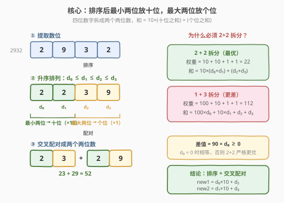
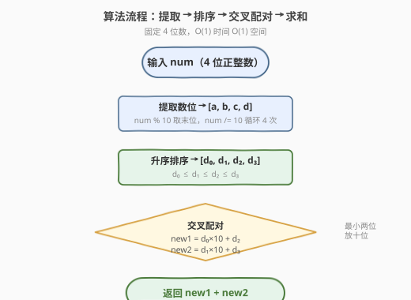
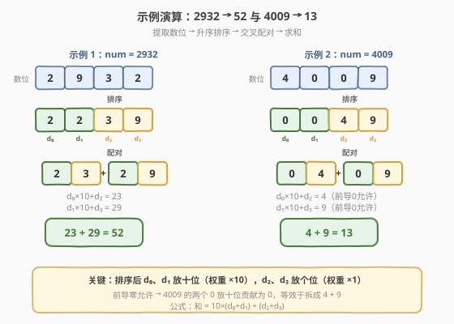

# LeetCode 拆分数位后四位数字的最小和 题解

## 1. 题目概述

- **标题 / 题号**：拆分数位后四位数字的最小和（#2160，easy）
- **链接**：https://leetcode.cn/problems/minimum-sum-of-four-digit-number-after-splitting-digits/
- **难度**：简单
- **标签**：数学、贪心、排序

**题意**：给你一个四位 **正** 整数 `num`。请你使用 `num` 中的 **数位**，将 `num` 拆成两个新的整数 `new1` 和 `new2`。`new1` 和 `new2` 中可以有 **前导 0**，且 `num` 中 **所有** 数位都必须使用。

比方说，给你 `num = 2932`，你拥有的数位包括：两个 `2`，一个 `9` 和一个 `3`。一些可能的 `[new1, new2]` 数对为 `[22, 93]`，`[23, 92]`，`[223, 9]` 和 `[2, 329]`。

请你返回可以得到的 `new1` 和 `new2` 的 **最小** 和。

**示例 1**：

```text
输入：num = 2932
输出：52
解释：可行的 [new1, new2] 数对为 [29, 23]，[223, 9] 等等。
最小和为数对 [29, 23] 的和：29 + 23 = 52。
```

**示例 2**：

```text
输入：num = 4009
输出：13
解释：可行的 [new1, new2] 数对为 [0, 49]，[490, 0] 等等。
最小和为数对 [4, 9] 的和：4 + 9 = 13。
```

**约束**：

- $1000 \le \text{num} \le 9999$

> 💡 本题只有 **4 个数位**，枚举空间极小，但真正优雅的解法只需「排序 + 交叉配对」两步。题眼在于：**拆成几个两位数最优？每个数位该放哪个位置（十位/个位）？** 想清楚权重分配，答案自然浮现。

## 2. 解题思路

### 2.1 暴力思路：枚举所有拆法

4 个数位分配给 `new1` 和 `new2`，本质是给每个数位选一个「去向」和「位置」。最暴力的做法是：

1. 提取 4 个数位；
2. 枚举所有把 4 个数位分成两组的方式（每组至少 1 个数位），并对每组内的数位枚举所有排列；
3. 对每种方案计算 `new1 + new2`，取最小值。

共有 $S(4,2) \times (\text{排列数})$ 种方案（$S(4,2)=7$ 是第二类 Stirling 数），再乘上组内排列，总枚举量不超过百级，完全可过。但这种方法**没有利用任何结构**，既不优雅也难以推广。

> 💡 暴力法能过，但面试中讲不出洞察等于没做。我们需要回答两个问题：① 拆成几个两位数最优？② 每个数位该放哪个位置？

### 2.2 核心观察：最小两位放十位，最大两位放个位



**观察一：必须拆成两个两位数（2+2），而非 1+3。**

把 4 个数位拆成两个数，只有两种拆法（3+1 与 2+2 等价于 1+3）：

- **2+2 拆分**：两个数各 2 位。权重分配为 $10, 10, 1, 1$，权重总和 $= 22$。
- **1+3 拆分**：一个 1 位数、一个 3 位数。权重分配为 $100, 10, 1, 1$，权重总和 $= 112$。

记排序后的数位为 $d_0 \le d_1 \le d_2 \le d_3$。由**重排不等式**，最小化和 = 把最小数位配最大权重：

- 2+2 最优和 $= 10 \times (d_0 + d_1) + (d_2 + d_3)$
- 1+3 最优和 $= 100 \times d_0 + 10 \times d_1 + d_2 + d_3$

两者之差：

$$
(1{+}3) - (2{+}2) = 100 d_0 + 10 d_1 + d_2 + d_3 - 10 d_0 - 10 d_1 - d_2 - d_3 = 90\, d_0 \ge 0
$$

由于 $d_0 \ge 0$，**1+3 拆分永远不优于 2+2**。当 $d_0 = 0$（如 `4009`）时两者相等，否则 2+2 严格更优。因此**一定拆成两个两位数**。

> ⚠️ 直觉理解：3 位数有一个「百位」（权重 100），比两个「十位」（权重 10+10=20）贵得多。把数位分散到更多低位，能稀释高权重的代价。

**观察二：最小的两个数位放十位，最大的两个放个位。**

确定了 2+2 拆分后，和 $= 10 \times (\text{十位之和}) + (\text{个位之和})$。十位权重（10）大于个位权重（1），由**重排不等式**，应把最小的两个数位 $d_0, d_1$ 分配给十位，最大的两个 $d_2, d_3$ 分配给个位。

具体配对方式：把 $d_0$ 和 $d_2$ 组成一个数、$d_1$ 和 $d_3$ 组成另一个数（交叉配对）。即：

$$
\text{new1} = 10 \times d_0 + d_2, \qquad \text{new2} = 10 \times d_1 + d_3
$$

> 💡 **为何交叉配对**：十位已确定是 $d_0, d_1$，个位已确定是 $d_2, d_3$。至于哪个十位配哪个个位，不影响总和（因为和 $= 10(d_0+d_1) + (d_2+d_3)$ 与配对无关）。交叉配对只是让两个数大小接近，纯粹是约定俗成。

### 2.3 算法流程图



三步走：

1. **提取数位**：对 `num` 连续取 `% 10` 和 `/ 10` 共 4 次，得到 4 个数位。
2. **升序排序**：4 个数位排序后记为 $d_0 \le d_1 \le d_2 \le d_3$。
3. **交叉配对求和**：返回 $10 \times (d_0 + d_1) + (d_2 + d_3)$。

### 2.4 示例演算



**示例 1：`num = 2932`**

- 提取数位：`[2, 9, 3, 2]`
- 升序排序：`[2, 2, 3, 9]` → $d_0=2, d_1=2, d_2=3, d_3=9$
- 交叉配对：$\text{new1} = 10 \times 2 + 3 = 23$，$\text{new2} = 10 \times 2 + 9 = 29$
- 最小和：$23 + 29 = 52$ ✓

**示例 2：`num = 4009`**

- 提取数位：`[4, 0, 0, 9]`
- 升序排序：`[0, 0, 4, 9]` → $d_0=0, d_1=0, d_2=4, d_3=9$
- 交叉配对：$\text{new1} = 10 \times 0 + 4 = 4$（前导 0 允许），$\text{new2} = 10 \times 0 + 9 = 9$
- 最小和：$4 + 9 = 13$ ✓

> ⚠️ 注意 `4009` 的关键：两个 `0` 放十位贡献为 0，等效于把 `4` 和 `9` 拆成两个一位数。这正是前导零允许带来的便利——$d_0 = 0$ 时 2+2 与 1+3 等价，公式自动覆盖。

## 3. 参考代码

### C++

```cpp
class Solution {
  public:
    int minimumSum(int num) {
        int d[4];
        for (int i = 0; i < 4; i++) {
            d[i] = num % 10;
            num /= 10;
        }
        sort(d, d + 4);
        return 10 * (d[0] + d[1]) + (d[2] + d[3]);
    }
};
```

### Python

```python
class Solution:
    def minimumSum(self, num: int) -> int:
        d = sorted(int(c) for c in str(num))
        return 10 * (d[0] + d[1]) + (d[2] + d[3])
```

### Python（数学取位版，避免字符串转换）

```python
class Solution:
    def minimumSum(self, num: int) -> int:
        d = []
        for _ in range(4):
            d.append(num % 10)
            num //= 10
        d.sort()
        return 10 * (d[0] + d[1]) + (d[2] + d[3])
```

> ⚠️ Python 中整数除法用 `//`（地板除），`/` 会得到浮点数导致排序与运算出错。

## 4. 复杂度分析

| 维度 | 复杂度 | 说明 |
|------|--------|------|
| 时间复杂度 | $O(1)$ | 固定 4 个数位，提取 $O(1)$、排序 $O(4 \log 4) = O(1)$、求和 $O(1)$，与输入规模无关 |
| 空间复杂度 | $O(1)$ | 仅用长度为 4 的数组，常数额外空间 |

> 💡 输入恒为 4 位整数（$1000 \le \text{num} \le 9999$），所有操作都在常数规模内完成。即使推广到 $n$ 位数，时间也仅为 $O(n \log n)$（排序主导）。

## 5. 扩展：推广到 n 位数

本题的结论可以自然推广：给定 $n$ 个数位（$n$ 为偶数），拆成 $n/2$ 个两位数使总和最小。

**推广策略**：

1. 升序排序所有数位；
2. 从小到大每两个数位组成一个两位数：第 $2k$ 小的放十位，第 $2k+1$ 小的放个位；
3. 总和 $= \sum_{k=0}^{n/2-1} (10 \times d_{2k} + d_{2k+1})$。

**为什么不再考虑 1+3 或其他位数的拆分**：与 4 位数同理，任何包含 3 位及以上数的拆分，都有一个权重 $\ge 100$ 的位置，而把它拆成更多 2 位数能把高权重稀释成多个 $\times 10$。重排不等式保证「尽可能拆成 2 位数 + 小数位配大权重」始终最优。

> 💡 若 $n$ 为奇数，则剩下一个 1 位数（权重 1），自然分配给最大的数位，不影响策略主体。

## 6. 面试要点

1. **为什么一定拆成两个两位数，而不是 1+3？**

   - 2+2 拆分的权重总和为 $10+10+1+1=22$，1+3 拆分为 $100+10+1+1=112$。排序后由重排不等式算出两种最优和之差 $= 90 \times d_0 \ge 0$，故 1+3 永远不优于 2+2。$d_0 = 0$ 时两者相等（前导零允许时 2+2 自动退化为 1+3 的效果）。

2. **为什么最小的两个数位放十位？**

   - 和 $= 10 \times (\text{十位之和}) + (\text{个位之和})$，十位权重 10 大于个位权重 1。由重排不等式，最小化加权和应把最小值配最大权重，所以 $d_0, d_1$（最小的两个）放十位，$d_2, d_3$（最大的两个）放个位。

3. **前导零允许起到了什么作用？**

   - 前导零允许意味着 `04` 合法且值为 `4`。这让 2+2 拆分能自动覆盖 1+3 的效果：当 $d_0 = 0$ 时，`0` 放十位贡献为 0，等效于该数少了一位。如 `4009` 的两个 `0` 放十位后，两个数退化为 `4` 和 `9`。若无此规则，答案会不同。

4. **交叉配对（d₀配d₂、d₁配d₃）是必须的吗？**

   - 不是。总和 $= 10(d_0+d_1) + (d_2+d_3)$ 只取决于「哪两个放十位、哪两个放个位」，与具体配对无关。$d_0$ 配 $d_2$ 还是配 $d_3$，和都一样。交叉配对只是让两个数大小均衡的约定写法。

5. **能否不用排序？**

   - 4 个数位用固定次数的比较交换也能定序（如插入排序手写 4 步），但 `sort` 对 4 个元素已是 $O(1)$，代码更简洁。面试中写 `sort` 完全可接受，重点是讲清「为什么排序后这样配对」。

## 同类练习题

| # | 题目 | 与本题的关联 |
|---|------|-------------|
| 9 | [回文数](https://leetcode.cn/problems/palindrome-number/)（[题解](../0001-0100/9_回文数.md)） | 同为数位操作题，弹出末位 / 压入的取位机制是本题提取数位的基础 |
| 7 | [整数反转](https://leetcode.cn/problems/reverse-integer/)（[题解](../0001-0100/7_整数反转.md)） | 整数数位的弹出 / 压入母题，`% 10` + `/ 10` 取位手法一脉相承 |
| 506 | [相对名次](https://leetcode.cn/problems/relative-ranks/) | 排序后按位置重新赋值，与本题「排序后按权位分配」思路相通 |
| 561 | [数组拆分](https://leetcode.cn/problems/array-partition/) | 排序后相邻配对求和最大，与本题「排序后交叉配对求和最小」是重排不等式的正反两面 |
| 2169 | [得到 0 的操作数](https://leetcode.cn/problems/count-operations-to-obtain-zero/) | 同为简单数学模拟题，数位 / 数值层面的小操作 |
