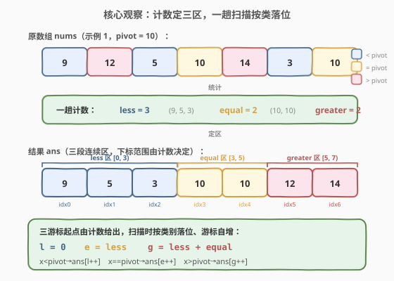
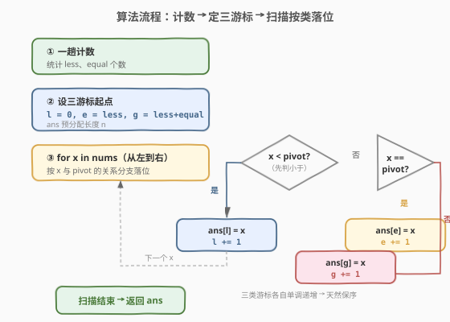
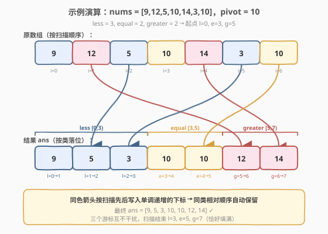

# LeetCode 根据给定数字划分数组 题解

## 1. 题目概述

- **标题 / 题号**：根据给定数字划分数组（#2161，medium）
- **链接**：https://leetcode.cn/problems/partition-array-according-to-given-pivot/
- **难度**：中等
- **标签**：数组、双指针、模拟

**题意**：给你一个下标从 **0** 开始的整数数组 `nums` 和一个整数 `pivot`。请你将 `nums` 重新排列，使得以下条件均成立：

- 所有**小于** `pivot` 的元素都出现在所有**大于** `pivot` 的元素**之前**；
- 所有**等于** `pivot` 的元素都出现在小于和大于 `pivot` 的元素**中间**；
- 小于 `pivot` 的元素之间和大于 `pivot` 的元素之间的**相对顺序**不发生改变。

返回重新排列后的结果数组。

**示例 1**：

```text
输入：nums = [9,12,5,10,14,3,10], pivot = 10
输出：[9,5,3,10,10,12,14]
解释：
  小于 pivot 的元素（保序）：[9, 5, 3]
  等于 pivot 的元素：[10, 10]
  大于 pivot 的元素（保序）：[12, 14]
  拼接：[9,5,3, 10,10, 12,14]
```

**示例 2**：

```text
输入：nums = [-3,4,3,2], pivot = 2
输出：[-3,2,4,3]
解释：
  小于 pivot：[-3]
  等于 pivot：[2]
  大于 pivot（保序）：[4, 3]
```

**约束**：

- $1 \le \text{nums.length} \le 10^5$
- $-10^6 \le \text{nums[i]} \le 10^6$
- `pivot` 等于 `nums` 中的一个元素

> 💡 **审题关键**：① 「小于、等于、大于」三段分区，等价于以 `pivot` 为轴的**稳定三路划分**；② 只要求**小于组**与**大于组**各自保序，等于组无所谓（值都相同）；③ 题面「返回结果数组」⇒ 不要求原地，$O(n)$ 辅助数组是公认最优。这三点合起来指向「计数定区 + 一趟扫描落位」的解法，与同目录的 [2149. 按符号重排数组](2149_按符号重排数组.md)（两路保序）是同一套模板的三路推广。

## 2. 解题思路

### 2.1 暴力思路：稳定排序按三类键

最直观的做法：给每个元素赋予一个三值键——小于 `pivot` 记 `0`、等于记 `1`、大于记 `2`，然后对 `nums` 做**稳定排序**（按该键升序）。

- **正确性**：稳定排序保证键相同的元素保持原序。键 `0`（小于组）和键 `2`（大于组）内部因此保序；键 `1`（等于组）值全为 `pivot`，保序与否无所谓。三个键升序后天然形成 `小于 | 等于 | 大于` 三段。
- **效率**：$O(n \log n)$ 时间、$O(n)$ 空间。能过约束（$n \le 10^5$），但**没有利用键只有 3 个值**这一结构。

> ⚠️ 暴力法的关键缺陷：键集合规模 $|\Sigma| = 3$，却用了通用排序（针对任意键集合设计）。当键值种类远小于元素个数时，「计数」必然比「比较排序」更快——这正是**计数排序**的适用场景。

### 2.2 核心观察：计数定三区，一趟扫描按类落位



**观察一：结果数组是三段连续区，各区长度由计数决定。**

结果数组必然形如：

$$\underbrace{[\,\text{小于组}\,]}_{\text{less 个}} \; \underbrace{[\,\text{等于组}\,]}_{\text{equal 个}} \; \underbrace{[\,\text{大于组}\,]}_{\text{greater 个}}$$

其中 `less`、`equal`、`greater` 分别是 `nums` 中小于、等于、大于 `pivot` 的元素个数，满足 `less + equal + greater = n`。**只需先数一遍** `less` 和 `equal`（`greater = n - less - equal`），三段的下标范围就完全确定：

$$\text{less 区 } [0, \text{less}),\quad \text{equal 区 } [\text{less}, \text{less+equal}),\quad \text{greater 区 } [\text{less+equal}, n)$$

**观察二：三个写游标各自单调递增，扫描一趟即可保序落位。**

设三个写游标：

$$l = 0,\qquad e = \text{less},\qquad g = \text{less} + \text{equal}$$

从左到右扫描 `nums`，对每个 $x$ 按其与 `pivot` 的关系写入对应游标位置、并让该游标 `+1`：

$$\begin{cases}
x < \text{pivot} \;\Rightarrow\; \text{ans}[l] = x,\; l \mathrel{+}= 1 \\
x = \text{pivot} \;\Rightarrow\; \text{ans}[e] = x,\; e \mathrel{+}= 1 \\
x > \text{pivot} \;\Rightarrow\; \text{ans}[g] = x,\; g \mathrel{+}= 1
\end{cases}$$

> 💡 **为什么天然保序？** 扫描顺序即原数组顺序。同类元素被依次写入**单调递增**的下标序列（`l` 从 `0` 起每次 `+1`，`e` 从 `less` 起每次 `+1`，`g` 从 `less+equal` 起每次 `+1`），因此同类元素在结果中的相对次序与原数组一致。三个游标独立步进、互不干扰——这正是「三条独立队列合并」的特例，与 [2149](2149_按符号重排数组.md) 的「正负两路写偶/奇下标」同构，只是从两路升到三路。

> ⚠️ **为何能直接 `+1` 而非 `+2`？** 2149 的结果是**交错**排列（正负正负…），所以两路游标步长为 2、起点错位。本题结果是**分段**排列（三段连续），每段内部下标连续，故游标步长为 1、起点由计数给出。两者同属「多路保序写入预分配数组」，差别仅在分段方式。

### 2.3 算法流程图



完整步骤：

1. **计数**：一趟扫描统计 `less`（$<$ pivot 个数）与 `equal`（$=$ pivot 个数）。
2. **定游标**：预分配长度为 $n$ 的 `ans`；令 $l = 0$、$e = \text{less}$、$g = \text{less} + \text{equal}$。
3. **落位**：从左到右再扫一遍 `nums`，按 $x$ 与 `pivot` 的三分支写入 `ans[l/e/g]` 并自增对应游标。
4. **返回 `ans`**：三段已填满，$l、e、g$ 恰好同时走到 $n$。

> 💡 **无需越界判断**：`less + equal + greater = n`，三段长度之和恰为 $n$，扫描结束时三个游标同时到达 $n$，中途不越界。

### 2.4 示例演算

以示例 1（`nums = [9,12,5,10,14,3,10]`，`pivot = 10`）逐步演算：



**第一步·计数**：扫描得 `less = 3`（9, 5, 3）、`equal = 2`（10, 10）、`greater = 2`（12, 14）。
**第二步·定游标**：$l = 0$、$e = 3$、$g = 5$。

**第三步·逐元素落位**：

| 步 | $x$ | 分类 | 写入 | 游标变化 | 说明 |
|----|-----|------|------|----------|------|
| 1 | 9 | $<$ | ans[0]=9 | $l\,0{\to}1$ | 首个小于元素落 less 区首位 |
| 2 | 12 | $>$ | ans[5]=12 | $g\,5{\to}6$ | 首个大于元素落 greater 区首位 |
| 3 | 5 | $<$ | ans[1]=5 | $l\,1{\to}2$ | 第二个小于元素接在 9 后 |
| 4 | 10 | $=$ | ans[3]=10 | $e\,3{\to}4$ | 首个等于元素落 equal 区首位 |
| 5 | 14 | $>$ | ans[6]=14 | $g\,6{\to}7$ | 第二个大于元素接在 12 后 |
| 6 | 3 | $<$ | ans[2]=3 | $l\,2{\to}3$ | 第三个小于元素接在 5 后（less 区填满） |
| 7 | 10 | $=$ | ans[4]=10 | $e\,4{\to}5$ | 第二个等于元素接在首个 10 后 |

**答案 = `[9, 5, 3, 10, 10, 12, 14]`** ✓

> 💡 **观察保序性**：小于组写入顺序 idx `0→1→2`，对应值 `9, 5, 3`，与原数组中小于元素的出现顺序一致 ✓；大于组写入顺序 idx `5→6`，对应值 `12, 14`，同样保序 ✓。注意 `12` 虽在原数组第 1 位、却落到结果第 5 位——这正是「同类保序、跨类重排」的体现。

## 3. 参考代码

### C++

```cpp
class Solution {
public:
    vector<int> pivotArray(vector<int>& nums, int pivot) {
        int n = nums.size();
        int less = 0, equal = 0;
        for (int x : nums) {
            if (x < pivot) less++;
            else if (x == pivot) equal++;
        }

        vector<int> ans(n);
        int l = 0, e = less, g = less + equal;
        for (int x : nums) {
            if (x < pivot) ans[l++] = x;
            else if (x == pivot) ans[e++] = x;
            else ans[g++] = x;
        }
        return ans;
    }
};
```

### Python

```python
class Solution:
    def pivotArray(self, nums: List[int], pivot: int) -> List[int]:
        n = len(nums)
        less = equal = 0
        for x in nums:
            if x < pivot:
                less += 1
            elif x == pivot:
                equal += 1

        ans = [0] * n
        l, e, g = 0, less, less + equal
        for x in nums:
            if x < pivot:
                ans[l] = x
                l += 1
            elif x == pivot:
                ans[e] = x
                e += 1
            else:
                ans[g] = x
                g += 1
        return ans
```

> 💡 **代码要点**：① 第一趟只数 `less`、`equal`，`greater` 由 $n - \text{less} - \text{equal}$ 隐含给出，无需单独统计；② 第二趟用三分支 `if/elif/else` 把每个元素直接写入对应游标位置，**一趟写完**；③ 游标用后置自增（`l++`）或显式 `+= 1`，写后即进，逻辑清晰。

### Python（三组拼接等价写法）

```python
class Solution:
    def pivotArray(self, nums: List[int], pivot: int) -> List[int]:
        less, equal, greater = [], [], []
        for x in nums:
            if x < pivot:
                less.append(x)
            elif x == pivot:
                equal.append(x)
            else:
                greater.append(x)
        return less + equal + greater
```

> ⚠️ 三组拼接版**仅一趟扫描**、无需计数，可读性更高，时间空间同为 $O(n)$。区别仅在于：它用了三个动态数组 + 一次拼接（产生中间列表），而计数版预分配单一 `ans`、常数因子略小。两者**正确性等价**，面试中讲清任一即可；计数版的优势在于显式暴露「三段区间由计数决定」这一结构，便于引出原地/不稳定变体的讨论。

## 4. 复杂度分析

| 维度 | 复杂度 | 说明 |
|------|--------|------|
| 时间复杂度 | $O(n)$ | 两趟线性扫描：第一趟计数、第二趟落位，各 $O(n)$ |
| 空间复杂度 | $O(n)$ | 长度为 $n$ 的结果数组（不计输入） |

> 💡 **能否 $O(1)$ 额外空间？** 若**不要求保序**，可用经典的**荷兰国旗三路划分**（见第 5 节）原地完成 $O(n)$ 时间、$O(1)$ 额外空间。但本题明确要求「小于组、大于组各自保序」，原地**稳定**三路划分需复杂的块交换/旋转，工程价值低，$O(n)$ 辅助数组是公认最优解——与 [2149](2149_按符号重排数组.md)「保序则必须 $O(n)$ 辅助数组」的结论一致。

## 5. 扩展：不保序的原地三路划分（荷兰国旗）

若放宽「保序」约束（只要三段分区、同类顺序可变），可用 **Lomuto 三路划分**（即 [75. 颜色分类](https://leetcode.cn/problems/sort-colors/) 的荷兰国旗算法）原地完成：

- 维护三个游标 `lt = 0`、`i = 0`、`gt = n - 1`，不变式：`[0, lt)` 全 $<$ pivot、`[lt, i)` 全 $=$ pivot、`(gt, n)` 全 $>$ pivot。
- 扫描 `i`：`nums[i] < pivot` 则交换 `nums[lt]` 与 `nums[i]`、`lt++`、`i++`；`== pivot` 则 `i++`；`> pivot` 则交换 `nums[gt]` 与 `nums[i]`、`gt--`（`i` 不增，待重新判定换来的元素）。
- 复杂度 $O(n)$ 时间、$O(1)$ 额外空间。

```python
def three_way_partition_inplace(nums, pivot):
    lt, i, gt = 0, 0, len(nums) - 1
    while i <= gt:
        if nums[i] < pivot:
            nums[lt], nums[i] = nums[i], nums[lt]
            lt += 1
            i += 1
        elif nums[i] == pivot:
            i += 1
        else:
            nums[gt], nums[i] = nums[i], nums[gt]
            gt -= 1
    return nums
```

> ⚠️ 该算法**不稳定**：`<` 分支的交换会把 `[lt, i)` 区间里的某个等于元素换到当前位置，破坏等于组（乃至小于组内部）的原序。本题要求保序，**不能**用此法。它的用武之地是 [75. 颜色分类](https://leetcode.cn/problems/sort-colors/) 这类「只分区、不保序」的题目。

> 💡 **计数排序视角**：本题主解本质是**键值集合为 3 的计数排序**——先数每类个数定区间、再按区间落位。计数排序天然稳定，且当键值种类为常数时复杂度 $O(n)$。荷兰国旗则是计数排序的「原地、不稳定」替代品，用交换换空间、牺牲稳定性。

## 6. 面试要点

**Q1：为什么先计数再落位，而不是边扫描边分组拼接？**

> 两种写法都正确且同为 $O(n)$。计数版的优势是**显式暴露三段区间结构**：先数 `less`、`equal` 就确定了每段的起始下标，第二趟直接按游标写入预分配数组，避免动态 `append` 与后续拼接。三组拼接版（`less + equal + greater`）更简洁，面试讲清任一即可；若被追问常数因子，计数版略优（单数组、无中间列表）。

**Q2：如何保证「同类保序」？**

> 扫描顺序即原数组顺序。同类元素被依次写入**单调递增**的下标序列——`l` 从 `0` 起、`e` 从 `less` 起、`g` 从 `less+equal` 起，各步长为 1。同类的第 $k$ 个元素总比第 $k+1$ 个先写入更小的下标，因此相对次序不变。三个游标独立步进、互不干扰。

**Q3：为什么不需要越界判断？**

> `less + equal + greater = n`，三段长度之和恰为 $n$。小于元素恰填满 $[0, \text{less})$、等于元素填满 $[\text{less}, \text{less+equal})$、大于元素填满 $[\text{less+equal}, n)$。扫描结束 $l = \text{less}$、$e = \text{less+equal}$、$g = n$，三游标同时到尾，无中途越界。

**Q4：本题与 75「颜色分类」/ 2149「按符号重排数组」的异同？**

> - 与 **75** 同：都是「以某值为轴的三路划分」。异：75 只要求**分区**、**不保序**，可用荷兰国旗原地 $O(1)$ 空间；2161 要求**保序**，必须 $O(n)$ 辅助数组。
> - 与 **2149** 同：都是「多路保序写入预分配数组」。异：2149 是**两路交错**（正负正负…），游标步长 2、起点错位（`0` 与 `1`）；2161 是**三路分段**（小于|等于|大于），游标步长 1、起点由计数给出。同属一套模板。

**Q5：能否用不稳定的三路划分 + 再稳定化来满足保序？**

> 不值得。若先用荷兰国旗得到三段（不稳定），再在各段内稳定排序恢复原序，等于退回 $O(n \log n)$ 且代码更绕。直接用计数版一趟保序落位，$O(n)$ 一步到位。稳定分区**从一开始就按扫描顺序写入**才是正解。

## 同类练习题

| # | 题目 | 与本题的关联 |
|---|------|-------------|
| 2149 | [按符号重排数组](https://leetcode.cn/problems/rearrange-array-elements-by-sign/)（[题解](2149_按符号重排数组.md)） | 两路保序写入预分配数组——本题的三路保序是其直接推广，同模板（游标步长不同） |
| 75 | [颜色分类](https://leetcode.cn/problems/sort-colors/) | 经典荷兰国旗三路划分，原地 $O(1)$ 空间但**不保序**——对照理解「保序 vs 不保序」对空间的影响 |
| 922 | [按奇偶排序数组 II](https://leetcode.cn/problems/sort-array-by-parity-ii/) | 按下标奇偶性分类但不保序，可用 in-place 对撞交换——与 2149/2161 的「保序需辅助数组」形成对照 |
| 905 | [按奇偶排序数组](https://leetcode.cn/problems/sort-array-by-parity/) | 两路分区不保序，双指针原地交换——分区思想的入门题 |
| 912 | [排序数组](https://leetcode.cn/problems/sort-an-array/)（[题解](../0901-1000/912_排序数组.md)） | 通用排序的母题，对照体会「键值种类为常数时计数排序优于比较排序」 |
