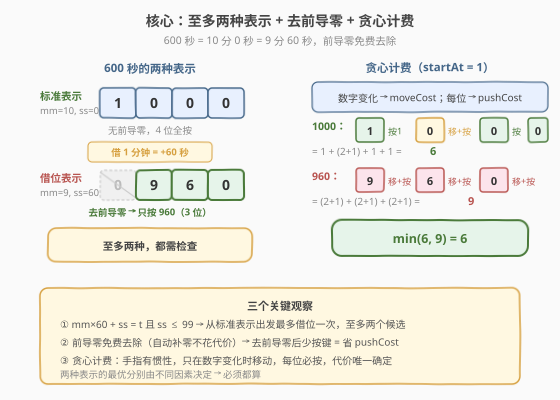
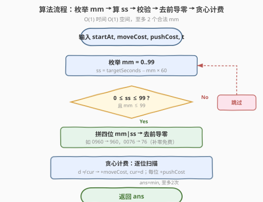
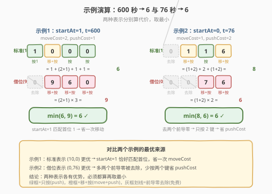

# LeetCode 设置时间的最少代价 题解

## 1. 题目概述

- **标题 / 题号**：设置时间的最少代价（#2162，medium）
- **链接**：https://leetcode.cn/problems/minimum-cost-to-set-cooking-time/
- **难度**：中等
- **标签**：枚举、贪心、数学、模拟

**题意**：常见的微波炉可以设置加热时间，加热时间满足以下条件：

- 至少为 `1` 秒钟。
- 至多为 `99` 分 `99` 秒。

你可以 **最多** 输入 **4 个数字** 来设置加热时间。如果你输入的位数不足 4 位，微波炉会自动加 **前缀 0** 来补足 4 位。微波炉会将设置好的四位数中，**前** 两位当作分钟数，**后** 两位当作秒数，总时间 $= \text{mm} \times 60 + \text{ss}$。

给你整数 `startAt`、`moveCost`、`pushCost` 和 `targetSeconds`。一开始手指在 `startAt` 处，移动到任何其他数字花费 `moveCost`，按一次当前手指所在数字花费 `pushCost`。返回设置 `targetSeconds` 秒加热时间的最少代价。

**示例 1**：

```text
输入：startAt = 1, moveCost = 2, pushCost = 1, targetSeconds = 600
输出：6
解释：输入 1 0 0 0（10 分 0 秒 = 600 秒）。
  手指在 1，按 1（代价 1），移到 0（代价 2），按 0（代价 1），按 0（代价 1），按 0（代价 1）= 6。
```

**示例 2**：

```text
输入：startAt = 0, moveCost = 1, pushCost = 2, targetSeconds = 76
输出：6
解释：输入 7 6（76 秒）。移到 7（代价 1），按 7（代价 2），移到 6（代价 1），按 6（代价 2）= 6。
```

**约束**：

- $0 \le \text{startAt} \le 9$
- $1 \le \text{moveCost}, \text{pushCost} \le 10^5$
- $1 \le \text{targetSeconds} \le 6039$

> 💡 题眼在于：同一秒数可能有**多种「分:秒」表示**（如 600 秒 $= 10{:}00 = 9{:}60$），且**前导零免费**（少按键省代价）。核心是枚举所有合法表示，对每种贪心算代价取最小。

## 2. 解题思路

### 2.1 暴力思路：枚举所有四位输入

最暴力的做法是枚举所有 $10^4$ 种四位输入 `0000`–`9999`，计算每个表示的时间 $\text{mm} \times 60 + \text{ss}$，筛选等于 `targetSeconds` 的，再逐一计算输入代价取最小。时间 $O(10^4 \times 4)$，能过但完全没有利用结构。

> 💡 真正的洞察是：时间方程 $\text{mm} \times 60 + \text{ss} = \text{targetSeconds}$ 在 $0 \le \text{ss} \le 99$ 约束下**至多两个解**，根本不需要枚举一万种。

### 2.2 核心观察：至多两种表示 + 去前导零 + 贪心计费



**观察一：至多两种合法的 (mm, ss) 表示。**

设 $\text{mm} \times 60 + \text{ss} = \text{targetSeconds}$，其中 $0 \le \text{mm} \le 99$、$0 \le \text{ss} \le 99$。固定 `targetSeconds` 后，$\text{ss} = \text{targetSeconds} - \text{mm} \times 60$。每减少 1 分钟，秒数增加 60。由于 $\text{ss} \le 99$，从标准表示 $\text{mm} = \lfloor \text{targetSeconds} / 60 \rfloor$ 出发，**最多只能借位一次**（要求 $\text{targetSeconds} \bmod 60 \le 39$，使 $\text{ss} + 60 \le 99$）。

因此候选只有：

- **标准表示**：$\text{mm} = \lfloor t/60 \rfloor$，$\text{ss} = t \bmod 60$（当 $\text{mm} \le 99$）
- **借位表示**：$\text{mm} - 1$，$\text{ss} + 60$（当 $\text{mm} \ge 1$ 且 $\text{ss} + 60 \le 99$）

> ⚠️ 例：`targetSeconds = 600` → 标准表示 $(10, 0)$ → `"1000"`；借位表示 $(9, 60)$ → `"0960"`。两种都要算。

**观察二：前导零免费去除。**

输入不足 4 位时微波炉自动补前导零，**补零不花代价**。因此对四位序列 `mmss`，应去掉所有前导零，只按有效数字。如 `"0960"` → 只按 `"960"`（3 个键），`"0076"` → 只按 `"76"`（2 个键）。

> 💡 少按一个键就省一次 `pushCost`，有时还省一次 `moveCost`（若前导零后第一个数字正好等于 `startAt`）。这就是借位表示可能更优的根源——它可能产生更多前导零。

**观察三：贪心计费——只在数字变化时移动。**

按顺序扫描去前导零后的数字序列，手指有「惯性」：当前数字与上一个相同则直接按，不同则先移动再按。这是确定性的，无需选择，每种表示的代价唯一。

### 2.3 算法流程图



步骤：

1. **枚举分钟数** `mm` 从 0 到 99（实际只有 1-2 个合法）。
2. **计算秒数** `ss = targetSeconds - mm * 60`，若 `ss < 0` 或 `ss > 99` 则跳过。
3. **拼四位序列** `mm/10, mm%10, ss/10, ss%10`，去掉前导零。
4. **贪心算代价**：从 `startAt` 出发，逐位比较，不同则加 `moveCost` 并更新当前手指，每位加 `pushCost`。
5. **取最小**，返回。

### 2.4 示例演算



**示例 1**：`startAt=1, moveCost=2, pushCost=1, targetSeconds=600`

| 表示 | 四位 | 去前导零 | 按键序列 | 代价分解 | 总代价 |
|------|------|----------|----------|----------|--------|
| $(10, 0)$ | `1000` | `1000` | 1→0→0→0 | $1 + (2{+}1) + 1 + 1$ | **6** |
| $(9, 60)$ | `0960` | `960` | 9→6→0 | $(2{+}1) + (2{+}1) + (2{+}1)$ | 9 |

最小代价 $= 6$（标准表示更优，因为 `startAt=1` 正好匹配首位 `1`，省一次移动）。

**示例 2**：`startAt=0, moveCost=1, pushCost=2, targetSeconds=76`

| 表示 | 四位 | 去前导零 | 按键序列 | 代价分解 | 总代价 |
|------|------|----------|----------|----------|--------|
| $(1, 16)$ | `0116` | `116` | 1→1→6 | $(1{+}2) + 2 + (1{+}2)$ | 8 |
| $(0, 76)$ | `0076` | `76` | 7→6 | $(1{+}2) + (1{+}2)$ | **6** |

最小代价 $= 6$（借位表示更优，因为去前导零后只剩 2 个键，少按一次）。

> ⚠️ 两个示例的最优表示分别来自标准表示和借位表示——**两种都必须检查**，不能只取其中一种。

## 3. 参考代码

### C++

```cpp
class Solution {
  public:
    int minCostSetTime(int startAt, int moveCost, int pushCost, int targetSeconds) {
        int ans = INT_MAX;
        for (int mm = 0; mm <= 99; mm++) {
            int ss = targetSeconds - mm * 60;
            if (ss < 0 || ss > 99) continue;
            int digits[4] = {mm / 10, mm % 10, ss / 10, ss % 10};
            int start = 0;
            while (start < 3 && digits[start] == 0) start++;
            int cost = 0, cur = startAt;
            for (int i = start; i < 4; i++) {
                if (digits[i] != cur) {
                    cost += moveCost;
                    cur = digits[i];
                }
                cost += pushCost;
            }
            ans = min(ans, cost);
        }
        return ans;
    }
};
```

### Python

```python
class Solution:
    def minCostSetTime(self, startAt: int, moveCost: int, pushCost: int, targetSeconds: int) -> int:
        ans = float('inf')
        for mm in range(100):
            ss = targetSeconds - mm * 60
            if not (0 <= ss <= 99):
                continue
            s = f"{mm:02d}{ss:02d}".lstrip('0') or '0'
            cost, cur = 0, str(startAt)
            for ch in s:
                if ch != cur:
                    cost += moveCost
                    cur = ch
                cost += pushCost
            ans = min(ans, cost)
        return ans
```

> 💡 `lstrip('0') or '0'` 防止全零序列返回空串（`targetSeconds ≥ 1` 时实际不会触发，仅为防御性写法）。

## 4. 复杂度分析

| 维度 | 复杂度 | 说明 |
|------|--------|------|
| 时间复杂度 | $O(1)$ | 枚举 `mm` 共 100 次，每次 $O(4)$ 计算代价，总计 $O(400) = O(1)$；实际只有 1-2 个合法 `mm` |
| 空间复杂度 | $O(1)$ | 仅用常数个变量 |

> 💡 即使只检查 2 个候选表示，复杂度仍为 $O(1)$。循环写 100 次是为了代码简洁，不影响渐近复杂度。

## 5. 扩展：为什么至多两种表示？

**命题**：方程 $\text{mm} \times 60 + \text{ss} = t$（$0 \le \text{mm} \le 99$、$0 \le \text{ss} \le 99$）在 $1 \le t \le 6039$ 时至多两个解。

**证明**：设 $(\text{mm}_1, \text{ss}_1)$ 和 $(\text{mm}_2, \text{ss}_2)$ 是两个不同解，则 $\text{mm}_1 \times 60 + \text{ss}_1 = \text{mm}_2 \times 60 + \text{ss}_2$，即 $(\text{mm}_1 - \text{mm}_2) \times 60 = \text{ss}_2 - \text{ss}_1$。

由于 $0 \le \text{ss}_1, \text{ss}_2 \le 99$，有 $|\text{ss}_2 - \text{ss}_1| \le 99 < 120 = 2 \times 60$。因此 $|\text{mm}_1 - \text{mm}_2| < 2$，即 $|\text{mm}_1 - \text{mm}_2| \le 1$。两个解的分钟数至多差 1，故至多两个解。$\blacksquare$

> ⚠️ 边界 $t = 6039 = 99 \times 60 + 99$：标准表示 $\text{mm} = 100 > 99$（非法），借位表示 $(99, 99)$ 唯一合法。此时只有一个候选。

## 6. 面试要点

1. **为什么不能只取标准表示（mm = t // 60, ss = t % 60）？**

   - 借位表示可能产生更多前导零（如 600 秒的 `"0960"` → `"960"` 比 `"1000"` 少一个键），或首位恰好匹配 `startAt`，从而代价更低。两个示例分别由不同表示胜出，证明必须都检查。

2. **去前导零为什么是免费的？**

   - 题目规定输入不足 4 位时微波炉自动补前缀 0，补零过程不需要按键，不产生任何 `moveCost` 或 `pushCost`。

3. **贪心计费是否有选择空间？**

   - 没有。手指位置由按键序列唯一确定——当前按什么数字，手指就在什么数字上。扫描序列时，每位要么移动要么不移动（取决于是否与上一个相同），代价唯一，无需动态规划。

4. **如果秒数上限改为 59（标准时钟）会怎样？**

   - 则 $\text{ss} \le 59$，借位后 $\text{ss} + 60 \le 59$ 不可能，只有标准表示一种，问题退化为单一代价计算。

5. **能否不枚举 100 种 mm，直接算两个候选？**

   - 可以。标准表示 $\text{mm} = t // 60$（若 $\le 99$）和借位表示 $\text{mm} = t // 60 - 1$（若 $\ge 0$ 且 $t \bmod 60 \le 39$）。但循环 100 次代码更简洁且仍是 $O(1)$，面试中两种写法都可接受。

## 同类练习题

| # | 题目 | 与本题的关联 |
|---|------|-------------|
| 2160 | [拆分数位后四位数字的最小和](https://leetcode.cn/problems/minimum-sum-of-four-digit-number-after-splitting-digits/)（[题解](../2101-2200/2160_拆分数位后四位数字的最小和.md)） | 同为数位操作 + 贪心分配，重排不等式定最优配对 |
| 2139 | [得到目标值的最小移动次数](https://leetcode.cn/problems/minimum-moves-to-reach-target-score/)（[题解](../2101-2200/2139_得到目标值的最小移动次数.md)） | 同为「最小代价达到目标值」的贪心 / 逆向枚举题 |
| 12 | [整数转罗马数字](https://leetcode.cn/problems/integer-to-roman/)（[题解](../0001-0100/12_整数转罗马数字.md)） | 同一数值有多种表示，贪心配面值选最优 |
| 258 | [各位相加](https://leetcode.cn/problems/add-digits/)（[题解](../0201-0300/258_各位相加.md)） | 数位拆分与重组的基础母题 |
| 681 | [最近时刻](https://leetcode.cn/problems/next-closest-time/)（[题解](../0601-0700/681_最近时刻.md)） | 给定数字集合构造有效时间表示，枚举 + 合法性校验思路相通 |
