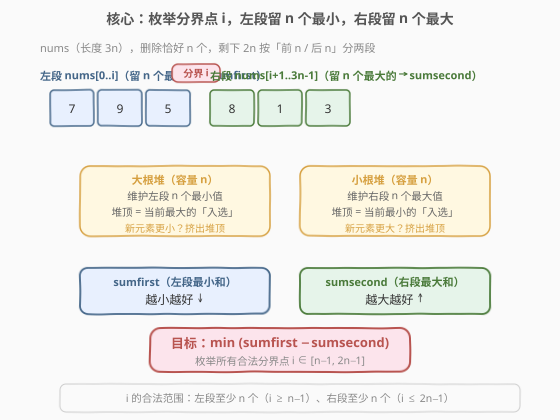
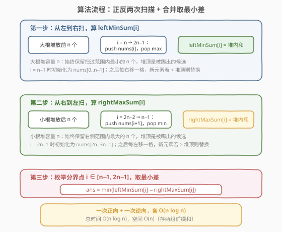

# 删除元素后和的最小差值

- **题目名称**：删除元素后和的最小差值
- **链接**：[2163. 删除元素后和的最小差值](https://leetcode.cn/problems/minimum-difference-in-sums-after-removal-of-elements/)
- **难度**：困难
- **标签**：数组、堆（优先队列）、前缀和

## 1. 题目概述

给你一个下标从 **0** 开始的整数数组 `nums`，它包含 $3n$ 个元素。你可以从 `nums` 中删除 **恰好** $n$ 个元素，剩下的 $2n$ 个元素将会被分成两个 **相同大小** 的部分：

- 前面 $n$ 个元素属于第一部分，它们的和记为 `sumfirst`。
- 后面 $n$ 个元素属于第二部分，它们的和记为 `sumsecond`。

两部分和的 **差值** 记为 $\text{sumfirst} - \text{sumsecond}$。请你返回删除 $n$ 个元素之后，剩下两部分和的 **差值的最小值**。

**示例 1**：

```text
输入：nums = [3,1,2]
输出：-1
解释：n = 1，需删除 1 个元素。
- 删 3 → [1,2]，差值 = 1 - 2 = -1
- 删 1 → [3,2]，差值 = 3 - 2 = 1
- 删 2 → [3,1]，差值 = 3 - 1 = 2
最小差值为 -1。
```

**示例 2**：

```text
输入：nums = [7,9,5,8,1,3]
输出：1
解释：n = 2，需删除 2 个元素。
删 nums[1]=9 和 nums[4]=1，剩下 [7,5,8,3]，
差值 = (7+5) - (8+3) = 12 - 11 = 1。
```

**约束条件**：

- $\text{nums.length} == 3 \times n$
- $1 \le n \le 10^5$
- $1 \le \text{nums}[i] \le 10^5$

> 💡 题眼在于：删完 $n$ 个元素后，剩下的 $2n$ 个元素 **保持原序**，按「前 $n$ / 后 $n$」自然分成两段。这意味着存在一个 **分界点** $i$，使得第一部分来自 $\text{nums}[0..i]$、第二部分来自 $\text{nums}[i+1..3n{-}1]$。把分界点作为枚举维度，问题就拆成了「左段取最小 / 右段取最大」两个独立子问题。

---

## 2. 解题思路

### 2.1 暴力思路：枚举所有删法

从 $3n$ 个元素中选 $n$ 个删除，共有 $\binom{3n}{n}$ 种方案，$n = 10^5$ 时这个数字是天文级，显然不可行。

换一个角度：不关心「删了谁」，而关心「剩下了谁」以及「分界在哪」。剩下 $2n$ 个元素保持原序，前 $n$ 个归 `sumfirst`、后 $n$ 个归 `sumsecond`。设分界点 $i$ 为第一部分最后一个元素在原数组中的下标，则：

- 第一部分：从 $\text{nums}[0..i]$ 中保留 $n$ 个（删掉 $i+1-n$ 个）。
- 第二部分：从 $\text{nums}[i+1..3n-1]$ 中保留 $n$ 个（删掉 $2n-1-i$ 个）。
- 总删除数 $= (i+1-n) + (2n-1-i) = n$ ✓（恰好等于 $n$，任何合法 $i$ 都自动满足）。

$i$ 的合法范围：左段至少 $n$ 个（$i \ge n-1$）、右段至少 $n$ 个（$i \le 2n-1$），故 $i \in [n-1, 2n-1]$，共 $n+1$ 种。

对每个 $i$，要从左段 $i+1$ 个元素中选 $n$ 个使和最小、从右段 $2n-1-i$ 个元素中选 $n$ 个使和最大。暴力枚举每个 $i$ 的选法仍是组合爆炸，需要更聪明的做法。

### 2.2 核心观察：两个堆各管一段



**观察一：左段「留 $n$ 个最小的和」随 $i$ 单调递增可用堆维护。**

当分界点从 $i$ 右移到 $i+1$ 时，左段多了一个 $\text{nums}[i+1]$，其余不变。我们要维护的始终是「当前左段中最小的 $n$ 个元素之和」。这正是 **大小为 $n$ 的大根堆** 的经典应用：

- 堆中维护当前入选的 $n$ 个最小元素，堆顶是这 $n$ 个中最大的（即「最容易被踢出」的）。
- 新来一个元素 $\text{nums}[i+1]$：若它比堆顶小，说明堆顶不配留在「最小 $n$ 个」中，弹出堆顶、压入新元素；否则直接丢弃新元素。

这样从 $i = n-1$ 扫到 $2n-1$，每个位置 $O(\log n)$，即可得到 $\text{leftMinSum}[i]$：左段 $\text{nums}[0..i]$ 中 $n$ 个最小元素之和。

**观察二：右段「留 $n$ 个最大的和」同理，方向反过来。**

从右向左扫描，用 **大小为 $n$ 的小根堆** 维护「当前右段中最大的 $n$ 个元素」，堆顶是这 $n$ 个中最小的（最容易被踢出）。新来一个元素若比堆顶大则替换。

从 $i = 2n-1$ 往左扫到 $n-1$，得到 $\text{rightMaxSum}[i]$：右段 $\text{nums}[i+1..3n-1]$ 中 $n$ 个最大元素之和。

> 💡 **方向对称性**：左段要最小 → 用大根堆（堆顶=最大，随时可踢）；右段要最大 → 用小根堆（堆顶=最小，随时可踢）。堆顶永远是「最不配入选的那个」，这是「在线维护 top-$n$」的通用范式。

### 2.3 算法流程图



三步走：

1. **正向扫描**：从 $i = n-1$ 到 $2n-1$，大根堆维护左段 $n$ 个最小，记录 $\text{leftMinSum}[i]$。
2. **逆向扫描**：从 $i = 3n-1$ 往左到 $n$，小根堆维护右段 $n$ 个最大。当堆满 $n$ 个且 $i \le 2n$ 时，分界点 $i-1$ 合法，直接计算 $\text{leftMinSum}[i-1] - \text{sum}$ 并更新答案。
3. **合并**：逆向扫描中边算边合并，无需额外存 $\text{rightMaxSum}$ 数组。

> ⚠️ **合并时机**：逆向扫描到位置 $i$ 时，堆中维护的是 $\text{nums}[i..3n-1]$ 中 $n$ 个最大元素，对应分界点 $i-1$（右段从 $i$ 开始）。所以查 $\text{leftMinSum}[i-1]$ 减去当前堆内和即为该分界点的差值。

### 2.4 示例演算

![示例演算：nums = [7,9,5,8,1,3]，n = 2](../images/mdsre_example_walkthrough.svg)

以 `nums = [7,9,5,8,1,3]`，$n = 2$ 为例，$i \in [1, 2, 3]$：

**正向（大根堆，留 2 个最小）**：

| $i$ | 左段 $\text{nums}[0..i]$ | 堆操作 | 堆内（最小 2 个） | $\text{leftMinSum}[i]$ |
|-----|--------------------------|--------|-------------------|------------------------|
| 1 | {7, 9} | 初始化 | {7, 9} | 16 |
| 2 | {7, 9, 5} | 5 < 9 → 挤出 9 | {5, 7} | 12 |
| 3 | {7, 9, 5, 8} | 8 > 7 → 丢弃 | {5, 7} | 12 |

**逆向（小根堆，留 2 个最大）+ 合并**：

| $i$ | 右段 $\text{nums}[i..5]$ | 堆操作 | 堆内（最大 2 个） | $\text{sum}$ | 分界 $i{-}1$ | $\text{leftMinSum}[i{-}1] - \text{sum}$ |
|-----|--------------------------|--------|-------------------|--------------|--------------|------------------------------------------|
| 5 | {3} | push 3 | {3} | 3 | — | 堆未满 |
| 4 | {1, 3} | push 1 | {1, 3} | 4 | 3 | 12 − 4 = 8 |
| 3 | {8, 1, 3} | 8 > 1 → 挤出 1 | {3, 8} | 11 | 2 | 12 − 11 = **1** ✓ |
| 2 | {5, 8, 1, 3} | 5 > 3 → 挤出 3 | {5, 8} | 13 | 1 | 16 − 13 = 3 |

$$\text{ans} = \min(8,\, 1,\, 3) = 1 \quad \checkmark$$

---

## 3. 参考代码

### C++

```cpp
class Solution {
  public:
    long long minimumDifference(vector<int>& nums) {
        int m = nums.size();
        int n = m / 3;

        // leftMinSum[i] = nums[0..i] 中 n 个最小元素之和
        vector<long long> leftMinSum(m, 0);
        priority_queue<int> maxHeap;          // 大根堆，容量 n，维护 n 个最小
        long long sum = 0;
        for (int i = 0; i < 2 * n; i++) {
            maxHeap.push(nums[i]);
            sum += nums[i];
            if ((int)maxHeap.size() > n) {
                sum -= maxHeap.top();         // 弹出最大的（最不配留在「最小 n 个」）
                maxHeap.pop();
            }
            if (i >= n - 1) {
                leftMinSum[i] = sum;
            }
        }

        // 逆向扫描 + 合并：小根堆维护右段 n 个最大
        priority_queue<int, vector<int>, greater<int>> minHeap;
        sum = 0;
        long long ans = LLONG_MAX;
        for (int i = 3 * n - 1; i >= n; i--) {
            minHeap.push(nums[i]);
            sum += nums[i];
            if ((int)minHeap.size() > n) {
                sum -= minHeap.top();         // 弹出最小的（最不配留在「最大 n 个」）
                minHeap.pop();
            }
            if (i <= 2 * n) {                 // 分界点 i-1 ∈ [n-1, 2n-1]
                ans = min(ans, leftMinSum[i - 1] - sum);
            }
        }
        return ans;
    }
};
```

### Python

```python
class Solution:
    def minimumDifference(self, nums: List[int]) -> int:
        m = len(nums)
        n = m // 3

        # leftMinSum[i] = nums[0..i] 中 n 个最小元素之和
        left_min_sum = [0] * m
        max_heap = []                         # 存负值模拟大根堆，容量 n
        s = 0
        for i in range(2 * n):
            heapq.heappush(max_heap, -nums[i])
            s += nums[i]
            if len(max_heap) > n:
                s += heapq.heappop(max_heap)  # pop 返回负的最大值，s += (-max) = s -= max
            if i >= n - 1:
                left_min_sum[i] = s

        # 逆向扫描 + 合并：小根堆维护右段 n 个最大
        min_heap = []
        s = 0
        ans = float('inf')
        for i in range(3 * n - 1, n - 1, -1):
            heapq.heappush(min_heap, nums[i])
            s += nums[i]
            if len(min_heap) > n:
                s -= heapq.heappop(min_heap)
            if i <= 2 * n:                    # 分界点 i-1 ∈ [n-1, 2n-1]
                ans = min(ans, left_min_sum[i - 1] - s)
        return ans
```

> ⚠️ **三个易错点**：
> 1. **Python 大根堆用取负模拟**：`heapq` 只有小根堆，存 `-nums[i]` 后堆顶是最小负值（即原值最大）。弹出时 `heappop` 返回负数，`s += (负数)` 等价于 `s -= 最大值`，语义正确。
> 2. **溢出**：$n \le 10^5$、$\text{nums}[i] \le 10^5$，堆内和最大 $10^{10}$，超出 `int` 范围。C++ 必须用 `long long`；Python 整数无溢出问题。
> 3. **合并的索引对应**：逆向扫描到位置 $i$ 时，堆维护的是 $\text{nums}[i..3n{-}1]$，对应分界点 $i-1$。条件 `i <= 2*n` 保证 $i-1 \le 2n-1$（右段至少 $n$ 个）；循环下界 `i >= n` 保证 $i-1 \ge n-1$（左段至少 $n$ 个）。

---

## 4. 复杂度分析

| 维度 | 复杂度 | 说明 |
|------|--------|------|
| 时间复杂度 | $O(n \log n)$ | 正向扫描 $n+1$ 个位置、逆向扫描 $2n$ 个位置，每次堆操作 $O(\log n)$，共 $O(n \log n)$ |
| 空间复杂度 | $O(n)$ | `leftMinSum` 数组 $O(n)$ + 两个堆各 $O(n)$，共 $O(n)$ |

> 💡 $n = 10^5$ 时总运算量约 $10^5 \times 17 \approx 1.7 \times 10^6$，远低于时限。若不需保留 `leftMinSum` 全表（逆向合并时按序消费），可改为数组即够——本题逆向扫描顺序与正向相反，需随机访问 $\text{leftMinSum}[i-1]$，故必须存全表。

---

## 5. 扩展：为何不能贪心地「全局删最大的 $n$ 个」？

直觉上，要最小化 $\text{sumfirst} - \text{sumsecond}$，似乎应该把大的数尽量塞到右段、小的数塞到左段。但 **分界点约束** 使得这不是简单的「全局排序后前 $n$ 小归左、后 $n$ 大归右」。

**反例**：`nums = [1, 100, 2, 99, 3, 98]`，$n = 2$。

- 全局最小 4 个：$\{1, 2, 3, 98\}$；最大 4 个：$\{100, 99, 98, 3\}$。若贪心地把 $\{1, 2\}$ 放左段、$\{99, 100\}$... 但 $100$ 在下标 1、$99$ 在下标 3，它们中间夹着 $2$。分界点必须在某处使左段含 $100$ 或不含，无法任意分配。
- 实际最优：分界 $i = 2$，左段 $\{1, 100, 2\}$ 留 $\{1, 2\}$，和 $= 3$；右段 $\{99, 3, 98\}$ 留 $\{99, 98\}$，和 $= 197$；差值 $= 3 - 197 = -194$。

> 💡 **本质**：元素的原序不可打乱，分界点决定了哪些元素 **有机会** 进入左段 / 右段。堆的作用正是在「分界点滑动」时高效维护各段的 top-$n$，而非全局排序。这与 [239. 滑动窗口最大值](../0201-0300/239_滑动窗口最大值.md) 中「窗口滑动时维护极值」的思想一脉相承，只是本题维护的是 top-$n$ 之和而非单个极值。

---

## 6. 面试要点

1. **为什么能枚举分界点 $i$？一个 $i$ 能代表所有删法吗？**

   - 删完 $n$ 个后剩下 $2n$ 个保持原序，前 $n$ 个归 `sumfirst`、后 $n$ 个归 `sumsecond`。第 $n$ 个剩余元素在原数组中的下标就是分界点 $i$。一旦 $i$ 固定，左段范围 $\text{nums}[0..i]$ 和右段范围 $\text{nums}[i+1..3n{-}1]$ 就确定了，且总删除数恰好 $= n$（左删 $i+1-n$ + 右删 $2n-1-i$）。枚举所有合法 $i$ 即覆盖所有删法。

2. **为什么左段用大根堆、右段用小根堆？**

   - 左段要选 $n$ 个最小的，大根堆的堆顶是当前入选 $n$ 个中最大的——正是「最该被踢出」的候选。新元素更小时替换堆顶，堆始终维持 $n$ 个最小。右段要选 $n$ 个最大的，小根堆的堆顶是入选 $n$ 个中最小的，同理可踢。**堆顶 = 最不配入选的**，这是 top-$n$ 维护的通用范式。

3. **逆向扫描时为何能边算边合并，不用存 $\text{rightMaxSum}$ 数组？**

   - 逆向扫描到位置 $i$ 时，堆中恰好是 $\text{nums}[i..3n{-}1]$ 的 $n$ 个最大值，对应分界点 $i-1$ 的右段。而 $\text{leftMinSum}[i-1]$ 已在正向扫描时算好存入数组，可直接查表。逆向扫描的顺序（$i$ 从大到小）恰好与合法分界点 $i-1$ 从 $2n-1$ 到 $n-1$ 一致，无需逆序访问 `leftMinSum`。

4. **时间复杂度为什么是 $O(n \log n)$ 而非 $O(n^2)$？**

   - 关键在于堆把「滑动时更新 top-$n$」从 $O(n)$ 降到了 $O(\log n)$。若不用堆，每次 $i$ 变化后重新排序左段 $O(n \log n)$、共 $n$ 次 $\to O(n^2 \log n)$。堆利用了「每次只增删一个元素」的增量性，单次 $O(\log n)$ 维护，总计 $O(n \log n)$。

5. **如果题目改成「最大化差值」怎么做？**

   - 镜像翻转：左段留 $n$ 个最大（小根堆维护）、右段留 $n$ 个最小（大根堆维护），取 $\max(\text{leftMaxSum}[i] - \text{rightMinSum}[i])$。算法骨架完全不变，只换堆的方向和极值取向。

---

## 7. 同类练习题

- [239. 滑动窗口最大值](https://leetcode.cn/problems/sliding-window-maximum/)（[题解](../0201-0300/239_滑动窗口最大值.md)）：单调队列维护滑动窗口极值，与本题堆维护「分界点滑动时 top-$n$」思路一脉相承
- [295. 数据流的中位数](https://leetcode.cn/problems/find-median-from-data-stream/)（[题解](../0201-0300/295_数据流的中位数.md)）：大根堆 + 小根堆协同维护动态中位数，是本题「双堆各管一段」的母题
- [378. 有序矩阵中第 K 小的元素](https://leetcode.cn/problems/kth-smallest-element-in-a-sorted-matrix/)（[题解](../0301-0400/378_有序矩阵中第K小的元素.md)）：堆维护 top-$k$ 的经典应用，与本题「堆容量 $n$ 维护 top-$n$」同源
- [632. 最小区间](https://leetcode.cn/problems/smallest-range-covering-elements-from-k-lists/)（[题解](../0601-0700/632_最小区间.md)）：小根堆归并 $k$ 个有序列表维护「当前最小值」，与本题小根堆维护右段 $n$ 个最大的手法相通
- [703. 数据流中的第 K 大元素](https://leetcode.cn/problems/kth-largest-element-in-a-stream/)（[题解](../0701-0800/703_数据流中的第K大元素.md)）：小根堆容量 $k$ 维护第 $k$ 大，是本题「堆容量 $n$ 维护 top-$n$」的最简入门版
