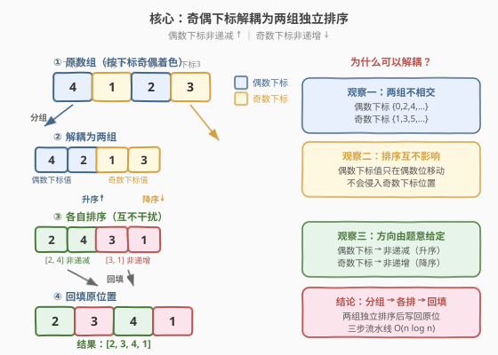
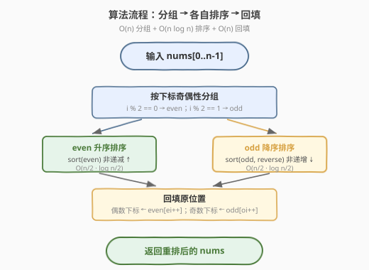
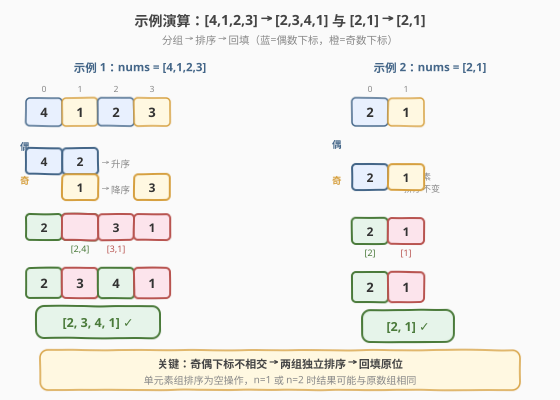

# 对奇偶下标分别排序

- **题目名称**：对奇偶下标分别排序
- **链接**：[2164. 对奇偶下标分别排序](https://leetcode.cn/problems/sort-even-and-odd-indices-independently/)
- **难度**：简单
- **标签**：数组、排序

## 1. 题目概述

给你一个下标从 `0` 开始的整数数组 `nums`。根据下述规则重排 `nums` 中的值：

- 按 **非递增** 顺序排列 `nums` **奇数下标** 上的所有值；
- 按 **非递减** 顺序排列 `nums` **偶数下标** 上的所有值。

返回重排 `nums` 的值之后形成的数组。

**示例 1**：

```text
输入：nums = [4,1,2,3]
输出：[2,3,4,1]
解释：
首先，按非递增顺序重排奇数下标（1 和 3）的值。
所以 nums 从 [4,1,2,3] 变为 [4,3,2,1]。
然后，按非递减顺序重排偶数下标（0 和 2）的值。
所以 nums 从 [4,1,2,3] 变为 [2,3,4,1]。
```

**示例 2**：

```text
输入：nums = [2,1]
输出：[2,1]
解释：由于只有一个奇数下标和一个偶数下标，所以不会发生重排。
```

**约束条件**：

- $1 \le \text{nums.length} \le 100$
- $1 \le \text{nums}[i] \le 100$

> 💡 本题的核心不在于"怎么排序"，而在于**看清奇偶下标是两组互不干扰的独立集合**。一旦意识到这一点，剩下的只是"分组 → 各自排序 → 回填"三步流水线。

---

## 2. 解题思路

### 2.1 暴力思路：枚举所有排列

最暴力的做法是：枚举 `nums` 的所有排列（共 $n!$ 种），对每种排列检查是否满足「偶数下标非递减且奇数下标非递增」，取第一个满足的。当 $n = 100$ 时这是天文数字，完全不可行。

稍好一点的"半暴力"：对偶数下标的值做一次全排列枚举找出非递减序，对奇数下标同理——但既然要找非递减序，**直接排序就是答案**，枚举纯属多余。

> ⚠️ 暴力法之所以浪费，是因为它把"两组各自排序"看成了一个整体重排问题，忽略了奇偶下标**位置互不交叉**这一关键结构。

### 2.2 核心观察：奇偶下标互不干扰，可解耦分组排序



**观察一：奇数下标和偶数下标是两个不相交的位置集合。**

数组下标 `0, 1, 2, 3, ...` 天然分成两组：

- **偶数下标组**：`0, 2, 4, 6, ...`（蓝色）
- **奇数下标组**：`1, 3, 5, 7, ...`（橙色）

这两个集合**没有交集**：一个位置要么是偶数下标，要么是奇数下标，绝不会同时属于两组。

**观察二：两组排序互不影响。**

对偶数下标上的值做排序时，值只在偶数下标之间移动，**不会跑到奇数下标去**；反之亦然。因此两组的排序是**完全独立**的两个子问题，可以分别处理、最后回填。

> 💡 **解耦的关键**：如果两组的位置有交叉（比如"下标 % 3 == 0 的升序、下标 % 3 == 1 的降序"），仍然可以解耦——只要分组规则把每个位置唯一地归入一组，各组就是独立的。本题是 $k=2$ 的特例。

**观察三：排序方向由题意直接给定。**

- 偶数下标 → 非递减（升序，允许相等）
- 奇数下标 → 非递增（降序，允许相等）

两组方向相反，但这只是排序时的 `reverse` 参数区别，不影响解耦思路。

### 2.3 算法流程图



三步走：

1. **分组**：遍历 `nums`，按下标奇偶性把值分别收集到 `even`（偶数下标）和 `odd`（奇数下标）两个列表。
2. **各自排序**：`even` 升序排序（非递减），`odd` 降序排序（非递增）。
3. **回填**：按下标奇偶性把排好序的值写回 `nums` 的对应位置。

### 2.4 示例演算



**示例 1：`nums = [4,1,2,3]`**

- 分组：
  - 偶数下标（位置 0、2）：值 `[4, 2]`
  - 奇数下标（位置 1、3）：值 `[1, 3]`
- 各自排序：
  - `even` 升序：`[4, 2] → [2, 4]`
  - `odd` 降序：`[1, 3] → [3, 1]`
- 回填：
  - 位置 0 ← `2`，位置 2 ← `4`（偶数下标按升序填）
  - 位置 1 ← `3`，位置 3 ← `1`（奇数下标按降序填）
- 结果：`[2, 3, 4, 1]` ✓

**示例 2：`nums = [2,1]`**

- 分组：偶数下标 `[2]`，奇数下标 `[1]`
- 排序：各只有一个元素，排序不变
- 回填：`[2, 1]`（与原数组相同）✓

> ⚠️ 当某组只有一个元素时，排序是空操作。$n = 1$ 时只有偶数下标组有 1 个元素、奇数下标组为空，结果就是原数组。

---

## 3. 参考代码

### C++（分组 + 排序 + 回填）

```cpp
class Solution {
  public:
    vector<int> sortEvenOdd(vector<int>& nums) {
        int n = nums.size();
        vector<int> even, odd;
        for (int i = 0; i < n; i++) {
            if (i % 2 == 0) even.push_back(nums[i]);
            else            odd.push_back(nums[i]);
        }
        sort(even.begin(), even.end());                 // 非递减
        sort(odd.begin(), odd.end(), greater<int>());   // 非递增
        for (int i = 0, ei = 0, oi = 0; i < n; i++) {
            if (i % 2 == 0) nums[i] = even[ei++];
            else            nums[i] = odd[oi++];
        }
        return nums;
    }
};
```

### Python（切片取分组 + 切片赋值回填）

```python
class Solution:
    def sortEvenOdd(self, nums: List[int]) -> List[int]:
        even = sorted(nums[0::2])               # 偶数下标，非递减
        odd  = sorted(nums[1::2], reverse=True) # 奇数下标，非递增
        ans = nums[:]
        ans[0::2] = even
        ans[1::2] = odd
        return ans
```

### Python（原地版，避免拷贝）

```python
class Solution:
    def sortEvenOdd(self, nums: List[int]) -> List[int]:
        nums[0::2] = sorted(nums[0::2])
        nums[1::2] = sorted(nums[1::2], reverse=True)
        return nums
```

> 💡 **Python 切片赋值** `ans[0::2] = even` 会把 `even` 的元素依次填入 `ans` 的偶数下标位置，长度必须匹配。`nums[0::2]` 取所有偶数下标元素，`nums[1::2]` 取所有奇数下标元素——一步完成分组，比循环更简洁。原地版直接对 `nums` 切片赋值，省去 `ans` 拷贝，但会修改输入数组（LeetCode 不在意）。

> ⚠️ C++ 中 `greater<int>()` 需要 `#include <functional>`（LeetCode 已默认包含）。若不想引入头文件，可对 `odd` 升序排序后用 `reverse(odd.begin(), odd.end())` 等价实现降序。

---

## 4. 复杂度分析

| 维度 | 复杂度 | 说明 |
|------|--------|------|
| 时间复杂度 | $O(n \log n)$ | 分组 $O(n)$、排序 $O(\lceil n/2 \rceil \log \lceil n/2 \rceil) + O(\lfloor n/2 \rfloor \log \lfloor n/2 \rfloor) = O(n \log n)$、回填 $O(n)$，排序主导 |
| 空间复杂度 | $O(n)$ | `even` 和 `odd` 两个辅助列表合计存放 $n$ 个元素 |

> 💡 两组各约 $n/2$ 个元素，排序复杂度为 $2 \times O(\frac{n}{2} \log \frac{n}{2}) = O(n \log n)$，与整体排序同阶但常数更小。若用原地排序（见扩展），空间可降到 $O(n)$ 不可再低——因为分组本身需要额外存储。

---

## 5. 扩展：原地单排序解法

上面的解法用了两个辅助列表。能否只用一次排序搞定？答案是**可以**——利用自定义比较器把两组排序合并成一次。

**思路**：把每个元素连同其下标打包成 `(value, index)` 二元组，对二元组数组排序，比较规则为：

1. **先按下标奇偶性分组**：偶数下标整体排在奇数下标前面（这样偶数下标的值占据结果数组的前半段）；
2. **组内按题意方向排**：偶数下标组内按 `value` 升序，奇数下标组内按 `value` 降序。

排序后，结果数组的前 $\lceil n/2 \rceil$ 个就是偶数下标的升序值，后 $\lfloor n/2 \rfloor$ 个是奇数下标的降序值，再按下标回填即可。

```cpp
class Solution {
  public:
    vector<int> sortEvenOdd(vector<int>& nums) {
        int n = nums.size();
        vector<pair<int,int>> v;           // (value, index)
        for (int i = 0; i < n; i++) v.emplace_back(nums[i], i);
        auto cmp = [](const auto& a, const auto& b) {
            int pa = a.second % 2, pb = b.second % 2;
            if (pa != pb) return pa < pb;            // 偶数下标在前
            if (pa == 0) return a.first < b.first;   // 偶数组：升序
            return a.first > b.first;                // 奇数组：降序
        };
        sort(v.begin(), v.end(), cmp);
        for (int i = 0; i < n; i++) nums[i] = v[i].first;
        return nums;
    }
};
```

> ⚠️ 这个版本仍是 $O(n \log n)$ 时间、$O(n)$ 空间（二元组数组），**渐近复杂度不变**，只是把两次排序合成一次。实际运行比分组版略慢（比较器更复杂、无法利用缓存局部性），仅作思路拓展。

**更一般的推广**：若题目要求按下标对 $k$ 取模的余数分组、每组按各自方向排序，同样可用"先按余数分组、组内按方向排序"的自定义比较器一次完成。分组解耦是核心，比较器只是实现手段。

---

## 6. 面试要点

1. **为什么奇偶下标可以独立排序？**

   - 偶数下标集合 $\{0,2,4,\dots\}$ 与奇数下标集合 $\{1,3,5,\dots\}$ **不相交**，且并集覆盖全部下标。对一组的值排序时，值只在该组的位置之间移动，不会侵入另一组的位置，因此两组排序互不干扰，可解耦。

2. **"非递增"和"非递减"分别是什么意思？**

   - 非递减 = 升序但允许相邻相等（$a_0 \le a_1 \le \dots$），即 `sorted(...)` 默认行为；非递增 = 降序但允许相邻相等（$a_0 \ge a_1 \ge \dots$），即 `sorted(..., reverse=True)`。注意"非递增"不是"严格递减"，相等的值不需要交换。

3. **Python 切片赋值 `ans[0::2] = even` 的前提是什么？**

   - `even` 的长度必须恰好等于 `ans[0::2]` 的长度（即 $\lceil n/2 \rceil$）。由于 `even` 就是从 `ans[0::2]` 取出排序得到的，长度天然匹配。若长度不符会抛 `ValueError`。切片赋值是**按位置逐一填入**，不是把 `even` 作为一个整体插入。

4. **$n = 1$ 时会怎样？**

   - 偶数下标组只有位置 0 一个元素，奇数下标组为空。`odd` 为空列表，排序和回填都是空操作，结果就是原数组。代码无需特判——空列表排序是空操作，回填循环中奇数分支不会执行。

5. **能否做到 $O(1)$ 额外空间？**

   - 理论上可以对偶数下标和奇数下标分别做原地排序（如手写插入排序，按下标步长 2 遍历），从而避免辅助列表。但 $n \le 100$ 时辅助列表仅占几百字节，工程上无意义；且标准库 `sort` 无法直接对"步长为 2 的下标子序列"原地排序，手写实现反而更易出错。面试中写分组版即可。

---

## 7. 同类练习题

- [2149. 按符号重排数组](https://leetcode.cn/problems/rearrange-array-elements-by-sign/)（[题解](../2101-2200/2149_按符号重排数组.md)）：同为"按下标奇偶性分组回填"的套路，正数填偶数下标、负数填奇数下标，分组解耦思路一致
- [922. 按奇偶排序数组 II](https://leetcode.cn/problems/sort-array-by-parity-ii/)：按下标奇偶性放置奇偶值，分组后交叉回填，与本题"分组→回填"框架相同但分组依据是值而非位置
- [905. 按奇偶排序数组](https://leetcode.cn/problems/sort-array-by-parity/)：922 的简化版（不要求交错），双指针分组的基础题
- [2160. 拆分数位后四位数字的最小和](https://leetcode.cn/problems/minimum-sum-of-four-digit-number-after-splitting-digits/)（[题解](../2101-2200/2160_拆分数位后四位数字的最小和.md)）：同为简单排序题，"排序后按位置规则分配"的思路相通
- [1331. 数组序号转换](https://leetcode.cn/problems/rank-transform-of-an-array/)：排序后按值分配序号回填原位置，"排序 + 位置回填"的另一变体
