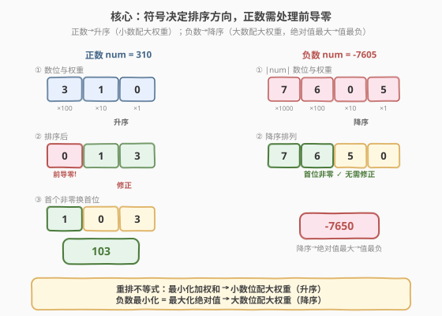
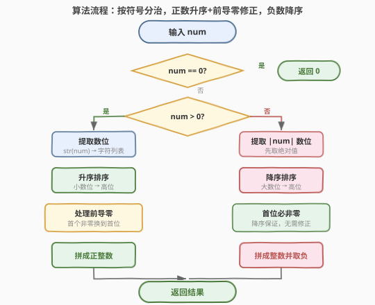
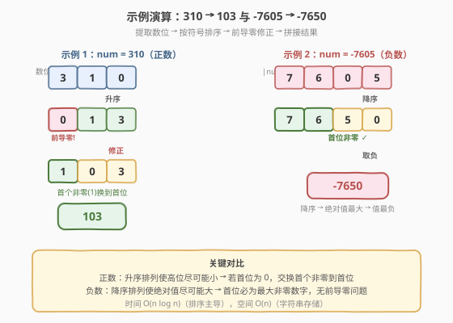

# LeetCode 重排数字的最小值 题解

## 1. 题目概述

- **标题 / 题号**：重排数字的最小值（#2165，medium）
- **链接**：https://leetcode.cn/problems/smallest-value-of-the-rearranged-number/
- **难度**：中等
- **标签**：数学、贪心、排序

**题意**：给你一个整数 `num`。**重排** `num` 中的各位数字，使其值 **最小化** 且不含 **任何** 前导零。

返回不含前导零且值最小的重排数字。

注意，重排各位数字后，`num` 的符号不会改变。

**示例 1**：

```text
输入：num = 310
输出：103
解释：310 中各位数字的可行排列有：013、031、103、130、301、310。
不含任何前导零且值最小的重排数字是 103。
```

**示例 2**：

```text
输入：num = -7605
输出：-7650
解释：-7605 中各位数字的部分可行排列为：-7650、-6705、-5076、-0567。
不含任何前导零且值最小的重排数字是 -7650。
```

**约束**：

- $-10^{15} \le \text{num} \le 10^{15}$

> 💡 题眼在于两点：**① 符号决定排序方向**——正数要「小数位配高权重」（升序），负数要「大数位配高权重」（降序，使绝对值最大从而值最负）；**② 前导零约束只影响正数**——升序后若首位为 0，需把首个非零数字换到首位。想清这两点，一次排序即可解决。

## 2. 解题思路

### 2.1 暴力思路：枚举所有排列

最直觉的做法是：提取 `num` 的所有数位，枚举这些数位的**所有全排列**，过滤掉有前导零的排列，再在剩余合法排列中找值最小的一个。

对于 $n$ 个数位，唯一排列数最多为 $n!$（数位全不同时），加上前导零过滤和取最小值，总复杂度为 $O(n! \times n)$。

> ⚠️ 约束允许 `num` 达 $10^{15}$（最多 16 位数），$16! \approx 2.09 \times 10^{13}$，远超时间限制。暴力枚举只在数位很少时可行，无法通过全部数据。我们需要利用**贪心排序**直接构造最优解，避免枚举。

### 2.2 核心观察：贪心排序 — 符号定方向，正数处理前导零



**观察一：数字的值 = 数位与权重的加权和。**

一个 $n$ 位数的值可以表示为：

$$
\text{value} = \sum_{i=0}^{n-1} d_i \times 10^{n-1-i}
$$

其中 $d_i$ 是数位，$10^{n-1-i}$ 是该位置对应的权重（最高位权重最大）。由**重排不等式**，最小化或最大化这个加权和，只需要将数位与权重做特定方向的配对。

**观察二：正数升序，负数降序。**

| 符号 | 目标 | 排序方向 | 原理 |
|------|------|----------|------|
| $\text{num} > 0$ | 最小化 $\sum d_i \times w_i$ | **升序** | 最小数位配最大权重（高位），由重排不等式 |
| $\text{num} < 0$ | 最小化 $-\sum d_i \times w_i$，即**最大化** $\sum d_i \times w_i$ | **降序** | 最大数位配最大权重，使绝对值最大，负值最负 |

> 💡 **负数的直觉**：负数越小（越负），绝对值越大。要使 $-|\text{value}|$ 最小，就要让 $|\text{value}|$ 最大，即把大数位放高位。所以负数用**降序排序**。

**观察三：前导零约束只影响正数。**

- **正数**：升序后最小的数位（可能为 0）排在首位，若为 0 则违反前导零约束。修正方法：**找到首个非零数字，交换到首位**。由于 `num > 0`，至少存在一个非零数位。
- **负数**：降序后首位是最大的数位。因为 `num < 0` 意味着 `|num| > 0`，至少有一个非零数位，而降序保证最大数位排在首位，不可能为 0。**无需修正**。

**修正的正确性**：升序后数组形如 $[0, 0, \ldots, 0, d_k, d_{k+1}, \ldots]$（$d_k$ 为首个非零）。交换 $s[0]$ 与 $s[k]$ 后变为 $[d_k, 0, \ldots, 0, d_{k+1}, \ldots]$——首位是非零数位 $d_k$（所有非零数位中最小的一个），其余仍保持升序。这是满足前导零约束下的最小排列。

### 2.3 算法流程图



流程分四步：

1. **判零**：若 `num == 0`，直接返回 0（0 的重排仍为 0）。
2. **判符号**：`num > 0` 走正数分支，`num < 0` 走负数分支。
3. **正数分支**：提取数位 → 升序排序 → 若首位为 0 则交换首个非零到首位 → 拼成正整数。
4. **负数分支**：取绝对值 → 提取数位 → 降序排序 → 拼成整数并取负。

### 2.4 示例演算



**示例 1：`num = 310`（正数）**

- 提取数位：`[3, 1, 0]`
- 升序排序：`[0, 1, 3]` → 首位为 0，前导零!
- 修正：首个非零数字是 `1`（索引 1），交换到首位 → `[1, 0, 3]`
- 结果：`103` ✓

**示例 2：`num = -7605`（负数）**

- 取绝对值 `7605`，提取数位：`[7, 6, 0, 5]`
- 降序排序：`[7, 6, 5, 0]` → 首位为 7（非零），无需修正
- 拼成整数并取负：`-7650` ✓

> ⚠️ 对比两个示例的关键差异：正数升序后可能产生前导零，需要一步交换修正；负数降序后首位必为最大数位（非零），天然满足约束。

## 3. 参考代码

### C++

```cpp
class Solution {
  public:
    long long smallestNumber(long long num) {
        if (num == 0) return 0;
        if (num > 0) {
            string s = to_string(num);
            sort(s.begin(), s.end());
            int i = 0;
            while (i < s.size() && s[i] == '0') i++;
            if (i > 0) swap(s[0], s[i]);
            return stoll(s);
        } else {
            string s = to_string(-num);
            sort(s.begin(), s.end(), greater<char>());
            return -stoll(s);
        }
    }
};
```

### Python

```python
class Solution:
    def smallestNumber(self, num: int) -> int:
        if num == 0:
            return 0
        if num > 0:
            s = sorted(str(num))
            if s[0] == '0':
                for i in range(1, len(s)):
                    if s[i] != '0':
                        s[0], s[i] = s[i], s[0]
                        break
            return int(''.join(s))
        else:
            s = sorted(str(-num), reverse=True)
            return -int(''.join(s))
```

### Python（计数排序版，O(n) 时间）

```python
class Solution:
    def smallestNumber(self, num: int) -> int:
        if num == 0:
            return 0
        if num > 0:
            cnt = [0] * 10
            for c in str(num):
                cnt[int(c)] += 1
            # 首位放最小的非零数字
            for d in range(1, 10):
                if cnt[d]:
                    cnt[d] -= 1
                    res = str(d)
                    break
            # 其余按升序追加
            for d in range(10):
                res += str(d) * cnt[d]
            return int(res)
        else:
            cnt = [0] * 10
            for c in str(-num):
                cnt[int(c)] += 1
            # 降序拼接
            res = ''
            for d in range(9, -1, -1):
                res += str(d) * cnt[d]
            return -int(res)
```

> 💡 数位只有 0–9 共 10 种，用计数排序可将时间从 $O(n \log n)$ 降到 $O(n)$。当 $n$ 很大（如 16 位）时差异不大，但面试中提及此优化可展示对数据范围的敏感度。

## 4. 复杂度分析

| 维度 | 复杂度 | 说明 |
|------|--------|------|
| 时间复杂度 | $O(n \log n)$ | 排序主导，$n$ 为数位个数（$\le 16$）；计数排序版为 $O(n)$ |
| 空间复杂度 | $O(n)$ | 字符串存储数位，$n \le 16$，实际为常数空间 |

> 💡 由于 $n \le 16$（$10^{15}$ 为 16 位数），所有操作在常数规模内完成。即使推广到任意 $n$ 位数，排序也仅为 $O(n \log n)$。

## 5. 扩展：求重排后的最大值

若将问题改为求**最大值**（仍不含前导零），策略对称翻转：

- **正数**：降序排序 → 大数位配大权重，首位必非零（最大数位），无需修正。
- **负数**：升序排序 → 小数位配大权重，使绝对值最小，负值最大（最接近 0）。但此时首位可能为 0——不过对负数而言，首位 0 等效于减少位数（如 `-0123 = -123`），这反而使绝对值更小，正是我们想要的。因此**负数升序无需修正前导零**。

| 目标 | 正数 | 负数 |
|------|------|------|
| **最小值** | 升序 + 前导零修正 | 降序（无需修正） |
| **最大值** | 降序（无需修正） | 升序（无需修正） |

> ⚠️ 正数求最大值时降序，首位是最大数位，必非零（因 $\text{num} > 0$ 至少有一个非零数位）；负数求最大值时升序，前导零使绝对值变小，值更接近 0（更大），符合目标。

## 6. 面试要点

1. **为什么正数升序、负数降序？**

   - 数字的值 $= \sum d_i \times 10^{n-1-i}$。正数最小化此和 → 由重排不等式，最小数位配最大权重 → 升序。负数最小化 $= -$ 最大化此和 → 最大数位配最大权重 → 降序（使绝对值最大，值最负）。

2. **前导零修正的方法是什么？为什么正确？**

   - 升序后若首位为 0，找到首个非零数字交换到首位。修正后数组变为 $[d_k, 0, \ldots, 0, d_{k+1}, \ldots]$，其中 $d_k$ 是最小的非零数位。这是满足前导零约束下的最小排列：首位取最小的非零值，其余位仍按升序排列。

3. **为什么负数不需要处理前导零？**

   - 负数用降序排序，首位是最大的数位。因为 $\text{num} < 0$ 意味着 $|\text{num}| > 0$，至少有一个非零数位，降序保证首位必为该非零最大值，不可能为 0。

4. **`num = 0` 的边界情况如何处理？**

   - 0 的所有数位都是 0，重排后仍为 0。代码开头单独判断 `num == 0` 直接返回 0，避免后续排序和前导零修正中的空列表或全零字符串问题。

5. **能否用计数排序优化到 O(n)？**

   - 可以。数位只有 0–9 共 10 种，用一个长度为 10 的计数数组统计各数位出现次数，然后按需构造结果字符串。正数先取最小的非零数位放首位，再按 0→9 顺序追加；负数按 9→0 顺序拼接即可。时间 $O(n)$，空间 $O(1)$（计数数组固定大小 10）。

## 同类练习题

| # | 题目 | 与本题的关联 |
|---|------|-------------|
| 2160 | [拆分数位后四位数字的最小和](https://leetcode.cn/problems/minimum-sum-of-four-digit-number-after-splitting-digits/)（[题解](../2101-2200/2160_拆分数位后四位数字的最小和.md)） | 同为数位排序题，重排不等式配对权重的思路一脉相承 |
| 7 | [整数反转](https://leetcode.cn/problems/reverse-integer/)（[题解](../0001-0100/7_整数反转.md)） | 整数数位的弹出/压入母题，`% 10` + `/ 10` 取位手法是本题提取数位的基础 |
| 9 | [回文数](https://leetcode.cn/problems/palindrome-number/)（[题解](../0001-0100/9_回文数.md)） | 数位操作入门题，反转一半数字判回文的取位技巧与本题互通 |
| 2119 | [反转两次的数字](https://leetcode.cn/problems/a-number-after-a-double-reversal/)（[题解](../2101-2200/2119_反转两次的数字.md)） | 同为数位重排题，考察数位翻转后前导零消失的性质，与本题前导零约束形成对照 |
| 506 | [相对名次](https://leetcode.cn/problems/relative-ranks/) | 排序后按位置重新赋值，与本题「排序后按权位分配」思路相通 |
