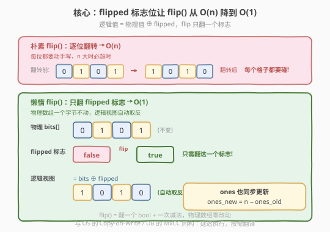
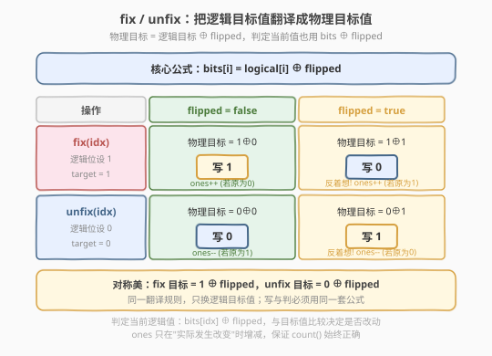
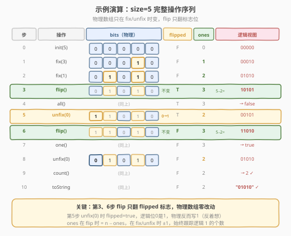

# 设计位集

- **题目名称**：设计位集
- **链接**：[2166. 设计位集](https://leetcode.cn/problems/design-bitset/)
- **难度**：中等
- **标签**：设计、数组、位运算

## 1. 题目概述

请你实现一个 `Bitset` 类，能以紧凑形式存储位并支持以下操作：

| 方法 | 语义 |
|------|------|
| `Bitset(int size)` | 用 `size` 个位初始化，所有位都是 `0` |
| `void fix(int idx)` | 将下标 `idx` 处的位更新为 `1`（已是 `1` 则不变） |
| `void unfix(int idx)` | 将下标 `idx` 处的位更新为 `0`（已是 `0` 则不变） |
| `void flip()` | 翻转每一位：`0→1`，`1→0` |
| `boolean all()` | 是否**每一位**都是 `1` |
| `boolean one()` | 是否**至少一位**是 `1` |
| `int count()` | 返回值为 `1` 的位的总数 |
| `String toString()` | 返回当前组成情况，第 `i` 个字符对应第 `i` 位 |

**示例**：

```text
输入
["Bitset", "fix", "fix", "flip", "all", "unfix", "flip", "one", "unfix", "count", "toString"]
[[5], [3], [1], [], [], [0], [], [], [0], [], []]
输出
[null, null, null, null, false, null, null, true, null, 2, "01010"]

解释
Bitset bs = new Bitset(5);  // bitset = "00000"
bs.fix(3);     // bitset = "00010"
bs.fix(1);     // bitset = "01010"
bs.flip();     // bitset = "10101"
bs.all();      // False
bs.unfix(0);   // bitset = "00101"
bs.flip();     // bitset = "11010"
bs.one();      // True
bs.unfix(0);   // bitset = "01010"
bs.count();    // 2
bs.toString(); // "01010"
```

**约束条件**：

- $1 \le \text{size} \le 10^5$
- $0 \le \text{idx} \le \text{size} - 1$
- 至多调用 `fix`、`unfix`、`flip`、`all`、`one`、`count`、`toString` 方法总共 $10^5$ 次
- 至少调用 `all`、`one`、`count` 或 `toString` 方法一次
- 至多调用 `toString` 方法 $5$ 次

> 💡 题眼在 `flip()`：朴素实现要逐位翻转 $O(n)$，而 `flip` 可能被调用 $O(10^5)$ 次、$n$ 也达 $10^5$，最坏 $O(n^2) = 10^{10}$ 必然超时。**必须把 `flip()` 降到 $O(1)$**——这正是本题的考点。

---

## 2. 解题思路

### 2.1 暴力思路：直接维护位数组

最直白的做法是开一个 `bool`（或 `int` 0/1）数组 `bits[size]`，直接照字面语义实现：

- `fix(idx)`：`bits[idx] = 1`
- `unfix(idx)`：`bits[idx] = 0`
- `flip()`：遍历 `bits`，每一位 `bits[i] ^= 1` 或 `1 - bits[i]` → **$O(n)$**
- `all()`：遍历判全 `1` → $O(n)$（或维护 `ones` 计数到 $O(1)$）
- `one()`：遍历判存在 `1` → $O(n)$（或维护 `ones` 到 $O(1)$）
- `count()`：遍历数 `1` → $O(n)$（或维护 `ones` 到 $O(1)$）
- `toString()`：遍历拼字符串 → $O(n)$

`fix`/`unfix` 是 $O(1)$，`all`/`one`/`count`/`toString` 都能用一个 `ones` 计数变量降到 $O(1)$（`toString` 除外，必须 $O(n)$）。但 `flip()` 逐位翻转的 $O(n)$ 无从优化——它要改变**每一个**位的值。

> ⚠️ 总调用次数 $\le 10^5$，若其中一半是 `flip`，朴素实现最坏 $\frac{10^5}{2} \times 10^5 = 5 \times 10^9$ 次位写操作，必然 TLE。瓶颈在 `flip`。

### 2.2 核心观察：懒惰翻转——用一个 flipped 标志位代替逐位翻转



关键洞察：**`flip()` 真正需要改变的，只是一个"当前是否处于反转视角"的标志位**。

引入一个布尔量 `flipped`（初值 `false`），表示"逻辑视角是否被翻转"。数组 `bits[]` 始终存储**物理状态**，而用户看到的**逻辑状态**为：

$$
\text{logical}[i] = \text{bits}[i] \oplus \text{flipped}
$$

- `flipped == false`：逻辑 = 物理，所见即所得。
- `flipped == true`：逻辑 = 物理取反，每位都被"戴上反转眼镜"看。

于是 `flip()` 只需一行：`flipped = !flipped`，**$O(1)$** 完成。物理数组一个字节都不用动。

> 💡 这与操作系统中的 **Copy-on-Write**、数据库 MVCC 的"逻辑视图"思想同构：不立即执行昂贵操作，而是记一个标记，把代价推迟到真正需要读取时。本题中"读取"发生在 `toString` 和 `fix/unfix` 的判定上，代价被摊到这些本就 $O(1)$ 的操作里。

**`ones` 计数的维护**

`count()` 要 $O(1)$，需维护逻辑 `1` 的个数 `ones`。`flip()` 时逻辑 `1` 与逻辑 `0` 互换：

$$
\text{ones}_{\text{new}} = \text{size} - \text{ones}_{\text{old}}
$$

一行搞定，仍是 $O(1)$。

### 2.3 fix/unfix 的逻辑：物理写值要"反着想"

`fix/unfix` 的难点在于：用户给的是**逻辑语义**（"把逻辑位设为 1/0"），而我们要写**物理数组**。由 $\text{logical} = \text{bits} \oplus \text{flipped}$ 反解：

$$
\text{bits}[i] = \text{logical}[i] \oplus \text{flipped}
$$



- **`fix(idx)`**（逻辑位设 1）：
  - 目标物理值 $= 1 \oplus \text{flipped}$
  - `flipped == 0` → 物理写 `1`；`flipped == 1` → 物理写 `0`
  - 仅当当前逻辑位为 `0` 时才真正改变并 `ones++`
- **`unfix(idx)`**（逻辑位设 0）：
  - 目标物理值 $= 0 \oplus \text{flipped} = \text{flipped}$
  - `flipped == 0` → 物理写 `0`；`flipped == 1` → 物理写 `1`
  - 仅当当前逻辑位为 `1` 时才真正改变并 `ones--`

> ⚠️ 判定"当前逻辑位"也要带 `flipped`：当前逻辑值 $= \text{bits}[i] \oplus \text{flipped}$。判定与写值必须用**同一个**翻译规则，否则 `flipped` 切换后状态会错乱。

### 2.4 示例演算



以题面示例逐步演算（`size=5`，初值全 `0`，`flipped=false`，`ones=0`）：

| 步骤 | 操作 | bits（物理） | flipped | ones | 逻辑视图 | 说明 |
|------|------|-------------|---------|------|---------|------|
| 0 | init | `00000` | F | 0 | `00000` | 初始化 |
| 1 | fix(3) | `00010` | F | 1 | `00010` | 物理写 1，ones+1 |
| 2 | fix(1) | `01010` | F | 2 | `01010` | 物理写 1，ones+1 |
| 3 | flip() | `01010` | **T** | **3** | `10101` | 翻标志，ones=5−2=3 |
| 4 | all() | `01010` | T | 3 | — | ones≠5 → false |
| 5 | unfix(0) | `11010` | T | 2 | `00101` | 逻辑位0是1，物理写1，ones−1 |
| 6 | flip() | `11010` | **F** | **3** | `11010` | 翻标志，ones=5−2=3 |
| 7 | one() | `11010` | F | 3 | — | ones>0 → true |
| 8 | unfix(0) | `01010` | F | 2 | `01010` | 逻辑位0是1，物理写0，ones−1 |
| 9 | count() | `01010` | F | 2 | — | 返回 2 ✓ |
| 10 | toString() | `01010` | F | 2 | `"01010"` | 每位 bits⊕flipped ✓ |

关键观察第 3、5、6 步：
- **第 3 步 `flip()`**：物理数组 `01010` 一字未动，只翻 `flipped` 与重算 `ones`，瞬间完成。
- **第 5 步 `unfix(0)`**：此时 `flipped=true`，逻辑位 0 的值 $= \text{bits}[0] \oplus 1 = 0 \oplus 1 = 1$（要清零）。目标物理值 $= 0 \oplus \text{flipped} = 1$，所以物理上把 `bits[0]` 从 `0` 写成 `1`，`ones` 从 3 减到 2。
- **第 6 步再 `flip()`**：`flipped` 回到 `false`，`ones = 5 − 2 = 3`，逻辑视图恢复成物理原貌 `11010`。

---

## 3. 参考代码

### C++

```cpp
class Bitset {
    vector<int> bits;
    int n, ones = 0;
    bool flipped = false;

  public:
    Bitset(int size) : bits(size, 0), n(size) {}

    void fix(int idx) {
        int target = 1 ^ flipped;
        if (bits[idx] != target) {
            bits[idx] = target;
            ++ones;
        }
    }

    void unfix(int idx) {
        int target = flipped;
        if (bits[idx] != target) {
            bits[idx] = target;
            --ones;
        }
    }

    void flip() {
        flipped = !flipped;
        ones = n - ones;
    }

    bool all() { return ones == n; }

    bool one() { return ones > 0; }

    int count() { return ones; }

    string toString() {
        string s;
        s.reserve(n);
        for (int i = 0; i < n; ++i) {
            s.push_back((char)('0' + (bits[i] ^ flipped)));
        }
        return s;
    }
};
```

### Python

```python
class Bitset:
    def __init__(self, size: int):
        self.bits = [0] * size
        self.n = size
        self.ones = 0
        self.flipped = False

    def fix(self, idx: int) -> None:
        target = 1 ^ self.flipped
        if self.bits[idx] != target:
            self.bits[idx] = target
            self.ones += 1

    def unfix(self, idx: int) -> None:
        target = self.flipped
        if self.bits[idx] != target:
            self.bits[idx] = target
            self.ones -= 1

    def flip(self) -> None:
        self.flipped = not self.flipped
        self.ones = self.n - self.ones

    def all(self) -> bool:
        return self.ones == self.n

    def one(self) -> bool:
        return self.ones > 0

    def count(self) -> int:
        return self.ones

    def toString(self) -> str:
        f = int(self.flipped)
        return ''.join(str(b ^ f) for b in self.bits)
```

> 💡 **代码对称美**：`fix` 的目标是 `1 ^ flipped`，`unfix` 的目标是 `0 ^ flipped`（即 `flipped`），两者共用"逻辑目标 $\oplus$ flipped = 物理目标"这同一条翻译规则，只是逻辑目标不同。把 `0`/`1` 显式写出来，对称性最清晰。

---

## 4. 复杂度分析

| 维度 | 复杂度 | 说明 |
|------|--------|------|
| `fix` / `unfix` | $O(1)$ | 一次数组读写 + `ones` 加减，与 `size` 无关 |
| `flip` | $O(1)$ | 翻一个布尔标志 + 重算 `ones = n − ones`，**不碰数组** |
| `all` / `one` / `count` | $O(1)$ | 直接读 `ones` 比较 |
| `toString` | $O(n)$ | 必须遍历整串构造结果；调用次数 $\le 5$，总贡献 $\le 5n$ |
| 空间 | $O(n)$ | `bits` 数组 + 常数个标量 |
| 总体（$q$ 次调用） | $O(q + 5n)$ | $q \le 10^5$，$n \le 10^5$，远低于朴素实现的 $O(q \cdot n)$ |

> ⚠️ 朴素实现的瓶颈是 `flip` 的 $O(n)$，$q$ 次调用最坏 $O(qn) = 10^{10}$。引入 `flipped` 标志后 `flip` 降为 $O(1)$，总时间 $\sim O(q)$，**加速 $n$ 倍**。

---

## 5. 扩展：懒惰标记思想与变体

### 5.1 延迟传播的入门形态

本题的 `flipped` 是**懒惰标记（lazy tag）**的最朴素形态——只标记"该翻转"，不立即执行。这与线段树区间翻转、区间加减的 lazy propagation 同构：

| 数据结构 | 懒标记 | 何时下传 |
|---------|--------|---------|
| 本题 Bitset | `flipped`（全局翻转标记） | `fix/unfix` 访问单点时按标记翻译；`toString` 整体读取时按标记还原 |
| 线段树（区间翻转） | `flip_tag[节点]` | 子节点访问前 `pushdown` 到左右儿子 |
| 数组区间赋值 | `assign_val[节点]` | 子节点访问前下传赋值 |

区别在于：本题的翻转标记是**全局**的（作用于整个数组），无需"下传到子区间"，因此实现极简；线段树的标记是**区间**的，需要维护树形结构并 `pushdown`。

### 5.2 若 size 极大（$> 10^9$）？

若 `size` 远超内存上限，物理数组不可行。此时应改用**稀疏集合**：用 `set` 存"物理值为 1 的下标"，`ones` 即 `set.size()`（配合 `flipped` 修正逻辑语义）。

- `fix(idx)` / `unfix(idx)`：按 `flipped` 翻译后做 `set.insert` / `set.erase`，$O(\log n)$。
- `flip()` / `all` / `one` / `count`：$O(1)$。
- `toString()`：退化——稀疏场景下输出整串本身即 $O(\text{size})$，此时题目约束也会变化。

本题 $n \le 10^5$，数组方案足够。

---

## 6. 面试要点

1. **为什么 `flip()` 不能逐位翻转？**

   - 朴素 `flip` 是 $O(n)$，而 `flip` 可被调用 $O(q)$ 次（$q \le 10^5$），$n$ 也达 $10^5$，最坏 $O(qn) = 10^{10}$ 必然超时。必须用 `flipped` 标志把 `flip` 降到 $O(1)$。

2. **`fix/unfix` 时物理目标值怎么算？**

   - 由 $\text{logical} = \text{bits} \oplus \text{flipped}$ 反解得 $\text{bits} = \text{logical} \oplus \text{flipped}$。`fix` 的逻辑目标是 `1`，故物理目标 $= 1 \oplus \text{flipped}$；`unfix` 的逻辑目标是 `0`，故物理目标 $= 0 \oplus \text{flipped} = \text{flipped}$。判定当前逻辑值也用 $\text{bits}[i] \oplus \text{flipped}$，写与判必须用同一规则。

3. **`ones` 在 `flip` 后怎么更新？**

   - 翻转后原来的逻辑 `1` 全变 `0`、逻辑 `0` 全变 `1`，所以新 `ones` $= n - \text{旧 ones}$。这是 $O(1)$ 的算术运算，无需遍历。

4. **为什么 `toString` 可以接受 $O(n)$？**

   - 题目保证 `toString` 至多调用 $5$ 次，总贡献 $\le 5n$，相比 $q$ 次 $O(1)$ 操作可忽略。`toString` 必须把逻辑视图显式还原成字符串，无法避免遍历。面试中若被追问"能否 $O(1)$ 输出"，答：不能，输出本身就有 $n$ 个字符。

5. **`flipped` 标志与线段树的 lazy tag 有何异同？**

   - 同：都是"标记待执行的操作，不立即生效"。异：本题标记是**全局**的（作用于整个数组），无需下传到子区间，访问单点时直接按标记翻译即可；线段树标记是**区间**的，需在访问子节点前 `pushdown` 到左右儿子。本题可看作 lazy propagation 退化到"单区间"的极简版。

---

## 7. 同类练习题

- [146. LRU 缓存](https://leetcode.cn/problems/lru-cache/)（[题解](../0101-0200/146_LRU缓存.md)）：同为"设计 + 用辅助结构降复杂度"的设计题，用哈希表+双向链表把 get/put 降到 $O(1)$，与本题用标志位把 flip 降到 $O(1)$ 思路同源
- [208. 实现 Trie (前缀树)](https://leetcode.cn/problems/implement-trie-prefix-tree/)（[题解](../0201-0300/208_实现Trie.md)）：经典数据结构设计题，用树形结构把前缀操作降到 $O(L)$，与本题"为某类操作定制存储结构"同构
- [432. 全 O(1) 的数据结构](https://leetcode.cn/problems/all-oone-data-structure/)：设计一个所有操作均 $O(1)$ 的数据结构，同样考查"用计数桶+双向链表把昂贵操作摊到常数"，与本题"用标志位把 flip 摊到常数"同属延迟/摊还思想
- [1893. 检查是否区域内所有整数都被覆盖](https://leetcode.cn/problems/check-if-all-the-integers-in-a-range-are-covered/)：差分数组+懒惰标记的区间覆盖判定，与本题"标志位代表待执行操作"的延迟思想相通
- [3162. 优质数对的总数 II](https://leetcode.cn/problems/find-the-number-of-good-pairs-ii/)：通过预处理因子把配对计数降阶，与本题"预处理标志位把翻转降阶"同为"用预处理换查询加速"的设计范式
