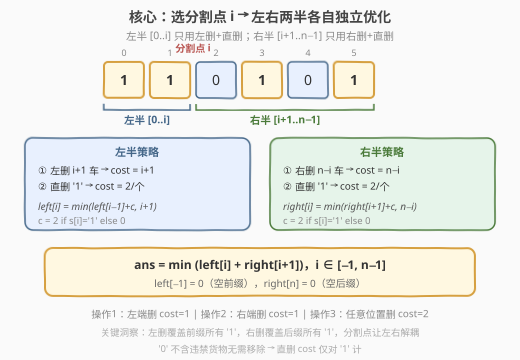
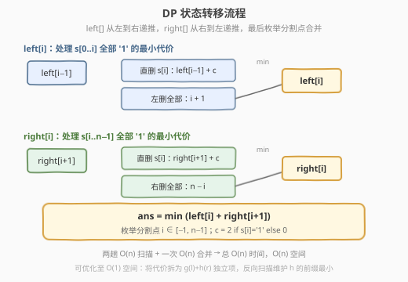
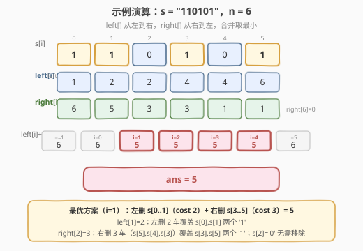

# 移除所有载有违禁货物车厢所需的最少时间

- **题目名称**：移除所有载有违禁货物车厢所需的最少时间
- **链接**：[2167. 移除所有载有违禁货物车厢所需的最少时间](https://leetcode.cn/problems/minimum-time-to-remove-all-cars-containing-illegal-goods/)
- **难度**：困难
- **标签**：动态规划、字符串、前后缀分解

## 1. 题目概述

给你一个下标从 **0** 开始的二进制字符串 `s`，表示一个列车车厢序列。`s[i] = '0'` 表示第 `i` 节车厢不含违禁货物，`s[i] = '1'` 表示含违禁货物。需要清理掉所有载有违禁货物的车厢（即所有 `s[i] = '1'`），可执行三种操作：

1. 从列车**左**端移除一节车厢（移除 `s[0]`），cost = 1
2. 从列车**右**端移除一节车厢（移除 `s[s.length - 1]`），cost = 1
3. 从**任意位置**移除一节车厢，cost = 2

返回移除所有 `'1'` 所需的**最少**单位时间。

**示例 1**：

```text
输入：s = "110101"
输出：5
解释：左删 s[0],s[1]（cost 2）+ 右删 s[5],s[4],s[3]（cost 3）= 5
      或左删 2 次 + 右删 1 次 + 直删 1 个 '1' = 2+1+2 = 5
```

**示例 2**：

```text
输入：s = "0010"
输出：2
解释：直接移除中间的 '1'（cost 2），或从右端删 2 次（cost 2）
```

**约束条件**：

- $1 \le \text{s.length} \le 2 \times 10^5$
- `s[i]` 为 `'0'` 或 `'1'`

> 💡 三种操作的代价差异是题眼：左删/右删只要 1，但只能从两端进行；直删可任意位置但要 2。最优策略一定是**用左删处理一段前缀的 '1'，用右删处理一段后缀的 '1'，中间剩余的 '1' 用直删**——关键在于找到那个分割点。

---

## 2. 解题思路

### 2.1 暴力思路：枚举左右删除次数

对于每个 `'1'`，要么通过左删覆盖（需要把它左边所有车都删掉），要么通过右删覆盖（需要把它右边所有车都删掉），要么直删。暴力做法是枚举左删次数 $l$ 和右删次数 $r$（$l + r \le n$），中间剩余 `'1'` 全部直删：

$$\text{cost}(l, r) = l + r + 2 \times \text{count\_ones}(l, n{-}1{-}r)$$

共有 $O(n^2)$ 种 $(l, r)$ 组合，每次计算 count\_ones 需要 $O(n)$，总复杂度 $O(n^3)$，显然不可行。

> 💡 暴力法的困境在于 $l$ 和 $r$ 是耦合的——中间段的 '1' 数量同时依赖 $l$ 和 $r$。我们需要找到一种方式将问题**解耦**。

### 2.2 核心观察：分割点 + 左右独立 DP



**关键洞察**：选择一个分割点 $i$，将序列分为左半 $[0..i]$ 和右半 $[i{+}1..n{-}1]$：

- **左半**只用「左删」和「直删」——左删从左端依次删，直删对 '1' 单独删
- **右半**只用「右删」和「直删」——右删从右端依次删，直删对 '1' 单独删

这样左右两半**完全独立**，可以分别求最小代价再相加！

**定义**：

- $\text{left}[i]$ = 处理 $s[0..i]$ 中所有 `'1'` 的最小代价（只用左删 + 直删）
- $\text{right}[i]$ = 处理 $s[i..n{-}1]$ 中所有 `'1'` 的最小代价（只用右删 + 直删）

**left 的递推**（从左到右）：

$$\text{left}[i] = \min\big(\text{left}[i{-}1] + c_i,\; i{+}1\big)$$

- 选项一：直删 $s[i]$（若 `'1'` 则 $c_i = 2$，若 `'0'` 则 $c_i = 0$），代价累加到 $\text{left}[i{-}1]$
- 选项二：左删 $s[0..i]$ 全部 $i{+}1$ 节车厢，代价 $= i{+}1$（一次性覆盖前缀所有 `'1'`）
- 边界：$\text{left}[-1] = 0$（空前缀）

**right 的递推**（从右到左）：

$$\text{right}[i] = \min\big(\text{right}[i{+}1] + c_i,\; n{-}i\big)$$

- 选项一：直删 $s[i]$，代价累加到 $\text{right}[i{+}1]$
- 选项二：右删 $s[i..n{-}1]$ 全部 $n{-}i$ 节车厢，代价 $= n{-}i$
- 边界：$\text{right}[n] = 0$（空后缀）

> ⚠️ **为何直删 '0' 代价为 0**：`'0'` 不含违禁货物，无需移除。直删选项中，'0' 的代价 $c_i = 0$，表示跳过这节车厢不做任何操作。

### 2.3 算法流程图



**最终答案**：枚举分割点 $i \in [-1, n{-}1]$，取最小值：

$$\text{ans} = \min_{i=-1}^{n-1} \big(\text{left}[i] + \text{right}[i{+}1]\big)$$

三步走：

1. **正向扫描**：从 $i=0$ 到 $n{-}1$，递推计算 $\text{left}[i]$
2. **反向扫描**：从 $i=n{-}1$ 到 $0$，递推计算 $\text{right}[i]$
3. **合并**：枚举所有分割点 $i$，取 $\text{left}[i] + \text{right}[i{+}1]$ 的最小值

### 2.4 示例演算



以 $s = \texttt{"110101"}$，$n=6$ 为例：

**正向计算 left[]**：

| $i$ | $s[i]$ | $c_i$ | 左删代价 $i{+}1$ | 直删代价 $\text{left}[i{-}1]{+}c_i$ | $\text{left}[i]$ |
|-----|--------|-------|-------------------|--------------------------------------|-------------------|
| −1  | —      | —     | —                 | —                                    | 0                 |
| 0   | 1      | 2     | 1                 | 0+2=2                                | **1**（左删）     |
| 1   | 1      | 2     | 2                 | 1+2=3                                | **2**（左删）     |
| 2   | 0      | 0     | 3                 | 2+0=2                                | **2**（直删跳过） |
| 3   | 1      | 2     | 4                 | 2+2=4                                | **4**（两者等价） |
| 4   | 0      | 0     | 5                 | 4+0=4                                | **4**（直删跳过） |
| 5   | 1      | 2     | 6                 | 4+2=6                                | **6**（两者等价） |

**反向计算 right[]**：

| $i$ | $s[i]$ | $c_i$ | 右删代价 $n{-}i$ | 直删代价 $\text{right}[i{+}1]{+}c_i$ | $\text{right}[i]$ |
|-----|--------|-------|-------------------|---------------------------------------|-------------------|
| 6   | —      | —     | —                 | —                                     | 0                 |
| 5   | 1      | 2     | 1                 | 0+2=2                                 | **1**（右删）     |
| 4   | 0      | 0     | 2                 | 1+0=1                                 | **1**（直删跳过） |
| 3   | 1      | 2     | 3                 | 1+2=3                                 | **3**（两者等价） |
| 2   | 0      | 0     | 4                 | 3+0=3                                 | **3**（直删跳过） |
| 1   | 1      | 2     | 5                 | 3+2=5                                 | **5**（两者等价） |
| 0   | 1      | 2     | 6                 | 5+2=7                                 | **6**（右删）     |

**合并**：

| 分割点 $i$ | $\text{left}[i]$ | $\text{right}[i{+}1]$ | 总代价 |
|------------|-------------------|------------------------|--------|
| −1         | 0                 | 6                      | 6      |
| 0          | 1                 | 5                      | 6      |
| **1**      | **2**             | **3**                  | **5**  |
| 2          | 2                 | 3                      | 5      |
| 3          | 4                 | 1                      | 5      |
| 4          | 4                 | 1                      | 5      |
| 5          | 6                 | 0                      | 6      |

最小值 = **5**，在 $i=1$ 处取得：左删 $s[0..1]$（cost 2）+ 右删 $s[3..5]$（cost 3）= 5。$s[2]=$'0' 不含违禁货物，留在中间无需移除。

---

## 3. 参考代码

### C++

```cpp
class Solution {
public:
    int minimumTime(string s) {
        int n = s.size();
        // left[j] = 处理 s[0..j-1] 的最小代价（j 从 0 到 n，left[0]=0 即空前缀）
        vector<int> left(n + 1);
        for (int i = 0; i < n; i++) {
            int c = (s[i] == '1') ? 2 : 0;
            left[i + 1] = min(left[i] + c, i + 1);
        }

        // right[j] = 处理 s[j..n-1] 的最小代价（right[n]=0 即空后缀）
        vector<int> right(n + 1);
        right[n] = 0;
        for (int i = n - 1; i >= 0; i--) {
            int c = (s[i] == '1') ? 2 : 0;
            right[i] = min(right[i + 1] + c, n - i);
        }

        // 枚举分割点：ans = min(left[j] + right[j])
        int ans = INT_MAX;
        for (int j = 0; j <= n; j++) {
            ans = min(ans, left[j] + right[j]);
        }
        return ans;
    }
};
```

> ⚠️ **索引对齐**：代码中 `left[j]` 对应思路中的 $\text{left}[j{-}1]$（处理 $s[0..j{-}1]$），`right[j]` 对应思路中的 $\text{right}[j]$（处理 $s[j..n{-}1]$）。合并时 `left[j] + right[j]` = 处理 $s[0..j{-}1]$ + 处理 $s[j..n{-}1]$ = 覆盖全部，对应分割点 $i = j{-}1$。

### Python

```python
class Solution:
    def minimumTime(self, s: str) -> int:
        n = len(s)
        left = [0] * (n + 1)
        for i in range(n):
            c = 2 if s[i] == '1' else 0
            left[i + 1] = min(left[i] + c, i + 1)

        right = [0] * (n + 1)
        for i in range(n - 1, -1, -1):
            c = 2 if s[i] == '1' else 0
            right[i] = min(right[i + 1] + c, n - i)

        return min(left[j] + right[j] for j in range(n + 1))
```

### C++（O(1) 空间优化版）

```cpp
class Solution {
public:
    int minimumTime(string s) {
        int n = s.size();
        int total = 0;
        for (char c : s) total += (c == '1');

        int p = total;      // prefix[l] = s[0..l-1] 中 '1' 的个数
        int minH = INT_MAX; // h(r) = r + 2*prefix[n-r] 的前缀最小
        int ans = INT_MAX;

        for (int l = n; l >= 0; l--) {
            int rMax = n - l;
            int h = rMax + 2 * p;         // h(rMax)
            minH = min(minH, h);
            int g = l - 2 * p;            // g(l) = l - 2*prefix[l]
            ans = min(ans, g + minH);
            if (l > 0) p -= (s[l - 1] == '1');
        }
        return ans;
    }
};
```

> 💡 **O(1) 空间原理**：将代价拆为 $g(l) = l - 2 \cdot \text{prefix}[l]$ 与 $h(r) = r + 2 \cdot \text{prefix}[n{-}r]$ 两个独立项。反向扫描 $l$ 从 $n$ 到 $0$ 时，$r_{\max} = n - l$ 递增，逐步纳入新的 $h(r)$ 并维护前缀最小 $\text{minH}$。两个前缀计数值都可用单变量 $p$ 在 $O(1)$ 空间内维护。

---

## 4. 复杂度分析

| 维度 | 复杂度 | 说明 |
|------|--------|------|
| 时间复杂度 | $O(n)$ | 正向扫描 left[] 一趟 $O(n)$ + 反向扫描 right[] 一趟 $O(n)$ + 合并一趟 $O(n)$，总计 $O(n)$ |
| 空间复杂度 | $O(n)$ | left[] 和 right[] 各 $n{+}1$ 个元素；O(1) 空间版仅需常数额外空间 |

> 💡 本题的 $O(n)$ 本质来自「前后缀分解」——将一个看似耦合的二维优化 $(l, r)$ 拆成两个独立的一维 DP，每个各扫一趟。这是字符串/数组题中极常见的降维手法。

---

## 5. 扩展：O(1) 空间的数学推导

将原始代价函数展开：

$$\text{cost}(l, r) = l + r + 2 \cdot (\text{prefix}[n{-}r] - \text{prefix}[l])$$

$$= \underbrace{(l - 2 \cdot \text{prefix}[l])}_{g(l)} + \underbrace{(r + 2 \cdot \text{prefix}[n{-}r])}_{h(r)}$$

$g(l)$ 只依赖 $l$，$h(r)$ 只依赖 $r$，两者在约束 $l + r \le n$ 下独立优化：

$$\text{ans} = \min_{l=0}^{n} \bigg(g(l) + \min_{r=0}^{n-l} h(r)\bigg)$$

**反向扫描技巧**：令 $l$ 从 $n$ 递减到 $0$，则 $r_{\max} = n - l$ 从 $0$ 递增到 $n$。每步只需：

1. 计算新纳入的 $h(r_{\max})$ 并更新 $\text{minH} = \min(\text{minH}, h(r_{\max}))$
2. 计算 $g(l)$，候选答案 $= g(l) + \text{minH}$

两个前缀计数值 $\text{prefix}[l]$ 和 $\text{prefix}[n{-}r]$（注意 $n{-}r = l$，故两者相同）可用单变量 $p$ 维护：初始化为 $\text{total}$，$l$ 每减 1 时 $p \mathrel{-}= (s[l{-}1] == \texttt{'1'})$。

---

## 6. 面试要点

1. **为什么能将问题拆成左右两半独立求解？**

   - 左删只能从左端进行，影响的是前缀；右删只能从右端进行，影响的是后缀。选择分割点 $i$ 后，左半 $[0..i]$ 的 '1' 只能通过左删或直删解决，右半 $[i{+}1..n{-}1]$ 的 '1' 只能通过右删或直删解决。两部分的操作互不干扰，因此可以独立求最小代价再相加。

2. **left[i] 的两个选项分别代表什么？**

   - $\text{left}[i{-}1] + c_i$：不使用左删，直接移除 $s[i]$（'1' 花 2，'0' 花 0），前面的代价已由 $\text{left}[i{-}1]$ 最优解决。$i{+}1$：直接左删 $s[0..i]$ 全部 $i{+}1$ 节车厢，代价 $i{+}1$，一次性覆盖前缀所有 '1'。

3. **为什么直删 '0' 的代价是 0 而不是跳过这个状态？**

   - '0' 不含违禁货物，无需移除。但它在序列中占位——如果不左删它，它仍然存在于列车中，只是不需要被移除。代价 0 表示「不做任何操作」，状态正常传递到 $\text{left}[i{+}1]$。

4. **如何想到 O(1) 空间优化？**

   - 观察代价函数 $l + r + 2 \cdot (\text{count\_ones})$ 可拆为 $g(l) + h(r)$ 两个独立项。约束 $l + r \le n$ 意味着对每个 $l$，$r$ 的上界为 $n - l$。反向扫描 $l$ 时 $r$ 的上界递增，用滚动最小值即可避免存储完整数组。

5. **与贪心策略的关系？**

   - 本题不是纯贪心——单个 '1' 的最优选择取决于全局分布（前缀 '1' 密集则左删划算，后缀密集则右删划算，中间稀疏则直删）。DP 的作用正是自动权衡这些选择，对每个子区间求最优。分割点枚举则解决了「左删到哪、右删从哪」的全局决策。

---

## 7. 同类练习题

- [152. 乘积最大子数组](https://leetcode.cn/problems/maximum-product-subarray/)（[题解](../0101-0200/152_乘积最大子数组.md)）：同样用前后缀分解处理「负数翻转」问题，正向维护 max/min 两态，思路一脉相承
- [1653. 使字符串平衡的最少删除次数](https://leetcode.cn/problems/minimum-deletions-to-make-string-balanced/)（[题解](../1501-1600/1653_使字符串平衡的最少删除次数.md)）：枚举分割点将字符串分为全 'a' 前缀和全 'b' 后缀，前后缀预处理 + 枚举切分点，结构与本题完全同构
- [238. 除自身以外数组的乘积](https://leetcode.cn/problems/product-of-array-except-self/)（[题解](../0201-0300/238_除自身以外数组的乘积.md)）：经典前后缀分解题，left[]/right[] 两趟扫描的范式母题
- [918. 最大环形子数组和](https://leetcode.cn/problems/maximum-sum-circular-subarray/)（[题解](../0901-1000/918_最大环形子数组和.md)）：环形问题拆为「取中间段」和「取首尾段」两种情况，前后缀分解思想的变体应用
- [53. 最大子数组和](https://leetcode.cn/problems/maximum-subarray/)（[题解](../0001-0100/53_最大子数组和.md)）：一维 DP 的基础母题，本题 left[] 的递推结构是其两态 min 版本的延伸
