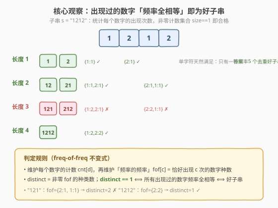
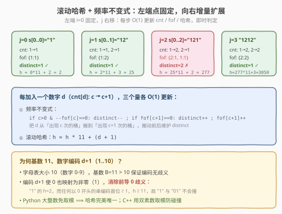
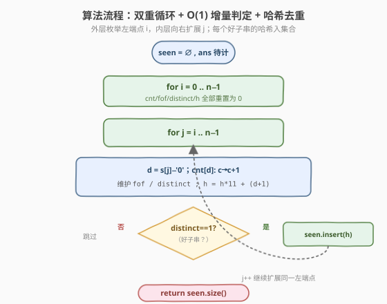
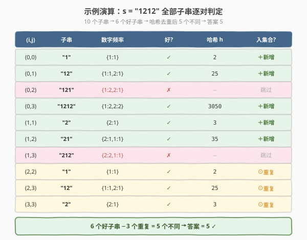

# 每个数字的频率都相同的不同子字符串的数量

- **题目名称**：每个数字的频率都相同的不同子字符串的数量
- **链接**：[2168. 每个数字的频率都相同的不同子字符串的数量](https://leetcode.cn/problems/unique-substrings-with-equal-digit-frequency)
- **难度**：中等
- **标签**：哈希表、字符串、计数、哈希函数、滚动哈希

## 1. 题目概述

给你一个由数字组成的字符串 `s`，返回 `s` 中 **不同子字符串数量**，其中的每一个数字出现的频率都相同。

换言之，一个子串 $s[i..j]$ 是「好子串」当且仅当：所有在子串中**出现过**的数字，其出现次数彼此相等。例如 `"1212"` 中数字 `1` 出现 2 次、`2` 出现 2 次，频率相等，是好子串；而 `"121"` 中 `1` 出现 2 次、`2` 出现 1 次，不等，不是好子串。**内容相同但位置不同的子串只计一次**。

**示例 1**：

```text
输入：s = "1212"
输出：5
解释：符合要求的子串有 "1", "2", "12", "21", "1212"。
注意，尽管 "12" 在 s 中出现了两次，但计数时只算一次。
```

**示例 2**：

```text
输入：s = "12321"
输出：9
解释：符合要求的子串有 "1", "2", "3", "12", "23", "32", "21", "123", "321"。
```

**约束条件**：

- $1 \le \text{s.length} \le 1000$
- `s` 只包含阿拉伯数字（`'0'`–`'9'`）

> 💡 本题是「等频率子串」与「不同子串计数」两道招牌题的合体：判定靠**频率的频率不变式**（freq-of-freq），去重靠**滚动哈希**。前者把「所有非零计数是否相等」压成 $O(1)$ 增量判定，后者把子串哈希压成 $O(1)$ 滚动更新——二者叠加，双重循环即 $O(n^2)$ 完整收官。承接 [187. 重复的DNA序列](../0101-0200/187_重复的DNA序列.md) 的 2 位滚动哈希，升级为「变长窗口 + 频率不变式」。

---

## 2. 解题思路

### 2.1 暴力思路：前缀和 + 字符串集合

最直观的做法分两步：① 判定每个子串是否「等频率」；② 把好子串丢进哈希集合去重。

判定可用**前缀和**加速：预处理 `presum[i][10]` 表示前 `i` 个字符中各数字的累计出现次数，则子串 $s[i..j]$ 中数字 $k$ 的频次 $= \text{presum}[j+1][k] - \text{presum}[i][k]$，遍历 10 个数字收集非零频次，若全部相等即为好子串。判定 $O(10) = O(1)$。

去重则直接 `unordered_set<string>` 存 `s.substr(i, j-i+1)`：

```cpp
int equalDigitFrequency(string s) {
    int n = s.size();
    vector<vector<int>> presum(n + 1, vector<int>(10, 0));
    for (int i = 0; i < n; i++) {
        for (int k = 0; k < 10; k++) presum[i + 1][k] = presum[i][k];
        presum[i + 1][s[i] - '0']++;
    }
    unordered_set<string> seen;
    for (int i = 0; i < n; i++)
        for (int j = i; j < n; j++) {
            int v = -1; bool ok = true;
            for (int k = 0; k < 10; k++) {
                int c = presum[j + 1][k] - presum[i][k];
                if (c > 0) { if (v == -1) v = c; else if (v != c) { ok = false; break; } }
            }
            if (ok) seen.insert(s.substr(i, j - i + 1));
        }
    return seen.size();
}
```

时间复杂度：$O(n^2)$ 个子串对，每对判定 $O(1)$，但 `substr` 拷贝与字符串哈希各 $O(\text{len})$，**最坏 $O(n^3)$**。当 `s = "111...1"`（全同数字）时每个子串都合格，$n=1000$ 时约 $1.6 \times 10^8$ 次字符操作，C++ 勉强能过、Python 几乎必 TLE。

> ⚠️ 本质浪费有二：① 相邻扩展的子串只多一个字符，却要重新拷贝整条字符串做哈希；② 判定频率相等时反复遍历 10 个数字。前者用**滚动哈希**化解，后者用**频率的频率**不变式化解。

### 2.2 核心观察：滚动哈希 + 频率不变式



**观察一：用「频率的频率」把相等判定压成 $O(1)$。**

直接问「所有非零计数是否相等」要扫 10 个数字。换一个视角：维护 `fof[c]` = **恰好出现 $c$ 次的数字种数**，那么「所有非零计数相等」等价于「非零的 `fof[c]` 只有一种」，即 `distinct == 1`，其中 `distinct` 为非零 `fof` 条目的种类数。

当右端加入数字 $d$，其计数从 $c$ 变为 $c+1$，只需把 $d$ 从「$c$ 次桶」搬到「$c+1$ 次桶」：

- 若 $c > 0$：`fof[c]--`，若归零则 `distinct--`（$c$ 这个频率值消失了）；
- 若 `fof[c+1]` 原为 0：`distinct++`（$c+1$ 是新出现的频率值），再 `fof[c+1]++`。

整段更新 $O(1)$，判定 `distinct == 1` 也是 $O(1)$。单个数字天然满足（只有一种频率），多数字时所有非零计数相等才合格——规则统一，无需特判。

**观察二：用滚动哈希把子串去重压成 $O(1)$。**

固定左端 $i$、向右扩展 $j$ 时，$s[i..j]$ 的哈希可由 $s[i..j-1]$ 的哈希 $O(1)$ 推出：

$$
h = h \times B + \text{enc}(s[j]), \qquad \text{enc}(d) = d + 1,\ B = 11
$$



> ⚠️ **为何基数 $B=11$、编码 $d+1$？** 字母表大小为 10（数字 `0`–`9`），取 $B=11 > 10$ 保证编码无歧义；更关键的是把数字编码成 $d+1 \in [1,10]$（**不含 0**），从而消除「前导 0」歧义：`"1"` 编码为 $2$，而任何以 `0` 开头的串首位编码 $\ge 1$、整串哈希 $\ge 11$，二者永不相撞。不同长度的串哈希值域天然分离，**无需把长度塞进哈希键**。
>
> 💡 **Python 大整数免取模**：Python 整数任意精度，$h$ 不会溢出，基 11 + $d+1$ 编码即子串内容的**完美双射**，零碰撞；C++ 用 `unsigned long long` 自然溢出有极小碰撞风险，故采用**双素数取模**（$10^9+7$ 与 $10^9+9$）打包成 64 位键，碰撞概率 $< 10^{-18}$。

### 2.3 算法流程图



双重循环，外层枚举左端 $i$（每轮重置 `cnt/fof/distinct/h`），内层向右扩展 $j$，每步 $O(1)$ 更新三个量后判定 `distinct == 1`，合格则把哈希键入集合 `seen`。最终 `seen.size()` 即答案。

### 2.4 示例演算



以 `s = "1212"` 为例，10 个子串逐对判定：6 个好子串，其中 `"1"`、`"2"`、`"12"` 各出现两次（哈希命中已存在），去重后剩 5 个不同子串 → 答案 $5$。

以左端 $i=0$ 为例展示增量过程（与暴力逐对重算对照）：

- `j=0` `"1"`：`fof={1:1}`，`distinct=1` ✓，`h = 0×11+2 = 2`，入集合；
- `j=1` `"12"`：`fof={1:2}`，`distinct=1` ✓，`h = 2×11+3 = 25`，入集合；
- `j=2` `"121"`：`fof={2:1, 1:1}`，`distinct=2` ✗，跳过；
- `j=3` `"1212"`：`fof={2:2}`，`distinct=1` ✓，`h = 25×11+2 = 277` → `277×11+3 = 3050`，入集合。

> 💡 注意 `"121"` 被即时剪枝：$j=2$ 时 `distinct` 变为 2，无需等到扫完整段——增量不变式的价值在于「失败早退、成功即收」。

---

## 3. 参考代码

### C++（滚动哈希 + 频率不变式，双素数取模）

```cpp
class Solution {
  public:
    int equalDigitFrequency(string s) {
        using ull = unsigned long long;
        const ull BASE = 11;
        const ull MOD1 = 1000000007ULL;
        const ull MOD2 = 1000000009ULL;
        int n = s.size();
        unordered_set<long long> seen;
        vector<int> fof(n + 2, 0);             // freq-of-freq，每轮按左端点重置
        for (int i = 0; i < n; i++) {
            array<int, 10> cnt{};              // 各数字在当前窗口的出现次数
            fill(fof.begin(), fof.end(), 0);
            int distinct = 0;                  // 非零 fof 的种类数
            ull h1 = 0, h2 = 0;
            for (int j = i; j < n; j++) {
                int d = s[j] - '0';
                int c = cnt[d];
                // 把 d 从「c 次桶」搬到「c+1 次桶」
                if (c > 0 && --fof[c] == 0) distinct--;
                if (fof[c + 1]++ == 0) distinct++;
                cnt[d] = c + 1;
                // 滚动哈希：d+1 编码消除前导 0 歧义
                h1 = (h1 * BASE + (ull)(d + 1)) % MOD1;
                h2 = (h2 * BASE + (ull)(d + 1)) % MOD2;
                if (distinct == 1) {
                    long long key = ((long long)h1 << 32) | (long long)h2;
                    seen.insert(key);
                }
            }
        }
        return seen.size();
    }
};
```

### Python（大整数免取模，哈希完美唯一）

```python
class Solution:
    def equalDigitFrequency(self, s: str) -> int:
        seen = set()
        n = len(s)
        for i in range(n):
            cnt = [0] * 10
            fof = [0] * (n + 2)          # freq-of-freq
            distinct = 0
            h = 0
            for j in range(i, n):
                d = ord(s[j]) - 48
                c = cnt[d]
                if c > 0:
                    fof[c] -= 1
                    if fof[c] == 0:
                        distinct -= 1
                if fof[c + 1] == 0:
                    distinct += 1
                fof[c + 1] += 1
                cnt[d] = c + 1
                h = h * 11 + (d + 1)     # 大整数不溢出 ⟹ 哈希零碰撞
                if distinct == 1:
                    seen.add(h)
        return len(seen)
```

> ⚠️ `fof` 数组长度需 $\ge n+1$：单个数字最多出现 $n$ 次，`fof[c+1]` 下标上界为 $n$。C++ 在外层循环外复用 `vector<int> fof(n+2)` 并每轮 `fill` 清零，避免反复分配；Python 直接每轮新建长度 $n+2$ 的列表。

---

## 4. 复杂度分析

| 维度 | 复杂度 | 说明 |
|------|--------|------|
| 时间复杂度 | $O(n^2)$ | 双重循环 $O(n^2)$ 个 $(i,j)$ 对，每对更新 `cnt/fof/distinct/h` 与集合插入均 $O(1)$ 摊还；`fof` 每轮清零 $O(n)$，总计 $O(n^2)$ |
| 空间复杂度 | $O(n^2)$ | 最坏情况（如全同数字 `s="111..1"`）所有 $O(n^2)$ 个子串皆好且互异，`seen` 存 $O(n^2)$ 个哈希键 |

> 💡 $O(n^2)$ 是「不同子串计数」问题的理论下界——全同数字串的不同子串恰有 $n(n+1)/2$ 个（每种长度一个），输出规模本身即 $\Theta(n^2)$。本题 $n \le 1000$，$n^2 = 10^6$，常数小，稳过。

---

## 5. 扩展：Trie 去重与姊妹题对比

### 5.1 Trie 去重（免哈希碰撞）

若对哈希碰撞有洁癖，可用 **Trie** 去重：固定左端 $i$，沿字符向右插入 Trie，每深入一层即对应子串 $s[i..j]$；节点首次创建时若该子串合格（`distinct==1`）则答案 $+1$。复杂度同为 $O(n^2)$ 时间、$O(n^2)$ 空间（Trie 节点数 $\le n^2$），但常数偏大、空间开销更重。滚动哈希以极小碰撞概率换取更低常数与更简实现，是工程上的更优解。

### 5.2 与「等计数子串的数量」（2067）对比

| 维度 | 2067 等计数子串 | 2168 本题 |
|------|----------------|-----------|
| 计数口径 | **按位置**计（不去重） | **按内容**计（去重） |
| 字母表 | 26 个小写字母 | 10 个数字 |
| 最优解 | 前缀和差分 + 枚举频次 $O(26n)$ | 滚动哈希去重 $O(n^2)$ |
| 关键差异 | 无需去重 ⟹ 可用前缀和 $O(n)$ 级判定 | 必须去重 ⟹ 退化到 $O(n^2)$ 子串枚举 |

> 💡 去 重需求是复杂度从 $O(n)$ 跳到 $O(n^2)$ 的根因：2067 不关心同一子串出现几次，只需判定每个位置区间；2168 必须区分「`"12"` 出现两次」与「出现一次」，于是哈希/Trie 不可省。

---

## 6. 面试要点

1. **「频率的频率」不变式如何把判定压到 $O(1)$？**

   - 维护 `fof[c]` = 恰好出现 $c$ 次的数字种数，`distinct` = 非零 `fof` 的种类数。`distinct == 1` 当且仅当所有出现过的数字频率全相等。加入数字 $d$ 时把 $d$ 从「$c$ 次桶」搬到「$c+1$ 次桶」，搬动前后维护 `fof` 与 `distinct` 即可，整段 $O(1)$。

2. **为什么基数取 11、数字编码用 $d+1$ 而非 $d$？**

   - 字母表大小 10，基数 $B=11 > 10$ 保证编码无歧义。编码 $d+1$ 使 `'0'` 也映射为非零（1），消除前导 0 歧义：若用 $d$ 本身，`"1"`（哈希 1）与 `"01"`（$0 \times B + 1 = 1$）会撞。$d+1$ 编码下不同长度的串哈希值域天然分离，无需把长度塞进键。

3. **Python 版为何不用取模、C++ 版却用双素数？**

   - Python 整数任意精度，$h = h \times 11 + (d+1)$ 不会溢出，基 11 + $d+1$ 编码即子串内容的完美双射，零碰撞。C++ `unsigned long long` 自然溢出（模 $2^{64}$）存在极小碰撞风险，故用 $10^9+7$ 与 $10^9+9$ 双素数取模并打包成 64 位键，碰撞概率 $< 10^{-18}$，工程上可视为零。

4. **`fof` 数组为何要开到 $n+2$ 而非固定 10？**

   - `cnt[d]` 最大可达 $n$（全同数字串），故 `fof` 的下标上界为 $n$（对应 `c+1` 最大值）。开到 $n+2$ 留出余量，并按左端点重置。若误开成 10 会下标越界（AddressSanitizer 必报）。

5. **$O(n^2)$ 是不是还能更优？**

   - 对「不同子串计数」而言 $O(n^2)$ 是下界：全同数字串的不同子串恰有 $n(n+1)/2$ 个（每种长度一个），输出规模本身 $\Theta(n^2)$。除非放宽到「按位置计数」（即 2067 口径），才能降到 $O(n)$ 级。本题 $n \le 1000$，$O(n^2) = 10^6$ 完全可行。

---

## 7. 同类练习题

- [187. 重复的DNA序列](https://leetcode.cn/problems/repeated-dna-sequences/)（[题解](../0101-0200/187_重复的DNA序列.md)）：滚动哈希母题，4 碱基 2 位编码 + 固定 10-mer 窗口；本题把「定长窗口」升级为「变长窗口 + 频率不变式」，并复用「编码避开 0」的去歧义手法
- [1698. 字符串的不同子字符串个数](https://leetcode.cn/problems/number-of-distinct-substrings-in-a-string/)（[题解](../1601-1700/1698_字符串的不同子字符串个数.md)）：纯不同子串计数（无频率约束），滚动哈希 / 后缀数组的招牌题；本题在其之上叠加「等频率」判定，是「去重 + 约束」的合体
- [1044. 最长重复子串](https://leetcode.cn/problems/longest-duplicate-substring/)（[题解](../1001-1100/1044_最长重复子串.md)）：二分答案 + 滚动哈希找最长重复子串，展示滚动哈希配合二分的另一经典范式，与本题「枚举 + 滚动哈希」互为对照
- [2067. 等计数子串的数量](https://leetcode.cn/problems/number-of-equal-count-substrings/)：姊妹题，按位置计数（不去重）、字母表为 26 字母，用前缀和差分做到 $O(26n)$；与本题对照可深刻理解「去重需求」如何把复杂度从 $O(n)$ 抬到 $O(n^2)$
- [828. 统计子串中的唯一字符](https://leetcode.cn/problems/count-unique-characters-of-all-substrings-of-a-given-string/)（[题解](../0801-0900/828_统计子串中的唯一字符.md)）：另一类「子串 + 频率」计数题，用「贡献法」按字符枚举位置贡献，与本题「按区间枚举」的视角互补
