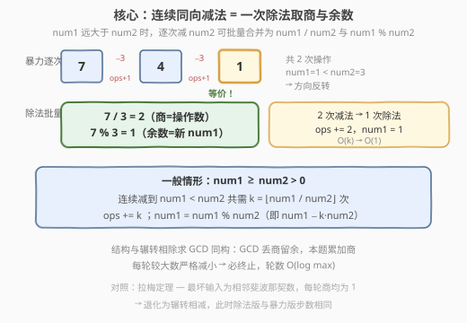
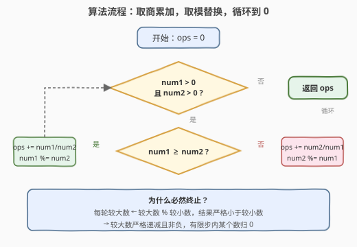
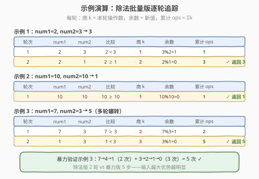

# LeetCode 得到 0 的操作数 题解

## 1. 题目概述

- **标题 / 题号**：得到 0 的操作数（#2169，easy）
- **链接**：https://leetcode.cn/problems/count-operations-to-obtain-zero/
- **难度**：简单
- **标签**：数学、模拟、辗转相减

**题意**：给你两个 **非负** 整数 `num1` 和 `num2`。每一步操作中：

- 如果 `num1 >= num2` ，则 `num1 = num1 - num2`；
- 否则 `num2 = num2 - num1`。

返回直到 `num1 == 0` 或 `num2 == 0` 时一共执行的 **操作次数**。

**示例 1**：

```text
输入：num1 = 2, num2 = 3
输出：3
解释：
操作 1：num1 = 2, num2 = 3 → 3 >= 2，num2 = 3 - 2 = 1
操作 2：num1 = 2, num2 = 1 → 2 >= 1，num1 = 2 - 1 = 1
操作 3：num1 = 1, num2 = 1 → 1 >= 1，num1 = 1 - 1 = 0
num1 变为 0，停止，共 3 次操作。
```

**示例 2**：

```text
输入：num1 = 10, num2 = 10
输出：1
解释：操作 1：10 >= 10，num1 = 10 - 10 = 0，停止，共 1 次操作。
```

**约束**：

- $0 \le \text{num1}, \text{num2} \le 10^5$

> 💡 本题看起来只是一道「照题意模拟」的简单题，但它的内核其实是 **辗转相减法**（更相减损术）。一旦看出这一点，就能用「除法代替连减」把 $O(\text{num1}+\text{num2})$ 的暴力模拟压缩到 $O(\log(\max(\text{num1},\text{num2})))$，与辗转相除求 GCD 同源。

## 2. 解题思路

### 2.1 暴力思路：按题意逐次相减

最直白的做法就是写一个 `while` 循环，只要 `num1 > 0` 且 `num2 > 0` 就继续，每次比较大小后做一次减法，计数器 `+1`。

```text
ops = 0
while num1 > 0 and num2 > 0:
    if num1 >= num2:
        num1 -= num2
    else:
        num2 -= num1
    ops += 1
return ops
```

考虑到约束 $0 \le \text{num1}, \text{num2} \le 10^5$，最坏情形 `num1 = 99999, num2 = 1` 需要约 $10^5$ 次循环——在 LeetCode 的时限内完全能过。但若把约束放大到 $10^9$，这种逐次相减就会 **超时**。

> ⚠️ 暴力能过 ≠ 该题的「正确解法」。面试中若只给暴力，会被追问「能不能更快」。关键观察：当 `num1` 远大于 `num2` 时，会 **连续多次执行同方向的减法** `num1 -= num2`，这一连串减法其实可以一次性算完。

### 2.2 核心观察：除法 = 一连串同向减法的批量执行



**观察：连续同向减法可以合并。**

假设当前 `num1 >= num2 > 0`。在 `num1` 减到小于 `num2` 之前，每一步都是 `num1 -= num2`，方向不变。设一共连续减了 $k$ 次，那么：

$$
k = \left\lfloor \frac{\text{num1}}{\text{num2}} \right\rfloor, \qquad \text{num1}_{\text{新}} = \text{num1} - k \cdot \text{num2} = \text{num1} \bmod \text{num2}
$$

也就是说，**「连续减到方向反转」等价于「做一次除法取商和余数」**：商 $k$ 就是这一轮贡献的操作次数，余数就是新的 `num1`。

这正是 **辗转相减法的批量版**，也就是 **辗转相除法（欧几里得算法）** 的同构形式——只不过 GCD 只关心最终的余数归零，而本题还要累加每一轮的「商」作为操作次数。

> 💡 **与 GCD 的对照**：求 $\gcd(a, b)$ 时辗转相除只保留余数、丢弃商；本题把每一轮的商 `a // b` 累加进答案，余数 `a % b` 替换 `a`。两者结构完全一致，只是「商」的去向不同。

**边界**：当 `num2 == 0` 时不能做除法，但循环条件 `num1 > 0 && num2 > 0` 已经保证除数非零；一旦某个数变 0 立即退出，恰好对应「操作直到某个数为 0」的题意。

### 2.3 算法流程图



1. **初始化** `ops = 0`。
2. **循环**：当 `num1 > 0` 且 `num2 > 0` 时：
   - 若 `num1 >= num2`：`ops += num1 / num2`（整除），`num1 = num1 % num2`。
   - 否则：`ops += num2 / num1`（整除），`num2 = num2 % num1`。
3. **返回** `ops`。

> ⚠️ 注意每轮迭代必有较大数严格减小（取模后 `num1 % num2 < num2 ≤ num1`），所以算法必然终止。最坏迭代次数遵循拉梅定理：$O(\log(\max(\text{num1},\text{num2})))$，与斐波那契数列相邻项为最坏输入的结论一致。

### 2.4 示例演算



**示例 1：`num1 = 2, num2 = 3`**

| 轮次 | num1 | num2 | 比较 | 商 k | 余数 | 本轮操作数 | 累计 ops |
|------|------|------|------|------|------|-----------|----------|
| 1 | 2 | 3 | 2 < 3 | $3 / 2 = 1$ | $3 \% 2 = 1$ | 1 | 1 |
| 2 | 2 | 1 | 2 ≥ 1 | $2 / 1 = 2$ | $2 \% 1 = 0$ | 2 | 3 |

第 2 轮后 `num2 = 0`，退出，返回 `3` ✓

> 💡 对照暴力模拟：`3→1`(1 次) + `2→1`(1 次) + `1→0`(1 次) = 3 次。第 2 轮的商 $k=2$ 正好把「`2-1=1`、`1-1=0`」这两次同向减法一次性算完。

**示例 2：`num1 = 10, num2 = 10`**

| 轮次 | num1 | num2 | 比较 | 商 k | 余数 | 本轮操作数 | 累计 ops |
|------|------|------|------|------|------|-----------|----------|
| 1 | 10 | 10 | 10 ≥ 10 | $10 / 10 = 1$ | $10 \% 10 = 0$ | 1 | 1 |

`num1 = 0`，退出，返回 `1` ✓

**额外示例：`num1 = 7, num2 = 3`**（展示多轮辗转）

| 轮次 | num1 | num2 | 比较 | 商 k | 余数 | 本轮操作数 | 累计 ops |
|------|------|------|------|------|------|-----------|----------|
| 1 | 7 | 3 | 7 ≥ 3 | $7 / 3 = 2$ | $7 \% 3 = 1$ | 2 | 2 |
| 2 | 1 | 3 | 1 < 3 | $3 / 1 = 3$ | $3 \% 1 = 0$ | 3 | 5 |

返回 `5`。暴力验证：`7→4→1`(2 次) + `3→2→1→0`(3 次) = 5 次 ✓

> ⚠️ 可以看到，即使输入放大到 $10^9$ 量级，迭代轮数也仅为几十次（拉梅上界约 $1.44 \log_2(\max)$），这是除法版相对暴力版的决定性优势。

## 3. 参考代码

### C++（除法批量版，推荐）

```cpp
class Solution {
  public:
    int countOperations(int num1, int num2) {
        long long ops = 0;
        while (num1 > 0 && num2 > 0) {
            if (num1 >= num2) {
                ops += num1 / num2;
                num1 %= num2;
            } else {
                ops += num2 / num1;
                num2 %= num1;
            }
        }
        return (int)ops;
    }
};
```

> 💡 用 `long long` 累加 `ops` 是防御性写法：极端情形（如 `num1 = 10^9, num2 = 1` 且约束放宽时）单轮商可达 $10^9$，累计可能溢出 `int`。本题约束 $10^5$ 下 `int` 足够，但养成「累加大数用 `long long`」的习惯更稳妥。

### C++（暴力模拟版，约束下可过）

```cpp
class Solution {
  public:
    int countOperations(int num1, int num2) {
        int ops = 0;
        while (num1 > 0 && num2 > 0) {
            if (num1 >= num2) {
                num1 -= num2;
            } else {
                num2 -= num1;
            }
            ++ops;
        }
        return ops;
    }
};
```

### Python（除法批量版，推荐）

```python
class Solution:
    def countOperations(self, num1: int, num2: int) -> int:
        ops = 0
        while num1 > 0 and num2 > 0:
            if num1 >= num2:
                ops += num1 // num2
                num1 %= num2
            else:
                ops += num2 // num1
                num2 %= num1
        return ops
```

> ⚠️ Python 中用 `//`（整除）和 `%`（取模）。Python 整数无溢出，无需类型防护；但若误用 `/` 会得到浮点数，导致后续 `%` 与比较出错。

### Python（暴力模拟版，对照参考）

```python
class Solution:
    def countOperations(self, num1: int, num2: int) -> int:
        ops = 0
        while num1 > 0 and num2 > 0:
            if num1 >= num2:
                num1 -= num2
            else:
                num2 -= num1
            ops += 1
        return ops
```

## 4. 复杂度分析

| 维度 | 复杂度 | 说明 |
|------|--------|------|
| 时间复杂度（除法版） | $O(\log(\max(\text{num1},\text{num2})))$ | 每轮较大数取模后严格减小，最坏迭代次数为斐波那契相邻项输入，遵循拉梅定理 $O(\log \max)$ |
| 时间复杂度（暴力版） | $O(\text{num1}+\text{num2})$ | 最坏 `num1 = 10^5, num2 = 1` 需 $10^5$ 次减法；约束下可过但放大即超时 |
| 空间复杂度 | $O(1)$ | 仅用常数个变量 `ops`、`num1`、`num2`，无额外数据结构 |

> 💡 两种实现的空间复杂度都是 $O(1)$。差异只在时间：当约束从 $10^5$ 放大到 $10^{18}$ 时，暴力版从「勉强可过」变为「完全不可行」，而除法版依旧只需几十次迭代——这就是「看出辗转相除结构」的价值。

## 5. 扩展：与辗转相除求 GCD 的同构关系

本题与欧几里得算法求 $\gcd(a, b)$ 在结构上完全同构：

| 维度 | 辗转相除求 GCD | 本题「得到 0 的操作数」 |
|------|---------------|----------------------|
| 每轮操作 | $a, b \leftarrow b, a \bmod b$ | 较大数 $\leftarrow$ 较大数 $\bmod$ 较小数；累加商 |
| 关心的量 | 最终非零余数 = $\gcd$ | 每轮商的累加和 = 操作总数 |
| 终止条件 | 较小数 $= 0$ | 任一数 $= 0$ |
| 时间复杂度 | $O(\log \max)$ | $O(\log \max)$ |

更一般地，**任何「轮流用较大数减较小数直到归零」的计数问题**，都可以套用「取商累加 + 取模替换」的批量模板。例如：

- **石头游戏类变体**：两堆石子，每次从较多的一堆取走「较少堆数量」的石头，问几步清空——完全等价于本题。
- **更相减损术（《九章算术》）**：中国古代求 GCD 的方法正是「以多减少，辗转相减」，本题是其计数版。

> ⚠️ 历史小知识：更相减损术出现在《九章算术》（约公元 1 世纪），比欧几里得《几何原本》中的辗转相除法晚约 300 年，但两者独立发展。本题可视为更相减损术的「操作计数」应用。

## 6. 面试要点

1. **为什么除法版比暴力模拟快？**

   - 当 `num1` 远大于 `num2` 时，暴力版会连续执行 $\lfloor \text{num1}/\text{num2} \rfloor$ 次同方向的 `num1 -= num2`，每次只减一个 `num2`。除法版把这连续的一串减法合并为一次 `num1 / num2`（得商）和 `num1 % num2`（得余数），把 $k$ 次循环压缩成 $O(1)$，整体复杂度从 $O(\text{num1}+\text{num2})$ 降到 $O(\log \max)$。

2. **循环终止性如何保证？**

   - 每轮迭代较大数被替换为 `较大数 % 较小数`，而取模结果严格小于较小数、也严格小于原较大数。因此「两数之和」或「较大数」每轮严格递减且始终非负，必然在有限步内让某个数变为 0。

3. **为什么循环条件是 `num1 > 0 && num2 > 0` 而不是 `!= 0`？**

   - 对非负整数而言 `> 0` 与 `!= 0` 等价，但 `> 0` 更明确地表达了「还有正数可减」。更关键的是它隐含了「除数非零」的前提：进入循环时较小数一定 $> 0$，所以 `num1 / num2` 不会除以零。

4. **本题和求 GCD 有什么关系？**

   - 两者都是「辗转相减/相除」结构。区别在于：GCD 只保留最终余数、丢弃每轮商；本题要把每轮商累加进答案。可以理解为「GCD 是本题最终态的副产品，操作次数是本题主产品」。

5. **拉梅定理给出的最坏迭代轮数是多少？**

   - 拉梅定理指出，欧几里得算法的迭代轮数不超过「小于 $\max(a,b)$ 的最大斐波那契数的下标」。近似上界约 $1.44 \log_2(\max(a,b))$。对 $10^{18}$ 级输入，轮数不超过约 90，极其高效。最坏输入是相邻斐波那契数，如 $(F_{n+1}, F_n)$，每轮商恰好都是 1，退化为辗转相减。

## 同类练习题

| # | 题目 | 与本题的关联 |
|---|------|-------------|
| 1979 | [找出数组的最大公约数](https://leetcode.cn/problems/find-greatest-common-divisor-of-array/) | 直接调用 GCD 的入门题，巩固辗转相除结构，是本题「除法批量」的母题 |
| 1071 | [字符串的最大公因子](https://leetcode.cn/problems/greatest-common-divisor-of-strings/) | 把 GCD 推广到字符串长度维度，验证「辗转相除」的抽象可迁移性 |
| 914 | [卡牌分组](https://leetcode.cn/problems/x-of-a-kind-in-a-deck-of-cards/) | 统计频率后求所有频率的 GCD 判断能否等分，GCD 在「整除性判定」中的典型应用 |
| 365 | [水壶问题](https://leetcode.cn/problems/water-and-jug-problem/) | 用裴蜀定理（GCD 的扩展）判定倒水可达性，与本题同属「辗转相减/相除」家族的进阶应用 |
| — | [LCP 2. 分式化简](https://leetcode.cn/problems/deep-dark-fraction/) | 连分数展开本质即辗转相除，每一步的「商」对应本题中的操作数累加 |
