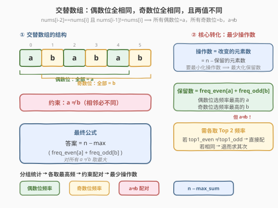
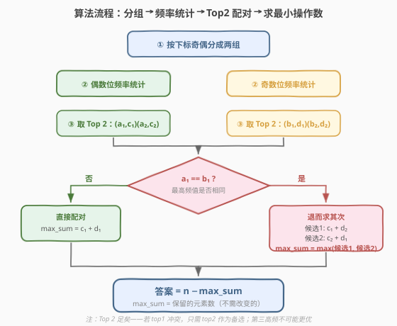

# 使数组变成交替数组的最少操作数

- **题目名称**：使数组变成交替数组的最少操作数
- **链接**：[2170. 使数组变成交替数组的最少操作数](https://leetcode.cn/problems/minimum-operations-to-make-the-array-alternating/)
- **难度**：中等
- **标签**：数组、哈希表、贪心、计数

## 1. 题目概述

给你一个下标从 **0** 开始的数组 `nums`，由 `n` 个正整数组成。如果满足下述条件，则 `nums` 是一个**交替数组**：

- `nums[i - 2] == nums[i]`，其中 $2 \le i \le n - 1$。
- `nums[i - 1] != nums[i]`，其中 $1 \le i \le n - 1$。

在一步**操作**中，你可以选择下标 `i` 并将 `nums[i]` 更改为**任一**正整数。返回使数组变成交替数组的**最少操作数**。

**示例 1**：

```text
输入：nums = [3,1,3,2,4,3]
输出：3
解释：将数组转换为 [3,1,3,1,3,1]，操作数为 3。
```

**示例 2**：

```text
输入：nums = [1,2,2,2,2]
输出：2
解释：将数组转换为 [1,2,1,2,1]，操作数为 2。
注意不能转成 [2,2,2,2,2]，因为 nums[0]==nums[1] 不满足交替条件。
```

**约束条件**：

- $1 \le \text{nums.length} \le 10^5$
- $1 \le \text{nums[i]} \le 10^5$

> 💡 题眼在于读懂「交替数组」的定义。`nums[i-2]==nums[i]` 意味着**相隔一个位置的两个元素相等**——即所有偶数下标位置的值相同，所有奇数下标位置的值也相同；`nums[i-1]!=nums[i]` 则要求这两个值**互不相同**。一旦看破这层结构，问题就变成「分组频率统计 + 贪心选最优值」。

---

## 2. 解题思路

### 2.1 暴力思路：枚举所有 (a, b) 组合

交替数组的结构是：所有偶数位 = 某值 $a$，所有奇数位 = 某值 $b$，且 $a \ne b$。暴力做法：

1. 枚举偶数位的目标值 $a$（候选为所有出现过的值）；
2. 枚举奇数位的目标值 $b$（候选为所有出现过的值）；
3. 对每组 $a \ne b$，计算需要修改的元素数 = (偶数位中不等于 $a$ 的个数) + (奇数位中不等于 $b$ 的个数)；
4. 取所有合法组合中的最小值。

若值域为 $V$，则枚举 $O(V^2)$ 组合，每组验证 $O(n)$，总时间 $O(V^2 \cdot n)$，在 $n = 10^5$ 时不可行。

> 💡 暴力法没有利用频率结构。要最小化修改数 ⟺ 最大化保留数，而保留数 = 偶数位中等于 $a$ 的个数 + 奇数位中等于 $b$ 的个数。这天然引导我们去看**频率最高的值**。

### 2.2 核心观察：分组取最高频 + 约束配对



**观察一：交替数组 = 两组同值**

交替数组的两个条件合起来等价于：

- **所有偶数下标**的元素相同（记为 $a$）；
- **所有奇数下标**的元素相同（记为 $b$）；
- $a \ne b$。

因此，我们只需为偶数位组选一个目标值 $a$、为奇数位组选一个目标值 $b$（$a \ne b$），让**不需要修改的元素尽可能多**。

**观察二：最少操作 = 最多保留**

操作数 = 被修改的元素数 = $n - \text{保留数}$。要最小化操作数，等价于**最大化保留数**：

$$
\text{保留数} = \text{freq\_even}[a] + \text{freq\_odd}[b], \quad a \ne b
$$

其中 $\text{freq\_even}[a]$ 是偶数位组中值为 $a$ 的元素个数，$\text{freq\_odd}[b]$ 同理。

**观察三：各取 Top 2 即可**

要使 $\text{freq\_even}[a] + \text{freq\_odd}[b]$ 最大，显然应该各取频率最高的值。但有一个约束：$a \ne b$。如果两组的最高频值恰好相同，就必须在某一组退而取次高频。

关键结论：**只需关心每组的前两名（Top 2）**。因为：

- 若 $\text{top1\_even} \ne \text{top1\_odd}$：直接配对，最优。
- 若 $\text{top1\_even} = \text{top1\_odd}$：最优解必为以下二者之一：
  - 偶数位取 top1 + 奇数位取 top2；
  - 偶数位取 top2 + 奇数位取 top1。
- 第三高频不可能比 top2 更优——它在同组内频率更低，在 top1 冲突时只会让保留数更小。

> ⚠️ **边界**：若某组只有一种值（如奇数位全是 2），则该组没有 top2。此时 top2 的频率记为 0（表示选一个该组中不存在的任意值，保留数为 0）。

### 2.3 算法流程图



算法步骤总结：

1. **分组**：按下标的奇偶性将 `nums` 分为偶数位组和奇数位组。
2. **频率统计**：用哈希表分别统计两组中各值的出现次数。
3. **取 Top 2**：对每组按频率降序排序，取前两名（值 + 频次）。
4. **约束配对**：
   - 若 top1 值不同 → $\text{max\_sum} = c_1 + d_1$；
   - 若 top1 值相同 → $\text{max\_sum} = \max(c_1 + d_2,\ c_2 + d_1)$。
5. **返回** $n - \text{max\_sum}$。

### 2.4 示例演算

以 `nums = [3, 1, 3, 2, 4, 3]` 为例：

![示例演算：[3,1,3,2,4,3]](../images/2170_example_walkthrough.svg)

| 步骤 | 内容 | 结果 |
|------|------|------|
| ① 分组 | 偶数位 `[3, 3, 4]`，奇数位 `[1, 2, 3]` | 两组各 3 个元素 |
| ② 频率统计 | 偶数位：`{3:2, 4:1}`；奇数位：`{1:1, 2:1, 3:1}` | — |
| ③ Top 2 | 偶数位：$a_1=3(c_1=2),\ a_2=4(c_2=1)$；奇数位：$b_1=3(d_1=1),\ b_2=1(d_2=1)$ | — |
| ④ 判断 | $a_1 = 3 = b_1$，最高频值相同 | 需退而求其次 |
| ⑤ 候选1 | 偶数留 $a_1=3$，奇数留 $b_2=1$：保留 $= 2+1=3$ | 操作数 $= 6-3=3$ |
| ⑤ 候选2 | 偶数留 $a_2=4$，奇数留 $b_1=3$：保留 $= 1+1=2$ | 操作数 $= 6-2=4$ |
| ⑥ 取最大 | $\text{max\_sum} = \max(3, 2) = 3$ | 答案 $= 6-3=\mathbf{3}$ ✓ |

最终交替数组为 `[3, 1, 3, 1, 3, 1]`（偶数位全为 3，奇数位全为 1），恰好修改了位置 3（$2 \to 1$）、位置 4（$4 \to 3$）、位置 5（$3 \to 1$），共 3 次操作。

---

## 3. 参考代码

### C++

```cpp
class Solution {
  public:
    int minimumOperations(vector<int>& nums) {
        int n = nums.size();
        if (n == 1) return 0;

        unordered_map<int, int> evenFreq, oddFreq;
        for (int i = 0; i < n; ++i) {
            if (i % 2 == 0) evenFreq[nums[i]]++;
            else            oddFreq[nums[i]]++;
        }

        auto top2 = [](unordered_map<int, int>& freq) {
            vector<pair<int, int>> best;
            for (auto& [val, cnt] : freq)
                best.push_back({cnt, val});
            sort(best.begin(), best.end(), greater<>());
            while (best.size() < 2)
                best.push_back({0, -1});
            return make_pair(
                make_pair(best[0].second, best[0].first),
                make_pair(best[1].second, best[1].first)
            );
        };

        auto [e1, e2] = top2(evenFreq);
        auto [o1, o2] = top2(oddFreq);

        int maxSum;
        if (e1.first != o1.first) {
            maxSum = e1.second + o1.second;
        } else {
            maxSum = max(e1.second + o2.second, e2.second + o1.second);
        }

        return n - maxSum;
    }
};
```

### Python

```python
class Solution:
    def minimumOperations(self, nums: List[int]) -> int:
        n = len(nums)
        if n == 1:
            return 0

        from collections import Counter
        evenFreq = Counter(nums[i] for i in range(0, n, 2))
        oddFreq  = Counter(nums[i] for i in range(1, n, 2))

        def top2(freq: Counter):
            best = freq.most_common(2)
            while len(best) < 2:
                best.append((-1, 0))
            return best

        (a1, c1), (a2, c2) = top2(evenFreq)
        (b1, d1), (b2, d2) = top2(oddFreq)

        if a1 != b1:
            max_sum = c1 + d1
        else:
            max_sum = max(c1 + d2, c2 + d1)

        return n - max_sum
```

### Python（不使用 Counter.most_common 的显式排序版）

```python
class Solution:
    def minimumOperations(self, nums: List[int]) -> int:
        n = len(nums)
        if n == 1:
            return 0

        from collections import Counter
        evenFreq = Counter(nums[i] for i in range(0, n, 2))
        oddFreq  = Counter(nums[i] for i in range(1, n, 2))

        def top2(freq: Counter):
            best = sorted(freq.items(), key=lambda kv: -kv[1])
            best += [(-1, 0)] * (2 - len(best))
            return best[0], best[1]

        (a1, c1), (a2, c2) = top2(evenFreq)
        (b1, d1), (b2, d2) = top2(oddFreq)

        if a1 != b1:
            max_sum = c1 + d1
        else:
            max_sum = max(c1 + d2, c2 + d1)

        return n - max_sum
```

> ⚠️ `top2` 函数中 `best += [(-1, 0)] * (2 - len(best))` 是**补位**逻辑：若某组只有一种值（如奇数位全是 2），则 top2 不存在，用 `(-1, 0)` 填充——值为 -1 不可能与其他组冲突，频次为 0 表示保留 0 个。这样配对逻辑不需要特判。

---

## 4. 复杂度分析

| 维度 | 复杂度 | 说明 |
|------|--------|------|
| 时间复杂度 | $O(n)$ | 遍历数组分组 $O(n)$；频率统计 $O(n)$；取 Top 2 时哈希表规模 $\le n/2$，排序取前二 $O(k \log k)$（$k \le n/2$），但 `most_common(2)` 用堆实现为 $O(k \log 2) = O(k)$，总体 $O(n)$ |
| 空间复杂度 | $O(n)$ | 两个哈希表，最坏各存 $n/2$ 个不同值 |

> 💡 Python 的 `Counter.most_common(k)` 内部用最小堆维护前 $k$ 大，时间 $O(N \log k)$。本题 $k=2$，退化为 $O(N)$。C++ 版若需严格 $O(n)$，可用一次遍历维护前两名而非 `sort`，但 $k$ 很小时差异可忽略。

---

## 5. 扩展：为什么 Top 2 足够？

这是一个值得深挖的问题。直觉上，若两组最高频值冲突，难道不能让某一组取第三、第四高频值来获得更优解吗？

**证明**：设偶数位 Top 2 为 $(a_1, c_1), (a_2, c_2)$，奇数位 Top 2 为 $(b_1, d_1), (b_2, d_2)$，满足 $c_1 \ge c_2 \ge \cdots$ 且 $d_1 \ge d_2 \ge \cdots$。

**情形 1**：$a_1 \ne b_1$。则 $c_1 + d_1$ 已是两组各自最大频率之和，无其他组合能超越，直接为最优。

**情形 2**：$a_1 = b_1$。任何合法配对 $(a_i, b_j)$ 中，至少一侧不是 top1：

- 若偶数位取 $a_1$（$= b_1$），则奇数位不能取 $b_1$，最佳选择是 $b_2$，保留数 $= c_1 + d_2$。
- 若奇数位取 $b_1$（$= a_1$），则偶数位不能取 $a_1$，最佳选择是 $a_2$，保留数 $= c_2 + d_1$。
- 若两侧都不取 top1，则保留数 $\le c_2 + d_2 \le \max(c_1 + d_2,\ c_2 + d_1)$（因为 $c_2 \le c_1$ 且 $d_2 \le d_1$），不会更优。

因此只需比较 $c_1 + d_2$ 和 $c_2 + d_1$ 即可，Top 2 足够。

> 💡 这与 [1054. 距离相等的条形码](../1001-1100/1054_距离相等的条形码.md) 中「按频率间隔放置」的思想异曲同工——都是频率贪心，但 1054 要求**构造**一个合法排列，而 2170 只需**计数**最少修改数，无需实际构造。

---

## 6. 面试要点

1. **交替数组的定义如何转化为代码模型？**

   - `nums[i-2]==nums[i]` 且 `nums[i-1]!=nums[i]` 等价于：所有偶数下标位置值相同（$a$），所有奇数下标位置值相同（$b$），且 $a \ne b$。因此只需对数组按下标奇偶分成两组，各自选一个目标值。

2. **为什么是「最大化保留数」而非「最小化修改数」直接做？**

   - 修改数 = $n - \text{保留数}$。直接枚举修改方案没有结构，而「保留数 = 两组最高频值的出现次数之和」有明确的贪心结构——只需找频率最高的值即可。

3. **为什么只需 Top 2 而非 Top 3？**

   - 若两组 top1 值不同，直接配对最优。若相同，某一侧必须让步取 top2——而 top3 的频率 $\le$ top2，不可能让保留数更大。形式化证明见第 5 节。

4. **某组只有一种值（无 top2）怎么办？**

   - 补一个虚拟的 top2：值为一个不存在的哨兵（如 -1），频次为 0。这表示「选一个该组中不存在的值，保留 0 个元素」。代码中用 `(-1, 0)` 补位即可，配对逻辑无需特判。

5. **和 1054/767 等频率重排题的区别？**

   - 1054（距离相等的条形码）和 767（重构字符串）要求**构造**一个合法排列，需要按频率交错填充。2170 只需**计数**最少修改数，不需要输出具体数组，因此只需频率统计 + Top 2 配对，更简单。

6. **如果题目改为「可以修改为任意整数（含负数和零）」呢？**

   - 没有区别。操作的目标值只需是正整数即可，而频率统计关注的是「保留哪些原有值」。修改后的值不影响保留数的计算——只需选一个不同于另一组目标值的任意正整数。

---

## 7. 同类练习题

- [1054. 距离相等的条形码](https://leetcode.cn/problems/distant-barcodes/)（[题解](../1001-1100/1054_距离相等的条形码.md)）：频率贪心重排，需构造合法排列，与 2170 的频率统计思路同源
- [767. 重构字符串](https://leetcode.cn/problems/reorganize-string/)（[题解](../0701-0800/767_重构字符串.md)）：按频率交错放置使相邻不同，贪心 + 大根堆，2170 的「构造版」
- [347. 前 K 个高频元素](https://leetcode.cn/problems/top-k-frequent-elements/)（[题解](../0301-0400/347_前K个高频元素.md)）：Top-K 频率统计母题，2170 取 Top 2 是其 $k=2$ 特例
- [451. 根据字符出现频率排序](https://leetcode.cn/problems/sort-characters-by-frequency/)（[题解](../0401-0500/451_根据字符出现频率排序.md)）：频率排序基础题，与 2170 的频率统计手法一脉相承
- [2244. 完成所有任务需要的最少轮数](https://leetcode.cn/problems/minimum-rounds-to-complete-all-tasks/)：频率贪心 + 分类讨论，同为「统计频率后做决策」的中等题
