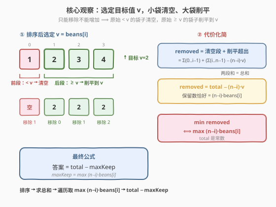

# LeetCode 拿走最少数量的魔法豆 题解

## 1. 题目概述

- **标题 / 题号**：拿走最少数量的魔法豆（#2171，medium）
- **链接**：https://leetcode.cn/problems/removing-minimum-number-of-magic-beans/
- **难度**：中等
- **标签**：数组、排序、枚举、前缀和

**题意**：给定一个正整数数组 `beans`，其中 `beans[i]` 表示第 `i` 个袋子里魔法豆的数量。你可以执行**任意次**操作（包括 0 次），每次操作可以**从任意一个袋子里移除任意数量的豆子**（可以移除 0 颗，也可以把整袋豆子全部移除使该袋变空）。

操作完成后，要求**所有非空袋子里的豆子数量相同**。返回你需要移除的**最少豆子总数**。

**示例 1**：

```text
输入：beans = [4,1,2,3]
输出：4
解释：让所有非空袋子都保留 2 颗豆子。
  - 袋子 [1] → 清空（移除 1 颗）
  - 袋子 [2] → 不变（移除 0 颗）
  - 袋子 [3] → 削平到 2（移除 1 颗）
  - 袋子 [4] → 削平到 2（移除 2 颗）
  合计移除 1+0+1+2 = 4 颗。
```

**示例 2**：

```text
输入：beans = [2,10,3,2]
输出：7
解释：让所有非空袋子都保留 10 颗豆子（只保留原来就有 10 颗的那袋，其余清空）。
  - 袋子 [2] → 清空（移除 2 颗）
  - 袋子 [2] → 清空（移除 2 颗）
  - 袋子 [3] → 清空（移除 3 颗）
  - 袋子 [10] → 不变（移除 0 颗）
  合计移除 2+2+3+0 = 7 颗。
```

**约束**：

- $1 \le \text{beans.length} \le 10^5$
- $1 \le \text{beans[i]} \le 10^5$

> 💡 题眼在于「所有非空袋子豆子数相同」+「只能移除不能增加」。既然不能增加，最终统一的那个目标值 $v$ 必须 $\le$ 每个被保留袋子的原始数量；而原始数量 $< v$ 的袋子只能被**清空**。一旦看破这层结构，问题就变成「枚举目标值 $v$，小袋清空、大袋削平」的代价计算。

## 2. 解题思路

### 2.1 暴力思路：枚举目标值逐一计算

最终统一的豆子数记为目标值 $v$。由于只能移除豆子，被**保留**的袋子其原始数量必须 $\ge v$，并被削平到 $v$（移除「超出部分」）；原始数量 $< v$ 的袋子无法削平到 $v$，只能**清空**（移除全部豆子）。

暴力做法：

1. 枚举目标值 $v$（候选可取数组中每个元素值）；
2. 对每个 $v$，遍历所有袋子：
   - 若 $\text{beans}[j] < v$：清空，移除 $\text{beans}[j]$ 颗；
   - 若 $\text{beans}[j] \ge v$：削平到 $v$，移除 $\text{beans}[j] - v$ 颗；
3. 累加得到该 $v$ 下的总移除数，取所有 $v$ 中的最小值。

枚举 $O(n)$ 个目标值，每个验证 $O(n)$，总时间 $O(n^2)$，在 $n = 10^5$ 时不可行。

> 💡 暴力法对每个 $v$ 都重新扫一遍数组，没有利用「袋子按大小排序后，清空/削平的分界线随 $v$ 单调移动」这一结构。排序后用前缀和即可 $O(1)$ 算出每个 $v$ 的代价。

### 2.2 核心观察：选定目标值，小袋清空、大袋削平



**观察一：排序后代价可拆为两段**

将 `beans` **升序排序**。若选定 $\text{beans}[i]$ 为目标值 $v$，则：

- **前段**（下标 $0 \sim i-1$，值 $< v$）：全部**清空**，移除 $\sum_{k=0}^{i-1} \text{beans}[k]$ 颗；
- **后段**（下标 $i \sim n-1$，值 $\ge v$）：全部**削平到 $v$**，保留每袋 $v$ 颗，移除 $\sum_{k=i}^{n-1} \text{beans}[k] - (n-i) \cdot v$ 颗。

两段相加，总移除数为：

$$
\text{removed}(i) = \sum_{k=0}^{i-1} \text{beans}[k] \;+\; \sum_{k=i}^{n-1} \text{beans}[k] \;-\; (n-i) \cdot \text{beans}[i]
$$

**观察二：两段之和就是总和**

注意到前段加后段恰好是整个数组的总和 $\text{total} = \sum_{k=0}^{n-1} \text{beans}[k]$，于是公式**惊人地简化**为：

$$
\text{removed}(i) = \text{total} \;-\; (n-i) \cdot \text{beans}[i]
$$

也就是说，选定 $\text{beans}[i]$ 为目标时，**保留的豆子总数恰好是 $(n-i) \cdot \text{beans}[i]$**——即「从 $i$ 开始的后段长度」乘以「目标值」。

**观察三：最小化移除 ⟺ 最大化保留**

要最小化 $\text{removed}(i) = \text{total} - (n-i)\cdot\text{beans}[i]$，由于 $\text{total}$ 是常数，只需**最大化** $(n-i)\cdot\text{beans}[i]$。

> ⚠️ **为何遍历所有 $i$ 而非只遍历不重复值？** 当存在重复值时，取重复值的**首次出现**位置 $i$（即最大的 $n-i$）会让 $(n-i)\cdot v$ 最大，同一值的后续位置只会让 $n-i$ 更小、乘积更小，不会成为最优。因此遍历所有 $i$ 取最大值是正确的——重复值的后继位置只是「不会赢」的候选，不会污染结果。代码上遍历所有 $i$ 最简洁，无需额外去重。

### 2.3 算法流程图

![算法流程：排序 → 求总和 → 遍历最大化 (n-i)·beans[i] → 返回 total − max](../images/2171_algorithm_flow.svg)

算法步骤总结：

1. **排序**：将 `beans` 升序排序。
2. **求总和**：计算 $\text{total} = \sum \text{beans}[k]$。
3. **遍历最大化**：对每个下标 $i$，计算 $\text{keep}(i) = (n-i) \cdot \text{beans}[i]$，维护其最大值 $\text{maxKeep}$。
4. **返回** $\text{total} - \text{maxKeep}$。

### 2.4 示例演算

以 `beans = [4,1,2,3]` 为例：

![示例演算：[4,1,2,3] 排序后逐一枚举目标值](../images/2171_example_walkthrough.svg)

排序后 `beans = [1,2,3,4]`，$\text{total} = 10$，$n = 4$。

| $i$ | $\text{beans}[i]$（目标 $v$） | $n-i$（保留袋数） | $\text{keep}=(n-i)\cdot v$ | $\text{removed}=\text{total}-\text{keep}$ | 操作说明 |
|-----|-------------------------------|-------------------|----------------------------|-------------------------------------------|----------|
| 0 | 1 | 4 | $4 \cdot 1 = 4$ | $10-4 = 6$ | 4 袋全保留为 1：清空超出 $\{0,1,2,3\}$ 颗 |
| 1 | 2 | 3 | $3 \cdot 2 = 6$ | $10-6 = \mathbf{4}$ | 袋[1]清空；袋[2,3,4]削平到 2 |
| 2 | 3 | 2 | $2 \cdot 3 = 6$ | $10-6 = \mathbf{4}$ | 袋[1,2]清空；袋[3,4]削平到 3 |
| 3 | 4 | 1 | $1 \cdot 4 = 4$ | $10-4 = 6$ | 袋[1,2,3]清空；袋[4]不变 |

$\text{maxKeep} = \max(4,6,6,4) = 6$，答案 $= 10 - 6 = \mathbf{4}$ ✓

最终方案可取 $v=2$（移除 $1+0+1+2=4$ 颗）或 $v=3$（移除 $1+2+0+1=4$ 颗），两者均为 4。

## 3. 参考代码

### C++

```cpp
class Solution {
  public:
    long long minimumRemoval(vector<int>& beans) {
        int n = beans.size();
        sort(beans.begin(), beans.end());
        long long total = 0;
        for (int b : beans) total += b;
        long long maxKeep = 0;
        for (int i = 0; i < n; ++i) {
            long long keep = (long long)(n - i) * beans[i];
            maxKeep = max(maxKeep, keep);
        }
        return total - maxKeep;
    }
};
```

### Python

```python
class Solution:
    def minimumRemoval(self, beans: List[int]) -> int:
        beans.sort()
        total = sum(beans)
        n = len(beans)
        max_keep = max((n - i) * beans[i] for i in range(n))
        return total - max_keep
```

> ⚠️ **数据类型**：$n \le 10^5$ 且 $\text{beans}[i] \le 10^5$，故 $\text{total}$ 最大约 $10^{10}$，**超过 32 位 int 范围**。C++ 中 `total`、`maxKeep`、返回值都必须用 `long long`；中间乘法 `(long long)(n - i) * beans[i]` 也要先转 `long long` 再乘，避免 int 溢出。Python 无此问题。

## 4. 复杂度分析

| 维度 | 复杂度 | 说明 |
|------|--------|------|
| 时间复杂度 | $O(n \log n)$ | 排序 $O(n \log n)$；求和与遍历各 $O(n)$，总体由排序主导 |
| 空间复杂度 | $O(\log n)$ | 排序所需栈空间（C++ `std::sort` 内省排序）；不计输入数组本身 |

> 💡 若值域较小（$\text{beans}[i] \le 10^5$），可用**计数排序**把时间压到 $O(n + V)$，但常数收益有限，且需要额外 $O(V)$ 空间。常规 $O(n \log n)$ 已足够通过。

## 5. 扩展：为什么枚举目标值只需取数组中出现的值？

这是一个值得深挖的问题。直觉上，目标值 $v$ 难道不能取数组中**没出现过**的某个值吗？

**结论**：最优解的目标值 $v$ 一定取数组中**某个元素的值**，无需考虑其他值。

**证明**：设排序后数组为 $b_0 \le b_1 \le \cdots \le b_{n-1}$。选定目标值 $v$ 时，设恰好有 $k$ 个元素 $\ge v$（即 $b_{n-k} \le v \le b_{n-k+1}$，约定 $b_n = +\infty$）。这些元素各削平到 $v$，其余清空。保留豆子数为：

$$
\text{keep}(v) = k \cdot v
$$

在 $v \in [b_{n-k},\, b_{n-k+1}]$ 这一区间内，$k$ 固定，$\text{keep}(v) = k \cdot v$ 关于 $v$ **单调递增**。因此该区间内 $\text{keep}$ 的最大值在**左端点** $v = b_{n-k}$ 处取得——而 $b_{n-k}$ 正是数组中的一个元素。

换言之，把 $v$ 往小取会让更多袋子被清空（$k$ 增大），把 $v$ 往大取会让 $k$ 不变但 $\text{keep}$ 增大；二者的「临界点」恰在数组元素处取得。所以只需枚举数组中的每个值作为 $v$，遍历所有位置 $i$ 取 $\max (n-i)\cdot b_i$ 即可覆盖所有临界情形。

> 💡 这与 [410. 分割数组的最大值](../0401-0500/410_分割数组的最大值.md) 的二分答案有相通之处——都是「枚举一个阈值，左侧/右侧采用不同策略」，但 2171 的代价公式可化简为常数项减一个乘积，无需二分验证，直接 $O(n)$ 扫一遍取最大即可。

## 6. 面试要点

1. **「所有非空袋子豆子数相同」如何转化为代码模型？**

   - 只能移除不能增加，故最终统一的目标值 $v$ 必须 $\le$ 每个被保留袋子的原始数量。原始数量 $< v$ 的袋子只能清空，$\ge v$ 的袋子削平到 $v$。选定 $v$ 后代价结构清晰。

2. **为什么排序后公式能化简到 $\text{total} - (n-i)\cdot\text{beans}[i]$？**

   - 排序后，目标值取 $b_i$ 时，前段 $b_0 \sim b_{i-1}$ 全清空、后段 $b_i \sim b_{n-1}$ 全削平到 $b_i$。前段移除 + 后段移除 $= \sum_{0}^{i-1} b_k + (\sum_{i}^{n-1} b_k - (n-i)\cdot b_i) = \text{total} - (n-i)\cdot b_i$。两段求和恰好消成总和。

3. **为什么遍历所有 $i$ 而不必去重？**

   - 重复值取首次出现位置 $i$ 时 $n-i$ 最大，$(n-i)\cdot v$ 也最大；后续重复位置乘积更小，不会成为最优。把它们纳入 $\max$ 只是多了几个「不会赢」的候选，不污染结果，却让代码更简洁。

4. **数据类型有什么坑？**

   - $n$ 与 $\text{beans}[i]$ 均可达 $10^5$，总和约 $10^{10}$，超 32 位 int。C++ 必须用 `long long` 存总和、最大保留数和返回值；中间乘法也要先转 `long long` 再乘。

5. **为什么目标值只需取数组中出现过的值？**

   - 在「恰好 $k$ 个元素 $\ge v$」的区间内，$\text{keep} = k\cdot v$ 随 $v$ 单调递增，最大值在区间左端点（即某数组元素）处取得。详见第 5 节证明。

## 同类练习题

| # | 题目 | 与本题的关联 |
|---|------|-------------|
| 410 | [分割数组的最大值](https://leetcode.cn/problems/split-array-largest-sum/)（[题解](../0401-0500/410_分割数组的最大值.md)） | 枚举阈值 + 左右不同策略，二分答案验证，与 2171 的「阈值分两段」思路同源 |
| 881 | [救生艇](https://leetcode.cn/problems/boats-to-save-people/) | 排序 + 双指针贪心，同为「排序后按位置分配策略」的中等题 |
| 2141 | [同时运行 N 台电脑的最长时间](https://leetcode.cn/problems/maximum-running-time-of-n-computers/)（[题解](../2101-2200/2141_同时运行N台电脑的最长时间.md)） | 排序 + 贪心枚举阈值，与 2171 的「枚举目标值求最优」手法相通 |
| 2137 | [通过倒水操作让所有的水桶所含水量相等](https://leetcode.cn/problems/pour-water-between-buckets-to-make-water-levels-equal/)（[题解](../2101-2200/2137_通过倒水操作让所有的水桶所含水量相等.md)） | 二分答案定水位 + 代价计算，2171 的「统一水位」姊妹题 |
| 1833 | [雪糕的最大数量](https://leetcode.cn/problems/maximum-ice-cream-bars/) | 排序 + 贪心累加，排序后线性扫描的简单对照题 |
