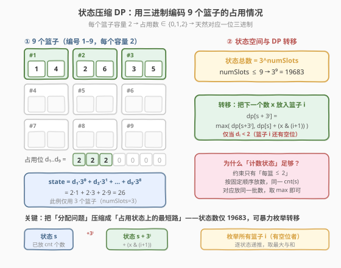
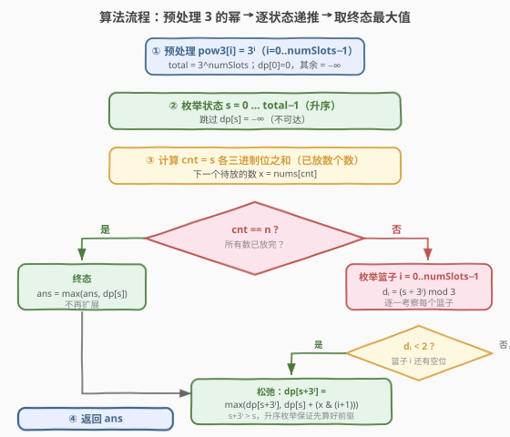

# 数组的最大与和

- **题目名称**：数组的最大与和
- **链接**：[2172. 数组的最大与和](https://leetcode.cn/problems/maximum-and-sum-of-array/)
- **难度**：困难
- **标签**：位运算、动态规划、状态压缩

## 1. 题目概述

给定长度为 $n$ 的整数数组 `nums` 和整数 `numSlots`（满足 $2 \cdot \text{numSlots} \ge n$）。共有 `numSlots` 个篮子，编号 $1$ 到 $\text{numSlots}$。需要把所有 $n$ 个数分到这些篮子中，**每个篮子至多放 2 个数**。一种分配方案的**与和**定义为：每个数与它所在篮子编号的**按位与**结果之和。

$$
\text{与和} = \sum_{\text{每个数 } x} \bigl(x \mathbin{\&} \text{篮子编号}\bigr)
$$

返回所有合法分配方案中的**最大与和**。

**示例 1**：

```text
输入：nums = [1,2,3,4,5,6], numSlots = 3
输出：9
解释：[1,4] 放入篮子 1，[2,6] 放入篮子 2，[3,5] 放入篮子 3。
与和 = (1&1)+(4&1)+(2&2)+(6&2)+(3&3)+(5&3) = 1+0+2+2+3+1 = 9
```

**示例 2**：

```text
输入：nums = [1,3,10,4,7,1], numSlots = 9
输出：24
解释：[1,1] 放入篮子 1，[3] 放入篮子 3，[4] 放入篮子 4，[7] 放入篮子 7，[10] 放入篮子 9。
与和 = (1&1)+(1&1)+(3&3)+(4&4)+(7&7)+(10&9) = 1+1+3+4+7+8 = 24
```

**约束条件**：

- $n = \text{nums.length}$
- $1 \le \text{numSlots} \le 9$
- $1 \le n \le 2 \cdot \text{numSlots}$
- $1 \le \text{nums}[i] \le 15$

> 💡 题眼在约束 `numSlots ≤ 9` 且每篮容量恰好 2：篮子少、容量小，意味着**所有篮子的占用情况**可以用一个很小的整数完整编码。把「分配 $n$ 个数到篮子」这个组合优化问题，压缩成「占用状态上的 DP」即可。

---

## 2. 解题思路

### 2.1 暴力思路：枚举所有分配方案

最直白的做法是 DFS 回溯：依次为每个数选一个篮子（要求该篮子当前少于 2 个数），枚举所有合法分配，统计最大与和。最坏情况下每个数有 $O(2 \cdot \text{numSlots})$ 种选择，方案数约为 $O((2\cdot \text{numSlots})!)$ 量级，$n$ 最大 $18$ 时完全不可行。

> 💡 暴力法的浪费在于：**同一个「篮子占用情况」会被大量不同顺序的放置重复到达**，却各自独立计算。若把「占用情况」抽象成状态，就能合并这些重复子问题——这正是状态压缩 DP 的切入点。

### 2.2 核心观察：三进制状态压缩 DP



**观察一：占用情况天然是三进制**

每个篮子容量为 2，所以篮子 $i$ 的占用数 $d_i \in \{0, 1, 2\}$，正好是一位**三进制**数字。把 $\text{numSlots}$ 个篮子的占用从低到高拼成一个三进制数：

$$
s = \sum_{i=0}^{\text{numSlots}-1} d_i \cdot 3^{i}
$$

其中 $d_i$ 表示篮子 $i+1$ 中已放的数个数。状态总数 $= 3^{\text{numSlots}}$。由 $\text{numSlots} \le 9$，状态数 $\le 3^{9} = 19683$，完全可以枚举。

**观察二：按固定顺序放数，状态是充分统计量**

定义 $\text{dp}[s]$ = 在占用状态 $s$ 下、**按固定顺序已放下前 $\text{cnt}(s)$ 个数**时能获得的最大与和，其中 $\text{cnt}(s) = \sum_i d_i$（即 $s$ 的三进制各位之和）。

> ⚠️ 这里有个容易疑惑的点：状态 $s$ 只记录「每个篮子放了几个数」，并**不记录哪个数放进了哪个篮子**，为什么够用？关键在于**按固定顺序放数**：任何到达状态 $s$ 的方案，都已放下完全相同的「前 $\text{cnt}(s)$ 个数」这一批；它们只在「哪个数进了哪个篮子」上不同，因而与和不同。我们只需保留其中的**最大值** $\text{dp}[s]$。而未来的转移只取决于「还剩哪些篮子有空位（由 $s$ 决定）」和「接下来要放哪些数（由 $\text{cnt}(s)$ 决定，对所有到达 $s$ 的方案都相同）」——这就是马尔可夫性，状态 $s$ 是充分统计量。

**观察三：转移——把下一个数放进某个有空位的篮子**

设当前状态 $s$ 已放 $\text{cnt}(s)$ 个数（$< n$），下一个待放的数是 $x = \text{nums}[\text{cnt}(s)]$。枚举每个篮子 $i+1$（$i = 0 \dots \text{numSlots}-1$）：

- 若 $d_i = (s / 3^{i}) \bmod 3 < 2$（篮子 $i+1$ 还有空位）：
- 把 $x$ 放入篮子 $i+1$，新状态 $s' = s + 3^{i}$，收益增加 $x \mathbin{\&} (i+1)$；
- $\text{dp}[s'] = \max\bigl(\text{dp}[s'],\ \text{dp}[s] + (x \mathbin{\&} (i+1))\bigr)$。

由于 $s' = s + 3^{i} > s$，**按 $s$ 升序枚举**即可保证计算 $\text{dp}[s']$ 时其前驱 $\text{dp}[s]$ 已就绪。

**终态**：所有数放完即 $\text{cnt}(s) = n$ 的状态。答案 $= \max_{\text{cnt}(s)=n} \text{dp}[s]$。

### 2.3 算法流程图



算法步骤总结：

1. **预处理**：$\text{pow3}[i] = 3^{i}$（$i = 0 \dots \text{numSlots}$），总数 $\text{total} = 3^{\text{numSlots}}$；初始化 $\text{dp}[0] = 0$，其余 $= -\infty$（用 $-1$ 表示不可达）。
2. **升序枚举** $s = 0 \dots \text{total}-1$：跳过不可达状态（$\text{dp}[s] < 0$）。
3. **数位数个数**：$\text{cnt} = s$ 的三进制各位之和 = 已放数个数。
4. **若 $\text{cnt} = n$**：所有数已放完，用 $\text{dp}[s]$ 更新答案，不再扩展。
5. **否则**：取 $x = \text{nums}[\text{cnt}]$，枚举每个篮子 $i$，若 $d_i < 2$ 则松弛 $\text{dp}[s + 3^{i}]$。
6. **返回**答案。

### 2.4 示例演算

以 `nums = [1,2,3,4,5,6], numSlots = 3`（示例 1）为例，沿一条最优放置路径观察状态演化：

![示例演算：[1,2,3,4,5,6]](../images/2172_example_walkthrough.svg)

| 步 | 放入 $x$ | 选篮子 | 占用 $(d_1,d_2,d_3)$ 变化 | 状态 $s$ | 收益 $x\&i$ | 累计 $\text{dp}$ |
|----|---------|--------|--------------------------|---------|------------|------------------|
| 1 | 1 | 篮子 1 | $(0,0,0) \to (1,0,0)$ | $0 \to 1$ | $1\&1=1$ | 1 |
| 2 | 2 | 篮子 2 | $(1,0,0) \to (1,1,0)$ | $1 \to 4$ | $2\&2=2$ | 3 |
| 3 | 3 | 篮子 3 | $(1,1,0) \to (1,1,1)$ | $4 \to 13$ | $3\&3=3$ | 6 |
| 4 | 4 | 篮子 1 | $(1,1,1) \to (2,1,1)$ | $13 \to 14$ | $4\&1=0$ | 6 |
| 5 | 5 | 篮子 3 | $(2,1,1) \to (2,1,2)$ | $14 \to 23$ | $5\&3=1$ | 7 |
| 6 | 6 | 篮子 2 | $(2,1,2) \to (2,2,2)$ | $23 \to 26$ | $6\&2=2$ | 9 |

最终到达终态 $s = 26 = (2,2,2)$（三个篮子全满），$\text{dp}[26] = 9$。DP 在枚举所有状态时会比较到达同一终态的所有路径，确认 $9$ 即为最大与和。

> 💡 第 4 步把 $4$ 放进篮子 1 收益为 $4\&1=0$（$4=100_2$，$1=001_2$），看似"白放"，但篮子 1 容量未满、$4$ 与其他篮子编号的与结果也都不更优（$4\&2=0,\ 4\&3=0$），所以放在哪都一样。这正是「按位与」性质决定的：一个数的有效位只与编号含相同位的篮子匹配。

---

## 3. 参考代码

### C++

```cpp
class Solution {
  public:
    int maximumANDSum(vector<int>& nums, int numSlots) {
        int pow3[10];
        pow3[0] = 1;
        for (int i = 1; i <= numSlots; ++i) pow3[i] = pow3[i - 1] * 3;
        int total = pow3[numSlots];          // 3^numSlots 个状态
        vector<int> dp(total, -1);           // -1 表示不可达
        dp[0] = 0;
        int n = nums.size();
        int ans = 0;

        for (int s = 0; s < total; ++s) {
            if (dp[s] < 0) continue;         // 不可达状态跳过
            // cnt = s 的三进制各位之和 = 已放数个数
            int cnt = 0, t = s;
            while (t) { cnt += t % 3; t /= 3; }
            if (cnt >= n) {                  // 数已放完 → 终态
                ans = max(ans, dp[s]);
                continue;
            }
            int x = nums[cnt];               // 下一个待放的数
            for (int i = 0; i < numSlots; ++i) {
                if ((s / pow3[i]) % 3 < 2) { // 篮子 i+1 还有空位
                    int ns = s + pow3[i];
                    int val = dp[s] + (x & (i + 1));
                    if (val > dp[ns]) dp[ns] = val;
                }
            }
        }
        return ans;
    }
};
```

### Python

```python
class Solution:
    def maximumANDSum(self, nums: List[int], numSlots: int) -> int:
        pow3 = [1] * (numSlots + 1)
        for i in range(1, numSlots + 1):
            pow3[i] = pow3[i - 1] * 3
        total = pow3[numSlots]               # 3^numSlots 个状态
        dp = [-1] * total                    # -1 表示不可达
        dp[0] = 0
        n = len(nums)
        ans = 0

        for s in range(total):
            if dp[s] < 0:
                continue
            # cnt = s 的三进制各位之和 = 已放数个数
            cnt, t = 0, s
            while t:
                cnt += t % 3
                t //= 3
            if cnt >= n:                     # 数已放完 → 终态
                ans = max(ans, dp[s])
                continue
            x = nums[cnt]                    # 下一个待放的数
            for i in range(numSlots):
                if (s // pow3[i]) % 3 < 2:   # 篮子 i+1 还有空位
                    ns = s + pow3[i]
                    val = dp[s] + (x & (i + 1))
                    if val > dp[ns]:
                        dp[ns] = val
        return ans
```

> ⚠️ 不可达状态用 $-1$ 哨兵（因为与和恒 $\ge 0$）。初始只有 $\text{dp}[0]=0$ 可达，其余靠转移点亮。由于 $s' = s + 3^{i} > s$，升序遍历 $s$ 时前驱必先就绪，无需额外拓扑排序。

---

## 4. 复杂度分析

| 维度 | 复杂度 | 说明 |
|------|--------|------|
| 时间复杂度 | $O(3^{\text{numSlots}} \cdot \text{numSlots})$ | 枚举 $3^{\text{numSlots}}$ 个状态；每个状态数三进制位数 $O(\text{numSlots})$，再枚举 $\text{numSlots}$ 个篮子松弛。numSlots $=9$ 时约 $19683 \times 18 \approx 3.5 \times 10^{5}$ 次基本操作 |
| 空间复杂度 | $O(3^{\text{numSlots}})$ | dp 数组大小 $3^{\text{numSlots}} \le 19683$ |

> 💡 若把 $\text{cnt}(s)$ 预处理成一张表（按位推导或递推），可省去每次数位循环，时间降到 $O(3^{\text{numSlots}} \cdot \text{numSlots})$ 的常数更小版；但即便朴素数位，$3^{9} \times 9$ 也仅约 $1.8 \times 10^{5}$，完全够用。

---

## 5. 扩展：二进制拆位法

三进制直接建模「每篮容量 2」最经济。另一种更"套路化"的写法是**把每个篮子拆成 2 个槽**，用普通二进制掩码：

- 槽 $j \in [0, 2\cdot\text{numSlots})$，对应篮子 $\lfloor j/2 \rfloor + 1$；
- $\text{dp}[\text{mask}]$ = 已占用槽集合为 $\text{mask}$ 时的最大与和，$\text{cnt} = \text{popcount}(\text{mask})$ = 已放数个数；
- 转移：对每个空槽 $j$，放下一个数 $x = \text{nums}[\text{cnt}]$，
  $\text{dp}[\text{mask} \mid (1 \ll j)] = \max\bigl(\ldots,\ \text{dp}[\text{mask}] + (x \mathbin{\&} (\lfloor j/2 \rfloor + 1))\bigr)$。

状态数 $2^{2\cdot\text{numSlots}} \le 2^{18} = 262144$，约为三进制的 $13$ 倍，但代码用标准位运算模板、无需手写三进制，迁移性更好。

### C++（二进制拆位版）

```cpp
class Solution {
  public:
    int maximumANDSum(vector<int>& nums, int numSlots) {
        int slots = 2 * numSlots;
        int total = 1 << slots;
        vector<int> dp(total, -1);
        dp[0] = 0;
        int n = nums.size();
        int ans = 0;
        for (int mask = 0; mask < total; ++mask) {
            if (dp[mask] < 0) continue;
            int cnt = __builtin_popcount(mask);
            if (cnt >= n) { ans = max(ans, dp[mask]); continue; }
            int x = nums[cnt];
            for (int j = 0; j < slots; ++j) {
                if (~mask & (1 << j)) {
                    int basket = j / 2 + 1;
                    int val = dp[mask] + (x & basket);
                    int nm = mask | (1 << j);
                    if (val > dp[nm]) dp[nm] = val;
                }
            }
        }
        return ans;
    }
};
```

> 💡 **三进制 vs 二进制拆位**：三进制状态更紧凑（$3^{9}=19683$ vs $2^{18}=262144$），空间约为后者的 $1/13$，是本题的"最优解"；二进制拆位则是状态压缩 DP 的通用模板，思路可直接套到 [1655. 分配重复整数](https://leetcode.cn/problems/distribute-repeating-integers/)、[1799. N 次操作后的最大分数和](https://leetcode.cn/problems/maximize-score-after-n-operations/) 等题。面试中任选一种讲清即可。

---

## 6. 面试要点

1. **为什么想到状态压缩 DP？**

   - 关键信号是 `numSlots ≤ 9` 且每篮容量 $2$——「少量篮子 + 小容量」意味着所有篮子的占用情况可被一个小整数编码。$3^{9}=19683$ 的状态空间是 DP 可承受的范围。

2. **为什么用三进制而不是二进制？**

   - 每个篮子有 $0/1/2$ 三种占用，自然对应一位三进制；若用二进制需把每篮拆成 $2$ 个槽，状态数 $2^{18}=262144$，大 $13$ 倍。三进制是本题的最优编码。

3. **状态只记「个数」不记「哪个数」，为什么够用？**

   - 按固定顺序放数，到达状态 $s$ 的所有方案都已放下相同的前 $\text{cnt}(s)$ 个数；它们只在「分配方式」上不同，与和不同。我们保留最大值 $\text{dp}[s]$。未来转移只依赖剩余空位（由 $s$ 决定）和剩余数（由 $\text{cnt}(s)$ 决定，对所有路径相同），满足马尔可夫性——状态 $s$ 是充分统计量。

4. **为什么升序枚举 $s$ 就能保证转移正确？**

   - 转移 $s \to s + 3^{i}$，新状态严格大于旧状态。升序遍历时，$\text{dp}[s]$ 在被用来松弛 $\text{dp}[s+3^{i}]$ 之前已由所有更小的前驱计算完毕。

5. **`dp` 初始化为什么用 $-1$ 而非 $0$？**

   - 与和恒 $\ge 0$，用 $-1$ 表示「不可达」可区分"未点亮"与"真值为 0"。初始仅 $\text{dp}[0]=0$ 可达，避免从虚假的 $0$ 状态出发错误转移。

6. **如果每篮容量改成 $3$ 或更大怎么办？**

   - 改用 $k+1$ 进制（容量 $k$ 则每位 $0\dots k$），状态数 $(k+1)^{\text{numSlots}}$；当容量或篮子数增大到状态数爆炸时，应转向最大费用最大流等匹配型算法（本题每篮容量 $2$、篮子 $\le 9$ 正是状压 DP 的甜区）。

---

## 7. 同类练习题

- [1655. 分配重复整数](https://leetcode.cn/problems/distribute-repeating-integers/)（[题解](../1601-1700/1655_分配重复整数.md)）：把数分配给顾客（每位需指定数量同值数），二进制状压 DP，与 2172 同为「分配型状压」
- [1799. N 次操作后的最大分数和](https://leetcode.cn/problems/maximize-score-after-n-operations/)（[题解](../1701-1800/1799_N次操作后的最大分数和.md)）：每次取两数配对得分，状压 DP 按对转移，对照 2172 按单数转移
- [526. 优美的排列](https://leetcode.cn/problems/beautiful-arrangement/)（[题解](../0501-0600/526_优美的排列.md)）：状压 DP 入门母题，掩码记已用位置，2172 的三进制是其「每槽容量 >1」的推广
- [1494. 并行课程 II](https://leetcode.cn/problems/parallel-courses-ii/)（[题解](../1401-1500/1494_并行课程II.md)）：状压 DP 按学期贪心选课，状态转移同样依赖子集枚举
- [1601. 最多可达交换次数](https://leetcode.cn/problems/maximum-number-of-achievable-transfer-requests/)（[题解](../1601-1700/1601_可达的最大交换次数.md)）：枚举子集状压 + 计数判定，与 2172 共享「小约束 → 枚举状态」的核心思想
