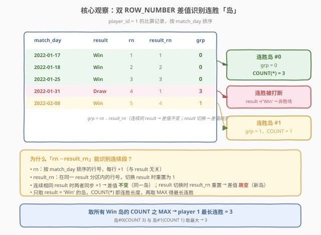
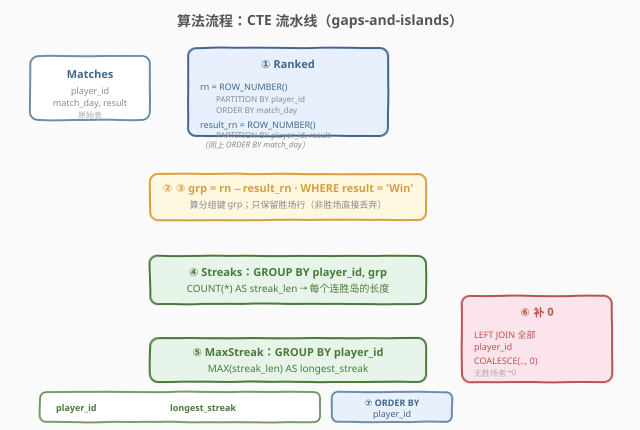
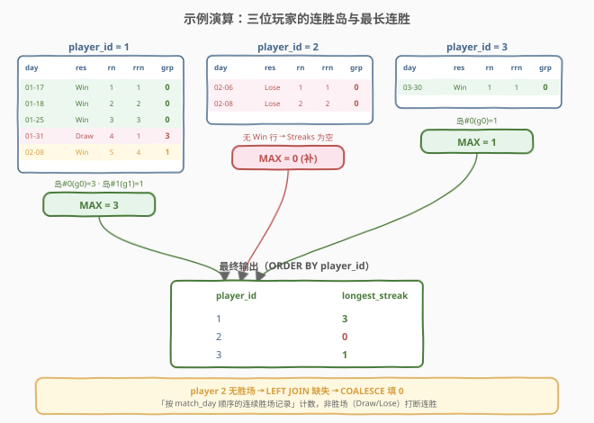

# LeetCode 最多连胜的次数 题解

> ⚠️ 本题为 **Plus 会员题（🔒 locked）**，题面需登录查看。下方题面按官方表结构与示例重建，核心定义与官方一致：**连胜 = 按比赛日（`match_day`）顺序排列的连续「胜」记录**，非胜场（`Draw`/`Lose`）打断连胜；从未获胜的球员连胜数记为 0。

## 1. 题目概述

- **标题 / 题号**：最多连胜的次数（#2173，hard）
- **链接**：https://leetcode.cn/problems/longest-winning-streak/
- **难度**：困难
- **标签**：数据库、SQL、gaps-and-islands、窗口函数、`ROW_NUMBER`、`LAG`、CTE、`LEFT JOIN`、`COALESCE`

**题意**：给定一张 `Matches` 表，记录球员每天的比赛结果。编写 SQL 查询，返回**每位球员**的**最长连胜场次**。

**表结构**：

```text
Table: Matches
+-------------+---------+
| Column Name | Type    |
+-------------+---------+
| player_id   | int     |
| match_day   | date    |
| result      | enum    |  ENUM('Win', 'Draw', 'Lose')
+-------------+---------+
(player_id, match_day) 是该表的主键（每位球员每天至多一场比赛）。
result 是枚举类型，取值为 ('Win', 'Draw', 'Lose')。
每行记录一位球员在 match_day 当天的比赛结果。
```

**「连胜」定义**：将某位球员的所有比赛按 `match_day` 升序排列，**连续的 `result = 'Win'` 记录**构成一段连胜；一旦出现 `Draw` 或 `Lose`，连胜被打断。最长连胜即所有连胜段长度的最大值。**从未获胜的球员连胜数记为 0**（仍需出现在结果中）。

**示例 1**：

```text
输入：
Matches 表:
+-----------+------------+--------+
| player_id | match_day  | result |
+-----------+------------+--------+
| 1         | 2022-01-17 | Win    |
| 1         | 2022-01-18 | Win    |
| 1         | 2022-01-25 | Win    |
| 1         | 2022-01-31 | Draw   |
| 1         | 2022-02-08 | Win    |
| 2         | 2022-02-06 | Lose   |
| 2         | 2022-02-08 | Lose   |
| 3         | 2022-03-30 | Win    |
+-----------+------------+--------+

输出:
+-----------+-----------------+
| player_id | longest_streak  |
+-----------+-----------------+
| 1         | 3               |
| 2         | 0               |
| 3         | 1               |
+-----------+-----------------+
```

**解释**：

| player_id | 按日排序的 result 序列 | 连胜段 | 最长连胜 |
|-----------|------------------------|--------|----------|
| 1 | Win, Win, Win, Draw, Win | [Win×3], [Win×1] | 3 |
| 2 | Lose, Lose | （无胜场） | 0 |
| 3 | Win | [Win×1] | 1 |

> 💡 **题眼**：把「按日排序的 result 序列」切成若干**连续相同值的段（岛）**，只保留 `result='Win'` 的岛并数其长度，取最大——这正是 SQL 经典的 **gaps-and-islands（裂隙与孤岛）** 模式。难点在于：① 如何用集合式语言（窗口函数）给「连续段」打上同一个分组键；② 如何让「无胜场」的球员也以 0 出现在结果里。

**约束**：

- `match_day` 是合法日期；`(player_id, match_day)` 是主键（每位球员每天至多一场）
- `result` 取自 `('Win', 'Draw', 'Lose')`
- 结果按 `player_id` **升序**返回；所有出现在 `Matches` 中的球员都要输出（无胜场者为 0）

## 2. 解题思路

### 2.1 暴力思路：逐行扫描数连胜

最直觉的过程式思路：对每位球员按 `match_day` 排序后逐行扫描，维护一个当前连胜计数 `cur`——遇到 `Win` 则 `cur += 1`，遇到 `Draw`/`Lose` 则 `cur = 0`；同时维护 `best = max(best, cur)`。伪代码：

```text
best = defaultdict(int); cur = 0; prev_player = None
for row in Matches.sort(['player_id','match_day']):
    if row.player_id != prev_player: cur = 0; prev_player = row.player_id
    if row.result == 'Win': cur += 1
    else: cur = 0
    best[row.player_id] = max(best[row.player_id], cur)
```

但 **SQL 没有显式的逐行循环与可变状态**——「前一行 result 决定本行计数」必须换成集合式表达。把「连续相同值」抽象成一个**分组键**，就能用 `GROUP BY` + `COUNT` 一次聚合出每段长度。这正是 gaps-and-islands 的切入点。

### 2.2 核心观察：双 `ROW_NUMBER` 差值识别连胜「岛」



**关键技巧**：给每行算两个行号——

- `rn = ROW_NUMBER() OVER (PARTITION BY player_id ORDER BY match_day)`：球员内按日的**全局行号**，每行 +1，与 `result` 无关。
- `result_rn = ROW_NUMBER() OVER (PARTITION BY player_id, result ORDER BY match_day)`：在「球员 + result」分区内按日的行号，**result 一变就重置**。

二者之差 `grp = rn − result_rn` 有一个绝妙性质：

- **连续相同 result 的行**：`rn` 与 `result_rn` 同步各 +1 → 差值 **不变**（同属一个岛）。
- **result 切换的行**：`result_rn` 因分区切换而重置，`rn` 继续 +1 → 差值 **跳变**（新岛）。

于是 `grp` 天然成为「连续相同 result 段」的分组键。只需 `WHERE result = 'Win'` 过滤后按 `player_id, grp` 分组 `COUNT(*)`，即得每段连胜长度；再 `MAX` 取最长。

以 player 1 为例：

| match_day | result | rn | result_rn | grp = rn − result_rn | 说明 |
|-----------|--------|----|-----------|----------------------|------|
| 01-17 | Win | 1 | 1 | 0 | 连胜岛 #0 开始 |
| 01-18 | Win | 2 | 2 | 0 | 同岛 |
| 01-25 | Win | 3 | 3 | 0 | 同岛（COUNT=3） |
| 01-31 | Draw | 4 | 1 | 3 | result 切换 → grp 跳变 |
| 02-08 | Win | 5 | 4 | 1 | 新连胜岛 #1（COUNT=1） |

> 💡 **为何只关心 Win 行的 grp**：`grp` 对所有 result 都能算，但我们 `WHERE result='Win'` 后只保留胜场行。胜场行内部，每段连胜的 `grp` 互不相同（见 6.2 证明），故 `GROUP BY player_id, grp` 恰好把每段连胜单独成组。

### 2.3 算法流程图



**逻辑执行步骤**（用一串 CTE 串联）：

| 步骤 | CTE | 作用 |
|------|-----|------|
| ① | `Ranked` | 对每位球员按 `match_day` 算 `rn` 与 `result_rn` 两个行号 |
| ②③ | `Streaks`（前端） | 算 `grp = rn − result_rn`；`WHERE result='Win'` 丢掉非胜场 |
| ④ | `Streaks`（聚合） | `GROUP BY player_id, grp` + `COUNT(*)` → 每段连胜长度 |
| ⑤ | `MaxStreak` | `GROUP BY player_id` + `MAX(streak_len)` → 每位球员最长连胜 |
| ⑥ | `LEFT JOIN` | 左接「全部 player_id」，`COALESCE(...,0)` 给无胜场者补 0 |
| ⑦ | `ORDER BY` | 按 `player_id` 升序输出 |

> 💡 **执行顺序呼应 SQL 子句顺序**：窗口函数在 `SELECT` 阶段计算（`rn`/`result_rn`），其结果经 `WHERE result='Win'` 过滤后进入 `GROUP BY` 聚合。用 CTE 把每一步物化，逻辑链路清晰、可逐步调试。

### 2.4 示例演算



对示例 1 的三位球员逐步演算 `rn / result_rn / grp` 与最长连胜：

- **player 1**：5 行 → 胜场 `grp` 为 0、1 两段，长度 3 与 1 → `MAX = 3`。
- **player 2**：2 行全 `Lose` → 无胜场行 → `Streaks` 为空 → `LEFT JOIN` 缺失 → `COALESCE` 填 `0`。
- **player 3**：1 行 `Win` → 单段长度 1 → `MAX = 1`。

最终 `ORDER BY player_id` 输出 `(1,3), (2,0), (3,1)`。

> ⚠️ **player 2 是本题的「陷阱行」**：它从不出现在 `Streaks`/`MaxStreak` 中（因 `WHERE result='Win'` 把它全部过滤）。若直接 `SELECT` 自 `MaxStreak` 会漏掉它。必须 `LEFT JOIN` 全部 `player_id` 再 `COALESCE 0`，才能让它以 0 出现（详见 5.3）。

## 3. 参考代码

### SQL（解法 A：双 `ROW_NUMBER` 差值，gaps-and-islands，推荐）

```sql
WITH Ranked AS (
    SELECT player_id,
           match_day,
           result,
           ROW_NUMBER() OVER (PARTITION BY player_id ORDER BY match_day)         AS rn,
           ROW_NUMBER() OVER (PARTITION BY player_id, result ORDER BY match_day) AS result_rn
    FROM Matches
),
Streaks AS (
    SELECT player_id,
           (rn - result_rn) AS grp,
           COUNT(*)         AS streak_len
    FROM Ranked
    WHERE result = 'Win'
    GROUP BY player_id, (rn - result_rn)
),
MaxStreak AS (
    SELECT player_id, MAX(streak_len) AS longest_streak
    FROM Streaks
    GROUP BY player_id
)
SELECT p.player_id,
       COALESCE(m.longest_streak, 0) AS longest_streak
FROM (SELECT DISTINCT player_id FROM Matches) p
LEFT JOIN MaxStreak m USING (player_id)
ORDER BY p.player_id;
```

> 💡 **写法要点**：
> - **两个 `ROW_NUMBER` 同 `ORDER BY match_day`**：仅 `PARTITION BY` 不同。`rn` 不按 `result` 分区（全局递增）；`result_rn` 多按 `result` 分区（同 result 内递增、切换 result 重置）。这是差值能识别连续段的根本。
> - **`WHERE result='Win'` 在 `GROUP BY` 之前**：先过滤非胜场，再分组。若反过来先按所有 result 分组再过滤，结果相同，但先过滤更省（少聚合非胜场行）。
> - **`GROUP BY player_id, (rn - result_rn)`**：`grp` 是每段连胜的分组键；同一球员不同连胜段的 `grp` 必不同（证明见 6.2），故不会误并段。
> - **`LEFT JOIN ... COALESCE(...,0)`**：保证无胜场的球员也以 0 出现（见 5.3）。
> - ✓ **最推荐**：纯窗口函数 + 聚合，语义清晰、标准 SQL 通用，是 gaps-and-islands 的 canonical 写法。

### SQL（解法 B：`LAG` + 累计 `SUM`，边界标记法）

```sql
WITH Lagged AS (
    SELECT player_id, match_day, result,
           LAG(result) OVER (PARTITION BY player_id ORDER BY match_day) AS prev_result
    FROM Matches
),
Marked AS (
    SELECT player_id, match_day, result,
           CASE WHEN result = 'Win'
                     AND (prev_result IS NULL OR prev_result <> 'Win')
                THEN 1 ELSE 0 END AS is_start
    FROM Lagged
),
Grouped AS (
    SELECT player_id, match_day, result,
           SUM(is_start) OVER (PARTITION BY player_id ORDER BY match_day) AS streak_id
    FROM Marked
),
Streaks AS (
    SELECT player_id, streak_id, COUNT(*) AS streak_len
    FROM Grouped
    WHERE result = 'Win'
    GROUP BY player_id, streak_id
),
MaxStreak AS (
    SELECT player_id, MAX(streak_len) AS longest_streak
    FROM Streaks
    GROUP BY player_id
)
SELECT p.player_id,
       COALESCE(m.longest_streak, 0) AS longest_streak
FROM (SELECT DISTINCT player_id FROM Matches) p
LEFT JOIN MaxStreak m USING (player_id)
ORDER BY p.player_id;
```

> 💡 **解法 B 的思路**：换一种更「过程式直觉」的打键法——
> - `LAG(result)` 取每位球员上一场的 result；
> - `is_start = 1` 当且仅当「本行是 Win 且上一行不是 Win」——即**新连胜段的第一行**打 1，其余打 0；
> - `SUM(is_start) OVER (... ORDER BY match_day)` 对标记做**累计求和**，得到单调递增的 `streak_id`：同一段连胜内 `streak_id` 不变（无新开始），段与段之间 +1。
>
> **与解法 A 的关系**：两者都给「连续段」打同一个分组键——A 用「两个行号之差」自然产生，B 用「边界标记 + 累计和」显式产生。逻辑等价，适用面略有差异（见 5.1）。

### Python（pandas）

```python
import pandas as pd

def longest_winning_streak(matches: pd.DataFrame) -> pd.DataFrame:
    df = matches.sort_values(['player_id', 'match_day']).reset_index(drop=True)
    prev = df.groupby('player_id')['result'].shift(1)
    # 新连胜段的第一行：当前是 Win 且前一行不是 Win（首行 prev 为 NaN，NaN != 'Win' 为 True）
    df['is_start'] = ((df['result'] == 'Win') & (prev != 'Win')).astype(int)
    # 累计求和得到 streak_id，同一段连胜共享同一 id
    df['streak_id'] = df.groupby('player_id')['is_start'].cumsum()
    # 只数胜场行的连续段长度
    wins = df[df['result'] == 'Win']
    longest = (
        wins.groupby(['player_id', 'streak_id'])
        .size()
        .reset_index(name='len')
        .groupby('player_id', as_index=False)['len']
        .max()
        .rename(columns={'len': 'longest_streak'})
    )
    # LEFT JOIN 全部球员，无胜场者补 0
    players = df[['player_id']].drop_duplicates()
    result = players.merge(longest, on='player_id', how='left')
    result['longest_streak'] = result['longest_streak'].fillna(0).astype(int)
    return (
        result[['player_id', 'longest_streak']]
        .sort_values('player_id')
        .reset_index(drop=True)
    )
```

> 💡 **pandas 对照**：对应解法 B 的「边界标记 + 累计和」。`groupby('player_id')['result'].shift(1)` 即 `LAG(result)`；`cumsum()` 即 `SUM(is_start) OVER (... ORDER BY match_day)`；`merge(how='left')` 即 `LEFT JOIN`，`fillna(0)` 即 `COALESCE(...,0)`。

## 4. 复杂度分析

| 维度 | 解法 A（双 `ROW_NUMBER`） | 解法 B（`LAG` + 累计 `SUM`） | pandas |
|------|---------------------------|------------------------------|--------|
| **时间** | $O(n \log n)$ | $O(n \log n)$ | $O(n \log n)$ |
| **空间** | $O(n)$ | $O(n)$ | $O(n)$ |
| **CTE 层数** | 3 | 5 | — |
| **可读性** | ✓ 巧妙但需懂差值原理 | ✓ 过程直觉、易讲清 | ✓ 与解法 B 同构 |
| **推荐度** | ✓ **首选** | ✓ 进阶对照 | ✓ 验证用 |

> - $n$ = `Matches` 表行数。
> - **时间**：两种解法都需按 `(player_id, match_day)` 排序（$O(n \log n)$），再做一次线性扫描算窗口函数。`COUNT`/`MAX` 聚合为线性。总体 $O(n \log n)$，由排序主导。
> - **空间**：窗口函数需物化每行带行号的中间表，$O(n)$；CTE 层数多寡只影响逻辑分层，不影响渐近复杂度。
> - **索引优化**：在 `(player_id, match_day)` 上建索引可让排序接近线性（索引有序扫描），整体降到 $O(n)$；本题主键即 `(player_id, match_day)`，天然有序。

## 5. 扩展：gaps-and-islands 技法与连胜定义变体

### 5.1 两种打键法对比

「给连续相同值的段打上同一分组键」是 gaps-and-islands 的核心。本题给出两种标准打键法：

| 打键法 | 分组键 | 关键算子 | 直觉 | 适用场景 |
|--------|--------|----------|------|----------|
| **A. 行号差值** | `rn − result_rn` | 两个 `ROW_NUMBER` | 算术巧合：同步增长则差不变 | 值域有限/离散（如 enum），双 `ROW_NUMBER` 易写 |
| **B. 边界标记 + 累计和** | `SUM(is_start) OVER (...)` | `LAG` + `CASE` + `SUM` | 过程式：标记每段开头，累计编号 | 值域无限/连续（如金额阈值），或「段起点」由复杂条件定义 |

> 💡 **何时选哪个**：
> - 若「连续相同值」即可界定段（本题 `result='Win'` 连续），**A 更简洁**——两个 `ROW_NUMBER` 一减即得键，无需 `LAG`/`CASE`/`SUM` 三件套。
> - 若「段」由**复杂条件**界定（如「连续金额 > 阈值」或「段起点需多列判定」），**B 更灵活**——`is_start` 的 `CASE` 可写任意条件，累计和天然产出单调 id。
> - 二者可互转：A 的 `grp` 等价于「以 result 切换点为边界的累计段编号」。

### 5.2 变体：日历连续日连胜（更严格的定义）

若把「连胜」收紧为「**在连续日历日上获胜**」（即两场胜之间必须 `match_day` 相差恰好 1 天，中间隔着没比赛的日历日也算打断），则解法 A 的 `grp` 不再够用——它只识别「记录连续」而非「日期连续」。需额外引入日期差：

```sql
-- 思路：在「连续 Win 记录」的岛内，再按「相邻 match_day 是否差 1 天」二次切分
WITH Ranked AS (
    SELECT player_id, match_day, result,
           ROW_NUMBER() OVER (PARTITION BY player_id ORDER BY match_day) AS rn,
           ROW_NUMBER() OVER (PARTITION BY player_id, result ORDER BY match_day) AS result_rn,
           DATEDIFF(match_day,
                    LAG(match_day) OVER (PARTITION BY player_id ORDER BY match_day)
           ) AS day_gap
    FROM Matches
),
WinIslands AS (
    SELECT player_id, match_day, (rn - result_rn) AS grp
    FROM Ranked
    WHERE result = 'Win'
),
-- 在每个 Win 岛内，day_gap <> 1 处再断开（二次分组键 = grp + 累计断点数）
Refined AS (
    SELECT player_id, match_day, grp,
           SUM(CASE WHEN day_gap <> 1 THEN 1 ELSE 0 END)
               OVER (PARTITION BY player_id ORDER BY match_day) AS sub_grp
    FROM WinIslands
)
SELECT player_id, MAX(cnt) AS longest_streak
FROM (
    SELECT player_id, grp + sub_grp AS island, COUNT(*) AS cnt
    FROM Refined
    GROUP BY player_id, grp + sub_grp
) t
GROUP BY player_id;
```

> ⚠️ 本题官方定义是「按 `match_day` 顺序的连续胜场记录」（记录连续，非日历连续），示例中 player 1 的 `01-17/01-18/01-25` 跨 8 天仍算 3 连胜即为佐证。**此变体仅作延伸**——面试官若改定义，照此二次切分即可。

### 5.3 为何 `LEFT JOIN` + `COALESCE` 补 0

`MaxStreak` 只含「至少有一次胜场」的球员（因 `WHERE result='Win'` 把全败球员过滤掉）。直接 `SELECT * FROM MaxStreak` 会漏掉 player 2。三种处理方式对照：

| 写法 | 漏掉全败球员？ | 说明 |
|------|---------------|------|
| `SELECT FROM MaxStreak` | ✗ 漏 | 全败者不在 `Streaks`/`MaxStreak` 中 |
| `MaxStreak RIGHT JOIN (DISTINCT player_id)` | ✓ 不漏 | 等价于本题的 `LEFT JOIN`，方向相反 |
| `(SELECT DISTINCT player_id) LEFT JOIN MaxStreak ... COALESCE(...,0)` | ✓ 不漏 | **本题采用**：左表保留全部球员，缺失补 0 |

> 💡 **`COALESCE(m.longest_streak, 0)` 的作用**：`LEFT JOIN` 后，全败球员的 `m.longest_streak` 为 `NULL`（右表无匹配），`COALESCE` 将其转为 0。这是「左表全保留 + 缺失填默认值」的标准范式，与 1581「反连接保留无匹配行」同一思想但目的相反——那里是保留无匹配行本身，这里是给无匹配行填 0。

## 6. 面试要点

1. **为什么 `rn − result_rn` 能识别连续相同值的段？**

   > `rn` 按 `match_day` 在球员内全局递增，每行 +1，与 `result` 无关；`result_rn` 在「球员 + result」分区内递增，**result 一变就重置**。连续相同 `result` 时两者同步各 +1，差值不变（同岛）；`result` 切换时 `result_rn` 重置而 `rn` 继续 +1，差值跳变（新岛）。故差值是「连续相同值段」的天然分组键。

2. **同一球员的两段不同连胜会撞到同一个 `grp` 吗？**

   > 不会。设第 $k$ 段连胜的最后一行 `rn = a`、`result_rn = b`（该段长 $b$），下一段连胜第一行 `rn = a + d`（$d \ge 2$，中间至少隔 1 行非胜场）、`result_rn = b + 1`。两段 `grp` 之差 $= (a+d-(b+1)) - (a-b) = d - 1 \ge 1 > 0$，严格递增。故同一球员不同连胜段的 `grp` 必不同，`GROUP BY player_id, grp` 不会误并段。

3. **为何要 `LEFT JOIN` 全部 `player_id` 再 `COALESCE 0`？**

   > `WHERE result='Win'` 把全败球员（如 player 2）完全过滤，它不出现在 `Streaks`/`MaxStreak` 中。直接选 `MaxStreak` 会漏掉它。题目要求「每位球员」都输出，全败者记 0。故以「全部 `player_id`」为左表 `LEFT JOIN MaxStreak`，缺失处 `m.longest_streak` 为 `NULL`，用 `COALESCE(...,0)` 填 0。

4. **`LAG` + 累计 `SUM` 法与双 `ROW_NUMBER` 法有何区别？何时选哪个？**

   > 两者都给连续段打同一分组键：A 用「两个行号之差」自然产生，B 用「边界标记 `is_start` + 累计求和」显式产生。A 更简洁（两个 `ROW_NUMBER` 一减），适合「连续相同值」即界定段的场景；B 更灵活（`is_start` 的 `CASE` 可写任意复杂条件），适合段起点由复杂条件界定的场景。本题两种皆可，A 更短。

5. **若「连胜」定义为「连续日历日获胜」，如何改造？**

   > 解法 A 的 `grp` 只识别「记录连续」而非「日期连续」。需在 Win 岛内再用 `DATEDIFF(match_day, LAG(match_day))` 判相邻胜场是否差 1 天：`day_gap <> 1` 处二次断开，累计断点数作为子分组键，与原 `grp` 组合（`grp + 累计断点数`）得到「日历连续连胜岛」的键，再 `COUNT`/`MAX`。详见 5.2。

> 💡 **一句话总结**：2173 是 SQL **gaps-and-islands 招牌题**——核心模板「双 `ROW_NUMBER` 差值得连续段键 → `WHERE result='Win'` → `GROUP BY player_id, grp` + `COUNT` → `MAX` → `LEFT JOIN` 全部球员 + `COALESCE 0`」。最大要点：**`rn − result_rn` 给连续段打键**、**`LEFT JOIN` 给全败者补 0**。与 180「连续出现的数字」、1225「连续日期」同属 gaps-and-islands 家族。

## 同类练习题

| # | 题目 | 与本题的关联 |
|---|------|-------------|
| 180 | [连续出现的数字](https://leetcode.cn/problems/consecutive-numbers/)（[题解](../0101-0200/180_连续出现的数字.md)） | gaps-and-islands **母题**——找出连续出现 ≥3 次的数字，用 `LAG`/自连接识别连续段，与 2173 共享「连续相同值」核心思想 |
| 1225 | [报告系统状态的连续日期](https://leetcode.cn/problems/report-contiguous-dates/)（[题解](../1201-1300/1225_报告系统状态的连续日期.md)） | gaps-and-islands **进阶**——把状态序列切成连续日期段并合并区间，双 `ROW_NUMBER` 差值的经典应用，2173 的区间合并版 |
| 1454 | [活跃用户 🔒](https://leetcode.cn/problems/active-users/)（[题解](../1401-1500/1454_活跃用户.md)） | 找出连续 5 天活跃的用户，gaps-and-islands 判定「连续天数 ≥ k」，2173 的「计数 ≥ k」变体 |
| 1843 | [可疑银行账户 🔒](https://leetcode.cn/problems/suspicious-bank-accounts/)（[题解](../1801-1900/1843_可疑银行账户.md)） | 窗口函数识别「连续月份金额超阈值」，gaps-and-islands 用于「连续满足条件」的判定，2173 的条件连续变体 |
| 1164 | [指定日期的产品价格](https://leetcode.cn/problems/product-price-at-a-given-date/)（[题解](../1101-1200/1164_指定日期的产品价格.md)） | gaps-and-islands 用于「前向填充缺失日期的最新值」，与 2173 共享「连续段分组键」思想但用于补值而非计数 |
