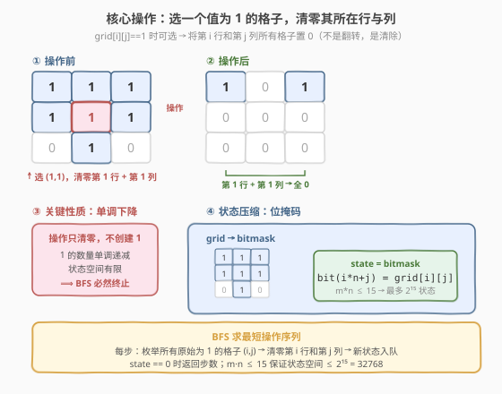

# LeetCode 通过翻转行或列来去除所有的 1 II 题解

## 1. 题目概述

- **标题 / 题号**：通过翻转行或列来去除所有的 1 II（#2174，medium）
- **链接**：https://leetcode.cn/problems/remove-all-ones-with-row-and-column-flips-ii/
- **难度**：中等
- **标签**：位运算、广度优先搜索、数组、矩阵

**题意**：给定一个下标从 **0** 开始的 $m \times n$ **二进制**矩阵 `grid`。在一次操作中，可以选择满足以下条件的任意 $i$ 和 $j$：

- $0 \le i < m$
- $0 \le j < n$
- $\text{grid}[i][j] == 1$（**当前值为 1**）

并将第 $i$ 行和第 $j$ 列中的**所有**单元格的值更改为**零**（注意：是**置零**，不是翻转）。

返回从 `grid` 中删除所有 $1$ 所需的**最小操作数**。

**示例 1**：

```text
输入：grid = [[1,1,1],[1,1,1],[0,1,0]]
输出：2
解释：
第一个操作选 (1,1)，将第 1 行和第 1 列全置 0 → [[1,0,1],[0,0,0],[0,0,0]]
第二个操作选 (0,0)，将第 0 行和第 0 列全置 0 → [[0,0,0],[0,0,0],[0,0,0]]
```

**示例 2**：

```text
输入：grid = [[0,1,0],[1,0,1],[0,1,0]]
输出：2
解释：
第一个操作选 (1,0)，将第 1 行和第 0 列全置 0 → [[0,1,0],[0,0,0],[0,1,0]]
第二个操作选 (2,1)，将第 2 行和第 1 列全置 0 → [[0,0,0],[0,0,0],[0,0,0]]
注意：不能选 (1,1)，因为 grid[1][1]=0。
```

**示例 3**：

```text
输入：grid = [[0,0],[0,0]]
输出：0
解释：没有 1 可以移除，返回 0。
```

**约束**：

- $m == \text{grid.length}$
- $n == \text{grid}[i].\text{length}$
- $1 \le m, n \le 15$
- $1 \le m \times n \le 15$
- $\text{grid}[i][j]$ 为 $0$ 或 $1$

> 💡 **题眼**：与 [2128. 通过翻转行或列来去除所有的 1](../2101-2200/2128_通过翻转行或列来去除所有的1.md) 相比，本题有两个关键变化：① 操作从「翻转行或列」变为「**将某行和某列同时置零**」，且只能选当前值为 1 的格子；② 从「判断是否可行」变为「求最小操作数」。操作只**清除** 1、不创建 1，因此 1 的数量**单调递减**——这保证了状态空间有限，$m \times n \le 15$ 意味着最多 $2^{15} = 32768$ 个状态，BFS 可以高效求解最短操作序列。

## 2. 解题思路

### 2.1 暴力思路：枚举所有操作序列

最直白的做法是 DFS 回溯：每一步枚举所有当前值为 1 的格子 $(i, j)$，执行清零操作后递归，直到全 0 或无 1 可选。记录达到全 0 的最小步数。

```text
dfs(state):
    if state == 0: return 0
    ans = ∞
    for each (i,j) where grid[i][j] == 1:
        new_state = clear_row_col(state, i, j)
        ans = min(ans, 1 + dfs(new_state))
    return ans
```

问题在于：同一个状态会被重复访问，指数级展开。最坏情况下操作序列长度可达 $m \times n$，分支因子也是 $m \times n$，总复杂度 $O((mn)!)$，完全不可行。

> ⚠️ 暴力 DFS 的根本缺陷是**重复搜索**——不同的操作顺序可能到达同一个中间状态，却没有记忆化剪枝。

### 2.2 核心观察：状态压缩 + BFS



**观察一：操作是「置零」而非「翻转」**

这是本题与 2128 最本质的区别。2128 的翻转操作可逆（翻两次等于没翻），所以只需检查行/列翻转的奇偶性。而本题的置零操作**不可逆**——一个格子一旦被清零，就永远是 0。这意味着：

- 1 的数量**单调递减**，不会增加。
- 不存在「翻来翻去回到原状态」的环路。
- 状态空间是有限的：每个格子从 1 变 0 后不再变回 1，所以从初始状态出发，经过若干次操作后必然终止。

**观察二：只能选当前值为 1 的格子**

这个约束使得操作是**状态相关**的——可用的操作集合取决于当前矩阵状态。这排除了贪心或数学公式的方法（无法预先确定操作序列），但 BFS 可以自然地处理：在每个状态枚举当前可用的操作，生成后继状态。

**观察三：$m \times n \le 15$ → 状态压缩可行**

矩阵最多 15 个格子，每个格子 0 或 1，整个矩阵可以编码为一个 15 位整数（bitmask）。第 $i$ 行第 $j$ 列的格子对应第 $i \times n + j$ 位。状态空间 $\le 2^{15} = 32768$，BFS 完全可行。

**观察四：检查原始 grid 而非当前状态即可**

代码中判断「能否选 $(i,j)$」时检查的是**原始** `grid[i][j]`，而非当前状态的对应位。这看似不严谨（原始为 1 的格子可能已被清零），但实际正确：

- 原始为 0 的格子**永远**是 0（操作只置零），不可能被选——跳过它们完全正确。
- 原始为 1 但当前已为 0 的格子，对它执行操作等效于对当前行/列再做一次清零。由于行/列中剩余的 1 也可以通过选那些 1 格子来清除，这种「多余」操作不会产生更优解，只会让路径更长。

> 💡 因此，只需预过滤原始 `grid[i][j]==1` 的格子作为候选操作集，BFS 自然会找到最短路径。

### 2.3 算法流程图


算法步骤总结：

1. **编码**：将 `grid` 编码为 bitmask `state`，$\text{bit}(i \times n + j) = \text{grid}[i][j]$。
2. **初始化 BFS**：`queue = [state]`，`vis = {state}`，`ans = 0`。
3. **逐层展开**：
   - 弹出队首 `state`，若 `state == 0` 返回 `ans`。
   - 枚举所有原始 `grid[i][j] == 1` 的格子 $(i, j)$。
   - 对每个 $(i, j)$，清零第 $i$ 行和第 $j$ 列的所有位：`nxt = state & ~row_mask & ~col_mask`。
   - 若 `nxt ∉ vis`，加入 `vis` 和 `queue`。
4. 每层结束后 `ans += 1`，继续下一层。

### 2.4 示例演算

以 `grid = [[1,1,1],[1,1,1],[0,1,0]]` 为例：

![示例演算：[[1,1,1],[1,1,1],[0,1,0]] → 2](../images/2174_example_walkthrough.svg)

| 步骤 | 选中格子 | 清零范围 | 矩阵变化 | 剩余 1 |
|------|----------|----------|----------|--------|
| 初始 | — | — | `[[1,1,1],[1,1,1],[0,1,0]]` | 7 |
| 第 1 步 | $(1, 1)$ | 第 1 行 + 第 1 列 | `[[1,0,1],[0,0,0],[0,0,0]]` | 2 |
| 第 2 步 | $(0, 0)$ | 第 0 行 + 第 0 列 | `[[0,0,0],[0,0,0],[0,0,0]]` | 0 ✓ |

> 💡 BFS 在第 2 层找到全 0 状态，返回 `ans = 2`。注意第 1 步选 $(1,1)$ 是最优的——它一次清除了 5 个 1（第 1 行的 3 个 + 第 1 列的 2 个额外），将问题规模从 7 个 1 缩减到 2 个 1。

## 3. 参考代码

### C++

```cpp
class Solution {
  public:
    int removeOnes(vector<vector<int>>& grid) {
        int m = grid.size(), n = grid[0].size();
        int state = 0;
        for (int i = 0; i < m; ++i)
            for (int j = 0; j < n; ++j)
                if (grid[i][j])
                    state |= (1 << (i * n + j));

        queue<int> q{{state}};
        unordered_set<int> vis{{state}};
        int ans = 0;
        while (!q.empty()) {
            for (int k = q.size(); k > 0; --k) {
                state = q.front();
                q.pop();
                if (state == 0) return ans;
                for (int i = 0; i < m; ++i) {
                    for (int j = 0; j < n; ++j) {
                        if (grid[i][j] == 0) continue;
                        int nxt = state;
                        for (int r = 0; r < m; ++r)
                            nxt &= ~(1 << (r * n + j));
                        for (int c = 0; c < n; ++c)
                            nxt &= ~(1 << (i * n + c));
                        if (!vis.count(nxt)) {
                            vis.insert(nxt);
                            q.push(nxt);
                        }
                    }
                }
            }
            ++ans;
        }
        return -1;
    }
};
```

### Python

```python
class Solution:
    def removeOnes(self, grid: List[List[int]]) -> int:
        m, n = len(grid), len(grid[0])
        state = sum(
            1 << (i * n + j)
            for i in range(m)
            for j in range(n)
            if grid[i][j]
        )
        if state == 0:
            return 0

        from collections import deque
        q = deque([state])
        vis = {state}
        ans = 0
        while q:
            for _ in range(len(q)):
                state = q.popleft()
                if state == 0:
                    return ans
                for i in range(m):
                    for j in range(n):
                        if grid[i][j] == 0:
                            continue
                        nxt = state
                        for r in range(m):
                            nxt &= ~(1 << (r * n + j))
                        for c in range(n):
                            nxt &= ~(1 << (i * n + c))
                        if nxt not in vis:
                            vis.add(nxt)
                            q.append(nxt)
            ans += 1
        return -1
```

### Python（预计算行/列掩码优化版）

```python
class Solution:
    def removeOnes(self, grid: List[List[int]]) -> int:
        m, n = len(grid), len(grid[0])
        state = 0
        for i in range(m):
            for j in range(n):
                if grid[i][j]:
                    state |= (1 << (i * n + j))
        if state == 0:
            return 0

        # 预计算每个 (i, j) 的清零掩码
        masks = []
        for i in range(m):
            row_mask = 0
            for c in range(n):
                row_mask |= (1 << (i * n + c))
            for j in range(n):
                col_mask = 0
                for r in range(m):
                    col_mask |= (1 << (r * n + j))
                masks.append((i, j, row_mask | col_mask))

        from collections import deque
        q = deque([state])
        vis = {state}
        ans = 0
        while q:
            for _ in range(len(q)):
                state = q.popleft()
                if state == 0:
                    return ans
                for i, j, mask in masks:
                    if grid[i][j] == 0:
                        continue
                    nxt = state & ~mask
                    if nxt not in vis:
                        vis.add(nxt)
                        q.append(nxt)
            ans += 1
        return -1
```

> ⚠️ 预计算版将每次操作的 $O(m + n)$ 清零循环提前到初始化阶段，每个 $(i, j)$ 的掩码只算一次。对状态数多、操作频繁的用例有常数级优化。注意掩码是 `row_mask | col_mask`（行与列的并集），因为清零操作同时作用于行和列。

## 4. 复杂度分析

| 维度 | 复杂度 | 说明 |
|------|--------|------|
| 时间复杂度 | $O(2^{mn} \cdot mn)$ | 最多 $2^{mn}$ 个状态（$mn \le 15$），每个状态枚举 $mn$ 个候选操作，每次清零 $O(m+n)$（或预计算后 $O(1)$） |
| 空间复杂度 | $O(2^{mn})$ | `vis` 集合最多存 $2^{mn}$ 个状态，队列同理 |

> 💡 $mn \le 15$ 是本题的核心约束。$2^{15} = 32768$ 个状态，每个状态最多 15 个操作，总操作数约 $5 \times 10^5$——在毫秒级内完成。若 $mn$ 放大到 20（$2^{20} \approx 10^6$），BFS 仍可行但耗时显著增加；放大到 25 以上则需要另寻思路。

## 5. 扩展：与 2128 的对比

| 维度 | 2128（翻转行或列） | 2174（清零行和列 II） |
|------|------|------|
| **操作** | 翻转**一行或一列**（0↔1） | 选一个 1 格子，清零**一行和一列**（→0） |
| **可逆性** | 可逆（翻两次=没翻） | 不可逆（只置零，不恢复） |
| **状态依赖** | 无（任何行/列随时可翻） | 有（只能选当前为 1 的格子） |
| **问题类型** | 判断可行性 | 求最小操作数 |
| **解法** | 数学/贪心（奇偶性判定） | BFS（状态空间搜索） |
| **复杂度** | $O(mn)$ | $O(2^{mn} \cdot mn)$ |
| **约束** | $m, n \le 300$ | $m \times n \le 15$ |

2128 利用翻转的可逆性和交换律，把问题归约为「每行/列各做一个 0/1 选择」，只需检查奇偶性一致性。2174 的操作不可逆且状态相关，无法用代数方法直接求解，必须搜索状态空间。约束 $m \times n \le 15$ 正是为 BFS 量身定制的——保证了 $2^{15}$ 的状态空间可控。

> ⚠️ **为什么不沿用 2128 的思路？** 2128 的核心是「翻转行或列的可逆性 ⟹ 操作顺序无关 ⟹ 只需奇偶性」。2174 的操作是**置零**（不可逆）且**必须选 1 格子**（状态相关），操作顺序直接影响后续可选操作集，无法用奇偶性归约。

## 6. 面试要点

1. **为什么用 BFS 而非 DFS？**

   - BFS 按层展开，首次到达目标状态即为最短路径（最少操作数）。DFS 需遍历所有路径取最小值，且无记忆化时指数级展开。BFS 配合 `vis` 去重，每个状态只访问一次，保证最优性和效率。

2. **为什么检查原始 `grid[i][j]` 而非当前状态的位？**

   - 原始为 0 的格子永远是 0（操作只置零），不可能被选——跳过它们完全正确。原始为 1 但当前已为 0 的格子，对它执行操作等效于再清一次行/列，不会比选当前为 1 的格子更优。因此用原始 `grid` 预过滤候选操作集是正确的，且实现更简洁。

3. **BFS 何时终止？为什么一定返回？**

   - 当 `state == 0`（全 0）时返回 `ans`。由于操作只清除 1、不创建 1，1 的数量单调递减，必然在有限步内达到全 0 或无可选操作的状态。$m \times n \le 15$ 保证状态空间 $\le 2^{15}$，BFS 必然在有限步内终止。

4. **状态压缩为什么用 bitmask？**

   - $m \times n \le 15$，整个矩阵可编码为 15 位整数。bitmask 的好处：① 用 `int` 存状态，哈希/比较 $O(1)$；② 清零操作用位运算 `& ~mask` 一步完成；③ `vis` 用 `unordered_set<int>` / Python `set` 高效去重。

5. **如何优化清零操作的常数？**

   - 预计算每个 $(i, j)$ 的清零掩码 `mask = row_mask | col_mask`，BFS 中直接 `nxt = state & ~mask` 即可，省去每次 $O(m+n)$ 的循环。对状态数多的用例有显著常数优化。

6. **如果 $m \times n$ 放大到 20~25，怎么办？**

   - BFS 状态空间 $2^{20} \approx 10^6$ 仍勉强可行，$2^{25} \approx 3 \times 10^7$ 则需考虑双向 BFS（从初始状态和目标状态同时搜索，在中间相遇）或 A*（用启发式函数引导搜索方向，如剩余 1 的数量作为下界）。

## 同类练习题

| # | 题目 | 与本题的关联 |
|---|------|-------------|
| 2128 | [通过翻转行或列来去除所有的 1](https://leetcode.cn/problems/remove-all-ones-with-row-and-column-flips/)（[题解](../2101-2200/2128_通过翻转行或列来去除所有的1.md)） | 本题的前传，操作为翻转行或列（可逆），用奇偶性判定可行性，对照理解可逆 vs 不可逆对解法的影响 |
| 1284 | [转化为全零矩阵的最少翻转次数](https://leetcode.cn/problems/minimum-number-of-flips-to-convert-binary-matrix-to-zero-matrix/) | 同样 $m \times n \le 9$ 的矩阵 BFS，操作为翻转 3×3 邻域，状态压缩 + BFS 的经典母题 |
| 773 | [滑动谜题](https://leetcode.cn/problems/sliding-puzzle/) | $2 \times 3$ 滑动拼图 BFS，状态压缩为整数 + 去重，与本题的状态空间搜索思路一致 |
| 752 | [打开转盘锁](https://leetcode.cn/problems/open-the-lock/) | 四位数字锁 BFS 求最短步数，单向/双向 BFS 的入门题，与本题的 BFS 框架相同 |
| 1654 | [到达 K 个的最少跳跃次数](https://leetcode.cn/problems/minimum-jumps-to-reach-home/) | 带禁止位置的一维跳跃 BFS，`vis` 去重的边界处理技巧可迁移到本题的候选操作过滤 |
