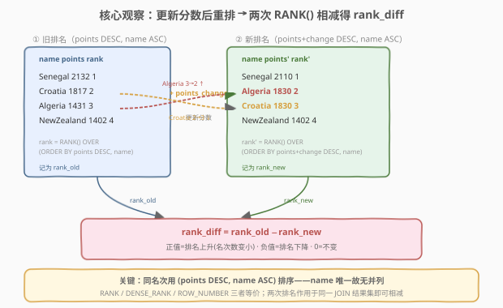
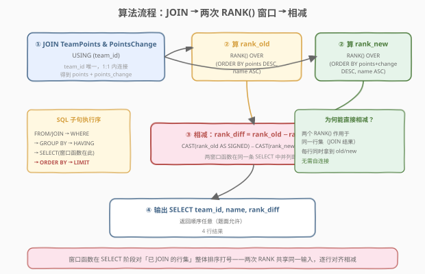
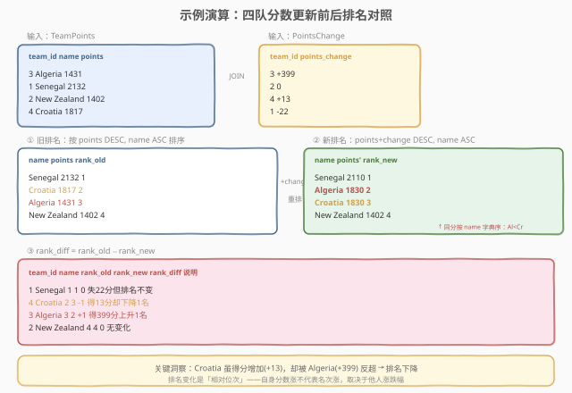

# 世界排名的变化

- **题目名称**：世界排名的变化
- **链接**：[2175. 世界排名的变化 🔒](https://leetcode.cn/problems/the-change-in-global-rankings/)
- **难度**：中等
- **标签**：数据库、SQL、窗口函数、`RANK()`、`JOIN`、排名差分、LeetCode 锁题

## 1. 题目概述

国家队按**全球排名**排位：将所有队伍的得分**降序排列**后所得的名次；若两支队伍得分相同，则按其**名称的字典序**排列以打破平局。现给定每支队伍的当前得分与得分变化量，要求在**更新分数后**，计算每个队伍的**全球排名变化**。

**表结构**：

```text
Table: TeamPoints
+-------------+---------+
| Column Name | Type    |
+-------------+---------+
| team_id     | int     |
| name        | varchar |
| points      | int     |
+-------------+---------+
team_id 包含唯一值。
每一行包含一支国家队的 ID、所代表的国家名，以及全球排名得分。
没有两支队伍代表同一个国家。

Table: PointsChange
+---------------+------+
| Column Name   | Type |
+---------------+------+
| team_id       | int  |
| points_change | int  |
+---------------+------+
team_id 包含唯一值。
每一行包含一支国家队的 ID 及其得分变化（0=不变，正数=增加，负数=降低）。
TeamPoints 中出现的每一个 team_id 均会在这张表中出现。
```

**排名规则**：按 `points` **降序**排列；同分时按 `name` **字典序升序**排列。每个队伍的分数需根据其 `points_change` 进行更新。`rank_diff` 定义为**旧排名减新排名**——正值代表排名上升（名次数变小），负值代表下降，0 代表不变。

**示例 1**：

```text
输入：
TeamPoints 表：
+---------+-------------+--------+
| team_id | name        | points |
+---------+-------------+--------+
| 3       | Algeria     | 1431   |
| 1       | Senegal     | 2132   |
| 2       | New Zealand | 1402   |
| 4       | Croatia     | 1817   |
+---------+-------------+--------+
PointsChange 表：
+---------+---------------+
| team_id | points_change |
+---------+---------------+
| 3       | 399           |
| 2       | 0             |
| 4       | 13            |
| 1       | -22           |
+---------+---------------+

输出：
+---------+-------------+-----------+
| team_id | name        | rank_diff |
+---------+-------------+-----------+
| 1       | Senegal     | 0         |
| 4       | Croatia     | -1        |
| 3       | Algeria     | 1         |
| 2       | New Zealand | 0         |
+---------+-------------+-----------+
```

**解释**：

- 旧排名：Senegal(2132)=1, Croatia(1817)=2, Algeria(1431)=3, New Zealand(1402)=4
- 更新后分数：Senegal=2110, Algeria=1830, Croatia=1830, New Zealand=1402
- 新排名：Senegal=1, Algeria=2, Croatia=3（同分 1830，按字典序 Algeria < Croatia）, New Zealand=4
- Senegal 失 22 分但排名不变（`1-1=0`）；Croatia 得 13 分却被反超，下降 1 名（`2-3=-1`）；Algeria 得 399 分上升 1 名（`3-2=1`）；New Zealand 无变化。

> 💡 本题是 SQL **"双窗口排名差分"招牌题**——核心在于「排名是相对位次」：一个队伍的名次不仅取决于自身分数，更取决于**所有队伍**分数更新后的相对高低。解法用**两个 `RANK()` 窗口函数**分别对「旧分数」与「新分数」打号，再逐行相减即得变化量，无需自连接、无需逐行循环。

---

## 2. 解题思路

### 2.1 暴力思路：分别算两次排名再逐行比对

最直觉的过程式思路是：① 把 `TeamPoints` 与 `PointsChange` 关联，算出每队新分数；② 对旧分数排序得旧排名表；③ 对新分数排序得新排名表；④ 两张排名表按 `team_id` 对齐，逐行相减。

这在过程式语言（Python/pandas）里很自然，但在 SQL 中若按此拆步，需要**两次排序 + 一次自连接**，写起来啰嗦。关键观察是：**两次排名的输入行集完全相同**（都是 JOIN 后的同一张表），只是排序键不同（`points` vs `points + points_change`）。

> ⚠️ **核心障碍**：排名变化 = 旧排名 − 新排名，而「排名」本质是「在某个排序键下，比本行更优的行数 + 1」。既然两次排名共享同一输入行集，就可以在**同一条 `SELECT`** 里并列写两个窗口函数，让每行同时拿到 old/new 两个名次，直接相减——省去自连接。

### 2.2 核心观察：双 `RANK()` 窗口并列相减



把问题拆成三步：

1. **JOIN 两表**：`TeamPoints JOIN PointsChange USING (team_id)`，每行同时拿到 `points`（旧分数）与 `points_change`（变化量）。`team_id` 在两表中均唯一且一一对应，是 1:1 内连接。

2. **并列打两个排名**：在同一条 `SELECT` 中写两个窗口函数——
   - `rank_old = RANK() OVER (ORDER BY points DESC, name)` ——按旧分数降序、同分按 name 字典序；
   - `rank_new = RANK() OVER (ORDER BY points + points_change DESC, name)` ——按新分数降序、同分按 name 字典序。

3. **逐行相减**：`rank_diff = rank_old − rank_new`。正值代表名次数变小（排名上升），负值代表下降。

> 💡 **为什么能直接相减？** 两个 `RANK()` 作用于**同一行集**（JOIN 结果），窗口函数在 `SELECT` 阶段对整张已 JOIN 的表排序打号，每行同时获得 old/new 两个名次，天然按 `team_id` 对齐，无需 `JOIN` 自身。这是窗口函数「对整行集打号、不改变行数」特性的典型应用。

> ⚠️ **`name` 唯一 ⇒ 无并列**：题面「没有两支队伍代表同一个国家」保证 `name` 全局唯一，故排序键 `(points DESC, name ASC)` 是全序——不存在两行排序键完全相等的情况。因此 `RANK()`、`DENSE_RANK()`、`ROW_NUMBER()` 三者结果**完全相同**（详见第 5 节）。本题用 `RANK()` 是因其语义即「排名」，最贴合题意。

### 2.3 算法流程图



**逻辑执行步骤**：

| 步骤 | 子句 | 作用 |
|------|------|------|
| ① | `FROM TeamPoints JOIN PointsChange USING (team_id)` | 1:1 内连接，每行拿到 `points` 与 `points_change` |
| ② | `RANK() OVER (ORDER BY points DESC, name)` | 对旧分数打排名 `rank_old` |
| ② | `RANK() OVER (ORDER BY points + points_change DESC, name)` | 对新分数打排名 `rank_new` |
| ③ | `rank_old − rank_new` | 逐行相减得 `rank_diff` |
| ④ | `SELECT team_id, name, rank_diff` | 输出，顺序任意 |

> 💡 **SQL 子句执行顺序**：`FROM`（含 `JOIN`/`ON`）→ `WHERE` → `GROUP BY` → `HAVING` → `SELECT`（含窗口函数）→ `ORDER BY` → `LIMIT`。两个 `RANK()` 都在 `SELECT` 阶段计算，此时 `FROM/JOIN` 已把两表拼成统一行集，窗口函数直接对该行集整体排序打号。这正是「两次排名共享同一输入」能够成立的执行序根基。

### 2.4 示例演算

以示例 1 为例，观察「JOIN → 旧排名 → 新排名 → 相减」全过程：



**① 旧排名**（按 `points DESC, name ASC`）：

| name | points | rank_old |
|------|--------|----------|
| Senegal | 2132 | 1 |
| Croatia | 1817 | 2 |
| Algeria | 1431 | 3 |
| New Zealand | 1402 | 4 |

**② 新排名**（`points + points_change` 后按 `DESC, name ASC`）：

| name | points' | rank_new |
|------|---------|----------|
| Senegal | 2110 | 1 |
| Algeria | 1830 | 2 |
| Croatia | 1830 | 3 |
| New Zealand | 1402 | 4 |

> ⚠️ **同分破局**：Algeria 与 Croatia 更新后均为 1830 分，按 `name` 字典序 `Algeria < Croatia`，故 Algeria 排第 2、Croatia 排第 3。这是题面「同分按名称字典序」规则的落点。

**③ 相减** `rank_diff = rank_old − rank_new`：

| team_id | name | rank_old | rank_new | rank_diff | 说明 |
|---------|------|----------|----------|-----------|------|
| 1 | Senegal | 1 | 1 | 0 | 失 22 分但排名不变 |
| 4 | Croatia | 2 | 3 | −1 | 得 13 分却被反超，下降 1 名 |
| 3 | Algeria | 3 | 2 | +1 | 得 399 分，上升 1 名 |
| 2 | New Zealand | 4 | 4 | 0 | 无变化 |

> 💡 **关键洞察**：Croatia 虽然得分**增加**了 13 分，排名却**下降**了 1 名——因为 Algeria 增加了 399 分，反超了 Croatia。**排名是相对位次**：自身分数涨不代表名次涨，取决于他人涨跌幅。这是「排名变化」类问题的核心认知，也是本题最易被忽略的直觉陷阱。

---

## 3. 参考代码

### SQL（解法 A：双 `RANK()` 并列相减，推荐）

```sql
SELECT team_id,
       name,
       CAST(RANK() OVER (ORDER BY points DESC, name) AS SIGNED)
     - CAST(RANK() OVER (ORDER BY points + points_change DESC, name) AS SIGNED) AS rank_diff
FROM TeamPoints
JOIN PointsChange USING (team_id);
```

> 💡 **写法要点**：
> - **`JOIN ... USING (team_id)`**：`team_id` 在两表均唯一且一一对应，1:1 内连接后每行同时持有 `points` 与 `points_change`。题面保证 `TeamPoints` 的每个 `team_id` 都在 `PointsChange` 出现，用 `INNER JOIN` 不会丢行。
> - **两个 `RANK()` 并列写在同一条 `SELECT`**：共享 JOIN 后的同一行集，每行同时算出 `rank_old` 与 `rank_new`，天然按 `team_id` 对齐，**无需自连接**。
> - **`CAST(... AS SIGNED)`**：`RANK()` 返回 `BIGINT`，显式转为 `SIGNED` 保证两值相减结果类型干净（部分 MySQL 版本对 `BIGINT` 直接相减有符号位歧义）。MySQL 8.0 下省略 `CAST` 通常也能通过，加上更稳妥。
> - **排序键 `(points DESC, name)`**：`name` 默认升序即字典序，无需写 `ASC`。
> - ✓ **最推荐**：一条 `SELECT` 搞定，语义清晰，MySQL 8.0+/PostgreSQL/Spark SQL 均支持。

### SQL（解法 B：CTE 预算 `new_points` + 双 `RANK()`）

```sql
WITH joined AS (
    SELECT t.team_id,
           t.name,
           t.points,
           t.points + p.points_change AS new_points
    FROM TeamPoints t
    JOIN PointsChange p USING (team_id)
)
SELECT team_id,
       name,
       CAST(RANK() OVER (ORDER BY points DESC, name) AS SIGNED)
     - CAST(RANK() OVER (ORDER BY new_points DESC, name) AS SIGNED) AS rank_diff
FROM joined;
```

> 💡 **解法 B 的思路**：用 CTE `joined` 把「新分数」显式物化为列 `new_points`，外层再对 `points` 与 `new_points` 分别打 `RANK()`。
>
> **与解法 A 的区别**：A 在窗口函数的 `ORDER BY` 里现场写 `points + points_change` 表达式；B 把它提到 CTE 里命名成 `new_points`。逻辑等价，B 更**可读**（新分数有名字、复用方便），A 更**紧凑**。若 `points_change` 的取数逻辑更复杂（如需 `SUM` 聚合多行变化量），B 的分层结构更易扩展。面试讲法首选 B（CTE 分层清晰），笔试写法首选 A（行数少）。

> ⚠️ **防御性写法**：若担心 `PointsChange` 对同一 `team_id` 出现多行（题面声明唯一，但生产数据可能不规整），CTE 可用 `SUM` 聚合：
> ```sql
> PointsChange AS (SELECT team_id, SUM(points_change) AS points_change FROM PointsChange GROUP BY team_id)
> ```
> 题面下 `team_id` 唯一，`SUM` 等价于直取，仅作健壮性保险。

### SQL（解法 C：相关子查询计数，无窗口函数）

```sql
SELECT t.team_id,
       t.name,
       (SELECT COUNT(*) + 1
        FROM TeamPoints t2
        JOIN PointsChange p2 ON p2.team_id = t2.team_id
        WHERE t2.points > t.points
           OR (t2.points = t.points AND t2.name < t.name))
     - (SELECT COUNT(*) + 1
        FROM TeamPoints t3
        JOIN PointsChange p3 ON p3.team_id = t3.team_id
        WHERE t3.points + p3.points_change > t.points + p.points_change
           OR (t3.points + p3.points_change = t.points + p.points_change
               AND t3.name < t.name)) AS rank_diff
FROM TeamPoints t
JOIN PointsChange p ON p.team_id = t.team_id;
```

> 💡 **解法 C 的思路**：排名 = 「比我更优的行数 + 1」。「更优」定义为：分数比我高，或同分但 name 字典序在我之前。用**相关子查询** `COUNT(*)` 逐行统计比我更优的行数，旧/新各算一次再相减。
>
> **适用场景**：MySQL 5.7 等无窗口函数的环境。代价是 $O(n^2)$（每行触发两次全表扫描），仅作兼容性参考，**生产环境请用窗口函数**。该写法的价值在于揭示「排名」的本质定义——名次 = 严格更优者的计数 + 1，这是 `RANK()` 窗口函数的底层语义。

### Python（pandas）

```python
import pandas as pd

def change_in_global_rankings(team_points: pd.DataFrame, points_change: pd.DataFrame) -> pd.DataFrame:
    df = team_points.merge(points_change, on='team_id')
    df['new_points'] = df['points'] + df['points_change']

    old = df.sort_values(['points', 'name'], ascending=[False, True]).reset_index(drop=True)
    old['rank_old'] = old.index + 1

    new = df.sort_values(['new_points', 'name'], ascending=[False, True]).reset_index(drop=True)
    new['rank_new'] = new.index + 1

    res = old[['team_id', 'name', 'rank_old']].merge(
        new[['team_id', 'rank_new']], on='team_id')
    res['rank_diff'] = res['rank_old'] - res['rank_new']
    return res[['team_id', 'name', 'rank_diff']]
```

> 💡 **pandas 对照**：
> - `.merge(points_change, on='team_id')` 对应 SQL 的 `JOIN ... USING (team_id)`。
> - `.sort_values(['points', 'name'], ascending=[False, True])` 对应 `ORDER BY points DESC, name ASC`——`ascending` 列表分别控制每列方向。
> - `.reset_index(drop=True)` 后 `index + 1` 对应 `RANK() OVER (ORDER BY ...)`——因 `name` 唯一无并列，位置序号即排名。
> - 两次排序各自打号后 `.merge(on='team_id')` 对齐——对应 SQL 中两个 `RANK()` 共享行集、按 `team_id` 天然对齐。pandas 无法在一条语句里并列两个不同排序的窗口，故需拆两步再 merge。

---

## 4. 复杂度分析

| 维度 | 解法 A（双 `RANK()` 并列） | 解法 B（CTE + 双 `RANK()`） | 解法 C（相关子查询） | pandas |
|------|---------------------------|----------------------------|----------------------|--------|
| **时间** | $O(n \log n)$ | $O(n \log n)$ | $O(n^2)$ | $O(n \log n)$ |
| **空间** | $O(n)$ | $O(n)$ | $O(1)$（额外） | $O(n)$ |
| **扫描次数** | 1 次 JOIN + 2 次排序 | 1 次 JOIN + 2 次排序 | $2n$ 次（每行两次全表） | 1 次 merge + 2 次排序 |
| **是否依赖窗口函数** | 是（MySQL 8.0+） | 是（MySQL 8.0+） | 否 | 否 |
| **推荐度** | ✓ **首选（笔试）** | ✓ **首选（面试讲）** | ✓ 兼容旧版 | ✓ 验证用 |

> - $n$ = 队伍数（`TeamPoints` 行数）
> - **时间**：两次排序各 $O(n \log n)$ 是主项，窗口函数打号本身 $O(n)$（排序后顺序赋值），总体 $O(n \log n)$。解法 C 每行两个相关子查询各扫全表一次，共 $2n$ 次扫描，$O(n^2)$，队伍多时性能崩塌。
> - **空间**：窗口函数需排序中间结果 $O(n)$；解法 C 仅用常数额外空间（但时间代价高）。
> - **索引优化**：若 `TeamPoints(points)` 与 `PointsChange(team_id)` 上有索引，JOIN 可走索引，排序也可部分利用索引有序性。但通常 LeetCode 测试数据量小（$n \le 50$），无显著差异。

---

## 5. 扩展：`RANK` / `DENSE_RANK` / `ROW_NUMBER` 为何三选一皆可？

本题排序键为 `(points DESC, name ASC)`，而题面保证「没有两支队伍代表同一个国家」⇒ `name` 全局唯一。因此**不可能出现两行排序键完全相等**的情况——`(points, name)` 构成全序。在全序下，三函数行为一致：

设四队排序键各不相同，三者分配：

| name | points | `ROW_NUMBER` | `RANK` | `DENSE_RANK` |
|------|--------|--------------|--------|--------------|
| Senegal | 2132 | 1 | 1 | 1 |
| Croatia | 1817 | 2 | 2 | 2 |
| Algeria | 1431 | 3 | 3 | 3 |
| New Zealand | 1402 | 4 | 4 | 4 |

三列完全相同。差异只在**有并列值**时才显现：

| 排序键值 | `ROW_NUMBER` | `RANK` | `DENSE_RANK` |
|----------|--------------|--------|--------------|
| 100 | 1 | 1 | 1 |
| 100 | 2 | 1 | 1 |
| 90 | 3 | 3 | 2 |

- `ROW_NUMBER`：强制每行不同序号（1,2,3），并列时任意破结；
- `RANK`：并列同号、后续跳过（1,1,3）；
- `DENSE_RANK`：并列同号、后续不跳（1,1,2）。

> 💡 **本题选 `RANK()` 的理由**：① 语义即「排名」，最贴合题意；② 在 `name` 唯一的全序下三者等价，选哪个都对。若某天题面放宽「允许同国多名」，则 `RANK` 与 `DENSE_RANK` 会产生不同名次（跳号 vs 不跳号），需按业务定义选择——通常体育排名用 `RANK`（并列第 2 则下一个是第 4，跳过第 3）。

### 5.1 `rank_diff` 符号约定

本题 `rank_diff = rank_old − rank_new`，约定**正值 = 上升**：

| 情形 | rank_old | rank_new | rank_diff | 含义 |
|------|----------|----------|-----------|------|
| Algeria | 3 | 2 | +1 | 名次数变小 ⇒ 上升 |
| Croatia | 2 | 3 | −1 | 名次数变大 ⇒ 下降 |
| Senegal | 1 | 1 | 0 | 不变 |

> ⚠️ 若题面改为「新排名减旧排名」，则符号反转（上升为负）。本题以示例输出为准：Algeria 输出 `+1`（上升），故确认 `old − new`。

---

## 6. 面试要点

1. **为什么两个 `RANK()` 可以直接相减而不需要自连接？**

   > 两个窗口函数写在**同一条 `SELECT`** 中，作用于 `FROM/JOIN` 产出的**同一行集**。窗口函数不改变行数——每行在排序后获得自己的名次，两个名次天然挂在同一行上，按 `team_id` 对齐。相减是同行内两列的标量运算，无需再 `JOIN` 自身。若改成「分两条查询再对齐」，反而需要额外的 `JOIN on team_id` 把两份排名缝合，是多余的。

2. **`name` 唯一性对排名函数的选择有何影响？**

   > 题面「没有两支队伍代表同一个国家」⇒ `name` 全局唯一 ⇒ 排序键 `(points DESC, name ASC)` 是全序，不存在并列。此时 `RANK`、`DENSE_RANK`、`ROW_NUMBER` 结果完全相同（均得 1,2,3,…,n）。选 `RANK` 因其语义即「排名」。若放宽唯一性允许同国多队，则三函数在有同分时分歧：`RANK` 跳号（1,1,3）、`DENSE_RANK` 不跳（1,1,2）、`ROW_NUMBER` 强制不同（1,2,3），需按业务定义择一。

3. **Croatia 得分增加了 13 分，为什么排名反而下降？**

   > 排名是**相对位次**，取决于所有队伍更新后的相对高低。Croatia 虽 +13 分，但 Algeria +399 分反超了它（旧 1431 → 新 1830，超过 Croatia 旧 1817 → 新 1830，同分时 `Algeria < Croatia` 字典序占先）。自身分数涨不代表名次涨——这是「排名变化」类问题的核心认知陷阱。面试中主动点出这一点，体现对「相对量 vs 绝对量」的辨析。

4. **解法 C 的相关子查询为何是 $O(n^2)$？**

   > 每行需算两个相关子查询，每个子查询 `COUNT(*)` 扫一遍全表（JOIN 后的 $n$ 行）。$n$ 行各触发两次全表扫描 ⇒ $2n$ 次扫描 ⇒ $O(n^2)$。窗口函数版本只需 1 次扫描 + 2 次排序 $O(n \log n)$，队伍多时差距显著。解法 C 的价值在「无窗口函数环境兼容」与「揭示排名 = 严格更优者计数 + 1 的本质定义」，非性能首选。

5. **`CAST(... AS SIGNED)` 能省略吗？**

   > `RANK()` 在 MySQL 中返回 `BIGINT`（无符号语境下可能被当作 `UNSIGNED`），两个 `UNSIGNED` 相减若结果为负会触发 `BIGINT UNSIGNED value is out of range` 错误（Croatia 的 −1 即负值！）。`CAST AS SIGNED` 显式转为有符号整数，保证负值合法。MySQL 8.0 在多数场景下能隐式处理，但**加上 `CAST` 是规避该陷阱的稳妥写法**，面试中点出这一点显经验。

> 💡 **一句话总结**：2175 是 SQL **"双窗口排名差分"招牌题**——核心模板「`JOIN` 两表 → 同一 `SELECT` 并列两个 `RANK() OVER (ORDER BY ...)` → 逐行相减」。最大要点：**两次排名共享同一行集，窗口函数天然按行对齐，无需自连接**；`name` 唯一保证全序故三函数等价；`CAST AS SIGNED` 规避无符号减法溢出。认知陷阱：**排名是相对量，自身涨分不代表名次涨**。

---

## 7. 同类练习题

- [178. 分数排名](https://leetcode.cn/problems/rank-scores/)（[题解](../0101-0200/178_分数排名.md)）：`RANK`/`DENSE_RANK`/`ROW_NUMBER` 三函数辨析，理解本题在 `name` 唯一时为何三选一皆可
- [184. 部门工资最高的员工](https://leetcode.cn/problems/department-highest-salary/)（[题解](../0101-0200/184_部门工资最高的员工.md)）：`RANK`/`ROW_NUMBER` 分组取组内最值，与本题「全局排名」对照——分组 vs 全局窗口的区别
- [1549. 每件商品的最新订单 🔒](https://leetcode.cn/problems/the-most-recent-orders-for-each-product/)（[题解](../1501-1600/1549_每件商品的最新订单.md)）：`RANK` 取组内最值所有行，与本题「两次排名相减」对照——同为 `RANK` 窗口的不同用法
- [571. 给定数字的频率查询中位数](https://leetcode.cn/problems/find-median-given-frequency-of-numbers/)（[题解](../0501-0600/571_给定数字的频率查询中位数.md)）：窗口函数定位「排名位置」求中位数，与本题「排名差分」同属「用窗口序号表达位次」家族
- [1174. 即时食物配送 II](https://leetcode.cn/problems/immediate-food-delivery-ii/)（[题解](../1101-1200/1174_即时食物配送II.md)）：`RANK`/`ROW_NUMBER` 取组内首条记录，与本题「双排名相减」对照——同为窗口函数「位次」应用
