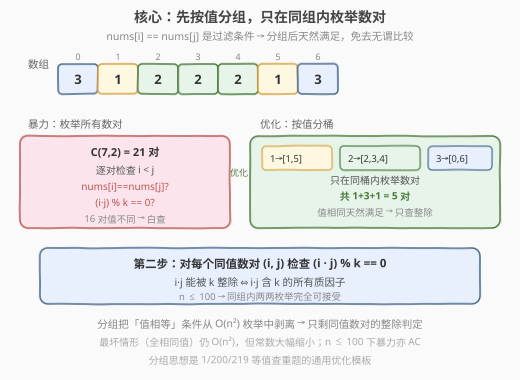
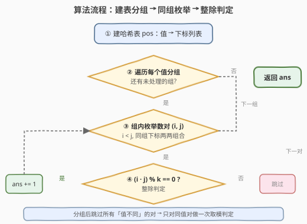
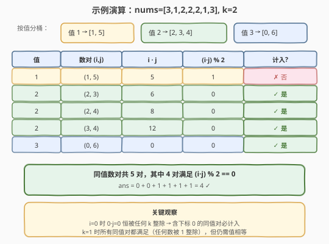

# 统计数组中相等且可以被整除的数对

- **题目名称**：统计数组中相等且可以被整除的数对
- **链接**：[2176. 统计数组中相等且可以被整除的数对](https://leetcode.cn/problems/count-equal-and-divisible-pairs-in-an-array/)
- **难度**：简单
- **标签**：数组、哈希表、枚举

## 1. 题目概述

给你一个下标从 **0** 开始长度为 `n` 的整数数组 `nums` 和一个整数 `k`，请你返回满足 `0 <= i < j < n`，`nums[i] == nums[j]` 且 `(i * j)` 能被 `k` 整除的数对 `(i, j)` 的 **数目**。

**示例 1**：

```text
输入：nums = [3,1,2,2,2,1,3], k = 2
输出：4
解释：
总共有 4 对数符合所有要求：
- nums[0] == nums[6] 且 0 * 6 == 0，能被 2 整除。
- nums[2] == nums[3] 且 2 * 3 == 6，能被 2 整除。
- nums[2] == nums[4] 且 2 * 4 == 8，能被 2 整除。
- nums[3] == nums[4] 且 3 * 4 == 12，能被 2 整除。
```

**示例 2**：

```text
输入：nums = [1,2,3,4], k = 1
输出：0
解释：由于数组中没有重复数值，所以没有数对 (i,j) 符合所有要求。
```

**约束条件**：

- $1 \le \text{nums.length} \le 100$
- $1 \le \text{nums[i]}, k \le 100$

> 💡 本题有两个条件：**值相等** `nums[i] == nums[j]` 与 **下标乘积整除** `(i * j) % k == 0`。关键在于把「值相等」条件从枚举中剥离——用哈希表按下标值分组后，只在同组内枚举数对，天然跳过所有值不同的无效组合。约束 $n \le 100$ 下暴力 $O(n^2)$ 也能过，但分组思想是同类「值查重」题的通用优化模板。

---

## 2. 解题思路

### 2.1 暴力思路：双重循环枚举所有数对

最直白的做法是写一个双重循环，枚举所有 $0 \le i < j < n$ 的数对，逐对检查两个条件：

```text
ans = 0
for i in range(n):
    for j in range(i + 1, n):
        if nums[i] == nums[j] and (i * j) % k == 0:
            ans += 1
return ans
```

总共有 $\binom{n}{2} = \frac{n(n-1)}{2}$ 个数对。约束 $n \le 100$ 时最多约 $4950$ 对，每次检查 $O(1)$，完全在时限内。

> ⚠️ 暴力能过，但有浪费：大量数对的 `nums[i] != nums[j]`，第一个条件就被淘汰，`i*j` 的整除判定纯属白算。若数组中不同值的种类较多，有效数对占比极低。

### 2.2 核心观察：按值分组，只枚举同值数对



**观察：值相等条件可以前置。**

`nums[i] == nums[j]` 意味着只有 **值相同的两个下标** 才可能成为答案。与其在 $O(n^2)$ 枚举中逐一过滤，不如先用哈希表把 **相同值的下标归到一组**，然后只在每个组内两两枚举：

$$
\text{pos}[v] = [\, i_0,\; i_1,\; \dots,\; i_{m-1} \,] \quad \text{其中 } \text{nums}[i_\ast] = v
$$

对每个组 `pos[v]`，枚举组内所有 $a < b$ 的下标对 $(i_a, i_b)$，只需检查第二个条件 $(i_a \cdot i_b) \bmod k = 0$ 即可——值相等已由分组天然保证。

> 💡 **为什么分组更优**：设值有 $t$ 种，每种值出现 $c_1, c_2, \dots, c_t$ 次（$\sum c_i = n$）。暴力检查 $\binom{n}{2}$ 对；分组后只检查 $\sum_{v} \binom{c_v}{2}$ 对。当值分布分散时，后者远小于前者。最坏情形（所有值相同，$t=1$）两者都为 $\binom{n}{2}$，退化为同等规模。

**边界与特例**：

- **下标 0**：$0 \times j = 0$，$0 \bmod k = 0$ 对任意 $k \ge 1$ 成立 → 含下标 0 的同值对必定满足整除条件。
- **k = 1**：任何整数被 1 整除 → 整除条件恒成立，答案 = 所有同值数对数（即 1512「好数对的数目」）。
- **无重复值**：每个组大小为 1，无对可枚举，答案为 0（如示例 2）。

### 2.3 算法流程图



1. **建哈希表** `pos`：遍历 `nums`，将每个下标按其值归入对应列表。
2. **遍历每个值分组**：对 `pos` 中的每个值 `v` 及其下标列表 `idxs`。
3. **组内枚举数对**：对 `idxs` 中所有 $a < b$，取出下标对 $(i_a, i_b)$。
4. **整除判定**：若 $(i_a \cdot i_b) \bmod k = 0$，则 `ans += 1`。
5. **返回** `ans`。

### 2.4 示例演算



**示例 1：`nums = [3,1,2,2,2,1,3], k = 2`**

**第一步：按值分桶**

| 值 | 下标列表 |
|------|----------|
| 1 | [1, 5] |
| 2 | [2, 3, 4] |
| 3 | [0, 6] |

**第二步：组内枚举并检查整除**

| 值 | 数对 (i, j) | $i \cdot j$ | $(i \cdot j) \bmod 2$ | 计入? |
|------|-------------|-------------|----------------------|-------|
| 1 | (1, 5) | 5 | 1 | ✗ 否 |
| 2 | (2, 3) | 6 | 0 | ✓ 是 |
| 2 | (2, 4) | 8 | 0 | ✓ 是 |
| 2 | (3, 4) | 12 | 0 | ✓ 是 |
| 3 | (0, 6) | 0 | 0 | ✓ 是 |

同值数对共 5 对，其中 4 对满足整除条件，`ans = 4` ✓

> 💡 注意 (0, 6) 这对：$0 \times 6 = 0$，0 能被任何 $k$ 整除，这是含下标 0 的同值对必定计入的原因。

**示例 2：`nums = [1,2,3,4], k = 1`**

按值分桶后每个组大小均为 1（无重复值），无对可枚举，`ans = 0` ✓

> ⚠️ 虽然 $k = 1$ 时整除条件恒成立，但没有重复值就没有同值数对，答案仍为 0。这说明 **值相等是先决条件，整除是附加过滤**。

---

## 3. 参考代码

### C++（哈希表分组版，推荐）

```cpp
class Solution {
  public:
    int countPairs(vector<int>& nums, int k) {
        unordered_map<int, vector<int>> pos;
        for (int i = 0; i < (int)nums.size(); ++i) {
            pos[nums[i]].push_back(i);
        }
        int ans = 0;
        for (auto& [val, idxs] : pos) {
            int m = idxs.size();
            for (int a = 0; a < m; ++a) {
                for (int b = a + 1; b < m; ++b) {
                    if ((idxs[a] * idxs[b]) % k == 0) {
                        ++ans;
                    }
                }
            }
        }
        return ans;
    }
};
```

> 💡 用结构化绑定 `auto& [val, idxs]` 遍历哈希表更清晰；`val` 未使用但保留可读性。`idxs[a] * idxs[b]` 在 $n \le 100$ 下最大 $99 \times 98 < 10^4$，不会溢出 `int`。

### C++（暴力双循环版，约束下可过）

```cpp
class Solution {
  public:
    int countPairs(vector<int>& nums, int k) {
        int n = nums.size();
        int ans = 0;
        for (int i = 0; i < n; ++i) {
            for (int j = i + 1; j < n; ++j) {
                if (nums[i] == nums[j] && (i * j) % k == 0) {
                    ++ans;
                }
            }
        }
        return ans;
    }
};
```

### Python（哈希表分组版，推荐）

```python
class Solution:
    def countPairs(self, nums: List[int], k: int) -> int:
        from collections import defaultdict

        pos = defaultdict(list)
        for i, v in enumerate(nums):
            pos[v].append(i)
        ans = 0
        for idxs in pos.values():
            m = len(idxs)
            for a in range(m):
                for b in range(a + 1, m):
                    if (idxs[a] * idxs[b]) % k == 0:
                        ans += 1
        return ans
```

> ⚠️ `defaultdict(list)` 省去手动初始化空列表的判断。Python 整数无溢出，`(idxs[a] * idxs[b]) % k` 直接计算即可。

### Python（暴力双循环版，对照参考）

```python
class Solution:
    def countPairs(self, nums: List[int], k: int) -> int:
        ans = 0
        n = len(nums)
        for i in range(n):
            for j in range(i + 1, n):
                if nums[i] == nums[j] and (i * j) % k == 0:
                    ans += 1
        return ans
```

---

## 4. 复杂度分析

| 维度 | 复杂度 | 说明 |
|------|--------|------|
| 时间复杂度（分组版） | $O(n + \sum_v \binom{c_v}{2})$，最坏 $O(n^2)$ | 建表 $O(n)$；枚举同值对数取决于值分布，最坏全相同退化为 $\binom{n}{2}$；值分散时远小于 $O(n^2)$ |
| 时间复杂度（暴力版） | $O(n^2)$ | 枚举所有 $\binom{n}{2}$ 个数对，每对 $O(1)$ 检查 |
| 空间复杂度（分组版） | $O(n)$ | 哈希表存储所有下标，共 $n$ 个 |
| 空间复杂度（暴力版） | $O(1)$ | 仅用常数个变量 |

> 💡 两种实现的时间上界都是 $O(n^2)$，但 **常数差异显著**：当值种类多、每组下标少时，分组版枚举的对数远少于暴力版。空间上分组版多用 $O(n)$ 的哈希表，是「以空间换常数优化」的经典权衡。约束 $n \le 100$ 下两者均轻松 AC。

---

## 5. 扩展：GCD 优化的整除判定（大 $n$ 场景）

当 $n$ 放大到 $10^5$ 级别时，同组内两两枚举 $O(n^2)$ 会超时，需要更高效地统计满足 $(i \cdot j) \bmod k = 0$ 的数对。

**数学转化**：固定下标 $i$，设 $g = \gcd(i, k)$，则

$$
(i \cdot j) \bmod k = 0 \iff j \bmod \frac{k}{g} = 0
$$

即 $j$ 必须是 $\frac{k}{\gcd(i, k)}$ 的倍数（证明：$i = g \cdot i'$，$k = g \cdot k'$，$\gcd(i', k') = 1$，则 $i \cdot j \equiv 0 \pmod{k} \iff i' \cdot j \equiv 0 \pmod{k'} \iff j \equiv 0 \pmod{k'}$）。

**优化算法**：对每个值分组，按从左到右扫描下标 $i$。维护一个哈希表 `cnt[d]` 记录已扫描下标中是 $d$ 的倍数的个数。对当前下标 $i$：

1. 计算 $d = k / \gcd(i, k)$。
2. 查 `cnt[d]` 得到前面有多少个下标 $j$ 是 $d$ 的倍数（这些 $j$ 与 $i$ 配对满足整除）。
3. 把 $i$ 插入后，更新所有 $i$ 的约数 $e$ 对应的 `cnt[e]`。

这样每组内统计为 $O(m \sqrt{n})$（$m$ 为组大小），总体可降到 $O(n \sqrt{n})$。

> ⚠️ 此优化仅在大 $n$ 时有必要。本题 $n \le 100$，两两枚举已足够，引入 GCD 反而增加代码复杂度。「先写对，再优化」是简单题的正确策略。

---

## 6. 面试要点

1. **为什么先按值分组而不是直接双重循环？**

   - 暴力双重循环会检查所有 $\binom{n}{2}$ 个数对，其中大量数对因 `nums[i] != nums[j]` 在第一个条件就被淘汰，整除判定白算。按值分组后，只在同值组内枚举，天然满足值相等条件，跳过所有无效组合。值分布越分散，优化效果越显著。

2. **分组版的最坏情形是什么？**

   - 所有元素值相同时，只有一个组，组内需枚举 $\binom{n}{2}$ 个对，与暴力版规模相同。此时分组退化为「多建一张哈希表但没省比较」，常数甚至略大。但 $n \le 100$ 下两者都轻松 AC。

3. **下标 0 有什么特殊性质？**

   - $0 \times j = 0$，而 $0 \bmod k = 0$ 对任意 $k \ge 1$ 成立。因此任何含下标 0 的同值数对必定满足整除条件，无需计算。这是面试中容易被追问的边界细节。

4. **k = 1 时答案是什么？**

   - $k = 1$ 时任何整数被 1 整除，整除条件恒成立。答案 = 所有同值数对数，即 $\sum_v \binom{c_v}{2}$，与 1512「好数对的数目」完全一致。但若数组无重复值，答案仍为 0。

5. **如何把整除判定从 $O(1)$-per-pair 优化到更高效？**

   - 利用 $\gcd$ 转化：$(i \cdot j) \bmod k = 0 \iff j \bmod \frac{k}{\gcd(i, k)} = 0$。对每个下标 $i$，只需在同组内统计是 $\frac{k}{\gcd(i, k)}$ 倍数的下标个数，配合约数哈希表可将整体降到 $O(n\sqrt{n})$。仅在大 $n$ 时值得引入。

---

## 7. 同类练习题

- [1512. 好数对的数目](https://leetcode.cn/problems/number-of-good-pairs/)：只统计 `nums[i]==nums[j]` 且 `i<j` 的对数，是本题去掉整除条件的退化版，分组思想的最简入门
- [219. 存在重复元素 II](https://leetcode.cn/problems/contains-duplicate-ii/)：同样用哈希表按值映射下标，改为检查同值下标距离 ≤ k，分组后查最近下标即可
- [2006. 差的绝对值为 K 的数对数目](https://leetcode.cn/problems/count-number-of-pairs-with-absolute-difference-k/)：统计满足 `|nums[i]-nums[j]|==k` 的对数，哈希表按值分组后查 `v±k` 的频次，分组计数模板
- [220. 存在重复元素 III](https://leetcode.cn/problems/contains-duplicate-iii/)：219 的进阶——同值升级为近似值（差 ≤ t），桶分桶 + 滑动窗口，是「值查重」家族的高阶题
- [1. 两数之和](https://leetcode.cn/problems/two-sum/)：哈希表值→下标映射的鼻祖题，本题建表阶段与 1 完全一致，只是查询条件不同
