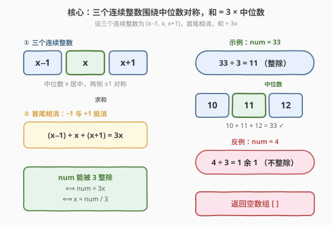
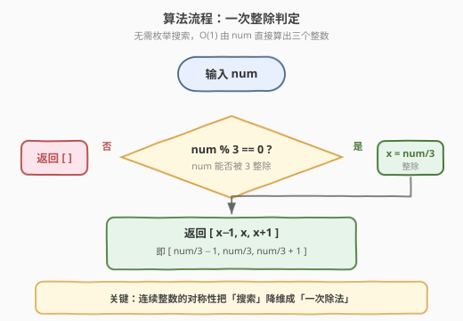

# 找到和为给定整数的三个连续整数

- **题目名称**：找到和为给定整数的三个连续整数
- **链接**：[2177. 找到和为给定整数的三个连续整数](https://leetcode.cn/problems/find-three-consecutive-integers-that-sum-to-a-given-number/)
- **难度**：中等
- **标签**：数学

## 1. 题目概述

给你一个整数 `num`，请你返回三个连续的整数，它们的 **和** 为 `num`。如果 `num` 无法被表示成三个连续整数的和，请你返回一个 **空** 数组。

**示例 1**：

```text
输入：num = 33
输出：[10,11,12]
解释：33 可以表示为 10 + 11 + 12 = 33。
10, 11, 12 是 3 个连续整数，所以返回 [10, 11, 12]。
```

**示例 2**：

```text
输入：num = 4
输出：[]
解释：没有办法将 4 表示成 3 个连续整数的和。
```

**约束条件**：

- $0 \le \text{num} \le 10^{15}$

> 💡 本题的题眼在于「**连续**」二字。三个连续整数必然形如 $(x-1,\ x,\ x+1)$，首尾的 $-1$ 与 $+1$ 恰好抵消，和被压缩成「中位数的 3 倍」。于是「能否凑出三个连续整数」被翻译成「$num$ 能否被 3 整除」，问题从搜索降维成一次除法。

---

## 2. 解题思路

### 2.1 暴力思路：枚举起点

最直接的做法是按题意模拟：枚举三个连续整数的起点 $x$，检查 $x + (x+1) + (x+2) = \text{num}$ 是否成立。

```python
def sumOfThree(num):
    for x in range(-(abs(num)), abs(num) + 1):
        if 3 * x + 3 == num:
            return [x, x + 1, x + 2]
    return []
```

这种写法**完全没有利用结构**：它把每个候选起点都试一遍，工作量与 $|\text{num}|$ 同阶。当 $\text{num} \le 10^{15}$ 时枚举空间天文数字级，必然超时。

> 💡 暴力法暴露了一个认知盲区——题目问「有没有解」「解是什么」，但三个连续整数的和**已被参数 $x$ 唯一确定**（和 $= 3x+3$ 或等价地 $= 3 \cdot \text{中位数}$）。这是单调的一一对应，根本不需要搜索。

### 2.2 核心观察：连续整数的对称性



关键直觉来自「连续」的对称结构。把三个连续整数写成以**中位数 $x$** 为中心的对称形式：

$$
(x-1) + x + (x+1) = 3x
$$

- 左侧的 $-1$ 与右侧的 $+1$ **相互抵消**，和中只留下三个 $x$。
- 反过来，若 $\text{num} = 3x$，则 $x = \text{num} / 3$ 唯一确定了中位数，三个整数即为 $x-1, x, x+1$。

把现象提炼成数学命题：

> **定理**：$\text{num}$ 能表示成三个连续整数之和，当且仅当 $\text{num}$ 能被 $3$ 整除。此时唯一解为 $\left[\dfrac{\text{num}}{3}-1,\ \dfrac{\text{num}}{3},\ \dfrac{\text{num}}{3}+1\right]$。

**证明**（两个方向）：

1. **充分性**（$\Leftarrow$）：若 $3 \mid \text{num}$，令 $x = \text{num}/3$（整数）。则 $(x-1) + x + (x+1) = 3x = \text{num}$，三数皆为整数且连续。✓

2. **必要性**（$\Rightarrow$）：设三个连续整数为 $a, a+1, a+2$（$a$ 为整数）。其和 $= 3a + 3 = 3(a+1)$，必为 $3$ 的倍数。故 $\text{num} = 3(a+1)$，即 $3 \mid \text{num}$，且中位数 $= a+1 = \text{num}/3$。✓

> 💡 **一句话总结**：三个连续整数是「以中位数为中心的对称三元组」，和被压缩成 $3 \times \text{中位数}$。整除性既是存在性判据，也是构造公式——$x = \text{num}/3$ 一步到位。

### 2.3 算法流程图



由定理直接得到 $O(1)$ 流程，无需任何枚举：

1. 判定 $\text{num} \bmod 3 == 0$ 是否成立。
2. **不整除**：返回空数组 `[]`。
3. **整除**：令 $x = \text{num} / 3$（整数除法），返回 $[x-1,\ x,\ x+1]$。

### 2.4 示例演算

![示例演算：33 → [10,11,12] 与 4 → [ ]](../images/2177_example_walkthrough.svg)

两个官方示例的完整演算：

- **`num = 33`**（$33 \bmod 3 = 0$，整除）：
  - $x = 33 / 3 = 11$（中位数）
  - 三个整数：$11-1=10,\ 11,\ 11+1=12$
  - 验证：$10 + 11 + 12 = 33$ ✓ → 返回 `[10, 11, 12]`

- **`num = 4`**（$4 \bmod 3 = 1$，不整除）：
  - $x = 4 / 3 = 1.33\ldots$（非整数，无整数解）
  - 枚举验证：$0+1+2=3$、$1+2+3=6$，$4$ 落在两者之间，确无解
  - 返回 `[]`

> ⚠️ 注意 `num = 0` 的边界：$0 \bmod 3 = 0$，$x = 0$，返回 `[-1, 0, 1]`。三个连续整数允许包含负数，和 $= -1 + 0 + 1 = 0$ 成立，是合法解。无需特判。

---

## 3. 参考代码

### C++

```cpp
class Solution {
  public:
    vector<long long> sumOfThree(long long num) {
        if (num % 3 != 0) return {};
        long long x = num / 3;
        return {x - 1, x, x + 1};
    }
};
```

### Python

```python
class Solution:
    def sumOfThree(self, num: int) -> list[int]:
        if num % 3 != 0:
            return []
        x = num // 3
        return [x - 1, x, x + 1]
```

### Python（暴力枚举，对比用）

```python
class Solution:
    def sumOfThree(self, num: int) -> list[int]:
        for a in range(-(abs(num)), abs(num) + 1):
            if 3 * a + 3 == num:
                return [a, a + 1, a + 2]
        return []
```

> ⚠️ **两种写法的对比**：暴力枚举法时间 $O(|\text{num}|)$、空间 $O(1)$，$\text{num} \le 10^{15}$ 时必然超时；$O(1)$ 数学解法把问题从「搜索起点」降维到「一次整除判定 + 一次除法」，是更贴合题意的最优解。**C++ 中 `num` 用 `long long`**（int 范围约 $\pm 2.1 \times 10^9$，而 $\text{num}$ 上界 $10^{15}$ 会溢出 32 位整型），这是本题唯一的实现陷阱。Python 无此问题。

---

## 4. 复杂度分析

| 维度 | 复杂度 | 说明 |
|------|--------|------|
| 时间复杂度 | $O(1)$ | 一次 `% 3` 取模 + 一次 `/ 3` 除法 + 三次加减，常数时间 |
| 空间复杂度 | $O(1)$ | 仅返回长度固定为 3 或 0 的数组，常数额外空间 |

> 💡 相比暴力枚举的 $O(|\text{num}|)$，$O(1)$ 解法把工作量压到与输入规模无关。$\text{num} \le 10^{15}$ 时，枚举法不可行而数学解法瞬时完成——这正是「**用数学洞察替代机械搜索**」的典型胜利。

---

## 5. 扩展：推广到「$k$ 个连续整数之和」

本题的结论可自然推广：给定 $\text{num}$，能否表示成 $k$ 个连续整数之和？

设 $k$ 个连续整数为 $a, a+1, \ldots, a+k-1$，其和为等差数列求和：

$$
S = \frac{k\,(2a + k - 1)}{2}
$$

**分奇偶讨论**：

- **$k$ 为奇数**：中位数 $m = a + (k-1)/2$ 为整数，和 $S = k \cdot m$。故 $k \mid S$ 时有解，中位数 $m = S/k$，起点 $a = m - (k-1)/2$。
- **$k$ 为偶数**：和 $S = k(2a+k-1)/2$。需要 $S$ 能写成「$k/2$ × 一个**奇数**」的形式（因为 $2a+k-1$ 与 $k$ 一奇一偶，推导得 $S/k = (2a+k-1)/2$ 必为半整数，等价于 $2S/k$ 为奇数）。

> 💡 本题即 $k=3$（奇数）的特例：$3 \mid \text{num}$ 即有解。这套「连续整数和 ⇔ 整除性」的对称论证，是数论里「以中位数为中心」思想的最小应用。更深的应用见 [829. 连续整数求和](https://leetcode.cn/problems/consecutive-numbers-sum/)（求所有 $k$ 的取法数）。

---

## 6. 面试要点

1. **为什么三个连续整数的和一定被 3 整除？**

   - 设三数为 $a, a+1, a+2$，和 $= 3a + 3 = 3(a+1)$，是 3 的倍数。或用对称形式 $(x-1)+x+(x+1) = 3x$，首尾 $-1$、$+1$ 抵消，和 $=$ 中位数 $\times 3$。整除性既是必要条件也是充分条件。

2. **怎么证明 $num$ 不被 3 整除时一定无解？**

   - 任何三个连续整数之和 $= 3 \times \text{中位数}$，必为 3 的倍数（必要性）。逆否命题：若 $\text{num}$ 不被 3 整除，则不存在这样的三元组。详见 2.2 节双向证明。

3. **`num = 0` 怎么处理？需要特判吗？**

   - 不需要。$0 \bmod 3 = 0$，$x = 0$，返回 $[-1, 0, 1]$，验证 $-1+0+1=0$ 成立。三个连续整数允许含负数，$0$ 是合法输入，公式自动覆盖。

4. **为什么 C++ 要用 `long long`？**

   - $\text{num}$ 上界 $10^{15}$，而 32 位有符号 `int` 上界约 $2.1 \times 10^9$，$10^{15}$ 远超 `int` 范围会溢出。返回的三个数也接近 $3.3 \times 10^{14}$，同样需 `long long`。Python 原生大整数无此问题。这是本题唯一易踩的实现坑。

5. **暴力枚举为什么不可行？**

   - 枚举起点 $a$ 检查 $3a+3=\text{num}$，看起来每次 $O(1)$，但搜索范围与 $|\text{num}|$ 同阶。$\text{num} \le 10^{15}$ 时枚举量天文数字级，必然超时。利用「和被 $x$ 唯一确定」的一一对应，直接 $x = \text{num}/3$ 即可，无需搜索。

---

## 7. 同类练习题

- [2119. 反转两次的数字](https://leetcode.cn/problems/a-number-after-a-double-reversal/)（[题解](../2101-2200/2119_反转两次的数字.md)）：同为「数学洞察把模拟降维成 $O(1)$ 判定」，本题用整除性替代枚举，2119 用末位零判定替代两次反转
- [1952. 三除数](https://leetcode.cn/problems/three-divisors/)（[题解](../1901-2000/1952_三除数.md)）：另一道「整除 / 因数」主题的简单数论题，判定 $n$ 是否恰有三个因数，与本题「被 3 整除」共享数论直觉
- [1281. 整数的各位积和之差](https://leetcode.cn/problems/subtract-the-product-and-sum-of-digits-of-an-integer/)（[题解](../1201-1300/1281_整数各位积和之差.md)）：简单数学题，数位操作 + 一次公式，思路同为本题「公式一步到位」
- [9. 回文数](https://leetcode.cn/problems/palindrome-number/)（[题解](../0001-0100/9_回文数.md)）：数学观察把「全量反转」简化为「半量反转」，与本题「枚举 → 一次除法」同属「用结构洞察替代机械操作」
- [829. 连续整数求和](https://leetcode.cn/problems/consecutive-numbers-sum/)：本题 $k=3$ 的进阶版——求 $\text{num}$ 能写成多少种「连续正整数之和」，沿用本文 2.2 的等差数列对称论证
