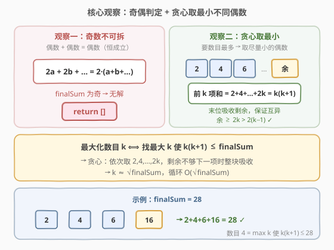
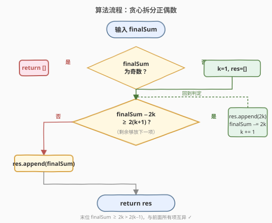
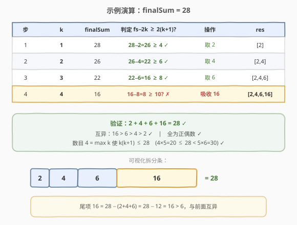

# 拆分成最多数目的正偶数之和

- **题目名称**：拆分成最多数目的正偶数之和
- **链接**：[2178. 拆分成最多数目的正偶数之和](https://leetcode.cn/problems/maximum-split-of-positive-even-integers/)
- **难度**：中等
- **标签**：贪心、数学

## 1. 题目概述

给你一个整数 `finalSum`。请你将它拆分成若干个**互不相同**的**正偶数**之和，且拆分出来的正偶数**数目最多**。

- 例如 `finalSum = 12`，合法拆分有 `(2+10)`、`(2+4+6)`、`(4+8)`，其中 `(2+4+6)` 含最多数目的整数，返回 `[2,4,6]`。
- 注意 `(2+2+4+4)` 不合法——拆分出的整数必须**互不相同**。

返回一个整数数组表示最优拆分；若无法拆分则返回**空数组**。顺序任意。

**示例 1**：

```text
输入：finalSum = 12
输出：[2,4,6]
解释：(2+4+6) 含最多数目的整数，数目为 3。
```

**示例 2**：

```text
输入：finalSum = 7
输出：[]
解释：没有办法将 7 拆分成偶数之和。
```

**示例 3**：

```text
输入：finalSum = 28
输出：[6,8,2,12]
解释：(6+8+2+12) 有最多数目的整数，数目为 4。
[10,2,4,12] 等也都可行。
```

**约束条件**：

- $1 \le \text{finalSum} \le 10^{10}$

> 💡 题眼有两层：① **奇偶判定**——若干偶数之和恒为偶数，故 `finalSum` 为奇数直接返回空；② **最大化数目**——要数目最多，就应让每个偶数尽量小，而「互不相同」约束了最小可取序列恰是 $2, 4, 6, \ldots, 2k$。这两层观察一结合，贪心策略自然浮现：从小到大依次取 $2, 4, 6, \ldots$，取不动时把剩余值整块塞给末位。

---

## 2. 解题思路

### 2.1 暴力思路：枚举拆分方案

可以枚举所有「互不相同的正偶数」组合，检查和是否等于 `finalSum`，记录数目最大的方案。但组合数随 `finalSum` 指数膨胀——`finalSum` 可达 $10^{10}$，可取偶数至多 $5 \times 10^9$ 个，子集枚举完全不可行。

> 💡 暴力法没有利用「最大化数目 ⟺ 取尽量小的偶数」这一单调结构。一旦意识到「互不相同的正偶数」的最小序列是固定的 $2,4,6,\ldots,2k$，就能把搜索问题转化为贪心构造。

### 2.2 核心观察：奇偶筛 + 贪心取最小不同偶数



**观察一：奇数不可拆**

任意偶数可写为 $2a$，若干偶数之和为 $2(a_1 + a_2 + \cdots) = 2S$，必为偶数。因此：

- `finalSum` 为**奇数** → 无解，返回 `[]`；
- `finalSum` 为**偶数** → 必有解（至少 `[finalSum]` 本身合法）。

**观察二：互异正偶数的最小序列**

要使数目最多，每个偶数应**尽量小**；而「互不相同」要求它们至少是 $2, 4, 6, \ldots, 2k$（前 $k$ 个互异正偶数）。其前缀和为：

$$
2 + 4 + 6 + \cdots + 2k = 2(1+2+\cdots+k) = k(k+1)
$$

因此**最大可能数目** $k$ 满足 $k(k+1) \le \text{finalSum}$。

**观察三：贪心构造——末位吸收剩余**

直接取 $2, 4, 6, \ldots, 2(k-1)$ 作为前 $k-1$ 项，末项 = $\text{finalSum} - (k-1)k$ 吸收全部剩余。需验证末项与前面互异：

- 末项 $= \text{finalSum} - (k-1)k$。由 $k$ 的最大性有 $\text{finalSum} < (k+1)(k+2) = k^2+3k+2$，又 $\text{finalSum} \ge k(k+1) = k^2+k$；
- 末项 $\ge (k^2+k) - (k^2-k) = 2k > 2(k-1)$，严格大于倒数第二项，故与所有前项互异 ✓；
- 末项为偶（偶数减偶数），且 $> 0$ ✓。

> 💡 **贪心准则**：依次尝试取 $2k$（$k=1,2,\ldots$），只要取走 $2k$ 后剩余 $\ge 2(k+1)$（还能放下一个更大的互异偶数）就取；否则停止，把剩余整块作为末项。这样得到的数目恰为最大的 $k$。

### 2.3 算法流程图



算法步骤总结：

1. **奇偶筛**：若 `finalSum` 为奇数，返回 `[]`。
2. **初始化**：`k = 1`，结果数组 `res = []`。
3. **贪心循环**：只要 $\text{finalSum} - 2k \ge 2(k+1)$：
   - 将 $2k$ 加入 `res`；
   - `finalSum -= 2k`；
   - `k += 1`。
4. **末位吸收**：把剩余 `finalSum` 加入 `res`，返回。

> 💡 循环条件 `finalSum - 2k >= 2(k+1)` 的含义是「取走 $2k$ 后，剩余仍足够放下一个比 $2k$ 更大的偶数 $2(k+1)$」——这保证末位不会与已取项重复。条件不满足时，剩余值 $< 4k+2$ 但 $\ge 2k$（由上一轮条件保证），作为末项 $> 2(k-1)$，互异成立。

### 2.4 示例演算

以 `finalSum = 28` 为例：



| 步 | k | finalSum | 判定 `fs−2k ≥ 2(k+1)` | 操作 | res |
|----|---|----------|------------------------|------|-----|
| 1 | 1 | 28 | $28-2=26 \ge 4$ ✓ | 取 2 | `[2]` |
| 2 | 2 | 26 | $26-4=22 \ge 6$ ✓ | 取 4 | `[2,4]` |
| 3 | 3 | 22 | $22-6=16 \ge 8$ ✓ | 取 6 | `[2,4,6]` |
| 4 | 4 | 16 | $16-8=8 \ge 10$ ✗ | 吸收 16 | `[2,4,6,16]` |

- 第 1~3 步：剩余足够放下一个更大的偶数，依次取 2、4、6；
- 第 4 步：$16-8=8 < 10$，剩余不够再放 $2\times5=10$，停止循环，把剩余 16 整块作为末项。

验证：$2+4+6+16 = 28$ ✓；互异 $16>6>4>2$ ✓；全为正偶数 ✓。数目 4 = 最大 $k$ 使 $k(k+1)\le 28$（$4\times5=20\le28<5\times6=30$）✓。

> ⚠️ 题目示例输出 `[6,8,2,12]` 与本解 `[2,4,6,16]` 不同——两者数目都是 4、和都是 28、均互异且为正偶数，题目允许任意顺序，故均为正确解。贪心解的特点是前 $k-1$ 项恰为 $2,4,\ldots,2(k-1)$，末项吸收剩余，构造最简单、可证明最优。

再看 **示例 1** `finalSum = 12`：
- $k=1$：$12-2=10 \ge 4$ ✓，取 2，`fs=10`；
- $k=2$：$10-4=6 \ge 6$ ✓，取 4，`fs=6`；
- $k=3$：$6-6=0 \ge 8$ ✗，吸收 6 → `[2,4,6]` ✓。

**示例 2** `finalSum = 7`：奇数，直接返回 `[]`。

---

## 3. 参考代码

### C++

```cpp
class Solution {
public:
    vector<long long> maximumEvenSplit(long long finalSum) {
        if (finalSum % 2 != 0) return {};          // 奇数无解

        vector<long long> res;
        long long k = 1;
        while (finalSum - 2 * k >= 2 * (k + 1)) {   // 取 2k 后仍能放下一个更大的偶数
            res.push_back(2 * k);
            finalSum -= 2 * k;
            ++k;
        }
        res.push_back(finalSum);                    // 末位吸收剩余
        return res;
    }
};
```

### Python

```python
class Solution:
    def maximumEvenSplit(self, finalSum: int) -> List[int]:
        if finalSum % 2 != 0:
            return []                               # 奇数无解

        res = []
        k = 1
        while finalSum - 2 * k >= 2 * (k + 1):      # 取 2k 后仍能放下一个更大的偶数
            res.append(2 * k)
            finalSum -= 2 * k
            k += 1
        res.append(finalSum)                        # 末位吸收剩余
        return res
```

> ⚠️ **类型陷阱**：`finalSum` 可达 $10^{10}$，超过 32 位 `int` 上界（约 $2.1\times10^9$）。C++ 必须用 `long long`；Python 整数无上限无需处理，但 LC Python 签名若标注 `int` 也兼容大数。

> 💡 **循环条件等价改写**：`finalSum - 2k >= 2(k+1)` 等价于 `finalSum >= 2k + 2k + 2 = 4k + 2`，也等价于 `finalSum >= (k+1)(k+2) - k(k+1) + k(k+1)`... 直观记忆为「剩余够再放一项」即可。也可写成 `while finalSum > 2 * (k + 1):` 后再判断，但当前写法最贴合「取走后仍够」的语义。

### Python（O(1) 求 k 的数学版）

```python
import math

class Solution:
    def maximumEvenSplit(self, finalSum: int) -> List[int]:
        if finalSum % 2 != 0:
            return []

        # 最大 k 使 k(k+1) <= finalSum
        k = (int(math.isqrt(4 * finalSum)) - 1) // 2
        while (k + 1) * (k + 2) <= finalSum:   # 校正浮点误差
            k += 1
        while k * (k + 1) > finalSum:
            k -= 1

        res = [2 * i for i in range(1, k)]      # 2, 4, ..., 2(k-1)
        res.append(finalSum - (k - 1) * k)      # 末位吸收剩余
        return res
```

> 💡 此版用求根公式 $k = \lfloor(\sqrt{4\cdot\text{finalSum}}-1)/2\rfloor$ 直接算出最大 $k$，再用两次微调消除整数平方根的边界误差。构造列表仍需 $O(k)$，故总体复杂度不变，但循环次数从 $O(\sqrt{\text{finalSum}})$ 降为 $O(1)$（不含列表构造）。仅作思路展示，面试用贪心循环版即可。

---

## 4. 复杂度分析

| 维度 | 复杂度 | 说明 |
|------|--------|------|
| **时间复杂度** | $O(\sqrt{\text{finalSum}})$ | 循环次数即最大 $k$，由 $k(k+1) \le \text{finalSum}$ 得 $k \approx \sqrt{\text{finalSum}}$。$\text{finalSum}=10^{10}$ 时 $k\approx 10^5$，毫秒级 |
| **空间复杂度** | $O(\sqrt{\text{finalSum}})$ | 结果数组存 $k$ 个元素（不计输出则为 $O(1)$） |

> 💡 $10^{10}$ 的输入规模排除了 $O(\text{finalSum})$ 的逐位模拟；而 $O(\sqrt{\text{finalSum}})\approx 10^5$ 恰在甜区——既不需要二分/数学求根加速，也不会超时。这种「约束定算法」的甜区感是本题的设计意图。

---

## 5. 扩展：为何贪心取最小序列一定最优？

这是一个值得深挖的**交换论证**问题。

**命题**：在所有「互异正偶数之和 = `finalSum`」的拆分中，元素数目最大的方案，其前 $k-1$ 个最小元素可取为 $2, 4, \ldots, 2(k-1)$。

**证明思路**：

1. **数目上界**：$m$ 个互异正偶数之和 $\ge 2+4+\cdots+2m = m(m+1)$。故 $m \le \max\{k : k(k+1) \le \text{finalSum}\}$。这是任何方案都跨不过的天花板。

2. **构造可达**：取 $2, 4, \ldots, 2(k-1)$ 加末项 $\text{finalSum}-(k-1)k$，由第 2.2 节观察三知末项 $>2(k-1)$ 且为偶，故这 $k$ 个数互异且和为 `finalSum`，恰好达到上界。

3. **交换论证**：设某最优方案 $S$ 的元素升序为 $a_1 < a_2 < \cdots < a_m$（$m=k$），但 $a_1 \ne 2$ 或某 $a_i \ne 2i$。若 $a_i > 2i$，把 $a_i$ 替换为 $2i$ 可减小总和而不破坏互异性（因 $2i < 2(i+1) \le a_{i+1}$）。逐位「下压」到 $2, 4, \ldots, 2(k-1)$ 后，多出的差额全部累加到末项，末项只增不减仍 $>2(k-1)$，互异性保持。故存在一个「前 $k-1$ 项恰为 $2,4,\ldots,2(k-1)$」的最优方案——这正是贪心构造的方案。

> 💡 **方法论**：「最大化元素数目」类拆分题的通用范式是——先求**最小序列前缀和**定上界，再**贪心取最小 + 末位吸收**构造达到上界的方案。本范式还见于 [829. 连续整数求和](../0801-0900/829_连续整数求和.md)（拆成连续正整数之和）等题。

---

## 6. 面试要点

1. **为什么奇数一定无解？**

   - 若干偶数之和 $= 2(a_1+a_2+\cdots) = 2S$，必为偶数。`finalSum` 为奇数时不可能由偶数相加得到，故返回 `[]`。这是 $O(1)$ 的剪枝，必须最先判断。

2. **贪心为什么取 $2, 4, 6, \ldots$ 而不是别的偶数？**

   - 要最大化数目，每个元素应尽量小；「互不相同」约束下最小的 $k$ 个正偶数恰是 $2, 4, \ldots, 2k$。取任何更大的偶数只会让前缀和更大、能容纳的数目更少。交换论证（第 5 节）证明存在前缀恰为该序列的最优解。

3. **循环条件 `finalSum - 2k >= 2(k+1)` 的含义？能否换写？**

   - 含义是「取走 $2k$ 后，剩余仍 $\ge$ 下一个互异偶数 $2(k+1)$」，确保末位不会与前项重复。等价于 `finalSum >= 4k+2`。若漏掉此条件直接取 $2k$，可能出现末项 $= 2k$ 与倒数第二项重复（如 `finalSum=6` 时错误取 `[2,4]` 后剩余 0 无法收尾）。

4. **末位吸收的剩余值为什么一定与前面互异？**

   - 循环退出时，上一轮的条件保证剩余 $\ge 2k$；本轮条件不满足保证剩余 $< 4k+2$。故 $2k \le \text{剩余} < 4k+2$，而最后取走的项是 $2(k-1)$，剩余 $\ge 2k > 2(k-1)$，严格大于所有已取项。且剩余为偶（偶减偶）、$>0$，合法。

5. **`finalSum = 10^10` 会不会超时/溢出？**

   - 循环次数 $\approx \sqrt{10^{10}} = 10^5$，毫秒级，不超时。但 $10^{10} > 2^{31}-1 \approx 2.1\times10^9$，C++ 必须用 `long long`，否则溢出导致奇偶判定和减法全部出错。Python 大整数无此问题。

6. **和 [829. 连续整数求和](../0801-0900/829_连续整数求和.md) 的异同？**

   - 829 拆成**连续正整数**之和（步长 1），2178 拆成**互异正偶数**之和（步长 2、公比 2）。两者都用「最小序列前缀和定上界 + 构造/枚举」的范式。差异在于 829 的元素是 $a, a+1, \ldots$ 起点不固定，需枚举起点或用等差数列求和反解；2178 的最小序列起点固定为 2，贪心构造即可，更简单。

> 💡 **一句话总结**：2178 是「**贪心拆分**」的招牌题——奇偶筛 + 取最小互异偶数序列 + 末位吸收，三步到位；上界由 $k(k+1)\le\text{finalSum}$ 钉死，构造自然达到上界，无需搜索。

---

## 7. 同类练习题

- [829. 连续整数求和](https://leetcode.cn/problems/consecutive-numbers-sum/)（[站内题解](../0801-0900/829_连续整数求和.md)）：拆成连续正整数之和最大化数目，同为「最小序列前缀和定上界」范式，起点不固定需反解等差求和
- [343. 整数拆分](https://leetcode.cn/problems/integer-break/)（[站内题解](../0301-0400/343_整数拆分.md)）：拆整数使乘积最大，切分型 DP + 贪心切成 3，与本题「拆整数」主题对照（一个最大化数目、一个最大化乘积）
- [254. 因子的组合](https://leetcode.cn/problems/factor-combinations/)（[站内题解](../0201-0300/254_因子的组合.md)）：拆成因子之积，回溯 + 非递减因子去重，是 2178 在「乘法域」的镜像题
- [2139. 得到目标值的最小移动次数](https://leetcode.cn/problems/minimum-moves-to-reach-target-score/)（[站内题解](../2101-2200/2139_得到目标值的最小移动次数.md)）：贪心 + 数学，反向从大数消耗稀缺操作，与本题「把稀缺资源（剩余值）留给末位」的贪心直觉相通
- [1806. 还原排列的最少操作步数](https://leetcode.cn/problems/minimum-number-of-operations-to-reinitialize-a-permutation/)：贪心 + 模拟，同为中等数学题，体会「约束甜区决定算法复杂度」的思路
