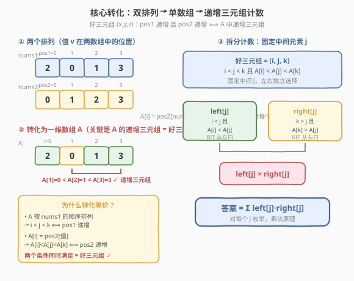
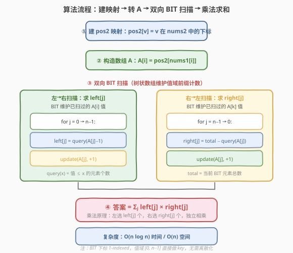

# LeetCode 统计数组中好三元组数目 题解

## 1. 题目概述

- **标题 / 题号**：统计数组中好三元组数目（#2179，hard）
- **链接**：https://leetcode.cn/problems/count-good-triplets-in-an-array/
- **难度**：困难
- **标签**：树状数组、数组、排序

**题意**：给你两个下标从 **0** 开始且长度为 `n` 的整数数组 `nums1` 和 `nums2`，两者都是 `[0, 1, ..., n - 1]` 的**排列**。

**好三元组**指的是 `3` 个**互不相同**的值，且它们在数组 `nums1` 和 `nums2` 中出现顺序保持一致。换句话说，如果我们将 `pos1v` 记为值 `v` 在 `nums1` 中出现的位置，`pos2v` 为值 `v` 在 `nums2` 中的位置，那么一个好三元组定义为 `0 <= x, y, z <= n - 1`，且 `pos1x < pos1y < pos1z` 和 `pos2x < pos2y < pos2z` 都成立的 `(x, y, z)`。

请你返回好三元组的**总数目**。

**示例 1**：

```text
输入：nums1 = [2,0,1,3], nums2 = [0,1,2,3]
输出：1
解释：总共有 4 个三元组 (x,y,z) 满足 pos1x < pos1y < pos1z，分别是 (2,0,1)、(2,0,3)、(2,1,3) 和 (0,1,3)。
这些三元组中，只有 (0,1,3) 满足 pos2x < pos2y < pos2z。所以只有 1 个好三元组。
```

**示例 2**：

```text
输入：nums1 = [4,0,1,3,2], nums2 = [4,1,0,2,3]
输出：4
解释：总共有 4 个好三元组 (4,0,3)、(4,0,2)、(4,1,3) 和 (4,1,2)。
```

**约束**：

- $n == \text{nums1.length} == \text{nums2.length}$
- $3 \le n \le 10^5$
- $0 \le \text{nums1[i]}, \text{nums2[i]} \le n - 1$
- `nums1` 和 `nums2` 是 `[0, 1, ..., n - 1]` 的排列。

> 💡 题眼在于「两个排列」这个条件。排列意味着每个值在两个数组中各恰好出现一次，因此每个值 $v$ 唯一对应一个位置对 $(pos1[v], pos2[v])$。好三元组要求三个值在**两个数组中同时保持递增顺序**——这等价于在一个转化后的一维数组中找**递增三元组**，从而把二维约束降为一维问题。

## 2. 解题思路

### 2.1 暴力思路：枚举所有三元组

最直接的做法是枚举所有 $\binom{n}{3}$ 个三元组 $(x, y, z)$，对每个三元组检查 `pos1` 和 `pos2` 是否同时递增。

- 枚举 $O(n^3)$ 个组合，每组验证 $O(1)$，总时间 $O(n^3)$。
- 当 $n = 10^5$ 时，$\binom{10^5}{3} \approx 1.67 \times 10^{14}$，完全不可行。

> 💡 暴力法没有利用「排列」的结构。关键观察是：每个值 $v$ 唯一对应一个位置对 $(pos1[v], pos2[v])$，而好三元组要求这两个维度同时递增。如果能**把两个维度压缩成一个维度**，问题就变成了经典的一维递增三元组计数。

### 2.2 核心观察：双排列转化 + 树状数组计数



**观察一：按 nums1 顺序重排，把 pos2 编码进一个数组**

定义数组 $A$：按 `nums1` 的顺序遍历，对位置 $i$ 上的值 $v = \text{nums1}[i]$，令 $A[i] = \text{pos2}[v]$。

由于 `nums1` 是排列，每个值恰好出现一次，所以 $A$ 是 $\{0, 1, \ldots, n-1\}$ 的一个排列。

**观察二：好三元组 ⟺ A 中的递增三元组**

取三个值 $x, y, z$，设它们在 `nums1` 中的位置为 $i_x < i_y < i_z$（即 $pos1$ 递增）。则：

$$A[i_x] = pos2[x], \quad A[i_y] = pos2[y], \quad A[i_z] = pos2[z]$$

好三元组要求 $pos2[x] < pos2[y] < pos2[z]$，等价于 $A[i_x] < A[i_y] < A[i_z]$。

因此：**好三元组 = $A$ 中下标递增且值也递增的三元组**。

**观察三：固定中间元素，左右独立计数**

对 $A$ 中每个位置 $j$（作为三元组的中间元素），定义：

- $\text{left}[j]$ = 满足 $i < j$ 且 $A[i] < A[j]$ 的位置 $i$ 的个数；
- $\text{right}[j]$ = 满足 $k > j$ 且 $A[k] > A[j]$ 的位置 $k$ 的个数。

由**乘法原理**，以 $j$ 为中间元素的好三元组数为 $\text{left}[j] \times \text{right}[j]$。对所有 $j$ 求和即为答案：

$$\text{答案} = \sum_{j=0}^{n-1} \text{left}[j] \times \text{right}[j]$$

**观察四：树状数组 O(n log n) 求左/右计数**

$\text{left}[j]$ 的本质是：在 $A[0..j-1]$ 中，值小于 $A[j]$ 的元素个数。这正是**树状数组（BIT）维护值域前缀计数**的经典场景：

- **左扫描**：从左到右遍历 $A$，BIT 维护已扫过值的频率。对每个 $j$，$\text{left}[j] = \text{query}(A[j] - 1)$（查询值域 $[0, A[j]-1]$ 的计数），然后将 $A[j]$ 插入 BIT。
- **右扫描**：从右到左遍历 $A$，BIT 维护右侧已扫过值的频率。对每个 $j$，$\text{right}[j] = \text{total} - \text{query}(A[j])$（总数减去值域 $[0, A[j]]$ 的计数，即值 $> A[j]$ 的个数），然后将 $A[j]$ 插入 BIT。

> ⚠️ 由于 $A$ 是 $[0, n-1]$ 的排列，值域恰好为 $[0, n-1]$，BIT 的下标范围就是 $[1, n]$（1-indexed），**无需离散化**。

### 2.3 算法流程图



算法步骤总结：

1. **建 pos2 映射**：遍历 `nums2`，记录每个值的位置 `pos2[v]`。
2. **构造数组 A**：遍历 `nums1`，令 $A[i] = \text{pos2}[\text{nums1}[i]]$。
3. **左→右 BIT 扫描**：对每个 $j$，查询 $\text{query}(A[j]-1)$ 得 $\text{left}[j]$，然后 $\text{update}(A[j])$。
4. **右→左 BIT 扫描**：清空 BIT，对每个 $j$，查询 $\text{total} - \text{query}(A[j])$ 得 $\text{right}[j]$，然后 $\text{update}(A[j])$。
5. **求和**：返回 $\sum_j \text{left}[j] \times \text{right}[j]$。

### 2.4 示例演算

以 `nums1 = [2, 0, 1, 3]`, `nums2 = [0, 1, 2, 3]` 为例：

![示例演算：[2,0,1,3], [0,1,2,3]](../images/2179_example_walkthrough.svg)

| 步骤 | 内容 | 结果 |
|------|------|------|
| ① 建 pos2 | `pos2[0]=0, pos2[1]=1, pos2[2]=2, pos2[3]=3` | nums2 本身有序 |
| ② 构造 A | $A[0]=\text{pos2}[2]=2,\ A[1]=\text{pos2}[0]=0,\ A[2]=\text{pos2}[1]=1,\ A[3]=\text{pos2}[3]=3$ | $A = [2, 0, 1, 3]$ |
| ③ 左扫描 | $j=0$: query(1)=0 → left[0]=0；$j=1$: query(-1)=0 → left[1]=0；$j=2$: query(0)=1 → left[2]=1；$j=3$: query(2)=3 → left[3]=3 | left = [0, 0, 1, 3] |
| ④ 右扫描 | $j=3$: 0−0=0 → right[3]=0；$j=2$: 1−0=1 → right[2]=1；$j=1$: 2−0=2 → right[1]=2；$j=0$: 3−2=1 → right[0]=1 | right = [1, 2, 1, 0] |
| ⑤ 求和 | $0{\times}1 + 0{\times}2 + 1{\times}1 + 3{\times}0 = 0+0+1+0$ | 答案 = $\mathbf{1}$ ✓ |

唯一的好三元组对应 $j=2$（中间元素 $A[2]=1$，即值 1）：左侧选 $A[1]=0$（值 0），右侧选 $A[3]=3$（值 3），即 $(0, 1, 3)$。

## 3. 参考代码

### C++

```cpp
class Solution {
  public:
    long long goodTriplets(vector<int>& nums1, vector<int>& nums2) {
        int n = nums1.size();
        vector<int> pos2(n);
        for (int i = 0; i < n; ++i)
            pos2[nums2[i]] = i;

        vector<int> A(n);
        for (int i = 0; i < n; ++i)
            A[i] = pos2[nums1[i]];

        vector<int> bit(n + 1, 0);
        auto update = [&](int i) {
            for (++i; i <= n; i += i & (-i))
                bit[i]++;
        };
        auto query = [&](int i) -> int {
            int s = 0;
            for (++i; i > 0; i -= i & (-i))
                s += bit[i];
            return s;
        };

        vector<long long> left(n, 0);
        for (int j = 0; j < n; ++j) {
            left[j] = query(A[j] - 1);
            update(A[j]);
        }

        fill(bit.begin(), bit.end(), 0);
        vector<long long> right(n, 0);
        for (int j = n - 1; j >= 0; --j) {
            right[j] = query(n - 1) - query(A[j]);
            update(A[j]);
        }

        long long ans = 0;
        for (int j = 0; j < n; ++j)
            ans += left[j] * right[j];
        return ans;
    }
};
```

### Python

```python
class Solution:
    def goodTriplets(self, nums1: List[int], nums2: List[int]) -> int:
        n = len(nums1)
        pos2 = [0] * n
        for i, v in enumerate(nums2):
            pos2[v] = i

        A = [pos2[v] for v in nums1]

        bit = [0] * (n + 1)

        def update(i):
            i += 1
            while i <= n:
                bit[i] += 1
                i += i & (-i)

        def query(i):
            i += 1
            s = 0
            while i > 0:
                s += bit[i]
                i -= i & (-i)
            return s

        left = [0] * n
        for j in range(n):
            left[j] = query(A[j] - 1)
            update(A[j])

        for i in range(n + 1):
            bit[i] = 0

        right = [0] * n
        for j in range(n - 1, -1, -1):
            right[j] = query(n - 1) - query(A[j])
            update(A[j])

        return sum(l * r for l, r in zip(left, right))
```

> ⚠️ **注意溢出**：$n = 10^5$ 时，单个 $\text{left}[j] \times \text{right}[j]$ 最大可达 $\sim 2.5 \times 10^9$，总和可达 $\sim 10^{14}$，C++ 中必须用 `long long`，Python 天然支持大整数无需担心。`query(A[j] - 1)` 当 $A[j] = 0$ 时传入 $-1$，由于 BIT 是 1-indexed，`++i` 后为 0，循环不执行，返回 0，无需特判。

## 4. 复杂度分析

| 维度 | 复杂度 | 说明 |
|------|--------|------|
| 时间复杂度 | $O(n \log n)$ | 建 pos2 映射 $O(n)$；构造 A $O(n)$；两次 BIT 扫描各 $n$ 次 update + query，每次 $O(\log n)$；求和 $O(n)$ |
| 空间复杂度 | $O(n)$ | pos2 数组 $O(n)$、A 数组 $O(n)$、BIT $O(n)$、left/right 数组各 $O(n)$ |

> 💡 本题能直接用值域 $[0, n-1]$ 作 BIT 下标，无需离散化，得益于「排列」性质——$A$ 的值域恰好是连续的 $[0, n-1]$。若值域更大或稀疏，则需要先离散化。

## 5. 扩展：与逆序对计数的关系

本题本质上是 [315. 计算右侧小于当前元素的个数](../0301-0400/315_计算右侧小于当前元素的个数.md) 的**三维推广**：

- **315 题**：对每个位置 $j$，统计右侧比 $A[j]$ 小的元素个数（一维：右侧）。
- **2179 题**：对每个位置 $j$，统计**左侧比 $A[j]$ 小**的个数 $\times$ **右侧比 $A[j]$ 大**的个数（二维：左侧 + 右侧）。

更一般地，这类问题可以推广到 $k$ 维——统计 $k$ 元组使得 $k$ 个维度同时递增。解法是：

1. 选一个维度排序（固定顺序），其余 $k-1$ 维转化为「递增子序列」问题。
2. 对 $k = 3$（三元组），固定中间元素后左右各做一次 BIT 扫描。
3. 对 $k = 4$+（四元组及以上），可以用 CDQ 分治或嵌套 BIT，复杂度 $O(n \log^{k-2} n)$。

> 💡 另一个角度：本题也等价于求 $A$ 的「长度为 3 的递增子序列」的总数。[300. 最长递增子序列](../0301-0400/300_最长递增子序列.md) 求的是最长长度，而本题求的是长度恰为 3 的递增子序列的**个数**。统计个数时，固定中间元素 + 乘法原理是最直接的套路。

## 6. 面试要点

1. **为什么能把两个数组的约束压缩到一个数组？**

   - 因为 `nums1` 和 `nums2` 都是排列，每个值 $v$ 在两个数组中各出现一次，唯一对应位置对 $(pos1[v], pos2[v])$。按 `nums1` 的顺序排列所有值，则下标天然满足 $pos1$ 递增，只需再让 $pos2$ 递增即可——把 $pos2$ 编码进数组 $A$，问题变成「$A$ 的递增三元组计数」。

2. **为什么固定中间元素 $j$ 后可以独立相乘？**

   - 选定 $j$ 后，左侧的 $i$ 和右侧的 $k$ 互不影响：$i$ 只需满足 $i < j$ 且 $A[i] < A[j]$，$k$ 只需满足 $k > j$ 且 $A[k] > A[j]$。任意合法的 $i$ 和合法的 $k$ 组合都构成一个好三元组，因此用乘法原理 $\text{left}[j] \times \text{right}[j]$。

3. **BIT 的 query(A[j]-1) 当 A[j]=0 时怎么办？**

   - BIT 是 1-indexed，传入 $-1$ 后 `++i` 变为 $0$，while 循环条件 `i > 0` 不满足，直接返回 $0$。无需特判。这也是 1-indexed BIT 的天然优势。

4. **为什么不需要离散化？**

   - $A$ 是 $[0, n-1]$ 的排列，值域恰好是 $[0, n-1]$，与下标范围一致。BIT 数组大小 $n+1$ 即可覆盖。若值域更大（如 $10^9$），则需要先排序去重做离散化映射。

5. **和 315 题的区别与联系？**

   - 315 题只统计右侧比当前小的个数（单向一维），用一次 BIT 扫描即可。2179 题需要同时考虑左侧（比当前小）和右侧（比当前大），用两次 BIT 扫描 + 乘法。两者都是「树状数组维护值域前缀计数」的经典应用。

6. **如果题目改为四元组（同时满足 pos1 和 pos2 递增的四元组）怎么做？**

   - 固定中间两个位置 $(j_1, j_2)$ 不可行（$O(n^2)$ 对太多）。正确做法是 CDQ 分治：先按第一维排序，分治处理第二维，在合并时用 BIT 统计。复杂度 $O(n \log^2 n)$。

## 同类练习题

| # | 题目 | 与本题的关联 |
|---|------|-------------|
| 315 | [计算右侧小于当前元素的个数](https://leetcode.cn/problems/count-of-smaller-numbers-after-self/)（[题解](../0301-0400/315_计算右侧小于当前元素的个数.md)） | 单向 BIT 扫描统计右侧更小元素，2179 的「降维版」，单向一维计数 |
| 1395 | [统计作战单位数](https://leetcode.cn/problems/count-number-of-teams/)（[题解](../1301-1400/1395_统计作战单位数.md)） | 固定中间元素 + 左右计数乘法，与 2179 完全同套路，但约束更松（非排列，值可重复） |
| 300 | [最长递增子序列](https://leetcode.cn/problems/longest-increasing-subsequence/)（[题解](../0301-0400/300_最长递增子序列.md)） | 求 LIS 长度，2179 是其「统计长度为 3 的递增子序列个数」的变体 |
| 719 | [找出第 K 小的数对距离](https://leetcode.cn/problems/find-k-th-smallest-pair-distance/)（[题解](../0701-0800/719_找出第K小的数对距离.md)） | 二分答案 + 双指针计数，同为排序后利用有序性计数的思路 |
| 493 | [翻转对](https://leetcode.cn/problems/reverse-pairs/) | 归并排序 / BIT 统计逆序对变体，与 2179 的 BIT 值域计数手法一脉相承 |
