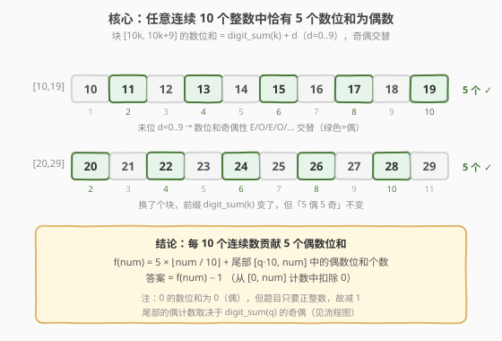
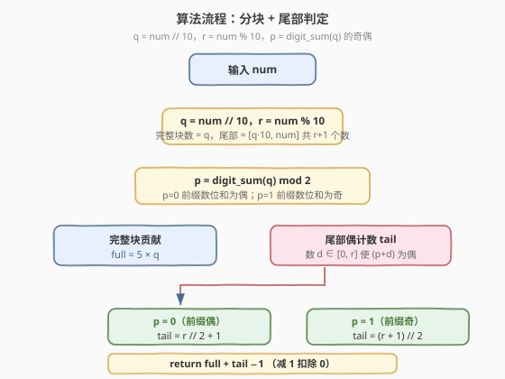
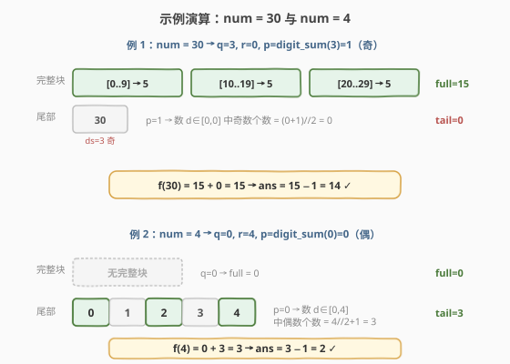

# LeetCode 统计各位数字之和为偶数的整数个数 题解

## 1. 题目概述

- **标题 / 题号**：统计各位数字之和为偶数的整数个数（#2180，easy）
- **链接**：https://leetcode.cn/problems/count-integers-with-even-digit-sum/
- **难度**：简单
- **标签**：数学、数位

**题意**：给你一个正整数 `num`，请你统计并返回 **小于或等于** `num` 且各位数字之和为 **偶数** 的正整数的数目。

正整数的 **各位数字之和** 是其所有位上的对应数字相加的结果。

**示例 1**：

```text
输入：num = 4
输出：2
解释：只有 2 和 4 满足小于等于 4 且各位数字之和为偶数。
```

**示例 2**：

```text
输入：num = 30
输出：14
解释：只有 14 个整数满足小于等于 30 且各位数字之和为偶数，分别是：
2、4、6、8、11、13、15、17、19、20、22、24、26 和 28。
```

**约束**：

- $1 \le \text{num} \le 1000$

> 💡 本题约束小到 $1000$，暴力枚举 $1$ 到 $\text{num}$ 逐个求数位和即可过。但它的内核是一个**数位周期性**问题——任意连续 10 个整数里恰有 5 个数位和为偶数。看出这一点，就能把 $O(\text{num})$ 压成 $O(\log \text{num})$，且思路可推广到更大的约束。

## 2. 解题思路

### 2.1 暴力思路：逐个数位求和

最直白的做法：从 $1$ 枚举到 $\text{num}$，对每个数 $n$ 把各位数字相加得到 $s(n)$，若 $s(n)$ 为偶数则计数加一。

```text
ans = 0
for n in 1..num:
    s = 0
    while n > 0:
        s += n % 10
        n //= 10
    if s % 2 == 0:
        ans += 1
return ans
```

$\text{num} \le 1000$ 时最多 $1000$ 次循环，每次数位求和至多 $4$ 位，总操作约 $4000$ 次，轻松通过。但若约束放大到 $10^9$ 甚至 $10^{18}$，这种线性枚举立刻不可行。

> ⚠️ 暴力能过 ≠ 该题的「最优解法」。面试中若只给暴力，会被追问「能不能做到与 $\text{num}$ 大小无关」。关键观察：**数位和的奇偶性在每 10 个连续整数中呈现完美的 5 偶 5 奇分布**——这是一条与进制结构同源的周期性。

### 2.2 核心观察：每 10 个连续整数恰有 5 个数位和为偶数



**观察：把整数按末位分成 10 个一组。**

考虑任意一个「十进制块」 $[10k,\, 10k+9]$（即前缀 $k$ 固定、末位 $d$ 从 $0$ 取到 $9$ 的 10 个连续整数）。块内每个数的数位和为：

$$
s(10k + d) = s(k) + d, \qquad d = 0, 1, \dots, 9
$$

其中 $s(k)$ 是前缀 $k$ 的数位和，**在整个块内是常数**。当 $d$ 从 $0$ 跑到 $9$ 时，$s(k)+d$ 的奇偶性按「偶、奇、偶、奇、……」严格交替，恰好出现 **5 个偶、5 个奇**。

> 💡 **与 $k$ 无关**：这个「5 偶 5 奇」的结论**不依赖前缀 $k$ 的具体值**——无论 $s(k)$ 本身是偶是奇，$d$ 跑过 $0..9$ 都会给出 5 个偶、5 个奇（只是偶数落点的 $d$ 不同）。正因如此，每一个完整的 10 数块都贡献恰好 5 个偶数位和的数。

**计数转换**：题目要的是 $[1, \text{num}]$ 中的正整数计数。为方便用「整块」公式，先算 $[0, \text{num}]$ 中的偶数位和计数 $f(\text{num})$（$0$ 的数位和为 $0$，是偶数），再减去 $1$ 扣除 $0$：

$$
\text{ans} = f(\text{num}) - 1
$$

设 $q = \lfloor \text{num}/10 \rfloor$，$r = \text{num} \bmod 10$。则：

- **完整块** $[0,9], [10,19], \dots, [10(q-1),\,10q-1]$ 共 $q$ 个，每个贡献 5 → 合计 $5q$。
- **尾部** $[10q,\, \text{num}] = [10q,\, 10q+r]$ 共 $r+1$ 个数，数位和 $= s(q) + d$，$d \in [0, r]$。

尾部中偶数位和的个数，取决于 $p = s(q) \bmod 2$（前缀数位和的奇偶）：

- $p = 0$（前缀偶）：需 $d$ 为偶，$d \in [0, r]$ 中偶数个数 $= \lfloor r/2 \rfloor + 1$。
- $p = 1$（前缀奇）：需 $d$ 为奇，$d \in [0, r]$ 中奇数个数 $= \lfloor (r+1)/2 \rfloor$。

> ⚠️ 注意 $s(q)$ 只需要**奇偶性**，不需要具体值。计算 $p$ 时对 $q$ 的各位取异或即可（数位和的奇偶 = 各位奇偶的异或），$O(\log \text{num})$。

### 2.3 算法流程图



1. **分解**：$q = \text{num} // 10$，$r = \text{num} \% 10$。
2. **前缀奇偶**：$p = s(q) \bmod 2$（异或各位奇偶）。
3. **完整块**：$\text{full} = 5 \times q$。
4. **尾部**：
   - $p = 0$：$\text{tail} = r // 2 + 1$。
   - $p = 1$：$\text{tail} = (r + 1) // 2$。
5. **合成**：返回 $\text{full} + \text{tail} - 1$（减 1 扣除 $0$）。

> 💡 整个流程只涉及除法、取模、数位异或，不依赖 $\text{num}$ 的大小做线性循环，因此对 $10^{18}$ 级输入同样有效。

### 2.4 示例演算



**示例 1：$\text{num} = 30$**

$q = 3$，$r = 0$，$p = s(3) \bmod 2 = 1$（前缀数位和 $3$ 为奇）。

| 部分 | 范围 | 偶数位和个数 | 计算 |
|------|------|------------|------|
| 完整块 | $[0,9], [10,19], [20,29]$ | 15 | $5 \times 3 = 15$ |
| 尾部 | $[30, 30]$ | 0 | $p=1$ → 奇 $d$ 个数 $= (0+1)//2 = 0$ |

$f(30) = 15 + 0 = 15$，$\text{ans} = 15 - 1 = 14$ ✓

> 💡 验证：$30$ 的数位和 $= 3+0 = 3$（奇），所以尾部那唯一一个数不是偶数位和，贡献 $0$。$14$ 个偶数位和的正整数全来自三个完整块（$2,4,6,8$ + $11,13,15,17,19$ + $20,22,24,26,28$）。

**示例 2：$\text{num} = 4$**

$q = 0$，$r = 4$，$p = s(0) \bmod 2 = 0$（前缀数位和 $0$ 为偶）。

| 部分 | 范围 | 偶数位和个数 | 计算 |
|------|------|------------|------|
| 完整块 | 无 | 0 | $5 \times 0 = 0$ |
| 尾部 | $[0, 4]$ | 3 | $p=0$ → 偶 $d$ 个数 $= 4//2 + 1 = 3$（$d=0,2,4$） |

$f(4) = 0 + 3 = 3$（即 $0, 2, 4$ 三个数位和为偶），$\text{ans} = 3 - 1 = 2$ ✓（去掉 $0$，剩 $2, 4$）

> ⚠️ 别忘了最后「减 1」：尾部把 $0$ 也算进了偶数位和（$s(0)=0$ 为偶），但题目要求**正整数**，必须扣除。这是公式里最易错的边界。

**额外校验：$\text{num} = 1000$**

$q = 100$，$r = 0$，$p = s(100) \bmod 2 = (1+0+0) \bmod 2 = 1$。

- $\text{full} = 5 \times 100 = 500$。
- $\text{tail} = (0+1)//2 = 0$（$1000$ 的数位和 $= 1$，奇）。
- $\text{ans} = 500 + 0 - 1 = 499$。

与「$[0, 999]$ 共 $100$ 个完整块贡献 $500$ 个偶、$1000$ 自身为奇、扣除 $0$」的直觉一致。

## 3. 参考代码

### C++（数学分块版，推荐）

```cpp
class Solution {
  public:
    int countEven(int num) {
        int q = num / 10, r = num % 10;
        int p = 0, t = q;
        while (t) {
            p ^= (t % 10) & 1;
            t /= 10;
        }
        int full = q * 5;
        int tail = (p == 0) ? (r / 2 + 1) : ((r + 1) / 2);
        return full + tail - 1;
    }
};
```

> 💡 `p` 用异或累加各位的奇偶（`p ^= (t%10) & 1`），等价于求数位和的奇偶性但无需真正求和。`q == 0` 时循环不执行，`p = 0` 正确反映 $s(0) = 0$ 为偶。

### C++（暴力枚举版，约束下可过）

```cpp
class Solution {
  public:
    int countEven(int num) {
        int ans = 0;
        for (int n = 1; n <= num; ++n) {
            int s = 0, x = n;
            while (x) {
                s += x % 10;
                x /= 10;
            }
            if (s % 2 == 0) ++ans;
        }
        return ans;
    }
};
```

### Python（数学分块版，推荐）

```python
class Solution:
    def countEven(self, num: int) -> int:
        q, r = divmod(num, 10)
        p = 0
        t = q
        while t:
            p ^= (t % 10) & 1
            t //= 10
        full = q * 5
        tail = (r // 2 + 1) if p == 0 else ((r + 1) // 2)
        return full + tail - 1
```

### Python（暴力枚举版，对照参考）

```python
class Solution:
    def countEven(self, num: int) -> int:
        ans = 0
        for n in range(1, num + 1):
            if sum(map(int, str(n))) % 2 == 0:
                ans += 1
        return ans
```

> ⚠️ **两种写法的对比**：暴力法时间 $O(\text{num}\log\text{num})$、空间 $O(\log \text{num})$（`str(n)` 副本），$\text{num}\le 1000$ 时无压力；数学分块版时间 $O(\log\text{num})$、空间 $O(1)$，把工作量压到与 $\text{num}$ 的大小无关。面试时建议先讲清「每 10 个数 5 偶」的周期性，再给出分块版，最后提暴力法作为正确性对照。

## 4. 复杂度分析

| 维度 | 复杂度 | 说明 |
|------|--------|------|
| 时间复杂度（分块版） | $O(\log \text{num})$ | 仅需对 $q=\lfloor\text{num}/10\rfloor$ 做一次数位奇偶异或，循环次数为 $q$ 的十进制位数 |
| 时间复杂度（暴力版） | $O(\text{num}\log\text{num})$ | 枚举 $1..\text{num}$，每个数求数位和 $O(\log\text{num})$；$\text{num}\le 1000$ 时约 $4000$ 次操作 |
| 空间复杂度 | $O(1)$ | 两种写法都只用常数个变量，暴力版若用 `str(n)` 则为 $O(\log\text{num})$ 副本 |

> 💡 当约束从 $10^3$ 放大到 $10^{18}$ 时，暴力版从「轻松可过」变为「完全不可行」，而分块版依旧只需约 $18$ 次异或——这就是「看出数位周期性」的价值。

## 5. 扩展：数位和奇偶性的代数刻画

数位和 $s(n)$ 与 $n$ 之间有一条经典恒等式：

$$
n \equiv s(n) \pmod{9}
$$

这是「能被 9 整除 ⟺ 数位和能被 9 整除」判别法的来源。但本题关心的是 **模 2** 意义下的奇偶性，而 $9$ 是奇数，$n - s(n)$ 是 $9$ 的倍数（可奇可偶），所以 $n$ 的奇偶 **并不** 等于 $s(n)$ 的奇偶：

| $n$ | $s(n)$ | $n \bmod 2$ | $s(n) \bmod 2$ | 是否相等 |
|-----|--------|-------------|----------------|----------|
| 9 | 9 | 1 | 1 | ✓ |
| 10 | 1 | 0 | 1 | ✗ |
| 11 | 2 | 1 | 0 | ✗ |
| 12 | 3 | 0 | 1 | ✗ |
| 19 | 10 | 1 | 0 | ✗ |
| 20 | 2 | 0 | 0 | ✓ |

可见 $s(n) \bmod 2$ 与 $n \bmod 2$ 在十位跨块时会「翻转」，这正是「不能直接用 $\lfloor \text{num}/2 \rfloor$ 当答案」的原因（例如 $\text{num}=30$ 时 $\lfloor 30/2 \rfloor = 15 \ne 14$）。

> ⚠️ **常见错误**：有人误以为「数位和为偶的数恰好是一半」从而直接返回 `num // 2`。这对 $\text{num}=4$ 成立（$=2$），但对 $\text{num}=10$（正确答案 $4$，而 $10//2=5$）、$\text{num}=30$（正确答案 $14$，而 $30//2=15$）都错。根源在于数位和的奇偶性**不是按 $n$ 简单交替**，而是按「块内末位」交替——跨块时前缀奇偶会改变起始相位。本题的「分块 + 尾部」公式正是对这一相位变化的精确修正。

## 6. 面试要点

1. **为什么每 10 个连续整数恰有 5 个数位和为偶数？**

   - 在块 $[10k, 10k+9]$ 中，数位和 $= s(k) + d$，$d \in [0,9]$。$s(k)$ 在块内是常数，$d$ 从 $0$ 跑到 $9$ 时 $s(k)+d$ 的奇偶性严格交替（偶奇偶奇……），故恰好 5 偶 5 奇。这个结论与 $k$ 的具体值无关，只依赖「末位跑遍 0..9」。

2. **为什么最后要减 1？**

   - 公式先算了 $[0, \text{num}]$ 中的偶数位和计数 $f(\text{num})$，其中包含了 $0$（$s(0)=0$ 为偶）。但题目要求**正整数**，$0$ 不在范围内，故 $\text{ans} = f(\text{num}) - 1$。这是最易漏的边界。

3. **能不能直接返回 `num // 2`？为什么不行？**

   - 不能。数位和的奇偶性并不按 $n$ 简单交替：$n=10$ 的数位和是 $1$（奇），而 $n=11$ 的数位和是 $2$（偶）——与 $n$ 自身的奇偶相反。跨十位块时前缀 $s(k)$ 的奇偶会改变末位交替的起始相位，导致「块内 5 偶」的落点偏移。$\text{num}=30$ 时正确答案 $14$ 而 $30//2=15$，正是这个偏移的体现。

4. **如何只求 $s(q)$ 的奇偶而不真正求数位和？**

   - 数位和的奇偶 = 各位数字奇偶的异或。对 $q$ 的每一位取 `& 1` 再异或累加即可，无需把数位相加。这样既省去加法也避免大数（虽然本题 $q\le 100$ 无所谓，但思路可推广到 $10^{18}$）。

5. **公式如何推广到更大的约束（如 $\text{num} \le 10^{18}$）？**

   - 完全不变。$q = \text{num}//10$ 仍是 $O(1)$ 除法，求 $p = s(q) \bmod 2$ 只需遍历 $q$ 的各位（至多 $18$ 位），尾部判定 $O(1)$。整体 $O(\log\text{num})$，对 $10^{18}$ 也只需几十次操作。若约束再放大到「统计 $[1, 10^{100000}]$」（大整数），则需要数位 DP，但本题远未触及该上限。

## 同类练习题

| # | 题目 | 与本题的关联 |
|---|------|-------------|
| 1295 | [统计位数为偶数的数字](https://leetcode.cn/problems/find-numbers-with-even-number-of-digits/) | 另一道「数位性质计数」简单题，统计位数（而非数位和）为偶数的数，思路同源——按数位结构分类计数 |
| 1945 | [数字转化为字符串后的字符和](https://leetcode.cn/problems/sum-of-digits-of-string-after-convert/) | 反复求数位和直到单层/双层，巩固「数位和」运算的迭代视角，与本题的 $s(n)$ 定义一致 |
| 258 | [各位相加](https://leetcode.cn/problems/add-digits/) | 求数位根（反复求数位和到一位），用 $O(1)$ 的「模 9」公式刻画，与本题第 5 节的 $n \equiv s(n) \pmod 9$ 同源 |
| 2119 | [反转两次的数字](https://leetcode.cn/problems/a-number-after-a-double-reversal/)（[题解](../2101-2200/2119_反转两次的数字.md)） | 同为「数学洞察把模拟降维」的简单题，从「机械模拟两次反转」降为「只看末位是否为零」，与本题「把线性枚举降为分块公式」的降维思路一致 |
| 2169 | [得到 0 的操作数](https://leetcode.cn/problems/count-operations-to-obtain-zero/)（[题解](../2101-2200/2169_得到0的操作数.md)） | 把逐次相减的暴力模拟用「除法取商」批量压缩，与本题用「整块 5 偶」批量替代逐个判定同属「看出周期/批量结构」的范式 |
