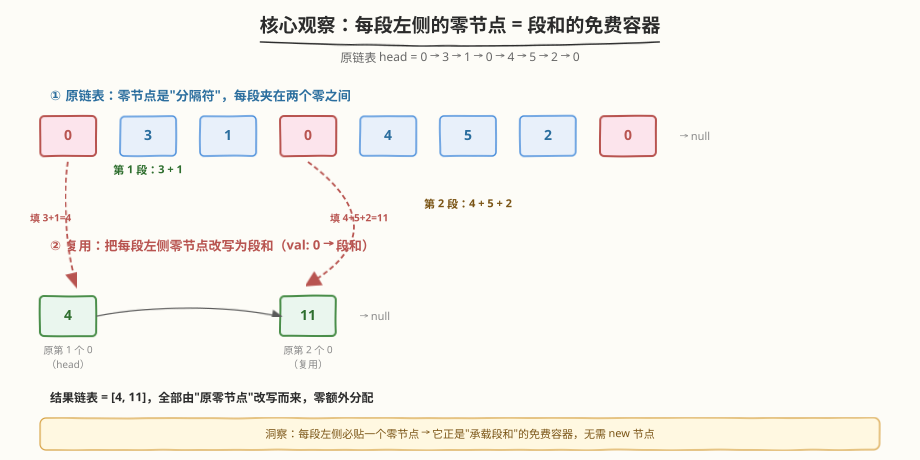
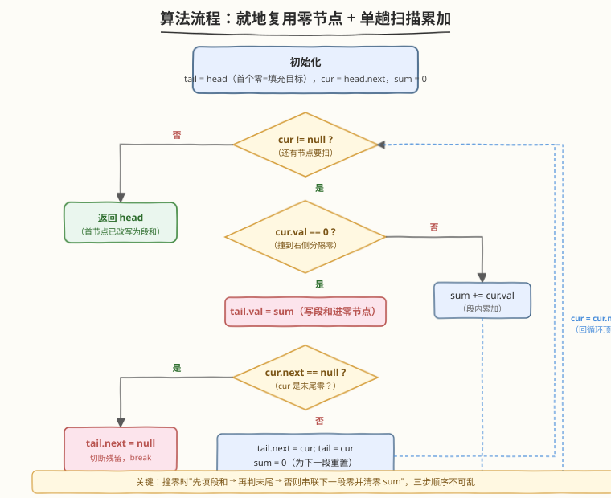

# 合并零之间的节点

- **题目名称**：合并零之间的节点
- **链接**：[2181. 合并零之间的节点](https://leetcode.cn/problems/merge-nodes-in-between-zeros/)
- **难度**：中等
- **标签**：链表、模拟、单趟扫描

## 1. 题目概述

给你一个链表的头节点 `head`，该链表包含由 `0` 分隔开的一连串整数。链表的 **开端** 和 **末尾** 的节点都满足 `Node.val == 0`。

对于每两个相邻的 `0`，请你将它们之间的所有节点合并成一个节点，其值是所有已合并节点的值之和。然后将所有 `0` 移除，修改后的链表不应该含有任何 `0`。返回修改后链表的头节点 `head`。

**示例 1**：

```text
输入：head = [0,3,1,0,4,5,2,0]
输出：[4,11]
解释：
- 第一段（3 + 1）合并为 4
- 第二段（4 + 5 + 2）合并为 11
```

**示例 2**：

```text
输入：head = [0,1,0,3,0,2,2,0]
输出：[1,3,4]
解释：
- 第一段（1）合并为 1
- 第二段（3）合并为 3
- 第三段（2 + 2）合并为 4
```

**约束条件**：

- 列表中的节点数目在范围 $[3,\, 2 \times 10^5]$ 内
- $0 \le \text{Node.val} \le 1000$
- **不存在**连续两个 `Node.val == 0` 的节点
- 链表的 **开端** 和 **末尾** 节点都满足 `Node.val == 0`

> 💡 题目保证首尾都是 `0`、且无连续 `0`，意味着每两个相邻 `0` 之间**至少有一个非零节点**——这把"空段"边界直接排除掉了，只需专注"累加 + 在 `0` 处结算"这一件事。链表节点数可达 $2\times10^5$，所以 $O(n)$ 单趟扫描是底线，不能反复遍历。

---

## 2. 解题思路

### 2.1 暴力思路：新建链表逐段累加

最直白的做法：遍历原链表，遇到非零就累加进 `sum`，遇到零就把 `sum` 封装成一个新节点追加到结果链表，然后 `sum` 清零。

```text
dummy = ListNode(0); tail = dummy
cur = head.next; sum = 0
while cur != null:
    if cur.val == 0:
        tail.next = ListNode(sum); tail = tail.next
        sum = 0
    else:
        sum += cur.val
    cur = cur.next
return dummy.next
```

时间 $O(n)$，空间 $O(k)$（$k$ 为段数，每段新建一个节点）。逻辑清晰、不易出错，但**多分配了 $k$ 个节点**。在链表题里，更优雅的做法是**就地改造**原链表——题目允许修改原链表，那就把零节点"废物利用"。

> ⚠️ 暴力法的关键痛点：原链表里的零节点是"分隔符"，合并后它们全部要消失。新建链表时这些零节点成了垃圾，原链表节点也未复用。能否就地复用这些零节点作为承载累加和的容器？关键观察：**每一段的左侧必定贴着一个零节点**——正好拿它来存这一段的和。

### 2.2 核心观察：复用零节点 + 单趟扫描



两个关键技巧叠加：

1. **复用零节点作为结果节点**：每一段 `0 → a₁ → a₂ → ... → 0` 的**左侧零节点**正好可以作为承载 $\sum a_i$ 的容器。把它的 `val` 从 `0` 改写成累加和，就免去了新建节点。最终链表由"原链表中各段的左侧零节点"串成，没有任何 `0` 残留。
2. **双指针 `tail` / `cur` 单趟扫描**：`tail` 指向"当前正在填充的零节点"（即最后一段的左侧零），`cur` 从 `head.next` 起向后扫描累加；`cur` 撞到 `0` 时结算——把 `sum` 写进 `tail.val`，然后把 `tail` 跳到 `cur`（`cur` 就是下一段的左侧零），`sum` 清零。

> 💡 **为什么 `tail` 跳到 `cur` 而不是新建节点？** 因为 `cur` 此刻正停在一个零节点上，而它**正是下一段的左侧零**。把它串进结果链表并作为下一个填充目标，恰好"一段一节点"地走完整条链。最后一段的左侧零填好和后，`cur.next == null`（`cur` 是链尾零），把 `tail.next = null` 切断即可。

**为什么不需要哑节点？**

- 题目保证 `head.val == 0`，即链表第一个节点就是第一段的左侧零。我们直接把 `head` 当作第一个"待填充节点"，`tail = head`，无需在前面再插一个虚拟节点。
- 这与 [2095](../2001-2100/2095_删除链表的中间节点.md) 里用哑节点统一边界的情况不同——本题的天然边界（首节点必为零）已经替我们做了"结果链表头"的占位，再套哑节点反而多余。

### 2.3 算法流程图



**完整步骤**：

1. **初始化**：`tail = head`（第一个零节点，将承载第一段的和），`cur = head.next`（跳过首个零，从第一个非零节点开始扫），`sum = 0`。
2. **循环 `while cur != null`**：
   - 若 `cur.val == 0`（撞到右侧分隔零）：
     - `tail.val = sum`（把累加和写进左侧零节点）
     - 若 `cur.next == null`（`cur` 是链尾零，最后一段已结算）：`tail.next = null`，跳出。
     - 否则：`tail.next = cur`（把当前零节点串进结果链表），`tail = cur`（下一段的填充目标），`sum = 0`。
   - 否则（非零）：`sum += cur.val`。
   - `cur = cur.next`。
3. **返回**：`head`（首节点已被改写为第一段的和，仍是链表头）。

> ⚠️ 两处易错点：① **末尾切断**——最后一段结算后 `cur.next == null`，必须显式 `tail.next = null`，否则 `tail` 还指向原链表中已被"跳过"的节点，结果链表会拖一条残留尾巴。② **`sum` 清零时机**——只在"撞零并完成串联"后清零；若在结算前误清零会丢失当前段已累加的值。

### 2.4 示例演算

分别用示例 1（两段）与示例 2（三段）演示，重点看"零节点如何被复用"：

![示例演算：head=[0,3,1,0,4,5,2,0] 与 head=[0,1,0,3,0,2,2,0]](../images/2181_example_walkthrough.svg)

**示例 1：`head = [0,3,1,0,4,5,2,0]`**

| 步骤 | `cur` 节点值 | `sum` | `tail` 节点（填充目标） | 动作 |
|------|------------|-------|---------------------|------|
| 初始 | 3 | 0 | 第 1 个 0（`head`） | `tail=head`, `cur=head.next` |
| 扫 3 | 1 | 3 | 第 1 个 0 | 累加 `sum=3` |
| 扫 1 | 0 | 4 | 第 1 个 0 | 累加 `sum=4` |
| 撞零 | 4 | 4 | 第 1 个 0 | `tail.val=4`；`cur.next≠null` → `tail.next=cur`, `tail=第2个0`, `sum=0` |
| 扫 4 | 5 | 4 | 第 2 个 0 | 累加 `sum=4` |
| 扫 5 | 2 | 9 | 第 2 个 0 | 累加 `sum=9` |
| 扫 2 | 0 | 11 | 第 2 个 0 | 累加 `sum=11` |
| 撞零（末尾） | null | 11 | 第 2 个 0 | `tail.val=11`；`cur.next==null` → `tail.next=null`, 跳出 |

结果：`head(4) → 第2个0(11) → null`，即 `[4, 11]` ✓

> 💡 注意第一个零节点（原 `head`）被改写成 `4`，第二个零节点被改写成 `11`，中间的 `3,1,4,5,2` 全部被"跳过"（不在结果链表里）。原链表的两个零节点恰好复用为结果链表的两个节点，零开销。

**示例 2：`head = [0,1,0,3,0,2,2,0]`**

| 段 | 扫描到的非零值 | 累加和 | 结算后 `tail.val` |
|----|--------------|-------|------------------|
| 第 1 段 | 1 | 1 | 第 1 个 0 → `1` |
| 第 2 段 | 3 | 3 | 第 2 个 0 → `3` |
| 第 3 段 | 2, 2 | 4 | 第 3 个 0 → `4` |

三个零节点分别被改写为 `1, 3, 4`，末尾切断后结果 `[1, 3, 4]` ✓

> ⚠️ 本例有三个零节点（`head` 之后的两个中间零 + 末尾零），但**结果链表只用前三个零**（含 `head`）。第三个零（原链表的倒数第二个节点）填入 `4` 后，`cur` 走到末尾零，`cur.next == null` 触发 `tail.next = null` 切断——末尾零被丢弃，不计入结果。这正是"末尾切断"分支的作用。

---

## 3. 参考代码

### C++（就地复用版，推荐）

```cpp
// 合并零之间的节点.cpp —— 就地复用零节点 + 单趟扫描累加
// 编译: g++ -O2 -std=c++17 合并零之间的节点.cpp -o mergenodes
struct ListNode {
    int val;
    ListNode* next;
    ListNode() : val(0), next(nullptr) {
    }
    ListNode(int x) : val(x), next(nullptr) {
    }
    ListNode(int x, ListNode* n) : val(x), next(n) {
    }
};

class Solution {
  public:
    ListNode* mergeNodes(ListNode* head) {
        ListNode* tail = head;          // 当前正在填充的零节点（第一段左侧零 = head）
        ListNode* cur = head->next;     // 从第一个非零节点开始扫
        int sum = 0;
        while (cur != nullptr) {
            if (cur->val == 0) {
                tail->val = sum;        // 把累加和写进左侧零节点
                if (cur->next == nullptr) {
                    tail->next = nullptr; // 末尾零：切断，结束
                    break;
                }
                tail->next = cur;       // 串入下一段的左侧零
                tail = cur;             // 下一段的填充目标
                sum = 0;
            } else {
                sum += cur->val;
            }
            cur = cur->next;
        }
        return head;
    }
};
```

> 💡 `tail` 始终指向"某个原零节点"，它的 `val` 在结算时被改写为段和。原链表中的非零节点被"跳过"不进入结果链表，无需手动释放（LeetCode 不要求，且节点由测试框架统一管理）。

### C++（新建链表版，对照参考）

```cpp
class Solution {
  public:
    ListNode* mergeNodes(ListNode* head) {
        ListNode dummy(0);
        ListNode* tail = &dummy;
        ListNode* cur = head->next;
        int sum = 0;
        while (cur != nullptr) {
            if (cur->val == 0) {
                tail->next = new ListNode(sum);
                tail = tail->next;
                sum = 0;
            } else {
                sum += cur->val;
            }
            cur = cur->next;
        }
        return dummy.next;
    }
};
```

### Python（就地复用版，推荐）

```python
from typing import Optional

class ListNode:
    def __init__(self, val=0, next=None):
        self.val = val
        self.next = next

class Solution:
    def mergeNodes(self, head: Optional[ListNode]) -> Optional[ListNode]:
        tail = head              # 当前正在填充的零节点（第一段左侧零 = head）
        cur = head.next          # 从第一个非零节点开始扫
        s = 0
        while cur:
            if cur.val == 0:
                tail.val = s     # 把累加和写进左侧零节点
                if cur.next is None:
                    tail.next = None  # 末尾零：切断，结束
                    break
                tail.next = cur   # 串入下一段的左侧零
                tail = cur        # 下一段的填充目标
                s = 0
            else:
                s += cur.val
            cur = cur.next
        return head
```

### Python（新建链表版，对照参考）

```python
class Solution:
    def mergeNodes(self, head: Optional[ListNode]) -> Optional[ListNode]:
        dummy = ListNode(0)
        tail = dummy
        cur = head.next
        s = 0
        while cur:
            if cur.val == 0:
                tail.next = ListNode(s)
                tail = tail.next
                s = 0
            else:
                s += cur.val
            cur = cur.next
        return dummy.next
```

> ⚠️ **两种写法对比**：新建链表版逻辑更直观（累加→撞零→`new` 一个节点），但多分配 $k$ 个节点、空间 $O(k)$；就地复用版把原零节点改写为结果节点，空间 $O(1)$，且无需哑节点（`head` 本身就是第一个零节点）。面试时建议先讲新建版理清思路，再优化为就地复用版，展示"就地改造原链表"的链表题通用思维。

---

## 4. 复杂度分析

| 维度 | 就地复用版 | 新建链表版 | 说明 |
|------|-----------|-----------|------|
| **时间复杂度** | $O(n)$ | $O(n)$ | `cur` 单趟扫描每个节点一次，段内累加 + 撞零结算合计 $O(n)$ |
| **空间复杂度** | $O(1)$ | $O(k)$ | 就地版只复用原零节点，常数指针；新建版每段分配一个节点，$k$ 为段数 |
| **是否修改原链表** | 是 | 否 | 就地版改写零节点 `val` 并重连 `next`；新建版原链表不动 |

> 💡 $n \le 2\times10^5$ 时两种写法时间都轻松通过，差异在空间。就地复用版的优势在于"零额外节点"——原链表的零节点从"分隔符"身份转变为"结果节点"身份，一物两用。这是链表就地题的常见优化思路（对照 [237. 删除链表中的节点](https://leetcode.cn/problems/delete-node-in-a-linked-list/) 的"值后移伪删除"）。

---

## 5. 扩展：链表就地改造的两种范式

本题的"复用零节点"属于链表就地题的一类范式，可与另一类对照：

### 5.1 复用现有节点（本题）

题目给出"会被丢弃"的节点（本题的零节点），把它们改写为结果节点。特征是：**结果链表的节点数 ≤ 原链表节点数**，且原链表里有明确的"冗余节点"可回收。

- 本题：零节点（分隔符）→ 结果节点（段和容器）
- [237. 删除链表中的节点](https://leetcode.cn/problems/delete-node-in-a-linked-list/)：把后继节点的值搬到当前节点，再删除后继——复用后继节点存储当前节点该有的值

### 5.2 重连现有节点（82、2095）

不改变节点值，只改 `next` 指针把需要的节点串起来、跳过不需要的。

- [82. 删除排序链表中的重复元素 II](../0001-0100/82_删除排序链表中的重复元素II.md)：整段跳过重复组，`prev.next` 直接指向下一段的起点
- [2095. 删除链表的中间节点](../2001-2100/2095_删除链表的中间节点.md)：`slow.next = slow.next.next` 跳过中间节点

> 💡 **判定口诀**：若结果节点需要"新值"且原链表有冗余节点 → 复用（改 `val`）；若结果节点保留原值只是要"跳过某些节点" → 重连（改 `next`）。本题段和是"新值"，零节点是"冗余"，故选复用。

### 5.3 若题目不允许修改原链表

则只能新建链表（本文的对照版）。此时空间 $O(k)$ 不可避免，但逻辑等价。面试中若被追问"能否不修改原链表"，直接切到新建链表版即可，时间复杂度不变。

---

## 6. 面试要点

1. **为什么可以不用哑节点？**

   - 题目保证 `head.val == 0`，链表第一个节点就是第一段的左侧零，天然充当"结果链表头"。`tail = head` 直接把它作为第一个填充目标，无需再插虚拟节点。
   - 这与 [2095](../2001-2100/2095_删除链表的中间节点.md) 不同——2095 删中间节点时 `n == 1` 要删头节点，没有天然的前驱，必须靠哑节点补一个。本题首节点本身就是"待填充容器"，没有"删头"需求。

2. **末尾为什么必须 `tail.next = null`？**

   - 最后一段结算时，`tail` 指向倒数第二个零节点（原链表），它的 `next` 原本指向末尾零。若不切断，结果链表会拖着一个值为 `0` 的末尾零节点——违反"不应含有任何 0"。
   - 判定条件 `cur.next == null`（`cur` 是末尾零）触发切断：把 `tail.next` 置空，丢弃末尾零。这是就地改造中最易漏的一步。

3. **`sum` 在什么时候清零？**

   - 只在"撞零且完成串联"后清零（`tail.next = cur; tail = cur; sum = 0`）。若在"撞零"时先清零再结算，会丢失当前段已累加的值。
   - 顺序必须是：① `tail.val = sum`（用 `sum` 填充）→ ② 串联 `tail` 到下一段 → ③ `sum = 0`（为下一段重置）。调换 ①③ 会出错。

4. **新建链表版与就地复用版的时间复杂度相同，为什么推荐就地版？**

   - 时间都是 $O(n)$，但就地版空间 $O(1)$、新建版 $O(k)$。在 $n = 2\times10^5$、段数 $k$ 可达 $10^5$ 量级时，新建版多分配 $10^5$ 个节点，常数开销显著。
   - 更重要的是，就地版体现了"识别冗余节点并复用"的链表思维——这是 [237](https://leetcode.cn/problems/delete-node-in-a-linked-list/)、[82](../0001-0100/82_删除排序链表中的重复元素II.md) 等题的共同套路，展示这种思维比单纯写出代码更有面试价值。

5. **如果存在连续两个零（违反题目保证）会怎样？**

   - 题目保证"不存在连续两个 `Node.val == 0`"，所以每段至少有一个非零节点，`sum` 结算时必为正（除非段内全零，但那也违反保证）。
   - 若取消该保证，需处理"空段"——撞零时 `sum == 0` 表示空段，应跳过不产出节点。本题无需考虑，但面试时可主动提及以展示边界意识。

> 💡 **一句话总结**：2181 的核心是"复用零节点作为段和容器 + 单趟扫描累加结算"。识别出"每段左侧必贴一个零节点"这一结构性质，就能把零节点从"待删除的分隔符"升级为"承载结果值的节点"，实现 $O(1)$ 空间就地改造。模板可迁移到一切"原链表有冗余节点 + 结果需要新值"的链表模拟题。

---

## 7. 同类练习题

- [237. 删除链表中的节点](https://leetcode.cn/problems/delete-node-in-a-linked-list/)（[题解](../0201-0300/237_删除链表中的节点.md)）：同样是"复用现有节点"的就地改造——把后继值搬到当前节点再删后继，与本题"把段和写进零节点"同属"改 val 复用节点"范式
- [82. 删除排序链表中的重复元素 II](https://leetcode.cn/problems/remove-duplicates-from-sorted-list-ii/)（[题解](../0001-0100/82_删除排序链表中的重复元素II.md)）：对照题——不改 `val` 只改 `next`，整段跳过重复组，与本题"改 `val` 复用零节点"互为链表就地题的两种范式
- [2095. 删除链表的中间节点](https://leetcode.cn/problems/delete-the-middle-node-of-a-linked-list/)（[题解](../2001-2100/2095_删除链表的中间节点.md)）：链表就地删除的招牌题，哑节点 + 快慢双指针拿前驱，对照本题"无需哑节点（首节点天然是零）"的边界差异
- [2130. 链表最大孪生和](https://leetcode.cn/problems/maximum-twin-sum-of-a-linked-list/)（[题解](../2101-2200/2130_链表最大孪生和.md)）：链表遍历 + 找中点 + 反转后半段的综合题，巩固"快慢双指针找中点"模板，与本题"单指针单趟扫描"形成复杂度对照
- [21. 合并两个有序链表](https://leetcode.cn/problems/merge-two-sorted-lists/)（[题解](../0001-0100/21_合并两个有序链表.md)）：哑节点 + 双指针归并的经典题，对照本题"就地复用而非新建"的取舍——21 题新建更自然（两源链表），本题就地更优（单源有冗余节点）
