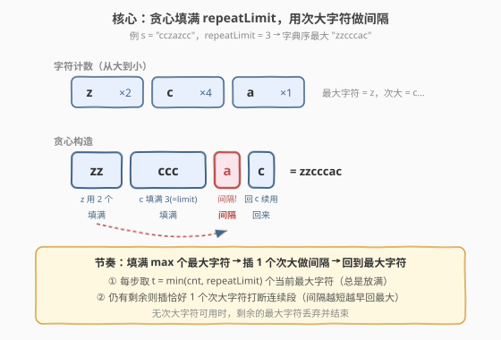
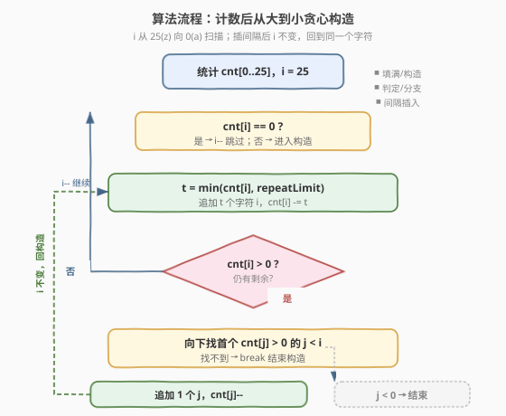
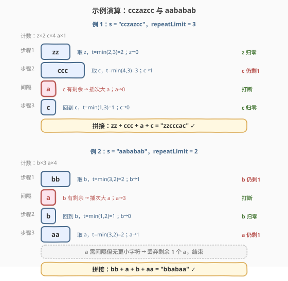

# LeetCode 构造限制重复的字符串 题解

## 1. 题目概述

- **标题 / 题号**：构造限制重复的字符串（#2182，medium）
- **链接**：https://leetcode.cn/problems/construct-string-with-repeat-limit/
- **难度**：中等
- **标签**：贪心、堆、字符串

**题意**：给你一个字符串 `s` 和一个整数 `repeatLimit`。你需要使用 `s` 中的字符构造一个新字符串 `repeatLimitedString`，使得**没有任一字符连续出现超过 `repeatLimit` 次**。你**不必使用 `s` 的全部字符**。

返回你能构造的**字典序最大**的字符串 `repeatLimitedString`。

**示例 1**：

```text
输入：s = "cczazcc", repeatLimit = 3
输出："zzcccac"
解释：从 s 中构造的字典序最大的串。z 用 2 次、c 用 3 次后插 1 个 a 做间隔，再用 1 个 c。
```

**示例 2**：

```text
输入：s = "aababab", repeatLimit = 2
输出："bbabaa"
解释：b 用 2 次后插 1 个 a，再用 1 个 b；之后 a 用 2 次，剩余 1 个 a 无间隔字符可用，丢弃。
```

**约束**：

- $1 \le \text{s.length} \le 10^5$
- `s` 由小写英文字母组成
- $1 \le \text{repeatLimit} \le \text{s.length}$

> 💡 字典序最大的本质是「**越靠前的位置越大越好**」。因此直觉上应当**贪心地优先放置当前能用的最大字符**，当它连续放满 `repeatLimit` 个仍有剩余时，被迫插一个「次大字符」做间隔，然后继续回到最大字符。这个「填满—间隔—回来」的节奏就是本题的核心。

## 2. 解题思路

### 2.1 暴力思路：枚举所有合法构造

最直白的做法：枚举 `s` 字符的所有排列，对每个排列检查是否满足「无字符连续超过 `repeatLimit` 次」，在所有合法排列中取字典序最大者。

```text
ans = ""
for perm in all_permutations(s):
    if valid(perm, repeatLimit):
        if perm > ans:
            ans = perm
return ans
```

> ⚠️ 完全不可行：`s` 长度达 $10^5$，排列数是天文数字。即便只考虑「合法构造」空间，盲目搜索也毫无方向。本题的突破口在于发现**贪心的局部最优即全局最优**，从而把指数级搜索压成线性构造。

### 2.2 核心观察：贪心填满 + 次大间隔



**观察 1：字典序贪心——每一步都放当前可用的最大字符。**

字典序比较由「第一个不同的位置」决定。若两个构造串在第 $i$ 位首次不同，则该位字符更大的那个整体更大，与后面所有位无关。因此**让靠前位置尽可能大**永远不亏——只要不导致后续无法继续构造（而本题允许丢弃字符，所以不存在「现在贪心导致后面崩盘」的风险）。

**观察 2：一次最多放 `repeatLimit` 个同一字符。**

设当前最大可用字符为 $c$，剩余数量为 $\text{cnt}[c]$。我们可以连放 $t = \min(\text{cnt}[c],\, \text{repeatLimit})$ 个 $c$。放少于 $t$ 个只会让当前位置更小而换不来任何收益（因为放满 $t$ 个后还能继续决策），所以**总是放满**。

**观察 3：放满后若 $c$ 仍有剩余，必须插 1 个「次大字符」做间隔。**

由于不能让 $c$ 连续超过 `repeatLimit` 次，继续放 $c$ 会违规。此时需要**恰好 1 个**不同于 $c$ 的字符来「打断」连续段。选哪个？

- **数量**：只插 1 个（而非多个）。因为插间隔的目的是「尽快回到最大字符 $c$」，插得越少越早回去放 $c$，字典序越大。
- **种类**：在所有 $\ne c$ 的可用字符里选**最大的**那个 $d$。这一位既然必须放非 $c$ 字符，那就放其中最大的，保持字典序尽可能大。

插完这 1 个 $d$ 后，连续段被打断，重新回到第 1 步继续取最大字符（通常仍是 $c$，因为它的剩余可能还最多、也还最大）。

> 💡 **若没有次大字符可做间隔**（$c$ 之外所有字符已耗尽），则剩余的 $c$ 再也无法合法放置，直接丢弃并结束构造。这就是「不必使用全部字符」的体现——示例 2 末尾丢弃了 1 个 `a`。

**交换论证（正确性直觉）**：假设最优解在某步没有放满 $t$ 个 $c$，或插了多于 1 个间隔，或插了比 $d$ 更小的间隔字符。把这步改成「放满 $t$ 个 $c$ + 恰好 1 个最大次大 $d$」，则该步构造串在首个不同处更大或相等，且剩余字符供给只多不少（消耗更少的大字符），后续可构造性不降。反复交换即得贪心解 $\ge$ 最优解，故贪心即最优。

### 2.3 算法流程图



1. **计数**：用长度 26 的数组 `cnt` 统计 `s` 中每个字符出现次数。
2. **从大到小扫描**：令 $i = 25$（即 `'z'`），循环：
   - 若 $\text{cnt}[i] = 0$，$i \gets i-1$ 跳过。
   - 取 $t = \min(\text{cnt}[i],\, \text{repeatLimit})$，向结果追加 $t$ 个字符 $i$，$\text{cnt}[i] \mathrel{-}= t$。
   - 若 $\text{cnt}[i] > 0$（仍有剩余）：向下找第一个 $\text{cnt}[j] > 0$ 的 $j < i$；
     - 若找不到（$j < 0$），**结束**构造（无法再做间隔）。
     - 否则追加 1 个字符 $j$，$\text{cnt}[j] \mathrel{-}= 1$，**保持 $i$ 不变**（回去继续放 $i$）。
3. **返回**结果串。

> ⚠️ 关键细节：插完间隔后**不要把 $i$ 减 1**。因为 $c$（即 $i$）可能还有大量剩余，且仍是当前最大可用字符，应继续优先消费它。只有当 $\text{cnt}[i]$ 真正归零时才 $i \gets i-1$ 前进到下一个字符。

### 2.4 示例演算



**示例 1：`s = "cczazcc"`, `repeatLimit = 3`**

计数：`c=4, z=2, a=1`。

| 步骤 | 当前最大 $i$ | 取 $t$ | 追加 | 剩余 | 间隔？ | 说明 |
|------|------------|--------|------|------|--------|------|
| 1 | z | $\min(2,3)=2$ | `zz` | z=0 | 否（z 归零） | z 一次用完 |
| 2 | c | $\min(4,3)=3$ | `ccc` | c=1 | 是（c 仍有 1） | 需插间隔 |
| 2.5 | — | — | `a` | a=0 | — | 次大字符 a 做间隔 |
| 3 | c | $\min(1,3)=1$ | `c` | c=0 | 否（c 归零） | 回到 c 继续用完 |

结果：`zz` + `ccc` + `a` + `c` = `zzcccac` ✓

> 💡 第 2 步放满 3 个 `c` 后还剩 1 个 `c`，必须插间隔。此时次大可用字符是 `a`（`z` 已耗尽），放 1 个 `a` 打断连续段，然后第 3 步回到 `c` 把最后 1 个用掉。

**示例 2：`s = "aababab"`, `repeatLimit = 2`**

计数：`a=4, b=3`。

| 步骤 | 当前最大 $i$ | 取 $t$ | 追加 | 剩余 | 间隔？ | 说明 |
|------|------------|--------|------|------|--------|------|
| 1 | b | $\min(3,2)=2$ | `bb` | b=1 | 是（b 仍有 1） | 需插间隔 |
| 1.5 | — | — | `a` | a=3 | — | 次大字符 a 做间隔 |
| 2 | b | $\min(1,2)=1$ | `b` | b=0 | 否（b 归零） | 回到 b 用完 |
| 3 | a | $\min(3,2)=2$ | `aa` | a=1 | 是（a 仍有 1） | 需插间隔 |
| 3.5 | — | — | 无 | — | — | 找不到比 a 更小的字符 → 停止 |

结果：`bb` + `a` + `b` + `aa` = `bbabaa` ✓（末尾丢弃 1 个 `a`）

> ⚠️ 第 3 步放满 2 个 `a` 后还剩 1 个 `a`，需要间隔字符，但 `a` 已经是最小字符、其下无任何可用字符，于是剩余的 `a` 无法合法放置，**直接丢弃**。这正是「不必使用全部字符」的边界情形。

## 3. 参考代码

### C++（计数数组 + 逆序扫描，推荐）

```cpp
class Solution {
  public:
    string repeatLimitedString(string s, int repeatLimit) {
        int cnt[26] = {0};
        for (char c : s) cnt[c - 'a']++;
        string res;
        for (int i = 25; i >= 0;) {
            if (cnt[i] == 0) { i--; continue; }
            int take = min(cnt[i], repeatLimit);
            res.append(take, 'a' + i);
            cnt[i] -= take;
            if (cnt[i] > 0) {
                int j = i - 1;
                while (j >= 0 && cnt[j] == 0) j--;
                if (j < 0) break;
                res.push_back('a' + j);
                cnt[j]--;
            }
        }
        return res;
    }
};
```

> 💡 `for` 循环用 `i--` 只在 `cnt[i]==0` 或自然递减时推进；插完间隔后**不改动 $i$**，循环继续消费同一个 $i$。`res.append(take, ch)` 一次性追加 $t$ 个相同字符，比逐个 `push_back` 更高效。找次大字符的 `while` 每次至多扫 26 步，常数级。

### Python（计数数组 + 逆序扫描，推荐）

```python
class Solution:
    def repeatLimitedString(self, s: str, repeatLimit: int) -> str:
        cnt = [0] * 26
        for c in s:
            cnt[ord(c) - 97] += 1
        res = []
        i = 25
        while i >= 0:
            if cnt[i] == 0:
                i -= 1
                continue
            take = min(cnt[i], repeatLimit)
            res.append(chr(97 + i) * take)
            cnt[i] -= take
            if cnt[i] > 0:
                j = i - 1
                while j >= 0 and cnt[j] == 0:
                    j -= 1
                if j < 0:
                    break
                res.append(chr(97 + j))
                cnt[j] -= 1
        return "".join(res)
```

### Python（大根堆版，对照参考）

```python
import heapq

class Solution:
    def repeatLimitedString(self, s: str, repeatLimit: int) -> str:
        cnt = [0] * 26
        for c in s:
            cnt[ord(c) - 97] += 1
        heap = [-i for i in range(26) if cnt[i] > 0]
        heapq.heapify(heap)
        res = []
        while heap:
            i = -heapq.heappop(heap)
            take = min(cnt[i], repeatLimit)
            res.append(chr(97 + i) * take)
            cnt[i] -= take
            if cnt[i] > 0 and heap:
                j = -heapq.heappop(heap)
                res.append(chr(97 + j))
                cnt[j] -= 1
                if cnt[j] > 0:
                    heapq.heappush(heap, -j)
                heapq.heappush(heap, -i)
        return "".join(res)
```

> ⚠️ **两种写法对比**：字母表只有 26 个字符，堆大小 $\le 26$，`log 26` 是常数，故堆版与计数版渐近同为 $O(n)$。计数版实现更简、常数更小（无堆操作），推荐为主；堆版思路更通用——若字母表扩大（如 Unicode 字符集），堆版仍只需 $O(\log |\Sigma|)$ 而计数版需改造。两种写法每次外层迭代至少消费 1 个字符（`take ≥ 1` 或 1 个间隔），故迭代总次数 $\le n$。

## 4. 复杂度分析

| 维度 | 复杂度 | 说明 |
|------|--------|------|
| 时间复杂度（计数版） | $O(n)$ | 计数 $O(n)$；构造阶段每次迭代至少追加 1 个字符，迭代 $\le n$ 次，每次找次大字符最多扫 26 步（常数），合计 $O(26n) = O(n)$ |
| 时间复杂度（堆版） | $O(n)$ | 堆大小 $\le 26$，每次 push/pop 为 $O(\log 26)$ 常数；迭代 $\le n$ 次，合计 $O(n)$ |
| 空间复杂度 | $O(1)$ 额外 / $O(n)$ 含输出 | 计数数组与堆均为 $O(26) = O(1)$；结果串占用 $O(n)$ |

> 💡 本题时间下界为 $\Omega(n)$（至少要读入并写出 $n$ 个字符），故上述算法已达最优渐近复杂度。

## 5. 扩展：与「无相邻相同」类问题的关系

本题是「受限重复构造」家族的一员，参数 `repeatLimit` 控制同一字符的最大连续次数。当 `repeatLimit = 1` 时，退化为「**任意相邻字符不同**」的经典问题——此时贪心策略变为「每次取最大字符 1 个，若与末尾相同则取次大」，与 [767. 重构字符串](https://leetcode.cn/problems/reorganize-string/)、[1054. 距离相等的条形码](https://leetcode.cn/problems/distant-barcodes/) 同源（后者只要求一种合法排列，不强求字典序最大，可更宽松地用「隔位填奇偶槽」）。

更近的变体是 [1405. 最长快乐字符串](https://leetcode.cn/problems/longest-happy-string/)：限制 `'a'/'b'/'c'` 各自最多连续 2 次，目标是**最长**而非字典序最大。本题的「填满—间隔—回来」节奏同样适用，只是优化目标从「字典序最大」换成「长度最长」，因此 1405 在选间隔字符时不必挑最大的，而是挑「剩余最多」的以延长总长——这体现了**贪心目标函数决定选择策略**的差异：

| 问题 | 连续上限 | 目标 | 选最大字符依据 |
|------|---------|------|--------------|
| 2182 本题 | `repeatLimit`（任意字符） | 字典序最大 | 字符本身大小（字母序） |
| 1405 最长快乐串 | 2（仅 a/b/c） | 长度最长 | 剩余数量（多者优先） |
| 767 重构字符串 | 1（无相邻相同） | 任一合法排列 | 剩余数量（多者优先） |

> 💡 模板共性：**计数 + 贪心消费 + 间隔插入**。差异仅在于「先消费谁」「间隔选谁」——由目标函数（字典序 vs 长度）驱动，是同一框架下的不同实例化。

## 6. 面试要点

1. **为什么每一步都放当前最大字符是正确的？**

   - 字典序由首个不同位置决定。让靠前位置尽可能大，对后续决策只会有利无害——本题允许丢弃字符，不存在「现在贪心导致后面无法构造」的隐患。若某最优解在某步放了比最大字符更小的字符，把它换成最大字符后该位更大且后续供给不减，构造串只增不减，故贪心即最优（交换论证）。

2. **为什么放满 `repeatLimit` 个而不是放更少？**

   - 放少于 $t = \min(\text{cnt}, \text{repeatLimit})$ 个只会让当前位置更小，换不来任何收益——因为放满 $t$ 个后仍可继续决策（要么该字符归零换下一个，要么插间隔再回来）。少放等于主动把更靠前的高位让给小字符，违背字典序最大化目标。

3. **为什么间隔字符只放 1 个、且选次大？**

   - **只放 1 个**：间隔的作用是打断连续段以重新放最大字符 $c$。间隔越短，越早回到 $c$，字典序越大。放多于 1 个等于把本可放 $c$ 的位置让给更小字符。
   - **选次大**：这一位既然必须放非 $c$ 字符，那就放其中最大的，保持该位尽可能大。

4. **插完间隔后为什么不能把 $i$ 减 1？**

   - 插间隔时 $\text{cnt}[i] > 0$，说明最大字符 $c$ 还有剩余，且它仍是当前最大可用字符（间隔字符 $j < i$ 已被消耗 1 个但 $c$ 没动）。应继续优先消费 $c$。只有当 $\text{cnt}[i]$ 真正归零时才推进 $i$。误把 $i$ 减 1 会导致提前放弃 $c$，输出字典序变小。

5. **没有间隔字符可用时怎么办？堆版相比计数版有何取舍？**

   - 若 $c$ 之外所有字符耗尽，剩余的 $c$ 无法合法放置（继续放会超 `repeatLimit`），**直接丢弃并结束**。这就是「不必使用全部字符」的边界。堆版与计数版渐近同为 $O(n)$（字母表常数 26），但计数版常数更小、实现更简，适合本题；堆版在字母表很大时仍保持 $O(\log|\Sigma|)$ 单次操作，扩展性更好。

## 同类练习题

| # | 题目 | 与本题的关联 |
|---|------|-------------|
| 1405 | [最长快乐字符串](https://leetcode.cn/problems/longest-happy-string/)（[题解](../1401-1500/1405_最长快乐字符串.md)） | 同框架「计数+贪心+间隔」，连续上限 2、目标改为长度最长——对比「字典序驱动选最大字符」与「数量驱动选最多字符」的差异 |
| 767 | [重构字符串](https://leetcode.cn/problems/reorganize-string/)（[题解](../0701-0800/767_重构字符串.md)） | `repeatLimit=1` 的特例（无相邻相同），用大根堆按频率交替放置，是本题退化形态的标准解法 |
| 1054 | [距离相等的条形码](https://leetcode.cn/problems/distant-barcodes/) | 与 767 同构（无相邻相同），只要求一种合法排列，隔位填奇偶槽的 $O(n)$ 解法更轻量 |
| 621 | [任务调度器](https://leetcode.cn/problems/task-scheduler/) | 同类「受限排列」思路的升级版——同一任务需间隔 n 个冷却，贪心按频率排框架任务再填空，承接「间隔插入」范式 |
| 358 | [K 距离间隔排列](https://leetcode.cn/problems/rearrange-string-k-distance-apart/) | 同一字符至少间隔 k 位，是 2182「连续上限」到「最小间隔」的对偶约束，同样贪心+堆 |
