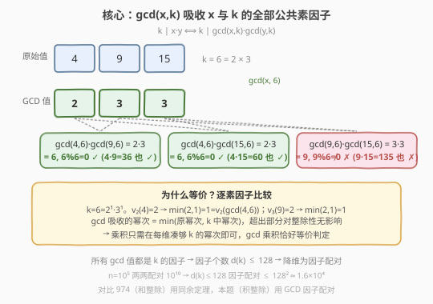
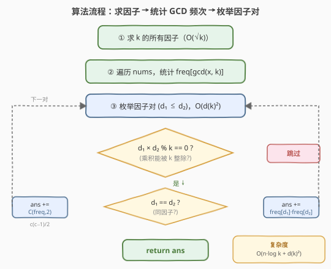
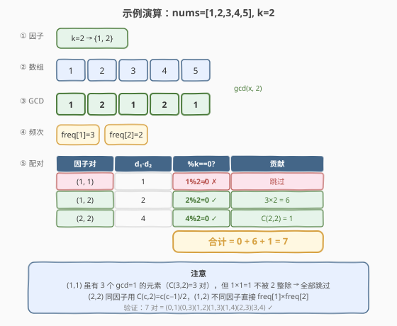

# LeetCode 统计可以被K整除的下标对数目 题解

## 1. 题目概述

- **标题 / 题号**：统计可以被K整除的下标对数目（#2183，hard）
- **链接**：https://leetcode.cn/problems/count-array-pairs-divisible-by-k/
- **难度**：困难
- **标签**：数组、数学、数论、哈希表、枚举

**题意**：给定下标从 0 开始、长度为 `n` 的整数数组 `nums` 和一个整数 `k`，返回满足 `0 <= i < j <= n - 1` 且 `nums[i] * nums[j]` 能被 `k` 整除的下标对 `(i, j)` 的数目。

**示例 1**：

```text
输入：nums = [1,2,3,4,5], k = 2
输出：7
解释：共 7 对下标的对应积可以被 2 整除：
(0,1)、(0,3)、(1,2)、(1,3)、(1,4)、(2,3) 和 (3,4)
它们的积分别是 2、4、6、8、10、12 和 20。
```

**示例 2**：

```text
输入：nums = [1,2,3,4], k = 5
输出：0
解释：不存在对应积可以被 5 整除的下标对。
```

**约束**：

- `1 <= nums.length <= 10^5`
- `1 <= nums[i], k <= 10^5`

## 2. 解题思路

### 2.1 暴力思路

直接枚举所有 $\binom{n}{2}$ 个下标对，逐一判断 `nums[i] * nums[j] % k == 0`。时间复杂度 $O(n^2)$，在 $n = 10^5$ 时约 $10^{10}$ 次运算，**必然超时**。

### 2.2 核心观察：用 GCD 降维，把"乘积整除"变成"因子配对"

直接判断乘积是否整除 `k` 需要两两配对，无法避免 $O(n^2)$。突破口是：**每个数与 `k` 的最大公约数，已经包含了它与 `k` 共享的全部质因子信息**。

> 💡 **关键定理**：设 $g_1 = \gcd(\text{nums}[i],\, k)$，$g_2 = \gcd(\text{nums}[j],\, k)$，则
> $$k \mid \text{nums}[i] \times \text{nums}[j] \iff k \mid g_1 \times g_2$$

**证明**（逐素因子比较）：

对 `k` 的任一素因子 $p$，设 $v_p(k) = a$（即 $p^a \mid\mid k$）：

- $v_p(\text{nums}[i]) + v_p(\text{nums}[j]) \geq a$ 是 $p^a \mid \text{nums}[i] \times \text{nums}[j]$ 的充要条件。
- $v_p(g_1) = \min(v_p(\text{nums}[i]),\, a)$，$v_p(g_2) = \min(v_p(\text{nums}[j]),\, a)$。

关键在于 $\min(x, a) + \min(y, a) \geq a \iff x + y \geq a$（两侧都不超过 $a$ 时等价于原式；任一侧超过 $a$ 时两边同时成立）。因此每个素因子维度上条件等价，全局亦等价。$\blacksquare$



这一化简的意义在于：

1. 将每个 `nums[i]` 替换为 $g_i = \gcd(\text{nums}[i],\, k)$，**不改变任何配对的合法性**。
2. 所有 $g_i$ 都是 `k` 的**因子**，而 $k \leq 10^5$ 的因子个数 $d(k)$ 最多只有 **128 个**（$k = 83160$ 时取到）。
3. 问题从"$n$ 个数的两两配对"降维为"**至多 128 种因子值的两两配对**"——只需枚举因子对 $(d_1, d_2)$，检查 $d_1 \times d_2 \;\%\; k == 0$，再按频次计数。

### 2.3 算法流程图



三步走：

1. **求 `k` 的所有因子**：$O(\sqrt{k})$ 枚举。
2. **统计 GCD 频次**：遍历 `nums`，对每个元素算 $\gcd(\text{nums}[i], k)$，存入哈希表 `freq`。
3. **枚举因子对**：对所有因子对 $(d_1, d_2)$（$d_1 \leq d_2$），若 $d_1 \times d_2 \;\%\; k == 0$：
   - $d_1 \neq d_2$：贡献 $\text{freq}[d_1] \times \text{freq}[d_2]$
   - $d_1 = d_2$：贡献 $\binom{\text{freq}[d_1]}{2} = \frac{\text{freq}[d_1] \times (\text{freq}[d_1]-1)}{2}$

### 2.4 示例演算

以 `nums = [1, 2, 3, 4, 5]`, `k = 2` 为例：



| 步骤 | 内容 | 结果 |
|------|------|------|
| ① 求因子 | $k = 2$ 的因子 | $\{1,\, 2\}$ |
| ② 算 GCD | $\gcd(1,2)=1,\;\gcd(2,2)=2,\;\gcd(3,2)=1,\;\gcd(4,2)=2,\;\gcd(5,2)=1$ | GCD 序列 $[1,2,1,2,1]$ |
| ③ 频次表 | $\text{freq} = \{1: 3,\; 2: 2\}$ | — |
| ④ 枚举 $(1,1)$ | $1 \times 1 = 1$，$1 \;\%\; 2 \neq 0$ | 跳过 |
| ④ 枚举 $(1,2)$ | $1 \times 2 = 2$，$2 \;\%\; 2 = 0$ ✓ | $+3 \times 2 = 6$ |
| ④ 枚举 $(2,2)$ | $2 \times 2 = 4$，$4 \;\%\; 2 = 0$ ✓ | $+\binom{2}{2} = 1$ |
| **合计** | | **7** |

> ⚠️ 注意 $(1,1)$ 虽然 $\text{freq}[1] = 3$ 有 $\binom{3}{2} = 3$ 个配对，但 $1 \times 1 = 1$ 不被 2 整除，全部跳过。这正是"先判整除再计数"的原因——不是所有因子对都合法。

## 3. 参考代码

### C++

```cpp
class Solution {
  public:
    long long countPairs(vector<int>& nums, int k) {
        // ① 求 k 的所有因子
        vector<int> divisors;
        for (int d = 1; (long long)d * d <= k; ++d) {
            if (k % d == 0) {
                divisors.push_back(d);
                if (d != k / d)
                    divisors.push_back(k / d);
            }
        }

        // ② 统计每个 gcd(nums[i], k) 的频次
        unordered_map<int, int> freq;
        for (int x : nums)
            freq[__gcd(x, k)]++;

        // ③ 枚举因子对 (d1 <= d2)
        long long ans = 0;
        int m = divisors.size();
        for (int i = 0; i < m; ++i) {
            for (int j = i; j < m; ++j) {
                int d1 = divisors[i], d2 = divisors[j];
                if ((long long)d1 * d2 % k == 0) {
                    if (d1 == d2) {
                        long long c = freq[d1];
                        ans += c * (c - 1) / 2;
                    } else {
                        ans += (long long)freq[d1] * freq[d2];
                    }
                }
            }
        }
        return ans;
    }
};
```

### Python

```python
class Solution:
    def countPairs(self, nums: List[int], k: int) -> int:
        from math import gcd

        # ① 求 k 的所有因子
        divisors = []
        d = 1
        while d * d <= k:
            if k % d == 0:
                divisors.append(d)
                if d != k // d:
                    divisors.append(k // d)
            d += 1

        # ② 统计每个 gcd(nums[i], k) 的频次
        freq = {}
        for x in nums:
            g = gcd(x, k)
            freq[g] = freq.get(g, 0) + 1

        # ③ 枚举因子对 (d1 <= d2)
        ans = 0
        n = len(divisors)
        for i in range(n):
            for j in range(i, n):
                d1, d2 = divisors[i], divisors[j]
                if (d1 * d2) % k == 0:
                    if d1 == d2:
                        c = freq.get(d1, 0)
                        ans += c * (c - 1) // 2
                    else:
                        ans += freq.get(d1, 0) * freq.get(d2, 0)
        return ans
```

## 4. 复杂度分析

| 维度 | 复杂度 | 说明 |
|------|--------|------|
| 时间复杂度 | $O(n \log k + d(k)^2)$ | 遍历 `nums` 算 GCD 每个 $O(\log k)$；枚举因子对 $d(k)^2$，$d(k) \leq 128$ |
| 空间复杂度 | $O(d(k))$ | 哈希表与因子列表只存 `k` 的因子，至多 128 个 |

> 💡 $k \leq 10^5$ 时 $d(k) \leq 128$，故 $d(k)^2 \leq 16384$，相比 $n = 10^5$ 可忽略。瓶颈在遍历 `nums` 算 GCD 的 $O(n \log k)$，约 $1.7 \times 10^6$ 次运算，轻松通过。

## 5. 扩展：一次遍历写法

上述解法先统计频次再枚举因子对。也可以**边遍历边计数**：对每个 `nums[i]`，算 $g_i = \gcd(\text{nums}[i],\, k)$ 和"需求因子" $\text{need} = k / g_i$，然后查频次表中 `need` 的**倍数因子**有多少个（即之前出现过的、能与当前配对的元素数）。由于因子表很小，遍历所有因子检查 `d % need == 0` 即可。

```cpp
// 一次遍历写法（思路等价，顺序不同）
long long countPairs(vector<int>& nums, int k) {
    vector<int> divs;
    for (int d = 1; (long long)d * d <= k; ++d)
        if (k % d == 0) {
            divs.push_back(d);
            if (d != k / d) divs.push_back(k / d);
        }
    unordered_map<int, int> freq;
    long long ans = 0;
    for (int x : nums) {
        int g = __gcd(x, k), need = k / g;
        for (int d : divs)           // 查 need 的倍数
            if (d % need == 0)
                ans += freq[d];
        freq[g]++;
    }
    return ans;
}
```

两种写法的复杂度相同，都是 $O(n \cdot d(k))$。一次遍历写法更紧凑，但因子对枚举写法更直观——先把所有配对可能性列清楚，再统一计数。

## 6. 面试要点

**Q1：为什么能用 GCD 替换原始数值而不改变结果？**
　　因为 $\gcd(x, k)$ 已经吸收了 $x$ 与 $k$ 共享的全部质因子。对 $k$ 的每个素因子 $p$，$x$ 贡献的幂次 $v_p(x)$ 被 $\min(v_p(x), v_p(k))$ 封顶后即为 $v_p(\gcd(x,k))$，而超过 $v_p(k)$ 的部分对整除性无影响——乘积只需凑够 $v_p(k)$ 即可。

**Q2：为什么因子对枚举是 $O(d(k)^2)$ 而不是 $O(k^2)$？**
　　所有 $\gcd(\text{nums}[i], k)$ 都是 $k$ 的因子，哈希表中只出现因子值。$k \leq 10^5$ 的因子个数 $d(k) \leq 128$，所以枚举因子对最多 $128^2 \approx 1.6 \times 10^4$ 次，远小于 $n$。

**Q3：$d_1 = d_2$ 时为什么要用 $\binom{c}{2}$ 而不是 $c^2$？**
　　同因子值的元素之间配对要求 $i < j$（无序对），$c$ 个元素两两配对数为 $\binom{c}{2} = c(c-1)/2$。若用 $c^2$ 会把 $(i,j)$ 和 $(j,i)$ 都算进去，且多算了自己配自己的情况。

**Q4：如果 $k$ 是质数，退化成什么？**
　　$k$ 为质数时因子只有 $\{1, k\}$。每个数要么被 $k$ 整除（$g = k$）要么不被整除（$g = 1$）。合法配对为：两个都能被 $k$ 整除，或一个能一个不能。即 $\binom{c_k}{2} + c_k \cdot c_1$，其中 $c_k$ 是被 $k$ 整除的元素数，$c_1$ 是不被整除的元素数。

**Q5：这题和"和可被 K 整除的子数组"（974）有什么区别？**
　　974 研究的是**和**的整除性，用前缀和 + 同余定理（两前缀和同余则区间和整除）。本题研究的是**积**的整除性，没有前缀积的类似性质（前缀积不具加法那样的"差=区间"结构），因此转而用 GCD 因子配对。两者都利用了"整除性可以分解到素因子维度"这一共性。

## 同类练习题

| # | 题目 | 与本题的关联 |
|---|------|-------------|
| 1497 | [检查数组对是否可以被 k 整除](https://leetcode.cn/problems/check-if-array-pairs-are-divisible-by-k/) | 同为整除配对，但要求"和"整除而非"积"整除，用余数互补配对 |
| 974 | [和可被 K 整除的子数组](https://leetcode.cn/problems/subarray-sums-divisible-by-k/)（[题解](../0901-1000/974_和可被K整除的子数组.md)） | 前缀和 + 同余定理，对比"和整除"与"积整除"的思路差异 |
| 1010 | [总持续时间可被 60 整除的歌曲](https://leetcode.cn/problems/pairs-of-songs-with-total-durations-divisible-by-60/) | 配对之和整除 60，余数计数配对，本题的"和"版入门题 |
| 1590 | [使数组和能被 P 整除](https://leetcode.cn/problems/make-sum-divisible-by-p/) | 前缀和 + 同余，求最短移除子数组使剩余和整除 P |
