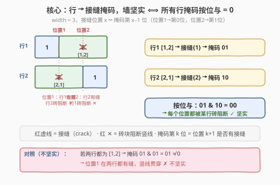
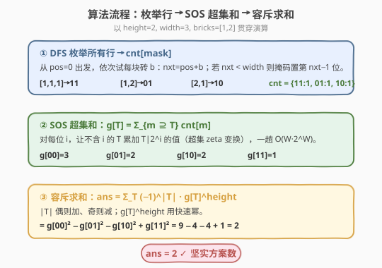
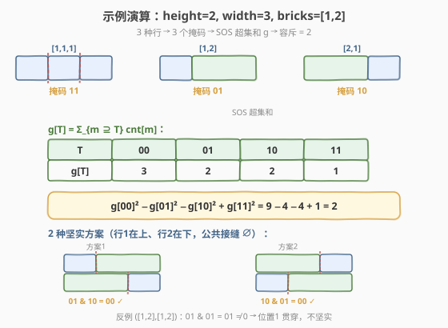

# LeetCode 建造坚实的砖墙的方法数 题解

## 1. 题目概述

- **标题 / 题号**：建造坚实的砖墙的方法数（#2184，medium）
- **链接**：https://leetcode.cn/problems/number-of-ways-to-build-sturdy-brick-wall/
- **难度**：中等
- **标签**：数组、动态规划、位运算、位掩码

**题意**：给定整数 `height`（墙的行数）、`width`（每行宽度）与砖块宽度数组 `bricks`（每种宽度可无限次使用）。一面墙由 `height` 行砖块自顶向下叠成，每行从 `bricks` 中可重复选取若干砖块、从左到右排成一行，使其宽度之和恰为 `width`。

相邻两块砖之间会在某个整数位置 $x$（$1 \le x \le width-1$）留下一条**接缝**（crack）。若存在某个整数 $x$，使得**每一行**都在 $x$ 处有接缝，则这条竖直线可从墙顶贯穿到墙底而不被任何砖块阻断，墙**不坚实**；反之若不存在这样的 $x$，则墙**坚实**（sturdy）。

返回使用恰好 `height` 行筑成的坚实砖墙的方案数，对 $10^9+7$ 取余。两堵墙只要有任意一行砖块排列不同即视为不同（行有序，自顶向下）。

**示例 1**：

```text
输入：height = 2, width = 3, bricks = [1,2]
输出：2
解释：宽度为 3 的行有 3 种：[1,1,1]（接缝{1,2}）、[1,2]（接缝{1}）、[2,1]（接缝{2}）。
      两行方案中接缝集合"按位与"为空（即无贯穿竖线）的有序组合只有：
      ([1,2],[2,1]) 与 ([2,1],[1,2])，共 2 种。
```

**示例 2**：

```text
输入：height = 1, width = 1, bricks = [5]
输出：0
解释：宽度为 1 的行无法用宽度 5 的砖块凑成，没有合法行，故方案数为 0。
```

**约束**：

- $1 \le \text{height} \le 100$
- $1 \le \text{width} \le 25$
- $1 \le \text{bricks.length} \le 25$
- $1 \le \text{bricks[i]} \le 25$
- `bricks` 中的元素互不相同

> 💡 **读题关键**：把每一行用它"接缝位置的集合"来代表（一个 $width-1$ 位的位掩码）。墙坚实 ⟺ 所有行掩码的**按位与**为 $0$（没有任何一个接缝位置在所有行中同时出现）。于是问题化为："用恰好 $height$ 个掩码（带重数）排成有序序列，使其按位与为 $0$"的计数。

## 2. 解题思路

### 2.1 暴力思路：枚举所有行组合

最直白的做法：枚举所有可能的行（`width` 的砖块组成），再枚举 `height` 行的有序组合，逐一验证按位与是否为 $0$。

设合法行数为 $R$，组合数高达 $R^{height}$，而 $R$ 本身可达指数级，完全不可行。

> ⚠️ 暴力的浪费在于：它逐条验证"整墙是否贯穿"，却没注意到"贯穿"是按**位置**而非按**整墙**判定的——可按位置独立做容斥，避免枚举整墙。

### 2.2 核心观察：行→掩码 + 容斥原理



**观察 1：一行 ↔ 一个 $W=width-1$ 位掩码。**
接缝只可能出现在整数位置 $1,2,\dots,width-1$。把位置 $x$ 对应第 $x-1$ 位，则每行唯一对应一个掩码 $m$（该行所有接缝位置的集合）。以 $width=3$ 为例：

- `[1,2]`：接缝在位置 $1$ → 掩码 `01`
- `[2,1]`：接缝在位置 $2$ → 掩码 `10`
- `[1,1,1]`：接缝在 $\{1,2\}$ → 掩码 `11`

**观察 2：墙坚实 ⟺ 所有行掩码按位与为 $0$。**
位置 $x$ 在"每一行"都是接缝 ⟺ 第 $x-1$ 位在所有行掩码中都为 $1$ ⟺ 所有掩码按位与的第 $x-1$ 位为 $1$。故"无贯穿竖线"⟺ 按位与为 $0$。

**观察 3：相同掩码的行可合并计数。**
设 $\text{cnt}[m]$ 为掩码恰为 $m$ 的行数。我们要统计的是有序 $height$-元组 $(m_1,\dots,m_{height})$ 满足 $m_1\&\dots\&m_{height}=0$ 的方案数（位置 $i$ 选掩码 $m_i$ 时有 $\text{cnt}[m_i]$ 种行可选）。

**观察 4：容斥转化为"超集和的幂"。**
对任意掩码 $T$，定义 $g(T)=\sum_{m\supseteq T}\text{cnt}[m]$，即接缝集合**包含** $T$ 全部位置的行数。则"$height$ 行每一行掩码都 $\supseteq T$"的有序方案数为 $g(T)^{height}$（各行独立选取）。

按位与恰好为 $0$，等价于"不存在任何位置在所有行都为 $1$"。对"被所有行共享的位置集合"做容斥：

$$\text{ans}=\sum_{T\subseteq\{0,\dots,W-1\}}(-1)^{|T|}\,g(T)^{height}\pmod{10^9+7}$$

> 💡 **容斥直觉**：$T=\varnothing$ 项 $g(\varnothing)^{height}=\text{总行数}^{height}$ 是"所有有序组合"；减去那些"至少位置 $i$ 被所有行共享"的（$|T|=1$），加回"至少 $i,j$ 都被共享"的（$|T|=2$）……反复增减，剩下的恰是"没有任何位置被所有行共享"的，即按位与为 $0$。

**观察 5：$g(T)$ 用 SOS（超集和）DP 一次求出。**
$g$ 即 $\text{cnt}$ 的**超集 zeta 变换**：对每一位 $i$，让不含第 $i$ 位的 $T$ 累加上 $T\cup\{i\}$ 的值。$O(W\cdot 2^W)$ 一趟完成。

### 2.3 算法流程图



```text
buildWall(height, width, bricks):
    W = width - 1
    if W < 0:  return 0                     # width=0 不在约束内，防御
    bs  = 去重并保留 b <= width 的砖块
    # 1. DFS 枚举所有行，统计 cnt[mask]
    cnt = [0] * (1 << W)
    dfs(pos=0, mask=0):
        if pos == width:
            cnt[mask] += 1; return
        for b in bs:
            nxt = pos + b
            if nxt > width: continue
            nmask = mask
            if nxt < width:                 # 内部接缝落在 nxt
                nmask |= 1 << (nxt - 1)
            dfs(nxt, nmask)
    dfs(0, 0)
    # 2. SOS 超集和：g[T] = Σ_{m⊇T} cnt[m]
    g = cnt[:]
    for i in 0..W-1:
        for T in 0..(1<<W)-1:
            if not (T & (1<<i)):
                g[T] = (g[T] + g[T | (1<<i)]) % MOD
    # 3. 容斥求和
    ans = 0
    for T in 0..(1<<W)-1:
        term = pow(g[T], height, MOD)
        if popcount(T) 为奇:  ans = (ans - term) % MOD
        else:                 ans = (ans + term) % MOD
    return (ans + MOD) % MOD
```

> 💡 **三步走**：① DFS 把"行的组成"压缩成掩码并计数 → ② SOS 一趟算出每个 $T$ 的超集行数 $g(T)$ → ③ 套容斥公式求交错和。整条链路把"指数级整墙枚举"降为"位运算级按位处理"。

### 2.4 示例演算

以示例 1 `height=2, width=3, bricks=[1,2]`（$W=2$）为例：



| 步骤 | 内容 | 结果 |
|------|------|------|
| 枚举行 | `[1,1,1]`→`11`，`[1,2]`→`01`，`[2,1]`→`10` | $\text{cnt}[11]=1,\ \text{cnt}[01]=1,\ \text{cnt}[10]=1$ |
| SOS 求超集和 | $g[T]=\sum_{m\supseteq T}\text{cnt}[m]$ | $g[00]=3,\ g[01]=2,\ g[10]=2,\ g[11]=1$ |
| 容斥求和 | $g[00]^2-g[01]^2-g[10]^2+g[11]^2$ | $9-4-4+1=2$ |

两种坚实方案（`|` 标接缝位置）：

```text
方案1：行1=[1,2](接缝{1})  行2=[2,1](接缝{2})   → 公共接缝 ∅ ✓ 坚实
方案2：行1=[2,1](接缝{2})  行2=[1,2](接缝{1})   → 公共接缝 ∅ ✓ 坚实
```

反例：`([1,2],[1,2])` 两行接缝都在位置 $1$ → 竖线 $x=1$ 贯穿 → 不坚实（被容斥减去）。

示例 2 `height=1, width=1, bricks=[5]`：$W=0$，掩码空间仅 $\{0\}$；但宽度 1 无法用砖块 5 凑成，$\text{cnt}[0]=0$，$g[0]=0$，$\text{ans}=(-1)^0\cdot 0^1=0$。✓

## 3. 参考代码

### C++

```cpp
// 建造坚实的砖墙的方法数 —— 行→掩码 + SOS超集和 + 容斥   O(W·2^W + 2^W·logH)
#include <vector>
#include <algorithm>
using namespace std;

class Solution {
    static const int MOD = 1e9 + 7;
    int W, width;
    vector<int> bs;
    vector<int> cnt;
    void dfs(int pos, int mask) {
        if (pos == width) { ++cnt[mask]; return; }
        for (int b : bs) {
            int nxt = pos + b;
            if (nxt > width) continue;
            int nmask = mask;
            if (nxt < width) nmask |= 1 << (nxt - 1);   // 内部接缝在 nxt
            dfs(nxt, nmask);
        }
    }
public:
    int buildWall(int height, int width, vector<int>& bricks) {
        this->width = width;
        W = width - 1;
        if (W < 0) return 0;
        // 去重 + 仅保留可用砖块
        bs.clear();
        for (int b : bricks) if (b <= width) bs.push_back(b);
        sort(bs.begin(), bs.end());
        bs.erase(unique(bs.begin(), bs.end()), bs.end());
        cnt.assign(1 << W, 0);
        dfs(0, 0);
        // SOS 超集和：g[T] = Σ_{m ⊇ T} cnt[m]
        vector<int> g = cnt;
        for (int i = 0; i < W; ++i)
            for (int T = 0; T < (1 << W); ++T)
                if (!(T & (1 << i)))
                    g[T] = (g[T] + g[T | (1 << i)]) % MOD;
        // 容斥求和 Σ (-1)^|T| g[T]^height
        long long ans = 0;
        for (int T = 0; T < (1 << W); ++T) {
            long long term = 1, base = g[T];
            int e = height;
            while (e) {                              // 快速幂
                if (e & 1) term = term * base % MOD;
                base = base * base % MOD;
                e >>= 1;
            }
            if (__builtin_popcount((unsigned)T) & 1) ans = (ans - term) % MOD;
            else                                      ans = (ans + term) % MOD;
        }
        return (ans % MOD + MOD) % MOD;
    }
};
```

### Python

```python
class Solution:
    def buildWall(self, height: int, width: int, bricks: List[int]) -> int:
        MOD = 10**9 + 7
        W = width - 1
        if W < 0:
            return 0
        bs = sorted(set(b for b in bricks if b <= width))
        cnt = [0] * (1 << W)

        # DFS 枚举所有行，统计 cnt[mask]
        def dfs(pos: int, mask: int) -> None:
            if pos == width:
                cnt[mask] += 1
                return
            for b in bs:
                nxt = pos + b
                if nxt > width:
                    continue
                nmask = mask
                if nxt < width:                     # 内部接缝落在 nxt
                    nmask |= 1 << (nxt - 1)
                dfs(nxt, nmask)

        dfs(0, 0)

        # SOS 超集和：g[T] = Σ_{m ⊇ T} cnt[m]
        g = cnt[:]
        for i in range(W):
            bit = 1 << i
            for T in range(1 << W):
                if not (T & bit):
                    g[T] = (g[T] + g[T | bit]) % MOD

        # 容斥求和
        ans = 0
        for T in range(1 << W):
            term = pow(g[T], height, MOD)
            if bin(T).count('1') & 1:
                ans = (ans - term) % MOD
            else:
                ans = (ans + term) % MOD
        return (ans % MOD + MOD) % MOD
```

> 💡 **实现要点**：① 砖块先按 `b <= width` 过滤并去重，剪掉无效分支。② 掩码位与接缝位置一一对应：接缝在 $x$ ↔ 第 $x-1$ 位。③ SOS 中"不含第 $i$ 位的 $T$ 累加 $T|2^i$"正是超集 zeta 变换。④ 快速幂处理 $g(T)^{height}$，$height$ 再大也无压力。⑤ 末尾 `(ans % MOD + MOD) % MOD` 规范化负余数。

## 4. 复杂度分析

| 维度 | 复杂度 | 说明 |
|------|--------|------|
| **时间** | $O(W\cdot 2^W + 2^W\log H + R)$ | DFS 枚举行 $O(R)$（$R$ = `width` 的合法组成数）；SOS 超集和 $O(W\cdot 2^W)$；容斥求和含快速幂 $O(2^W\log H)$ |
| **空间** | $O(2^W)$ | `cnt` 与 `g` 各占 $2^W$，$W=width-1$ |

> ⚠️ $W=width-1$，$2^W$ 随 $width$ 指数增长。C++ 可承载 $W\le 24$（$2^{24}\approx1.7\times10^7$，约 67 MB）；Python 在 $W\le 20$ 内舒适，更大时建议改用 C++ 提交。

## 5. 扩展：按位与 DP（贴合官方提示）

官方提示引导用 DP：令 $\text{dp}[a]$ 为"已铺若干行、当前累积按位与为 $a$"的方案数，逐行累加：

- 初始（1 行）：$\text{dp}_1[m]=\text{cnt}[m]$
- 转移：$\text{dp}_{k+1}[a\,\&\,m]\mathrel{+}=\text{dp}_k[a]\cdot\text{cnt}[m]$
- 答案：$\text{dp}_{height}[0]$

```cpp
int buildWallDP(int height, int width, vector<int>& bricks) {
    const int MOD = 1e9 + 7;
    int W = width - 1; if (W < 0) return 0;
    // ... 枚举行得 cnt（同第 3 节 dfs）...
    vector<long long> dp(1 << W, 0);
    for (int m = 0; m < (1 << W); ++m) dp[m] = cnt[m];
    for (int h = 1; h < height; ++h) {
        vector<long long> ndp(1 << W, 0);
        for (int a = 0; a < (1 << W); ++a) if (dp[a])
            for (int m = 0; m < (1 << W); ++m) if (cnt[m])
                ndp[a & m] = (ndp[a & m] + dp[a] * cnt[m]) % MOD;
        dp = move(ndp);
    }
    return dp[0] % MOD;
}
```

复杂度 $O(H\cdot 2^W\cdot M')$（$M'$ = 出现过的掩码数），思路直观但比容斥慢。由于按位与只减不增，累积掩码单调缩小，可据此剪枝加速。本题首选第 2 节的容斥解法。

> 💡 与 [526. 优美的安排](https://leetcode.cn/problems/beautiful-arrangement/) 同属"位掩码 + 计数"家族：526 用 bitmask 记已用集合做状压 DP，本题用 bitmask 表示接缝集合并借容斥完成计数。

## 6. 面试要点

1. **为什么"墙坚实"等价于"所有行掩码按位与为 $0$"？**
   - 位置 $x$ 被所有行共享接缝 ⟺ 第 $x-1$ 位在所有行掩码中均为 $1$ ⟺ 按位与的第 $x-1$ 位为 $1$。"不存在贯穿竖线"即"没有任何位置被所有行共享"，等价于按位与全 $0$。

2. **容斥公式里 $g(T)$ 为什么是"超集和"而非"子集和"？**
   - $g(T)$ 统计"接缝集合**包含** $T$ 全部位置"的行数，即在 $T$ 中每个位置都有接缝的行。掩码 $m\supseteq T$ 正是"超集"关系，故 $g(T)=\sum_{m\supseteq T}\text{cnt}[m]$ 为超集和，由 SOS 超集 zeta 变换求解。

3. **为什么 SOS 那重循环能算出超集和？**
   - 固定位 $i$，对不含 $i$ 的 $T$，把"含 $T\cup\{i\}$"的计数累加到 $T$。逐位处理全部 $W$ 位后，$g[T]$ 就汇集了所有"在 $T$ 之外任意补若干位"的掩码计数，即全部超集。

4. **行是有序的还是无序的？**
   - 有序。题目把"任一行排列不同"的墙视为不同，自顶向下的行序决定方案。故 $height$-元组是有序序列，"每行独立选"才得到 $g(T)^{height}$ 而非组合数。

5. **砖块宽度大于 `width` 时如何处理？**
   - 直接过滤（`b <= width`）。如示例 2 中砖块 $5$ 对 $width=1$ 无贡献，导致无合法行，$g\equiv0$，答案 $0$。

> 💡 **一句话总结**：行→接缝掩码、墙坚实⟺按位与为 $0$、容斥把"按位与恰为 $0$"拆成"超集和的幂"的交错和、SOS 一趟求出全部超集和，$O(W\cdot2^W)$ 收敛。

## 同类练习题

| # | 题目 | 与本题的关联 |
|---|------|-------------|
| 554 | [砖墙](https://leetcode.cn/problems/brick-wall/) | 同一砖墙场景的"判定型"姐妹题——求贯穿砖块最少的竖线位置，用哈希统计每个位置的接缝数取最大。对比"计数方案数"与"求最值" |
| 526 | [优美的安排](https://leetcode.cn/problems/beautiful-arrangement/) | 位掩码 + 计数 DP 的经典题，bitmask 记已用集合——同属"位掩码计数"家族 |
| 318 | [最大单词长度乘积](https://leetcode.cn/problems/maximum-product-of-word-lengths/) | 用位掩码表示字符集合，按位与判无公共字符——同"位掩码表示集合 + 按位与运算"思路 |
| 2337 | [移动片段得到字符串](https://leetcode.cn/problems/move-pieces-to-obtain-a-string/) | 序列可达性判定，对比"位置约束下的排列计数/判定" |
