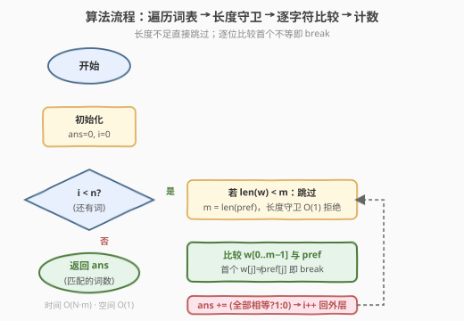

# 统计包含给定前缀的字符串

- **题目名称**：统计包含给定前缀的字符串
- **链接**：[2185. 统计包含给定前缀的字符串](https://leetcode.cn/problems/counting-words-with-a-given-prefix/)
- **难度**：简单
- **标签**：数组、字符串

## 1. 题目概述

给你一个字符串数组 `words` 和一个字符串 `pref`。返回 `words` 中以 `pref` 作为**前缀**的字符串的**数目**。

字符串 `s` 的前缀是 `s` 中从首字符开始的任意**前导连续子串**（例如 `"app"` 是 `"apple"` 的前缀，但不是 `"bpple"` 的前缀）。

**示例 1**：

```text
输入：words = ["pay","attention","practice","attend"], pref = "at"
输出：2
解释：以 "at" 作为前缀的字符串有 2 个："attention" 和 "attend"。
```

**示例 2**：

```text
输入：words = ["leetcode","win","loops","success"], pref = "code"
输出：0
解释：不存在以 "code" 作为前缀的字符串。
```

**约束条件**：

- $1 \le \text{words.length} \le 100$
- $1 \le \text{words[i].length}, \text{pref.length} \le 100$
- `words[i]` 和 `pref` 仅由小写英文字母组成

> 💡 本题的本质是**前缀判定 + 计数**。关键有两点：一是「前缀」必须从**首字符**开始，与一般子串不同；二是先做**长度守卫**（`len(word) < len(pref)` 直接淘汰），再逐字符比较，避免对短词做无意义比较、避免切出子串副本。约束 $n, L \le 100$ 极小，但「长度守卫 + 提前终止」是同类前缀题的通用优化模板。

---

## 2. 解题思路

### 2.1 暴力思路：切出前缀子串再比较

最直白的做法是对每个词切出长度为 $m = \text{len(pref)}$ 的前缀子串，再与 `pref` 比较：

```text
ans = 0
m = len(pref)
for w in words:
    if w[0:m] == pref:   # 切片产生长度为 m 的子串副本
        ans += 1
return ans
```

- **Python**：`w[:m] == pref` 或直接 `w.startswith(pref)`。
- **C++**：`w.substr(0, m) == pref`。

这种写法正确且直观，但 `substr` / 切片会**创建长度为 $m$ 的子串副本**，空间复杂度为 $O(m)$（每个词都要拷贝一次前缀）。题目只问"是否是前缀"，并不需要这个子串本身——**存储它纯属浪费**。此外，未做长度守卫时，对 `len(w) < m` 的短词切片会产生短于 `pref` 的子串（比较自然不等），但切片本身已白做。

> ⚠️ 暴力能过（$n, m \le 100$），但有两处浪费：①短词切片后必然不等，切片白做；②切出子串副本占 $O(m)$ 空间且多一次拷贝。

### 2.2 核心观察：长度守卫 + 逐字符提前终止


**观察一：前缀从首字符开始，长度是硬前提。**

`pref` 是 `word` 的前缀，当且仅当 `word` 的前 $m$ 个字符与 `pref` 逐一相等。这要求 `len(word) >= m`——**长度不足直接淘汰，无需任何字符比较**。这是一次 $O(1)$ 的拒绝，跳过了所有短词的无意义工作：

$$
\text{len}(w) < m \implies w \text{ 不以 } \text{pref} \text{ 为前缀}
$$

**观察二：逐字符比较，首个不等即终止。**

长度足够时，从 $j = 0$ 到 $m - 1$ 逐位比较 `w[j]` 与 `pref[j]`，**遇到第一个不等立即 `break`**。平均情形下，大多数不匹配的词在首位（甚至第二个字符）就被拒绝，每位比较的期望次数远小于 $m$；最坏情形（所有词都以 `pref` 为前缀）才需完整 $m$ 次比较。

> 💡 **为什么逐字符比切片更优**：切片 `w.substr(0, m)` 先无条件拷贝 $m$ 个字符再整体比较，即使首位就不等也已完成全部拷贝；逐字符比较用 $O(1)$ 额外空间，且首位不等时只比 1 次就退出。两者时间上界都是 $O(m)$，但**常数与空间**差异显著。

**边界与特例**：

- **`word == pref`**：长度恰好相等且每位相同，是前缀（前缀可以是整个字符串）。
- **`pref` 比所有词都长**：长度守卫全部命中，答案为 0（如示例 2）。
- **`m = 1`**：只比首字符，等价于"统计首字母为某字符的词数"。

### 2.3 算法流程图



1. **初始化**：`ans = 0`，记录前缀长度 `m = len(pref)`。
2. **遍历每个词** `w`：
   - **长度守卫**：若 `len(w) < m`，跳过该词（`continue`）。
   - **逐字符比较**：`j` 从 $0$ 到 $m-1$，若 `w[j] != pref[j]` 立即 `break` 标记不匹配。
   - **计数**：若全部相等，`ans += 1`。
3. **返回** `ans`。

### 2.4 示例演算

![示例演算：words = ["pay","attention","practice","attend"], pref = "at"](../images/2185_example_walkthrough.svg)

以示例 1 逐步演算，`pref = "at"`，$m = 2$：

| # | word | `len ≥ m`? | 逐位比较 | 是前缀? |
|---|------|-----------|----------|--------|
| 1 | `pay` | $3 \ge 2$ ✓ | `p` vs `a` → 首位不等 ✗ | ✗ 否 |
| 2 | `attention` | $9 \ge 2$ ✓ | `a==a`, `t==t` → 全部相等 ✓ | ✓ 是 |
| 3 | `practice` | $8 \ge 2$ ✓ | `p` vs `a` → 首位不等 ✗ | ✗ 否 |
| 4 | `attend` | $6 \ge 2$ ✓ | `a==a`, `t==t` → 全部相等 ✓ | ✓ 是 |

4 个词中 2 个（`attention`、`attend`）以 `"at"` 为前缀，`ans = 2` ✓

> 💡 注意 `pay` 和 `practice` 都在**首位** `p ≠ a` 就被拒绝，第 2 位无需比较——这正是提前终止的价值。若用切片法，这两个词仍会先切出 `"pa"` / `"pr"` 再整体比较，白白多一次拷贝。

---

## 3. 参考代码

### C++（长度守卫 + 逐字符比较，推荐）

```cpp
class Solution {
  public:
    int prefixCount(vector<string>& words, string pref) {
        int m = pref.size();
        int ans = 0;
        for (const string& w : words) {
            if ((int)w.size() < m) continue;
            bool ok = true;
            for (int i = 0; i < m; ++i) {
                if (w[i] != pref[i]) {
                    ok = false;
                    break;
                }
            }
            if (ok) ++ans;
        }
        return ans;
    }
};
```

> 💡 `const string&` 避免拷贝整个词；长度守卫 `w.size() < m` 用 `(int)` 强转消除有符号比较警告。`break` 让不匹配的词尽早退出内层循环。

### C++（内置 compare，对照参考）

```cpp
class Solution {
  public:
    int prefixCount(vector<string>& words, string pref) {
        int m = pref.size();
        int ans = 0;
        for (const string& w : words) {
            if ((int)w.size() >= m && w.compare(0, m, pref) == 0) {
                ++ans;
            }
        }
        return ans;
    }
};
```

> ⚠️ `w.compare(0, m, pref)` 比较 `w` 从下标 0 起长度 $m$ 的子串与 `pref`，**不创建子串副本**，等价于 `startsWith`。相比 `w.substr(0, m) == pref` 省去 $O(m)$ 拷贝。长度守卫 `w.size() >= m` 短路在前，避免对短词调用 `compare` 越界。

### Python（逐字符比较，推荐）

```python
class Solution:
    def prefixCount(self, words: List[str], pref: str) -> int:
        m = len(pref)
        ans = 0
        for w in words:
            if len(w) < m:
                continue
            match = True
            for i in range(m):
                if w[i] != pref[i]:
                    match = False
                    break
            if match:
                ans += 1
        return ans
```

### Python（startswith 一行流，对照参考）

```python
class Solution:
    def prefixCount(self, words: List[str], pref: str) -> int:
        return sum(w.startswith(pref) for w in words)
```

> ⚠️ **两种写法的对比**：`startswith` 是 CPython 内置方法，C 层实现，**不创建子串副本**且常数极小，工程上是最优解。手写逐字符版意在演示「长度守卫 + 提前终止」的原理。面试时建议先写手撕版讲清思路，再提 `startswith` 作为工程首选。注意 `w[:m] == pref` 这种切片写法会创建子串副本，空间 $O(m)$，不推荐。

---

## 4. 复杂度分析

| 维度 | 复杂度 | 说明 |
|------|--------|------|
| 时间复杂度 | $O(N \cdot m)$，平均远小于 | $N$ 为词数（$\le 100$），$m$ 为 `pref` 长度（$\le 100$）；每个词至多比较 $m$ 个字符；长度守卫跳过短词，提前终止使不匹配词平均比较常数次 |
| 空间复杂度 | $O(1)$ | 仅维护 `ans`、`m`、循环索引等常数变量，不创建任何子串副本 |

> 💡 相比切片法 `w.substr(0, m) == pref` 的 $O(m)$ 空间（每词拷贝前缀），逐字符法把空间压到 $O(1)$。数据规模 $N, m \le 100$ 极小，性能差异在工程上可忽略，但逐字符法更体现对「前缀 = 逐位比较」本质的利用。

---

## 5. 扩展：多次前缀查询的 Trie 优化

本题只需回答**一次**前缀查询，$O(N \cdot m)$ 扫描足够。若要在**同一批词**上回答**大量**前缀查询（如 $Q$ 次），逐次扫描总代价 $O(Q \cdot N \cdot m)$ 会重复遍历词表。此时可用 **Trie（前缀树）** 预处理：

- **建树**：将所有词插入 Trie，每个节点记录经过该节点的词数 `cnt`。建树代价 $O(\sum \text{len}(w))$。
- **查询**：沿 `pref` 的字符向下走 $m$ 步，若中途节点缺失则答案为 0；否则返回终点节点的 `cnt`——即所有以 `pref` 为前缀的词数。单次查询 $O(m)$。

总代价 $O(\sum \text{len}(w) + Q \cdot m)$，当 $Q$ 较大时远优于 $O(Q \cdot N \cdot m)$。

> ⚠️ Trie 的代价是额外的 $O(\sum \text{len}(w))$ 空间与建树时间。**单次查询场景下引入 Trie 反而更慢**（建树本身就要遍历所有词）。本题 $Q = 1$、$N \le 100$，直接扫描是最优选择——「先写对，再优化」是简单题的正确策略。

---

## 6. 面试要点

1. **前缀和子串有什么区别？**

   - 前缀必须从字符串的**首字符**开始，是"前导连续子串"；子串可在**任意位置**起始。因此前缀判定只需比较 `word` 的前 $m$ 个字符与 `pref`，无需在 `word` 中搜索 `pref` 的出现位置（那是子串匹配，如 KMP）。

2. **为什么先比长度再比字符？**

   - 长度守卫是 $O(1)$ 的拒绝：`len(word) < len(pref)` 时 `pref` 不可能是前缀（前缀长度不能超过原串），直接跳过，避免对短词做无意义的字符比较或切片。这是面试中体现"利用问题结构剪枝"的细节。

3. **`substr` 切片和逐字符比较（或 `compare`/`startswith`）的区别？**

   - `substr(0, m)` 会创建长度为 $m$ 的子串**副本**，空间 $O(m)$ 且多一次拷贝，即使首位不等也已完成全部拷贝。逐字符比较 / `compare` / `startswith` 用 $O(1)$ 额外空间，且首位不等时只比 1 次就退出。两者时间上界都是 $O(m)$，但空间与常数差异显著。

4. **逐字符比较时 `break` 有什么意义？**

   - 不匹配的词往往在**前几位**就出现差异（极端情形如首位不等），`break` 让内层循环从 $O(m)$ 降到接近 $O(1)$。最坏情形（所有词都匹配）才需完整 $m$ 次比较。平均性能显著优于"无脑比较完 $m$ 位"。

5. **如果要支持多次前缀查询如何优化？**

   - 用 Trie 预处理：建树 $O(\sum \text{len}(w))$，每次查询沿 `pref` 走 $m$ 步取终点 `cnt`，单次 $O(m)$。适合查询次数 $Q$ 较大的场景。本题 $Q = 1$、$N \le 100$，直接扫描即可，引入 Trie 反而增加建树开销。

---

## 7. 同类练习题

- [14. 最长公共前缀](https://leetcode.cn/problems/longest-common-prefix/)：找多个字符串的公共前缀，逐位纵向扫描比较，前缀判定的基础题
- [1455. 检查单词是否为句中其他单词的前缀](https://leetcode.cn/problems/check-if-a-word-occurs-as-a-prefix-of-any-word-in-a-sentence/)：在句子中查找给定为某词前缀的单词，同为本题"前缀判定"的变体
- [2255. 统计是给定字符串前缀的子字符串数](https://leetcode.cn/problems/count-prefixes-of-a-given-string/)：方向反过来——统计 words 中哪些是给定字符串的前缀，前缀判定的镜像题
- [208. 实现 Trie](https://leetcode.cn/problems/implement-trie-prefix-tree/)：前缀查询的标准数据结构，是本题第 5 节多次查询优化的落地
- [720. 词典中最长的单词](https://leetcode.cn/problems/longest-word-in-dictionary/)：在词典中找由逐字母前缀构成的最长词，前缀判定的综合应用
