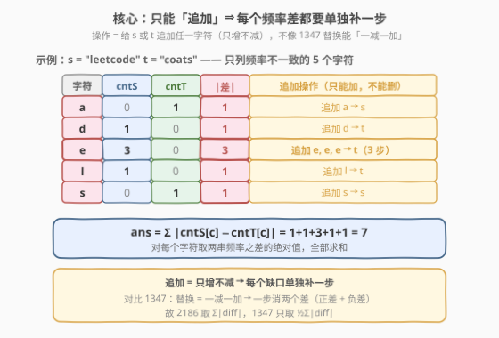
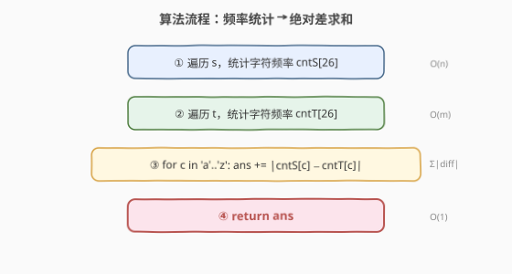
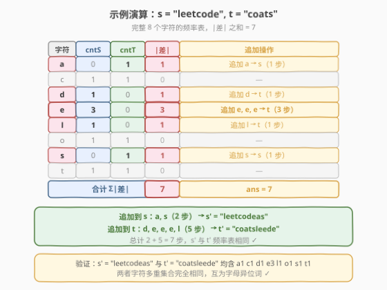
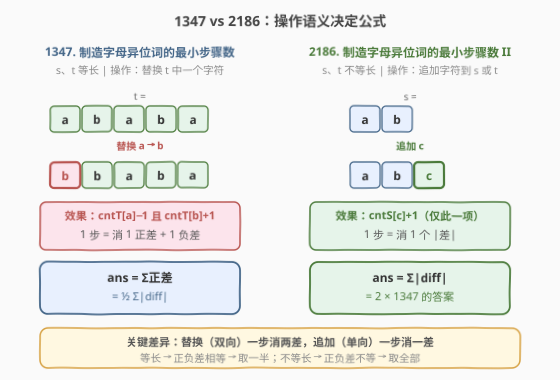

# 制造字母异位词的最小步骤数II

- **题目名称**：制造字母异位词的最小步骤数II
- **链接**：[2186. 制造字母异位词的最小步骤数 II](https://leetcode.cn/problems/minimum-number-of-steps-to-make-two-strings-anagram-ii/)
- **难度**：中等
- **标签**：哈希表、字符串、计数

## 1. 题目概述

给你两个字符串 `s` 和 `t`。在一步操作中，你可以给 `s` 或者 `t` **追加任一字符**。返回使 `s` 和 `t` **互为字母异位词**所需的最少步骤数。

> **字母异位词**指字母相同但顺序不同（或者相同）的字符串。换言之，两个字符串互为字母异位词，当且仅当它们**每种字符的出现次数完全相同**——只看多重集合，不看顺序。

**示例 1**：

```text
输入：s = "leetcode", t = "coats"
输出：7
解释：
- 执行 2 步操作，将 "as" 追加到 s = "leetcode" 中，得到 s = "leetcodeas"。
- 执行 5 步操作，将 "leede" 追加到 t = "coats" 中，得到 t = "coatsleede"。
"leetcodeas" 和 "coatsleede" 互为字母异位词。
总共用去 2 + 5 = 7 步。
```

**示例 2**：

```text
输入：s = "night", t = "thing"
输出：0
解释：给出的字符串已经互为字母异位词，不需要任何操作。
```

**约束条件**：

- $1 \le \text{s.length},\, \text{t.length} \le 2 \times 10^5$
- `s` 和 `t` 由小写英文字母组成

> 💡 本题是 [1347. 制造字母异位词的最小步骤数](../1301-1400/1347_制造字母异位词的最小步骤数.md) 的续作。1347 中 `s`、`t` **等长**且操作是「替换 `t` 中一个字符」（一减一加），答案是 $\sum\text{正差}$；2186 中 `s`、`t` **不等长**且操作是「追加字符到 `s` 或 `t`」（只增不减），答案变为 $\sum|\text{差}|$。一字之差，公式翻倍——根源在于操作语义从「双向」变成了「单向」。

---

## 2. 解题思路

### 2.1 暴力思路：逐字符模拟追加

最直观的做法是**模拟**：反复检查 `s` 和 `t` 是否互为字母异位词，若不是则尝试追加某个字符，直到满足条件。但这里立刻遇到两个障碍——

- **分支爆炸**：每一步可以选择「追加 26 种字符之一到 `s`」或「追加 26 种字符之一到 `t`」，共 52 个分支。最坏情况需要追加 $O(n + m)$ 步，搜索树规模达 $52^{n+m}$，完全不可行。
- **无法贪心逐步判定**：某一步该追加哪个字符，取决于全局频率差而非当前位置。逐字符模拟无法在局部做出最优决策。

> ⚠️ 暴力模拟的根源在于**没有把「顺序无关」这一性质提炼出来**——既然字母异位词只比字符频次、不比顺序，就该直接在频率层面做差，而不是在字符串层面逐步搜索。这与 1347 的思路完全一致：先退化到频率表，再在频率表上求解。

### 2.2 核心观察：只能追加 ⇒ 每个频率差单独补一步



**关键洞察**：操作是「追加字符」（**只增不减**），因此对于每个字符 $c$：

- `s` 中 $c$ 的个数 $\text{cntS}[c]$ 只能**增加**，不能减少；
- `t` 中 $c$ 的个数 $\text{cntT}[c]$ 同理只能**增加**；
- 要使两串对 $c$ 的计数相同，**双方都必须达到** $\max(\text{cntS}[c],\, \text{cntT}[c])$。

于是字符 $c$ 需要追加的次数为：

$$
\big(\max(\text{cntS}[c],\,\text{cntT}[c]) - \text{cntS}[c]\big) + \big(\max(\text{cntS}[c],\,\text{cntT}[c]) - \text{cntT}[c]\big) = |\text{cntS}[c] - \text{cntT}[c]|
$$

对所有字符求和，总步数即：

$$
\text{ans} = \sum_{c} |\text{cntS}[c] - \text{cntT}[c]|
$$

> 💡 **与 1347 的关键差异**：1347 的操作是「替换」（一减一加），一步同时消去一个正差和一个负差，故答案 $= \sum\text{正差} = \frac{1}{2}\sum|\text{diff}|$。2186 的操作是「追加」（只增不减），一步只补一个缺口，故答案 $= \sum|\text{diff}|$。当 `s`、`t` 等长时，2186 的答案恰好是 1347 的两倍。

> ⚠️ **为什么这是最小步数？** 对每个字符 $c$，$|\text{cntS}[c] - \text{cntT}[c]|$ 是 $c$ 的频率差的**绝对下界**——追加操作只能增加计数，无法减少，所以少的一方必须追上多的一方，差多少就补多少。每个字符的补齐互相独立（追加 $c$ 不影响 $d$ 的计数），故总下界 $= \sum|\text{diff}|$。而上述构造（对每个字符，向少的一方追加差额）恰好用这么多步达成，下界即最优。

### 2.3 算法流程图



1. **统计 `s` 频率**：遍历 `s`，得 `cntS[c]`；
2. **统计 `t` 频率**：遍历 `t`，得 `cntT[c]`；
3. **累加绝对差**：对每个字符 `c`，`ans += |cntS[c] - cntT[c]|`；
4. **返回** `ans`。

> 💡 **可合并为一个 diff 数组**：只需一个 `diff[26]` 数组——遍历 `s` 时 `diff[c]++`，遍历 `t` 时 `diff[c]--`，最后 `diff[c] = cntS[c] - cntT[c]`。取绝对值求和即答案。一次遍历 `s`、一次遍历 `t`、一次遍历 26 个字母，共 $O(n + m + |\Sigma|) = O(n + m)$。

### 2.4 示例演算

以示例 1 的 `s = "leetcode"`、`t = "coats"` 为例：



先统计频率：

| 字符 | cntS | cntT | \|差\| | 追加操作 |
|------|------|------|--------|----------|
| a | 0 | 1 | 1 | 追加 a → s（1 步） |
| c | 1 | 1 | 0 | — |
| d | 1 | 0 | 1 | 追加 d → t（1 步） |
| e | 3 | 0 | 3 | 追加 e×3 → t（3 步） |
| l | 1 | 0 | 1 | 追加 l → t（1 步） |
| o | 1 | 1 | 0 | — |
| s | 0 | 1 | 1 | 追加 s → s（1 步） |
| t | 1 | 1 | 0 | — |

$\text{ans} = 1+0+1+3+1+0+1+0 = 7$

**追加方案**：

- **追加到 `s`**：`a`、`s`（2 步）→ `s' = "leetcodeas"`
- **追加到 `t`**：`d`、`e`、`e`、`e`、`l`（5 步）→ `t' = "coatsleede"`
- **验证**：`s'` 与 `t'` 均含 `a1 c1 d1 e3 l1 o1 s1 t1`，字符多重集合完全相同，互为字母异位词 ✓

> 💡 **追加到哪一串？** 对每个字符 $c$，若 $\text{cntS}[c] < \text{cntT}[c]$，则向 `s` 追加（补 `s` 的缺口）；若 $\text{cntS}[c] > \text{cntT}[c]$，则向 `t` 追加（补 `t` 的缺口）。方向不影响步数——差多少就补多少，补到哪一串都行。

---

## 3. 参考代码

### C++（diff 数组版，推荐）

```cpp
class Solution {
public:
    int minSteps(string s, string t) {
        int diff[26] = {0};                   // diff[c] = cntS[c] - cntT[c]
        for (char c : s) diff[c - 'a']++;     // ① s 的字符记为正
        for (char c : t) diff[c - 'a']--;     // ② t 的字符记为负
        int ans = 0;
        for (int i = 0; i < 26; ++i)          // ③ 累加绝对差
            ans += abs(diff[i]);
        return ans;
    }
};
```

> 💡 用一个 `diff` 数组同时承载两张频率表：`s` 贡献 $+1$、`t` 贡献 $-1$，遍历完后 `diff[c] = cntS[c] - cntT[c]`。取 `abs` 求和即 $\sum|\text{diff}|$，无需维护两个独立数组。

### Python（diff 数组版）

```python
class Solution:
    def minSteps(self, s: str, t: str) -> int:
        diff = [0] * 26                        # diff[c] = cntS[c] - cntT[c]
        for c in s:
            diff[ord(c) - 97] += 1             # ① s 的字符记为正
        for c in t:
            diff[ord(c) - 97] -= 1             # ② t 的字符记为负
        return sum(abs(x) for x in diff)       # ③ 累加绝对差
```

### Python（Counter 版，简洁写法）

```python
from collections import Counter

class Solution:
    def minSteps(self, s: str, t: str) -> int:
        diff = Counter(s)
        diff.subtract(t)                       # diff = cntS - cntT（保留负值）
        return sum(abs(v) for v in diff.values())
```

> ⚠️ **`Counter.subtract` vs `Counter` 相减**：`Counter(s) - Counter(t)` 使用 `__sub__`，会**丢弃非正项**（只保留 `cntS[c] > cntT[c]` 的字符），适合 1347（只需正差之和）。`Counter.subtract` 使用 `subtract` 方法，**保留负值**，适合 2186（需要全部绝对差之和）。两者不可混用。

---

## 4. 复杂度分析

| 维度 | diff 数组（推荐） | 暴力模拟 |
|------|-------------------|----------|
| 时间复杂度 | $O(n + m + |\Sigma|) = O(n + m)$（$|\Sigma|=26$ 为常数） | $O(52^{n+m})$（指数级，不可行） |
| 空间复杂度 | $O(|\Sigma|) = O(1)$（26 个字母的计数数组） | $O(n + m)$（搜索状态） |
| 实际运算量 | $n=m=2\times10^5$ 时约 $4\times10^5$ 次加减 + 26 次取绝对值 | 不可行 |

> 💡 **已是理论最优**：至少要读完 `s` 和 `t` 才能知道频率，故 $\Omega(n + m)$ 不可避免。当前解法时间 $O(n + m)$、空间 $O(1)$，已达理论下界。

---

## 5. 扩展：与 1347 的对比——操作语义决定公式



1347 与 2186 是同一问题的两个变体，核心差异在于**操作语义**：

| 维度 | 1347（I） | 2186（II） |
|------|-----------|------------|
| **操作** | 替换 `t` 中一个字符 | 追加字符到 `s` 或 `t` |
| **操作效果** | $\text{cntT}[\text{旧}] - 1$ 且 $\text{cntT}[\text{新}] + 1$ | $\text{cntS/T}[c] + 1$（仅此一项） |
| **一步消几个差** | 2 个（1 正差 + 1 负差） | 1 个 |
| **等长约束** | $s$、$t$ 等长 | 不要求 |
| **正负差关系** | 等长 $\Rightarrow \sum\text{正差} = \sum|\text{负差}|$ | 无保证 |
| **公式** | $\text{ans} = \sum\text{正差} = \frac{1}{2}\sum|\text{diff}|$ | $\text{ans} = \sum|\text{diff}|$ |

**代数推导**：设 $\text{diff}[c] = \text{cntT}[c] - \text{cntS}[c]$（1347 定义）或 $\text{diff}[c] = \text{cntS}[c] - \text{cntT}[c]$（2186 定义），记 $P = \sum_{\text{diff}>0} \text{diff}$（正差之和），$N = \sum_{\text{diff}<0} |\text{diff}|$（负差绝对值之和）。

- **1347**：等长保证 $P = N$。一次替换消去 1 正差 + 1 负差，故 $\text{ans} = P = \frac{P+N}{2} = \frac{1}{2}\sum|\text{diff}|$。
- **2186**：一次追加只补一个缺口（正差或负差之一），故 $\text{ans} = P + N = \sum|\text{diff}|$。

> 💡 **当 `s`、`t` 等长时**，$P = N$，2186 的答案 $= P + N = 2P = 2 \times 1347\text{ 的答案}$。即「只追加」比「可替换」恰好多一倍步数——因为追加是单向操作，无法像替换那样「一减一加」一步消两个差。

> ⚠️ **若 2186 允许删除**：如果操作改为「追加或删除任一字符」，则退化为 1347 的等价问题——每个字符的目标计数可以是 $[\min(\text{cntS}[c], \text{cntT}[c]),\, \max(\text{cntS}[c], \text{cntT}[c])]$ 中的任意值，最优取 $\min$（删除多出的比追加少出的更省步），答案 $= \sum|\text{diff}| - \min(P, N) \times 2$。但本题不允许删除，故直接取 $\sum|\text{diff}|$。

---

## 6. 面试要点

1. **怎么想到用频率差的？**

   > 字母异位词的定义就是「字符多重集合相同」，即每种字符的出现次数完全一致。既然只比频次、不比顺序，问题自然从「字符串层面」退化到「频率表层面」。两串的频率差就是偏差量，需要通过操作消除。这是所有字母异位词家族问题的通用范式。

2. **为什么答案是 $\sum|\text{diff}|$ 而不是 $\sum\text{正差}$（1347 的公式）？**

   > 1347 的操作是「替换」，一次替换同时改变两个字符的频次（一个 $-1$、一个 $+1$），所以一步消去一个正差和一个负差。等长保证正负差相等，取正差之和即可。2186 的操作是「追加」，一次只改变一个字符的频次（$+1$），所以一步只消一个差。正差和负差各自独立累加，总步数 $= \sum|\text{diff}|$。

3. **为什么这是最小步数？能更少吗？**

   > 不能。对每个字符 $c$，$|\text{cntS}[c] - \text{cntT}[c]|$ 是不可压缩的下界——追加只能增加计数，少的一方必须追上多的一方，差多少补多少。不同字符的补齐互相独立（追加 $c$ 不影响 $d$），故总下界 $= \sum|\text{diff}|$。构造性方案恰好达到此下界，故为最优。

4. **如何用一个数组代替两个频率表？**

   > 维护一个 `diff[26]` 数组：遍历 `s` 时 `diff[c]++`，遍历 `t` 时 `diff[c]--`。遍历完后 `diff[c] = cntS[c] - cntT[c]`，取 `abs` 求和即答案。这样只需一个数组、两次遍历，常数更小。Python 中也可用 `Counter(s).subtract(t)` 实现，但注意用 `subtract` 方法（保留负值）而非 `-` 运算符（丢弃非正项）。

5. **如果操作改为「可以追加也可以删除」，答案会变吗？**

   > 会变小。若允许删除，则对每个字符 $c$，目标计数可以取 $\min(\text{cntS}[c], \text{cntT}[c])$ 而非 $\max$——多出的一方直接删除，比让少的一方追上来得更省。此时答案 $= \sum|\text{diff}| - \min(P, N) \times 2$，其中 $P$、$N$ 分别是正差和与负差绝对值和。当 `s`、`t` 等长时 $P = N$，退化为 $1347$ 的 $\sum\text{正差}$。

> 💡 **一句话总结**：2186 的灵魂是「**只能追加 → 每个频率差单独补一步 → $\sum|\text{diff}|$**」。用一个 `diff` 数组同时承载 `cntS` 与 `cntT`（`s` 加、`t` 减），取绝对值求和即得最少步数。$O(n+m)$ 时间、$O(1)$ 空间，已是理论最优。与 1347 的差异纯粹来自操作语义：替换（双向）一步消两差，追加（单向）一步消一差。

---

## 7. 同类练习题

- [1347. 制造字母异位词的最小步骤数](https://leetcode.cn/problems/minimum-number-of-steps-to-make-two-strings-anagram/)（[题解](../1301-1400/1347_制造字母异位词的最小步骤数.md)）：本题的前作，`s`、`t` 等长且操作为替换（一减一加），答案 $= \sum\text{正差} = \frac{1}{2}\sum|\text{diff}|$，对照 2186 的 $\sum|\text{diff}|$——操作语义决定公式的最佳对照
- [242. 有效的字母异位词](https://leetcode.cn/problems/valid-anagram/)：字母异位词家族的判定版，只比较 `cntS == cntT` 是否成立（布尔输出），对照 2186 的「算频率差之和」（整数输出）——判定版 vs 量化版
- [383. 赎金信](https://leetcode.cn/problems/ransom-note/)：同为「频率差判定」，但问 `ransomNote` 能否由 `magazine` 的字符拼出（即 `cntR[c] <= cntM[c]` 对所有 $c$），对照 2186 的「双向对齐」——单向够用 vs 双向补齐
- [451. 根据字符出现频率排序](https://leetcode.cn/problems/sort-characters-by-frequency/)：同为「频率统计 + 字符串改造」，但目标是按频率降序重排输出，对照 2186 的「频率差求和」——频率驱动的不同下游用途
- [1657. 确定两个字符串是否接近](https://leetcode.cn/problems/determine-if-two-strings-are-close/)：字母异位词的变体，允许「交换任意两字符」和「将某字符全部替换为另一字符」，判定两串能否通过这些操作变得相等——频率集合 + 多重集合比较的进阶组合
