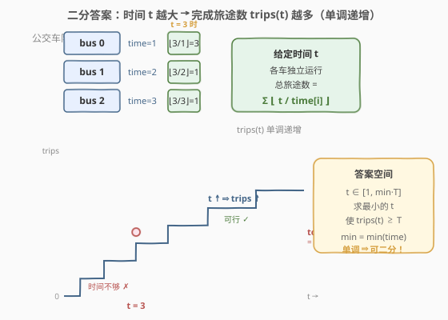
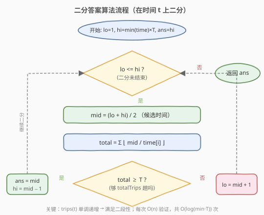

# 完成旅途的最少时间

- **题目名称**：完成旅途的最少时间
- **链接**：[2187. 完成旅途的最少时间](https://leetcode.cn/problems/minimum-time-to-complete-trips/)
- **难度**：中等
- **标签**：数组、二分查找

## 1. 题目概述

给你一个数组 `time`，其中 `time[i]` 表示第 `i` 辆公交车完成**一趟旅途**所需要花费的时间。每辆公交车可以**连续**完成多趟旅途（当前旅途完成后立马开始下一趟），且各车**独立运行**、互不影响。

给定整数 `totalTrips`，表示所有公交车**总共**需要完成的旅途数目。返回完成**至少** `totalTrips` 趟旅途需要花费的**最少**时间。

**示例 1**：

```text
输入：time = [1,2,3], totalTrips = 5
输出：3
解释：
- 时刻 t = 1，各车完成旅途数 [1,0,0]，总计 1。
- 时刻 t = 2，各车完成旅途数 [2,1,0]，总计 3。
- 时刻 t = 3，各车完成旅途数 [3,1,1]，总计 5。
所以总共完成至少 5 趟旅途的最少时间为 3。
```

**示例 2**：

```text
输入：time = [2], totalTrips = 1
输出：2
解释：只有一辆公交车，它在时刻 t = 2 完成第一趟旅途。
```

**约束条件**：

- `1 <= time.length <= 10^5`
- `1 <= time[i], totalTrips <= 10^7`

---

## 2. 解题思路

### 2.1 暴力思路

时间 `t` 的取值范围是 `[1, min(time) × totalTrips]`：

- 下界 `1`：时间至少为 1。
- 上界 `min(time) × totalTrips`：只让最快的车（`time[i] = min(time)`）独立跑完全部 `totalTrips` 趟，耗时 `min(time) × totalTrips`，必然可行。

从 `t = 1` 开始逐个尝试，对每个 `t` 计算所有车在 `t` 时刻完成的旅途总数 $\sum \lfloor t / \text{time}[i] \rfloor$，第一个满足总数 `>= totalTrips` 的 `t` 即为答案。验证单个 `t` 是 `O(n)`，整体 `O(n × min(time) × totalTrips)`，而上界可达 `10^7 × 10^7 = 10^14`，必然超时。

### 2.2 核心观察：二分答案



关键直觉是：**完成旅途数 `trips(t)` 关于时间 `t` 单调递增**。

- `t` 越大，每辆车能跑的趟数越多，总旅途数越多。
- `t = 0` 时所有车都没跑完一趟，`trips = 0`；`t = min(time) × totalTrips` 时最快的车独自跑完全部，`trips >= totalTrips`，必然可行。

于是存在一个**分界点** `t*`：

```text
t < t*  → trips(t) < totalTrips   (时间不够，跑不完)
t >= t* → trips(t) >= totalTrips  (可行，跑得完)
```

这正是二分查找所需的**二段性**。把「求最小可行 `t`」转化为：在有序区间 `[1, min(time) × totalTrips]` 上二分，每次 `O(n)` 验证 `mid` 是否可行，可行则去左半找更小的，不可行则去右半加大时间。

> 💡 **识别信号**：题目求「最小的最大 / 最大的最小 / 最小的满足某单调条件值」，且能 `O(n)` 验证某个候选值是否合法 → 想「二分答案」。这是与「在有序数组里二分找下标」不同的另一类二分：**二分的是答案本身**。和 [875. 爱吃香蕉的珂珂](../0801-0900/875_爱吃香蕉的珂珂.md) 是同一套模板，只是 `check()` 从「向上取整求和」换成了「向下取整求和」。

> ⚠️ **上界取 `min(time) × totalTrips`**：只让最快的车跑完全部旅途就够，这是最紧的合法上界。取更松的值（如 `max(time) × totalTrips` 或 `10^14`）只增加几次无效二分，不影响正确性。注意 `min(time) × totalTrips` 可达 `10^14`，C++ 中必须用 `long long`。

### 2.3 算法流程图



注意判定为「可行」时**先记录 `ans = mid` 再收缩右界**（`hi = mid - 1`），保证最终保留的是「最小的可行值」。

### 2.4 示例演算

![示例演算：time = [1,2,3], totalTrips = 5](../images/trips_example_walkthrough.svg)

以 `time = [1,2,3]`、`totalTrips = 5` 为例，`min(time) = 1`，答案区间 `[1, 1×5] = [1, 5]`：

- **第 1 轮** `[1,5]`，`mid=3`，`trips = ⌊3/1⌋ + ⌊3/2⌋ + ⌊3/3⌋ = 3+1+1 = 5 ≥ 5` ✓ → 可行，记 `ans=3`，去左半 `[1,2]`。
- **第 2 轮** `[1,2]`，`mid=1`，`trips = 1+0+0 = 1 < 5` ✗ → 时间不够，去右半 `[2,2]`。
- **第 3 轮** `[2,2]`，`mid=2`，`trips = 2+1+0 = 3 < 5` ✗ → 时间不够，`lo=3`。
- **第 4 轮** `lo=3 > hi=2`，循环结束，返回 `ans=3`。

---

## 3. 参考代码

### C++

```cpp
class Solution {
  public:
    long long minimumTime(vector<int>& time, int totalTrips) {
        long long lo = 1;
        long long hi = (long long)(*min_element(time.begin(), time.end())) * totalTrips;
        long long ans = hi;

        while (lo <= hi) {
            long long mid = lo + (hi - lo) / 2;
            if (canFinish(time, mid, totalTrips)) {
                ans = mid;       // 可行，尝试更短时间
                hi = mid - 1;
            } else {
                lo = mid + 1;    // 时间不够，加大
            }
        }
        return ans;
    }

  private:
    // 验证：时间 t 内所有车完成的旅途总数是否 >= totalTrips
    bool canFinish(const vector<int>& time, long long t, int totalTrips) {
        long long total = 0;
        for (int ti : time) {
            total += t / ti;
            if (total >= totalTrips) return true;  // 提前退出，防溢出
        }
        return total >= totalTrips;
    }
};
```

### Python

```python
class Solution:
    def minimumTime(self, time: List[int], totalTrips: int) -> int:
        lo, hi = 1, min(time) * totalTrips
        ans = hi

        while lo <= hi:
            mid = (lo + hi) // 2
            if self._can_finish(time, mid, totalTrips):
                ans = mid       # 可行，尝试更短时间
                hi = mid - 1
            else:
                lo = mid + 1    # 时间不够，加大
        return ans

    def _can_finish(self, time: List[int], t: int, totalTrips: int) -> bool:
        total = 0
        for ti in time:
            total += t // ti
            if total >= totalTrips:  # 提前退出，防溢出
                return True
        return total >= totalTrips
```

> ⚠️ **两个易错点**：
> 1. **溢出**：`min(time) × totalTrips` 可达 `10^7 × 10^7 = 10^14`，超过 32 位 `int` 上界（约 `2.1 × 10^9`）。C++ 中 `hi` 和 `mid` 必须用 `long long`，且计算上界时先强转再乘。
> 2. **`check()` 提前退出**：`t / time[i]` 在 `time[i] = 1` 时可达 `10^14`，`n` 辆车累加可达 `10^19`，超过 `long long` 上界。一旦 `total >= totalTrips` 就立即返回 `true`，避免无意义的继续累加导致溢出。

---

## 4. 复杂度分析

| 维度 | 复杂度 | 说明 |
|------|--------|------|
| 时间复杂度 | O(n log M) | `M = min(time) × totalTrips`；二分 `O(log M)` 次，每次验证 `O(n)` |
| 空间复杂度 | O(1) | 仅用常数额外变量 |

> 💡 由于 `time[i], totalTrips <= 10^7`，`M <= 10^14`，`log M ≈ 47`，`n <= 10^5`，总运算量约 `4.7 × 10^6`，远低于时限。

---

## 5. 扩展：与 875 / 1011 的对照

本题是「二分答案」的经典变体，与 [875. 爱吃香蕉的珂珂](../0801-0900/875_爱吃香蕉的珂珂.md)、[1011. 在 D 天内送达包裹的能力](../1001-1100/1011_在D天内送达包裹的能力.md) 骨架完全一致——都是「二分答案 + 单调性验证」。三题的差别仅在 `check()` 和单调方向：

| 题目 | 二分对象 | `check()` | 单调方向 | 求什么 |
|------|----------|-----------|----------|--------|
| 875 | 速度 `k` | $\sum \lceil \text{piles}[i] / k \rceil \leq h$ | `k ↑ ⇒ hours ↓` 递减 | 最小 `k` |
| 1011 | 运力 `cap` | 贪心装船天数 `<= days` | `cap ↑ ⇒ days ↓` 递减 | 最小 `cap` |
| **2187** | **时间 `t`** | $\sum \lfloor t / \text{time}[i] \rfloor \geq T$ | **`t ↑ ⇒ trips ↑` 递增** | **最小 `t`** |

> 💡 875 和 1011 的验证函数是「总量 $\leq$ 阈值」，单调递减；本题是「总量 $\geq$ 阈值」，单调递增。但二分框架不变：都是可行时记录 `ans` 并向左收缩、不可行时向右扩张。关键是识别出 `check(mid)` 的单调性并确定收缩方向。

> ⚠️ **向下取整 vs 向上取整**：875 中吃一堆香蕉不足 `k` 根也要占一小时，用 $\lceil \cdot \rceil$；本题中时间 `t` 内一趟没跑完就不计入，用 $\lfloor \cdot \rfloor$。两者都是整数除法，C++ 中 `/` 天然向下取整，875 需用 `(p + k - 1) / k` 实现向上取整。

---

## 6. 面试要点

1. **为什么能二分？二段性体现在哪？**

   - `trips(t)` 随 `t` 单调递增。存在分界点 `t*`，使 `t < t*` 时跑不完、`t >= t*` 时跑得完。这种「左不合法 / 右合法」的结构就是二段性，可用二分定位 `t*`。

2. **上下界为什么是 `1` 和 `min(time) × totalTrips`？**

   - 下界：时间至少为 1（`time[i] >= 1`，跑完一趟至少需要 1 单位时间）。也可取更紧的下界 `min(time)`（最快的车跑 1 趟的时间），但 `1` 更简洁，多几次二分可忽略。
   - 上界：只让最快的车独立跑完全部 `totalTrips` 趟，耗时 `min(time) × totalTrips`，此时 `trips >= totalTrips` 必然成立。取更松的值（如 `max(time) × totalTrips`）不影响正确性，只浪费几次二分。

3. **`check()` 为什么需要提前退出？**

   - 当 `t` 很大而 `time[i]` 很小时，`t / time[i]` 可达 `10^14`，`n` 辆车累加可达 `10^19`，超过 `long long` 上界（约 `9.2 × 10^18`）。一旦 `total >= totalTrips` 就立即返回 `true`，避免溢出。这是本题区别于 875 的关键细节——875 的上界是 `max(piles) <= 10^9`，溢出风险小；本题上界达 `10^14`，必须防范。

4. **`min(time) × totalTrips` 溢出怎么处理？**

   - C++ 中先强转为 `long long` 再乘：`(long long)min_time * totalTrips`。若不先转，`int × int` 在乘法阶段就已溢出，强转结果仍是错误值。Python 整数无上限无此问题。

5. **如果 `time.length == 1`，答案是什么？**

   - 只有一辆车时，它必须跑完所有 `totalTrips` 趟，答案为 `time[0] × totalTrips`。可作为快速边界判断，跳过二分。

---

## 7. 同类练习题

- [875. 爱吃香蕉的珂珂](https://leetcode.cn/problems/koko-eating-bananas/)：同模板，二分吃香蕉速度 `k`，`check` 用向上取整求和，求最小可行 `k`
- [1011. 在 D 天内送达包裹的能力](https://leetcode.cn/problems/capacity-to-ship-packages-within-d-days/)：同模板，二分船的运载能力，`check` 用贪心按天装货
- [410. 分割数组的最大值](https://leetcode.cn/problems/split-array-largest-sum/)：二分「最大子数组和」上限，`check` 贪心划分子数组
- [2064. 分配给商店的最小商品数量](https://leetcode.cn/problems/minimized-maximum-of-products-distributed-to-any-store/)：最大化最小值的二分答案，`check` 统计所需商店数
- [2141. 同时运行 N 台电脑的最长时间](https://leetcode.cn/problems/maximum-running-time-of-n-computers/)：二分答案 + 贪心验证，求最大可运行时间（方向相反：求最大可行值）
