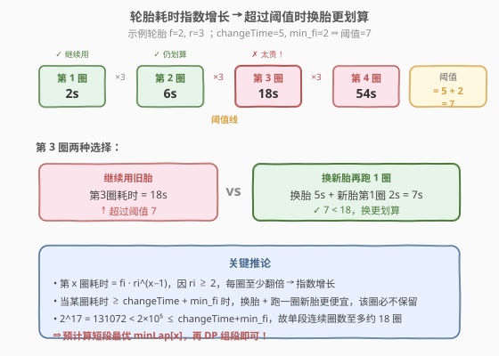
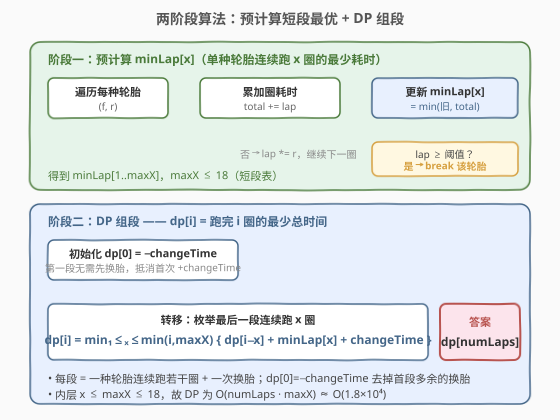
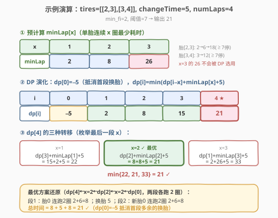

# LeetCode 完成比赛的最少时间 题解

## 1. 题目概述

- **标题 / 题号**：完成比赛的最少时间（#2188，hard）
- **链接**：https://leetcode.cn/problems/minimum-time-to-finish-the-race/
- **难度**：困难
- **标签**：动态规划、数组、数学

**题意**：给你一个下标从 0 开始的二维整数数组 `tires`，其中 `tires[i] = [fi, ri]` 表示第 `i` 种轮胎如果**连续使用**，第 `x` 圈需要耗时 $f_i \cdot r_i^{\,x-1}$ 秒。

- 例如 $f_i = 3,\; r_i = 2$ 时，第 1 圈 3 秒、第 2 圈 $3 \times 2 = 6$ 秒、第 3 圈 $3 \times 2^2 = 12$ 秒，依次类推。

同时给你整数 `changeTime` 和 `numLaps`。比赛共 `numLaps` 圈，可选任意一种轮胎开始；每种轮胎都有无数条。每圈后可耗费 `changeTime` 秒**换成**任意一种轮胎（也可换同种新轮胎）。返回完成比赛的**最少**时间。

**示例 1**：

```text
输入：tires = [[2,3],[3,4]], changeTime = 5, numLaps = 4
输出：21
解释：
第 1 圈：轮胎 0，耗时 2 秒。
第 2 圈：继续轮胎 0，耗时 2*3 = 6 秒。
第 3 圈：耗费 5 秒换新轮胎 0，再耗时 2 秒。
第 4 圈：继续轮胎 0，耗时 2*3 = 6 秒。
总耗时 = 2 + 6 + 5 + 2 + 6 = 21。
```

**示例 2**：

```text
输入：tires = [[1,10],[2,2],[3,4]], changeTime = 6, numLaps = 5
输出：25
解释：
第 1 圈：轮胎 1，耗时 2 秒。
第 2 圈：继续轮胎 1，耗时 2*2 = 4 秒。
第 3 圈：耗费 6 秒换新轮胎 1，再耗时 2 秒。
第 4 圈：继续轮胎 1，耗时 2*2 = 4 秒。
第 5 圈：耗费 6 秒换轮胎 0，再耗时 1 秒。
总耗时 = 2 + 4 + 6 + 2 + 4 + 6 + 1 = 25。
```

**约束**：

- $1 \le \text{tires.length} \le 10^5$
- $\text{tires[i].length} = 2$
- $1 \le f_i, \text{changeTime} \le 10^5$
- $2 \le r_i \le 10^5$
- $1 \le \text{numLaps} \le 1000$

## 2. 解题思路

### 2.1 暴力思路

直觉上，每圈要么继续用当前轮胎、要么换胎，看似是一道关于「每圈决策」的 DP。但状态要记录「当前用的是哪种轮胎」和「已连续跑了多少圈」：前者有 $10^5$ 种、后者最多 1000，状态空间爆炸。

另一种朴素想法是枚举每一段连续使用同一条轮胎的圈数 $x$，对所有轮胎求该段耗时再取最小，最后用 DP 组段。但若不限制 $x$ 的上界，单段耗时 $f_i \cdot r_i^{\,x-1}$ 指数膨胀，$x$ 到 1000 时数值天文级，既算不动也无意义。

> 💡 突破口在于**指数增长**本身：$r_i \ge 2$ 意味着每圈耗时至少翻倍，连续若干圈后「再跑一圈」必然不如「换新胎重跑一圈」划算。这把单段长度压缩到一个很小的常数，DP 才得以可行。

### 2.2 核心观察：指数增长 + 换胎阈值 + 短段预表



**观察一：第 $x$ 圈耗时指数增长**

同一条轮胎连续跑，第 $x$ 圈耗时 $f_i \cdot r_i^{\,x-1}$。因 $r_i \ge 2$，每圈耗时**至少翻倍**。

**观察二：换胎阈值——超过阈值必不保留**

跑完当前圈后若继续，下一圈耗时 $f_i \cdot r_i^{\,x-1}$；若换胎再跑一圈，代价为 $\text{changeTime} + \min f_i$（换任意胎，取最快胎的第 1 圈）。令阈值

$$
\text{threshold} = \text{changeTime} + \min_i f_i
$$

当某圈耗时 $f_i \cdot r_i^{\,x-1} \ge \text{threshold}$ 时，继续跑这一圈**严格不优于**「换胎 + 跑一圈新胎」，故最优解里该圈不会出现在同一段连续使用中。

**观察三：单段长度有常数上界**

阈值 $\text{threshold} \le 10^5 + 10^5 = 2 \times 10^5$。而 $f_i \cdot r_i^{\,x-1} \ge 2^{x-1}$，当 $2^{x-1} \ge 2 \times 10^5$ 即 $x \ge 19$ 时必然超阈值。因此**任何一段连续使用同一条轮胎的圈数不超过约 18**，记该上界为 $\text{maxX}$。

> ⚠️ **这个常数上界是全题的命门**：它把「每段长度」从 $O(\text{numLaps})$ 压到 $O(1)$，使组段 DP 的内层枚举只需 $O(\text{maxX})$ 次。

**观察四：短段最优表 $\text{minLap}[x]$**

定义 $\text{minLap}[x]$ = 用**单条轮胎连续跑 $x$ 圈**的最少耗时（对所有轮胎取最小）。一旦预计算出这张长度 $\le 18$ 的短表，原问题就归约为：

> 把 `numLaps` 圈划分成若干段，每段长度 $x \in [1, \text{maxX}]$、代价 $\text{minLap}[x]$，相邻段间插一次代价 $\text{changeTime}$ 的换胎，求总代价最小。

这正是经典的**分段 DP**。

### 2.3 算法流程图



**阶段一：预计算 $\text{minLap}[x]$**

对每种轮胎 $(f, r)$：累加各圈耗时填入 $\text{minLap}[x] = \min(\text{旧值}, \text{总累加})$；一旦单圈耗时 $\ge \text{threshold}$ 立即 `break`（后续圈更贵，且对其他 $x$ 无贡献）。同时记录实际达到的最大段长 $\text{maxX}$。

**阶段二：组段 DP**

- 初始化 $\text{dp}[0] = -\text{changeTime}$（抵消首段多余的换胎：第一段开始前无需换胎）。
- 转移：$\text{dp}[i] = \min_{1 \le x \le \min(i,\, \text{maxX})} \big\{ \text{dp}[i-x] + \text{minLap}[x] + \text{changeTime} \big\}$。
- 答案：$\text{dp}[\text{numLaps}]$。

> 💡 **`dp[0] = -changeTime` 的含义**：每段在 DP 里都带一次 `+changeTime`（段前换胎）。第一段实际不需要换胎，用 $-\text{changeTime}$ 把这一次抵消掉。等价写法是 $\text{dp}[0] = 0$ 且答案减去 $\text{changeTime}$，殊途同归。

### 2.4 示例演算

以示例 1 `tires = [[2,3],[3,4]]`、`changeTime = 5`、`numLaps = 4` 为例，$\min f_i = 2$，阈值 $= 5 + 2 = 7$：



**阶段一**：

| 轮胎 | 各圈耗时 | 累加（总耗时） | 停止 |
|------|----------|----------------|------|
| $(2,3)$ | 2 → 6 → 18 | 2 / 8 / 26 | 第 3 圈 18 ≥ 7，停 |
| $(3,4)$ | 3 → 12 | 3 / 15 | 第 2 圈 12 ≥ 7，停 |

取最小得 $\text{minLap} = [2,\; 8,\; 26]$（$\text{maxX} = 3$）。注意 $x=3$ 的 26 因包含超阈值的第 3 圈，DP 不会选用。

**阶段二**（$\text{dp}[0] = -5$）：

- $\text{dp}[1] = \text{dp}[0] + 2 + 5 = 2$。
- $\text{dp}[2] = \min(\text{dp}[1]+2+5,\; \text{dp}[0]+8+5) = \min(9, 8) = 8$。
- $\text{dp}[3] = \min(\text{dp}[2]+2+5,\; \text{dp}[1]+8+5,\; \text{dp}[0]+26+5) = \min(15, 15, 26) = 15$。
- $\text{dp}[4] = \min(\text{dp}[3]+2+5,\; \text{dp}[2]+8+5,\; \text{dp}[1]+26+5) = \min(22, 21, 33) = \mathbf{21}$。

最优方案：两段各跑 2 圈（$2{+}6=8$，换胎 5，$2{+}6=8$）$= 21$，与示例一致。

## 3. 参考代码

### C++

```cpp
class Solution {
  public:
    int minimumFinishTime(vector<vector<int>>& tires, int changeTime, int numLaps) {
        int min_fi = INT_MAX;
        for (auto& t : tires) min_fi = min(min_fi, t[0]);
        long long threshold = (long long)changeTime + min_fi;

        // minLap[x] = 单条轮胎连续跑 x 圈的最少耗时
        const long long INF = LLONG_MAX / 4;
        vector<long long> minLap(numLaps + 1, INF);
        int maxX = 0;
        for (auto& t : tires) {
            long long total = 0, lap = t[0], r = t[1];
            for (int x = 1; x <= numLaps; ++x) {
                total += lap;
                if (total < minLap[x]) minLap[x] = total;
                maxX = max(maxX, x);
                if (lap >= threshold) break;   // 后续圈更贵，停止扩展该轮胎
                lap *= r;
            }
        }

        // dp[i] = 跑完 i 圈的最少总时间；dp[0]=-changeTime 抵消首段换胎
        vector<long long> dp(numLaps + 1, INF);
        dp[0] = -changeTime;
        for (int i = 1; i <= numLaps; ++i) {
            int hi = min(i, maxX);
            for (int x = 1; x <= hi; ++x) {
                dp[i] = min(dp[i], dp[i - x] + minLap[x] + changeTime);
            }
        }
        return (int)dp[numLaps];
    }
};
```

### Python

```python
class Solution:
    def minimumFinishTime(self, tires: List[List[int]], changeTime: int, numLaps: int) -> int:
        min_fi = min(f for f, _ in tires)
        threshold = changeTime + min_fi

        INF = float('inf')
        minLap = [INF] * (numLaps + 1)
        max_x = 0
        for f, r in tires:
            total = 0
            lap = f
            for x in range(1, numLaps + 1):
                total += lap
                if total < minLap[x]:
                    minLap[x] = total
                max_x = max(max_x, x)
                if lap >= threshold:      # 后续圈更贵，停止扩展该轮胎
                    break
                lap *= r

        dp = [INF] * (numLaps + 1)
        dp[0] = -changeTime               # 抵消首段多余的换胎
        for i in range(1, numLaps + 1):
            hi = min(i, max_x)
            for x in range(1, hi + 1):
                dp[i] = min(dp[i], dp[i - x] + minLap[x] + changeTime)
        return dp[numLaps]
```

> ⚠️ **两个易错点**：
> 1. **溢出**：`lap *= r` 在 `long long` 下虽不溢出（每轮先判 `lap < threshold ≤ 2×10⁵` 才继续乘，乘后至多 $\sim 2 \times 10^{10}$），但若用 `int` 必溢出。C++ 中 `lap`、`total`、`threshold`、`minLap`、`dp` 都须 `long long`。
> 2. **提前 `break` 的判据**：必须用 `lap >= threshold`（单圈耗时）而非 `total >= threshold`（累计耗时）。累计早达阈值不代表下一圈不划算；只有**单圈**耗时达阈值才说明「再跑一圈」不如换胎。

## 4. 复杂度分析

| 维度 | 复杂度 | 说明 |
|------|--------|------|
| 时间复杂度 | $O(n \cdot \text{maxX} + \text{numLaps} \cdot \text{maxX})$ | 阶段一每种轮胎 $O(\text{maxX})$；阶段二每圈枚举 $O(\text{maxX})$ 段长；$\text{maxX} \le 18$ |
| 空间复杂度 | $O(\text{numLaps})$ | $\text{minLap}$ 与 $\text{dp}$ 各 $O(\text{numLaps})$ |

> 💡 代入约束：$n \le 10^5$、$\text{numLaps} \le 1000$、$\text{maxX} \le 18$，阶段一约 $1.8 \times 10^6$、阶段二约 $1.8 \times 10^4$ 次运算，远低于时限。

## 5. 扩展：阈值上界的严格推导

为什么单段连续圈数至多约 18？给出严格推导：

对任意轮胎 $(f_i, r_i)$，第 $x$ 圈耗时 $f_i \cdot r_i^{\,x-1}$。由约束 $f_i \ge 1$、$r_i \ge 2$：

$$
f_i \cdot r_i^{\,x-1} \ge 2^{x-1}
$$

阈值 $\text{threshold} = \text{changeTime} + \min f_i \le 10^5 + 10^5 = 2 \times 10^5$。当 $2^{x-1} \ge 2 \times 10^5$ 时，**所有**轮胎的第 $x$ 圈耗时都必然超过阈值：

$$
2^{17} = 131072 < 2 \times 10^5,\quad 2^{18} = 262144 > 2 \times 10^5
$$

故 $x - 1 \ge 18$ 即 $x \ge 19$ 时必然 `break`，单段至多记录到 $x = 18$（个别边界到 19）。代码里用 `while`/`for` + `break` 动态判定，无需写死常数，鲁棒性更强——即使约束改变（如 $r_i \ge 3$）也能自适应。

> 💡 这类「**指数增长 ⟹ 候选规模有常数上界**」的归约在竞赛中很常见。例如 [1808. 基于 3 的幂的最大好子集](https://leetcode.cn/problems/maximize-number-of-nice-divisors/) 中因子拆分也因指数性质被压缩到常数种情况。识别这种「隐藏的小规模」是把指数级搜索降到多项式的关键。

## 6. 面试要点

1. **为什么不能直接按「每圈」做 DP？**

   - 每圈决策需记录「当前轮胎种类 + 已连续圈数」：前者 $10^5$ 种、后者最多 1000，状态空间 $10^8$ 量级且转移含指数运算，不可行。改按「段」（连续使用同一条轮胎的一整段）做 DP，并把段长压到常数，才降到 $O(\text{numLaps} \cdot \text{maxX})$。

2. **阈值为什么是 `changeTime + min_fi` 而不是 `changeTime`？**

   - 换胎后可以选任意轮胎跑下一圈，自然选最快的（第 1 圈耗时 $\min f_i$）。所以「换胎 + 跑一圈」的代价是 $\text{changeTime} + \min f_i$，这才是继续跑一圈的真正对手。若只用 `changeTime` 作阈值，会高估「换胎成本」，错误地保留本该换掉的昂贵圈。

3. **`dp[0] = -changeTime` 是什么技巧？**

   - DP 转移对每段都加 `+changeTime`（段前换胎）。第一段开始时手里就是新胎，不需要换。用 $\text{dp}[0] = -\text{changeTime}$ 把这一次多余的换胎抵消。等价于 $\text{dp}[0] = 0$ 后答案减 `changeTime`，但前者把抵消藏进初值，转移更对称、不易忘。

4. **阶段一为什么按轮胎 `break` 而不是全局截断？**

   - 不同轮胎增长速率不同：$r$ 大的早停、$r$ 小的（如 $r=2$）能撑到 18 圈。$\text{minLap}[x]$ 是所有轮胎的**最小**，必须让每种轮胎各自贡献到它能达到的 $x$，才能保证短表正确。全局截断会丢掉慢增长轮胎对大 $x$ 的贡献。

5. **如果 `numLaps` 很大（如 $10^9$）怎么办？**

   - 段长仍 $\le 18$，但 $O(\text{numLaps})$ 的 DP 不可行。此时需用**矩阵快速幂**优化分段 DP（状态为最近 18 个 dp 值的线性递推），或观察 $\text{minLap}$ 表是否有最优段长可循环复用。本题 $\text{numLaps} \le 1000$ 不必如此。

## 同类练习题

| # | 题目 | 与本题的关联 |
|---|------|-------------|
| 2187 | [完成旅途的最少时间](https://leetcode.cn/problems/minimum-time-to-complete-trips/)（[站内题解](../2101-2200/2187_完成旅途的最少时间.md)） | 同为「最少时间」题，但 2187 是二分答案（并行车队），本题是分段 DP（串行换胎），对照「求最少时间」的两种范式 |
| 279 | [完全平方数](https://leetcode.cn/problems/perfect-squares/)（[站内题解](../0201-0300/279_完全平方数.md)） | 分段 DP 的经典——把 $n$ 拆成若干平方数之和求最少段数，与本题「把圈数拆成若干连续段求最少总耗时」结构同构 |
| 322 | [零钱兑换](https://leetcode.cn/problems/coin-change/)（[站内题解](../0301-0400/322_零钱兑换.md)） | 完全背包求最少硬币数，与本题「枚举段长 + 取最小」的 DP 转移骨架一致，差别在本题段长有常数上界、段间有换胎代价 |
| 983 | [最低票价](https://leetcode.cn/problems/minimum-cost-for-tickets/) | 分段 DP——按天决策买 1/7/30 日票的最小总花费，与本题「把序列分段、每段选一种代价」同套路，且都有「段长种类有限」的甜区 |
| 1043 | [分隔数组以得到最大和](https://leetcode.cn/problems/partition-array-for-maximum-sum/) | 分段 DP——把数组分成最多长 $k$ 的段、每段代价为段内最大值乘段长，与本题「段长有上界 + 段间转移」框架完全对应 |
