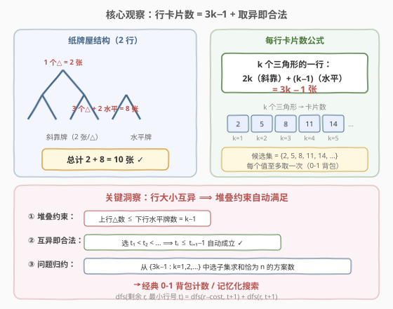
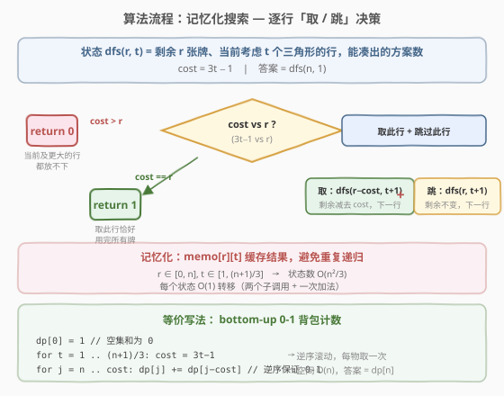
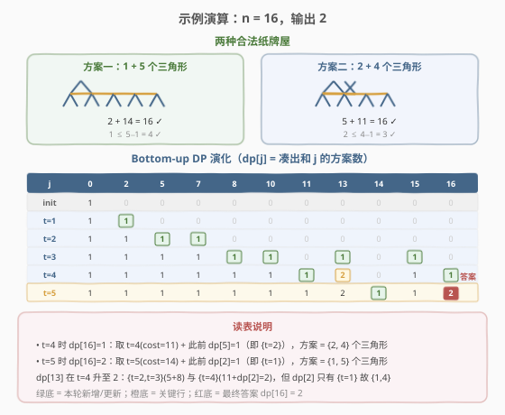

# 建造纸牌屋的方法数

- **题目名称**：建造纸牌屋的方法数
- **链接**：[2189. 建造纸牌屋的方法数 🔒](https://leetcode.cn/problems/number-of-ways-to-build-house-of-cards/)
- **难度**：中等
- **标签**：数学、动态规划、记忆化搜索、0-1 背包计数

## 1. 题目概述

给你一个整数 `n`，代表你拥有的纸牌数量。一个**纸牌屋**满足以下条件：

- 由一行或多行**三角形**和水平纸牌组成。
- **三角形**由两张纸牌相互靠在一起形成。
- 一张纸牌必须水平放置在一行中**所有相邻**的三角形之间。
- 比第一行高的任何三角形都必须放在前一行的水平纸牌上。
- 每个三角形都被放置在行中**最左边**的可用位置。

返回使用**所有** `n` 张纸牌可以构建的不同纸牌屋的数量。如果两个纸牌屋在任意一行包含不同数量的三角形，则认为它们是不同的。

**示例 1**：

```text
输入：n = 16
输出：2
解释：有两种合法的纸牌屋摆法。
```

**示例 2**：

```text
输入：n = 2
输出：1
解释：仅有一个三角形，是唯一可行的纸牌屋。
```

**示例 3**：

```text
输入：n = 4
输出：0
解释：4 张牌无法拼出任何合法纸牌屋。
```

**约束条件**：

- $1 \le n \le 500$

> 💡 题眼有两层：① **行卡片数公式**——一行 $k$ 个三角形恰好消耗 $3k - 1$ 张牌（$2k$ 张斜靠 + $k-1$ 张水平）；② **堆叠约束的自动满足**——只要每行三角形数互不相同，"上行△数 ≤ 下行水平牌数"便天然成立。这两层观察一结合，问题就归约为「从 $\{2, 5, 8, 11, 14, \ldots\}$ 中选子集求和恰为 $n$」的 0-1 背包计数。

---

## 2. 解题思路

### 2.1 暴力思路：枚举所有纸牌屋形态

可以枚举所有可能的行数和每行三角形数的组合，逐一检查是否满足堆叠约束且总牌数恰为 $n$。但行数可达 $O(\sqrt{n})$，每行三角形数在 $1 \sim O(n/3)$ 之间，组合数随 $n$ 指数膨胀，$n = 500$ 时完全不可行。

> 💡 暴力法没有利用「行卡片数固定为 $3k-1$」和「互异即合法」这两个关键性质。一旦意识到选出的行大小只需互异，堆叠约束便自动满足，问题就从「搜索 + 校验」简化为「子集求和计数」。

### 2.2 核心观察：行卡片公式 + 互异即合法



**观察一：一行 $k$ 个三角形消耗 $3k - 1$ 张牌**

一行有 $k$ 个三角形，每个三角形由 2 张斜靠的牌组成（$2k$ 张），相邻三角形之间必须放 1 张水平牌（$k - 1$ 张），合计：

$$
\text{cost}(k) = 2k + (k - 1) = 3k - 1
$$

- $k = 1$：$3 \times 1 - 1 = 2$ 张（单个三角形）
- $k = 2$：$3 \times 2 - 1 = 5$ 张
- $k = 3$：$3 \times 3 - 1 = 8$ 张
- $k = 4$：$3 \times 4 - 1 = 11$ 张
- $k = 5$：$3 \times 5 - 1 = 14$ 张

水平牌同时承双重职责：既是同行三角形间的连接，又承载上一行三角形的底部。

**观察二：堆叠约束——上行△数 ≤ 下行水平牌数**

一行 $k$ 个三角形有 $k - 1$ 张水平牌，每张水平牌上至多放 1 个三角形，故上一行的三角形数 $\le k - 1$。这是纸牌屋结构的物理约束。

**观察三：互异即合法——堆叠约束自动满足**

如果从 $\{1, 2, 3, \ldots\}$ 中选出一个子集 $\{t_1 < t_2 < \cdots < t_m\}$ 作为各行三角形数（从上到下递增），则对任意相邻两层 $t_i < t_{i+1}$（均为正整数），有：

$$
t_i \le t_{i+1} - 1
$$

这恰好满足"上行△数 $\le$ 下行水平牌数 $= t_{i+1} - 1$"的约束。因此**无需额外校验堆叠合法性**——只要行大小互异，结构必然合法。

> 💡 **关键归约**：问题等价于——从候选集 $\{3k - 1 : k = 1, 2, 3, \ldots\} = \{2, 5, 8, 11, 14, \ldots\}$ 中选取一个子集，使其总和恰好为 $n$，求方案数。每个值至多取一次（因为每行三角形数互异），这是经典的 **0-1 背包计数**问题。

### 2.3 算法流程图



设计记忆化函数 $\text{dfs}(r, t)$：剩余 $r$ 张牌、当前考虑 $t$ 个三角形的行时，能凑出的方案数。答案为 $\text{dfs}(n, 1)$。

令 $\text{cost} = 3t - 1$，转移逻辑：

1. **$\text{cost} > r$**：当前行（及更大的行）都放不下，返回 $0$；
2. **$\text{cost} = r$**：取此行恰好用完所有牌，返回 $1$；
3. **$\text{cost} < r$**：二选一——
   - **取**此行：$\text{dfs}(r - \text{cost},\; t + 1)$
   - **跳**此行：$\text{dfs}(r,\; t + 1)$
   - 两者相加。

用 $\text{memo}[r][t]$ 缓存结果避免重复递归。

> 💡 **等价写法——bottom-up 0-1 背包**：$\text{dp}[0] = 1$（空集和为 0），逐个物品 $\text{cost} = 3t - 1$（$t = 1, 2, \ldots$）做逆序滚动：$\text{dp}[j] \mathrel{+}= \text{dp}[j - \text{cost}]$（$j$ 从 $n$ 到 $\text{cost}$）。逆序保证每个物品只取一次。答案 $= \text{dp}[n]$，空间 $O(n)$。

### 2.4 示例演算

以 $n = 16$ 为例：



**两种合法纸牌屋**：

| 方案 | 行大小（三角形数） | 卡片数 | 验证堆叠 |
|------|---------------------|--------|----------|
| 一 | $\{1, 5\}$ | $2 + 14 = 16$ | $1 \le 5 - 1 = 4$ ✓ |
| 二 | $\{2, 4\}$ | $5 + 11 = 16$ | $2 \le 4 - 1 = 3$ ✓ |

**Bottom-up DP 表演化**（$\text{dp}[j]$ = 凑出和 $j$ 的方案数）：

| 轮次 | 物品 | 新增/更新 | $\text{dp}[16]$ |
|------|------|-----------|------------------|
| init | — | $\text{dp}[0] = 1$ | 0 |
| $t=1$ | 2 | $\text{dp}[2] = 1$ | 0 |
| $t=2$ | 5 | $\text{dp}[5]=1,\; \text{dp}[7]=1$ | 0 |
| $t=3$ | 8 | $\text{dp}[8]=1,\; \text{dp}[10]=1,\; \text{dp}[13]=1,\; \text{dp}[15]=1$ | 0 |
| $t=4$ | 11 | $\text{dp}[11]=1,\; \text{dp}[13]=2,\; \text{dp}[16]=1$ ← $\{2,4\}$ | 1 |
| $t=5$ | 14 | $\text{dp}[14]=1,\; \text{dp}[16]=2$ ← $\{1,5\}$ | **2** |

- $t=4$ 时 $\text{dp}[16] = \text{dp}[16] + \text{dp}[5] = 0 + 1 = 1$：在 $\{5\}$（即 $t=2$）基础上加入 $t=4$，得到方案 $\{2, 4\}$。
- $t=5$ 时 $\text{dp}[16] = \text{dp}[16] + \text{dp}[2] = 1 + 1 = 2$：在 $\{2\}$（即 $t=1$）基础上加入 $t=5$，得到方案 $\{1, 5\}$。

> ⚠️ 注意 $\text{dp}[13]$ 在 $t=4$ 时从 1 升至 2：一路是 $\{t=2, t=3\} = 5 + 8 = 13$，另一路是 $\{t=4\} + \text{dp}[2] = 11 + \text{dp}[\{t=1\}]$ 即 $\{1, 4\} = 2 + 11 = 13$。这体现了 0-1 背包的累加性。

再看 **示例 2** $n = 2$：$t=1, \text{cost}=2$，$\text{dp}[2] = \text{dp}[0] = 1$。答案 1 ✓。

**示例 3** $n = 4$：$t=1, \text{cost}=2$ 只更新 $\text{dp}[2]$；$t=2, \text{cost}=5 > 4$ 停止。$\text{dp}[4] = 0$。答案 0 ✓。

---

## 3. 参考代码

### C++

```cpp
class Solution {
public:
    int houseOfCards(int n) {
        int f[n + 1][(n + 1) / 3 + 1];
        memset(f, -1, sizeof(f));
        auto dfs = [&](this auto&& dfs, int r, int t) -> int {
            int cost = 3 * t - 1;
            if (cost > r) return 0;          // 放不下，无方案
            if (cost == r) return 1;         // 取此行恰好用完
            if (f[r][t] != -1) return f[r][t];
            return f[r][t] = dfs(r - cost, t + 1) + dfs(r, t + 1);  // 取 + 跳
        };
        return dfs(n, 1);
    }
};
```

### Python

```python
class Solution:
    def houseOfCards(self, n: int) -> int:
        from functools import cache

        @cache
        def dfs(r: int, t: int) -> int:
            cost = 3 * t - 1
            if cost > r:
                return 0                        # 放不下，无方案
            if cost == r:
                return 1                        # 取此行恰好用完
            return dfs(r - cost, t + 1) + dfs(r, t + 1)  # 取 + 跳

        return dfs(n, 1)
```

### Python（bottom-up 0-1 背包版）

```python
class Solution:
    def houseOfCards(self, n: int) -> int:
        dp = [0] * (n + 1)
        dp[0] = 1                               # 空集和为 0
        t = 1
        while 3 * t - 1 <= n:
            cost = 3 * t - 1
            for j in range(n, cost - 1, -1):    # 逆序保证 0-1
                dp[j] += dp[j - cost]
            t += 1
        return dp[n]
```

> 💡 **两版对比**：记忆化搜索自顶向下，逻辑直观、只访问可达状态；bottom-up 自底向上逐物品滚动，空间 $O(n)$ 更省、常数更小。$n \le 500$ 时两版均毫秒级，面试任选其一即可。bottom-up 版的优势在于空间优化——无需 $O(n^2)$ 的 memo 表。

---

## 4. 复杂度分析

| 维度 | 记忆化搜索 | bottom-up 背包 | 说明 |
|------|-----------|---------------|------|
| **时间复杂度** | $O(n^2)$ | $O(n^2)$ | 状态数 $O(n \cdot n/3) = O(n^2/3)$，每状态 $O(1)$ 转移；背包版物品数 $O(n/3)$ × 每物品 $O(n)$ |
| **空间复杂度** | $O(n^2)$ | $O(n)$ | 记忆化需 $\text{memo}[n+1][n/3+1]$；背包版一维滚动数组 |

> 💡 $n \le 500$ 时 $n^2/3 \approx 8.3 \times 10^4$，极快。瓶颈在于候选物品种类数 $T = \lfloor(n+1)/3\rfloor \approx 167$，每种做一次 $O(n)$ 转移，总计 $\sim 8.3 \times 10^4$ 次加法。这种「小数据 + 计数」的甜区正是 0-1 背包的典型舞台。

---

## 5. 扩展：为什么互异一定满足堆叠约束？

这是一个值得深挖的**数学论证**问题。

**命题**：从 $\{1, 2, 3, \ldots\}$ 中任取子集 $S = \{t_1 < t_2 < \cdots < t_m\}$ 作为各行三角形数（从上到下），则纸牌屋结构一定合法。

**证明**：

1. **堆叠约束**：相邻两层 $t_i$（上）和 $t_{i+1}$（下），需满足 $t_i \le t_{i+1} - 1$（上行△数 ≤ 下行水平牌数）。

2. **整数有序性**：$t_i, t_{i+1}$ 均为正整数且 $t_i < t_{i+1}$，故 $t_i \le t_{i+1} - 1$。 ✓

3. **底层无约束**：最底层 $t_m$ 直接放在地面，不需要被支撑。

4. **"最左可用位置"无冲突**：题目要求每个三角形放在行中最左可用位置。对于选定的行大小集合，每行的三角形数固定，放置方式唯一确定（从左到右排满），不存在多种摆法。

因此，**一个互异子集对应唯一一个合法纸牌屋**，方案数 = 满足 $\sum_{t \in S}(3t - 1) = n$ 的子集数。

> 💡 **方法论**：「结构约束被简单条件自动满足」是计数题中常见的化简模式。类似地，[279. 完全平方数](../0201-0300/279_完全平方数.md) 中"平方数之和"的结构约束被"每个平方数可重复使用"自动消解。识别这类隐藏的等价性，是解题的关键直觉。

---

## 6. 面试要点

1. **一行 $k$ 个三角形为什么是 $3k - 1$ 张牌？**

   - $k$ 个三角形 = $2k$ 张斜靠牌；$k - 1$ 间隔 = $k - 1$ 张水平牌。合计 $2k + (k - 1) = 3k - 1$。$k = 1$ 时无水平牌（$3 \times 1 - 1 = 2$），退化单个三角形。这是整道题的基石。

2. **为什么不需要校验堆叠约束？**

   - 堆叠约束要求上行△数 $\le$ 下行水平牌数 $=$ 下行△数 $- 1$。当各行大小互异（$t_i < t_{i+1}$，均为正整数）时，$t_i \le t_{i+1} - 1$ 自动成立。因此"选互异子集"与"选合法纸牌屋"完全等价。

3. **记忆化搜索的终止条件为什么是 `cost > r` 返回 0、`cost == r` 返回 1？**

   - `cost > r`：当前行放不下，更大的行 cost 更大更放不下，此路不通，返回 0。`cost == r`：取此行后剩余 0，恰好用完所有牌，返回 1（一种完整方案）。`cost < r`：还有剩余，继续二选一递归。注意不设 `r == 0` 的独立判断——`cost == r` 已覆盖（取最后一行时 cost 恰等于剩余）。

4. **bottom-up 版为什么 $j$ 要逆序？**

   - 0-1 背包要求每个物品至多取一次。若 $j$ 正序，$\text{dp}[j - \text{cost}]$ 可能已包含当前物品（同一轮更新过），导致同一物品被重复选取。逆序保证 $\text{dp}[j - \text{cost}]$ 来自上一轮（尚未加入当前物品）。对比 [322. 零钱兑换](../0301-0400/322_零钱兑换.md) 完全背包正序——那里物品可无限取。

5. **记忆化版的空间 $O(n^2)$ 会不会超限？**

   - $n \le 500$，$\text{memo}$ 大小 $\le 501 \times 168 \approx 8.4 \times 10^4$ 个 int，约 336 KB，远低于限制。若 $n$ 更大（如 $10^4$），应切 bottom-up 一维滚动（空间 $O(n)$）。

6. **和 [322. 零钱兑换](../0301-0400/322_零钱兑换.md) 的异同？**

   - 322 是完全背包求**最小**硬币数（物品可重复）；2189 是 0-1 背包求**方案数**（物品不可重复）。两者背包框架相同，差异在于：① 内层 $j$ 的方向（正序 vs 逆序）；② 目标（最值 vs 计数）；③ 物品集（固定面值 vs $3k-1$ 递增序列）。

> 💡 **一句话总结**：2189 是「**公式推导 + 约束消解 + 背包计数**」的三连击——$3k-1$ 的行卡片公式将结构问题数值化，互异即合法的观察将带约束计数化简为无约束子集求和，最终落入 0-1 背包计数的经典框架。

---

## 7. 同类练习题

- [322. 零钱兑换](https://leetcode.cn/problems/coin-change/)（[站内题解](../0301-0400/322_零钱兑换.md)）：完全背包求最少硬币数，与本题对照——正序 vs 逆序、最值 vs 计数、可重复 vs 不可重复
- [416. 分割等和子集](https://leetcode.cn/problems/partition-equal-subset-sum/)（[站内题解](../0301-0400/416_分割等和子集.md)）：0-1 背包判定型，"能否"凑出和为 sum/2，与本题"有多少种"凑出和为 n 互为判定/计数镜像
- [494. 目标和](https://leetcode.cn/problems/target-sum/)：0-1 背包计数型，给数组加 ±号使和为 target 的方案数，与本题同为"子集求和计数"范式
- [279. 完全平方数](https://leetcode.cn/problems/perfect-squares/)（[站内题解](../0201-0300/279_完全平方数.md)）：完全背包求最少个数，候选集为平方数序列 $\{1,4,9,\ldots\}$，与本题候选集 $\{2,5,8,\ldots\}$ 结构相似但允许重复
- [377. 组合总和 IV](https://leetcode.cn/problems/combination-sum-iv/)（[站内题解](../0301-0400/377_组合总和IV.md)）：完全背包求排列数（顺序敏感），与本题 0-1 背包求组合数（顺序无关）形成对比
