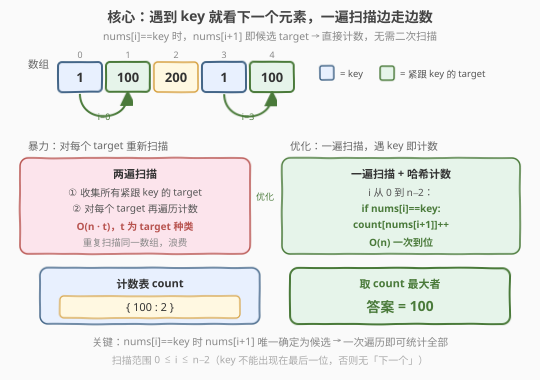
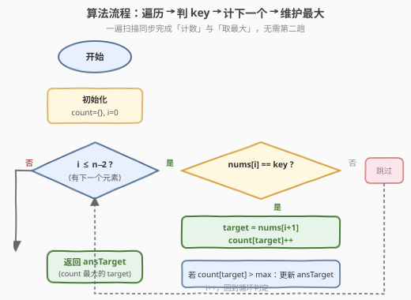
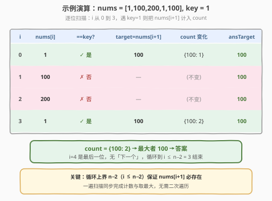

# LeetCode 数组中紧跟 key 之后出现最频繁的数字 题解

## 1. 题目概述

- **标题 / 题号**：数组中紧跟 key 之后出现最频繁的数字（#2190，easy）
- **链接**：https://leetcode.cn/problems/most-frequent-number-following-key-in-an-array/
- **难度**：简单
- **标签**：数组、哈希表、计数

**题意**：给你一个下标从 **0** 开始的整数数组 `nums`，同时给你一个整数 `key`，它在 `nums` 中出现过。

统计在 `nums` 数组中**紧跟在 `key` 后面**出现的不同整数 `target` 的出现次数。换言之，`target` 的出现次数为满足以下条件的 `i` 的数目：

- $0 \le i \le n - 2$
- $\text{nums}[i] == \text{key}$，且
- $\text{nums}[i + 1] == \text{target}$

请你返回出现**最多**次数的 `target`。测试数据保证出现次数最多的 `target` 是唯一的。

**示例 1**：

```text
输入：nums = [1,100,200,1,100], key = 1
输出：100
解释：对于 target = 100，在下标 1 和 4 处出现过 2 次，且都紧跟着 key。
没有其他整数在 key 后面紧跟着出现，所以我们返回 100。
```

**示例 2**：

```text
输入：nums = [2,2,2,2,3], key = 2
输出：2
解释：对于 target = 2，在下标 1、2 和 3 处出现过 3 次，且都紧跟着 key。
对于 target = 3，在下标 4 处出现过 1 次，且紧跟着 key。
target = 2 是紧跟着 key 之后出现次数最多的数字，所以我们返回 2。
```

**约束**：

- $2 \le \text{nums.length} \le 1000$
- $1 \le \text{nums[i]} \le 1000$
- 测试数据保证答案是唯一的

> 💡 本题的本质是**条件计数 + 取最值**。关键观察：`nums[i] == key` 时，`nums[i + 1]` 就唯一确定为一个候选 `target`——无需对每个 `target` 重新扫描数组，**一遍遍历即可同步完成「计数」与「取最大」**。约束 $n \le 1000$、值域 $\le 1000$，哈希表与定长数组均可，是「条件触发计数」类题的最简模板。

## 2. 解题思路

### 2.1 暴力思路：对每个 target 重新扫描

最直白的做法分两步：先收集所有紧跟 `key` 后出现的 `target` 候选集合，再对其中每个不同的 `target` 重新遍历 `nums` 统计它紧跟 `key` 的次数：

```text
targets = set()
for i in range(n - 1):
    if nums[i] == key:
        targets.add(nums[i + 1])      # 收集候选

ansTarget, maxCnt = 0, 0
for t in targets:                      # 对每个候选再扫一遍
    c = 0
    for i in range(n - 1):
        if nums[i] == key and nums[i + 1] == t:
            c += 1
    if c > maxCnt:
        maxCnt, ansTarget = c, t
return ansTarget
```

设不同 `target` 有 $t$ 个，总代价 $O(n + n \cdot t) = O(n \cdot t)$。最坏情形（每个 `target` 只出现一次，$t \approx n$）退化为 $O(n^2)$。

> ⚠️ 暴力能过（$n \le 1000$，最坏约 $10^6$ 次操作），但**重复扫描**同一数组是明显浪费：第一趟已经看到「`key` 后面跟的是谁」，第二趟却又把每个 `target` 各扫一遍来数次数。

### 2.2 核心观察：一遍扫描 + 哈希计数



**观察：`nums[i] == key` 时，`nums[i + 1]` 唯一确定为本次的候选 `target`。**

题目要数的是「紧跟 `key` 后的 `target` 出现次数」。当扫描到 `nums[i] == key` 时，下一位 `nums[i + 1]` 就是这次事件贡献的 `target`——**不需要回头重扫**，当场用哈希表 `count[target]++` 累计即可。同时维护一个「当前最大计数及对应 `target`」，扫描结束即得答案：

$$
\text{count}[\text{nums}[i+1]] \mathrel{+}= 1 \quad \text{当} \quad \text{nums}[i] = \text{key}
$$

> 💡 **为什么一遍就够**：每次 `nums[i] == key` 的事件是独立的，贡献恰好一次 `count[nums[i+1]]++`。把「识别事件」与「累计计数」合并在同一次遍历中完成，避免了暴力法对同一数组的重复扫描。维护最大值也在同一次遍历里增量更新，无需最后再遍历一次哈希表。

**边界与特例**：

- **循环上界 $n - 2$**：`key` 不能出现在最后一位（下标 $n-1$），因为那样没有「下一个」元素。遍历范围 $0 \le i \le n - 2$ 保证 `nums[i + 1]` 必然存在，无需额外越界判断。
- **`key` 出现在末尾**：题目保证 `key` 在 `nums` 中出现过，但若它只出现在最后一位，则无任何 `target`——不过约束 $n \ge 2$ 且答案唯一，测试数据保证至少有一次有效的「`key` 后跟 `target`」。
- **`target == key`**：完全合法。如示例 2 中 `key = 2`、`target = 2`，`key` 后面紧跟的也可以是 `key` 本身。
- **答案唯一**：测试数据保证最大计数对应的 `target` 唯一，因此 `c > maxCnt` 用严格大于更新即可（相等时不替换，保留先达到者，不影响正确性）。

### 2.3 算法流程图



1. **初始化**：空哈希表 `count`，`ansTarget = 0`，`maxCnt = 0`，`i = 0`。
2. **循环** `i` 从 $0$ 到 $n - 2$：
   - **判定**：若 `nums[i] == key`：
     - 取 `target = nums[i + 1]`。
     - `count[target] += 1`。
     - 若 `count[target] > maxCnt`：更新 `maxCnt = count[target]`，`ansTarget = target`。
   - `i += 1`。
3. **返回** `ansTarget`。

### 2.4 示例演算



以示例 1 逐步演算，`nums = [1,100,200,1,100]`，`key = 1`，循环 $i$ 从 $0$ 到 $3$：

| $i$ | `nums[i]` | `== key`? | `target = nums[i+1]` | `count` 变化 | `ansTarget` |
|-----|-----------|-----------|----------------------|--------------|-------------|
| 0 | 1 | ✓ 是 | 100 | `{100: 1}` | 100 |
| 1 | 100 | ✗ 否 | — | (不变) | 100 |
| 2 | 200 | ✗ 否 | — | (不变) | 100 |
| 3 | 1 | ✓ 是 | 100 | `{100: 2}` | 100 |

$i = 4$ 是最后一位，无「下一个」，循环到 $i \le n - 2 = 3$ 结束。最终 `count = {100: 2}`，最大者 `100` 即答案 ✓

> 💡 注意 $i = 1$、$i = 2$ 处 `nums[i] != key`，直接跳过——这正是「条件触发计数」的体现：只有命中 `key` 的位置才产生一次计数。示例 2 中 `key = 2` 且 `target = 2` 也合法，连续的 `2` 每一位都触发对下一位 `2` 的计数。

## 3. 参考代码

### C++（哈希表一遍扫描，推荐）

```cpp
class Solution {
  public:
    int mostFrequent(vector<int>& nums, int key) {
        unordered_map<int, int> cnt;
        int ansTarget = 0, maxCnt = 0;
        for (int i = 0; i + 1 < (int)nums.size(); ++i) {
            if (nums[i] == key) {
                int t = nums[i + 1];
                int c = ++cnt[t];
                if (c > maxCnt) {
                    maxCnt = c;
                    ansTarget = t;
                }
            }
        }
        return ansTarget;
    }
};
```

> 💡 循环条件 `i + 1 < nums.size()` 等价于 $i \le n - 2$，保证 `nums[i + 1]` 不越界，省去单独的边界判断。`++cnt[t]` 自增同时返回新值，直接与 `maxCnt` 比较一行完成更新。`maxCnt` 初值 0：第一次命中时 `c = 1 > 0` 必然更新，保证 `ansTarget` 一定被赋值。

### C++（定长数组版，值域 $\le 1000$ 时更优）

```cpp
class Solution {
  public:
    int mostFrequent(vector<int>& nums, int key) {
        int cnt[1001] = {0};
        int ansTarget = 0, maxCnt = 0;
        for (int i = 0; i + 1 < (int)nums.size(); ++i) {
            if (nums[i] == key) {
                int t = nums[i + 1];
                if (++cnt[t] > maxCnt) {
                    maxCnt = cnt[t];
                    ansTarget = t;
                }
            }
        }
        return ansTarget;
    }
};
```

> ⚠️ 题目保证 $1 \le \text{nums[i]} \le 1000$，`target` 取值范围同此，故 `cnt[1001]` 足够覆盖所有可能的 `target`。定长数组的下标访问是 $O(1)$ 且常数远小于哈希表（无哈希计算、无冲突处理、无动态分配），在值域受限时是首选。`{0}` 初始化整个数组为 0。

### Python（哈希表一遍扫描，推荐）

```python
class Solution:
    def mostFrequent(self, nums: List[int], key: int) -> int:
        from collections import defaultdict

        cnt = defaultdict(int)
        ans_target, max_cnt = 0, 0
        for i in range(len(nums) - 1):
            if nums[i] == key:
                t = nums[i + 1]
                cnt[t] += 1
                if cnt[t] > max_cnt:
                    max_cnt = cnt[t]
                    ans_target = t
        return ans_target
```

### Python（Counter 一行流，对照参考）

```python
class Solution:
    def mostFrequent(self, nums: List[int], key: int) -> int:
        from collections import Counter

        targets = (nums[i + 1] for i in range(len(nums) - 1) if nums[i] == key)
        return Counter(targets).most_common(1)[0][0]
```

> ⚠️ **两种写法的对比**：`Counter` 版用生成器表达式一次性产出所有 `target`，`most_common(1)` 内部用堆取最大，代码极简但会先构造完整的 Counter 再取最大，**遍历两次**（一次构造、一次取最大），且无法在扫描中增量维护。手撕版在单次遍历里同步完成计数与取最大，**只需一趟**。面试时建议先写手撕版讲清「一遍扫描」的思路，再提 `Counter` 作为工程简洁写法。注意答案唯一保证 `most_common(1)` 必有结果，不会越界。

## 4. 复杂度分析

| 维度 | 复杂度 | 说明 |
|------|--------|------|
| 时间复杂度（一遍扫描） | $O(n)$ | 单次遍历 $0 \le i \le n - 2$，每次命中 `key` 时哈希表增删与最大值更新均 $O(1)$ 均摊；定长数组版为严格 $O(1)$ |
| 时间复杂度（暴力两遍） | $O(n \cdot t)$，最坏 $O(n^2)$ | 先收集 $t$ 个候选 $O(n)$，再对每个候选重扫 $O(n)$，$t$ 为不同 `target` 数 |
| 空间复杂度（哈希表版） | $O(t) \le O(n)$ | 哈希表存储不同 `target` 的计数，最多 $n$ 个键 |
| 空间复杂度（定长数组版） | $O(V) = O(1000)$ | 值域 $V = 1000$，固定大小数组，与 $n$ 无关 |

> 💡 一遍扫描版在时间和空间上都是最优的。定长数组版用 $O(V)$ 空间换取更小的常数，当 $n \gg V$ 时（如 $n = 10^6$、$V = 1000$）空间反而比哈希表 $O(n)$ 更省；当 $V \gg n$ 时哈希表更省。本题 $n, V \le 1000$，两者差异可忽略。

## 5. 扩展：值域受限时的定长数组替代哈希表

本题约束 $1 \le \text{nums[i]} \le 1000$，`target` 的取值被限制在 $[1, 1000]$。此时可用一个大小为 $1001$ 的定长整数数组替代哈希表：

- **访问开销**：数组下标访问是 $O(1)$ 的连续内存读取，无哈希函数计算、无冲突探测、无动态扩容，常数远小于 `unordered_map`。
- **初始化**：`int cnt[1001] = {0}` 一次性清零，$O(V)$ 但 $V$ 固定。
- **权衡**：空间固定为 $O(V)$，与 $n$ 无关。当值域 $V$ 较小（如 $\le 10^6$）且 $n$ 较大时，定长数组在性能上显著优于哈希表；当 $V$ 极大（如 $10^9$）或值域稀疏时，哈希表 $O(n)$ 空间更优。

> ⚠️ 「值域受限 → 定长数组」是计数类题的通用优化：当元素值域有界且不大时，用数组替代哈希表能消除哈希开销。典型应用如 [242. 有效的字母异位词](https://leetcode.cn/problems/valid-anagram/)（26 个字母用 `cnt[26]`）、[347. 前 K 个高频元素](https://leetcode.cn/problems/top-k-frequent-elements/)（值域大时退回哈希）。本题 $V = 1000$ 是定长数组的甜区。

## 6. 面试要点

1. **为什么循环上界是 $n - 2$ 而不是 $n - 1$？**

   - 因为要访问 `nums[i + 1]`，当 $i = n - 1$（最后一位）时 `nums[i + 1]` 越界。即便最后一位等于 `key`，它也没有「下一个」元素可贡献。遍历 $0 \le i \le n - 2$ 保证 `nums[i + 1]` 必然存在，`i + 1 < n` 是天然的边界守卫。

2. **一遍扫描为什么能同时完成计数和取最大？**

   - 每次 `nums[i] == key` 的事件独立贡献一次 `count[nums[i+1]]++`，新计数值 `c = count[target]` 立即可得。若 `c > maxCnt` 则更新最大——这是**增量维护**，无需等全部计数完再扫一遍哈希表。把「识别事件 → 累计 → 比较最大」三步合并到同一次遍历，是「在线算法」思想的体现。

3. **哈希表和定长数组怎么选？**

   - 看值域 $V$ 与数据量 $n$ 的关系。值域有界且较小（$V \le 10^6$）时定长数组常数更优；值域大或稀疏时哈希表 $O(n)$ 空间更省。本题 $V = 1000$ 固定，定长数组是首选，但 $n \le 1000$ 下两者性能差异可忽略，哈希表写法更通用、不受值域假设约束。

4. **`target == key` 的情况需要特殊处理吗？**

   - 不需要。`target` 是 `key` 后面紧跟的元素，它等于 `key` 完全合法（如示例 2）。判定条件只看 `nums[i] == key`，至于 `nums[i + 1]` 是什么值不影响逻辑——它就是被计入的 `target`，与 `key` 是否相等无关。

5. **答案唯一性对代码写法有什么影响？**

   - 题目保证最大计数对应的 `target` 唯一，因此用 `c > maxCnt`（严格大于）更新即可：相等时不替换，保留先达到最大者。若不保证唯一，需明确「相同计数取较小/较大/先出现者」的规则并相应调整比较条件。`Counter.most_common(1)` 也依赖唯一性保证返回值非空。

## 同类练习题

| # | 题目 | 与本题的关联 |
|---|------|-------------|
| 219 | [存在重复元素 II](https://leetcode.cn/problems/contains-duplicate-ii/) | 同样「按下标扫描 + 哈希表记录」，改为查同值下标距离 ≤ k，条件触发查表而非计数，对照「条件触发」的两种用法 |
| 1512 | [好数对的数目](https://leetcode.cn/problems/number-of-good-pairs/) | 统计 `nums[i]==nums[j]` 且 `i<j` 的对数，哈希表按值计数，是「遍历计数」的最简入门 |
| 2006 | [差的绝对值为 K 的数对数目](https://leetcode.cn/problems/count-number-of-pairs-with-absolute-difference-k/) | 一遍扫描 + 哈希表查 `v±k` 的频次，同样是「扫描中同步计数」模板 |
| 1748 | [唯一元素的和](https://leetcode.cn/problems/sum-of-unique-elements/) | 哈希表统计每个值的出现次数后求和，对照「先计数再汇总」与「边走边维护」两种模式 |
| 242 | [有效的字母异位词](https://leetcode.cn/problems/valid-anagram/) | 值域受限（26 字母）用定长数组 `cnt[26]` 计数，是第 5 节「定长数组替代哈希表」的经典落地 |
