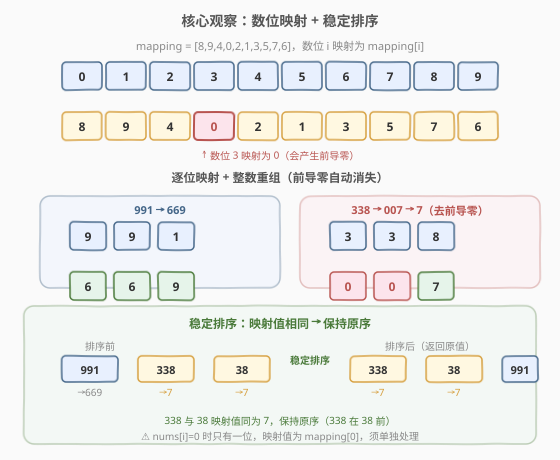
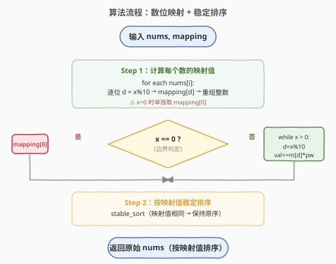
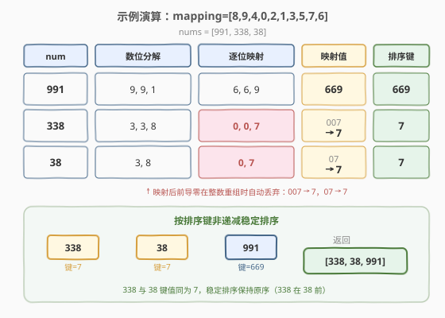

# LeetCode 将杂乱无章的数字排序 题解

## 1. 题目概述

- **标题 / 题号**：将杂乱无章的数字排序（#2191，medium）
- **链接**：https://leetcode.cn/problems/sort-the-jumbled-numbers/
- **难度**：中等
- **标签**：数组、排序、模拟

**题意**：给定一个下标从 0 开始的整数数组 `mapping`（长度为 10），表示十进制数位的映射规则：`mapping[i] = j` 表示将数位 `i` 映射为数位 `j`。`mapping` 是 0–9 的一个排列。

给定整数数组 `nums`，将其中每个数按**映射后的值**非递减排序后返回。规则：

- **映射后的值**：将原数字的每一位 `i` 替换为 `mapping[i]`，重新组合为整数（前导零自然丢弃）；
- 若两个数映射后的值相同，则**保持它们在输入中的相对顺序**（稳定排序）；
- 返回的是**原始数值**本身，仅在排序时按映射值比较。

**示例 1**：

```text
输入：mapping = [8,9,4,0,2,1,3,5,7,6], nums = [991,338,38]
输出：[338,38,991]
解释：
  991 → 数位 9,9,1 映射为 6,6,9 → 669
  338 → 数位 3,3,8 映射为 0,0,7 → 007 → 7（去前导零）
  38  → 数位 3,8   映射为 0,7   → 07  → 7（去前导零）
  338 与 38 映射值同为 7，保持原序（338 在 38 前）。
  排序后：[338, 38, 991]
```

**示例 2**：

```text
输入：mapping = [0,1,2,3,4,5,6,7,8,9], nums = [789,456,123]
输出：[123,456,789]
解释：mapping 为恒等映射，映射值 = 原值，直接排序。
```

**约束**：

- `mapping.length == 10`
- `0 <= mapping[i] <= 9`，且 `mapping[i]` 互不相同
- `1 <= nums.length <= 3 * 10^4`
- `0 <= nums[i] < 10^9`

## 2. 解题思路

### 2.1 暴力思路

最直觉的做法分两步：

1. **计算映射值**：对每个 `nums[i]`，逐位取数位 `d`，查 `mapping[d]` 得到映射数位，按原位置重新组合为整数。前导零在整数重组时自然消失。
2. **稳定排序**：按映射值非递减排序；映射值相同时保持原序。

> 💡 这道题没有「暴力 vs 最优」的分水岭——上述直觉做法就是最优解。真正的考点在于**正确处理两个边界**：① `nums[i] = 0` 时只有一位（映射为 `mapping[0]`），不能跳过；② 映射后前导零的处理（如 `338 → 007 → 7`）。

### 2.2 核心观察：数位映射 + 稳定排序



**观察一：映射值计算 = 逐位替换 + 整数重组**

对数字 `x`，从低位到高位逐位处理：取 `d = x % 10`，查 `mapping[d]`，乘以当前位权累加。这样重组为整数后，前导零自动消失（例如 `007` 重组为 `7`）。

**观察二：稳定排序保原序**

题目要求映射值相同时保持输入中的相对顺序——这恰好是**稳定排序**的定义。C++ 用 `stable_sort`，Python 用 `sorted`（默认稳定）。

> ⚠️ **边界 `nums[i] = 0`**：`0` 只有一位，映射值为 `mapping[0]`。若用 `while (x > 0)` 循环提取数位，`x = 0` 时循环体不执行，映射值会被错误地设为 0 而非 `mapping[0]`。必须单独处理。

### 2.3 算法流程图



### 2.4 示例演算

以 `mapping = [8,9,4,0,2,1,3,5,7,6]`, `nums = [991,338,38]` 为例：



| num | 数位分解 | 逐位映射 | 重组值 | 排序键 |
|-----|---------|---------|--------|--------|
| 991 | 9, 9, 1 | 6, 6, 9 | 669 | 669 |
| 338 | 3, 3, 8 | 0, 0, 7 | 007 → 7 | 7 |
| 38  | 3, 8    | 0, 7    | 07 → 7 | 7 |

按排序键非递减稳定排序：338(7) → 38(7) → 991(669)，返回 `[338, 38, 991]`。

> 💡 338 和 38 的映射值都是 7，稳定排序保持它们在 `nums` 中的原序（338 在前）。

## 3. 参考代码

### C++

```cpp
class Solution {
public:
    vector<int> sortJumbled(vector<int>& mapping, vector<int>& nums) {
        int n = nums.size();
        vector<int> mapped(n);
        for (int i = 0; i < n; ++i) {
            int x = nums[i];
            if (x == 0) {
                mapped[i] = mapping[0];          // 边界：0 只有一位
            } else {
                int val = 0, power = 1;
                while (x > 0) {
                    int d = x % 10;
                    val = mapping[d] * power + val;
                    power *= 10;
                    x /= 10;
                }
                mapped[i] = val;
            }
        }
        // 按索引排序，稳定排序保原序
        vector<int> idx(n);
        iota(idx.begin(), idx.end(), 0);
        stable_sort(idx.begin(), idx.end(), [&](int a, int b) {
            return mapped[a] < mapped[b];
        });
        vector<int> res;
        for (int i : idx) res.push_back(nums[i]);
        return res;
    }
};
```

### Python

```python
class Solution:
    def sortJumbled(self, mapping: List[int], nums: List[int]) -> List[int]:
        def mapped_value(x: int) -> int:
            if x == 0:
                return mapping[0]                  # 边界：0 只有一位
            val = 0
            power = 1
            while x > 0:
                d = x % 10
                val = mapping[d] * power + val
                power *= 10
                x //= 10
            return val

        return sorted(nums, key=mapped_value)      # sorted 默认稳定
```

> 💡 Python 的 `sorted` / `list.sort` 默认稳定，无需额外处理。`key` 函数只被调用 $n$ 次（Schwartzian transform 优化），不会在每次比较时重复计算映射值。

## 4. 复杂度分析

| 维度 | 复杂度 | 说明 |
|------|--------|------|
| 时间复杂度 | $O(n \cdot d + n \log n)$ | 每个数计算映射值 $O(d)$（$d \le 10$），排序 $O(n \log n)$；$d$ 为常数，总体 $O(n \log n)$ |
| 空间复杂度 | $O(n)$ | 存储映射值数组与索引数组 |

> 💡 $n \le 3 \times 10^4$，$n \log n \approx 4.5 \times 10^5$，毫秒级。$d \le 10$（因 $\text{nums}[i] < 10^9$），映射值计算开销可忽略。

## 5. 扩展：字符串写法与稳定性

### 5.1 Python 字符串一行写法

```python
class Solution:
    def sortJumbled(self, mapping: List[int], nums: List[int]) -> List[int]:
        return sorted(nums, key=lambda x: int(''.join(str(mapping[int(c)]) for c in str(x))))
```

`str(x)` 自然分解数位，`int(...)` 重组时自动丢弃前导零。`x = 0` 时 `str(0) = '0'`，映射 `mapping[0]` 后 `int` 仍正确。简洁但可读性略低——面试中手写 `while` 循环版更易讲清逻辑。

### 5.2 为什么要稳定排序？

题目明确要求「映射值相同则保持输入中的相对顺序」。两种实现方式：

1. **`stable_sort` + 仅比较映射值**：C++ `stable_sort` 保证相等元素的相对顺序不变。
2. **普通 `sort` + 以索引为次序键**：`{mapped_value, original_index}` 作为排序键，索引保证稳定性。

方式 2 不依赖 `stable_sort`，在任何语言中都通用：

```cpp
sort(idx.begin(), idx.end(), [&](int a, int b) {
    if (mapped[a] != mapped[b]) return mapped[a] < mapped[b];
    return a < b;                                // 索引作次序键
});
```

> ⚠️ 若漏掉稳定性要求（用普通 `sort` 且不加索引次序键），相等映射值的元素顺序不确定，可能通不过测试用例。

## 6. 面试要点

1. **映射值怎么算？前导零怎么处理？**

   - 从低位到高位逐位取 `d = x % 10`，查 `mapping[d]`，乘位权累加为整数。整数重组时前导零自动消失（`007 → 7`）。也可用字符串：逐字符替换后 `int()` 转换。

2. **`nums[i] = 0` 的边界怎么处理？**

   - `0` 只有一位数位，映射值为 `mapping[0]`。若用 `while (x > 0)` 循环，`x = 0` 时循环体不执行，映射值被错误置为 0。必须 `if (x == 0)` 单独处理，或用字符串方法（`str(0) = "0"` 天然处理）。

3. **为什么要稳定排序？怎么实现？**

   - 题目要求映射值相同时保持原序。C++ 用 `stable_sort`；或用 `{mapped_value, index}` 作复合排序键，普通 `sort` 也能保证稳定性。Python `sorted` 默认稳定。

4. **映射值会溢出吗？**

   - 不会。`nums[i] < 10^9`（最多 9 位数），映射值也是最多 9 位数，$< 10^9 < 2^{31}-1$，C++ `int` 足够。

5. **时间和空间复杂度？**

   - 时间 $O(n \cdot d + n \log n)$，$d \le 10$ 为常数，总体 $O(n \log n)$。空间 $O(n)$ 存映射值和索引。

## 同类练习题

| # | 题目 | 与本题的关联 |
|---|------|-------------|
| 1636 | [按照频率将数组升序排序](https://leetcode.cn/problems/sort-array-by-increasing-frequency/) | 自定义排序键（频率+值），同为「计算排序键 + 自定义比较」范式 |
| 506 | [相对名次](https://leetcode.cn/problems/relative-ranks/) | 排序后映射回原始位置，与本题「按派生值排序但返回原值」思路相通 |
| 912 | [排序数组](https://leetcode.cn/problems/sort-an-array/)（[站内题解](../0901-1000/912_排序数组.md)） | 手撕排序模板，本题的自定义排序基础 |
| 2176 | [统计数组中相等且可以被整除的数对](https://leetcode.cn/problems/count-equal-and-divisible-pairs-in-an-array/)（[站内题解](../2101-2200/2176_统计数组中相等且可以被整除的数对.md)） | 同区间数组题，双指针/枚举与排序对照 |
| 1859 | [将句子排序](https://leetcode.cn/problems/sorting-the-sentence/) | 按隐含键（单词末尾数字）排序后还原，同为「派生键排序」思路 |
