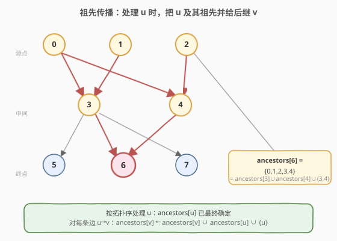
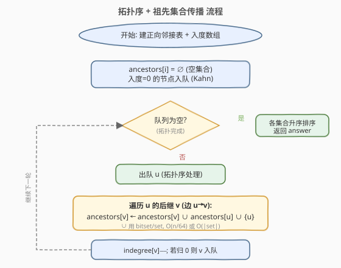
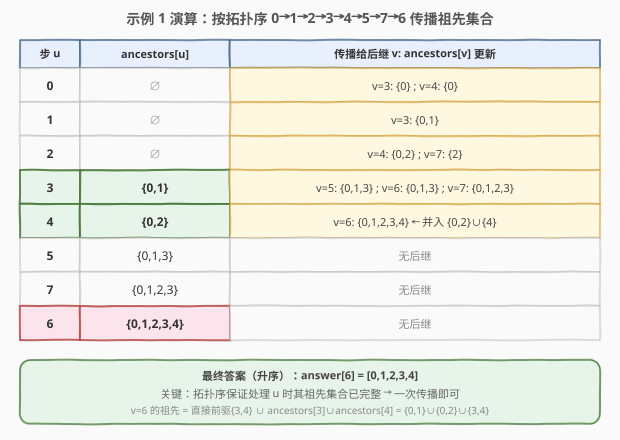

# 有向无环图中一个节点的所有祖先

- **题目名称**：有向无环图中一个节点的所有祖先
- **链接**：[2192. 有向无环图中一个节点的所有祖先](https://leetcode.cn/problems/all-ancestors-of-a-node-in-a-directed-acyclic-graph/)
- **难度**：中等
- **标签**：深度优先搜索、广度优先搜索、图、拓扑排序

## 1. 题目概述

给定正整数 `n`，表示一个 **有向无环图（DAG）** 中节点的数目，编号 `0` 到 `n-1`。再给二维数组 `edges`，`edges[i] = [fromi, toi]` 表示一条从 `fromi` 到 `toi` 的单向边。

若 `u` 通过一系列边能到达 `v`，则称 `u` 是 `v` 的**祖先**。要求返回数组 `answer`，其中 `answer[i]` 是第 `i` 个节点的所有祖先，**升序**排序。

**示例 1**：

```text
输入：n = 8, edgeList = [[0,3],[0,4],[1,3],[2,4],[2,7],[3,5],[3,6],[3,7],[4,6]]
输出：[[],[],[],[0,1],[0,2],[0,1,3],[0,1,2,3,4],[0,1,2,3]]
解释：
- 节点 0、1、2 无祖先
- 节点 3 的祖先为 0、1
- 节点 4 的祖先为 0、2
- 节点 5 的祖先为 0、1、3
- 节点 6 的祖先为 0、1、2、3、4
- 节点 7 的祖先为 0、1、2、3
```

**示例 2**：

```text
输入：n = 5, edgeList = [[0,1],[0,2],[0,3],[0,4],[1,2],[1,3],[1,4],[2,3],[2,4],[3,4]]
输出：[[],[0],[0,1],[0,1,2],[0,1,2,3]]
```

**约束条件**：

- `1 <= n <= 1000`
- `0 <= edges.length <= min(2000, n * (n - 1) / 2)`
- `edges[i].length == 2`，`0 <= fromi, toi <= n - 1`，`fromi != toi`
- 图中无重边，且是**有向无环**的

---

## 2. 解题思路

> ⚠️ **建图方向**：`[u, v]` 表示边 `u → v`，即 `u` 是 `v` 的直接前驱（父节点）。本文统一用**正向邻接表** `adj[u] = {v : u→v 存在}`，配合入度数组做拓扑排序。

### 2.1 暴力思路

对每个节点 `i`，从 `i` 出发沿**反向边**（即把每条 `u→v` 反过来看成 `v→u`）做 BFS/DFS，所有能反向到达的节点就是 `i` 的祖先。$n$ 个节点各搜一遍，每遍 $O(n+E)$，总计 $O(n(n+E))$。本题 $n \le 1000$、$E \le 2000$，约 $3\times 10^6$ 次操作，能过但浪费——同一条路径会被不同起点反复走。

优化方向：图是 DAG，存在**拓扑序**。若按拓扑序处理节点，则处理到 `u` 时，`u` 的所有祖先必已处理完毕、祖先集合已最终确定。此时只需把 `ancestors[u]`（连同 `u` 自身）**并给**它的每个后继 `v` 即可，每条边只传播一次。这就是**拓扑排序 + 祖先集合传播**，复杂度降到 $O(n + E\cdot \lceil n/64\rceil)$（bitset）或 $O(n + E\cdot \bar{s})$（集合，$\bar{s}$ 为平均祖先集大小）。

### 2.2 核心观察：拓扑序保证祖先集合「先完整再传播」



关键直觉：

- **拓扑序的特性**：在拓扑序中，任一节点 `u` 的所有前驱（直接或间接祖先）都排在 `u` 之前。因此按拓扑序逐个处理时，处理到 `u` 之前，它的每个直接前驱 `p` 都已被处理过，`ancestors[p]` 已是最终值。
- **传播公式**：节点 `v` 的祖先 = 它所有直接前驱 `u` 的「`ancestors[u]` ∪ `{u}`」之并集。
  $$\text{ancestors}[v] = \bigcup_{u:\, u\to v} \big(\text{ancestors}[u] \cup \{u\}\big)$$
- **做法**：按拓扑序取出 `u`，遍历它的每条出边 `u→v`，执行 `ancestors[v] ← ancestors[v] ∪ ancestors[u] ∪ {u}`。由于 `u` 在 `v` 之前处理，`ancestors[u]` 已完整，一次传播即可，无需回头修正。

> 💡 一句话：**拓扑序让"祖先集合"成为单调向前流动的信息**——源点祖先为空，越往下游并集越大，每条边只传一次。

### 2.3 算法流程图



流程主体就是 Kahn 拓扑排序的框架，唯一的增量动作是：在删边 `u→v`（`indegree[v]−−`）的同时，把 `ancestors[u] ∪ {u}` 并入 `ancestors[v]`。拓扑排序结束后，每个 `ancestors[i]` 升序排序输出。

> 💡 **为什么用 Kahn 而非 DFS 拓扑序**：Kahn 在"出队 `u`、删其出边"这一刻天然适合做"把 `u` 的信息推给后继"的副作用；DFS 拓扑序是按离开时间逆序给出，传播时机不直观。

### 2.4 示例演算



以示例 1（`n=8`）为例，其入度为：`0:0, 1:0, 2:0, 3:2, 4:2, 5:1, 6:2, 7:2`。一个合法拓扑序为 `0,1,2,3,4,5,7,6`（源点先出队，删边后下游入度归零即入队）：

| 步 | 取出 u | ancestors[u] | 传播给后继 v（ancestors[v] 更新） |
|----|--------|--------------|-----------------------------------|
| 1 | 0 | ∅ | v=3: {0}；v=4: {0} |
| 2 | 1 | ∅ | v=3: {0,1} |
| 3 | 2 | ∅ | v=4: {0,2}；v=7: {2} |
| 4 | 3 | {0,1} | v=5: {0,1,3}；v=6: {0,1,3}；v=7: {0,1,2,3} |
| 5 | 4 | {0,2} | v=6: {0,1,2,3,4} ← 并入 {0,2}∪{4} |
| 6 | 5 | {0,1,3} | 无后继 |
| 7 | 7 | {0,1,2,3} | 无后继 |
| 8 | 6 | {0,1,2,3,4} | 无后继 |

最终（升序）：`answer[6] = [0,1,2,3,4]`，与期望输出一致。注意第 5 步：处理 `4` 时把 `{0,2}∪{4}` 并给 `6`，而 `6` 此前在第 4 步已收到来自 `3` 的 `{0,1,3}`，两者并集正是 `{0,1,2,3,4}`——这正是"直接前驱 {3,4} 的祖先集合之并"。

> 💡 **为何 `6` 能一次到位**：拓扑序保证 `3`、`4` 都在 `6` 之前处理，所以处理到 `6` 的两个前驱时各自已把完整祖先传给 `6`，无需对 `6` 自身做任何"补算"。

---

## 3. 参考代码

### 方法一：拓扑排序 + bitset 传播（C++ 推荐）

用 `bitset<1000>` 表示每个节点的祖先集合，并集操作退化为按字的按位或，$O(n/64)$。`n ≤ 1000` 时一个 `bitset<1000>` 仅约 16 个 64-bit 字，极其高效。

### C++

```cpp
class Solution {
  public:
    vector<vector<int>> getAncestors(int n, vector<vector<int>>& edges) {
        vector<vector<int>> adj(n);
        vector<int> indegree(n, 0);
        for (auto& e : edges) {            // e = [u, v]: u -> v
            adj[e[0]].push_back(e[1]);
            indegree[e[1]]++;
        }

        vector<bitset<1000>> anc(n);       // anc[i] = 节点 i 的祖先位图
        queue<int> q;
        for (int i = 0; i < n; ++i)
            if (indegree[i] == 0) q.push(i);

        while (!q.empty()) {
            int u = q.front(); q.pop();
            for (int v : adj[u]) {
                anc[v] |= anc[u];          // 并入 u 的所有祖先
                anc[v].set(u);             // 再并入 u 自身
                if (--indegree[v] == 0) q.push(v);
            }
        }

        vector<vector<int>> answer(n);
        for (int i = 0; i < n; ++i)
            for (int j = 0; j < n; ++j)    // bitset 按下标升序扫描
                if (anc[i].test(j)) answer[i].push_back(j);
        return answer;
    }
};
```

### Python

Python 无原生 bitset，用 `set` 做并集；拓扑序保证每条边只传播一次，总开销与祖先集合平均大小有关，$n\le 1000$ 下完全可接受。

```python
from collections import deque

class Solution:
    def getAncestors(self, n: int, edges: List[List[int]]) -> List[List[int]]:
        adj = [[] for _ in range(n)]
        indegree = [0] * n
        for u, v in edges:                 # u -> v
            adj[u].append(v)
            indegree[v] += 1

        anc = [set() for _ in range(n)]    # anc[i] = 节点 i 的祖先集合
        q = deque([i for i in range(n) if indegree[i] == 0])
        while q:
            u = q.popleft()
            for v in adj[u]:
                anc[v] |= anc[u]           # 并入 u 的所有祖先
                anc[v].add(u)              # 再并入 u 自身
                indegree[v] -= 1
                if indegree[v] == 0:
                    q.append(v)

        return [sorted(s) for s in anc]    # 题目要求升序
```

### 方法二：反向图 + DFS（思维最简，备选）

不加拓扑排序，直接对每个节点沿反向边 DFS/BFS 收集可达点。无需维护入度，代码最短，但同一通路会被多个起点重复走，复杂度 $O(n(n+E))$，$n$ 更大时不占优。

### C++

```cpp
class Solution {
  public:
    vector<vector<int>> getAncestors(int n, vector<vector<int>>& edges) {
        vector<vector<int>> radj(n);       // 反向邻接表: v -> {u : u->v}
        for (auto& e : edges) radj[e[1]].push_back(e[0]);

        vector<vector<int>> answer(n);
        for (int i = 0; i < n; ++i) {
            vector<bool> seen(n, false);
            stack<int> st;
            for (int p : radj[i]) {        // 从每个直接前驱出发反向走
                if (!seen[p]) { seen[p] = true; st.push(p); }
            }
            while (!st.empty()) {
                int x = st.top(); st.pop();
                answer[i].push_back(x);
                for (int y : radj[x])
                    if (!seen[y]) { seen[y] = true; st.push(y); }
            }
            sort(answer[i].begin(), answer[i].end());
        }
        return answer;
    }
};
```

> 💡 **方法选择**：$n \le 1000$ 下两法都能过。方法一（拓扑+bitset）复杂度更优且"传播一次到位"的思路可迁移到"传递闭包""最短路径条数"等 DAG 上的批量信息流动问题，面试首选；方法二胜在直观，适合快速验证。

---

## 4. 复杂度分析

| 维度 | 方法 | 复杂度 | 说明 |
|------|------|--------|------|
| 时间复杂度 | 拓扑 + bitset（C++） | $O(n + E\cdot \lceil n/64\rceil)$ | 拓扑排序 $O(n+E)$；每条边做一次 bitset 或 $O(n/64)$；输出扫描 $O(n^2/64)$ |
| 空间复杂度 | 拓扑 + bitset（C++） | $O(n^2/8 + E)$ | $n$ 个 `bitset<1000>` 共 $O(n^2/8)$ 字节；邻接表 $O(E)$ |
| 时间复杂度 | 拓扑 + set（Python） | $O(n + E\cdot \bar{s} + n\cdot s\log s)$ | $\bar{s}$ 为平均祖先集大小；每条边做一次集合并；末尾对每个集合排序 |
| 空间复杂度 | 拓扑 + set（Python） | $O(n\cdot s + E)$ | 祖先集合总规模 $O(n\cdot s)$，$s \le n$ 为单个集合大小 |
| 时间复杂度 | 反向 DFS | $O(n(n+E))$ | 每个节点一次反向 BFS/DFS，各 $O(n+E)$ |
| 空间复杂度 | 反向 DFS | $O(n+E)$ | 反向邻接表 $O(E)$，每次搜索用 $O(n)$ 标记数组 |

> ⚠️ 本题 $n\le 1000$，三种方法都在 $10^6$ 量级内。若 $n$ 放大到 $10^5$ 且图为稀疏 DAG，bitset 的 $O(n^2/8)$ 空间会爆，需改用"按需 DFS + 记忆化"或链式前向星压缩。

---

## 5. 扩展：从「祖先」到「传递闭包」

本题本质是求 DAG 的**传递闭包**（transitive closure）的"按列"形式：`anc[i]` 就是闭包矩阵的第 `i` 列（所有能到达 `i` 的行号）。经典做法正是**按拓扑序做集合传播**，等价于 Floyd-Warshall 在 DAG 上的特化（无环省去自环判断）。相关变体：

- **可达点数**：把 `bitset` 改成 `popcount()`，求每个节点能到达多少节点（"后代数"），只需反向建图 + 同样传播。
- **路径条数**：把"集合并"换成"加法"，`cnt[v] += cnt[u]`，即 DAG 上路径计数（注意取模）。
- **最长/最短路径**：把"并集"换成 `max/min` 松弛，拓扑序天然保证松弛顺序正确，无需 Dijkstra。

---

## 6. 面试要点

1. **为什么拓扑序能保证一次传播就到位？**
   - 拓扑序中 `u` 的所有前驱都排在 `u` 之前，因此处理 `u` 时，每个前驱 `p` 的 `ancestors[p]` 已经是最终值；把 `ancestors[p] ∪ {p}` 并给 `u` 后，`ancestors[u]` 也立即完整，无需回头修正。

2. **bitset 相比 set 的优势在哪？**
   - 并集退化为按位或，单次 $O(n/64)$ 而非 $O(\text{集合大小})$；且按下标扫描天然升序，省去末尾排序。代价是空间固定 $O(n^2/8)$，仅在 $n$ 较小时划算。

3. **为什么用 Kahn 而不是 DFS 拓扑序？**
   - Kahn 在"删边 `u→v`"的时机天然适合做"把 `u` 的信息推给 `v`"的副作用；DFS 拓扑序按离开时间逆序给出节点，传播时机不直观，且需额外存后序。

4. **题目保证无环，若图可能有环怎么处理？**
   - 拓扑排序结束后若仍有节点入度非 0，说明存在环——这些节点无法确定完整祖先集，需按题意返回空或报错。本题 DAG 保证，故无需处理。

5. **反向 DFS 的思路是什么？**
   - 不做拓扑排序，直接对每个节点 `i` 沿反向边 BFS/DFS，能反向到达的节点即为 `i` 的祖先。思维最简但重复走同一通路，$O(n(n+E))$，适合 $n$ 小或快速验证。

---

## 7. 同类练习题

- [207. 课程表](https://leetcode.cn/problems/course-schedule/)：拓扑排序判环母题，本题复用 Kahn 框架
- [210. 课程表 II](https://leetcode.cn/problems/course-schedule-ii/)：Kahn 出队顺序即拓扑序，本题在删边时附加"祖先传播"副作用
- [802. 找到最终的安全状态](https://leetcode.cn/problems/find-eventual-safe-states/)：反向图 + 拓扑传播的另一变体，从终点反向 BFS 标记安全节点
- [310. 最小高度树](https://leetcode.cn/problems/minimum-height-trees/)：拓扑排序"剥洋葱"逐层向内，找到图的中心节点，与本题同源
