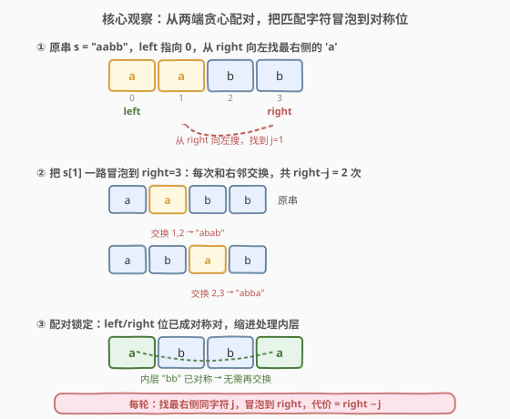
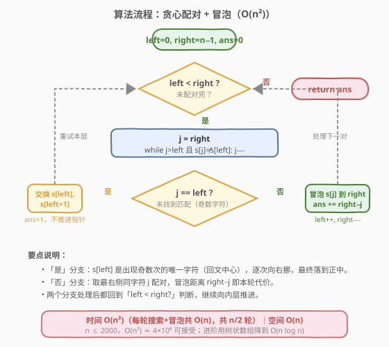
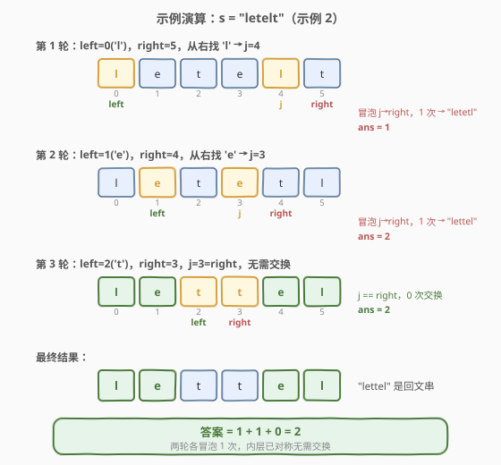

# 得到回文串的最少操作次数

- **题目名称**：得到回文串的最少操作次数
- **链接**：[2193. 得到回文串的最少操作次数](https://leetcode.cn/problems/minimum-number-of-moves-to-make-palindrome/)
- **难度**：困难
- **标签**：字符串、贪心、双指针、模拟

## 1. 题目概述

给你一个只包含小写英文字母的字符串 `s`。每一次**操作**，你可以选择 `s` 中两个**相邻**的字符并将它们交换。返回将 `s` 变成回文串的**最少操作次数**。题目保证 `s` 一定能变成回文串。

**示例 1**：

```text
输入：s = "aabb"
输出：2
解释："aabb" -> "abab" -> "abba"（2 次得到回文串 "abba"）
```

**示例 2**：

```text
输入：s = "letelt"
输出：2
解释："letelt" -> "letetl" -> "lettel"（2 次得到回文串 "lettel"）
```

**约束条件**：

- $1 \le \text{s.length} \le 2000$
- `s` 只包含小写英文字母
- `s` 可以通过有限次操作得到一个回文串

> 💡 相邻交换的本质是「重排字符」。把当前排列变成目标排列所需的最少相邻交换次数，等于两个排列之间的**逆序数**。本题的难点在于：目标回文排列并不唯一（相同字符可互换位置），需要贪心地选一个最优目标。

---

## 2. 解题思路

### 2.1 暴力思路

枚举所有可能的回文目标排列，对每个目标用逆序数求交换次数再取最小。但长度为 $n$ 的字符串可能的回文排列数是指数级（相同字符的置换组合），$n=2000$ 时完全不可行。

### 2.2 核心观察：贪心配对 + 冒泡



**关键转化**：不必显式构造目标排列，而是**从两端向中间逐层锁定对称对**。每轮处理最左端未配对的字符 `s[left]`，为它在右侧找一个匹配字符，把那个匹配字符冒泡到 `right` 位置，于是 `s[left]` 与 `s[right]` 组成回文的一对对称位。锁定后 `left++`、`right--`，处理内层。

**两个关键决策**：

1. **找哪个匹配？——取最右侧的同字符**。从 `right` 向左搜索，找到的第一个等于 `s[left]` 的字符（即剩余区间内最右侧的同字符），记其下标为 `j`。把它冒泡到 `right` 的代价是 $right - j$。取最右侧的好处是：它离 `right` 最近，冒泡距离最小；且冒泡过程中被左移的中间字符后续仍要处理，不产生额外代价（交换论证可证最优性）。

2. **奇数字符怎么办？——逐次向中心挪**。若从 `right` 搜到 `left` 仍未找到匹配（`j == left`），说明 `s[left]` 是整串中**唯一出现奇数次的字符**（回文中心）。此时把它与 `s[left+1]` 交换一格（向中心方向挪），`ans += 1`，**不推进** `left/right`，重试本层。它在后续配对中会被逐步推到正中位置。

> ⚠️ 题目保证 `s` 能变成回文串，因此出现奇数次的字符**至多一个**。当 `j == left` 时，`s[left]` 必然就是这个中心字符，逐次右挪最终恰好落在 $n/2$ 处。

### 2.3 算法流程图



### 2.4 示例演算



以**示例 2** `s = "letelt"` 为例：

| 轮次 | left | right | s[left] | 搜索 j | 操作 | 代价 | 累计 ans | 串状态 |
|------|------|-------|---------|--------|------|------|----------|--------|
| 1 | 0 | 5 | l | 4 | 冒泡 s[4]→5 | 1 | 1 | "letetl" |
| 2 | 1 | 4 | e | 3 | 冒泡 s[3]→4 | 1 | 2 | "lettel" |
| 3 | 2 | 3 | t | 3 | j==right，0 次 | 0 | 2 | "lettel" |

最终 `"lettel"` 是回文串，答案 `2`。

> 💡 第 3 轮中 `j == right`，说明 `s[left]` 的匹配恰好在 `right` 处，无需交换——这是「内层已对称」的信号。若遇到 `j == left`（无匹配），则走奇数字符分支，把 `s[left]` 挪一格后重试。

---

## 3. 参考代码

### C++（list 模拟）

```cpp
class Solution {
public:
    int minMovesToMakePalindrome(string s) {
        int n = s.size();
        int ans = 0;
        int left = 0, right = n - 1;
        while (left < right) {
            // 从 right 向左找最右侧的 s[left]
            int j = right;
            while (j > left && s[j] != s[left]) j--;
            if (j == left) {
                // 奇数字符：向中心挪一格，不推进指针
                swap(s[left], s[left + 1]);
                ans++;
            } else {
                // 冒泡 s[j] 到 right
                for (int k = j; k < right; k++) {
                    swap(s[k], s[k + 1]);
                    ans++;
                }
                left++;
                right--;
            }
        }
        return ans;
    }
};
```

### Python（list 模拟）

```python
class Solution:
    def minMovesToMakePalindrome(self, s: str) -> int:
        s = list(s)
        n = len(s)
        ans = 0
        left, right = 0, n - 1
        while left < right:
            # 从 right 向左找最右侧的 s[left]
            j = right
            while j > left and s[j] != s[left]:
                j -= 1
            if j == left:
                # 奇数字符：向中心挪一格，不推进指针
                s[left], s[left + 1] = s[left + 1], s[left]
                ans += 1
            else:
                # 冒泡 s[j] 到 right
                for k in range(j, right):
                    s[k], s[k + 1] = s[k + 1], s[k]
                    ans += 1
                left += 1
                right -= 1
        return ans
```

> 💡 **实现细节**：把字符串转成可变结构（C++ 的 `string` / Python 的 `list`），因为每次冒泡要真实修改字符位置，保证后续搜索基于最新排列。奇数字符分支**不推进** `left/right`，只把中心字符右挪一格后重试——下一轮 `s[left]` 已换成新字符，会正常找到匹配。

---

## 4. 复杂度分析

| 维度 | 复杂度 | 说明 |
|------|--------|------|
| **时间复杂度** | $O(n^2)$ | 共约 $n/2$ 轮配对；每轮搜索 $O(n)$ + 冒泡 $O(n)$，总计 $O(n^2)$ |
| **空间复杂度** | $O(n)$ | 将字符串转为可变字符数组 |

> $n \le 2000$ 时 $O(n^2) \approx 4 \times 10^6$，完全可接受。若需更优，可用树状数组把「搜索 + 冒泡代价计算」降到 $O(\log n)$，总体 $O(n \log n)$，见下节扩展。

---

## 5. 扩展：树状数组优化到 $O(n \log n)$

模拟法的瓶颈在于每轮都要 $O(n)$ 搜索和 $O(n)$ 冒泡。观察到一个事实：**冒泡 `s[j]` 到 `right` 的代价，等于区间 `[j, right]` 内尚未被配对锁定的字符个数**。已配对的字符可以视为「删除」，于是问题转化为动态维护存活下标集合上的区间计数——这正是**树状数组（BIT）**的强项。

**思路**：

1. 预处理每个字符的出现下标列表（按升序），用双端队列存储。
2. 维护一个长度为 $n$ 的树状数组，初始全 1（所有位置存活）。
3. 双指针 `left`、`right` 从两端推进。对 `s[left]`：
   - 取其同字符队列里**最右侧**的存活下标 `j`（若 `j == left` 则为奇数字符，按模拟法同样处理：代价记为到中心的距离，跳过推进）。
   - 代价 = `BIT 区间和 (j, right]`（即 `j` 到 `right` 之间的存活字符数）。
   - 在 BIT 上把 `left` 和 `j` 标记为 0（删除），`left++`、`right--`（注意 `right` 要跳过已删除的位置）。
4. 累加所有代价即为答案。

每个位置至多进出 BIT 一次，总时间 $O(n \log n)$，空间 $O(n)$。当 $n$ 放大到 $10^5$ 量级时此优化才必要；本题 $n \le 2000$，模拟法已足够且更易书写、易讲解。

---

## 6. 面试要点

1. **为什么相邻交换次数等于逆序数？**

   - 相邻交换一次最多消除一个逆序对。把排列 $A$ 变成排列 $B$ 所需的最少相邻交换数，恰等于「以 $B$ 的顺序为参照，$A$ 中存在的逆序对数」。这是冒泡排序复杂度分析的核心结论。

2. **为什么取最右侧的同字符配对是最优的？**

   - 交换论证：设最优解中 `s[left]` 配对的是某个较左侧的同字符 `j'`（`j' < j`，`j` 为最右侧）。把 `j` 冒泡到 `right` 的代价 $right - j \le right - j'$，不劣于配 `j'`；且 `j'` 留在内部供后续配对，灵活性不降。故存在取最右侧的最优解。

3. **奇数字符分支为什么要「挪一格后重试」而不是直接算到中心的距离？**

   - 直接算距离需要预先知道中心位置和字符最终落点，逻辑复杂且易错；「挪一格重试」让中心字符在后续配对中被自然推移，代码与正常分支统一，且每次只多算 1 步、累计恰好等于到中心的距离，正确性直观。

4. **题目保证能变成回文串意味着什么？**

   - 至多一个字符出现奇数次。若所有字符均出现偶数次，则回文串长度为偶、无中心字符，奇数字符分支永不被触发；若有且仅有一个奇数字符，它最终落在正中。

5. **能否不修改原串、仅用计数求答案？**

   - 可以，即第 5 节的树状数组法：用 BIT 维护存活下标，配对时用区间和算冒泡代价，无需真正移动字符。代价是代码复杂度上升，适合 $n$ 更大的场景。

> 💡 **一句话总结**：2193 是「**贪心配对 + 冒泡模拟**」的招牌题——从两端锁定对称对，每轮把最右侧同字符冒泡到右端，奇数字符逐次向中心挪；$O(n^2)$ 模拟足以应对 $n \le 2000$。

---

## 7. 同类练习题

- [1850. 邻位交换的最小次数](https://leetcode.cn/problems/minimum-adjacent-swaps-to-reach-the-kth-smallest-number/)：相邻交换把一个数字串变成其第 k 个字典序排列，本质仍是求两排列间的逆序数，与本题同源
- [2134. 最少交换次数来组合所有的 1 II](https://leetcode.cn/problems/minimum-swaps-to-group-all-1s-together-ii/)（[站内题解](2134_最少交换次数来组合所有的1II.md)）：另一类「最少交换」问题，用定长滑动窗口最小化窗口内 0 的个数，思路与本题的贪心配对形成对照
- [791. 自定义字符串排序](https://leetcode.cn/problems/custom-sort-string/)：按给定顺序重排字符串，贪心按频次放置，与本题「为字符找对称位」的配对思想相通
- [922. 按奇偶排序数组 II](https://leetcode.cn/problems/sort-array-by-parity-ii/)：双指针配对交换的重排题，本题「两端配对」思想的简化版
