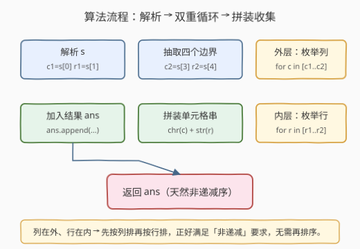
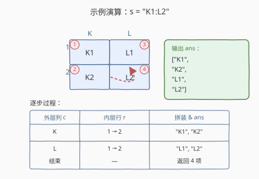

# LeetCode Excel表中某个范围内的单元格 题解

## 1. 题目概述

- **标题 / 题号**：Excel表中某个范围内的单元格（#2194，easy）
- **链接**：https://leetcode.cn/problems/cells-in-a-range-on-an-excel-sheet/
- **难度**：简单
- **标签**：字符串、模拟、枚举

**题意**：Excel 表中一个单元格 `(r, c)` 用字符串 `"<col><row>"` 表示：`<col>` 是**字母**（第 1 列 `'A'`、第 2 列 `'B'`……），`<row>` 是**整数**行号。给定格式为 `"<col1><row1>:<col2><row2>"` 的字符串 `s`，且满足 $r_1 \leq r_2$、$c_1 \leq c_2$，要求找出所有满足 $r_1 \leq r \leq r_2$ 且 $c_1 \leq c \leq c_2$ 的单元格，按 `"<col><row>"` 字符串形式返回，并按**非递减**顺序排列（先按列排，再按行排）。

**示例 1**：

```text
输入：s = "K1:L2"
输出：["K1","K2","L1","L2"]
解释：列 K..L 与行 1..2 的笛卡尔积，共 2×2=4 个单元格。
```

**示例 2**：

```text
输入：s = "A1:F1"
输出：["A1","B1","C1","D1","E1","F1"]
解释：列 A..F、行恒为 1，共 6 个单元格。
```

**约束**：

- `s.length == 5`（`<col>` 与 `<row>` 各占一个字符）
- `'A' <= s[0] <= s[3] <= 'Z'`
- `'1' <= s[1] <= s[4] <= '9'`
- `s` 由大写字母、数字和 `':'` 组成

> 💡 **关键结构**：$s$ 固定 5 字符，下标完全确定——`s[0]`/$s[1]$ 是左上角，`s[3]`/$s[4]$ 是右下角，`s[2]` 恒为 `':'`。题目本质是「在一个字母×数字的二维矩形区域内枚举所有点」。

## 2. 解题思路

### 2.1 暴力思路：枚举所有单元格再排序

最直白的做法：先按字母序枚举全部 26 列、按数字序枚举全部 9 行，对每个单元格判断是否落在 $[c_1, c_2] \times [r_1, r_2]$ 内，收集后再排序返回。这能出正确结果，但**做了大量无效枚举与一次额外排序**——区域大小最多 $26 \times 9 = 234$，虽不影响性能，却把简单问题复杂化了。

### 2.2 核心观察：双重循环直接枚举矩形区域

![核心概念：范围是 [col1..col2] × [row1..row2] 的矩形块](../images/excel_range_concept.svg)

关键观察：

1. **区域是矩形**：满足条件的单元格恰是 $[c_1, c_2] \times [r_1, r_2]$ 的笛卡尔积，**边界已给定为闭区间**，无需逐点判定，直接双重循环枚举即可。
2. **列用字母、行用数字**：本题列是**单字母**（`'A'`–`'Z'`），列序即字符序——`'A' < 'B' < ... < 'Z'`，可直接用字符比较/递增驱动循环；行是单数字字符（`'1'`–`'9'`），转成整数后递增。
3. **输出顺序天然满足**：题目要求「先按列排，再按行排」。只要**外层枚举列、内层枚举行**，按生成顺序收集，结果就是非递减序，**无需再排序**。

> 💡 **为什么外层放列、内层放行？** 题目的「非递减」等价于字典序比较 `"<col><row>"`：先比列字母、列相同再比行数字。外层枚举列、内层枚举行，生成的序列恰好是 `K1, K2, L1, L2`——列优先、列内按行递增，与字典序完全一致。若反过来（外层行、内层列），会得到 `K1, L1, K2, L2`，违反顺序。

> ⚠️ 注意列是**单字母**情况可直接 `chr(c)` 还原；若题目升级为多字母列（如 `"AA1"`），则需用 168 题「Excel 表列名称」的 1-indexed 进制转换逻辑处理列号，本题无需此步骤。

### 2.3 算法流程图



1. **解析**：从 `s` 取四个边界——$c_1 = s[0]$，$r_1 = s[1]$，$c_2 = s[3]$，$r_2 = s[4]$（均为字符）。
2. **外层循环列**：`for c in range(ord(c1), ord(c2) + 1)`，即从 $c_1$ 到 $c_2$ 逐字母递增。
3. **内层循环行**：`for r in range(int(r1), int(r2) + 1)`，即从 $r_1$ 到 $r_2$ 逐数字递增。
4. **拼装**：`ans.append(chr(c) + str(r))`。
5. **返回** `ans`。

### 2.4 示例演算

以示例 1 `s = "K1:L2"` 为例：



| 外层列 $c$ | 内层行 $r$ | 拼装 & 加入 `ans` |
|------------|------------|-------------------|
| K | 1 → 2 | `"K1"`, `"K2"` |
| L | 1 → 2 | `"L1"`, `"L2"` |
| 结束 | — | 返回 4 项 `["K1","K2","L1","L2"]` |

对照示例 2 `s = "A1:F1"`：列 A→F（6 个），行恒为 1（内层只迭代一次），得 `["A1","B1","C1","D1","E1","F1"]`——外层列驱动、内层行退化为单点，仍保持非递减序。

## 3. 参考代码

### Python

```python
class Solution:
    def cellsInRange(self, s: str) -> list[str]:
        c1, r1, c2, r2 = s[0], int(s[1]), s[3], int(s[4])
        ans = []
        for c in range(ord(c1), ord(c2) + 1):
            col = chr(c)
            for r in range(r1, r2 + 1):
                ans.append(col + str(r))
        return ans
```

### C++

```cpp
class Solution {
public:
    vector<string> cellsInRange(string s) {
        char c1 = s[0], c2 = s[3];
        int r1 = s[1] - '0', r2 = s[4] - '0';
        vector<string> ans;
        for (char c = c1; c <= c2; ++c) {
            for (int r = r1; r <= r2; ++r) {
                ans.push_back({c, char('0' + r)});
            }
        }
        return ans;
    }
};
```

> 💡 **实现细节**：① Python 用 `ord`/`chr` 在字母与序号间转换；C++ 直接用 `char` 自增（`'K'+1 == 'L'`），无需显式取序号。② C++ 中 `string{c, char('0'+r)}` 构造一个长度为 2 的字符串，比 `string(1,c)+to_string(r)` 更直接。③ 区域大小最多 $26 \times 9 = 234$，预分配 `ans.reserve((c2-c1+1)*(r2-r1+1))` 可避免扩容，非必需。

## 4. 复杂度分析

| 维度 | 复杂度 | 说明 |
|------|--------|------|
| 时间 | $O((c_2-c_1+1)(r_2-r_1+1))$ | 双重循环枚举区域内每个单元格一次，每项 $O(1)$ 拼装；最坏 $26 \times 9 = 234$ 次操作 |
| 空间 | $O(1)$（不计输出）/ $O((c_2-c_1+1)(r_2-r_1+1))$（含输出） | 仅常数辅助变量；输出数组规模即区域内单元格数 |

> 💡 区域大小上界 234，远低于时限。即使列扩展到多字母（如 `"ZZ"`），渐近复杂度仍是「区域面积」线性，瓶颈在区域大小而非算法本身。

## 5. 扩展：多字母列与 Excel 列号互转

本题列限定为**单字母**（`'A'`–`'Z'`，共 26 列）。真实 Excel 表格支持多字母列（如 `"AA"`、`"ZZ"`、`"XFD"`），此时列号是 **1-indexed 的 26 进制**表示，需要专门的转换逻辑：

- **列名 → 列号**（如 `"ZY"` → 701）：从左到右 Horner 累加，`ans = ans * 26 + (ch - 'A' + 1)`，见 [171. Excel 表列序号](https://leetcode.cn/problems/excel-sheet-column-number/)。
- **列号 → 列名**（如 28 → `"AB"`）：循环 `n--` 后 `% 26` 取余、`/ 26` 进位（先减 1 再取余是关键），见 [168. Excel 表列名称](https://leetcode.cn/problems/excel-sheet-column-title/)。

若把本题扩展为多字母列 + 多位行（如 `"AA10:AB20"`），解析时需先用 `':'` 切分两段、再在每段中分离字母前缀与数字后缀，随后将列名转成整数列号驱动循环，最后再把列号转回列名拼装——本质仍是矩形枚举，仅解析与拼装步骤升级。

## 6. 面试要点

1. **为什么外层枚举列、内层枚举行就能保证非递减序？**
   > 题目要求的「非递减」等价于单元格字符串的字典序：先比列字母、列相同再比行数字。外层枚举列保证列递增；同一列内内层枚举行保证行递增。生成序列 `K1,K2,L1,L2` 与字典序一致，故无需额外排序。

2. **能否不解析、直接对全表枚举再过滤？**
   > 可以但浪费。全表 $26 \times 9 = 234$ 个单元格，逐个判断是否在矩形内再排序，常数更大且多一次排序。直接按闭区间 `[c1,c2]`、`[r1,r2]` 双重循环只生成区域内点，更简洁高效。

3. **列是字母，循环怎么递增？**
   > Python 用 `for c in range(ord(c1), ord(c2)+1)` 配合 `chr(c)` 还原字母；C++ 直接 `for (char c = c1; c <= c2; ++c)`，因为 `char` 本质是整数，`'K'+1 == 'L'` 成立。注意本题列是单字母，字符序即列序。

4. **如果输入列是多字母（如 `"AA1:AB3"`）怎么办？**
   > 需把列名转成整数列号（171 题的 Horner 累加），按整数列号驱动外层循环，拼装时再把列号转回列名（168 题的「先减 1 再取余」进制转换）。行同理可支持多位数字。整体仍是矩形区域枚举。

5. **`s.length == 5` 这个约束带来了什么简化？**
   > 意味着列和行各占**一个字符**：列恒为单字母（`'A'`–`'Z'`），行恒为单数字（`'1'`–`'9'`）。因此无需字符串切分或解析多位数，`s[0]/s[1]/s[3]/s[4]` 直接取到四个边界，循环边界也最简。

> 💡 **一句话总结**：2194 是「闭区间矩形枚举」的字符串模拟题——固定下标取四边界、外层列内层行双重循环、就地拼装收集，生成顺序天然满足非递减。$O(\text{区域面积})$ 时间、$O(1)$ 额外空间，注意列用字符序驱动循环。

## 同类练习题

| # | 题目 | 与本题的关联 |
|---|------|-------------|
| 168 | [Excel表列名称](https://leetcode.cn/problems/excel-sheet-column-title/)（[题解](../0001-0100/168_Excel表列名称.md)） | 1-indexed 进制转换（先减 1 再取余），本题多字母列扩展时的列号→列名母题 |
| 171 | [Excel表列序号](https://leetcode.cn/problems/excel-sheet-column-number/)（[题解](../0101-0200/171_Excel表列序号.md)） | Horner 累乘加合成列号，本题多字母列扩展时的列名→列号母题 |
| 2138 | [将字符串拆分为若干长度为k的组](https://leetcode.cn/problems/divide-a-string-into-groups-of-size-k/)（[题解](../2101-2200/2138_将字符串拆分为若干长度为k的组.md)） | 按固定步长切分字符串并补齐，同属「下标确定 + 字符串拼装」模拟家族 |
| 2129 | [将标题首字母大写](https://leetcode.cn/problems/capitalize-the-title/)（[题解](../2101-2200/2129_将标题首字母大写.md)） | 切分 + 逐词改写 + 拼接，同样是「按规则处理字符串片段」的简单模拟 |
| 118 | [杨辉三角](https://leetcode.cn/problems/pascals-triangle/)（[题解](../0001-0100/118_杨辉三角.md)） | 双重循环按行/列生成元素，与本题「外层驱动、内层枚举」的结构同构 |
