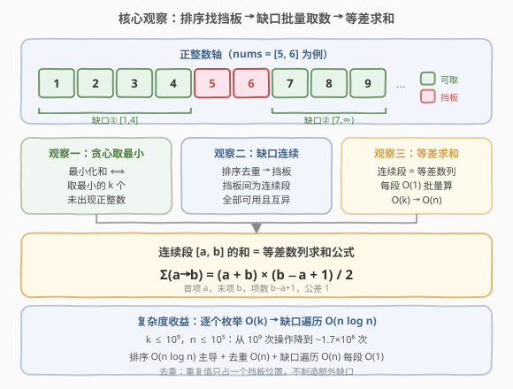
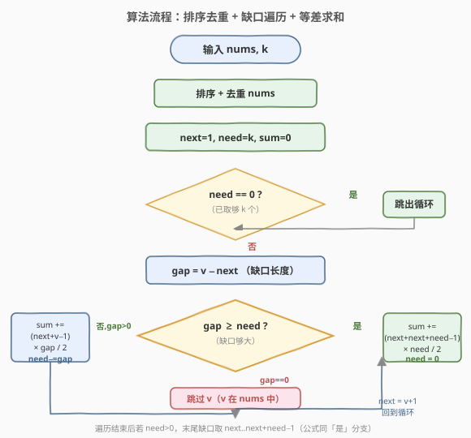

# 向数组中追加K个整数

- **题目名称**：向数组中追加K个整数
- **链接**：[2195. 向数组中追加 K 个整数](https://leetcode.cn/problems/append-k-integers-with-minimal-sum/)
- **难度**：中等
- **标签**：贪心、数学、排序、等差数列

## 1. 题目概述

给你一个整数数组 `nums` 和一个整数 `k`。请你向 `nums` 中追加 `k` 个**未**出现在 `nums` 中的、**互不相同**的**正**整数，并使结果数组的元素和**最小**。

返回追加到 `nums` 中的 `k` 个整数之和。

**示例 1**：

```text
输入：nums = [1,4,25,10,25], k = 2
输出：5
解释：追加的两个互不相同且未出现的正整数是 2 和 3。
nums 最终元素和为 1 + 4 + 25 + 10 + 25 + 2 + 3 = 70，这是所有情况中的最小值。
所以追加的两个整数之和是 2 + 3 = 5，返回 5。
```

**示例 2**：

```text
输入：nums = [5,6], k = 6
输出：25
解释：追加的六个互不相同且未出现的正整数是 1、2、3、4、7、8。
nums 最终元素和为 5 + 6 + 1 + 2 + 3 + 4 + 7 + 8 = 36，这是所有情况中的最小值。
所以追加的六个整数之和是 1 + 2 + 3 + 4 + 7 + 8 = 25，返回 25。
```

**约束条件**：

- $1 \le \text{nums.length} \le 10^5$
- $1 \le \text{nums[i]}, k \le 10^9$

> 💡 题眼有两层：① **最小化和** ⟺ 取最小的 `k` 个未出现正整数——因为正整数越大对和的贡献越大，贪心取最小即可；② **`k` 可达 $10^9$**——逐个枚举候选数 $1,2,3,\ldots$ 会超时，必须利用「未出现数在 `nums` 之间形成连续缺口」的结构，用**等差数列求和**把每个缺口 $O(1)$ 批量吃掉。

---

## 2. 解题思路

### 2.1 暴力思路：逐个枚举候选

最直观的做法：用哈希集合存 `nums`，然后从 $x=1$ 起递增枚举，若 $x$ 不在集合中就累加到答案并递减 `k`，直到取满 `k` 个。

```text
set = {nums...}
x = 1, sum = 0
while k > 0:
    if x not in set:
        sum += x; k -= 1
    x += 1
return sum
```

> ⚠️ 这个做法**正确但超时**：`k` 可达 $10^9$，最坏要枚举 $10^9$ 次（当 `nums` 恰好是 $1,2,\ldots,10^5$ 时，要一直枚举到 $10^5 + 10^9$ 才取够）。$10^9$ 次循环远超时限。必须把「逐个累加」升级为「按连续段批量求和」。

### 2.2 核心观察：排序后按"缺口"批量取数 + 等差数列求和



**观察一：贪心取最小**

要让追加的 `k` 个正整数之和最小，就应取**最小的 `k` 个未出现正整数**。这是经典的贪心直觉：任何「取了较大数而跳过较小可用数」的方案都能通过交换更小数来严格减小和。因此问题等价于——**求 `nums` 之外最小的 `k` 个正整数之和**。

**观察二：`nums` 把正整数轴切成连续"缺口"**

把 `nums` 排序去重后，每个 `nums` 中的值就像一块"挡板"，挡板之间的正整数**全部可用**且**连续**。例如 `nums = [5, 6]`，正整数轴被切成：

```text
[1,2,3,4]  | 5 | 6 |  [7,8,9,...]
 可取缺口      挡板 挡板   可取缺口(无限)
```

- 第一个缺口：$[1,\, \text{first}-1]$（首个挡板之前）；
- 中间缺口：$[v_i+1,\, v_{i+1}-1]$（相邻挡板之间）；
- 末尾缺口：$[\text{last}+1,\, +\infty)$（最后一个挡板之后，无限长）。

**观察三：每个缺口是等差数列，$O(1)$ 求和**

每个缺口都是一段**公差为 1 的连续正整数**，其和可用等差数列求和公式 $O(1)$ 算出：

$$
\sum_{i=a}^{b} i = \frac{(a+b)\,(b-a+1)}{2}
$$

因此算法只需**按缺口顺序依次"吃掉"**，每个缺口要么整段取走（缺口长度 $\le$ 剩余需要的数），要么取走前 `need` 个（缺口长度 $>$ 剩余需要），直到凑满 `k` 个。

> 💡 **关键转化**：把 $O(k)$ 的逐个累加压缩成 $O(n)$ 次缺口遍历 + 每次 $O(1)$ 等差求和。由于 $n \le 10^5 \ll k \le 10^9$，这是从「超时」到「毫秒级」的决定性优化。

**观察四：去重的必要性**

`nums` 中若有重复值（如示例 1 的两个 `25`），它们只占一个挡板位置，不会制造额外缺口。排序后用 `unique` 去重，避免同一位置被重复处理导致 `next` 回退出错。

### 2.3 算法流程图



算法步骤总结：

1. **排序去重**：对 `nums` 排序并去重，得到挡板序列。
2. **初始化**：`next = 1`（下一个候选正整数），`need = k`（还需取多少个），`sum = 0`。
3. **遍历每个挡板 `v`**（按升序）：
   - 若 `need == 0`，已取够，跳出；
   - 计算当前缺口长度 `gap = v - next`（即区间 $[\text{next},\, v-1]$ 中的可用正整数个数）；
   - **若 `gap >= need`**：缺口够大，只取前 `need` 个，即 $\text{next}, \text{next}+1, \ldots, \text{next}+\text{need}-1$，累加 $\frac{(\text{next} + \text{next}+\text{need}-1)\,\text{need}}{2}$，置 `need = 0`，跳出；
   - **若 `0 < gap < need`**：缺口不够，整段取走 $\text{next}, \ldots, v-1$，累加 $\frac{(\text{next}+v-1)\,\text{gap}}{2}$，`need -= gap`，`next = v+1`；
   - **若 `gap == 0`**（即 `v == next`，挡板紧贴候选）：不取任何数，`next = v+1` 跳过挡板。
4. **末尾兜底**：遍历完所有挡板若 `need > 0`，从 `next` 起再取 `need` 个连续正整数（末尾无限缺口），累加 $\frac{(\text{next} + \text{next}+\text{need}-1)\,\text{need}}{2}$。
5. 返回 `sum`。

> 💡 **为什么 `v >= next` 恒成立？** 排序去重后，处理完挡板 $v_i$ 置 `next = v_i + 1`，下一个挡板 $v_{i+1} > v_i$（严格大于，因去重），故 $v_{i+1} \ge v_i + 1 = \text{next}$。因此 `gap = v - next >= 0` 恒成立，无需处理 `v < next` 的退化情况。

### 2.4 示例演算

以 **示例 2** `nums = [5, 6], k = 6` 为例（排序去重后挡板为 `[5, 6]`）：

![示例演算：nums = [5,6], k = 6](../images/2195_example_walkthrough.svg)

| 步 | v | next | 缺口 $[\text{next}, v-1]$ | gap | need(前) | 操作 | sum |
|----|---|------|----------------------------|-----|----------|------|-----|
| 1 | 5 | 1 | $[1, 4]$ | 4 | 6 | gap < need，取 1,2,3,4 | $10$ |
| 2 | 6 | 6 | $[6, 5]$（空） | 0 | 2 | gap=0，跳过 v=6 | $10$ |
| 3 | — | 7 | $[7, +\infty)$（末尾） | — | 2 | 兜底取 7,8 | $25$ |

- **第 1 步**：挡板 `v=5` 之前的缺口是 $[1,4]$，共 4 个数，但需要 6 个，全取走 $1+2+3+4=10$，`need` 降至 2，`next` 推进到 6。
- **第 2 步**：挡板 `v=6` 紧贴 `next=6`（`gap=0`），说明 6 在 `nums` 中不可取，直接跳过，`next` 推进到 7。
- **第 3 步**：挡板已遍历完，`need=2 > 0`，从 `next=7` 起在末尾无限缺口中取 2 个：$7+8=15$。

验证：追加数 $\{1,2,3,4,7,8\}$，和 $= 10 + 15 = 25$ ✓；全部未出现在 `nums={5,6}` 中 ✓；互不相同 ✓。

再看 **示例 1** `nums = [1,4,25,10,25], k = 2`（排序去重后挡板为 `[1, 4, 10, 25]`）：

| 步 | v | next | 缺口 | gap | need | 操作 | sum |
|----|---|------|------|-----|------|------|-----|
| 1 | 1 | 1 | $[1,0]$（空） | 0 | 2 | gap=0，跳过 v=1 | 0 |
| 2 | 4 | 2 | $[2,3]$ | 2 | 2 | gap>=need，取 2,3 | 5 |

- **第 1 步**：首个挡板就是 1，`next=1` 紧贴，`gap=0`，跳过，`next=2`。
- **第 2 步**：挡板 `v=4` 之前缺口 $[2,3]$ 恰好 2 个，`gap=2 >= need=2`，取 2、3 即可，`need=0` 结束。

返回 `sum = 5` ✓。

> ⚠️ **常见陷阱**：有人会想「答案 = $1+2+\cdots+k$ 减去 `nums` 中 $\le k$ 的数之和」。这是**错误**的——因为 `nums` 中 $\le k$ 的数会「挤占」前 $k$ 个位置，把取数范围整体后移。例如 `nums=[1], k=2`：错误算得 $1+2-1=2$，但实际应取 2、3（1 被占用），正确和为 $5$。缺口遍历法天然处理了这种「后移」，无需额外修正。

---

## 3. 参考代码

### C++

```cpp
class Solution {
public:
    long long minimalKSum(vector<int>& nums, int k) {
        sort(nums.begin(), nums.end());
        nums.erase(unique(nums.begin(), nums.end()), nums.end());

        long long sum = 0;
        long long need = k;
        long long next = 1;

        for (int v : nums) {
            if (need == 0) break;
            long long gap = (long long)v - next;            // [next, v-1] 中可取个数
            if (gap >= need) {
                sum += (next + next + need - 1) * need / 2; // 取 next .. next+need-1
                need = 0;
            } else if (gap > 0) {
                sum += (next + (long long)v - 1) * gap / 2; // 取 next .. v-1
                need -= gap;
            }
            next = (long long)v + 1;
        }
        if (need > 0) {
            sum += (next + next + need - 1) * need / 2;     // 末尾缺口取 next .. next+need-1
        }
        return sum;
    }
};
```

### Python

```python
class Solution:
    def minimalKSum(self, nums: List[int], k: int) -> int:
        uniq = sorted(set(nums))

        total = 0
        need = k
        nxt = 1

        for v in uniq:
            if need == 0:
                break
            gap = v - nxt                                  # [nxt, v-1] 中可取个数
            if gap >= need:
                total += (nxt + nxt + need - 1) * need // 2  # 取 nxt .. nxt+need-1
                need = 0
            elif gap > 0:
                total += (nxt + v - 1) * gap // 2             # 取 nxt .. v-1
                need -= gap
            nxt = v + 1

        if need > 0:
            total += (nxt + nxt + need - 1) * need // 2       # 末尾缺口
        return total
```

> ⚠️ **类型陷阱**：`k` 与 `nums[i]` 均可达 $10^9$，累加和最大约 $\sum_{i=1}^{10^9+10^5} i \approx 5\times10^{17}$，远超 32 位 `int` 上界（约 $2.1\times10^9$）。C++ 必须全程用 `long long`，特别是 `gap`、`next`、`need` 以及乘法前的强制转换 `(long long)v`，否则中间乘法溢出会得到错误结果。Python 整数无上限无需处理。

> 💡 **整数除法的安全性**：等差数列和 $\frac{(a+b)\,n}{2}$ 中，$(a+b)$ 与 $n$ 必有一者为偶（因连续 $n$ 个整数中奇偶各半或差一），故乘积恒为偶数，`/ 2`（C++）与 `// 2`（Python）不会截断丢精度。

---

## 4. 复杂度分析

| 维度 | 复杂度 | 说明 |
|------|--------|------|
| **时间复杂度** | $O(n \log n)$ | 排序主导 $O(n\log n)$；去重 $O(n)$；缺口遍历 $O(n)$，每次 $O(1)$ 等差求和。$n \le 10^5$ 时毫秒级 |
| **空间复杂度** | $O(\log n)$ | 排序的递归栈空间（C++ `std::sort` 内省排序）。Python `sorted(set(...))` 另需 $O(n)$ 存去重列表。不计输出则为 $O(n)$ / $O(\log n)$ |

> 💡 复杂度与 `k` 无关——这正是把 $O(k)$ 逐个枚举压缩为 $O(n)$ 缺口遍历的收益。当 $k \gg n$（如 $k=10^9, n=10^5$）时优势最明显：从 $10^9$ 次操作降到 $\sim 10^5\log 10^5 \approx 1.7\times10^6$ 次操作。

---

## 5. 扩展：「自洽方程」解法与陷阱辨析

### 5.1 陷阱：朴素的「$1+\cdots+k$ 减去 `nums` 中 $\le k$ 者」

一个看似巧妙实则错误的做法是：

> 答案 $= \sum_{i=1}^{k} i - \sum_{x \in \text{nums},\, x \le k} x$。

理由是「前 $k$ 个正整数中，被 `nums` 占用的就减掉」。**错在哪？** 错在忽略了「占用一个位置就要把取数上限向后推一位」。反例 `nums=[1], k=2`：

- 错误解：$(1+2) - 1 = 2$；
- 正确解：1 被占用，取 2、3，和 $= 5$。

只有当 `nums` 中 $\le k$ 的数**互不相同且都不超过 $k$** 时，每占用一个就把上限从 $k$ 推到 $k+1$，需要递推修正。

### 5.2 正确的「自洽方程」解法

设最终取数的最大值为 $m$（即取了 $1..m$ 中所有不在 `nums` 的数，恰好 $k$ 个），则：

$$
m - \big|\{x \in \text{nums} : x \le m\}\big| = k
$$

即 $m = k + \big|\{x \in \text{nums} : x \le m\}\big|$。这是一个**自洽方程**：右边依赖 $m$ 本身。由于 $|\{x \le m\}|$ 随 $m$ 单调不降，可用迭代法求解——从 $m = k$ 出发，反复令 $m = k + \text{count}(\text{nums} \le m)$，直到稳定（每轮至少推进一个，最多 $O(n)$ 轮收敛，每轮用二分计数 $O(\log n)$，总计 $O(n \log n)$）。

收敛后，答案 $= \sum_{i=1}^{m} i - \sum_{x \in \text{nums},\, x \le m} x$。

> 💡 该解法与缺口遍历法等价、复杂度相同，但缺口遍历法更直观——它直接模拟「从左到右吃缺口」的过程，无需解自洽方程。面试时推荐缺口遍历法，自洽方程法作为备选思路展示思维深度。

### 5.3 方法论：「连续段批量处理」范式

本题的核心技巧——**把逐个枚举压缩为按连续段批量求和**——是一类通用范式，适用于任何「候选数在数轴上形成若干连续可用段」的题目：

1. 用排序 + 去重识别出「挡板」；
2. 相邻挡板间的可用数构成连续段（等差数列）；
3. 用求和公式 $O(1)$ 处理每段，而非逐个累加。

> 💡 该范式还见于 [2178. 拆分成最多数目的正偶数之和](../2101-2200/2178_拆分成最多数目的正偶数之和.md)（取最小互异正偶数序列，连续段为 $2,4,\ldots,2k$）等题。

---

## 6. 面试要点

1. **为什么不能逐个枚举 $1,2,3,\ldots$？**

   - `k` 可达 $10^9$，最坏枚举次数约 $10^9 + n$，远超时限。必须利用 `nums` 把数轴切成连续缺口的结构，用等差求和 $O(1)$ 批量处理每个缺口，把 $O(k)$ 降为 $O(n\log n)$。

2. **为什么贪心取最小的 `k` 个未出现正整数一定最优？**

   - 正整数对和的贡献随其大小单调递增。若某方案取了较大的 $b$ 而跳过较小的可用 $a$（$a<b$，$a$ 不在 `nums`），把 $b$ 换成 $a$ 后和严格减小且仍合法（互异、未出现、正整数）。故最优解必为最小的 `k` 个可用正整数。

3. **为什么要排序去重？**

   - 排序使挡板按升序排列，缺口自然有序，可从左到右依次「吃掉」；去重是因为 `nums` 中的重复值只占一个挡板位置（如示例 1 的两个 25），不去重会导致同一位置被多次处理、`next` 异常回退。

4. **「$1+\cdots+k$ 减去 `nums` 中 $\le k$ 者」为什么错？**

   - 它假设取数范围上界就是 $k$，但 `nums` 中 $\le k$ 的数会挤占前 $k$ 个位置，把上界整体后移。反例 `nums=[1], k=2` 得 2，正确为 5。需用自洽方程 $m = k + |\{x \le m\}|$ 修正上界，或直接用缺口遍历法天然处理。

5. **`gap == 0` 表示什么？为什么要单独处理？**

   - `gap = v - next = 0` 表示挡板 `v` 紧贴当前候选 `next`，即 `v == next`，该数在 `nums` 中不可取。此时不累加任何数，仅把 `next` 推进到 `v+1` 跳过挡板。若不单独处理而误用求和公式，会累加一个长度为 0 的空段（结果恰为 0，无害），但显式跳过更清晰。

6. **溢出如何防范？**

   - 和最大约 $5\times10^{17}$，超 32 位 `int` 但在 `long long`（$\le 9.2\times10^{18}$）范围内。C++ 须全程 `long long`，且 `v`（来自 `vector<int>`）参与乘法前必须显式转换 `(long long)v`，否则 `int × long long` 中 `int` 先提升虽一般安全，但 `v - next` 在 `v` 为 `int`、`next` 为 `long long` 时会自动提升，仍建议显式转换以示清晰。Python 无此问题。

> 💡 **一句话总结**：2195 是「**连续段批量处理**」的招牌题——排序去重找挡板、缺口遍历吃连续段、等差求和 $O(1)$ 每段，三步把 $O(k)$ 压成 $O(n\log n)$；核心是把数轴上的「洞」看作等差数列而非逐个枚举。

---

## 7. 同类练习题

- [2178. 拆分成最多数目的正偶数之和](https://leetcode.cn/problems/maximum-split-of-positive-even-integers/)（[站内题解](../2101-2200/2178_拆分成最多数目的正偶数之和.md)）：同为「取最小互异序列」贪心，连续段为 $2,4,\ldots,2k$，用等差求和定上界，与本题缺口求和思想互通
- [2139. 得到目标值的最小移动次数](https://leetcode.cn/problems/minimum-moves-to-reach-target-score/)（[站内题解](../2101-2200/2139_得到目标值的最小移动次数.md)）：贪心 + 数学，反向从大数消耗稀缺的翻倍操作，与本题「把稀缺资源留给合适位置」的贪心直觉相通
- [829. 连续整数求和](https://leetcode.cn/problems/consecutive-numbers-sum/)（[站内题解](../0801-0900/829_连续整数求和.md)）：拆成连续正整数之和的方案数，等差数列求和公式反解起点，与本题共享「连续段求和」的数学工具
- [254. 因子的组合](https://leetcode.cn/problems/factor-combinations/)（[站内题解](../0201-0300/254_因子的组合.md)）：拆成因子之积的回溯，是 2195 在「乘法域」的镜像题，对比加法连续段与乘法因子的处理差异
- [343. 整数拆分](https://leetcode.cn/problems/integer-break/)（[站内题解](../0301-0400/343_整数拆分.md)）：拆整数使乘积最大，切分型 DP + 贪心切成 3，与本题「拆/补整数」主题对照（一个最小化和、一个最大化积）
