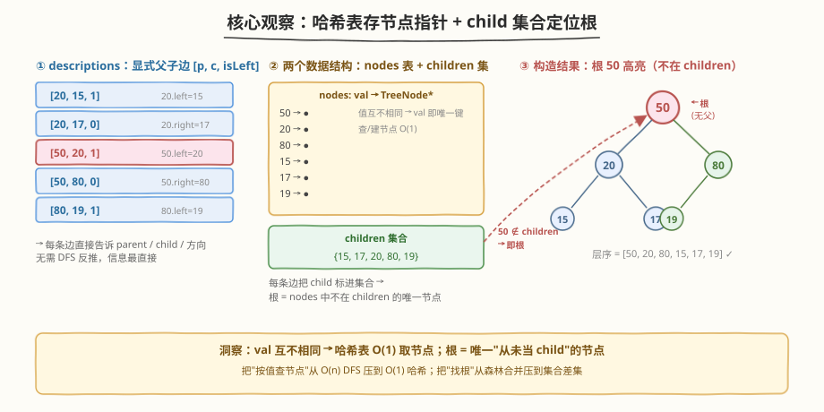
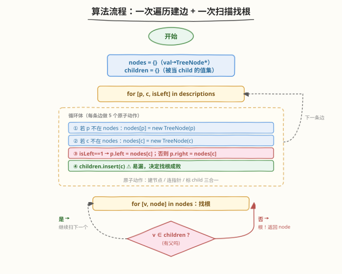
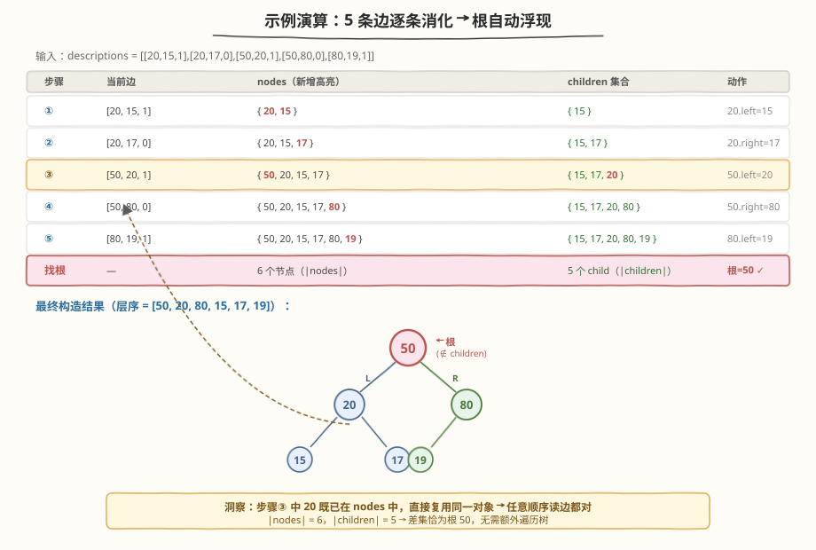

# LeetCode 根据描述创建二叉树 题解

## 1. 题目概述

- **标题 / 题号**：根据描述创建二叉树（#2196，medium）
- **链接**：https://leetcode.cn/problems/create-binary-tree-from-descriptions/
- **难度**：中等
- **标签**：树、二叉树、哈希表、构造

**题意**：给你一个二维整数数组 `descriptions`，其中 `descriptions[i] = [parenti, childi, isLefti]` 表示 `parenti` 是 `childi` 在二叉树中的父节点，二叉树中各节点的值 **互不相同**。`isLefti == 1` 表示 `childi` 是左子节点，`isLefti == 0` 表示右子节点。请根据描述构造二叉树并返回其根节点。测试用例保证可以构造出有效的二叉树。

**示例 1**：

```text
输入：descriptions = [[20,15,1],[20,17,0],[50,20,1],[50,80,0],[80,19,1]]
输出：[50,20,80,15,17,19]
解释：根节点是 50（无父节点）。构造结果：
            50
           /  \
          20   80
         / \   /
        15 17 19
```

**示例 2**：

```text
输入：descriptions = [[1,2,1],[2,3,0],[3,4,1]]
输出：[1,2,null,null,3,4]
解释：根节点是 1（无父节点）。构造结果：
        1
       /
      2
       \
        3
       /
      4
```

**约束**：

- $1 \le \text{descriptions.length} \le 10^4$
- $\text{descriptions[i].length} == 3$
- $1 \le \text{parenti}, \text{childi} \le 10^5$
- $0 \le \text{isLefti} \le 1$
- `descriptions` 所描述的是一棵有效二叉树

> 💡 三个关键前提：① 节点值**互不相同** → val 可直接当哈希键；② 描述给出的是**显式父子边**（不像 [105](../0101-0200/105_从前序与中序遍历序列构造二叉树.md)/[106](../0101-0200/106_从中序与后序遍历序列构造二叉树.md) 要从遍历序列反推），信息最直接；③ 测试用例保证**有效** → 不必校验环/多父等异常。这三个前提共同把问题压成"建节点 + 连边 + 找根"三步纯模拟。

## 2. 解题思路

### 2.1 暴力思路：森林数组 + 每条边 DFS 查 parent

最直白的做法：维护一个"森林"数组（多棵局部树的根列表）。每来一条 `[p, c, isLeft]`：

1. 在森林的所有树里 DFS 查找值为 `p` 的节点 → $O(V)$ 每条边；
2. 若找到，把 `c` 挂到对应左/右孩子位；若 `p` 不在任何树中，新建一棵以 `p` 为根的树加入森林；
3. 后续若发现某棵树的根其实是另一棵树中某节点的孩子，还得把两棵树合并。

总复杂度 $O(VE) = O(n^2)$，且"森林合并"分支极易写错。痛点是**没有索引**——查节点要靠遍历。

> ⚠️ 暴力法的根因痛点：节点没有"按值定位"的索引。每条边都要全树 DFS 找 parent，$n$ 条边 × 每次扫 $n$ 个节点 = $n^2$。只要把"值 → 节点指针"的映射建起来，查找就变 $O(1)$。

### 2.2 核心观察：哈希表存节点 + child 集合找根



两个叠加技巧：

1. **哈希表 `nodes: val → TreeNode*`**：由于节点值互不相同，val 即天然主键。每条边来时，$O(1)$ 取出或新建 parent/child 节点，直接挂指针。无需 DFS、无需森林合并——任意顺序读 descriptions 都对。
2. **`children` 集合找根**：根是唯一"从未作为 child 出现"的节点。遍历 descriptions 时顺手把每个 `childi` 丢进 `children` 集合；建完所有边后扫一遍 `nodes`，不在 `children` 里的那个就是根。

> 💡 **为什么根"必在 `nodes` 中且不在 `children` 中"？** 一棵有效二叉树有 $n$ 个节点、$n-1$ 条边。每条边恰有一个 child，故 `children` 集合大小恰为 $n-1$，恰好覆盖除根外的所有节点。根在 `nodes` 中（作为某条边的 parent 被建出），又不在 `children` 中——这两个条件唯一确定根。

> ⚠️ **"互不相同"是哈希表法成立的前提**。若节点值可重复，val 不能当唯一键，需改用"边列表 + 入度表 + 拓扑排序"（类似 [207. 课程表](../0201-0300/207_课程表.md)）的方式构造——但本题保证了唯一性，无需绕路。

### 2.3 算法流程图



**完整步骤**：

1. **初始化**：空哈希表 `nodes`、空集合 `children`。
2. **遍历 `descriptions`**，对每条 `[p, c, isLeft]`：
   - 若 `nodes` 中无 `p`，`nodes[p] = new TreeNode(p)`；
   - 若 `nodes` 中无 `c`，`nodes[c] = new TreeNode(c)`；
   - `isLeft == 1` → `nodes[p]->left = nodes[c]`，否则 `nodes[p]->right = nodes[c]`；
   - `children.insert(c)`。
3. **找根**：遍历 `nodes` 的所有键值对，返回第一个 `key` 不在 `children` 中的节点。
4. **返回** 该节点。

> ⚠️ 唯一易错点：**新建 child 节点后别忘了 `children.insert(c)`**。若只建节点忘记标记，根的判定会失效——所有节点都"看起来像根"，返回错误的某个非根节点。把"建节点 / 连指针 / 标 child"三步合成一个原子动作可避免遗漏。

### 2.4 示例演算

用示例 1 演示 `nodes` 与 `children` 的逐步演化：



**示例 1：`descriptions = [[20,15,1],[20,17,0],[50,20,1],[50,80,0],[80,19,1]]`**

| 步骤 | 当前边 | `nodes`（新增高亮） | `children` 集合 | 动作 |
|------|-------|---------------------|----------------|------|
| 初始 | — | `{}` | `{}` | — |
| ① | `[20,15,1]` | `{`**`20`**`,` **`15`**`}` | `{15}` | 建 20、15；`20.left = 15` |
| ② | `[20,17,0]` | `{20, 15, `**`17`**`}` | `{15, 17}` | 20 已存在；建 17；`20.right = 17` |
| ③ | `[50,20,1]` | `{`**`50`**`, 20, 15, 17}` | `{15, 17, `**`20`**`}` | 建 50；20 已存在；`50.left = 20` |
| ④ | `[50,80,0]` | `{50, 20, 15, 17, `**`80`**`}` | `{15, 17, 20, 80}` | 50 已存在；建 80；`50.right = 80` |
| ⑤ | `[80,19,1]` | `{50, 20, 15, 17, 80, `**`19`**`}` | `{15, 17, 20, 80, 19}` | 80 已存在；建 19；`80.left = 19` |
| 找根 | — | 6 个节点 | 5 个 child | 仅 `50` 不在 `children` → **根 = 50** ✓ |

> 💡 注意步骤 ③：`20` 此前已作为 parent 建出（步骤 ①），现在又作为 child 出现——这正是"任意顺序读 descriptions 都对"的体现：哈希表保证 `20` 始终指向同一个节点对象，先建后连与先连后建等价。若用暴力森林法，步骤 ① 会把 `20` 当作一棵树的根，步骤 ③ 又得把它"降级"为 `50` 的孩子并合并两棵树——哈希表法直接消解了这种顺序依赖。

最终树：

```text
        50
       /  \
      20   80
     / \   /
    15 17 19
```

层序遍历 `[50, 20, 80, 15, 17, 19]` ✓

## 3. 参考代码

### C++（哈希表 + child 集合，推荐）

```cpp
class Solution {
  public:
    TreeNode* createBinaryTree(vector<vector<int>>& descriptions) {
        unordered_map<int, TreeNode*> nodes;
        unordered_set<int> children;
        for (auto& d : descriptions) {
            int p = d[0], c = d[1], isLeft = d[2];
            if (!nodes.count(p)) nodes[p] = new TreeNode(p);
            if (!nodes.count(c)) nodes[c] = new TreeNode(c);
            if (isLeft) nodes[p]->left  = nodes[c];
            else        nodes[p]->right = nodes[c];
            children.insert(c);
        }
        for (auto& [v, node] : nodes)
            if (!children.count(v)) return node;
        return nullptr; // 题目保证有效, 不会走到
    }
};
```

### Python（哈希表 + child 集合，推荐）

```python
class Solution:
    def createBinaryTree(self, descriptions: List[List[int]]) -> Optional[TreeNode]:
        nodes: dict[int, TreeNode] = {}
        children: set[int] = set()
        for p, c, isLeft in descriptions:
            if p not in nodes:
                nodes[p] = TreeNode(p)
            if c not in nodes:
                nodes[c] = TreeNode(c)
            if isLeft:
                nodes[p].left = nodes[c]
            else:
                nodes[p].right = nodes[c]
            children.add(c)
        for v, node in nodes.items():
            if v not in children:
                return node
        return None  # 题目保证有效, 不会走到
```

> 💡 两种语言写法完全同构：`nodes` 用 dict/map 存"值→节点指针"，`children` 用 set 存"被作为孩子过的值"。一次遍历建边 + 一次遍历找根，无递归、无 DFS。

## 4. 复杂度分析

| 维度 | 复杂度 | 说明 |
|------|-------|------|
| **时间复杂度** | $O(n)$ | 每条 description 做常数次哈希操作（建节点 / 取节点 / 连指针 / 标 child），共 $n$ 条；最后扫一遍 `nodes`（$\le n$ 个节点）找根 |
| **空间复杂度** | $O(n)$ | `nodes` 存全部 $n$ 个 `TreeNode`，`children` 存 $n-1$ 个 child 值；输出树本身也占 $O(n)$，属必需开销 |

> 💡 $n \le 10^4$ 时 $O(n)$ 极其宽松。即便用 $O(n \log n)$ 的有序 map 也能通过，但 $O(1)$ 哈希是本题的正解复杂度。空间上 `TreeNode` 是输出必需，无法省；`children` 集合的 $n-1$ 个值是找根的代价，可换算成"对每个节点存入度计数"的方式（空间同为 $O(n)$，但能顺带做多父异常检测）。

## 5. 扩展：找根的两种等价视角

本题"找根"有两条等价路径，理解它们的差异有助于迁移到变式题。

### 5.1 缺失视角（本题做法）：根 = 没人当 child 的节点

维护 `children` 集合，根是 `nodes` 中不在 `children` 里的唯一节点。

- **前提**：需要一个独立的 `children` 集合（或等价的入度表）。
- **代价**：额外 $O(n)$ 空间存 child 标记。
- **优点**：一次扫描建边，一次扫描找根，逻辑最简。

### 5.2 上溯视角：从任意节点沿 parent 指针爬到顶

维护 `childToParent: val → parentVal` 映射。建完边后任取一个节点（比如 `descriptions[0][1]`），沿 `childToParent` 一直爬到 `map` 中查不到的值——那就是根。

- **前提**：需要 `childToParent` 映射（同样是 $O(n)$ 空间）。
- **代价**：上溯路径长度最坏 $O(n)$（树退化为链时）。
- **优点**：天然处理"只给一个节点找根"的场景；与 [236. 二叉树的最近公共祖先](../0201-0300/236_二叉树的最近公共祖先.md) 的"父指针上溯"思路同源。

> 💡 两种视角的本质都是"根无父"。缺失视角是**被动排除**（筛掉所有有父的），上溯视角是**主动追寻**（从一个节点一路向上）。本题两种都 $O(n)$，按口味选；变式题里若只给局部信息，上溯视角更灵活。

## 6. 面试要点

1. **为什么节点值互不相同是关键前提？**

   - 哈希表 `nodes: val → TreeNode*` 要求 val 是唯一键。若值可重复，同一个 val 可能对应多个节点对象，map 只能存最后一个，连指针会错连到错误节点。
   - 此时需改用"边列表 + 入度表 + 拓扑排序"（类似 [207. 课程表](../0201-0300/207_课程表.md)），用节点 id 而非 val 作键。本题保证唯一，故可直接用 val。

2. **为什么任意顺序读 descriptions 都对？**

   - 哈希表保证"同一个 val 永远映射到同一个 `TreeNode*` 对象"。无论某条边是先作为 parent 出现还是先作为 child 出现，后续访问拿到的都是同一个对象，修改其 `left/right` 指针立即生效。
   - 暴力森林法不行：若 `[50,20,1]` 出现在 `[20,15,1]` 之后，步骤 ① 会把 `20` 当独立树根，步骤 ③ 才发现它该是 `50` 的孩子——需要合并两棵树。哈希表消解了这种顺序依赖。

3. **如何保证根一定在 `nodes` 中？**

   - 题目保证 `descriptions.length >= 1`，即至少一条边。根至少在某条边中作为 `parent` 出现（否则它没有任何子节点，必为孤立单点，但那样不会有边描述它，与"至少一条边"矛盾）。
   - 故遍历 descriptions 时根必被 `nodes[p] = new TreeNode(p)` 建出。若题目允许 $n=1$ 且 descriptions 为空，需特判空输入返回 `nullptr`，本题无需。

4. **`children` 集合能否替换为入度数组？**

   - 可以。维护 `indegree: val → int`，每条边 `indegree[c]++`。最后扫 `nodes` 找 `indegree[v] == 0` 的节点即为根。空间同为 $O(n)$。
   - 入度版还能顺带做多父异常检测（`indegree > 1` 即异常），但本题保证有效，`children` 集合的"存在性判定"已足够，写起来更简洁。

5. **若题目不保证"有效二叉树"，需要哪些额外校验？**

   - ① **多父检测**：某 child 出现在多条边中 → `children` 中重复 insert（set 自动去重，需改为计数）。
   - ② **环检测**：边数 $\ge n$ 时必有环，或用并查集（[684. 冗余连接](../0601-0700/684_冗余连接.md)）判 union 失败。
   - ③ **多根检测**：`nodes - children` 集合大小 $> 1$ → 多棵树。
   - 本题保证有效，这些校验可省，但面试时可主动提及以展示边界意识。

> 💡 **一句话总结**：2196 的核心是"哈希表把'按值查节点'压到 $O(1)$ + child 集合把'找根'压到 $O(n)$"。识别出"节点值互不相同 → val 即主键"这一前提，就能把看似要 DFS 的构造题降维成纯模拟。模板可迁移到一切"显式父子边 + 节点唯一标识"的树/图构造题。

## 同类练习题

| # | 题目 | 与本题的关联 |
|---|------|-------------|
| 105 | [从前序与中序遍历序列构造二叉树](https://leetcode.cn/problems/construct-binary-tree-from-preorder-and-inorder-traversal/)（[题解](../0101-0200/105_从前序与中序遍历序列构造二叉树.md)） | 构造二叉树家族招牌题——从遍历序列反推父子关系，对照本题"父子关系直接给出"的信息丰度差异 |
| 106 | [从中序与后序遍历序列构造二叉树](https://leetcode.cn/problems/construct-binary-tree-from-inorder-and-postorder-traversal/)（[题解](../0101-0200/106_从中序与后序遍历序列构造二叉树.md)） | 与 105 配对的构造题，后序末位定根 + 中序切分，巩固"递归构造二叉树"模板 |
| 297 | [二叉树的序列化与反序列化](https://leetcode.cn/problems/serialize-and-deserialize-binary-tree/)（[题解](../0201-0300/297_二叉树的序列化与反序列化.md)） | 序列化构造的招牌题，前序 + 队列重建，对照本题"边列表直接构造"的另一条路径 |
| 138 | [复制带随机指针的链表](https://leetcode.cn/problems/copy-list-with-random-pointer/)（[题解](../0101-0200/138_复制带随机指针的链表.md)） | 同为"哈希表存节点 + 一次遍历连指针"范式——原节点 → 新节点映射，与本题"val → TreeNode*"同构 |
| 236 | [二叉树的最近公共祖先](https://leetcode.cn/problems/lowest-common-ancestor-of-a-binary-tree/)（[题解](../0201-0300/236_二叉树的最近公共祖先.md)） | 扩展 5.2 的"父指针上溯"视角，对照本题"child 集合找根"的另一条等价路径 |
