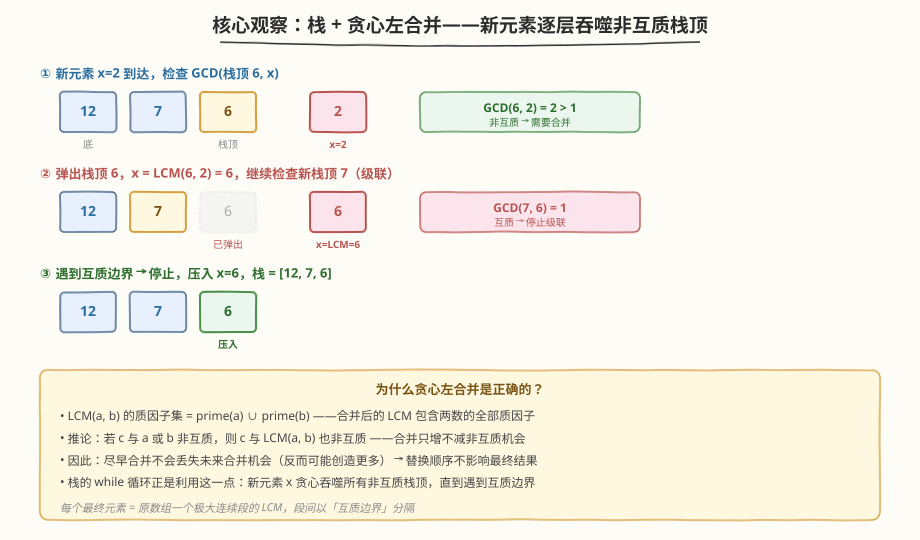
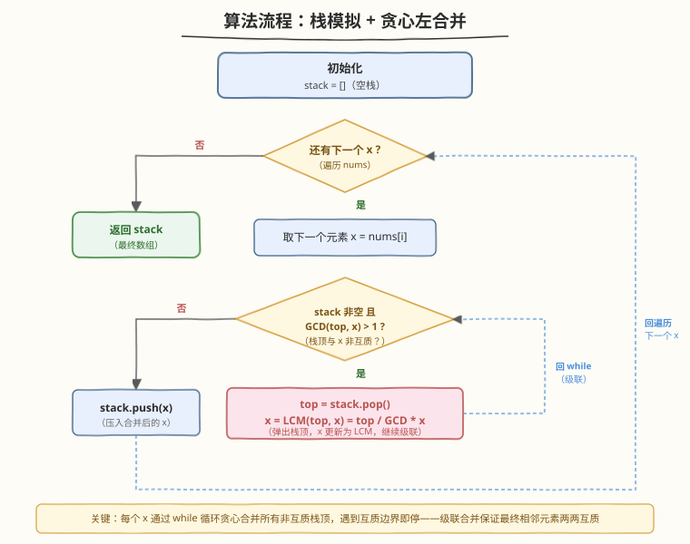
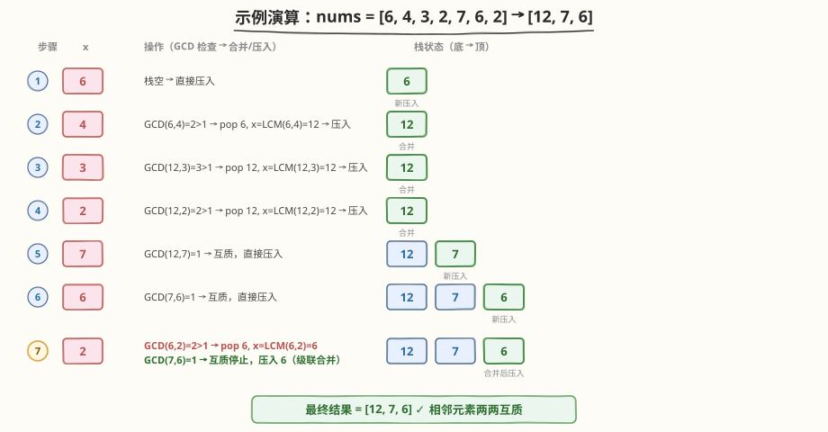

# 替换数组中的非互质数

- **题目名称**：替换数组中的非互质数
- **链接**：[2197. 替换数组中的非互质数](https://leetcode.cn/problems/replace-non-coprime-numbers-in-array/)
- **难度**：困难
- **标签**：栈、数论、贪心、GCD/LCM、模拟

## 1. 题目概述

给定一个整数数组 `nums`，反复执行以下操作直到无法继续：

1. 找到**任意**两个**相邻**的**非互质**数（$\gcd(x, y) > 1$）
2. 删除这两个数，替换为它们的**最小公倍数** $\text{lcm}(x, y)$
3. 重复直到不存在相邻非互质对

返回最终数组。**题目保证：无论以何种顺序替换，最终结果相同**，且最终数组中的值 $\le 10^8$。

**示例 1**：

```text
输入：nums = [6,4,3,2,7,6,2]
输出：[12,7,6]
解释：
- (6,4) → lcm(6,4)=12，nums = [12,3,2,7,6,2]
- (12,3) → lcm(12,3)=12，nums = [12,2,7,6,2]
- (12,2) → lcm(12,2)=12，nums = [12,7,6,2]
- (6,2) → lcm(6,2)=6，nums = [12,7,6]
```

**示例 2**：

```text
输入：nums = [2,2,1,1,3,3,3]
输出：[2,1,1,3]
解释：
- (3,3) → lcm=3，nums = [2,2,1,1,3,3]
- (3,3) → lcm=3，nums = [2,2,1,1,3]
- (2,2) → lcm=2，nums = [2,1,1,3]
```

**约束条件**：

- $1 \le \text{nums.length} \le 10^5$
- $1 \le \text{nums[i]} \le 10^5$
- 最终数组中的值 $\le 10^8$

> 💡 关键信号：①「任意顺序替换结果相同」说明最终结果由数组结构唯一决定，可用贪心策略；②「相邻 + 替换」是栈模拟的典型信号（类比 [735. 行星碰撞](https://leetcode.cn/problems/asteroid-collision/)）；③ $n \le 10^5$ 排除 $O(n^2)$ 暴力反复扫描。

---

## 2. 解题思路

### 2.1 暴力思路：反复扫描

最直白的做法：每轮从左到右扫描数组，找到第一对相邻非互质数，替换为 LCM，然后从头重新开始。重复直到某轮扫描未发现非互质对。

```text
changed = true
while changed:
    changed = false
    for i in 0..n-2:
        if gcd(nums[i], nums[i+1]) > 1:
            nums[i] = lcm(nums[i], nums[i+1])
            remove nums[i+1]
            changed = true
            break  # 从头重新扫
```

时间复杂度：最坏情况下每次合并只缩短数组 1 个元素，需 $O(n)$ 轮，每轮 $O(n)$ 扫描 → $O(n^2)$。当 $n = 10^5$ 时必然超时。

> ⚠️ 暴力法的核心痛点：合并后产生的新值可能与**左侧**已扫过的元素再次非互质（级联效应），迫使从头重扫。如果能在单趟扫描中就处理好这种级联，就能降到 $O(n)$。

### 2.2 核心观察：栈 + 贪心左合并



将暴力法「从头重扫」的痛点消除，关键在于用**栈**模拟单趟扫描 + **贪心左合并**：

1. **从左到右逐个处理** `nums` 中的元素 `x`
2. 对每个 `x`，检查它与**栈顶**是否非互质：$\gcd(\text{stack.top()}, x) > 1$？
3. **若是**：弹出栈顶，将 `x` 更新为 $\text{lcm}(\text{top}, x)$，**继续检查新栈顶**（级联）
4. **若否**（互质或栈空）：压入 `x`，处理下一个元素

**为什么这样能正确处理级联？** 当 `x` 与栈顶合并为 LCM 后，新值可能继续与新栈顶非互质。`while` 循环让 `x` 不断吞噬非互质栈顶，直到遇到互质边界——这等价于暴力法中「合并后回头重扫」的效果，但每个元素只被压入/弹出各一次。

> 💡 **关键数学性质**：$\text{lcm}(a, b)$ 的质因子集 $= \text{prime}(a) \cup \text{prime}(b)$。因此合并后的 LCM **包含两数的全部质因子**，与任何数的非互质性**只增不减**。这意味着：
> - 尽早合并不会丢失未来的合并机会（反而可能创造更多）
> - 最终结果由数组结构唯一决定，与替换顺序无关（题目保证）
> - 贪心左合并是安全的

### 2.3 算法流程图



**完整步骤**：

1. **初始化**：空栈 `stack = []`
2. **遍历** `nums` 中每个元素 `x`：
   - **while 循环**（级联合并）：当栈非空且 $\gcd(\text{stack}[-1], x) > 1$：
     - 弹出栈顶 `top = stack.pop()`
     - 更新 `x = lcm(top, x)` $= \text{top} / \gcd(\text{top}, x) \times x$（先除后乘避免溢出）
   - **压入** `x` 进栈
3. **返回** `stack`（即为最终数组）

> ⚠️ **LCM 计算顺序**：必须写成 `top / g * x`（先除后乘），不能写成 `top * x / g`。虽然最终结果 $\le 10^8$ 不会溢出 `int`，但中间的 `top * x` 可能高达 $10^8 \times 10^5 = 10^{13}$ 导致溢出。先除后乘保证中间值始终 $\le 10^8$。

### 2.4 示例演算

以示例 1 `nums = [6, 4, 3, 2, 7, 6, 2]` 为例，逐步展示栈的演变：



| 步骤 | x | GCD 检查 | 操作 | 栈状态 |
|------|---|---------|------|--------|
| 1 | 6 | — | 栈空，压入 | `[6]` |
| 2 | 4 | $\gcd(6,4)=2>1$ | 合并：$\text{lcm}=12$ | `[12]` |
| 3 | 3 | $\gcd(12,3)=3>1$ | 合并：$\text{lcm}=12$ | `[12]` |
| 4 | 2 | $\gcd(12,2)=2>1$ | 合并：$\text{lcm}=12$ | `[12]` |
| 5 | 7 | $\gcd(12,7)=1$ | 互质，压入 | `[12, 7]` |
| 6 | 6 | $\gcd(7,6)=1$ | 互质，压入 | `[12, 7, 6]` |
| 7 | 2 | $\gcd(6,2)=2>1$ → $\text{lcm}=6$；$\gcd(7,6)=1$ | 级联合并后压入 | `[12, 7, 6]` |

> 💡 **第 7 步是关键**：`x=2` 先与栈顶 `6` 合并为 $\text{lcm}(6,2)=6$，更新后的 `x=6` 继续检查新栈顶 `7`——$\gcd(7,6)=1$，停止。这就是「级联合并」：一次 `while` 循环内连续处理了两步 GCD 检查。暴力法需要回头重扫，栈法在原地完成。

---

## 3. 参考代码

### C++

```cpp
// 替换数组中的非互质数.cpp —— 栈模拟 + 贪心左合并
// 编译: g++ -O2 -std=c++17 替换数组中的非互质数.cpp -o replace_non_coprime
#include <vector>
#include <numeric>
using namespace std;

class Solution {
  public:
    vector<int> replaceNonCoprimes(vector<int>& nums) {
        vector<int> stk;
        for (int x : nums) {
            while (!stk.empty()) {
                int g = gcd(stk.back(), x);
                if (g == 1) break;        // 互质，停止级联
                long long top = stk.back();
                stk.pop_back();
                x = top / g * x;          // LCM = top / gcd * x（先除后乘防溢出）
            }
            stk.push_back(x);
        }
        return stk;
    }
};
```

> 💡 `std::gcd` 位于 `<numeric>`（C++17）。`top` 用 `long long` 接收是防御性写法——虽然最终值 $\le 10^8$ 不会溢出 `int`，但 `top / g * x` 中若 `top` 和 `x` 均接近 $10^8$，中间乘法用 `int` 可能有风险（实际不会发生，但 `long long` 更安全）。

### Python

```python
import math
from typing import List

class Solution:
    def replaceNonCoprimes(self, nums: List[int]) -> List[int]:
        stk = []
        for x in nums:
            while stk:
                g = math.gcd(stk[-1], x)
                if g == 1:
                    break                # 互质，停止级联
                top = stk.pop()
                x = top // g * x          # LCM = top // gcd * x
            stk.append(x)
        return stk
```

> 💡 Python 的大整数自动不会溢出，但仍写成 `top // g * x`（先除后乘）以保持与 C++ 一致的计算逻辑。也可直接用 `math.lcm(top, x)`（Python 3.9+），但手写更直观地展示 LCM 与 GCD 的关系。

---

## 4. 复杂度分析

| 维度 | 复杂度 | 说明 |
|------|--------|------|
| **时间复杂度** | $O(n \log V)$ | 每个元素至多被压入/弹出各一次，共 $O(n)$ 次栈操作；每次操作包含一次 $\gcd$ 计算，耗时 $O(\log V)$，其中 $V = \max(\text{nums[i]}) \le 10^8$ |
| **空间复杂度** | $O(n)$ | 栈最多存放 $n$ 个元素（最坏情况：所有元素两两互质，无合并） |

> 💡 **时间复杂度详细分析**：虽然 `while` 循环看似可能反复执行，但每次 `pop` 操作永久移除一个元素，$n$ 个元素总共最多被弹出 $n$ 次。因此 `while` 循环的总执行次数（跨所有 `for` 迭代）$\le n$，均摊到每次 `for` 迭代为 $O(1)$。加上 $\gcd$ 的 $O(\log V)$，总时间 $O(n \log V)$。

---

## 5. 扩展：为什么替换顺序不影响最终结果

题目保证「以任意顺序替换相邻非互质数都可以得到相同的结果」。这一性质是贪心栈解法正确性的基石，下面给出严格证明。

### 5.1 核心引理：LCM 的质因子吸收性

**引理**：$\text{lcm}(a, b)$ 的质因子集 $= \text{prime}(a) \cup \text{prime}(b)$。

**推论**：对任意 $c$，若 $\gcd(a, c) > 1$ 或 $\gcd(b, c) > 1$，则 $\gcd(\text{lcm}(a, b), c) > 1$。

> 直觉：LCM「吸收」了两数的所有质因子。任何与 $a$ 或 $b$ 非互质的数，也必然与 LCM 非互质。合并**只增不减**非互质机会。

### 5.2 替换顺序无关性

设数组中某一段连续元素 $a_1, a_2, \ldots, a_k$，它们最终会被合并为一个值 $L = \text{lcm}(a_1, a_2, \ldots, a_k)$，且 $L$ 与左右邻居互质。

- **无论先合并哪一对**，合并后的值都是某些 $a_i$ 的 LCM，其质因子集是这些 $a_i$ 质因子集的并集
- 由引理，合并后的值与剩余元素的非互质关系**不会减少**
- 最终整段必然完全合并为 $L = \text{lcm}(a_1, \ldots, a_k)$，与合并顺序无关

### 5.3 栈法等价性

栈的贪心左合并等价于：对每个新元素 `x`，尽可能向左合并（吞噬非互质栈顶），直到遇到互质边界。由 5.2，这等价于以任意顺序替换——最终每个栈元素就是一段极大连续段的 LCM，段间以互质边界分隔。

> ⚠️ **不是所有「替换」题都有顺序无关性**。本题的特殊性在于 LCM 的质因子吸收性保证了合并的「单调增强」。若替换操作是加法、减法等不满足此性质的运算，则替换顺序可能影响结果，栈法未必适用。

---

## 6. 面试要点

1. **为什么用栈而不是反复扫描？**

   - 反复扫描是 $O(n^2)$，$n = 10^5$ 时超时。栈法利用「合并后新值可能与左侧元素再次非互质」这一级联特性，通过 `while` 循环在单趟扫描中就地处理，每个元素至多入栈/出栈各一次，均摊 $O(1)$。

2. **while 循环的作用是什么？能否换成 if？**

   - `while` 处理**级联合并**：`x` 与栈顶合并为 LCM 后，新值可能继续与新栈顶非互质。`if` 只检查一次，会漏掉「合并后的 LCM 继续向左合并」的情况。例如 `[6, 4, 3]`：`x=4` 与 `6` 合并为 `12`，`12` 又与接下来的 `3` 合并——`x=3` 时 `while` 会先弹出 `12` 再合并。

3. **LCM 计算为什么要先除后乘？**

   - $\text{lcm}(a, b) = a / \gcd(a, b) \times b$。若先算 $a \times b$ 再除以 $\gcd$，中间值可能溢出（$10^5 \times 10^5 = 10^{10}$ 超 `int` 范围）。先除后乘保证中间值 $\le \text{lcm} \le 10^8$。题目保证最终值 $\le 10^8$，且中间 LCM $\le$ 最终 LCM（LCM 单调非减），故不会溢出。

4. **如何证明贪心左合并的正确性？**

   - 核心是 LCM 的质因子吸收性：$\text{prime}(\text{lcm}(a,b)) = \text{prime}(a) \cup \text{prime}(b)$。合并只增不减非互质机会，因此尽早合并不会丢失未来合并——替换顺序不影响结果（题目也明确保证）。栈法找到的「互质边界」分段是唯一的。

5. **最终数组有什么性质？**

   - 相邻元素**两两互质**（否则会被继续合并）。每个元素是原数组某段连续子数组的 LCM，段间以互质边界分隔。这是验证结果正确性的快速检查。

> 💡 **一句话总结**：2197 的核心是「栈模拟 + 贪心左合并」，利用 LCM 的质因子吸收性保证贪心正确性。`while` 循环处理级联合并，每个元素均摊 $O(\log V)$，总时间 $O(n \log V)$。模板可迁移到一切「相邻元素按条件合并 + 级联效应」的模拟题。

---

## 7. 同类练习题

- [735. 行星碰撞](https://leetcode.cn/problems/asteroid-collision/)（[题解](../0701-0800/735_行星碰撞.md)）：最接近的对照题——栈模拟相邻元素碰撞/合并，新元素触发与栈顶的交互，同样有「处理后继续检查新栈顶」的级联模式
- [402. 移掉 K 位数字](https://leetcode.cn/problems/remove-k-digits/)（[题解](../0401-0500/402_移掉K位数字.md)）：贪心 + 栈的经典范式——新元素触发栈顶弹出（条件不同：本题是「更小则弹出」，2197 是「非互质则合并」），但「while 弹栈 + 压入」的骨架完全一致
- [316. 去除重复字母](https://leetcode.cn/problems/remove-duplicate-letters/)（[题解](../0301-0400/316_去除重复字母.md)）：单调栈 + 约束条件——同样用 while 循环弹出栈顶直到不满足条件，对照本题「弹出栈顶直到互质」的级联终止判定
- [946. 验证栈序列](https://leetcode.cn/problems/validate-stack-sequences/)（[题解](../0901-1000/946_验证栈序列.md)）：栈模拟判定题——巩固「压入/弹出 + while 检查栈顶」的基础模板，与本题的栈操作骨架对照
