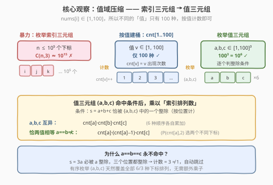
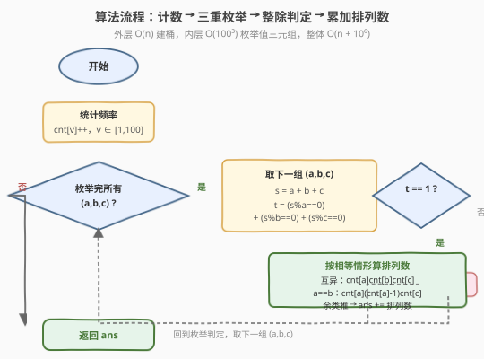

# 单因数三元组

- **题目名称**：单因数三元组
- **链接**：[2198. 单因数三元组 🔒](https://leetcode.cn/problems/number-of-single-divisor-triplets/)
- **难度**：中等
- **标签**：数组、计数、枚举

## 1. 题目概述

给定一个下标从 **0** 开始的正整数数组 `nums`。由三个**不同**下标 `(i, j, k)` 组成的三元组，若 `nums[i] + nums[j] + nums[k]` 能被 `nums[i]`、`nums[j]`、`nums[k]` 中的**恰好一个**整除，则称为 `nums` 的**单因数三元组**。

返回 `nums` 的单因数三元组**个数**。

**示例 1**：

```text
输入：nums = [4,6,7,3,2]
输出：12
解释：
值组 {4,3,2}：4+3+2=9，仅被 3 整除 → 6 种下标排列，均为单因数三元组。
值组 {4,7,3}：4+7+3=14，仅被 7 整除 → 6 种下标排列，均为单因数三元组。
合计 12。
```

**示例 2**：

```text
输入：nums = [1,2,2]
输出：6
解释：值组 {1,2,2}：1+2+2=5，仅被 1 整除。
两个 2 在不同下标 → 3! = 6 种排列，全部命中。
```

**示例 3**：

```text
输入：nums = [1,1,1]
输出：0
解释：(0,1,2)：1+1+1=3，被三个 1 都整除 → 整除计数 = 3 ≠ 1，不命中。
```

**约束条件**：

- $3 \le \text{nums.length} \le 10^5$
- $1 \le \text{nums}[i] \le 100$

> 💡 题眼有两层：① **值域极小**——$\text{nums}[i] \in [1, 100]$，不同的值至多 100 种，可按值建桶压缩；② **整除判定与下标无关**——$s = a+b+c$ 能否被某个值整除只取决于「值」本身，与具体下标无关。因此可把「枚举下标三元组」替换为「枚举值三元组 + 乘以排列数」。

---

## 2. 解题思路

### 2.1 暴力思路：枚举所有下标三元组

直接三重循环枚举下标 $(i, j, k)$，对每组计算 $s = \text{nums}[i]+\text{nums}[j]+\text{nums}[k]$，再统计 $s$ 能被三者中几个整除，恰为 1 则计数。但 $n \le 10^5$ 时 $\binom{n}{3} \approx 1.7 \times 10^{14}$，完全不可行。

> 💡 暴力法没有利用「值域只有 100」这一关键约束。一旦意识到整除性只依赖「值」而非「下标」，就可把搜索空间从下标维度（$10^5$）压缩到值维度（$100$）。

### 2.2 核心观察：值域压缩 + 排列数



**观察一：按值建桶，值维度只有 100**

用 $\text{cnt}[v]$ 统计值 $v$ 在 `nums` 中出现次数（$v \in [1, 100]$）。任一下标三元组对应一个**有序值三元组** $(a, b, c)$（$a = \text{nums}[i], b = \text{nums}[j], c = \text{nums}[k]$）。枚举所有有序值三元组只需 $100^3 = 10^6$ 次。

**观察二：整除判定只依赖值，与下标无关**

对有序值三元组 $(a, b, c)$，令 $s = a + b + c$，定义整除计数：

$$
t = \mathbb{1}[s \bmod a = 0] + \mathbb{1}[s \bmod b = 0] + \mathbb{1}[s \bmod c = 0]
$$

这里按**位置**计——若 $a = b$ 且 $a \mid s$，则两个位置都贡献，$t \ge 2$。当且仅当 $t = 1$ 时该值三元组「命中」单因数条件。

> ⚠️ 注意「按位置计」与「按不同值计」的区别：当两个位置取相同值时，若该值整除 $s$，两位置同时贡献。这正是 $a = b = c$ 永不命中的原因——$s = 3a$ 必被 $a$ 整除，三位置贡献 $t = 3$。

**观察三：命中后乘以「下标排列数」**

值三元组 $(a, b, c)$ 命中后，需计算有多少个**互异下标** $(i, j, k)$ 恰好取到这组值。设 $x = \text{cnt}[a],\, y = \text{cnt}[b],\, z = \text{cnt}[c]$：

| 值的相等关系 | 下标排列数 | 说明 |
|--------------|-----------|------|
| $a, b, c$ 互异 | $x \cdot y \cdot z$ | 三个值不同 → 下标天然互异，各任取一个 |
| $a = b \ne c$ | $x \cdot (x - 1) \cdot z$ | 位置 $i, j$ 同值 $a$，需选两个不同下标 $P(x, 2)$ |
| $a = c \ne b$ | $x \cdot (x - 1) \cdot y$ | 位置 $i, k$ 同值 $a$ |
| $b = c \ne a$ | $x \cdot y \cdot (y - 1)$ | 位置 $j, k$ 同值 $b$ |
| $a = b = c$ | —（永不命中） | $s = 3a$，$t = 3 \ne 1$ |

> 💡 **关键归约**：问题等价于——枚举所有有序值三元组 $(a, b, c) \in [1, 100]^3$，对命中（$t = 1$）者按上表乘以排列数并累加。有序枚举天然覆盖全部 $6$（互异）或 $3$（两等）种下标顺序，无需额外乘子。

### 2.3 算法流程图



1. **建桶**：遍历 `nums`，$\text{cnt}[v]\!{+}{+}$。
2. **三重枚举**：$a, b, c \in [1, 100]$，计算 $s = a + b + c$。
3. **整除判定**：$t = (s \bmod a = 0) + (s \bmod b = 0) + (s \bmod c = 0)$。
4. **累加**：若 $t = 1$，按相等情形选公式，$\text{ans} \mathrel{+}= $ 排列数。
5. **返回** $\text{ans}$。

> 💡 **实现细节**：答案可达 $n^3$ 量级（$n = 10^5$），需用 `long long` / `int64`。Python 整数无溢出，C++/Java 务必开 64 位。枚举只遍历 $\text{cnt}$ 中实际出现的值可进一步剪枝，但 $100^3 = 10^6$ 已足够小，全枚举亦毫秒级。

### 2.4 示例演算

以 $\text{nums} = [4,6,7,3,2]$ 为例（$\text{cnt} = \{2{:}1,\, 3{:}1,\, 4{:}1,\, 6{:}1,\, 7{:}1\}$，所有 $\text{cnt} = 1$）：

![示例演算：nums = [4,6,7,3,2]](../images/2198_example_walkthrough.svg)

**两个命中的值组**：

| 值组 | $s$ | 整除检验 | $t$ | 排列数 | 贡献 |
|------|-----|----------|-----|--------|------|
| $\{4,3,2\}$ | $9$ | $9\bmod 4{=}1,\; 9\bmod 3{=}0,\; 9\bmod 2{=}1$ | $1$ | 互异 → $6 \times 1{\times}1{\times}1$ | $6$ |
| $\{4,7,3\}$ | $14$ | $14\bmod 4{=}2,\; 14\bmod 7{=}0,\; 14\bmod 3{=}2$ | $1$ | 互异 → $6 \times 1{\times}1{\times}1$ | $6$ |

其余值组（如 $\{4,6,7\}$: $s{=}17$ 三项均不整除 $t{=}0$；$\{6,3,2\}$: $s{=}11$ $t{=}0$）均不命中。

$$
\text{ans} = 6 + 6 = 12 \quad \checkmark
$$

再看 **示例 2** $\text{nums} = [1,2,2]$：$\text{cnt} = \{1{:}1,\, 2{:}2\}$。值组 $\{1,2,2\}$：$s = 5$，$5\bmod 1{=}0$、$5\bmod 2{=}1$（两个 2 位置都不整除）→ $t = 1$ 命中。有序枚举命中三种顺序：

| 顺序 $(a,b,c)$ | 相等情形 | 排列数公式 | 数值 |
|----------------|----------|-----------|------|
| $(1,2,2)$ | $b{=}c$ | $\text{cnt}[1]\cdot\text{cnt}[2]\cdot(\text{cnt}[2]{-}1)$ | $1\cdot2\cdot1 = 2$ |
| $(2,1,2)$ | $a{=}c$ | $\text{cnt}[2]\cdot(\text{cnt}[2]{-}1)\cdot\text{cnt}[1]$ | $2\cdot1\cdot1 = 2$ |
| $(2,2,1)$ | $a{=}b$ | $\text{cnt}[2]\cdot(\text{cnt}[2]{-}1)\cdot\text{cnt}[1]$ | $2\cdot1\cdot1 = 2$ |

合计 $2+2+2 = 6$ ✓。三种顺序对应「单一值 $1$ 落在第 $i/j/k$ 位」的三类下标排列，正好覆盖全部 $3! = 6$ 个。

**示例 3** $\text{nums} = [1,1,1]$：唯一值组 $\{1,1,1\}$，$s = 3$，$3\bmod 1{=}0$ 三次 → $t = 3 \ne 1$，跳过。$\text{ans} = 0$ ✓。

---

## 3. 参考代码

### C++

```cpp
class Solution {
public:
    long long singleDivisorTriplet(vector<int>& nums) {
        int cnt[101]{};
        for (int x : nums) ++cnt[x];
        long long ans = 0;
        for (int a = 1; a <= 100; ++a) {
            if (!cnt[a]) continue;
            for (int b = 1; b <= 100; ++b) {
                if (!cnt[b]) continue;
                for (int c = 1; c <= 100; ++c) {
                    if (!cnt[c]) continue;
                    int s = a + b + c;
                    int t = (s % a == 0) + (s % b == 0) + (s % c == 0);
                    if (t != 1) continue;
                    long long x = cnt[a], y = cnt[b], z = cnt[c];
                    if (a == b)      ans += x * (x - 1) * z;
                    else if (a == c) ans += x * (x - 1) * y;
                    else if (b == c) ans += x * y * (y - 1);
                    else             ans += x * y * z;
                }
            }
        }
        return ans;
    }
};
```

### Python

```python
class Solution:
    def singleDivisorTriplet(self, nums: List[int]) -> int:
        from collections import Counter
        cnt = Counter(nums)
        ans = 0
        for a, x in cnt.items():
            for b, y in cnt.items():
                for c, z in cnt.items():
                    s = a + b + c
                    if (s % a == 0) + (s % b == 0) + (s % c == 0) == 1:
                        if a == b:
                            ans += x * (x - 1) * z
                        elif a == c:
                            ans += x * (x - 1) * y
                        elif b == c:
                            ans += x * y * (y - 1)
                        else:
                            ans += x * y * z
        return ans
```

> 💡 **两版差异**：C++ 用定长数组 `cnt[101]` 并以 `if (!cnt[v]) continue` 剪掉空桶；Python 直接遍历 `cnt.items()` 天然只访问出现过的值，更简洁。两者复杂度同阶，$10^6$ 级枚举均毫秒级完成。

---

## 4. 复杂度分析

| 维度 | 复杂度 | 说明 |
|------|--------|------|
| **时间复杂度** | $O(n + M^3)$ | 建桶 $O(n)$；三重枚举 $M^3 = 100^3 = 10^6$，每组 $O(1)$ 判定与累加。$M$ 为值域上界 |
| **空间复杂度** | $O(M)$ | 频率数组 $\text{cnt}[1..100]$，常数空间 |

> 💡 $M = 100$ 时 $M^3 = 10^6$，远小于 $n = 10^5$ 带来的 $\binom{n}{3} \approx 1.7\times10^{14}$ 暴力量。这是典型的「**值域小 → 按值枚举**」甜区：把指数级的下标搜索换成多项式级的值枚举。若值域放大到 $10^9$ 则本思路失效，需另寻数论性质。

---

## 5. 扩展：为何「按位置计」与「有序枚举」天然自洽？

值得深挖的是整除计数 $t$ 的定义与枚举方式的一致性。

**命题**：对有序值三元组 $(a, b, c)$ 定义 $t = \sum_{v \in \{a,b,c\}} \mathbb{1}[v \mid s]$（按位置计），则「单因数」条件 $t = 1$ 在值多重集上是良定义的，且有序枚举累加排列数恰好等于下标三元组总数。

**论证**：

1. **按位置计的合理性**：题目要求「能被 $\text{nums}[i], \text{nums}[j], \text{nums}[k]$ 中的恰好一个整除」——这里的「一个」指**三个位置之一**。若两个位置取同值 $a$ 且 $a \mid s$，则两个位置都「能被整除」，不算「恰好一个」。故 $t$ 必须按位置累计，相同值重复计数。

2. **值多重集上的良定义性**：$s = a+b+c$ 与顺序无关，$v \mid s$ 也只依赖值 $v$。因此对任一排列 $(a', b', c')$，$t$ 值相同——「命中与否」是值多重集 $\{a, b, c\}$ 的固有属性。

3. **有序枚举的完备性**：有序枚举 $(a, b, c)$ 遍历全部 $M^3$ 个有序三元组。对互异值 $\{a, b, c\}$，$6$ 种顺序各自命中且排列数相同，累加得 $6 \cdot \text{cnt}[a]\text{cnt}[b]\text{cnt}[c]$，正好等于「三值互异的下标三元组数」。对两等值 $\{a, a, c\}$，$3$ 种顺序各贡献 $\text{cnt}[a](\text{cnt}[a]{-}1)\text{cnt}[c]$，累加 $3 \cdot \text{cnt}[a](\text{cnt}[a]{-}1)\text{cnt}[c]$，正好等于「单一 $c$ 落在某位、两位取 $a$ 的下标三元组数」。

4. **$a = b = c$ 自动排除**：$s = 3a$，$a \mid 3a$ → 三位置贡献 $t = 3 \ne 1$，命中条件天然过滤。

> 💡 **方法论**：「整除性只依赖值」这一观察把**带下标约束的计数**转化为**无下标的值枚举 + 排列乘子**。这是值域压缩类题目的通用范式：先看值域大小，若足够小则按值建桶，把下标维度折叠进排列数。

---

## 6. 面试要点

1. **为什么能从 $O(n^3)$ 降到 $O(M^3)$？**

   - 整除判定 $v \mid (a+b+c)$ 只依赖「值」$v$ 与和 $s$，与具体下标无关。而值域 $M = 100$ 极小，故按值建桶后枚举值三元组即可，下标信息全部编码进 $\text{cnt}$ 与排列数公式。

2. **「按位置计」与「按不同值计」有何区别？为什么必须按位置计？**

   - 题目说「能被 $\text{nums}[i], \text{nums}[j], \text{nums}[k]$ 中的恰好一个整除」，指的是三个**位置**之一。若 $(a, a, c)$ 且 $a \mid s$，则两个 $a$ 位置都整除，应计 $t = 2$（不命中）。若误按不同值计会得 $t = 1$（误命中）。这正是示例 3 中 $(1,1,1)$ 不命中的根源：$s = 3$ 被三个 $1$ 都整除。

3. **两值相等时排列数为什么是 $\text{cnt}[a] \cdot (\text{cnt}[a]-1) \cdot \text{cnt}[c]$？**

   - 两个位置同取值 $a$，需从 $\text{cnt}[a]$ 个下标中选两个**不同**的下标分别填入，是排列数 $P(\text{cnt}[a], 2) = \text{cnt}[a](\text{cnt}[a]{-}1)$（有序，因为位置 $i, j$ 不同）；第三个位置取 $c$ 有 $\text{cnt}[c]$ 种。三者相乘。

4. **有序枚举会不会重复计数？**

   - 不会。有序枚举的每种顺序 $(a, b, c)$ 对应一类「值落到固定位置」的下标三元组，不同顺序对应不同下标三元组（位置分配不同）。互异值的 $6$ 种顺序恰好覆盖 $3! = 6$ 个下标排列，两等值的 $3$ 种顺序覆盖 $3$ 类。累加即为总数。

5. **为什么答案要用 `long long`？**

   - 最坏情形 $n = 10^5$，全部取同一值则 $t = 3$ 不命中（ans = 0）；但若构造使大量组命中，ans 可达 $\binom{n}{3} \approx 1.7 \times 10^{14}$，远超 `int` 上界 $2.1 \times 10^9$。故 C++/Java 必须用 64 位整数。

6. **如果值域变成 $10^9$ 怎么办？**

   - 本思路失效（$M^3$ 不可枚举）。需挖掘数论结构：例如固定 $a, b$ 后 $c$ 需满足「恰一个整除」，可分类讨论转化为对 $c$ 的约束（$c \mid s$ 或 $c \nmid s$ 等），再用哈希按余数/因数聚合。属于进阶难题，超出本题范围。

> 💡 **一句话总结**：2198 是「**值域压缩 + 排列数**」的招牌题——$M = 100$ 的小值域把 $\binom{n}{3}$ 的下标搜索压缩为 $M^3$ 的值枚举，整除性只依赖值让下标信息全部归入 $\text{cnt}$ 与排列乘子，最终落入「计数 + 三重枚举」的经典框架。

---

## 7. 同类练习题

- [217. 存在重复元素](https://leetcode.cn/problems/contains-duplicate/)（[站内题解](../0201-0300/217_存在重复元素.md)）：值域不大时按值建桶计数的入门题，与本题共享「按值压缩」思想
- [454. 四数相加 II](https://leetcode.cn/problems/4sum-ii/)（[站内题解](../0401-0500/454_四数相加%20II.md)）：分组 + 哈希 Meet-in-the-Middle，把 $O(n^4)$ 压成 $O(n^2)$，与本题同为「维度压缩 + 计数乘积」范式
- [1. 两数之和](https://leetcode.cn/problems/two-sum/)（[站内题解](../0001-0100/1_两数之和.md)）：哈希表一次遍历，把 $O(n^2)$ 配对搜索压成 $O(n)$，与本题「用计数结构压缩搜索空间」同源
- [2475. 数组中不等三元组的数目](https://leetcode.cn/problems/number-of-unequal-triplets-in-the-array/)：同为「值域小 → 按值计数枚举三元组」的计数题，结构高度相似但判定条件不同（要求三值互异），可对照练习
- [2549. 统计桌面上的不同数字](https://leetcode.cn/problems/count-distinct-numbers-on-board/)：小范围模拟计数，共享「值域小则直接按值枚举」的甜区直觉
