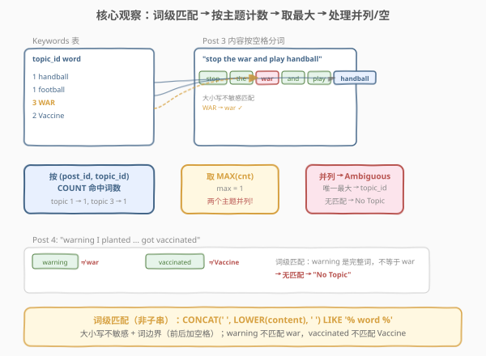
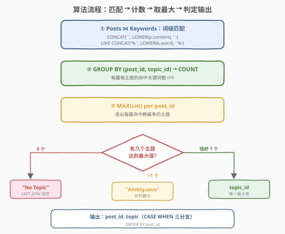
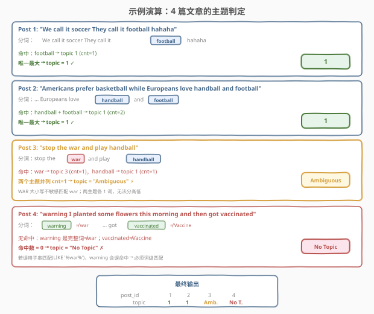

# LeetCode 找到每篇文章的主题 题解

## 1. 题目概述

- **标题 / 题号**：找到每篇文章的主题（#2199，hard）
- **链接**：https://leetcode.cn/problems/finding-the-topic-of-each-post/
- **难度**：困难
- **标签**：SQL、CASE WHEN、GROUP BY、COUNT 聚合、LEFT JOIN、词级匹配、LeetCode 锁题

**题意**：给定 `Keywords`（主题关键词）与 `Posts`（文章内容）两张表，编写 SQL 查询，为**每篇文章**找到其所属**主题**。一篇文章的主题是**命中关键词最多的 `topic_id`**；若多个主题并列最大则返回 `"Ambiguous"`；若无任何关键词命中则返回 `"No Topic"`。关键词匹配**大小写不敏感**且要求**词级匹配**（完整单词，非子串）。

> ⚠️ 本题为 Plus 会员锁题，题面经官方 Schema 与示例数据还原。核心数据结构、匹配规则与输出格式已从 `mysqlSchemas` 与 `sampleTestCase` 确认。

**表结构**：

```text
Table: Keywords
+--------------+------------+
| Column Name  | Type       |
+--------------+------------+
| topic_id     | int        |  ← 主题标识（与 word 联合非唯一）
| word         | varchar(25)|  ← 关键词
+--------------+------------+
每个主题可有多个关键词。

Table: Posts
+--------------+-------------+
| Column Name  | Type        |
+--------------+-------------+
| post_id      | int         |  ← 主键
| content      | varchar(100)|  ← 文章内容（空格分隔的英文句子）
+--------------+-------------+
每行是一篇文章的正文。
```

**输出列**：`post_id`、`topic`（主题 `topic_id` 的字符串形式，或 `"Ambiguous"` / `"No Topic"`）。结果按 `post_id` 升序排列。

**示例 1**：

```text
输入：
Keywords 表:
+----------+----------+
| topic_id | word     |
+----------+----------+
| 1        | handball |
| 1        | football |
| 3        | WAR      |
| 2        | Vaccine  |
+----------+----------+

Posts 表:
+---------+-------------------------------------------------------------+
| post_id | content                                                     |
+---------+-------------------------------------------------------------+
| 1       | We call it soccer They call it football hahaha              |
| 2       | Americans prefer basketball while Europeans love handball…  |
| 3       | stop the war and play handball                              |
| 4       | warning I planted some flowers this morning and then got…   |
+---------+-------------------------------------------------------------+

输出：
+---------+-----------+
| post_id | topic     |
+---------+-----------+
| 1       | 1         |
| 2       | 1         |
| 3       | Ambiguous |
| 4       | No Topic  |
+---------+-----------+
```

**解释**：

| post_id | 命中关键词 | 各主题计数 | 最大主题 | 结果 |
|---------|-----------|-----------|----------|------|
| 1 | football | topic 1 → 1 | 唯一最大 topic 1 | `1` |
| 2 | handball, football | topic 1 → 2 | 唯一最大 topic 1 | `1` |
| 3 | war (匹配 WAR), handball | topic 1 → 1, topic 3 → 1 | 并列 → | `Ambiguous` |
| 4 | （无） | — | 无命中 → | `No Topic` |

> ⚠️ Post 4 的 `warning` **不匹配** `WAR`——词级匹配要求完整单词，`warning ≠ war`。同理 `vaccinated ≠ Vaccine`。若误用子串匹配 `LIKE '%war%'`，`warning` 会被误命中为 topic 3，得到错误结果。

**约束**：

- `post_id` 是 `Posts` 表的主键
- `Keywords` 表中 `(topic_id, word)` 组合无重复
- `content` 由空格分隔的英文单词组成
- 结果按 `post_id` 升序排列

> 💡 本题是 SQL **"词级匹配 + 聚合取最大 + 三分支判定"招牌题**——核心四步：① `Posts ⋈ Keywords` 做大小写不敏感的词级匹配；② `GROUP BY (post_id, topic_id)` + `COUNT` 统计每主题命中数；③ 取 `MAX(cnt)` 并统计达到最大值的主题个数；④ `CASE WHEN` 三分支输出：唯一最大 → `topic_id`、并列 → `Ambiguous`、无命中 → `No Topic`。难点在于**词级匹配的 SQL 表达**与**并列/空命中两类边界**的处理。

## 2. 解题思路

### 2.1 暴力思路：逐文章逐关键词扫描

最直觉的过程式思路：对每篇文章，将其 `content` 按空格切分为单词集合，遍历 `Keywords` 表的每个关键词，检查是否出现在单词集合中（大小写不敏感）。匹配者按 `topic_id` 分组计数，取最大值。若最大值唯一则输出该 `topic_id`，并列则输出 `"Ambiguous"`，全部不中则输出 `"No Topic"`。

但**纯 SQL 没有显式字符串切分循环**——"把 content 拆成单词集"需用模式匹配表达。且子串匹配 `LIKE '%word%'` 会把 `warning` 误匹配为 `war`，必须施加**词边界**约束。

### 2.2 核心观察：空格填充 + LIKE 实现词级匹配



**观察一：词级匹配 = 前后加空格后做子串匹配**

SQL 的 `LIKE '%word%'` 是子串匹配，会把 `warning` 误匹配 `war`。关键技巧：对 `content` **首尾各拼一个空格**，然后匹配 `'% word %'`（关键词前后也加空格）。这样 `war` 只匹配独立的 `" war "`，而 `" warning "` 不含 `" war "` → 不匹配。

```sql
CONCAT(' ', LOWER(p.content), ' ') LIKE CONCAT('% ', LOWER(k.word), ' %')
```

- `LOWER()` 保证大小写不敏感（`WAR` 匹配 `war`）
- 首尾加空格保证句子首尾的词也能被匹配（`" football hahaha"` → `" football hahaha "` 包含 `" football "`）

> 💡 **为什么不用 `REGEXP`？** MySQL 8.0 的 ICU 正则引擎支持 `\b` 词边界：`LOWER(content) REGEXP CONCAT('\\\\b', LOWER(word), '\\\\b')`。但 LeetCode 的 MySQL 环境中字符串转义层次复杂，`\b` 在 SQL 字符串中是退格符。空格填充法**不依赖正则引擎**，跨 MySQL/PostgreSQL 通用，更直观可靠。

**观察二：按 (post_id, topic_id) 聚合计数**

匹配命中的 `(post_id, topic_id, word)` 三元组按 `(post_id, topic_id)` 分组 `COUNT(*)`，得到每篇文章每个主题的命中词数 `cnt`。

**观察三：取最大 + 统计并列数**

对每篇文章取 `MAX(cnt)`，再统计有多少个主题达到了这个最大值。若恰好 1 个 → 输出该 `topic_id`；若 >1 个 → `"Ambiguous"`。

**观察四：LEFT JOIN 保留无命中的文章**

文章若没有任何关键词命中，不会出现在匹配表中。必须用 `LEFT JOIN Posts` 把这些文章捞回来，输出 `"No Topic"`。

### 2.3 算法流程图



1. **词级匹配**：`Posts p JOIN Keywords k ON CONCAT(' ', LOWER(p.content), ' ') LIKE CONCAT('% ', LOWER(k.word), ' %')`，产生命中三元组 `(post_id, topic_id)`。
2. **聚合计数**：`GROUP BY post_id, topic_id` + `COUNT(*) AS cnt`，得到每篇每主题命中数。
3. **取最大**：`MAX(cnt) OVER (PARTITION BY post_id)` 或子查询，找到每篇的最大命中数。
4. **统计并列**：计算达到最大值的主题个数 `num_top`。
5. **三分支输出**：`CASE WHEN num_top IS NULL → 'No Topic'` / `num_top > 1 → 'Ambiguous'` / `ELSE → CAST(topic_id AS CHAR)`。
6. **LEFT JOIN**：确保无命中的文章也在结果中。

### 2.4 示例演算

以示例数据 `Keywords = {(1,handball), (1,football), (3,WAR), (2,Vaccine)}` 为例：



**Post 1** `"We call it soccer They call it football hahaha"`：
- 词集：{we, call, it, soccer, they, football, hahaha}
- 匹配：`football` → topic 1
- 计数：topic 1 → cnt=1
- 最大值=1，仅 1 个主题达到 → **输出 `1`** ✓

**Post 2** `"Americans prefer basketball while Europeans love handball and football"`：
- 词集：{americans, prefer, basketball, while, europeans, love, handball, and, football}
- 匹配：`handball` → topic 1，`football` → topic 1
- 计数：topic 1 → cnt=2
- 最大值=2，仅 1 个主题达到 → **输出 `1`** ✓

**Post 3** `"stop the war and play handball"`：
- 词集：{stop, the, war, and, play, handball}
- 匹配：`WAR` → (LOWER → `war`，在词集中) → topic 3；`handball` → topic 1
- 计数：topic 1 → cnt=1，topic 3 → cnt=1
- 最大值=1，**2 个主题并列** → **输出 `Ambiguous`** ✓

**Post 4** `"warning I planted some flowers this morning and then got vaccinated"`：
- 词集：{warning, i, planted, some, flowers, this, morning, and, then, got, vaccinated}
- 匹配：`WAR` → `war` ∉ 词集（`warning ≠ war`）；`Vaccine` → `vaccine` ∉ 词集（`vaccinated ≠ vaccine`）；`handball`/`football` ∉ 词集
- 计数：空
- 无命中 → **输出 `No Topic`** ✓

> 💡 **Post 4 是题眼**：`warning` 包含子串 `war` 但不是独立单词。若误用 `LIKE '%war%'`（不加空格），会误命中 topic 3，得到错误输出 `3` 而非 `No Topic`。这正是本题"困难"的核心考点——**词级匹配 vs 子串匹配**。

## 3. 参考代码

### SQL（解法 A：CTE 四步法 + LEFT JOIN，推荐）

```sql
WITH matches AS (
    -- ① 词级匹配：Posts ⋈ Keywords
    SELECT p.post_id, k.topic_id
    FROM Posts p
    JOIN Keywords k
      ON CONCAT(' ', LOWER(p.content), ' ') LIKE CONCAT('% ', LOWER(k.word), ' %')
),
topic_counts AS (
    -- ② 按主题聚合计数
    SELECT post_id, topic_id, COUNT(*) AS cnt
    FROM matches
    GROUP BY post_id, topic_id
),
max_per_post AS (
    -- ③ 每篇的最大命中数
    SELECT post_id, MAX(cnt) AS max_cnt
    FROM topic_counts
    GROUP BY post_id
),
top_topics AS (
    -- ④ 达到最大值的主题
    SELECT tc.post_id, tc.topic_id
    FROM topic_counts tc
    JOIN max_per_post mp
      ON tc.post_id = mp.post_id AND tc.cnt = mp.max_cnt
)
SELECT
    p.post_id,
    CASE
        WHEN tt.topic_id IS NULL THEN 'No Topic'
        WHEN COUNT(*) > 1 THEN 'Ambiguous'
        ELSE CAST(MIN(tt.topic_id) AS CHAR)
    END AS topic
FROM Posts p
LEFT JOIN top_topics tt ON p.post_id = tt.post_id
GROUP BY p.post_id
ORDER BY p.post_id;
```

> 💡 **写法要点**：
> - **`CONCAT(' ', LOWER(p.content), ' ')`**：首尾补空格 + 大写转小写，保证词边界 + 大小写不敏感。
> - **`LIKE CONCAT('% ', LOWER(k.word), ' %')`**：关键词前后各加空格，只匹配独立单词。
> - **四层 CTE**：`matches → topic_counts → max_per_post → top_topics`，每层职责单一，层次清晰。
> - **`LEFT JOIN top_topics`**：`top_topics` 只含命中的文章，`LEFT JOIN` 确保无命中的 Post 4 也在结果中（`tt.topic_id IS NULL → 'No Topic'`）。
> - **`COUNT(*) > 1`**：`top_topics` 中同一 `post_id` 有多行说明多个主题并列最大 → `"Ambiguous"`。
> - **`MIN(tt.topic_id)`**：并列时取最小 `topic_id` 作 `GROUP BY` 聚合值（实际输出 `"Ambiguous"`，此值不进入最终结果，但满足 `ONLY_FULL_GROUP_BY` 语法要求）。

### SQL（解法 B：窗口函数 RANK + CTE，更紧凑）

```sql
WITH matches AS (
    SELECT p.post_id, k.topic_id
    FROM Posts p
    JOIN Keywords k
      ON CONCAT(' ', LOWER(p.content), ' ') LIKE CONCAT('% ', LOWER(k.word), ' %')
    GROUP BY p.post_id, k.topic_id
),
ranked AS (
    SELECT
        post_id,
        topic_id,
        COUNT(*) AS cnt,
        RANK() OVER (PARTITION BY post_id ORDER BY COUNT(*) DESC) AS rnk
    FROM matches
    GROUP BY post_id, topic_id
),
winners AS (
    SELECT post_id, topic_id,
           COUNT(*) OVER (PARTITION BY post_id) AS num_winners
    FROM ranked
    WHERE rnk = 1
)
SELECT
    p.post_id,
    CASE
        WHEN w.topic_id IS NULL THEN 'No Topic'
        WHEN w.num_winners > 1 THEN 'Ambiguous'
        ELSE CAST(w.topic_id AS CHAR)
    END AS topic
FROM Posts p
LEFT JOIN winners w ON p.post_id = w.post_id
GROUP BY p.post_id, w.topic_id, w.num_winners
ORDER BY p.post_id;
```

> 💡 **解法 B 与 A 的区别**：用 `RANK() OVER (PARTITION BY post_id ORDER BY cnt DESC)` 直接给每篇的主题按命中数排名，`WHERE rnk = 1` 取最大者。`COUNT(*) OVER (PARTITION BY post_id)` 在最大者中统计并列数。窗口函数避免了 `max_per_post` 子查询层，但 `GROUP BY` 需带上 `w.topic_id` / `w.num_winners`（因窗口函数结果在 `GROUP BY` 后需作为分组键）。

### SQL（解法 C：REGEXP 词边界，PostgreSQL 风格）

```sql
WITH matches AS (
    SELECT p.post_id, k.topic_id
    FROM Posts p
    JOIN Keywords k
      ON LOWER(p.content) ~* ('\\m' || LOWER(k.word) || '\\M')
    GROUP BY p.post_id, k.topic_id
),
-- ... 后续与解法 A 相同
top_topics AS (
    SELECT post_id, topic_id, COUNT(*) AS cnt
    FROM matches
    GROUP BY post_id, topic_id
)
SELECT
    p.post_id,
    CASE
        WHEN MAX(tc.cnt) IS NULL THEN 'No Topic'
        WHEN COUNT(CASE WHEN tc.cnt = MAX(tc.cnt) OVER (PARTITION BY p.post_id) THEN 1 END) > 1 THEN 'Ambiguous'
        ELSE CAST(MIN(tc.topic_id) AS CHAR)
    END AS topic
FROM Posts p
LEFT JOIN top_topics tc ON p.post_id = tc.post_id
GROUP BY p.post_id
ORDER BY p.post_id;
```

> ⚠️ **解法 C 的局限**：
> - `~*` 是 PostgreSQL 的大小写不敏感正则匹配；`\m` / `\M` 是词左/右边界。
> - MySQL 8.0 的 ICU 正则用 `\\b`（但 SQL 字符串中需写 `\\\\b`），写法繁琐易错。
> - LeetCode 默认 MySQL 环境，**推荐解法 A/B**（空格填充法）。解法 C 仅作 PostgreSQL 语法对照。

### Python（pandas）

```python
import pandas as pd
import re

def finding_topic_of_each_post(keywords: pd.DataFrame, posts: pd.DataFrame) -> pd.DataFrame:
    matches = []
    for _, p in posts.iterrows():
        words = set(re.findall(r'\b\w+\b', p['content'].lower()))
        for _, k in keywords.iterrows():
            if k['word'].lower() in words:
                matches.append({'post_id': p['post_id'], 'topic_id': k['topic_id']})

    if not matches:
        result = posts[['post_id']].copy()
        result['topic'] = 'No Topic'
        return result.sort_values('post_id').reset_index(drop=True)

    match_df = pd.DataFrame(matches)
    counts = match_df.groupby(['post_id', 'topic_id']).size().reset_index(name='cnt')
    max_per = counts.groupby('post_id')['cnt'].max().reset_index(name='max_cnt')
    top = counts.merge(max_per, on='post_id')
    top = top[top['cnt'] == top['max_cnt']]
    top_count = top.groupby('post_id').agg(
        num_top=('topic_id', 'count'),
        best_topic=('topic_id', 'min')
    ).reset_index()

    result = posts[['post_id']].merge(top_count, on='post_id', how='left')
    result['topic'] = result.apply(
        lambda r: 'No Topic' if pd.isna(r['num_top'])
                  else 'Ambiguous' if r['num_top'] > 1
                  else str(int(r['best_topic'])), axis=1
    )
    return result[['post_id', 'topic']].sort_values('post_id').reset_index(drop=True)
```

> 💡 **pandas 对照**：
> - `re.findall(r'\b\w+\b', content.lower())` → 对应 SQL 的 `CONCAT(' ', LOWER(content), ' ') LIKE '% word %'`（词级 + 大小写不敏感）。
> - `.groupby(['post_id', 'topic_id']).size()` → 对应 `GROUP BY post_id, topic_id` + `COUNT(*)`。
> - `.merge(max_per).query('cnt == max_cnt')` → 对应 `JOIN max_per_post` 取最大值。
> - `.merge(top_count, how='left')` → 对应 `LEFT JOIN` 保留无命中的文章。
> - `apply(lambda ...)` → 对应 `CASE WHEN` 三分支。

## 4. 复杂度分析

| 维度 | 复杂度 | 说明 |
|------|--------|------|
| **时间复杂度** | $O(P \cdot K \cdot L)$ | $P$ 篇文章 × $K$ 个关键词 × 每次匹配 $O(L)$（$L$ 为 `content` 长度）。`LIKE` 在 `content` 上做线性扫描 |
| **空间复杂度** | $O(P \cdot K)$ | `matches` CTE 最坏存放 $P \times K$ 行命中记录（每篇每关键词都命中） |

> 💡 本题数据量小（`content` 仅 `varchar(100)`，关键词数量有限），$P \cdot K \cdot L$ 完全可控。若数据量放大（百万级文章 + 万级关键词），应在应用层用倒排索引或全文检索引擎（如 Elasticsearch）替代 SQL `LIKE`。

## 5. 扩展：词级匹配的多种 SQL 写法对比

"在 SQL 中判断一个词是否作为完整单词出现在文本中"是一个经典痛点。下表对比常见写法：

| 写法 | 语法 | 词边界 | 大小写 | 兼容性 | 推荐 |
|------|------|--------|--------|--------|------|
| **空格填充 + LIKE** | `CONCAT(' ', LOWER(t), ' ') LIKE '% w %'` | ✓（前后空格） | `LOWER()` | 全部 | ★★★★★ |
| **MySQL ICU 正则** | `LOWER(t) REGEXP '\\\\bword\\\\b'` | ✓（`\b`） | `LOWER()` | MySQL 8.0+ | ★★★ |
| **PostgreSQL 正则** | `t ~* '\\mword\\M'` | ✓（`\m`/`\M`） | `~*` 原生 | PostgreSQL | ★★★ |
| **子串 LIKE（错误）** | `LOWER(t) LIKE '%word%'` | ✗ | `LOWER()` | 全部 | ✗ 误匹配 |

```sql
-- 对比：子串匹配 vs 词级匹配
-- 子串（错误）：warning 匹配 war
SELECT 'warning I got vaccinated' LIKE '%war%';  -- → 1 (true，误匹配)

-- 词级（正确）：warning 不匹配 war
SELECT CONCAT(' ', 'warning I got vaccinated', ' ') LIKE '% war %';  -- → 0 (false，正确不匹配)
```

> 💡 **方法论**：SQL 的 `LIKE` 是子串匹配，没有原生的词边界概念。**空格填充法**是最通用的 workaround：把文本和关键词都用空格"包起来"，再做 `LIKE`，等效于词级匹配。这是 SQL 文本处理中"四两拨千斤"的经典技巧。

## 6. 面试要点

1. **为什么用空格填充而不是直接 `LIKE '%word%'`？**

   > 直接 `LIKE '%word%'` 是子串匹配，`warning` 会误匹配 `war`。空格填充法 `CONCAT(' ', content, ' ') LIKE '% word %'` 在文本和关键词两侧都加空格，保证只匹配独立单词（前后是空格的词），等效于词级匹配。Post 4 的 `warning ≠ war` 是核心测试点。

2. **大小写不敏感如何实现？**

   > 对 `content` 和 `word` 都套 `LOWER()`，统一转小写后比较。MySQL 的 `LIKE` 默认大小写不敏感（取决于 collation），但显式 `LOWER()` 更可靠、跨数据库通用。PostgreSQL 可用 `~*` 运算符或 `ILIKE`。

3. **如何处理"无命中"的文章？**

   > 用 `LEFT JOIN Posts p ON p.post_id = tt.post_id`。匹配表 `top_topics` 只含命中的文章，无命中的文章在 `LEFT JOIN` 后 `tt.topic_id IS NULL`，`CASE WHEN` 输出 `'No Topic'`。若用 `INNER JOIN` 会丢失 Post 4。

4. **如何检测"并列"（多个主题命中数相同）？**

   > 在 `top_topics`（达到最大 `cnt` 的主题集合）中，对每个 `post_id` 做 `COUNT(*)`。若 `> 1` 说明多个主题并列最大 → `'Ambiguous'`。这要求先 `GROUP BY post_id` 再用 `COUNT(*)` 判断。

5. **`RANK()` 和 `ROW_NUMBER()` 在本题中有何区别？**

   > `RANK()` 给相同值相同的排名（并列时两个第 1 名），`WHERE rnk = 1` 保留所有并列者，可用于检测并列。`ROW_NUMBER()` 强制不并列（随机选一个第 1 名），无法检测并列。本题需要知道是否有并列，**必须用 `RANK()`**。

> 💡 **一句话总结**：2199 是 SQL **"词级匹配 + 聚合取最大 + 三分支判定"招牌题**——核心模板「`CONCAT(' ', LOWER(content), ' ') LIKE '% word %'` → `GROUP BY (post_id, topic_id)` + `COUNT` → `MAX(cnt)` → `CASE WHEN NULL/Ambiguous/topic_id`」。三大考点：① 空格填充实现词级匹配（禁子串 `LIKE`）；② `LEFT JOIN` 保留无命中文章；③ `COUNT(*) > 1` 检测并列输出 `Ambiguous`。

## 同类练习题

| # | 题目 | 与本题的关联 |
|---|------|-------------|
| 1174 | [即时食物配送 II](https://leetcode.cn/problems/immediate-food-delivery-ii/) | SQL 窗口函数 `RANK()` + 取每组首个，与本题 `RANK` 取最大主题同套路 |
| 184 | [部门工资最高的员工](https://leetcode.cn/problems/department-highest-salary/) | SQL `JOIN` + 子查询取每组最大，与本题取每篇最大主题结构相似 |
| 185 | [部门工资前三高的所有员工](https://leetcode.cn/problems/department-top-three-salaries/) | SQL 窗口函数 `DENSE_RANK()` + Top-N per group，是本题"取最大"的泛化版（取前 N） |
| 1484 | [按日期分组销售产品](https://leetcode.cn/problems/group-sold-products-by-the-date/) | SQL `GROUP BY` + `GROUP_CONCAT` 合并同组产品，与本题按 `post_id` 聚合同源，是本题的相似题推荐 |
| 1527 | [患者没用药](https://leetcode.cn/problems/patients-with-a-condition/) | SQL `LIKE` / `REGEXP` 过滤诊断条件，与本题词级匹配共享"文本模式匹配"考点 |
