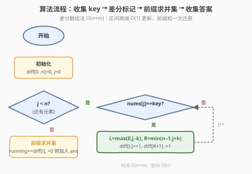

# 找出数组中的所有 K 近邻下标

- **题目名称**：找出数组中的所有 K 近邻下标
- **链接**：[2200. 找出数组中的所有 K 近邻下标](https://leetcode.cn/problems/find-all-k-distant-indices-in-an-array/)
- **难度**：简单
- **标签**：数组、枚举、差分数组

## 1. 题目概述

给你一个下标从 **0** 开始长度为 `n` 的整数数组 `nums` 和两个整数 `key` 与 `k`。

称一个下标 `i` 为 **K 近邻下标**（k-distant index），当且仅当存在至少一个下标 `j` 满足：

- $|i - j| \le k$
- $\text{nums}[j] == \text{key}$

请你以**递增顺序**返回所有 K 近邻下标的列表。

**示例 1**：

```text
输入：nums = [3,4,9,1,3,9,5], key = 9, k = 1
输出：[1,2,3,4,5,6]
解释：
nums 中值为 9 的下标为 2 和 5。
- 下标 0：附近 [0±1] 内无 9 → ✗
- 下标 1：|1-2|=1 ≤ 1，nums[2]=9 → ✓
- 下标 2：|2-2|=0 ≤ 1，nums[2]=9 → ✓
- 下标 3：|3-2|=1 ≤ 1，nums[2]=9 → ✓
- 下标 4：|4-5|=1 ≤ 1，nums[5]=9 → ✓
- 下标 5：|5-5|=0 ≤ 1，nums[5]=9 → ✓
- 下标 6：|6-5|=1 ≤ 1，nums[5]=9 → ✓
```

**示例 2**：

```text
输入：nums = [2,2,2,2,2], key = 2, k = 2
输出：[0,1,2,3,4]
解释：每个位置都是 2，任意下标 i 的 2 近邻内都存在值为 key=2 的下标，故全部计入。
```

**约束条件**：

- $1 \le \text{nums.length} \le 1000$
- $1 \le \text{nums[i]} \le 1000$
- `key` 保证在 `nums` 中至少出现一次
- $1 \le k \le \text{nums.length}$

> 💡 本题的核心是**区间标记**：每个值为 `key` 的下标 $j$ 会"照亮"它周围 $[j-k,\; j+k]$ 范围内的所有下标。问题转化为求所有这些区间的**并集**。暴力逐对检查 $O(n^2)$ 可过，但先收集 `key` 位置再做区间标记可以把复杂度压到 $O(n)$——差分数组是处理"多次区间标记求并集"的通用利器。

---

## 2. 解题思路

### 2.1 暴力思路：逐下标扫描近邻

最直白的做法是对每个下标 `i`，在 $[i-k,\; i+k]$ 范围内逐一检查是否存在 `nums[j] == key`：

```text
ans = []
for i in range(n):
    for j in range(max(0, i - k), min(n, i + k + 1)):
        if nums[j] == key:
            ans.append(i)
            break
return ans
```

外层 $n$ 个下标，内层至多 $2k+1$ 个候选。约束 $n \le 1000$、$k \le n$ 时最坏 $O(n \cdot k) \le O(n^2) = 10^6$，完全在时限内。

> ⚠️ 暴力能过，但做了重复功：多个下标 `i` 会反复扫描同一片区域查找 `key`。尤其当 `key` 出现密集时，同一段区间被反复确认"有 key"，而答案其实只需标记一次。

### 2.2 核心观察：先定位 key，再标记区间

![核心：每个 key 下标照亮 [j-k, j+k] 区间，求并集](../images/2200_concept.svg)

**观察：反转视角——不是"对每个 i 找 key"，而是"对每个 key 的 j 照亮 i"。**

题目问的是"哪些 `i` 附近有 `key`"，等价于"哪些 `i` 落在某个 `key` 下标 $j$ 的 $k$ 邻域 $[j-k,\; j+k]$ 内"。于是分两步：

1. **收集 key 的位置**：扫描一遍 `nums`，记录所有 $\text{nums}[j] == \text{key}$ 的下标 $j$，得到位置列表 `keys`。
2. **标记区间**：对 `keys` 中的每个 $j$，把 $[\max(0,\, j-k),\; \min(n-1,\, j+k)]$ 内的所有下标标记为"K 近邻"。

最终所有被标记的下标即为答案。由于 `keys` 按递增顺序收集，标记区间也按起点递增，但**区间可能重叠**——需要一种机制处理重叠去重。

> 💡 **为什么反转视角更优**：暴力法以 `i` 为中心向外找 `key`，每个 `i` 独立搜索，信息不共享。反转后以 `key` 为中心向外标记，每个 `key` 一次标记整段区间，且 `key` 的位置信息被显式提取复用。当 `key` 出现次数 $m \ll n$ 时，标记总工作量远小于逐 `i` 扫描。

**边界与特例**：

- **区间越界裁剪**：$j-k < 0$ 时下界取 $0$；$j+k \ge n$ 时上界取 $n-1$。不会访问非法下标。
- **`k >= n`**：任何 `key` 下标的邻域覆盖整个数组 → 答案为 $[0,\, n-1]$。
- **`key` 只出现一次**：只有一个区间，答案就是 $[j-k,\; j+k]$ 裁剪后的范围。
- **相邻 `key` 区间重叠**：如 `key` 在下标 2 和 5，`k=1`，则 $[1,3]$ 与 $[4,6]$ 不重叠；若 `k=2`，则 $[0,4]$ 与 $[3,6]$ 重叠于 $[3,4]$——需去重。

### 2.3 算法流程图



**差分数组法**（$O(n + m)$，推荐）：

1. **建差分数组** `diff[0..n]`，初始全 $0$。
2. **收集并标记**：遍历 `nums`，每当 $\text{nums}[j] == \text{key}$：
   - $L = \max(0,\; j-k)$，$R = \min(n-1,\; j+k)$
   - `diff[L] += 1`，`diff[R+1] -= 1`（差分区间加）
3. **前缀求并集**：`running = 0`，从 $i=0$ 到 $n-1$：`running += diff[i]`，若 `running > 0` 则 `i` 属于至少一个区间 → 加入答案。
4. **返回**答案列表（天然递增）。

> 💡 **差分数组的本质**：`diff[L] += 1` 表示"从 $L$ 起多了一个活跃区间"，`diff[R+1] -= 1` 表示"从 $R+1$ 起少了一个活跃区间"。前缀和 `running` 就是当前位置被多少个区间覆盖——$>0$ 即在并集中。多个区间重叠时 `running` 累加，无需额外去重，天然正确。

### 2.4 示例演算

![示例演算：nums = [3,4,9,1,3,9,5], key=9, k=1](../images/2200_example_walkthrough.svg)

**示例 1：`nums = [3,4,9,1,3,9,5], key = 9, k = 1`**

**第一步：收集 key 位置**

| 下标 j | 0 | 1 | 2 | 3 | 4 | 5 | 6 |
|--------|---|---|---|---|---|---|---|
| nums[j] | 3 | 4 | **9** | 1 | 3 | **9** | 5 |

`key` 位置：`keys = [2, 5]`

**第二步：差分标记区间**

| key 位置 j | 区间 [j-k, j+k] | 裁剪后 [L, R] | diff 操作 |
|------------|-----------------|---------------|-----------|
| 2 | [1, 3] | [1, 3] | diff[1]+=1, diff[4]-=1 |
| 5 | [4, 6] | [4, 6] | diff[4]+=1, diff[7]-=1（越界忽略） |

差分数组（长度 $n+1=8$）：

| 下标 | 0 | 1 | 2 | 3 | 4 | 5 | 6 | 7 |
|------|---|---|---|---|---|---|---|---|
| diff | 0 | +1 | 0 | 0 | -1+1=0 | 0 | 0 | -1 |

**第三步：前缀求并集**

| 下标 i | running | > 0? | 计入? |
|--------|---------|------|-------|
| 0 | 0 | ✗ | ✗ 否 |
| 1 | 0+1=1 | ✓ | ✓ 是 |
| 2 | 1+0=1 | ✓ | ✓ 是 |
| 3 | 1+0=1 | ✓ | ✓ 是 |
| 4 | 1+0=1 | ✓ | ✓ 是 |
| 5 | 1+0=1 | ✓ | ✓ 是 |
| 6 | 1+0=1 | ✓ | ✓ 是 |

> 💡 注意下标 4：`diff[4]` 有 `-1`（来自 $j=2$ 的区间结束）和 `+1`（来自 $j=5$ 的区间开始），净变化为 $0$，所以 `running` 保持 $1$ 不变——这正是两个区间"无缝衔接"的体现：$[1,3]$ 与 $[4,6]$ 虽不重叠但相邻，下标 4 被第二个区间覆盖。

答案：`[1, 2, 3, 4, 5, 6]` ✓

**示例 2：`nums = [2,2,2,2,2], key = 2, k = 2`**

`key` 位置：`[0, 1, 2, 3, 4]`，每个都标记 $[j-2, j+2]$ 裁剪后覆盖 $[0, 4]$。前缀和处处 $> 0$，答案 `[0,1,2,3,4]` ✓

> ⚠️ 此例中 5 个区间高度重叠，差分数组让 `running` 在各处累加到不同正值，但只要 $>0$ 就计入——无需关心具体覆盖次数，只关心"是否被覆盖"。

---

## 3. 参考代码

### C++（差分数组，推荐）

```cpp
class Solution {
  public:
    vector<int> findKDistantIndices(vector<int>& nums, int key, int k) {
        int n = nums.size();
        vector<int> diff(n + 1, 0);
        for (int j = 0; j < n; ++j) {
            if (nums[j] == key) {
                int L = max(0, j - k);
                int R = min(n - 1, j + k);
                diff[L] += 1;
                diff[R + 1] -= 1;
            }
        }
        vector<int> ans;
        int running = 0;
        for (int i = 0; i < n; ++i) {
            running += diff[i];
            if (running > 0) {
                ans.push_back(i);
            }
        }
        return ans;
    }
};
```

> 💡 `diff` 大小为 $n+1$，使得 `diff[R+1]` 在 $R = n-1$ 时访问 `diff[n]` 不越界。收集与标记合并在一次遍历中完成，无需先存 `keys` 列表。

### C++（布尔数组标记版，对照参考）

```cpp
class Solution {
  public:
    vector<int> findKDistantIndices(vector<int>& nums, int key, int k) {
        int n = nums.size();
        vector<bool> mark(n, false);
        for (int j = 0; j < n; ++j) {
            if (nums[j] == key) {
                int L = max(0, j - k);
                int R = min(n - 1, j + k);
                for (int i = L; i <= R; ++i) {
                    mark[i] = true;
                }
            }
        }
        vector<int> ans;
        for (int i = 0; i < n; ++i) {
            if (mark[i]) {
                ans.push_back(i);
            }
        }
        return ans;
    }
};
```

> ⚠️ 布尔数组直观但内层循环最坏 $O(k)$ 每次，总最坏 $O(m \cdot k)$。当 $m$ 与 $k$ 都接近 $n$ 时退化为 $O(n^2)$。差分数组版把内层标记改为 $O(1)$ 的两端更新，总严格 $O(n + m)$。

### Python（差分数组，推荐）

```python
class Solution:
    def findKDistantIndices(self, nums: List[int], key: int, k: int) -> List[int]:
        n = len(nums)
        diff = [0] * (n + 1)
        for j, v in enumerate(nums):
            if v == key:
                L = max(0, j - k)
                R = min(n - 1, j + k)
                diff[L] += 1
                diff[R + 1] -= 1
        ans = []
        running = 0
        for i in range(n):
            running += diff[i]
            if running > 0:
                ans.append(i)
        return ans
```

### Python（暴力双循环版，约束下可过）

```python
class Solution:
    def findKDistantIndices(self, nums: List[int], key: int, k: int) -> List[int]:
        n = len(nums)
        ans = []
        for i in range(n):
            for j in range(max(0, i - k), min(n, i + k + 1)):
                if nums[j] == key:
                    ans.append(i)
                    break
        return ans
```

> ⚠️ 暴力版以内层 `break` 优化——找到第一个 `key` 即确认 `i` 合格，不必扫完整个邻域。最坏 $O(n \cdot k)$，$n \le 1000$ 下可 AC，但缺少对"区间标记"思想的利用。

---

## 4. 复杂度分析

| 维度 | 复杂度 | 说明 |
|------|--------|------|
| 时间复杂度（差分版） | $O(n + m)$ | 一次遍历收集 key 并做 $O(1)$ 区间标记（$m$ 为 key 出现次数）；一次前缀和扫描 $O(n)$ |
| 时间复杂度（布尔版） | $O(n + m \cdot k)$，最坏 $O(n^2)$ | 每个 key 位置内层标记 $O(k)$；$m$ 与 $k$ 都接近 $n$ 时退化为 $O(n^2)$ |
| 时间复杂度（暴力版） | $O(n \cdot k)$，最坏 $O(n^2)$ | 每个 $i$ 扫描 $2k+1$ 个候选；`break` 优化平均常数 |
| 空间复杂度（差分版） | $O(n)$ | 差分数组 `diff` 大小 $n+1$ |
| 空间复杂度（布尔版） | $O(n)$ | 布尔标记数组大小 $n$ |
| 空间复杂度（暴力版） | $O(1)$ | 仅答案列表（不计输出） |

> 💡 三种实现中差分数组版最优：时间严格 $O(n + m)$（与 $k$ 无关），空间 $O(n)$。当 $n$ 放大到 $10^6$ 级、$k$ 也很大时，暴力与布尔版会超时，差分版仍是线性。差分数组是"多次区间加减 → 求最终状态"问题的通用模板。

---

## 5. 扩展：区间并集的其他求法

除了差分数组，处理"多个区间求并集"还有两种常见手法：

**方法一：排序 + 区间合并。** 将每个 `key` 位置生成的区间 $[L, R]$ 按 $L$ 排序（`keys` 天然有序故无需再排），然后像 56「合并区间」一样扫描合并：当前区间与上一个重叠或相邻则延长，否则断开新起。时间 $O(m \log m)$（已有序则 $O(m)$），空间 $O(m)$。

**方法二：布尔数组直接标记。** 即 §3 的布尔版，对每个区间逐位标记 `true`。简单直观但最坏 $O(n^2)$。

| 方法 | 时间 | 空间 | 适用场景 |
|------|------|------|----------|
| 差分数组 | $O(n + m)$ | $O(n)$ | 区间多、值域固定为下标连续区间 |
| 排序合并 | $O(m \log m)$ | $O(m)$ | 区间端点任意、无需覆盖所有下标 |
| 布尔标记 | $O(n + m \cdot k)$ | $O(n)$ | 区间少、$k$ 小、追求代码简单 |

> ⚠️ 差分数组要求"值域是 $[0, n-1]$ 的连续整数"（本题恰好满足——下标本身就是）。若区间端点是任意大整数（如坐标轴上的线段），差分数组需离散化或改用排序合并。

---

## 6. 面试要点

1. **为什么反转"以 i 找 key"为"以 key 标记 i"？**

   - 暴力以每个 `i` 为中心向外搜索 `key`，信息不共享，多个 `i` 反复扫描同一区域。反转后先提取所有 `key` 位置，每个 `key` 一次性标记整段邻域区间，避免重复搜索。当 `key` 出现次数 $m \ll n$ 时，标记总工作量远小于逐 `i` 扫描。

2. **差分数组如何处理区间重叠去重？**

   - 差分数组天然处理重叠：每个区间在 `diff[L] += 1`、`diff[R+1] -= 1`。前缀和 `running` 表示当前位置被多少个区间覆盖。重叠处 `running` 累加到 $\ge 2$，但只需 $> 0$ 即计入答案——无需显式去重，无需关心覆盖次数。

3. **差分数组为什么大小是 $n+1$ 而不是 $n$？**

   - 当区间右端 $R = n-1$ 时，`diff[R+1] = diff[n]` 需要访问下标 $n$。若 `diff` 大小只有 $n$（下标 $0$ 到 $n-1$）则会越界。开 $n+1$ 让 `diff[n]` 合法，其值不影响任何 $i \in [0, n-1]$ 的前缀和计算。

4. **布尔标记版与差分版的本质区别？**

   - 布尔版对每个区间**逐位**标记 $O(k)$，总 $O(m \cdot k)$；差分版对每个区间只更新**两端** $O(1)$，总 $O(m)$，最后一次性前缀和还原。差分版把"区间内逐位操作"摊到"两端 $O(1)$ + 全局一次扫描"，是用**延迟计算**换取的优化。

5. **`k >= n` 时答案是什么？**

   - 任何 `key` 下标 $j$ 的邻域 $[j-k, j+k]$ 裁剪后覆盖 $[0, n-1]$ 整个数组。因此只要 `key` 出现至少一次（题目保证），答案就是 $[0, 1, \dots, n-1]$。差分数组会标记 `diff[0] += 1, diff[n] -= 1`，前缀和全程为 $m \ge 1$，全部计入。

---

## 7. 同类练习题

- [56. 合并区间](https://leetcode.cn/problems/merge-intervals/)：多个区间排序后合并重叠/相邻，是"区间并集"的经典模板，对照差分数组法的适用边界
- [1109. 航班预订统计](https://leetcode.cn/problems/corporate-flight-bookings/)：差分数组的标准应用——多次区间加后求每位置最终值，与本题"区间标记求并集"同源
- [1854. 人口最多的年份](https://leetcode.cn/problems/maximum-population-year/)：用出生-死亡区间标记年份，差分数组求最大覆盖，区间标记思想的直接变体
- [2381. 字母移位前后的字符串](https://leetcode.cn/problems/shifting-letters-ii/)：多次区间加减移位后还原字符串，差分数组处理区间操作的又一场景
- [219. 存在重复元素 II](https://leetcode.cn/problems/contains-duplicate-ii/)：同样关注"下标距离 ≤ k"的条件，但只判存在性不标记区间，是本题条件的判定版退化
