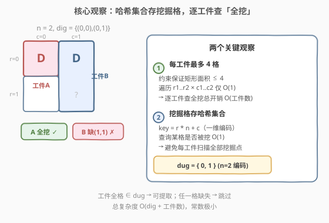
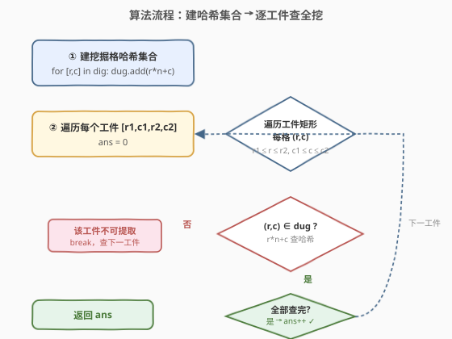
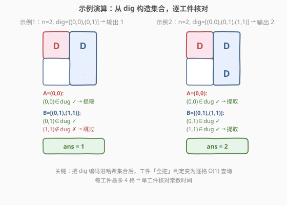

# LeetCode 统计可以提取的工件 题解

## 1. 题目概述

- **标题 / 题号**：统计可以提取的工件（#2201，medium）
- **链接**：https://leetcode.cn/problems/count-artifacts-that-can-be-extracted/
- **难度**：中等
- **标签**：数组、哈希表、模拟

**题意**：存在一个 $n \times n$ 大小、下标从 $0$ 开始的网格，网格中埋着一些**矩形工件**。`artifacts[i] = [r1_i, c1_i, r2_i, c2_i]` 表示第 $i$ 个工件占据的子网格：

- $(r1_i, c1_i)$ 是左上角单元格；
- $(r2_i, c2_i)$ 是右下角单元格。

工件覆盖该矩形内**所有**单元格。你将依次挖掘 `dig[i] = [r_i, c_i]` 指定的单元格。**当一个工件的所有单元格都被挖掘时，就可以提取该工件**。返回可以提取的工件数目。

**生成测试用例保证**：

- 不存在重叠的两个工件；
- 每个工件最多只覆盖 $4$ 个单元格；
- `dig` 中的元素互不相同。

**示例 1**：

```text
输入：n = 2, artifacts = [[0,0,0,0],[0,1,1,1]], dig = [[0,0],[0,1]]
输出：1
解释：
工件 0 只占 (0,0)，已被挖 → 可提取。
工件 1 占 (0,1) 与 (1,1)，(1,1) 未挖 → 不可提取。
返回 1。
```

**示例 2**：

```text
输入：n = 2, artifacts = [[0,0,0,0],[0,1,1,1]], dig = [[0,0],[0,1],[1,1]]
输出：2
解释：两件工件的所有单元格均被挖，都可提取。返回 2。
```

**约束**：

- $1 \leq n \leq 1000$
- $1 \leq \text{artifacts.length},\ \text{dig.length} \leq \min(n^2,\ 10^5)$
- $\text{artifacts[i].length} == 4$，$\text{dig[i].length} == 2$
- $0 \leq r1_i, c1_i, r2_i, c2_i,\ r_i, c_i \leq n - 1$
- $r1_i \leq r2_i$，$c1_i \leq c2_i$

> 💡 **审题关键**：① **判定对象是工件而非单元格**——只要某工件的**全部**格子被挖即算一件，部分挖不算；② **矩形面积 ≤ 4**——这是约束给的红利，意味着遍历单个工件的格子是 $O(1)$；③ **dig 元素互异且工件不重叠**——无需去重、无需处理一格属多工件的归属问题，直接用哈希集合存挖掘格即可；④ 数据规模 $10^5$，需要 $O(\text{dig} + \text{artifacts})$ 的线性解，不能对每工件再线性扫 `dig`。

## 2. 解题思路

### 2.1 暴力思路：逐工件 × 逐挖掘点

最朴素的做法：对每个工件，遍历 `dig` 中所有挖掘点，统计落在该工件矩形内的挖掘格数，若等于工件面积则可提取。

- **正确性**：直接复现「工件全格被挖」的判定。
- **效率**：工件数 $P$、挖掘点数 $D$，最坏 $O(P \cdot D)$。当 $P, D \sim 10^5$ 时达 $10^{10}$，**严重超时**。

> ⚠️ 瓶颈在于「查询某格是否被挖」是 $O(D)$ 线性扫描。只要把这个查询降到 $O(1)$，整体即变为线性。

### 2.2 核心观察：哈希集合存挖掘格 + 逐工件查全挖



整个解法建立在**两个关键观察**上。

**观察 1：每个工件最多覆盖 4 个单元格**

约束明确「每个工件最多只覆盖 $4$ 个单元格」，即矩形面积 $(r2_i - r1_i + 1)(c2_i - c1_i + 1) \leq 4$。因此遍历单个工件的所有格子只需检查 $1 \sim 4$ 格，是**常数时间**。逐工件核对的总开销为 $O(4P) = O(P)$。

**观察 2：把挖掘格存进哈希集合，查询降到 $O(1)$**

将每个挖掘格 $(r, c)$ 一维编码为 $r \cdot n + c$（$n$ 为网格边长，保证编码唯一），存入哈希集合 `dug`。此后判定「$(r, c)$ 是否被挖」只需 `dug.count(r*n+c)`，$O(1)$。

> ⚠️ **编码唯一性**：因为 $0 \leq r, c < n$，$r \cdot n + c$ 是标准的「行优先一维化」，$n$ 个列宽保证不同 $(r, c)$ 映射到不同整数，无碰撞。若用 `pair<int,int>` 或字符串拼接也可，但一维整数编码最省内存、哈希最快。

**两观察合流**：建集合 $O(D)$ + 逐工件逐格查 $O(P)$ = $O(D + P)$ 线性解。

### 2.3 算法流程图



**完整步骤**：

1. 初始化空哈希集合 `dug`。
2. 遍历 `dig`，对每个 $[r, c]$ 执行 `dug.insert(r * n + c)`。
3. 初始化 `ans = 0`。
4. 遍历每个工件 $[r1, c1, r2, c2]$：
   - 置 `ok = true`。
   - 双重循环 $r$ 从 $r1$ 到 $r2$，$c$ 从 $c1$ 到 $c2$：
     - 若 `dug.count(r * n + c) == 0`：`ok = false`，`break`。
   - 若 `ok` 为真：`ans += 1`。
5. **返回** `ans`。

> 💡 **写法要点**：① 内层双重循环因矩形面积 $\leq 4$ 而恒为常数次，无需担心嵌套循环拖慢；② 一旦发现某格未挖立即 `break` 跳出内层，避免无谓检查；③ `ok` 标志位实现「全格命中才计数」，等价于「与」运算的短路。

### 2.4 示例演算

以两个官方示例逐步演算：



**示例 1**：$n = 2$，`artifacts = [[0,0,0,0],[0,1,1,1]]`，`dig = [[0,0],[0,1]]`。

1. 建集合：`dug = {0*2+0, 0*2+1} = {0, 1}`。
2. 工件 0 `[0,0,0,0]`：仅格 $(0,0)$，编码 $0 \in \text{dug}$ → `ok` → `ans = 1`。
3. 工件 1 `[0,1,1,1]`：格 $(0,1)$ 编码 $1 \in \text{dug}$ ✓；格 $(1,1)$ 编码 $1 \cdot 2 + 1 = 3 \notin \text{dug}$ ✗ → 不可提取。
4. 返回 `ans = 1`。✓

**示例 2**：$n = 2$，`dig = [[0,0],[0,1],[1,1]]`。

1. 建集合：`dug = {0, 1, 3}`。
2. 工件 0：$(0,0) \to 0 \in \text{dug}$ → `ans = 1`。
3. 工件 1：$(0,1) \to 1 \in \text{dug}$ ✓；$(1,1) \to 3 \in \text{dug}$ ✓ → `ans = 2`。
4. 返回 `ans = 2`。✓

$$\text{ans}_1 = 1,\quad \text{ans}_2 = 2 \quad \checkmark$$

> 💡 **对照可见**：两例工件与网格完全相同，唯一差别是示例 2 多挖了 $(1,1)$，使工件 1 由「缺一格」变为「全挖」。这正说明判定逻辑的焦点——**任一格缺失即否决，全格命中才计入**。

## 3. 参考代码

### 方法一：哈希集合 + 逐工件查全挖（$O(D + P)$，推荐）

### C++

```cpp
class Solution {
public:
    int digArtifacts(int n, vector<vector<int>>& artifacts, vector<vector<int>>& dig) {
        unordered_set<int> dug;
        dug.reserve(dig.size());
        for (const auto& d : dig) {
            dug.insert(d[0] * n + d[1]);
        }
        int ans = 0;
        for (const auto& a : artifacts) {
            int r1 = a[0], c1 = a[1], r2 = a[2], c2 = a[3];
            bool ok = true;
            for (int r = r1; r <= r2 && ok; ++r) {
                for (int c = c1; c <= c2; ++c) {
                    if (!dug.count(r * n + c)) {
                        ok = false;
                        break;
                    }
                }
            }
            if (ok) ++ans;
        }
        return ans;
    }
};
```

### Python

```python
class Solution:
    def digArtifacts(self, n: int, artifacts: list[list[int]], dig: list[list[int]]) -> int:
        dug = {(r, c) for r, c in dig}
        ans = 0
        for r1, c1, r2, c2 in artifacts:
            ok = True
            for r in range(r1, r2 + 1):
                for c in range(c1, c2 + 1):
                    if (r, c) not in dug:
                        ok = False
                        break
                if not ok:
                    break
            if ok:
                ans += 1
        return ans
```

> 💡 **写法要点**：① C++ 用 `unordered_set<int>` + `r*n+c` 一维编码，比 `set<pair<int,int>>` 更快更省内存；Python 直接用 `set` 存元组，可读性更佳；② `reserve(dig.size())` 预分配桶，避免哈希表反复 rehash；③ 外层循环条件 `r <= r2 && ok` 把 `ok` 短路进循环控制，省一层 `break`。

## 4. 复杂度分析

| 维度 | 方法 | 复杂度 | 说明 |
|------|------|--------|------|
| 时间 | 哈希集合 + 逐工件查 | $O(D + P)$ | 建集合 $O(D)$；逐工件查全挖共 $\sum \text{面积}_i \leq 4P = O(P)$ |
| 空间 | 哈希集合 + 逐工件查 | $O(D)$ | 仅哈希集合存放挖掘格，工件逐个处理无需额外存储 |

> 💡 $D, P \leq 10^5$ 时总操作约 $2 \times 10^5$ 次，毫秒级完成。哈希集合查询均摊 $O(1)$，常数极小。即便 $n = 1000$，一维编码 $r \cdot n + c$ 最大 $999 \cdot 1000 + 999 < 10^6$，远在 `int` 范围内。

## 5. 扩展：取消「每工件 ≤ 4 格」约束后的优化

若放宽约束、允许单个工件覆盖大量单元格（如 $n \times n$ 整片），逐格遍历工件矩形退化为 $O(n^2)$，总复杂度可能达到 $O(P \cdot n^2)$。此时可改用**二维前缀和**判定「矩形内挖掘格数是否等于矩形面积」。

**做法**：

1. 用 $n \times n$ 的 0/1 矩阵 `a` 标记挖掘格，`a[r][c] = 1` 当且仅当 $(r, c)$ 被挖。
2. 构造二维前缀和 `S`，$S[r+1][c+1] = \sum_{i \leq r, j \leq c} a[i][j]$。
3. 对工件 $[r1, c1, r2, c2]$，矩形内挖掘格数为：

$$\text{cnt} = S[r2+1][c2+1] - S[r1][c2+1] - S[r2+1][c1] + S[r1][c1]$$

4. 若 $\text{cnt} == (r2 - r1 + 1)(c2 - c1 + 1)$，则该工件全挖，`ans++`。

- **时间**：建前缀和 $O(n^2)$ + 逐工件 $O(1)$ 查询 $O(P)$ = $O(n^2 + P)$。
- **空间**：$O(n^2)$ 存前缀和。

> ⚠️ 当 $n$ 也很大（$n \sim 10^5$）时 $O(n^2)$ 不可行，需稀疏化（如对每个工件用哈希集合逐一查，回到本题方法一）。前缀和方案仅在「工件面积大、网格中等」时占优，**本题约束下方法一已是最佳**。

## 6. 面试要点

**Q1：为什么用哈希集合而不是二维数组标记挖掘格？**

> 网格 $n$ 可达 $1000$，二维数组需 $O(n^2) = 10^6$ 空间，虽可接受但浪费——挖掘点最多 $10^5$ 个，远小于 $n^2$。哈希集合只存实际挖过的格，空间 $O(D)$ 更紧凑，且查询同样 $O(1)$。若 $n$ 极小（如 $n \leq 100$），二维数组因常数更小反而更快，可作为面试中的权衡讨论。

**Q2：一维编码 $r \cdot n + c$ 会不会有冲突？**

> 不会。因为 $0 \leq c < n$，$r \cdot n + c$ 是混合进制（行权 $n$、列权 $1$）的唯一分解，类似十进制数位。不同 $(r, c)$ 必映射到不同整数。前提是 $n$ 取网格真实边长；若误用 $n = \max(r, c) + 1$ 之类的动态值则可能错乱。

**Q3：「每个工件最多 4 格」这个约束起到了什么作用？**

> 它把「逐工件遍历自身格子」从潜在的 $O(n^2)$ 钉死为 $O(1)$，使得「哈希集合查全挖」整体保持 $O(D + P)$ 线性。没有这个约束，逐格遍历会退化为 $O(P \cdot n^2)$，需改用二维前缀和（见第 5 节）。约束是题目给出的复杂度红利，审题时要敏锐捕捉。

**Q4：工件不重叠、dig 互异这两个保证有何意义？**

> 「工件不重叠」意味着一个格子至多属于一个工件，无需处理一格被多工件共享时的归属判定；「dig 互异」意味着哈希集合插入无需去重，且挖掘格计数天然准确。若放开这两个保证，方法一依然正确（哈希集合天然去重、工件间互不影响），只是需额外确认题意是否要求按工件去重计数。

**Q5：能否不建集合、直接对工件按需查询？**

> 可以但更慢：若不预处理，每次查询「某格是否被挖」需线性扫 `dig`，退化为 $O(P \cdot D)$。建集合的本质是把 $D$ 个挖掘点一次性索引化，把后续 $P \cdot (\leq 4)$ 次查询的每次成本从 $O(D)$ 降到 $O(1)$。这是「空间换时间」的经典权衡——用 $O(D)$ 额外空间换取查询常数化。

> 💡 **一句话总结**：把 `dig` 编码进哈希集合，工件「全挖」判定变为逐格 $O(1)$ 查询；每工件最多 4 格使总复杂度锁定 $O(D + P)$。核心是认清「查询需 $O(1)$」+「工件面积常数」两点。

## 同类练习题

| # | 题目 | 与本题的关联 |
|---|------|-------------|
| 2120 | [执行所有后缀指令](https://leetcode.cn/problems/execution-of-all-suffix-instructions-staying-in-a-grid/) | 同为 $n \times n$ 网格上的模拟——逐起点独立模拟指令执行，强调「边界判定 + 每轮状态重置」 |
| 2132 | [用邮票贴满网格图](https://leetcode.cn/problems/stamping-the-grid/) | 网格上判定矩形覆盖是否完整——本题「工件全挖」的镜像问题（判定矩形是否被邮票全覆盖），用二维前缀和做区域求和 |
| 304 | [二维区域和检索 - 数组不可变](https://leetcode.cn/problems/range-sum-query-2d-immutable/) | 二维前缀和模板——第 5 节扩展方案的基础工具，矩形区域求和 $O(1)$ 查询 |
| 705 | [设计哈希集合](https://leetcode.cn/problems/design-hashset/) | 手撕哈希集合——理解本题所用 `unordered_set` 的底层原理，一维编码 + 取模分桶 |
