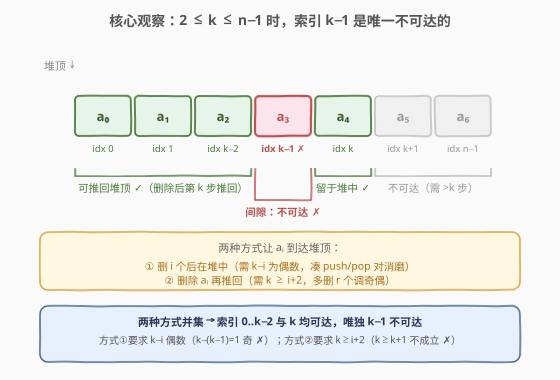
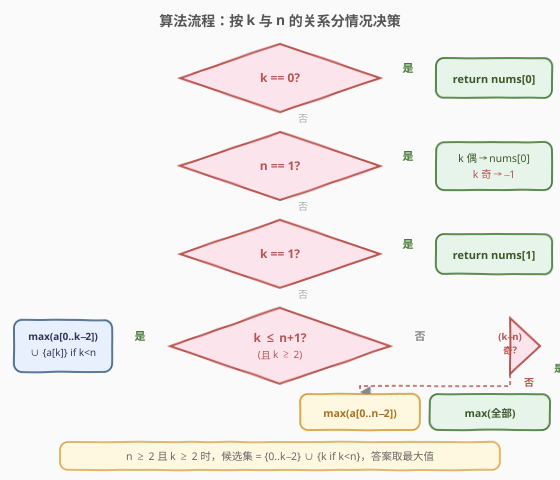

# K 次操作后最大化顶端元素

- **题目名称**：K 次操作后最大化顶端元素
- **链接**：[2202. K 次操作后最大化顶端元素](https://leetcode.cn/problems/maximize-the-topmost-element-after-k-moves/)
- **难度**：中等
- **标签**：贪心、数组、数学

## 1. 题目概述

给定一个下标从 $0$ 开始的整数数组 `nums`，表示一个**堆**，其中 `nums[0]` 是堆顶元素。每一次操作可以执行以下**之一**：

- **删除**堆顶元素（若堆非空）；
- 从已删除的元素中任选一个**添加**回堆顶。

给定整数 `k`，表示总共执行操作的次数。返回**恰好**执行 $k$ 次操作后堆顶元素的**最大值**。若堆一定为空，返回 $-1$。

**示例 1**：

```text
输入：nums = [5,2,2,4,0,6], k = 4
输出：5
解释：4 次操作后堆顶为 5 的一种方式：
  删除 5 → [2,2,4,0,6]
  删除 2 → [2,4,0,6]
  删除 2 → [4,0,6]
  推回 5 → [5,4,0,6]
```

**示例 2**：

```text
输入：nums = [2], k = 1
输出：-1
解释：唯一的选择是弹出堆顶 2，堆为空，返回 -1。
```

**约束条件**：

- $1 \le \text{nums.length} \le 10^5$
- $0 \le \text{nums[i]}, k \le 10^9$

> 💡 题眼：`k` 可达 $10^9$，远超数组长度 $n \le 10^5$。逐操作模拟不可行，必须通过分析「哪些元素**可能**成为最终堆顶」直接求最大值，把 $O(k)$ 的模拟压缩为 $O(n)$ 的扫描。

---

## 2. 解题思路

### 2.1 暴力思路：逐操作模拟 / BFS

最直观的做法是从初始堆出发，用 BFS 搜索所有可能的 $k$ 步操作序列，记录最终堆顶的所有可能值取最大。但每一步有「删除」或「推回任一已删元素」两种选择，分支因子随已删元素数增长，状态空间爆炸。

更关键的是 $k \le 10^9$——即使每步只做 $O(1)$ 决策，$10^9$ 步也远超时限。

> ⚠️ 暴力的困难本质：操作序列太长且分支太多。突破口是放弃「模拟过程」，转而分析**哪些 `nums[i]` 有资格成为最终堆顶**，再在候选集中取 $\max$。

### 2.2 核心观察：分析每个元素的可达性



**定义**：`nums[i]` **可达**，指存在某种 $k$ 步操作序列使得最终堆顶恰好为 `nums[i]`。

让 `nums[i]` 到达堆顶有且仅有两种方式：

| 方式 | 操作 | 最少步数 | 奇偶约束 |
|------|------|----------|----------|
| **① 留在堆中** | 删除前 $i$ 个元素（$i$ 次删除），`nums[i]` 从未被删 | $i$ | $k - i$ 为**偶数**（多余步数用「推回-再删」对消磨，每对 $2$ 步） |
| **② 删除后推回** | 删除前 $i+1$ 个元素（含 `nums[i]`），最后一步推回 `nums[i]` | $i + 2$（删 $i+1$ 个 + 推回 $1$ 次） | **无奇偶约束**（可多删 $r$ 个元素调节奇偶，$r \ge 0$） |

**方式 ① 的约束推导**：

- 删除 $i$ 个元素后 `nums[i]` 在堆顶，剩余 $k - i$ 步必须**不改变堆顶**。
- 唯一不改变堆顶的消磨方式是「推回某已删元素 → 立即再删」循环，每轮 $2$ 步，故 $k - i$ 为偶。
- 需 $i \ge 1$（至少有一个已删元素可推回），除非 $k = i$（无需消磨）。
- 故方式 ① 要求：$k \ge i$，$k - i$ 为偶数，$i \le n - 1$，且 $i \ge 1$ 或 $k = 0$。

**方式 ② 的约束推导**：

- 删除 `nums[0..i]`（$i + 1$ 次），再推回 `nums[i]`（$1$ 次），共 $i + 2$ 步。
- 剩余 $k - (i + 2)$ 步可拆为：多删 $r$ 个元素（$r \ge 0$，每删 $1$ 步）+ 消磨对（每对 $2$ 步），故 $r + 2 \times \text{pairs} = k - i - 2$。
- 由于 $r$ 可取任意 $\ge 0$ 的值，$k - i - 2$ **无奇偶限制**，只要 $k \ge i + 2$ 即可。
- 需 $i \le n - 1$（`nums[i]` 存在），但可以删除更多元素（$i + 1 + r \le n$）。

**合并两种方式**：

对索引 $i$（$0 \le i \le n - 1$），`nums[i]` 可达当且仅当：
- 方式 ① 满足 **或** 方式 ② 满足。

关键推论——**当 $2 \le k \le n - 1$ 时**：

- **方式 ②** 覆盖 $i \in [0,\, k-2]$（因为 $k \ge i + 2 \Leftrightarrow i \le k - 2$，所有 $i$ 无奇偶限制）。
- **方式 ①** 额外覆盖 $i = k$（因为 $k - k = 0$ 为偶，$i = k \ge 2 \ge 1$）。
- **$i = k - 1$ 不可达**：方式 ① 要求 $k - (k-1) = 1$ 为偶 ✗；方式 ② 要求 $k \ge (k-1) + 2 = k + 1$ ✗。
- $i > k$ 也不可达（需删除超过 $k$ 个元素）。

> 💡 **一句话总结**：$2 \le k \le n-1$ 时，候选集 $= \{nums[0], \ldots, nums[k-2]\} \cup \{nums[k]\}$，**唯独索引 $k-1$ 是「间隙」不可达**，答案取候选集 $\max$。

### 2.3 算法流程图



按 $k$ 与 $n$ 的关系分五种情况：

| 情况 | 条件 | 候选集 | 答案 |
|------|------|--------|------|
| 1 | $k = 0$ | $\{nums[0]\}$ | $nums[0]$ |
| 2 | $n = 1$ | $k$ 偶：$\{nums[0]\}$；$k$ 奇：$\emptyset$ | $k$ 偶 → $nums[0]$；$k$ 奇 → $-1$ |
| 3 | $k = 1$（$n \ge 2$） | $\{nums[1]\}$ | $nums[1]$ |
| 4 | $2 \le k \le n+1$ | $\{nums[0..k-2]\} \cup \{nums[k] \mid k < n\}$ | $\max$（候选集） |
| 5 | $k > n+1$ | $(k-n)$ 奇：全部元素；$(k-n)$ 偶：$nums[0..n-2]$ | $\max$（候选集）或 $-1$ |

**情况 5 的推导**（$k > n+1$，可删完所有 $n$ 个元素再反复推-删）：

- 删完全部 $n$ 个后剩 $k - n$ 步，堆空、已删集 $= \{nums[0..n-1]\}$。
- $k - n$ 为**奇**：最后一步必为推回 → 堆顶 $= \max(nums)$（推最大的回去）。
- $k - n$ 为**偶**：最后一步必为删除 → 堆空 → $-1$。但可不删完，只删 $n - 1$ 个，剩 $k - (n-1) = k - n + 1$ 步（奇）→ 推回 $\max(nums[0..n-2])$。最优为 $\max(nums[0..n-2])$（$n \ge 2$）或 $-1$（$n = 1$）。

> ⚠️ **$n = 1$ 特判**：唯一元素，$k$ 偶则删-推交替后留在堆顶，$k$ 奇则删完为空。该规律与情况 5 的奇偶规则一致，但 $k = 0$ 和 $k = 2$ 需提前拦截避免越界。

### 2.4 示例演算

![示例演算：nums = [5,2,2,4,0,6], k = 4](../images/2202_example_walkthrough.svg)

以**示例 1** `nums = [5,2,2,4,0,6], k = 4, n = 6` 为例：

- $2 \le k = 4 \le n - 1 = 5$，落入情况 4。
- 候选集 $= \{nums[0], nums[1], nums[2]\} \cup \{nums[4]\} = \{5, 2, 2, 0\}$。
- 间隙：$nums[3] = 4$（不可达）。
- $\max(5, 2, 2, 0) = 5$。

**验证 $nums[3] = 4$ 不可达**：
- 方式 ①：$k - 3 = 1$ 为奇 ✗。
- 方式 ②：需 $k \ge 3 + 2 = 5$，但 $k = 4$ ✗。

**验证 $nums[5] = 6$ 不可达**：
- 方式 ①：$k - 5 = -1 < 0$ ✗。
- 方式 ②：需 $k \ge 5 + 2 = 7$，但 $k = 4$ ✗。

**一种 $4$ 步操作序列**：

| 步 | 操作 | 堆 | 已删 |
|----|------|----|------|
| 初始 | — | $[5,2,2,4,0,6]$ | $\emptyset$ |
| 1 | 删除 $5$ | $[2,2,4,0,6]$ | $\{5\}$ |
| 2 | 删除 $2$ | $[2,4,0,6]$ | $\{5,2\}$ |
| 3 | 删除 $2$ | $[4,0,6]$ | $\{5,2,2\}$ |
| 4 | 推回 $5$ | $[5,4,0,6]$ | $\{2,2\}$ |

最终堆顶 $= 5$ ✓。

再看**示例 2** `nums = [2], k = 1, n = 1`：$n = 1$，$k = 1$ 为奇 → $-1$ ✓。

---

## 3. 参考代码

### C++

```cpp
class Solution {
public:
    int maximumTop(vector<int>& nums, int k) {
        int n = nums.size();
        if (k == 0) return nums[0];
        if (n == 1) return (k % 2 == 0) ? nums[0] : -1;
        if (k == 1) return nums[1];

        if (k <= n + 1) {
            int best = -1;
            for (int i = 0; i <= k - 2; i++)
                best = max(best, nums[i]);
            if (k < n)
                best = max(best, nums[k]);
            return best;
        } else {
            if ((k - n) % 2 == 1) {
                return *max_element(nums.begin(), nums.end());
            } else {
                return *max_element(nums.begin(), nums.end() - 1);
            }
        }
    }
};
```

### Python

```python
class Solution:
    def maximumTop(self, nums: List[int], k: int) -> int:
        n = len(nums)
        if k == 0:
            return nums[0]
        if n == 1:
            return nums[0] if k % 2 == 0 else -1
        if k == 1:
            return nums[1]

        if k <= n + 1:
            best = max(nums[:k - 1])          # nums[0..k-2]
            if k < n:
                best = max(best, nums[k])
            return best
        else:
            if (k - n) % 2 == 1:
                return max(nums)
            else:
                return max(nums[:n - 1])      # nums[0..n-2]
```

> 💡 **边界细节**：① `k == 0` 和 `n == 1` 必须在通用逻辑之前特判，否则 `nums[:k-1]` 或 `nums[1]` 会越界；② `k < n` 等价于 $k \le n - 1$，用于判断 `nums[k]` 是否存在；③ Python 切片 `nums[:k-1]` 在 $k - 1 > n$ 时自动截断为整个数组，但代码中 $k \le n + 1$ 保证 $k - 1 \le n$，切片最多 $n$ 个元素，$O(n)$ 安全。

---

## 4. 复杂度分析

| 维度 | 复杂度 | 说明 |
|------|--------|------|
| **时间复杂度** | $O(n)$ | 所有分支最多遍历一遍数组取 $\max$（`max_element` 或切片 `max`），$n \le 10^5$ 时毫秒级 |
| **空间复杂度** | $O(1)$ | 仅常数个变量；Python 切片 `nums[:k-1]` 最多拷贝 $n$ 个元素，若视为输出则 $O(n)$，可用 `max(nums[i] for i in range(...))` 规避 |

> 💡 复杂度与 $k$ 无关——这正是把 $O(k)$ 模拟压缩为 $O(n)$ 扫描的收益。$k = 10^9$ 时算法仍只做 $\le 10^5$ 次比较。

---

## 5. 扩展：可达性的完整证明

### 5.1 方式 ② 无奇偶约束的严格论证

方式 ② 的总步数分解为：

$$
k = \underbrace{(i + 1)}_{\text{删除 } nums[0..i]} + \underbrace{r}_{\text{多删 } r \text{ 个}} + \underbrace{1}_{\text{推回 } nums[i]} + \underbrace{2p}_{\text{消磨对}}
$$

其中 $r \ge 0$，$p \ge 0$，$i + 1 + r \le n$（不能删超过 $n$ 个）。整理得：

$$
k - i - 2 = r + 2p
$$

由于 $r$ 可取任意非负整数，$k - i - 2$ 可为任意 $\ge 0$ 的值（取 $r = k - i - 2$，$p = 0$），**无奇偶限制**。唯一约束是 $k \ge i + 2$ 且 $i + 1 + r \le n$，后者在 $k \le n + 1$ 时自动满足（$r = k - i - 2 \le n - i - 1$）。

### 5.2 间隙 $k-1$ 不可达的对偶论证

对 $i = k - 1$：

- **方式 ①**：$k - i = 1$，奇数。消磨对每对 $2$ 步，无法凑出 $1$ 步。且 $i = k - 1 \ge 1$（因 $k \ge 2$），不满足「无需消磨」的 $k = i$ 条件。✗
- **方式 ②**：需 $k \ge i + 2 = k + 1$，矛盾。✗

两种方式均失败，$i = k - 1$ 确为唯一间隙。

### 5.3 $k > n + 1$ 时的奇偶规则

删完全部 $n$ 个元素后，堆空、已删集 $= \{nums[0..n-1]\}$，剩余 $k - n$ 步只能对已删元素做推-删：

- **$k - n$ 奇**：推-删-推-…-推（奇数步以推结尾），堆顶 $= \max(nums)$。
- **$k - n$ 偶**：推-删-…-推-删（偶数步以删结尾），堆空。退而求其次：只删 $n - 1$ 个，剩 $k - n + 1$ 步（奇），推回 $\max(nums[0..n-2])$。

> 💡 **方法论**：当操作步数远超元素数（$k \gg n$），关键转为分析**奇偶性**——推-删循环的周期为 $2$，$k$ 的奇偶决定最终是「推结尾」（堆非空）还是「删结尾」（堆空）。

---

## 6. 面试要点

1. **为什么不能逐操作模拟？**

   - $k \le 10^9$，逐操作模拟至少 $10^9$ 步，远超时限。必须从「哪些元素可达」的角度分析，把 $O(k)$ 压缩为 $O(n)$。

2. **为什么索引 $k-1$ 不可达？**

   - 方式 ①（留在堆中）需 $k - (k-1) = 1$ 为偶数，矛盾；方式 ②（删除后推回）需 $k \ge (k-1) + 2 = k + 1$，矛盾。两种方式均失败，故 $k - 1$ 是唯一间隙。

3. **方式 ② 为什么没有奇偶约束？**

   - 删除 `nums[i]` 后可以**多删 $r$ 个**元素（$r \ge 0$），$r$ 可取任意非负整数，从而 $k - i - 2 = r + 2p$ 可为任意 $\ge 0$ 的值，奇偶由 $r$ 自由调节。

4. **$n = 1$ 时为什么要特判？**

   - 唯一元素，$k$ 偶则删-推交替后留堆顶，$k$ 奇则删完为空。该规则虽与 $k > n + 1$ 的奇偶规则一致，但 $k = 0$（返回 `nums[0]`）和 $k = 2$（需走 $k \le n + 1$ 分支）需提前拦截，否则切片 `nums[:k-1]` 或访问 `nums[1]` 会越界。

5. **$k > n + 1$ 时如何决定答案？**

   - 删完全部后剩 $k - n$ 步。奇数步以推结尾（堆顶 $= \max(nums)$）；偶数步以删结尾（堆空），退而只删 $n - 1$ 个，奇数步推回 $\max(nums[0..n-2])$。

> 💡 **一句话总结**：2202 是「**可达性分析**」的招牌题——不模拟过程，而是分析每个元素到达堆顶的两种方式（留堆 / 推回），合并后得到候选集取 $\max$；$k \gg n$ 时退化为奇偶判定。

---

## 7. 同类练习题

- [2195. 向数组中追加 K 个整数](https://leetcode.cn/problems/append-k-integers-with-minimal-sum/)（[站内题解](../2101-2200/2195_向数组中追加K个整数.md)）：同为 $k$ 很大时放弃逐操作模拟、利用结构批量求解，把 $O(k)$ 压缩为 $O(n)$
- [2139. 得到目标值的最小移动次数](https://leetcode.cn/problems/minimum-moves-to-reach-target-score/)（[站内题解](../2101-2200/2139_得到目标值的最小移动次数.md)）：$k$（操作步数）可达 $10^9$，通过反向贪心把 $O(k)$ 压成 $O(\text{配额})$，与本题「不模拟、重分析」思路同源
- [71. 简化路径](https://leetcode.cn/problems/simplify-path/)（[站内题解](../0001-0100/71_简化路径.md)）：栈模拟 + push/pop 操作，对照本题的「删除-推回」堆操作语义
- [155. 最小栈](https://leetcode.cn/problems/min-stack/)（[站内题解](../0101-0200/155_最小栈.md)）：栈设计题，对照本题对堆栈 push/pop 语义的理解
- [225. 用队列实现栈](https://leetcode.cn/problems/implement-stack-using-queues/)：堆栈操作语义的另一视角，对照本题「删除堆顶 / 推回堆顶」的基本操作
