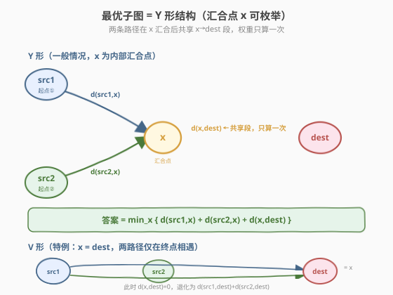
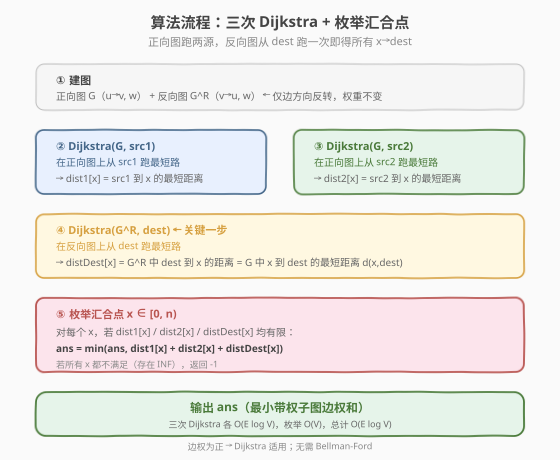
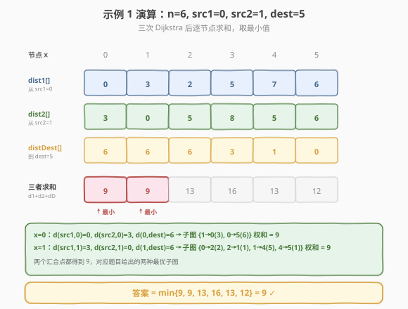

# LeetCode 包含要求路径的最小带权子图 题解

## 1. 题目概述

- **标题 / 题号**：包含要求路径的最小带权子图（#2203，hard）
- **链接**：https://leetcode.cn/problems/minimum-weighted-subgraph-with-the-required-paths/
- **难度**：困难
- **标签**：图、最短路径、Dijkstra、反向图

**题意**：给定一个 `n` 个节点的**带权有向图**，边列表 `edges[i] = [fromi, toi, weighti]`。再给三个互不相同的点 `src1`、`src2`、`dest`。要从图中选出一个**边权和最小**的子图，使得从 `src1` 和 `src2` 出发都能到达 `dest`；若不存在则返回 `-1`。

> 💡 子图的边权和 = 它所包含的所有边的权值之和。子图只需保证「可达性」，不必是连通图，也不要求保留所有原图节点。

**示例 1**：

```text
输入：n = 6, edges = [[0,2,2],[0,5,6],[1,0,3],[1,4,5],[2,1,1],[2,3,3],[2,3,4],[3,4,2],[4,5,1]]
      src1 = 0, src2 = 1, dest = 5
输出：9
解释：最优子图之一为 {1→0(3), 0→5(6)}，权和 = 9；
      另一种为 {0→2(2), 2→1(1), 1→4(5), 4→5(1)}，权和同样为 9。
```

**示例 2**：

```text
输入：n = 3, edges = [[0,1,1],[2,1,1]], src1 = 0, src2 = 1, dest = 2
输出：-1
解释：节点 1 没有任何出边，无法到达 dest=2，故不存在满足条件的子图。
```

**约束**：

- `3 <= n <= 10^5`
- `0 <= edges.length <= 10^5`
- `edges[i].length == 3`，`0 <= fromi, toi <= n - 1`，`fromi != toi`
- `src1`、`src2`、`dest` 两两不同
- `1 <= weight[i] <= 10^5`

> ⚠️ 规模提示：`n` 和 `E` 都到 `10^5` 量级，算法整体需控制在 `O(E log V)` 左右，排除 `O(V²)` 朴素 Dijkstra 与 `O(V³)` Floyd。

## 2. 解题思路

### 2.1 暴力思路：为什么枚举两条路径不可行？

最直白的想法：枚举一条 `src1→dest` 路径 $P_1$ 和一条 `src2→dest` 路径 $P_2$，取它们的并集 $P_1 \cup P_2$ 作为子图，权和为 $|P_1| + |P_2| - |P_1 \cap P_2|$（共享边只算一次），再求最小。

但路径数量是指数级的，无法直接枚举。退一步：即便只考虑「最短路」，单独取 `d(src1,dest) + d(src2,dest)` 也不对——它假设两条路径**完全不共享**边，但实际上让两条路在某个节点汇合、共享后半段往往更省。

> ⚠️ 关键误区：把问题拆成「src1 到 dest 的最短路」+「src2 到 dest 的最短路」会**重复计算**共享段。正确做法是显式地枚举「汇合点」，把共享段的权重只算一次。

### 2.2 核心观察：Y 形结构 + 枚举汇合点



**最优子图必呈 Y 形（或其特例 V 形）**：

- 存在一个**汇合点** $x$，使得 `src1→x` 与 `src2→x` 两条前缀路径**互不共享**，而 `x→dest` 这段后缀被两条路径**共享**（权重只算一次）。
- 当 $x = \text{dest}$ 时退化为 **V 形**：两条路径只在终点相遇，共享段权重为 0，答案即 $d(\text{src1}, \text{dest}) + d(\text{src2}, \text{dest})$。

由此，答案可写成：

$$
\text{ans} = \min_{x \in [0,n)} \Big\{ d(\text{src1}, x) + d(\text{src2}, x) + d(x, \text{dest}) \Big\}
$$

其中 $d(a, b)$ 表示原图中 $a$ 到 $b$ 的最短距离。若某个 $x$ 三项中任一为 `INF`（不可达），则该 $x$ 不参与取 min；若**所有** $x$ 都不可行，返回 `-1`。

> 💡 **为什么 Y 形是最优的？** 对任意可行子图，取其中一条 `src1→dest` 路径 $P_1$ 与一条 `src2→dest` 路径 $P_2$。两条路径都终于 `dest`，若它们共享某条边，则共享部分必含一段通往 `dest` 的后缀。把汇合点 $x$ 滑到「共享后缀的起点」：原方案中 $x$ 之后两路各自走一段到 `dest`（两条后缀权和），而 Y 形只保留**更短的那一条**后缀并共享，必然不劣。因此枚举所有 $x$ 取最小即得全局最优。

### 2.3 算法流程图



核心是**三次 Dijkstra**：

1. **正向图 $G$ 上**从 `src1` 跑 → 得 `dist1[x] = d(src1, x)`；
2. **正向图 $G$ 上**从 `src2` 跑 → 得 `dist2[x] = d(src2, x)`；
3. **反向图 $G^R$ 上**从 `dest` 跑 → 得 `distDest[x]`。

> 💡 **关键技巧——反向图**：要求的是「每个 $x$ 到 `dest` 的最短距离」$d(x, \text{dest})$，即多源单汇。把所有边方向反转建反向图 $G^R$，则「$G$ 中 $x \to \text{dest}$」等价于「$G^R$ 中 $\text{dest} \to x$」。于是只需从 `dest` 在 $G^R$ 上跑**一次** Dijkstra，即可一次性求出所有 $x$ 的 $d(x, \text{dest})$，避免对每个 $x$ 单独跑。

最后枚举 $x \in [0, n)$，取 `dist1[x] + dist2[x] + distDest[x]` 的最小值。

### 2.4 示例演算

以示例 1 为例（`n=6, src1=0, src2=1, dest=5`），三次 Dijkstra 得到如下距离数组，再逐节点求和取最小：



| 步骤 | 操作 | 结果 |
|------|------|------|
| ① | 正向图从 `src1=0` 跑 Dijkstra | `dist1 = [0, 3, 2, 5, 7, 6]` |
| ② | 正向图从 `src2=1` 跑 Dijkstra | `dist2 = [3, 0, 5, 8, 5, 6]` |
| ③ | 反向图从 `dest=5` 跑 Dijkstra | `distDest = [6, 6, 6, 3, 1, 0]` |
| ④ | 逐节点求和 `d1+d2+dD` | `[9, 9, 13, 16, 13, 12]` |
| ⑤ | 取最小 | `9`（汇合点 $x=0$ 或 $x=1$） |

- $x=0$：`0 + 3 + 6 = 9`，对应子图 `{1→0(3), 0→5(6)}`；
- $x=1$：`3 + 0 + 6 = 9`，对应子图 `{0→2(2), 2→1(1), 1→4(5), 4→5(1)}`。

两者都得 9，正是题目给出的两种最优解。对于示例 2，`dest=2` 在反向图中无法到达 `src2=1`（`distDest[1]=INF`），所有 $x$ 均不可行，返回 `-1`。

## 3. 参考代码

### C++

```cpp
class Solution {
  public:
    long long minimumWeight(int n, vector<vector<int>>& edges,
                            int src1, int src2, int dest) {
        // 正向图 G 与反向图 G^R
        vector<vector<pair<int, long long>>> g(n), rg(n);
        for (auto& e : edges) {
            int u = e[0], v = e[1]; long long w = e[2];
            g[u].push_back({v, w});
            rg[v].push_back({u, w});          // 边方向反转，权重不变
        }

        auto dijkstra = [&](vector<vector<pair<int, long long>>>& graph,
                            int src) -> vector<long long> {
            const long long INF = LLONG_MAX / 4;
            vector<long long> dist(n, INF);
            dist[src] = 0;
            // 最小堆：(距离, 节点)
            priority_queue<pair<long long, int>, vector<pair<long long, int>>,
                           greater<>> pq;
            pq.push({0, src});
            while (!pq.empty()) {
                auto [d, u] = pq.top(); pq.pop();
                if (d > dist[u]) continue;     // 懒删除：过期记录
                for (auto& [v, w] : graph[u]) {
                    if (d + w < dist[v]) {
                        dist[v] = d + w;
                        pq.push({dist[v], v});
                    }
                }
            }
            return dist;
        };

        auto d1 = dijkstra(g, src1);           // d(src1, x)
        auto d2 = dijkstra(g, src2);           // d(src2, x)
        auto dd = dijkstra(rg, dest);          // d(x, dest)，反向图从 dest 跑

        const long long INF = LLONG_MAX / 4;
        long long ans = INF;
        for (int x = 0; x < n; ++x) {
            if (d1[x] != INF && d2[x] != INF && dd[x] != INF) {
                ans = min(ans, d1[x] + d2[x] + dd[x]);
            }
        }
        return ans == INF ? -1 : ans;
    }
};
```

### Python

```python
class Solution:
    def minimumWeight(self, n: int, edges: List[List[int]],
                      src1: int, src2: int, dest: int) -> int:
        g = [[] for _ in range(n)]
        rg = [[] for _ in range(n)]
        for u, v, w in edges:
            g[u].append((v, w))
            rg[v].append((u, w))          # 反向边

        def dijkstra(graph, src):
            INF = float('inf')
            dist = [INF] * n
            dist[src] = 0
            pq = [(0, src)]               # (距离, 节点)
            while pq:
                d, u = heapq.heappop(pq)
                if d > dist[u]:           # 懒删除
                    continue
                for v, w in graph[u]:
                    nd = d + w
                    if nd < dist[v]:
                        dist[v] = nd
                        heapq.heappush(pq, (nd, v))
            return dist

        d1 = dijkstra(g, src1)            # d(src1, x)
        d2 = dijkstra(g, src2)            # d(src2, x)
        dd = dijkstra(rg, dest)           # d(x, dest)

        INF = float('inf')
        ans = INF
        for x in range(n):
            if d1[x] != INF and d2[x] != INF and dd[x] != INF:
                ans = min(ans, d1[x] + d2[x] + dd[x])
        return -1 if ans == INF else ans
```

> 💡 **细节注意**：
> - `n, E ≤ 10^5`，`weight ≤ 10^5`，单条路径最长约 `10^10`，C++ 中 `int` 会溢出，必须用 `long long`；`INF` 取 `LLONG_MAX / 4` 防止相加溢出。
> - 题目存在**平行边**（示例 1 中 `2→3` 出现两次，权 3 和 4），邻接表自然兼容，松弛时取更小者即可。
> - 「懒删除」写法：堆中可能残留同一节点的过期记录，弹出时 `if (d > dist[u]) continue` 跳过即可，无需显式删除。

## 4. 复杂度分析

| 维度 | 复杂度 | 说明 |
|------|--------|------|
| 时间复杂度 | `O(E log V)` | 三次堆优化 Dijkstra，每次 `O(E log V)`；枚举 $x$ 为 `O(V)`，被前者支配 |
| 空间复杂度 | `O(V + E)` | 正向图 + 反向图邻接表各 `O(E)`，三个 `dist` 数组各 `O(V)`，堆最坏 `O(E)` |

> ⚠️ 反向图额外占用 `O(E)` 空间，但这是换取「一次 Dijkstra 求所有 $x \to \text{dest}$」的必要代价；否则需对每个 $x$ 单独跑，退化为 `O(V · E log V)` 不可接受。

## 5. 扩展：为什么不能直接相加两条最短路？

直观误区：分别求 `d(src1, dest)` 与 `d(src2, dest)` 相加。这等价于强制 $x = \text{dest}$（V 形），忽略了「共享后半段」可能更优的情况。

构造反例：设 `src1=0, src2=1, dest=3`，边为 `0→2(1)`、`1→2(1)`、`2→3(1)`、`0→3(10)`、`1→3(10)`。

- V 形（$x=3$）：`d(0,3)+d(1,3) = 10+10 = 20`；
- Y 形（$x=2$）：`d(0,2)+d(1,2)+d(2,3) = 1+1+1 = 3`。

Y 形远优于 V 形。本例正是利用枚举 $x$ 自动发现「在 2 汇合、共享 2→3」这一更优结构。

**推广**：若题目改为「$k$ 个源点都要到达 `dest`」，则汇合点结构变为树形（多源汇合到一点再单线到 dest），可用类似思路：每个源在正向图跑一次 Dijkstra，dest 在反向图跑一次，枚举汇合点求 $\sum_i d(\text{src}_i, x) + d(x, \text{dest})$ 的最小值。

## 6. 面试要点

1. **为什么最优子图是 Y 形？**

   - 两条 `→dest` 路径若有共享边，共享部分必含一段通往 dest 的后缀。把汇合点滑到共享后缀起点，让两路共享该后缀，比各自走一条后缀更省。枚举所有 $x$ 即覆盖所有可能的最优结构。

2. **为什么用反向图求 $d(x, \text{dest})$？**

   - 需要的是「所有 $x$ 到 dest 的距离」，即单汇多源。直接做要对每个 $x$ 跑一次 Dijkstra，开销 `O(V·E log V)`。把边反向后，问题变成「从 dest 出发的单源最短路」，一次 Dijkstra 全部求出。

3. **为什么必须用 `long long`？**

   - `n, E ≤ 10^5`，`weight ≤ 10^5`，路径长度可达 `10^5 × 10^5 = 10^10`，远超 `INT_MAX ≈ 2.1×10^9`。三个距离相加更易溢出，`INF` 取 `LLONG_MAX/4` 留出安全余量。

4. **如何处理返回 `-1`？**

   - 枚举 $x$ 时只要三项之一为 `INF` 就跳过该 $x$。若所有 $x$ 都被跳过（即 `ans` 仍为 `INF`），说明不存在使两源都到 dest 的子图，返回 `-1`。等价判据：`dest` 从 `src1` 或 `src2` 至少一个不可达。

5. **平行边和自环如何处理？**

   - 题面保证 `fromi != toi`（无自环）；但允许平行边（同 `u→v` 多条不同权）。邻接表照存全部，Dijkstra 松弛时自然取最小权那条，无需去重。

## 同类练习题

| # | 题目 | 与本题的关联 |
|---|------|-------------|
| 743 | [网络延迟时间](https://leetcode.cn/problems/network-delay-time/) | 堆优化 Dijkstra 单源最短路母题，本题的基石模板 |
| 787 | [K 站中转内最便宜的航班](https://leetcode.cn/problems/cheapest-flights-within-k-stops/) | 限制步数的最短路，Bellman-Ford / 分层松弛思路 |
| 1976 | [到达目的地的方案数](https://leetcode.cn/problems/number-of-ways-to-arrive-destination/) | Dijkstra 求最短路 + 统计路径数，巩固 Dijkstra 主体 |
| 1514 | [概率最大的路径](https://leetcode.cn/problems/path-with-maximum-probability/) | Dijkstra 变体（最长路 + 取大堆），体会松弛方向切换 |
| 2045 | [到达目的地的第二短时间](https://leetcode.cn/problems/second-minimum-time-to-reach-destination/) | Dijkstra 求次短路，扩展「维护多档距离」的思路 |
