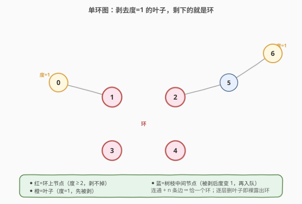

# LeetCode 无向图中到环的距离 题解

## 1. 题目概述

- **标题 / 题号**：无向图中到环的距离（#2204，hard）
- **链接**：https://leetcode.cn/problems/distance-to-a-cycle-in-undirected-graph/
- **难度**：困难
- **标签**：图、广度优先搜索、深度优先搜索、拓扑排序

**题意**：给定正整数 `n`，表示一个 **连通无向图** 中的节点数，该图 **只包含一个** 环。节点编号为 `0` ~ `n-1`。再给二维整数数组 `edges`，`edges[i] = [node1i, node2i]` 表示一条连接 `node1i` 与 `node2i` 的双向边。

两个节点 `a`、`b` 的距离定义为 `a` 到 `b` 所需的 **最小边数**。要求返回长度为 `n` 的数组 `answer`，其中 `answer[i]` 是第 `i` 个节点到环中任意节点的最小距离。

> ⚠️ **关键约束**：`edges.length == n`，即图有 `n` 个节点 `n` 条边。连通图满足「边数 = 点数」⇒ 恰好一个环（unicyclic graph），环外挂着的都是树状分支。

**示例 1**：

```text
输入：n = 7, edges = [[1,2],[2,4],[4,3],[3,1],[0,1],[5,2],[6,5]]
输出：[1,0,0,0,0,1,2]
解释：节点 1,2,3,4 构成环。
0→1 距离 1；5→2 距离 1；6→5→2 距离 2。
```

**示例 2**：

```text
输入：n = 9, edges = [[0,1],[1,2],[0,2],[2,6],[6,7],[6,8],[0,3],[3,4],[3,5]]
输出：[0,0,0,1,2,2,1,2,2]
解释：节点 0,1,2 构成环。
3,4,5 与 6,7,8 分别是从 0、2 长出的树枝。
```

**约束**：

- `3 <= n <= 10^5`
- `edges.length == n`
- `0 <= node1i, node2i <= n - 1`，`node1i != node2i`
- 图连通、只有一个环、无重边

## 2. 解题思路

> 💡 **一句话主线**：环上节点「度 ≥ 2 剥不掉」，树枝末端是「度 = 1 的叶子」。像剥洋葱一样逐层删掉叶子，最后裸露出的就是环；删叶子时顺手记下「下一跳邻居」，最后反向一遍即可填出每个节点到环的距离。

### 2.1 暴力思路

对每个节点 `i`，从 `i` 出发做 BFS，第一次碰到环上节点时返回层数。问题是：**环上节点是谁？** 暴力做法得先找环——对每条边尝试删除后判连通性 $O(n^2)$，或对每个节点 DFS 走到回到自身判环 $O(n^2)$。即便用并查集 + 删边找环 $O(n\alpha(n))$ 找到环，再对 $n$ 个点各做一次 BFS 又是 $O(n^2)$。$n=10^5$ 直接超时。

优化方向：环的判定不必逐点搜。**剥叶子**是更自然的视角——叶子（度=1）一定不在环上，删掉它后它的邻居度数减一，可能变成新叶子；如此「由外向内」逐层剥离，最后剩下的必然全是环上节点。这正是无向图上的 **拓扑排序（Kahn 变体）**。

### 2.2 核心观察：剥叶子裸露环 + 反向填距离



关键直觉：

- **环上节点剥不掉**：环里每个节点都有两条环内边，加上可能的树枝边，度 ≥ 2。只要环内边没被删，它的度永远 ≥ 2，不会变成叶子。
- **树枝节点会被剥光**：树枝是从环上某点长出的一棵树，树叶端是度=1 的节点。删掉叶子后，它的父节点度数减一，若父节点本就只有两条边（一条连孩子、一条连环方向），删完孩子后度变 1，沦为新一轮叶子——层层向环收敛。
- **记录下一跳 `f[i]`**：剥 `i` 时，`i` 的唯一邻居 `j` 就是「比 `i` 更靠近环」的下一跳。记下 `f[i] = j`，就为每个非环节点建好了一条指向环的「父指针」。
- **反向填距离**：把剥离顺序记成 `seq`（外→内）。环上节点 `ans=0`；反向遍历 `seq`（内→外），处理 `i` 时其 `f[i]` 更靠近环、已在 `seq` 更靠后 ⇒ 反向时已被算出，于是 `ans[i] = ans[f[i]] + 1` 一步到位。

> 💡 一句话：**剥叶子既「找环」又「建父指针」，反向一遍即「算距离」**——环是剥不掉的核，`f` 是指向核的链，距离就是链长。

### 2.3 算法流程图


流程分两阶段：

1. **剥叶子阶段**：度=1 的节点入队；每次出队 `i`，记入 `seq`，找其唯一邻居 `j`，记 `f[i]=j`，从 `g[j]` 删除 `i`，若 `g[j]` 度变 1 则 `j` 入队。队列空时剩下的全是环。
2. **填距离阶段**：`ans` 全 0（环上节点距离 0）；反向遍历 `seq`，`ans[i] = ans[f[i]] + 1`。

> ⚠️ **为何无向图也能用「拓扑」**：有向 Kahn 按「入度=0」删源点；无向图没有方向，改用「度=1」删叶子，思想完全一致——都是删掉「不再被依赖」的边界节点，向核心收敛。

### 2.4 示例演算

![示例1演算：剥叶子 seq=[0,6,5]，再反向填距离](../images/dist_cycle_walkthrough.svg)

以示例 1（`n=7`）为例，初始度数为：`0:1, 1:3, 2:3, 3:2, 4:2, 5:2, 6:1`。

**阶段一（剥叶子，外→内）**：初始度=1 的节点是 `0` 和 `6`，入队 `q=[0,6]`。

| 步 | 出队 i | f[i] | 动作 |
|----|--------|------|------|
| 1 | 0 | 1 | `g[1]` 删 0 → `deg[1]=2`，不入队 |
| 2 | 6 | 5 | `g[5]` 删 6 → `deg[5]=1`，`5` 入队 |
| 3 | 5 | 2 | `g[2]` 删 5 → `deg[2]=2`，不入队 |

队列空，剩 `{1,2,3,4}`（度均为 2）即环；`ans` 全 0；`seq = [0,6,5]`。

**阶段二（反向填距离，内→外）**：反向遍历 `seq = [5,6,0]`：

| 反向 i | f[i] | ans[i] = ans[f[i]] + 1 |
|--------|------|------------------------|
| 5 | 2 | ans[2]+1 = 0+1 = 1 |
| 6 | 5 | ans[5]+1 = 1+1 = 2 |
| 0 | 1 | ans[1]+1 = 0+1 = 1 |

最终 `ans = [1,0,0,0,0,1,2]`，与期望输出一致。

> 💡 **为何反向能一次到位**：`seq` 按「外→内」记录，`i` 的下一跳 `f[i]` 更靠近环 ⇒ 在 `seq` 中位置更靠后 ⇒ 反向遍历时 `f[i]` 先于 `i` 被处理，`ans[f[i]]` 已是最终值。

## 3. 参考代码

### 方法一：剥叶子 + 反向填距离（推荐）

邻接表用 `set`（C++ 用 `unordered_set`）便于 $O(1)$ 删边；剥叶子时同步记录 `seq` 与父指针 `f`；最后反向填 `ans`。每个节点进出队列一次、每条边被删除一次，整体 $O(n)$。

### C++

```cpp
class Solution {
  public:
    vector<int> distanceToCycle(int n, vector<vector<int>>& edges) {
        vector<unordered_set<int>> g(n);
        for (auto& e : edges) {            // 无向边双向加入
            g[e[0]].insert(e[1]);
            g[e[1]].insert(e[0]);
        }
        queue<int> q;
        for (int i = 0; i < n; ++i)
            if (g[i].size() == 1) q.push(i);  // 初始叶子入队

        vector<int> f(n), seq;
        while (!q.empty()) {
            int i = q.front(); q.pop();
            seq.push_back(i);               // 记录剥离顺序（外→内）
            for (int j : g[i]) {            // 度=1，唯一邻居
                g[j].erase(i);              // 邻居删掉指向 i 的边
                f[i] = j;                   // 记下一跳（指向环方向）
                if (g[j].size() == 1) q.push(j);  // 邻居变叶子则入队
            }
            g[i].clear();                   // i 已脱离图
        }

        vector<int> ans(n, 0);              // 环上节点保持 0
        for (int k = (int)seq.size() - 1; k >= 0; --k) {  // 反向（内→外）
            int i = seq[k];
            ans[i] = ans[f[i]] + 1;
        }
        return ans;
    }
};
```

### Python

```python
from collections import deque

class Solution:
    def distanceToCycle(self, n: int, edges: List[List[int]]) -> List[int]:
        g = [set() for _ in range(n)]
        for a, b in edges:                  # 无向边双向加入
            g[a].add(b)
            g[b].add(a)

        q = deque(i for i in range(n) if len(g[i]) == 1)  # 初始叶子入队
        f = [0] * n
        seq = []
        while q:
            i = q.popleft()
            seq.append(i)                   # 记录剥离顺序（外→内）
            for j in g[i]:                  # 度=1，唯一邻居
                g[j].discard(i)             # 邻居删掉指向 i 的边
                f[i] = j                    # 记下一跳（指向环方向）
                if len(g[j]) == 1:          # 邻居变叶子则入队
                    q.append(j)
            g[i].clear()                    # i 已脱离图

        ans = [0] * n                       # 环上节点保持 0
        for i in reversed(seq):             # 反向（内→外）
            ans[i] = ans[f[i]] + 1
        return ans
```

> 💡 **细节**：`for j in g[i]` 时 `g[i]` 恰有 1 个元素（度=1 保证），故循环体只执行一次；`discard` 比 `remove` 更安全（删完清空，不会抛 KeyError）。若改用数组版邻接表 + 度数组，则需额外维护「有效邻居」指针来跳过已删边，实现更繁琐；`set` 换来了代码简洁，$n=10^5$ 下常数完全可接受。

## 4. 复杂度分析

| 维度 | 复杂度 | 说明 |
|------|--------|------|
| 时间复杂度 | $O(n)$ | 每个节点至多入队/出队一次；每条边在两端各被 `insert`/`erase` 一次，均摊 $O(1)$；反向填值 $O(n)$ |
| 空间复杂度 | $O(n)$ | 邻接表 `g` 存 $2n$ 条有向边 $O(n)$；`f`、`seq`、`ans` 各 $O(n)$ |

> ⚠️ 本题 $n \le 10^5$，$O(n)$ 是必须的。若用「每点一次 BFS」的 $O(n^2)$ 暴力会超时。`set` 的常数虽大于数组，但 $2\times10^5$ 次哈希操作在时限内绰绰有余；若极端卡常可换 `vector` + 度数组 + 双向删除标记。

## 5. 扩展：找环的几种姿势

本题的「剥叶子」是 **无向单环图** 找环的最优解，但不同图模型下找环有不同套路：

- **无向图 + 恰一个环（unicyclic）**：剥叶子（本题）。也可并查集：依次合并边的两端，首次「两端已同集」的边即为成环边，$O(n\alpha(n))$，但只能定位环边、不能直接给距离。
- **无向图 + 多环**：剥叶子后剩余度 ≥ 2 的子图含所有环（可能是若干点双连通分量），需配合 DFS/点双缩点进一步分析。
- **有向图找环**：拓扑排序（Kahn）后入度非 0 的节点即在环上（[207. 课程表](https://leetcode.cn/problems/course-schedule/) 的判环思路）；或三色标记 DFS。
- **有向图最长环**：[2360. 图中的最长环](https://leetcode.cn/problems/longest-cycle-in-a-graph/)，对每个未访问节点沿出边走到重复点统计环长。

> 💡 **通用心法**：「能被删的都不是环」——无论是按入度删源点（有向）还是按度删叶子（无向），环总是拓扑剥离后剩下的骨架。这与「最小高度树」剥洋葱找中心、「冗余连接」判环同源。

## 6. 面试要点

1. **为什么剥完叶子剩下的就是环？**
   - 连通图恰 `n` 条边 ⇒ 恰一个环。环上每个节点至少有 2 条环内边，度 ≥ 2，永远不会降为 1 而被剥；而环外树枝是树，必有度=1 的叶端，逐层向环收缩。故剥不掉的核必是环。

2. **为什么反向遍历 `seq` 能一次填好距离？**
   - `seq` 按「外→内」记录剥离。`i` 的下一跳 `f[i]` 比 `i` 更靠近环，在 `seq` 中位置更靠后；反向遍历即「内→外」，处理 `i` 时 `f[i]` 已被处理，`ans[f[i]]` 已是最终值，`ans[i] = ans[f[i]] + 1` 一步到位，无需回头修正。

3. **为什么用 `set` 存邻接表而不是 `vector`？**
   - 剥叶子需 $O(1)$ 删边。`set` 的 `erase`/`discard` 是 $O(1)$ 均摊；`vector` 删边要线性扫描或维护额外指针。代价是常数更大、空间略增，但 $n=10^5$ 下完全可接受，换来代码简洁。

4. **如果图可能不连通或有多个环怎么办？**
   - 本题保证连通且单环。若推广到多环无向图，剥叶子后剩余子图（度 ≥ 2）包含所有环，但「到最近环的距离」需对剩余子图再做多源 BFS；若图不连通，需对每个连通分量分别处理。

5. **能否不用 `f` 数组，剥完叶子后直接多源 BFS？**
   - 可以。剥完叶子后环上节点已知（度 ≥ 2），把它们作为多源 BFS 的起点，逐层向外扩散填距离，同样 $O(n)$。两阶段都清晰，但需两次遍历；记录 `f` 的方案把「建父指针」与「剥叶子」合并为一次遍历，反向填值是第二次，常数更优且思维更巧。

## 同类练习题

| # | 题目 | 与本题的关联 |
|---|------|-------------|
| 2603 | [收集树中金币](https://leetcode.cn/problems/collect-coins-in-a-tree/) | 同样「剥叶子」核心，反复删度=1 节点收敛到关键骨架，本题找环、那题找必经树 |
| 310 | [最小高度树](https://leetcode.cn/problems/minimum-height-trees/) | 拓扑「剥洋葱」逐层向内找图中心，与本题同源的剥叶子范式 |
| 684 | [冗余连接](https://leetcode.cn/problems/redundant-connection/) | 并查集判环，定位无向图里成环的那条多余边（本题若只问环边可用此法） |
| 2360 | [图中的最长环](https://leetcode.cn/problems/longest-cycle-in-a-graph/) | 有向图找最长环，对照本题无向单环，体会有向/无向找环套路差异 |
| 207 | [课程表](https://leetcode.cn/problems/course-schedule/) | 有向图拓扑排序判环母题，本题是其无向「度=1」变体 |
