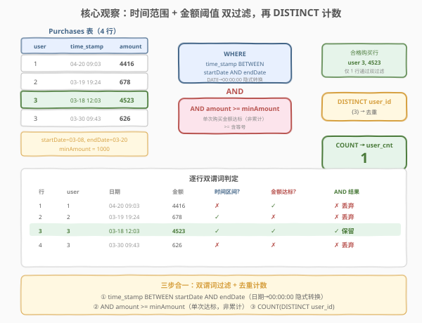
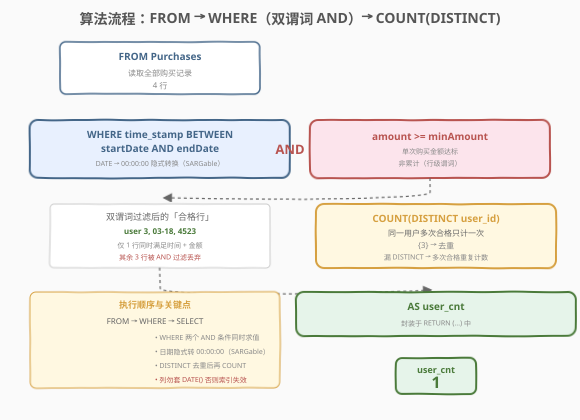
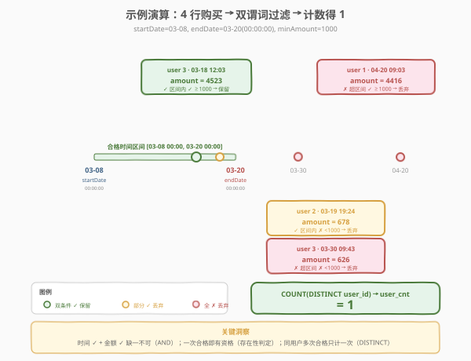

# LeetCode 有资格享受折扣的用户数量 题解

## 1. 题目概述

- **标题 / 题号**：有资格享受折扣的用户数量（#2205，easy）
- **链接**：https://leetcode.cn/problems/the-number-of-users-that-are-eligible-for-discount/
- **难度**：简单
- **标签**：数据库、SQL、`WHERE` 过滤、日期范围、`BETWEEN`、`COUNT(DISTINCT)`、去重计数、存储函数、SARGable、LeetCode 锁题

**题意**：给定 `Purchases` 表，每行记录一次购买行为。编写一个**存储函数** `getUserIDs(startDate, endDate, minAmount)`，查询**有资格享受折扣的用户数量**：即在该时间间隔 $[\text{startDate}, \text{endDate}]$ 内，**至少有一次**购买金额 $\ge \text{minAmount}$ 的不同用户数。

**表结构**：

```text
Table: Purchases
+-------------+----------+
| Column Name | Type     |
+-------------+----------+
| user_id     | int      |  ← 主键之一
| time_stamp  | datetime |  ← 主键之一
| amount      | int      |
+-------------+----------+
(user_id, time_stamp) 是该表的主键（复合主键）。
每一行都包含 ID 为 user_id 的用户的购买时间和支付金额的信息。
```

> ⚠️ **复合主键 `(user_id, time_stamp)`**：同一用户可在不同时间多次购买（多行），但「同一用户同一时刻」不会重复。正因同一用户有多行，「有资格的用户数」需要 `DISTINCT` 去重——否则会把同一用户的多次合格购买重复计数。

**函数签名**：

```sql
CREATE FUNCTION getUserIDs(startDate DATE, endDate DATE, minAmount INT) RETURNS INT
```

**日期语义**（关键约束）：

> 若要将日期转换为时间，两个日期都应该被视为一天的**开始**（即 `endDate = 2022-03-05` 应该被视为时间 `2022-03-05 00:00:00`）。

这意味着时间间隔是 $[\text{startDate}\;00\!:\!00\!:\!00,\; \text{endDate}\;00\!:\!00\!:\!00]$——`endDate` 当天的 00:00:01 及之后**不在**区间内。MySQL 中 `DATETIME` 列与 `DATE` 参数比较时，会自动把 `DATE` 转为 `YYYY-MM-DD 00:00:00` 的 `DATETIME`，恰好实现这一语义。

**示例 1**：

```text
输入：
Purchases 表:
+---------+---------------------+--------+
| user_id | time_stamp          | amount |
+---------+---------------------+--------+
| 1       | 2022-04-20 09:03:00 | 4416   |
| 2       | 2022-03-19 19:24:02 | 678    |
| 3       | 2022-03-18 12:03:09 | 4523   |
| 3       | 2022-03-30 09:43:42 | 626    |
+---------+---------------------+--------+
startDate = 2022-03-08, endDate = 2022-03-20, minAmount = 1000

输出：
+----------+
| user_cnt |
+----------+
| 1        |
+----------+

解释：
只有用户 3 有资格享受折扣。
 - 用户 1 有一次购买金额大于 minAmount（4416 ≥ 1000），但不在时间间隔内（2022-04-20 > endDate）。
 - 用户 2 在时间间隔内有一次购买（2022-03-19），但金额小于 minAmount（678 < 1000）。
 - 用户 3 是唯一一个购买行为同时满足两个条件的用户（2022-03-18 在区间内，4523 ≥ 1000）。
```

**约束**：

- `Purchases` 表的复合主键为 `(user_id, time_stamp)`，行唯一。
- `amount` 为整数。
- 同一 `user_id` 可对应多行（多次购买）。
- `startDate`、`endDate` 为 `DATE` 类型；`minAmount` 为 `INT`。
- 结果返回单行单列 `user_cnt`。

> 💡 **审题关键**：① **两个条件都要满足**——时间在区间内 **且** 金额 $\ge$ minAmount，是 `AND` 关系；② **单次购买金额**而非累计——`WHERE amount >= minAmount` 行级过滤天然表达「该次购买达标」，无需 `SUM` 聚合；③ **用户数**需 `COUNT(DISTINCT user_id)`——同一用户多次合格购买只计一次；④ **日期边界**——`endDate` 是当天 00:00:00 而非 23:59:59，`BETWEEN` 配合 `DATE` 参数恰好匹配。掌握这四点，本题退化为一行 `SELECT COUNT(DISTINCT user_id) FROM Purchases WHERE time_stamp BETWEEN startDate AND endDate AND amount >= minAmount`。

> ⚠️ **重要提示**：本题与 [2230. 查找可享受优惠的用户](https://leetcode.cn/problems/the-users-that-are-eligible-for-discount/) 基本相同——区别仅在于 2230 返回**用户 ID 列表**，本题返回**用户数量**。过滤逻辑完全一致。

## 2. 解题思路

### 2.1 暴力思路：逐用户逐购买遍历

最直觉的过程式思维：取出所有不重复的用户，对每个用户检查其每一次购买——若存在某次购买同时满足「时间在 $[\text{startDate}, \text{endDate}]$ 内」且「金额 $\ge \text{minAmount}$」，则该用户有资格，计数 +1。

```text
users = DISTINCT user_id in Purchases
count = 0
for u in users:
    if any(time_stamp in [startDate, endDate] AND amount >= minAmount for purchase of u):
        count += 1
return count
```

逻辑完全正确——但 SQL 有更声明式的表达：「时间在区间内」和「金额达标」都是**行级**条件（作用于单行购买记录），用 `WHERE` 一步过滤即可——筛后某用户只要有至少一行留下，就说明该用户存在合格购买。再对筛后行 `COUNT(DISTINCT user_id)` 即得「合格用户数」。两步合一条查询，无需显式循环。

> ⚠️ **过程式思维的陷阱**：有人会想先按用户 `GROUP BY` 再 `HAVING SUM(amount) >= minAmount`——这是**错的**。题目要求的是「**单次**购买金额 $\ge$ minAmount」而非「累计金额」。`WHERE amount >= minAmount` 在分组前就过滤掉了不合格的行，剩下每一行的 `amount` 都 $\ge$ minAmount，天然表达「单次达标」。`SUM` 聚合会把多次小额购买累加，导致「单次都不达标但累计达标」的用户被误判为有资格。

### 2.2 核心观察：双谓词行级过滤 + 去重计数



题目的三个语义——「**时间在区间内**」「**金额达标**」「**用户数量**」——分别对应 SQL 的机制，叠加即得答案：

| 题意要求 | SQL 机制 | 语义 |
|----------|----------|------|
| 「时间在 $[\text{startDate}, \text{endDate}]$ 内」 | `time_stamp BETWEEN startDate AND endDate` | **行级日期范围谓词**：MySQL 把 `DATE` 参数转为 `00:00:00` 的 `DATETIME`，`BETWEEN` 闭区间 |
| 「金额 $\ge$ minAmount」 | `amount >= minAmount` | **行级阈值谓词**：单次购买金额达标，`>=` 含等号 |
| 「用户数量」 | `COUNT(DISTINCT user_id)` | **去重聚合**：同一用户多次合格购买只计一次 |

两个行级谓词用 `AND` 连接——只有**同时满足**时间区间和金额阈值的行才被保留。筛后对 `user_id` 去重计数，即得「合格用户数」。

$$\text{user\_cnt} = \left| \{\, \text{user\_id} \mid \exists\, \text{purchase}: \text{time\_stamp} \in [\text{startDate}, \text{endDate}] \;\land\; \text{amount} \ge \text{minAmount} \,\} \right|$$

> 💡 **为什么两个条件都用 `WHERE` 而非 `HAVING`？** 「时间在区间内」和「金额达标」都是**行级**条件——作用于单行购买记录，不依赖聚合。`WHERE` 在分组前过滤行，天然适合。`HAVING` 用于**组级**条件（如「平均金额 $\ge$ minAmount」「至少 3 次达标购买」），本题不需要分组即可表达，`WHERE` 一步到位。

> ⚠️ **日期边界的关键细节**：`endDate` 被视为当天 `00:00:00`，即区间 $[\text{startDate}\;00\!:\!00\!:\!00,\; \text{endDate}\;00\!:\!00\!:\!00]$。`BETWEEN` 是闭区间，`endDate` 当天恰好 `00:00:00` 的购买算入，`00:00:01` 及之后不算。MySQL 比较 `DATETIME` 列与 `DATE` 参数时自动把 `DATE` 转为 `DATETIME`（补 `00:00:00`），行为与此完全一致——无需手动 `CAST`。详见 2.4 节演算与第 5 节扩展。

### 2.3 算法流程图



**逻辑执行步骤**：

| 步骤 | 子句 | 作用 |
|------|------|------|
| ① | `FROM Purchases` | 读取全部购买记录（示例 4 行） |
| ② | `WHERE time_stamp BETWEEN startDate AND endDate` | 行级日期过滤，只留区间内的购买 |
| ③ | `AND amount >= minAmount` | 行级金额过滤，只留达标购买（与 ② `AND` 连接） |
| ④ | `COUNT(DISTINCT user_id)` | 对合格行按用户去重计数 |
| ⑤ | `AS user_cnt` | 命名输出列 |

> 💡 **SQL 子句执行顺序**：`FROM` → `WHERE`（行级过滤，两个 `AND` 条件同时求值）→ `SELECT`（含 `COUNT(DISTINCT)` 聚合）。`WHERE` 先把 4 行筛成合格行，`SELECT` 再对合格行去重计数。两个 `WHERE` 条件的顺序不影响结果（`AND` 满足交换律），但数据库优化器会根据索引选择先评估代价低的谓词。

### 2.4 示例演算

以示例 1 的 4 行购买记录为例，参数 `startDate = 2022-03-08, endDate = 2022-03-20, minAmount = 1000`，观察两阶段处理：



**阶段 ①②③：`WHERE` 双谓词行级过滤**

对 4 行逐行检查「时间在 $[2022\text{-}03\text{-}08\;00\!:\!00\!:\!00,\; 2022\text{-}03\text{-}20\;00\!:\!00\!:\!00]$ 内」**且**「金额 $\ge 1000$」：

| 行 | user_id | time_stamp | amount | 在时间区间内？ | 金额 $\ge$ 1000？ | 双条件满足？ | 去留 |
|----|---------|------------|--------|---------------|-------------------|-------------|------|
| 1 | 1 | 2022-04-20 09:03:00 | 4416 | ✗（4 月 > endDate） | ✓（4416 ≥ 1000） | ✗ | 丢弃 |
| 2 | 2 | 2022-03-19 19:24:02 | 678 | ✓（3-19 在区间内） | ✗（678 < 1000） | ✗ | 丢弃 |
| 3 | 3 | 2022-03-18 12:03:09 | 4523 | ✓（3-18 在区间内） | ✓（4523 ≥ 1000） | ✓ | **保留** |
| 4 | 3 | 2022-03-30 09:43:42 | 626 | ✗（3-30 > endDate） | ✗（626 < 1000） | ✗ | 丢弃 |

过滤后剩 **1 行**合格购买：`(user 3, 2022-03-18 12:03:09, 4523)`。

> 💡 **用户 1 的「错位」**：金额达标（4416）但时间不在区间（4 月 20 日远超 endDate）——说明两个条件缺一不可，`AND` 确保「时间对了但金额不够」「金额够了但时间不对」的购买都被排除。用户 2 则是反面——时间对了但金额不够。只有用户 3 的第一次购买同时满足两个条件。

> ⚠️ **用户 3 的第二次购买**（2022-03-30, 626）：时间不在区间内（3-30 > 3-20），金额也不达标。即便它在时间区间内且金额达标，也不会改变结果——因为 `COUNT(DISTINCT user_id)` 只关心「用户 3 是否有至少一次合格购买」，而非合格购买次数。这是「存在性判定」的核心：**一次合格即有资格**。

**阶段 ④：`COUNT(DISTINCT user_id)`（去重计数）**

对剩余 1 行的 `user_id` 去重后计数：

| 合格购买行 | user_id |
|------------|---------|
| (3, 2022-03-18, 4523) | 3 |

去重后集合 = `{3}`，计数 = **1**。

> ⚠️ **若漏写 `DISTINCT` 会怎样？** `COUNT(user_id)` 直接数行数——本例恰好也是 1（只有 1 行合格）。但若用户 3 有两次合格购买（如 2022-03-18 和 2022-03-19 都达标），`COUNT(user_id)` 会得 2，把同一用户计了两次。`COUNT(DISTINCT user_id)` 则始终得 1——同一用户多次合格只计一次。**口诀**：问「用户数」用 `COUNT(DISTINCT)`，问「合格购买数」用 `COUNT(*)`。

## 3. 参考代码

### SQL（解法 A：`WHERE` 双谓词 + `COUNT(DISTINCT)`，推荐）

```sql
CREATE FUNCTION getUserIDs(startDate DATE, endDate DATE, minAmount INT) RETURNS INT
BEGIN
  RETURN (
      SELECT COUNT(DISTINCT user_id) AS user_cnt
      FROM Purchases
      WHERE time_stamp BETWEEN startDate AND endDate
        AND amount >= minAmount
  );
END
```

> 💡 **写法要点**：
> - `time_stamp BETWEEN startDate AND endDate`：MySQL 把 `DATE` 参数转为 `DATETIME`（补 `00:00:00`），`BETWEEN` 闭区间恰好匹配「两日期均视为当天开始」的语义。
> - `AND amount >= minAmount`：与时间条件 `AND` 连接，行级双谓词同时满足。`>=` 含等号，`amount = minAmount` 算合格。
> - `COUNT(DISTINCT user_id)`：同一用户多次合格购买只计一次——这是「用户数」与「购买数」的区别。
> - `RETURN (...)`：存储函数返回标量 `INT`，调用 `SELECT getUserIDs('2022-03-08', '2022-03-20', 1000)` 即得一行一列结果。
> - ✓ **最自然**：两个 `WHERE` 条件表达「时间 + 金额」，`COUNT(DISTINCT)` 表达「用户数」，语义一气呵成。

### SQL（解法 B：显式范围比较，等价写法）

```sql
CREATE FUNCTION getUserIDs(startDate DATE, endDate DATE, minAmount INT) RETURNS INT
BEGIN
  RETURN (
      SELECT COUNT(DISTINCT user_id) AS user_cnt
      FROM Purchases
      WHERE time_stamp >= startDate
        AND time_stamp <= endDate
        AND amount >= minAmount
  );
END
```

> 💡 **解法 B 与解法 A 的关系**：`BETWEEN x AND y` 等价于 `>= x AND <= y`（闭区间）。MySQL 对 `DATE` 参数的隐式转换在两种写法中完全一致——`time_stamp >= startDate` 把 `startDate` 转为 `startDate 00:00:00`，`time_stamp <= endDate` 把 `endDate` 转为 `endDate 00:00:00`。解法 B 把区间边界拆开写，更直观地展示「起止边界各是什么」，适合口述思路或调试单边边界。两者执行计划相同，优先选 A（更紧凑）。

### SQL（解法 C：`GROUP BY` + 子查询，思路对照）

```sql
CREATE FUNCTION getUserIDs(startDate DATE, endDate DATE, minAmount INT) RETURNS INT
BEGIN
  RETURN (
      SELECT COUNT(*) AS user_cnt
      FROM (
          SELECT DISTINCT user_id
          FROM Purchases
          WHERE time_stamp BETWEEN startDate AND endDate
            AND amount >= minAmount
      ) t
  );
END
```

> 💡 **解法 C 的思路**：内层子查询先 `WHERE` 双谓词过滤合格行，再 `DISTINCT user_id` 把同一用户多次合格购买归并为一行——每个合格用户至多剩一行。外层 `COUNT(*)` 数行数即「合格用户数」。逻辑与解法 A 完全等价，只是把「去重」用 `DISTINCT` + 子查询显式表达。优化器通常把两者优化为相同的执行计划（哈希去重 / 排序去重）。解法 A 更紧凑，解法 C 更直观展示「先过滤再去重」的过程。

### Python（pandas）

```python
import pandas as pd

def get_user_ids(purchases: pd.DataFrame, startDate: str, endDate: str, minAmount: int) -> int:
    mask = (purchases['time_stamp'] >= startDate) & \
           (purchases['time_stamp'] <= endDate) & \
           (purchases['amount'] >= minAmount)
    return int(purchases.loc[mask, 'user_id'].nunique())
```

> 💡 **pandas 对照**：
> - `purchases['time_stamp'] >= startDate` 对应 SQL 的 `time_stamp >= startDate`，pandas 会把字符串 `startDate` 与 `datetime` 列比较，语义一致。
> - 三个布尔 Series 用 `&` 连接（注意每个条件要加括号，因 `&` 优先级高于 `>=`），对应 SQL 的 `AND`。
> - `purchases.loc[mask, 'user_id'].nunique()` 对应 `COUNT(DISTINCT user_id)`——`.nunique()` 即「number of unique」，天然去重计数。
> - 注意 `.nunique()` 默认忽略 `NaN`，与 SQL 的 `COUNT(DISTINCT)`（忽略 `NULL`）行为一致。

## 4. 复杂度分析

| 维度 | 解法 A（`BETWEEN` + `COUNT(DISTINCT)`） | 解法 B（显式范围） | 解法 C（子查询） | pandas |
|------|-----------------------------------------|--------------------|------------------|--------|
| **时间** | $O(n)$ | $O(n)$ | $O(n)$ | $O(n)$ |
| **空间** | $O(k)$ | $O(k)$ | $O(k)$ | $O(n)$ |
| **写法** | 紧凑一行 `BETWEEN` | 拆开边界 | 子查询归并 | DataFrame |
| **推荐度** | ✓ **首选** | ✓ 思路对照 | ✓ 可读性 | ✓ 验证用 |

> - $n$ = `Purchases` 表行数，$k$ = 合格的不同用户数（去重后集合大小，$k \le n$）
> - **时间**：全表扫描一次 $O(n)$ + 对筛后行去重 $O(k)$。若 `time_stamp` 列有索引，`BETWEEN` 范围谓词可走索引范围扫描，只读区间内行；若建 `(time_stamp, amount, user_id)` 复合索引可实现 index-only scan（覆盖索引），避免回表。
> - **空间**：去重需物化用户集合 $O(k)$；pandas 需 $O(n)$ 存 DataFrame。
> - **SARGable**：`time_stamp BETWEEN startDate AND endDate` 是 SARGable 的（Search Argument Able）——索引可用。**切勿**写成 `DATE(time_stamp) BETWEEN ...`，对列套函数会使索引失效，退化为全表扫描。详见第 5 节。

## 5. 扩展：日期边界处理与 SARGable

### 5.1 `BETWEEN` 的隐式类型转换

MySQL 比较不同类型时，会把「较低」类型提升为「较高」类型。`DATE` 与 `DATETIME` 比较时，`DATE` 被补上 `00:00:00` 转为 `DATETIME`：

| 写法 | 等价展开 | endDate 当天 09:00:00 的购买是否纳入？ |
|------|----------|---------------------------------------|
| `time_stamp BETWEEN startDate AND endDate` | `time_stamp BETWEEN '...startDate 00:00:00' AND '...endDate 00:00:00'` | ✗ 不纳入（> endDate 00:00:00） |
| `time_stamp >= startDate AND time_stamp <= endDate` | 同上 | ✗ 不纳入 |
| `DATE(time_stamp) BETWEEN startDate AND endDate` | `DATE(time_stamp) BETWEEN ... AND ...` | ✓ 纳入（`DATE(...)` 丢掉时间部分，整天比较） |

> ⚠️ **第三种写法是陷阱**：`DATE(time_stamp)` 会把 `2022-03-20 09:00:00` 截断为 `2022-03-20`，与 `endDate = 2022-03-20` 相等，导致**整个 endDate 当天**都被纳入——与题意「endDate 视为当天开始」矛盾。此外，对列套函数 `DATE(time_stamp)` 会使 `time_stamp` 上的索引**失效**（非 SARGable），退化为全表扫描。正确做法是让参数侧做转换（MySQL 自动完成），而非对列做转换。

### 5.2 SARGable：让索引可用

**SARGable**（Search Argument Able）指谓词能利用索引。核心原则：**不要对索引列套函数**。

| 写法 | SARGable？ | 原因 |
|------|-----------|------|
| `time_stamp BETWEEN startDate AND endDate` | ✓ | 列无函数，参数侧隐式转换不影响索引 |
| `time_stamp >= startDate AND time_stamp <= endDate` | ✓ | 同上 |
| `DATE(time_stamp) BETWEEN startDate AND endDate` | ✗ | 对 `time_stamp` 套了 `DATE()`，索引失效 |
| `YEAR(time_stamp) = 2022 AND MONTH(time_stamp) = 3` | ✗ | 对列套 `YEAR()`/`MONTH()`，索引失效 |

> 💡 **口诀**：「函数套在参数上，不套在列上」。`time_stamp >= startDate` 把转换留给 MySQL 在参数侧完成，列保持「裸」状态，索引可用。`DATE(time_stamp) >= startDate` 把函数套在列上，索引失效。生产中日期范围查询务必用 `BETWEEN` 或 `>= / <=`，避免 `DATE()` / `YEAR()` / `MONTH()` 等列函数。

### 5.3 若题目改为「累计金额达标」

若题意改为「用户在区间内**累计**购买金额 $\ge$ minAmount 则有资格」，条件从行级升级为**组级**，需 `GROUP BY` + `HAVING`：

```sql
SELECT COUNT(*) AS user_cnt
FROM (
    SELECT user_id
    FROM Purchases
    WHERE time_stamp BETWEEN startDate AND endDate
    GROUP BY user_id
    HAVING SUM(amount) >= minAmount
) t;
```

> 💡 注意 `WHERE time_stamp BETWEEN startDate AND endDate` 仍在——它先过滤出区间内的购买行，再 `GROUP BY user_id` 求和。`HAVING SUM(amount) >= minAmount` 判定「累计达标」。这与本题「单次达标」的 `WHERE amount >= minAmount` 形成鲜明对照：**行级条件用 `WHERE`，组级条件用 `HAVING`**。本题是行级，故无需 `GROUP BY`。

### 5.4 与 2230 题的关系

[2230. 查找可享受优惠的用户](https://leetcode.cn/problems/the-users-that-are-eligible-for-discount/) 与本题过滤逻辑完全相同，区别仅在输出：

| 题号 | 输出 | SQL 差异 |
|------|------|----------|
| 2205（本题） | 合格用户**数量**（`INT`） | `SELECT COUNT(DISTINCT user_id) ... RETURNS INT` |
| 2230 | 合格用户 **ID 列表**（多行） | `SELECT DISTINCT user_id ... ORDER BY user_id` |

2205 封装为 `CREATE FUNCTION ... RETURNS INT`（返回标量），2230 是普通 `SELECT` 查询（返回结果集）。掌握 2205 的过滤逻辑，2230 只需把 `COUNT(DISTINCT user_id)` 换成 `DISTINCT user_id`。

## 6. 面试要点

1. **为什么用 `COUNT(DISTINCT user_id)` 而非 `COUNT(*)`？**

   > 题目问「用户数量」即不同用户的个数。`WHERE` 双谓词筛出的是**合格购买行**，同一用户可能有多行合格购买（如区间内有两次都达标）。`COUNT(*)` 数的是合格行数，会重复计数；`COUNT(DISTINCT user_id)` 把同一用户的多行归并为一次，得不同用户数。**口诀**：问「用户数」用 `COUNT(DISTINCT)`，问「合格购买数」用 `COUNT(*)`。

2. **`BETWEEN startDate AND endDate` 在 MySQL 中如何处理 `DATE` 与 `DATETIME` 的类型差异？**

   > MySQL 把 `DATE` 参数隐式转为 `DATETIME`（补 `00:00:00`），然后与 `DATETIME` 列做闭区间比较。即 `time_stamp BETWEEN 'startDate 00:00:00' AND 'endDate 00:00:00'`。这与题意「两个日期均视为当天开始」完全吻合——`endDate` 当天的 `00:00:01` 及之后不在区间内。无需手动 `CAST`。

3. **为什么不能写 `DATE(time_stamp) BETWEEN startDate AND endDate`？**

   > 两个问题：① **语义错误**——`DATE(time_stamp)` 丢弃时间部分，`2022-03-20 09:00:00` 被截断为 `2022-03-20`，等于 `endDate`，导致整个 endDate 当天都被纳入，与题意矛盾；② **索引失效**——对列套函数使 `time_stamp` 上的索引无法用于范围扫描，退化为全表扫描。正确做法是让参数侧做转换（MySQL 自动完成），列保持「裸」状态，即 SARGable。

4. **「单次购买达标」和「累计购买达标」在 SQL 上有什么区别？**

   > 「单次达标」是**行级**条件——`WHERE amount >= minAmount` 在分组前过滤掉不合格的行，剩下每行都达标，天然表达「存在一次合格购买」。「累计达标」是**组级**条件——需 `GROUP BY user_id HAVING SUM(amount) >= minAmount`，先分组求和再判定。本题是单次达标，用 `WHERE`；若改为累计达标，`WHERE` 无法表达聚合条件，才需 `HAVING`。**行级用 `WHERE`，组级用 `HAVING`** 是 SQL 查询设计的基础分工。

5. **如果 `Purchases` 表很大（数亿行），如何优化？**

   > 在 `time_stamp` 列建索引，使 `BETWEEN` 范围谓词走索引范围扫描，只读区间内行。进一步建 `(time_stamp, amount, user_id)` 复合索引实现 index-only scan（覆盖索引）——查询只需访问索引即可完成过滤 + 去重计数，无需回表读数据行。面试中提到「`time_stamp` 建索引把全表扫描降为范围扫描，复合索引 `(time_stamp, amount, user_id)` 可覆盖查询」即可。同时强调避免 `DATE(time_stamp)` 等非 SARGable 写法。

> 💡 **一句话总结**：2205 是 SQL **"双谓词行级过滤 + 去重计数"** 的入门招牌题——核心就一句 `SELECT COUNT(DISTINCT user_id) FROM Purchases WHERE time_stamp BETWEEN startDate AND endDate AND amount >= minAmount`，封装为 `CREATE FUNCTION ... RETURNS INT`。考点覆盖四要素：**时间范围（`BETWEEN`，DATE 隐式转 DATETIME）、金额阈值（`>=`，单次非累计）、去重计数（`COUNT(DISTINCT)`）、SARGable（列不套函数）**。理解这四点，所有「多条件过滤 + 计数」类 SQL 题都能覆盖。

## 同类练习题

| # | 题目 | 与本题的关联 |
|---|------|-------------|
| 2082 | [富有客户的数量](https://leetcode.cn/problems/the-number-of-rich-customers/)（[题解](../2001-2100/2082_富有客户的数量.md)） | 单谓词阈值过滤 + `COUNT(DISTINCT)`，是本题去掉日期条件的基础版，对照体会「多一个 `AND` 谓词」的叠加 |
| 2230 | [查找可享受优惠的用户](https://leetcode.cn/problems/the-users-that-are-eligible-for-discount/) | 与本题过滤逻辑完全相同，区别仅返回用户 ID 列表而非数量——把 `COUNT(DISTINCT user_id)` 换成 `DISTINCT user_id` 即可 |
| 1327 | [列出指定时间段内所有的下单产品](https://leetcode.cn/problems/list-the-products-ordered-in-a-period/)（[题解](../1301-1400/1327_列出指定时间段内所有的下单产品.md)） | 日期范围 `BETWEEN` 过滤 + `GROUP BY` + `HAVING` 聚合，在 2205 的日期过滤基础上叠加组级条件 |
| 584 | [寻找用户推荐人](https://leetcode.cn/problems/find-customer-referee/)（[题解](../0501-0600/584_寻找用户推荐人.md)） | `WHERE` 单条件行级过滤 + `NULL` 处理，同为「行级筛选」入门题，对照理解多条件 `AND` 的组合 |
| 1693 | [每天的领导和合伙人](https://leetcode.cn/problems/daily-leads-and-partners/)（[题解](../1601-1700/1693_每天的领导和合伙人.md)） | `GROUP BY` + `COUNT(DISTINCT)` 多列分组去重计数，在 2205 的去重计数基础上叠加分组维度 |
