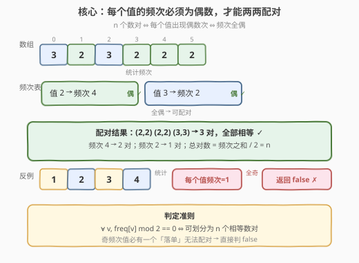
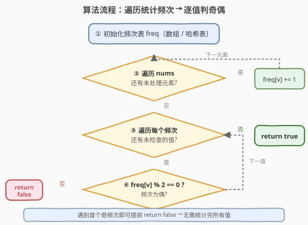

# 将数组划分成相等数对

- **题目名称**：将数组划分成相等数对
- **链接**：[2206. 将数组划分成相等数对](https://leetcode.cn/problems/divide-array-into-equal-pairs/)
- **难度**：简单
- **标签**：数组、哈希表、位运算

## 1. 题目概述

给你一个整数数组 `nums`，它包含 $2 \cdot n$ 个整数。需要将 `nums` 划分成 $n$ 个数对，满足：

- 每个元素**只属于一个**数对。
- 同一数对中的元素**相等**。

如果可以将 `nums` 划分成 $n$ 个数对，返回 `true`，否则返回 `false`。

**示例 1**：

```text
输入：nums = [3,2,3,2,2,2]
输出：true
解释：nums 中总共有 6 个元素，应划分成 6 / 2 = 3 个数对。
可以划分成 (2, 2) 、(3, 3) 和 (2, 2) ，满足所有要求。
```

**示例 2**：

```text
输入：nums = [1,2,3,4]
输出：false
解释：无法将 nums 划分成 4 / 2 = 2 个数对且满足所有要求。
```

**约束条件**：

- $\text{nums.length} == 2 \cdot n$
- $1 \le n \le 500$
- $1 \le \text{nums[i]} \le 500$

> 💡 本题是「频次奇偶判定」类问题的最简入门：每个值必须出现偶数次才能两两配对。一旦把题意翻译成「所有频次为偶」的充要条件，剩下的就是一次遍历统计 + 一次遍历判定。约束 $\text{nums[i]} \le 500$ 还允许用定长数组代替哈希表，做到 $O(1)$ 额外空间。

---

## 2. 解题思路

### 2.1 暴力思路：排序后相邻配对

最直白的做法是先排序，再依次检查相邻两个元素是否相等——若每对都相等则返回 `true`，否则 `false`。

```text
sort(nums)
for i in 0, 2, 4, ..., n-2:
    if nums[i] != nums[i+1]:
        return false
return true
```

排序后相同的值必然相邻，因此「能否配对」等价于「每个相邻对是否相等」。时间 $O(n \log n)$，空间 $O(\log n)$（排序栈）。完全能过，但**多排了一次序**——题意只关心频次的奇偶性，并不需要元素的实际顺序。

> ⚠️ 排序的代价在于「做了比需求更多的事」：我们只需要知道每个值出现了几次，而不需要它们排好序后的位置。频次统计能把 $O(n \log n)$ 降到 $O(n)$。

### 2.2 核心观察：频次全偶 ⇔ 可配对



**关键转化**：把「划分成 $n$ 个相等数对」翻译成频次语言。

设值 $v$ 在数组中出现了 $c_v$ 次。每个数对由两个相等的值组成，因此值 $v$ 恰好贡献 $c_v / 2$ 个数对。要让所有元素都被恰好使用一次（每个元素只属于一个数对），**每个值的出现次数都必须是偶数**：

$$
\text{可划分} \iff \forall v,\; c_v \bmod 2 = 0
$$

**必要性**：若某值 $v$ 的频次 $c_v$ 为奇数，则配对后会剩下一个 $v$ 无法找到相等的伙伴，必失败。

**充分性**：若所有频次均为偶数，则每个值 $v$ 可形成 $c_v / 2$ 个对，总对数 $= \sum_v c_v / 2 = (2n) / 2 = n$，恰好满足题意。

> 💡 **为什么不用真的去配对？** 因为「能否配对」是一个**全局性质**，只依赖频次的奇偶性，与具体配对方案无关。一旦所有频次为偶，任何「同值两两打包」的策略都成立——这是「判定问题」与「构造问题」的边界：本题只问能否，不必给出方案。

**边界与特例**：

- **所有元素相同**（如 `[5,5,5,5]`）：单一值频次 $= 2n$（偶），返回 `true`。
- **所有元素互异**（如 `[1,2,3,4]`）：每个值频次 $= 1$（奇），返回 `false`。
- **单个值频次为奇**：即破坏条件，立即 `false`，无需检查其余值——这是**提前终止**的依据。

### 2.3 算法流程图



1. **初始化频次表** `freq`：哈希表或定长数组（值域 $[1,500]$ → 数组大小 $501$）。
2. **遍历 `nums`**：对每个元素 `v`，执行 `freq[v] += 1`。
3. **遍历频次表**：对每个值 `v` 的频次 `freq[v]`，判定 `freq[v] % 2 == 0`。
4. **遇到奇频次**：立即 `return false`（提前终止）。
5. **全部为偶**：`return true`。

> 💡 提前终止是关键优化：最坏情况（所有频次都偶）需检查全部值；但只要遇到一个奇频次即可判定无解，无需统计完所有频次。不过本题频次表至多 500 项，差异可忽略。

### 2.4 示例演算

![示例演算：[3,2,3,2,2,2] 与 [1,2,3,4]](../images/2206_example_walkthrough.svg)

**示例 1：`nums = [3,2,3,2,2,2]`**

| 值 | 频次 | $c_v \bmod 2$ | 判定 |
|----|------|---------------|------|
| 2  | 4    | 0             | 偶 ✓ |
| 3  | 2    | 0             | 偶 ✓ |

所有频次为偶，可形成 $4/2 + 2/2 = 2 + 1 = 3$ 对（即 $n = 6/2 = 3$），返回 `true` ✓

**示例 2：`nums = [1,2,3,4]`**

| 值 | 频次 | $c_v \bmod 2$ | 判定 |
|----|------|---------------|------|
| 1  | 1    | 1             | 奇 ✗ |

值 1 频次为 1（奇），落单无法配对，**立即返回 `false`** ✓（无需继续检查值 2/3/4）

> ⚠️ 示例 2 中四个值频次都是 1，但只要检查到第一个奇频次即可终止。这是「判定问题」的优势——找到反例即可否决，不必枚举所有证据。

---

## 3. 参考代码

### C++（定长数组版，推荐）

```cpp
class Solution {
  public:
    bool divideArray(vector<int>& nums) {
        int freq[501] = {0};
        for (int v : nums) {
            ++freq[v];
        }
        for (int v = 1; v <= 500; ++v) {
            if (freq[v] % 2 != 0) {
                return false;
            }
        }
        return true;
    }
};
```

> 💡 约束 $1 \le \text{nums[i]} \le 500$ 使得定长数组 `freq[501]` 是最优选择：$O(1)$ 额外空间（与 $n$ 无关）、无哈希开销、缓存友好。`int` 初始化为 `{0}` 保证全零起始。

### C++（哈希表版，值域不受限时通用）

```cpp
class Solution {
  public:
    bool divideArray(vector<int>& nums) {
        unordered_map<int, int> freq;
        for (int v : nums) {
            ++freq[v];
        }
        for (auto& [v, c] : freq) {
            if (c % 2 != 0) {
                return false;
            }
        }
        return true;
    }
};
```

> ⚠️ 当值域未知或稀疏时用哈希表更通用，但本题值域紧凑，定长数组更优。两种写法逻辑一致，仅频次表实现不同。

### C++（排序版，对照参考）

```cpp
class Solution {
  public:
    bool divideArray(vector<int>& nums) {
        sort(nums.begin(), nums.end());
        for (int i = 0; i < (int)nums.size(); i += 2) {
            if (nums[i] != nums[i + 1]) {
                return false;
            }
        }
        return true;
    }
};
```

### Python（Counter 版，推荐）

```python
class Solution:
    def divideArray(self, nums: List[int]) -> bool:
        from collections import Counter
        for c in Counter(nums).values():
            if c % 2 != 0:
                return False
        return True
```

> 💡 `Counter(nums)` 一次完成频次统计，`.values()` 直接遍历频次。Python 写法简洁，但本质与 C++ 数组版完全一致。

### Python（排序版，对照参考）

```python
class Solution:
    def divideArray(self, nums: List[int]) -> bool:
        nums.sort()
        for i in range(0, len(nums), 2):
            if nums[i] != nums[i + 1]:
                return False
        return True
```

---

## 4. 复杂度分析

| 维度 | 复杂度 | 说明 |
|------|--------|------|
| 时间复杂度（数组版） | $O(n + V)$ | 遍历 `nums` 统计 $O(n)$；遍历值域 $[1,V]$ 检查 $O(V)$，本题 $V = 500$ 视为常数 |
| 时间复杂度（哈希版） | $O(n)$ | 统计 $O(n)$；检查频次表项数 $\le \min(n, V)$，整体线性 |
| 时间复杂度（排序版） | $O(n \log n)$ | 排序主导，再 $O(n)$ 扫描相邻对 |
| 空间复杂度（数组版） | $O(V)$ | 定长数组大小 $V+1 = 501$，与 $n$ 无关，可视为 $O(1)$ |
| 空间复杂度（哈希版） | $O(\min(n, V))$ | 哈希表至多存 $\min(n, V)$ 个不同值 |
| 空间复杂度（排序版） | $O(\log n)$ | 排序栈空间（原地排序） |

> 💡 本题 $n \le 500$、$V = 500$，三种解法均轻松 AC。差异在常数与可扩展性：值域紧凑时数组版最优；值域未知时哈希版通用；排序版代码最短但多一次 $O(n \log n)$ 排序。养成「先看值域再选频次表实现」的习惯。

---

## 5. 扩展：位运算消去法（异或思路的边界）

由于「同值两两相消」天然让人联想到**异或**（$v \oplus v = 0$），一个直觉想法是：对整个数组求异或，若结果为 0 则可配对。**但这个想法是错的**：

$$
1 \oplus 2 \oplus 3 = 0 \quad \text{但 } [1,2,3] \text{ 显然无法配对}
$$

异或只能判定「所有值的异或和为 0」，这等价于「每个二进制位上 1 的总数为偶」，**不等于**「每个值的出现次数为偶」。不同值之间的异或会相互抵消，掩盖了频次的奇偶性。

**正确的位运算变体**是按值分桶后对每个桶单独判奇偶，退化为频次法。因此本题没有真正「全局异或」的捷径，频次统计是最直接的正确解法。

> ⚠️ 异或判重的有效场景是「**唯一**落单数」问题（如 136. 只出现一次的数字）：当且仅当只有一个值频次为奇时，异或和恰好等于该值。本题允许多个奇频次值，异或失效。

---

## 6. 面试要点

1. **为什么「频次全偶」是可配对的充要条件？**

   - **必要性**：每个数对由两个相等的值组成，若值 $v$ 出现 $c_v$ 次，则它贡献 $c_v / 2$ 个对。$c_v$ 为奇时必剩一个 $v$ 落单，无法配对。
   - **充分性**：所有 $c_v$ 为偶时，每个值 $v$ 形成 $c_v / 2$ 个对，总对数 $= \sum c_v / 2 = 2n / 2 = n$，恰好覆盖所有元素。因此条件既必要又充分。

2. **排序法和频次法各自的时间复杂度？为什么选频次法？**

   - 排序法 $O(n \log n)$，频次法 $O(n)$（值域常数时）。频次法更快的原因是：题意只关心「每个值出现几次」，不需要元素的相对顺序。排序做了比需求更多的工作（确定全序），而频次统计只提取必要信息。

3. **为什么可以遇到首个奇频次就提前 return false？**

   - 这是判定问题的单调性：结论是「**所有**频次为偶」，其否定是「**存在**一个频次为奇」。只要找到一个反例（奇频次值），原命题即被否决，无需继续验证。这是「存在性否定」与「全称性肯定」的对偶——找反例比穷举所有证据更快。

4. **定长数组和哈希表在什么情况下选哪个？**

   - 值域**紧凑且已知**（如本题 $[1,500]$）选定长数组：$O(1)$ 查询、无哈希开销、缓存友好，空间 $O(V)$ 与 $n$ 无关。值域**稀疏或未知**（如 $[-10^9, 10^9]$）选哈希表：空间 $O(\min(n, V))$，避免预分配大数组。判断标准：$V$ 与 $n$ 同阶或更小时用数组，$V \gg n$ 时用哈希。

5. **能否用异或一次性判定？为什么不行？**

   - 不能。异或和为 0 只保证「所有二进制位上 1 的总数为偶」，不等价于「每个值的出现次数为偶」。不同值的异或会跨值抵消（如 $1 \oplus 2 \oplus 3 = 0$ 但无法配对）。异或仅适用于「恰好一个落单数」的场景（136 题），本题允许多个奇频次值，异或失效。

---

## 7. 同类练习题

- [914. 卡牌分组](https://leetcode.cn/problems/x-of-a-kind-in-a-deck-of-cards/)：同样统计频次，但要求所有频次有大于 1 的公约数，是本题「频次奇偶」升级为「频次 GCD」的进阶
- [1512. 好数对的数目](https://leetcode.cn/problems/number-of-good-pairs/)：统计同值数对个数，频次 $c_v$ 贡献 $\binom{c_v}{2}$ 个对，与本题共享频次统计前置步骤
- [2176. 统计数组中相等且可以被整除的数对](https://leetcode.cn/problems/count-equal-and-divisible-pairs-in-an-array/)（[题解](../2101-2200/2176_统计数组中相等且可以被整除的数对.md)）：按值分组枚举同值数对，是本题「判定能否配对」延伸为「计数有效配对」的同类
- [136. 只出现一次的数字](https://leetcode.cn/problems/single-number/)：异或找唯一落单数，是本题「位运算失效边界」的正面对照——异或仅在恰好一个奇频次时有效
- [2244. 完成所有任务需要的最少轮数](https://leetcode.cn/problems/minimum-rounds-to-complete-all-tasks/)：频次统计 + 每个频次拆成 2 或 3 的和求最小轮数，是本题「频次全偶判定」升级为「频次拆分优化」的进阶
